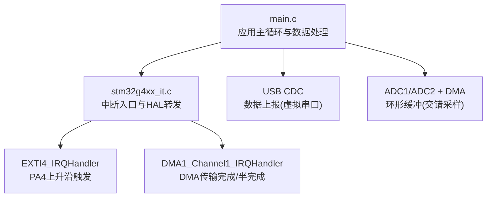
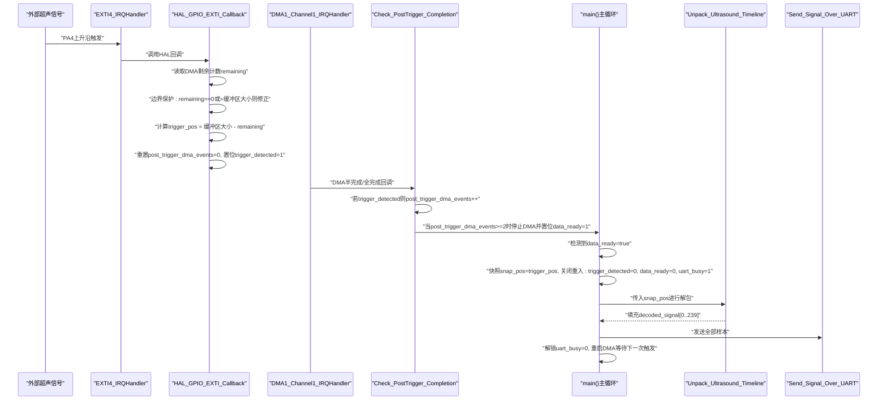
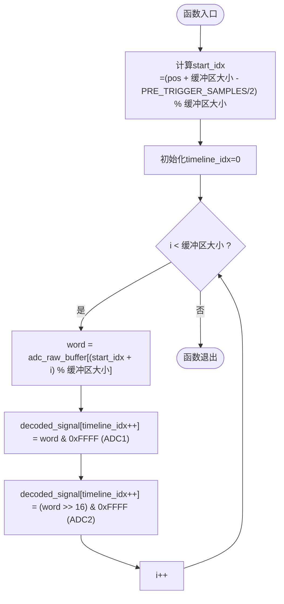
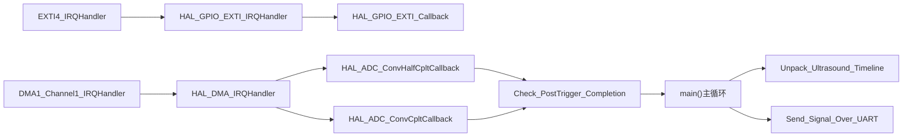

# ADC数据处理算法

<cite>
**本文引用的文件**   
- [main.c](file://Core/Src/main.c)
- [stm32g4xx_it.c](file://Core/Src/stm32g4xx_it.c)
- [README.md](file://README.md)
</cite>

## 目录
1. [简介](#简介)
2. [项目结构](#项目结构)
3. [核心组件](#核心组件)
4. [架构总览](#架构总览)
5. [详细组件分析](#详细组件分析)
6. [依赖关系分析](#依赖关系分析)
7. [性能考量](#性能考量)
8. [故障排查指南](#故障排查指南)
9. [结论](#结论)
10. [附录](#附录)

## 简介
本技术文档聚焦于STM32G474平台上的ADC数据采集与处理算法，重点解析Unpack_Ultrasound_Timeline函数的数据解包流程：将DMA环形缓冲区中的交错双通道数据重组为线性时间轴，并围绕触发位置计算、预/后触发样本分配策略、数据完整性检查与错误处理进行系统化说明。文档同时提供面向初学者的基础概念讲解与面向高级开发者的优化建议，帮助读者理解超声波信号采集链路中从硬件到软件的数据流转过程。

## 项目结构
本项目基于STM32CubeMX生成的工程框架，核心应用逻辑集中在main.c中，中断服务程序在stm32g4xx_it.c中转发至HAL层回调，README.md提供了系统功能概述与硬件要求。

图表来源
- [main.c:219-290](file://Core/Src/main.c#L219-L290)
- [stm32g4xx_it.c:205-228](file://Core/Src/stm32g4xx_it.c#L205-L228)

章节来源
- [main.c:219-290](file://Core/Src/main.c#L219-L290)
- [stm32g4xx_it.c:205-228](file://Core/Src/stm32g4xx_it.c#L205-L228)
- [README.md:1-12](file://README.md#L1-L12)

## 核心组件
- 环形缓冲区与线性时间轴
  - 环形缓冲区adc_raw_buffer：大小为CIRCULAR_BUFFER_SIZE（120个uint32_t），每个元素包含两个16位样本（低16位为ADC1，高16位为ADC2），实现双通道交错采样。
  - 线性时间轴decoded_signal：大小为TOTAL_SAMPLES（240个uint16_t），按时间顺序存放解包后的单通道样本序列。
- 触发与状态标志
  - trigger_pos：记录触发时刻对应的环形缓冲区索引。
  - data_ready、trigger_detected、post_trigger_dma_events、uart_busy：用于ISR与主循环之间的同步与互斥保护。
- 关键函数
  - HAL_GPIO_EXTI_Callback：捕获触发边沿，读取DMA剩余计数以定位触发位置。
  - Check_PostTrigger_Completion：统计HT/TC事件，确保足够的后触发样本后再停止DMA并置位data_ready。
  - Unpack_Ultrasound_Timeline：根据trigger_pos快照，将环形缓冲区中的数据按时间顺序解包到线性时间轴。
  - Send_Signal_Over_UART：将解码后的样本通过USB CDC发送至上位机。

章节来源
- [main.c:53-70](file://Core/Src/main.c#L53-L70)
- [main.c:91-171](file://Core/Src/main.c#L91-L171)
- [main.c:178-212](file://Core/Src/main.c#L178-L212)

## 架构总览
下图展示了从硬件触发到数据上报的完整时序与数据流。

图表来源
- [stm32g4xx_it.c:205-228](file://Core/Src/stm32g4xx_it.c#L205-L228)
- [main.c:91-171](file://Core/Src/main.c#L91-L171)
- [main.c:178-212](file://Core/Src/main.c#L178-L212)
- [main.c:219-290](file://Core/Src/main.c#L219-L290)

## 详细组件分析

### 触发位置计算与边界保护机制
- 触发位置计算公式
  - 在EXTI回调中，读取DMA剩余待传输计数remaining，使用公式：
    - trigger_pos = CIRCULAR_BUFFER_SIZE - remaining
  - 该公式基于DMA环形缓冲区的写入指针与NDTR寄存器之间的关系：当DMA已写入N个元素时，remaining等于缓冲区大小减去已写入数量，从而可反推出当前写入位置。
- 边界保护
  - 对remaining进行边界校验：若remaining为0或大于缓冲区大小，将其修正为1，避免在NDTR重载瞬态期间出现越界或零除风险。
  - 在main循环中，先快照trigger_pos并立即关闭重入（设置trigger_detected=0与uart_busy=1），保证后续解包与发送阶段不会受到新的触发干扰。

章节来源
- [main.c:91-113](file://Core/Src/main.c#L91-L113)
- [main.c:264-271](file://Core/Src/main.c#L264-L271)

### 预触发与后触发样本分配策略
- 参数定义
  - PRE_TRIGGER_SAMPLES = 80（对应约10 µs @ 8 MSPS）
  - POST_TRIGGER_SAMPLES = 160（对应约20 µs @ 8 MSPS）
  - TOTAL_SAMPLES = 240（即80+160）
- 分配策略
  - 环形缓冲区大小为120个uint32_t，每个uint32_t包含两个16位样本，因此总共可容纳240个样本。
  - 解包起始索引start_idx的计算考虑了触发点前后样本的对称性：
    - start_idx = (trigger_pos + CIRCULAR_BUFFER_SIZE - (PRE_TRIGGER_SAMPLES / 2)) % CIRCULAR_BUFFER_SIZE
  - 该策略使触发点大致位于线性时间轴的中间区域，便于观察触发前与触发后的波形特征。
- 作用
  - 预触发样本用于捕捉触发前的基线与回波起始信息；后触发样本用于分析回波的峰值、衰减等特征，支撑超声信号分析与测量。

章节来源
- [main.c:53-56](file://Core/Src/main.c#L53-L56)
- [main.c:156-171](file://Core/Src/main.c#L156-L171)

### 交错数据的重组逻辑与32位字拆分
- 数据布局
  - adc_raw_buffer[i]为32位字：低16位为ADC1样本，高16位为ADC2样本。
- 重组步骤
  - 遍历环形缓冲区，按时间顺序读取每个32位字。
  - 将低16位写入decoded_signal[timeline_idx++]作为偶数索引样本（ADC1）。
  - 将高16位写入decoded_signal[timeline_idx++]作为奇数索引样本（ADC2）。
- 结果
  - decoded_signal形成按时间顺序排列的240个16位样本序列，满足后续分析与上传需求。

章节来源
- [main.c:156-171](file://Core/Src/main.c#L156-L171)

### Unpack_Ultrasound_Timeline算法流程图

图表来源
- [main.c:156-171](file://Core/Src/main.c#L156-L171)

### 后触发完成判定与DMA控制
- 事件计数
  - 在DMA半完成与全完成回调中，若trigger_detected为真，则post_trigger_dma_events自增。
  - 当post_trigger_dma_events达到2（一次半完成+一次全完成），认为已收集到足够数量的后触发样本。
- DMA控制
  - 停止DMA转换，置位data_ready=1，并清除trigger_detected，允许主循环进入处理阶段。
- 主循环处理
  - 检测data_ready后，快照trigger_pos并关闭重入，执行解包与发送，随后重启DMA等待下一次触发。

章节来源
- [main.c:119-149](file://Core/Src/main.c#L119-L149)
- [main.c:264-290](file://Core/Src/main.c#L264-L290)

### 数据完整性检查与错误处理
- 完整性检查
  - 触发位置边界保护：防止NDTR重载瞬态导致的remaining异常。
  - 后触发事件计数：确保至少两次DMA事件后才停止，避免样本不足。
- 错误处理
  - Error_Handler：发生严重错误时禁用全局中断并进入死循环，便于调试定位。
  - assert_failed：启用USE_FULL_ASSERT时可报告断言失败的文件与行号。

章节来源
- [main.c:91-113](file://Core/Src/main.c#L91-L113)
- [main.c:119-149](file://Core/Src/main.c#L119-L149)
- [main.c:530-539](file://Core/Src/main.c#L530-L539)
- [main.c:548-554](file://Core/Src/main.c#L548-L554)

## 依赖关系分析
- 模块耦合
  - main.c依赖HAL库提供的ADC、DMA、GPIO与USB CDC接口。
  - stm32g4xx_it.c负责中断向量分发，将硬件中断转发至HAL回调。
- 直接依赖
  - EXTI4_IRQHandler -> HAL_GPIO_EXTI_IRQHandler -> HAL_GPIO_EXTI_Callback
  - DMA1_Channel1_IRQHandler -> HAL_DMA_IRQHandler -> HAL_ADC_ConvHalfCpltCallback/HAL_ADC_ConvCpltCallback
- 间接依赖
  - 主循环依赖USB CDC发送函数CDC_Transmit_FS进行数据上报。

图表来源
- [stm32g4xx_it.c:205-228](file://Core/Src/stm32g4xx_it.c#L205-L228)
- [main.c:91-171](file://Core/Src/main.c#L91-L171)
- [main.c:178-212](file://Core/Src/main.c#L178-L212)
- [main.c:219-290](file://Core/Src/main.c#L219-L290)

章节来源
- [stm32g4xx_it.c:205-228](file://Core/Src/stm32g4xx_it.c#L205-L228)
- [main.c:91-171](file://Core/Src/main.c#L91-L171)
- [main.c:178-212](file://Core/Src/main.c#L178-L212)
- [main.c:219-290](file://Core/Src/main.c#L219-L290)

## 性能考量
- 时间复杂度
  - Unpack_Ultrasound_Timeline为O(N)，N=CIRCULAR_BUFFER_SIZE（120），每次触发仅进行一次线性扫描。
- 空间复杂度
  - 额外空间主要为临时变量与局部数组（如发送缓冲），总体占用较小。
- 中断开销
  - EXTI回调与DMA回调均保持最小化操作，避免阻塞与复杂计算。
- 优化建议
  - 使用SIMD或查表加速十进制字符串格式化（可选）。
  - 采用双缓冲或乒乓缓冲减少主循环与DMA之间的竞争窗口。
  - 调整CIRCULAR_BUFFER_SIZE与采样率以满足不同超声频率范围的需求。

## 故障排查指南
- 常见问题
  - 触发位置偏移：检查remaining边界保护逻辑与NDTR读取时机。
  - 样本缺失：确认post_trigger_dma_events计数是否达到阈值，以及DMA停止与重启是否正确。
  - 数据乱序：验证start_idx计算与环形索引取模逻辑。
- 调试手段
  - 使用LED指示或断点定位关键路径。
  - 通过USB CDC输出中间变量（如trigger_pos、remaining、post_trigger_dma_events）辅助诊断。
  - 启用assert_failed并在必要时打印错误上下文。

章节来源
- [main.c:91-113](file://Core/Src/main.c#L91-L113)
- [main.c:119-149](file://Core/Src/main.c#L119-L149)
- [main.c:530-539](file://Core/Src/main.c#L530-L539)
- [main.c:548-554](file://Core/Src/main.c#L548-L554)

## 结论
Unpack_Ultrasound_Timeline函数实现了从DMA环形缓冲区到线性时间轴的高效解包，结合精确的触发位置计算与严格的边界保护，确保了超声波信号采集的准确性与稳定性。预触发与后触发样本的合理分配为信号分析提供了完整的时域视图。通过完善的中断处理与错误恢复机制，系统在资源受限的嵌入式环境中仍具备较高的可靠性与可扩展性。

## 附录
- 术语解释
  - 环形缓冲区：固定大小的连续内存区域，读写指针循环移动，适合高速数据流缓存。
  - 交错采样：多通道ADC在同一时钟周期内交替采样，提高有效采样率。
  - 预触发/后触发：触发时刻前后的数据段，分别用于基线观测与响应分析。
- 扩展方向
  - 增加滤波与峰值检测算法，提升超声回波识别能力。
  - 引入FFT或相关分析，支持频域特征提取。
  - 配置多组触发源与自适应阈值，增强鲁棒性。