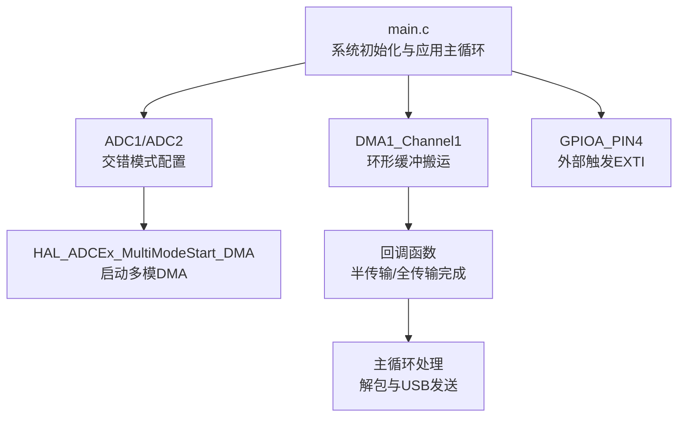
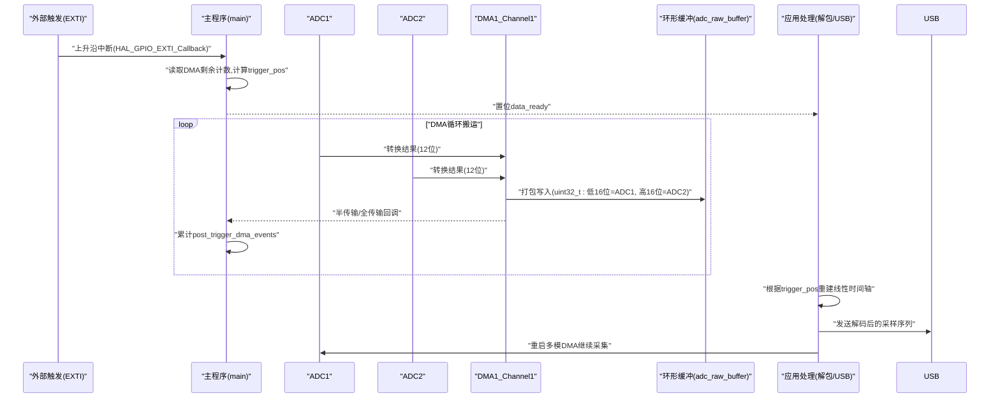
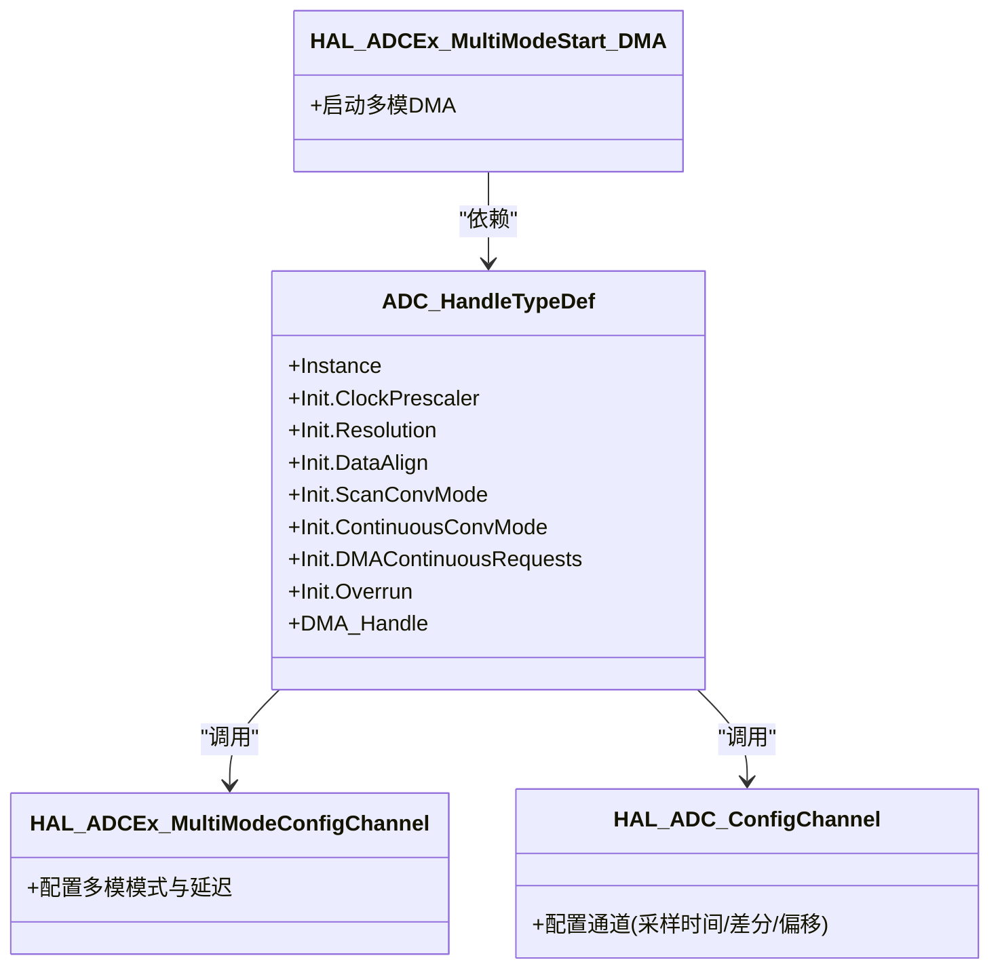
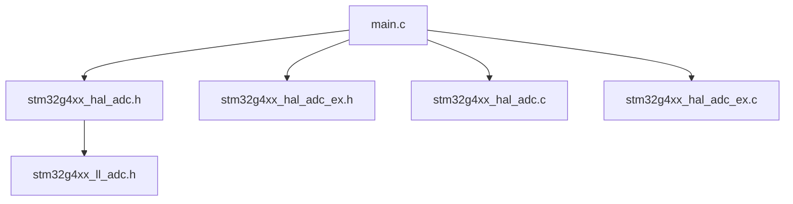
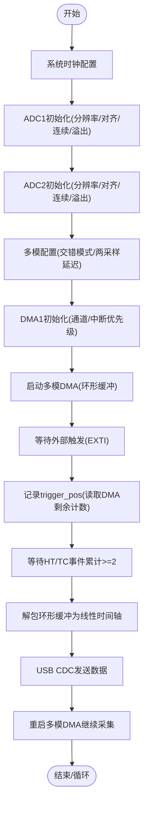

# ADC数据采集系统

<cite>
**本文引用的文件**
- [Core/Src/main.c](file://Core/Src/main.c)
- [Core/Inc/main.h](file://Core/Inc/main.h)
- [Drivers/STM32G4xx_HAL_Driver/Inc/stm32g4xx_hal_adc.h](file://Drivers/STM32G4xx_HAL_Driver/Inc/stm32g4xx_hal_adc.h)
- [Drivers/STM32G4xx_HAL_Driver/Inc/stm32g4xx_hal_adc_ex.h](file://Drivers/STM32G4xx_HAL_Driver/Inc/stm32g4xx_hal_adc_ex.h)
- [Drivers/STM32G4xx_HAL_Driver/Inc/stm32g4xx_ll_adc.h](file://Drivers/STM32G4xx_HAL_Driver/Inc/stm32g4xx_ll_adc.h)
- [Drivers/STM32G4xx_HAL_Driver/Src/stm32g4xx_hal_adc.c](file://Drivers/STM32G4xx_HAL_Driver/Src/stm32g4xx_hal_adc.c)
- [Drivers/STM32G4xx_HAL_Driver/Src/stm32g4xx_hal_adc_ex.c](file://Drivers/STM32G4xx_HAL_Driver/Src/stm32g4xx_hal_adc_ex.c)
</cite>

## 目录
1. [简介](#简介)
2. [项目结构](#项目结构)
3. [核心组件](#核心组件)
4. [架构总览](#架构总览)
5. [详细组件分析](#详细组件分析)
6. [依赖关系分析](#依赖关系分析)
7. [性能与8MSPS实现](#性能与8msps实现)
8. [故障排除指南](#故障排除指南)
9. [结论](#结论)
10. [附录：配置流程图与时序图](#附录配置流程图与时序图)

## 简介
本技术文档面向双通道交错ADC采集系统，重点阐述以下目标：
- 深入解释ADC1与ADC2的交错模式（ADC_DUALMODE_INTERL）配置原理与工作机制。
- 说明如何实现8MSPS采样率，包括时钟配置、采样时间设置与分辨率选择。
- 讲解差分输入模式的配置与优势，以及12位分辨率的数据精度。
- 给出ADC通道的关键配置参数说明（扫描模式、连续转换、溢出处理等）。
- 提供ADC时序图与配置流程图，帮助理解数据转换过程。
- 为初学者提供ADC工作原理基础，为高级开发者提供优化技巧与排障方法。

## 项目结构
本项目基于STM32G4系列，使用HAL库进行外设驱动开发，核心应用逻辑位于main.c中，包含：
- 系统时钟初始化
- GPIO中断（触发信号）
- DMA1通道1用于ADC数据搬运
- ADC1/ADC2双通道交错模式配置
- 环形缓冲区管理与数据解包
- USB CDC透传解码后的采样序列

图表来源
- [Core/Src/main.c:219-290](file://Core/Src/main.c#L219-L290)
- [Core/Src/main.c:344-464](file://Core/Src/main.c#L344-L464)
- [Core/Src/main.c:469-481](file://Core/Src/main.c#L469-L481)

章节来源
- [Core/Src/main.c:219-290](file://Core/Src/main.c#L219-L290)
- [Core/Inc/main.h:1-70](file://Core/Inc/main.h#L1-L70)

## 核心组件
- ADC1与ADC2：分别配置为12位分辨率、右对齐、单通道、连续转换模式；通过多模配置启用交错模式。
- DMA1通道1：将ADC1/ADC2交错数据以uint32_t打包写入环形缓冲区（低16位=ADC1，高16位=ADC2）。
- EXTI触发：PA4上升沿捕获触发时刻，结合DMA剩余计数定位触发位置。
- 主循环：在收到“数据就绪”标志后，从环形缓冲按触发点重建线性时间轴并经由USB CDC发送。

章节来源
- [Core/Src/main.c:47-70](file://Core/Src/main.c#L47-L70)
- [Core/Src/main.c:344-464](file://Core/Src/main.c#L344-L464)
- [Core/Src/main.c:469-481](file://Core/Src/main.c#L469-L481)
- [Core/Src/main.c:91-149](file://Core/Src/main.c#L91-L149)
- [Core/Src/main.c:156-212](file://Core/Src/main.c#L156-L212)

## 架构总览
下图展示了从硬件到软件的整体数据流与控制流：

图表来源
- [Core/Src/main.c:91-149](file://Core/Src/main.c#L91-L149)
- [Core/Src/main.c:156-212](file://Core/Src/main.c#L156-L212)
- [Core/Src/main.c:219-290](file://Core/Src/main.c#L219-L290)
- [Drivers/STM32G4xx_HAL_Driver/Src/stm32g4xx_hal_adc.c:3633-3685](file://Drivers/STM32G4xx_HAL_Driver/Src/stm32g4xx_hal_adc.c#L3633-L3685)

## 详细组件分析

### 双通道交错模式（ADC_DUALMODE_INTERL）
- 多模模式通过HAL层接口配置，设置Mode为交错模式，DMA访问模式适配12/10位，两采样间隔设置为4个ADC时钟周期。
- 该配置会写入公共控制寄存器CCR中的DUAL与DELAY字段，仅在ADC禁用时允许更新。
- 交错模式下，ADC1与ADC2交替执行一次转换，形成更高的等效采样率。

章节来源
- [Core/Src/main.c:381-389](file://Core/Src/main.c#L381-L389)
- [Drivers/STM32G4xx_HAL_Driver/Src/stm32g4xx_hal_adc_ex.c:2182-2204](file://Drivers/STM32G4xx_HAL_Driver/Src/stm32g4xx_hal_adc_ex.c#L2182-L2204)

#### 类图（代码级关系）

图表来源
- [Core/Src/main.c:344-464](file://Core/Src/main.c#L344-L464)
- [Drivers/STM32G4xx_HAL_Driver/Inc/stm32g4xx_hal_adc.h:90-200](file://Drivers/STM32G4xx_HAL_Driver/Inc/stm32g4xx_hal_adc.h#L90-L200)

### 8MSPS采样率实现
- 采样率由ADC时钟频率与单次转换所需周期数决定。12位分辨率下，处理时间为12.5个ADC时钟周期；加上采样时间（本例为2.5周期），单次转换约需15个ADC时钟周期。
- 交错模式下，ADC1与ADC2交替转换，等效采样率为单通道两倍。若希望达到8MSPS，需要合理设置ADC时钟与采样时间，使每个ADC实例的转换速率约为4MSPS。
- 本项目的注释表明“10us@8MSPS”对应预触发样本数，体现了对时间窗口的规划。实际数值取决于系统时钟与ADC时钟分频配置。

章节来源
- [Core/Src/main.c:53-56](file://Core/Src/main.c#L53-L56)
- [Drivers/STM32G4xx_HAL_Driver/Inc/stm32g4xx_ll_adc.h:6200-6222](file://Drivers/STM32G4xx_HAL_Driver/Inc/stm32g4xx_ll_adc.h#L6200-L6222)

### 差分输入模式配置与优势
- 通道配置中将SingleDiff设为差分结束模式，仅配置正端通道，负端通道自动关联。
- 差分模式可抑制共模噪声，提高动态范围与测量精度，适合超声或传感器前端信号采集。

章节来源
- [Core/Src/main.c:393-402](file://Core/Src/main.c#L393-L402)
- [Core/Src/main.c:450-459](file://Core/Src/main.c#L450-L459)
- [Drivers/STM32G4xx_HAL_Driver/Inc/stm32g4xx_hal_adc_ex.h:108-125](file://Drivers/STM32G4xx_HAL_Driver/Inc/stm32g4xx_hal_adc_ex.h#L108-L125)

### 12位分辨率与数据精度
- 分辨率设置为12位，数据右对齐，输出范围为0~4095。
- 12位分辨率在速度与精度之间取得平衡，适用于大多数实时采集场景。

章节来源
- [Core/Src/main.c:361-363](file://Core/Src/main.c#L361-L363)
- [Core/Src/main.c:430-432](file://Core/Src/main.c#L430-L432)
- [Drivers/STM32G4xx_HAL_Driver/Inc/stm32g4xx_hal_adc.h:1145-1148](file://Drivers/STM32G4xx_HAL_Driver/Inc/stm32g4xx_hal_adc.h#L1145-L1148)

### ADC通道配置参数说明
- 扫描模式：关闭（单通道转换）。
- 连续转换模式：开启，确保持续采样。
- 溢出处理：保留数据（避免覆盖最新值）。
- 采样时间：2.5个ADC时钟周期，兼顾速度与精度。
- 触发源：软件触发（由多模DMA启动函数内部发起）。

章节来源
- [Core/Src/main.c:365-375](file://Core/Src/main.c#L365-L375)
- [Core/Src/main.c:393-402](file://Core/Src/main.c#L393-L402)
- [Core/Src/main.c:434-442](file://Core/Src/main.c#L434-L442)
- [Core/Src/main.c:450-459](file://Core/Src/main.c#L450-L459)

### DMA与环形缓冲管理
- DMA1通道1优先级最高，采用循环模式，将ADC1/ADC2的12位结果打包为uint32_t写入环形缓冲。
- 半传输与全传输回调用于统计触发后的数据量，确保至少收集到足够的后触发样本。
- 主循环在收到“数据就绪”后，依据trigger_pos快照重建线性时间轴，并通过USB CDC发送。

章节来源
- [Core/Src/main.c:469-481](file://Core/Src/main.c#L469-L481)
- [Core/Src/main.c:119-149](file://Core/Src/main.c#L119-L149)
- [Core/Src/main.c:156-212](file://Core/Src/main.c#L156-L212)
- [Drivers/STM32G4xx_HAL_Driver/Src/stm32g4xx_hal_adc.c:3633-3685](file://Drivers/STM32G4xx_HAL_Driver/Src/stm32g4xx_hal_adc.c#L3633-L3685)

### 触发与时间窗口规划
- 外部触发通过PA4上升沿进入EXTI中断，读取DMA剩余计数以确定触发点在环形缓冲中的位置。
- 预触发样本数与后触发样本数根据8MSPS的时间窗口设定，保证完整捕捉事件前后波形。

章节来源
- [Core/Src/main.c:91-113](file://Core/Src/main.c#L91-L113)
- [Core/Src/main.c:53-56](file://Core/Src/main.c#L53-L56)

## 依赖关系分析
- main.c依赖HAL ADC扩展接口进行多模配置与DMA启动。
- HAL层回调机制将DMA事件映射到用户回调函数，便于应用层处理。
- LL层定义采样时间与分辨率等底层宏，供HAL层使用。

图表来源
- [Core/Src/main.c:344-464](file://Core/Src/main.c#L344-L464)
- [Drivers/STM32G4xx_HAL_Driver/Inc/stm32g4xx_hal_adc.h:90-200](file://Drivers/STM32G4xx_HAL_Driver/Inc/stm32g4xx_hal_adc.h#L90-L200)
- [Drivers/STM32G4xx_HAL_Driver/Inc/stm32g4xx_hal_adc_ex.h:108-125](file://Drivers/STM32G4xx_HAL_Driver/Inc/stm32g4xx_hal_adc_ex.h#L108-L125)
- [Drivers/STM32G4xx_HAL_Driver/Inc/stm32g4xx_ll_adc.h:6200-6222](file://Drivers/STM32G4xx_HAL_Driver/Inc/stm32g4xx_ll_adc.h#L6200-L6222)
- [Drivers/STM32G4xx_HAL_Driver/Src/stm32g4xx_hal_adc.c:3633-3685](file://Drivers/STM32G4xx_HAL_Driver/Src/stm32g4xx_hal_adc.c#L3633-L3685)
- [Drivers/STM32G4xx_HAL_Driver/Src/stm32g4xx_hal_adc_ex.c:2182-2204](file://Drivers/STM32G4xx_HAL_Driver/Src/stm32g4xx_hal_adc_ex.c#L2182-L2204)

## 性能与8MSPS实现
- 采样时间选择：2.5周期，配合12位处理时间（12.5周期），单次转换约15个ADC时钟周期。
- 交错模式：ADC1与ADC2交替转换，等效采样率翻倍。
- 时钟路径：系统时钟经PLL生成，APB总线时钟作为同步时钟源，ADC时钟分频器进一步分频得到ADC工作时钟。
- 建议：
  - 验证PCLK与ADC时钟比例，确保满足12位分辨率下的最大ADC时钟限制。
  - 若需更高采样率，可适当降低采样时间或调整分频比，但需权衡噪声与精度。
  - 使用DMA循环模式与环形缓冲，减少CPU干预，提升吞吐稳定性。

章节来源
- [Core/Src/main.c:296-337](file://Core/Src/main.c#L296-L337)
- [Core/Src/main.c:361-363](file://Core/Src/main.c#L361-L363)
- [Core/Src/main.c:395-396](file://Core/Src/main.c#L395-L396)
- [Drivers/STM32G4xx_HAL_Driver/Inc/stm32g4xx_ll_adc.h:6200-6222](file://Drivers/STM32G4xx_HAL_Driver/Inc/stm32g4xx_ll_adc.h#L6200-L6222)

## 故障排除指南
- 无数据或数据错乱：
  - 检查DMA是否启用且优先级正确，确认环形缓冲大小与打包格式一致。
  - 确认回调函数被调用（半传输/全传输），并在其中正确累计事件计数。
- 触发位置不准确：
  - 在EXTI中断中读取DMA剩余计数时，注意边界保护（remaining==0或越界）。
  - 在主循环中先快照trigger_pos再清零标志，避免并发修改导致不一致。
- 溢出丢失：
  - Overrun设置为保留数据，避免覆盖最新值；必要时增加缓冲容量或降低采样率。
- USB发送阻塞：
  - 发送前设置uart_busy标志，屏蔽重复触发；发送完成后解锁，允许下一次触发。

章节来源
- [Core/Src/main.c:91-113](file://Core/Src/main.c#L91-L113)
- [Core/Src/main.c:119-149](file://Core/Src/main.c#L119-L149)
- [Core/Src/main.c:178-212](file://Core/Src/main.c#L178-L212)
- [Core/Src/main.c:264-289](file://Core/Src/main.c#L264-L289)

## 结论
本系统通过ADC1/ADC2交错模式与DMA循环搬运，实现了高速、稳定的双通道数据采集。差分输入与12位分辨率在保证精度的同时兼顾了速度。通过EXTI触发与环形缓冲管理，能够准确捕捉事件前后波形，并通过USB CDC将数据上传至主机进行分析。对于更高性能需求，可在时钟与采样时间上进一步优化，并结合更高效的缓冲策略与数据处理算法。

## 附录：配置流程图与时序图

### 配置流程（流程图）

图表来源
- [Core/Src/main.c:296-337](file://Core/Src/main.c#L296-L337)
- [Core/Src/main.c:344-464](file://Core/Src/main.c#L344-L464)
- [Core/Src/main.c:469-481](file://Core/Src/main.c#L469-L481)
- [Core/Src/main.c:91-149](file://Core/Src/main.c#L91-L149)
- [Core/Src/main.c:156-212](file://Core/Src/main.c#L156-L212)
- [Core/Src/main.c:219-290](file://Core/Src/main.c#L219-L290)

### 数据转换时序（概念性）
- 每个ADC实例在交错模式下交替进行一次转换。
- 每次转换包含采样阶段与处理阶段，合计周期数由分辨率与采样时间决定。
- DMA在每个转换完成后将结果打包写入环形缓冲，主循环在触发后重建时间轴。

[此图为概念性时序示意，不直接映射具体源码文件]