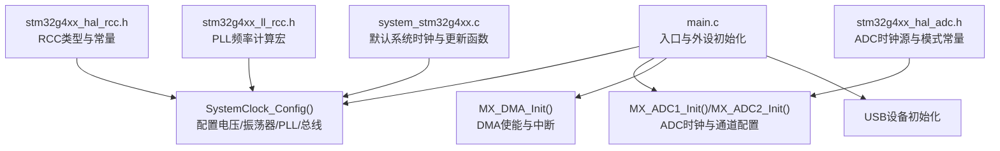
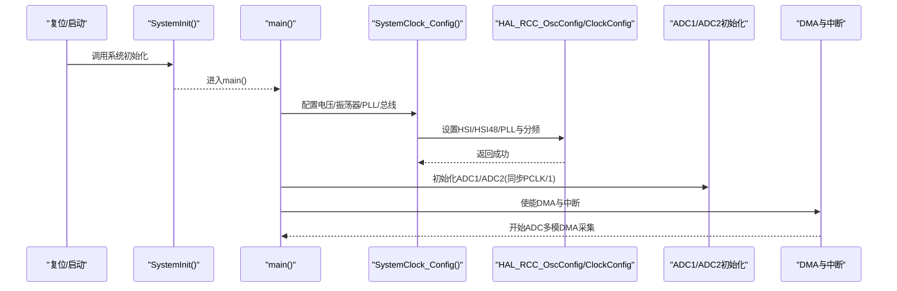
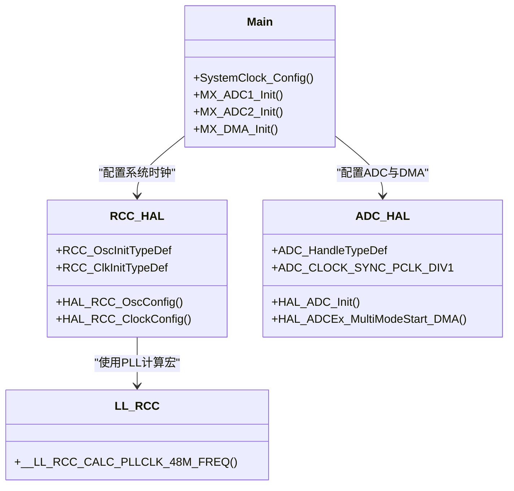

# ADC时钟系统配置

<cite>
**本文引用的文件**   
- [Core/Src/main.c](file://Core/Src/main.c)
- [Core/Inc/main.h](file://Core/Inc/main.h)
- [Core/Src/system_stm32g4xx.c](file://Core/Src/system_stm32g4xx.c)
- [Drivers/STM32G4xx_HAL_Driver/Inc/stm32g4xx_hal_rcc.h](file://Drivers/STM32G4xx_HAL_Driver/Inc/stm32g4xx_hal_rcc.h)
- [Drivers/STM32G4xx_HAL_Driver/Inc/stm32g4xx_hal_adc.h](file://Drivers/STM32G4xx_HAL_Driver/Inc/stm32g4xx_hal_adc.h)
- [Drivers/STM32G4xx_HAL_Driver/Inc/stm32g4xx_ll_rcc.h](file://Drivers/STM32G4xx_HAL_Driver/Inc/stm32g4xx_ll_rcc.h)
</cite>

## 目录
1. [简介](#简介)
2. [项目结构](#项目结构)
3. [核心组件](#核心组件)
4. [架构总览](#架构总览)
5. [详细组件分析](#详细组件分析)
6. [依赖关系分析](#依赖关系分析)
7. [性能与时序分析](#性能与时序分析)
8. [故障排查指南](#故障排查指南)
9. [结论](#结论)
10. [附录](#附录)

## 简介
本技术文档围绕STM32G474的ADC时钟系统，结合工程中的实际配置，深入解析时钟树架构与关键参数：HSI、HSI48与PLL的配置流程；ADC同步时钟源选择与分频（ADC_CLOCK_SYNC_PCLK_DIV1）；以及如何在当前系统时钟下实现8MSPS采样率需求。文档同时解释SystemClock_Config中电压调节器设置、振荡器配置与总线时钟分配的作用，提供频率计算方法与时序分析，并给出最佳实践与常见问题解决方案，兼顾初学者入门与高级开发者优化功耗与性能的诉求。

## 项目结构
本项目采用CubeMX生成的标准分层结构：应用逻辑位于Core/Src/main.c，系统初始化在system_stm32g4xx.c，RCC与ADC相关宏定义与API位于Drivers/STM32G4xx_HAL_Driver/Inc下的头文件中。

图表来源
- [Core/Src/main.c:296-337](file://Core/Src/main.c#L296-L337)
- [Core/Src/main.c:344-464](file://Core/Src/main.c#L344-L464)
- [Drivers/STM32G4xx_HAL_Driver/Inc/stm32g4xx_hal_rcc.h:45-121](file://Drivers/STM32G4xx_HAL_Driver/Inc/stm32g4xx_hal_rcc.h#L45-L121)
- [Drivers/STM32G4xx_HAL_Driver/Inc/stm32g4xx_hal_adc.h:570-608](file://Drivers/STM32G4xx_HAL_Driver/Inc/stm32g4xx_hal_adc.h#L570-L608)
- [Drivers/STM32G4xx_HAL_Driver/Inc/stm32g4xx_ll_rcc.h:822-853](file://Drivers/STM32G4xx_HAL_Driver/Inc/stm32g4xx_ll_rcc.h#L822-L853)
- [Core/Src/system_stm32g4xx.c:180-272](file://Core/Src/system_stm32g4xx.c#L180-L272)

章节来源
- [Core/Src/main.c:219-290](file://Core/Src/main.c#L219-L290)
- [Core/Src/system_stm32g4xx.c:180-272](file://Core/Src/system_stm32g4xx.c#L180-L272)

## 核心组件
- SystemClock_Config：完成电压调节器设置、内部振荡器（HSI、HSI48）与PLL配置，并设置SYSCLK/HCLK/PCLK1/PCLK2分频。
- ADC初始化（ADC1/ADC2）：配置ADC时钟为同步PCLK分频（ADC_CLOCK_SYNC_PCLK_DIV1），分辨率、对齐方式、连续转换、DMA等。
- DMA与中断：ADC数据通过DMA搬运，配合回调处理触发前后数据窗口。
- RCC HAL/LL接口：提供PLL与分频宏定义及48MHz域PLL频率计算辅助宏。

章节来源
- [Core/Src/main.c:296-337](file://Core/Src/main.c#L296-L337)
- [Core/Src/main.c:344-464](file://Core/Src/main.c#L344-L464)
- [Drivers/STM32G4xx_HAL_Driver/Inc/stm32g4xx_hal_rcc.h:45-121](file://Drivers/STM32G4xx_HAL_Driver/Inc/stm32g4xx_hal_rcc.h#L45-L121)
- [Drivers/STM32G4xx_HAL_Driver/Inc/stm32g4xx_hal_adc.h:570-608](file://Drivers/STM32G4xx_HAL_Driver/Inc/stm32g4xx_hal_adc.h#L570-L608)

## 架构总览
下图展示从系统启动到ADC采样的时钟路径与控制流：

图表来源
- [Core/Src/main.c:219-290](file://Core/Src/main.c#L219-L290)
- [Core/Src/main.c:296-337](file://Core/Src/main.c#L296-L337)
- [Core/Src/main.c:344-464](file://Core/Src/main.c#L344-L464)

## 详细组件分析

### SystemClock_Config详解
该函数负责：
- 电压调节器设置：使用Scale1以支持更高主频。
- 振荡器配置：开启HSI与HSI48，启用PLL，PLL源选择HSI，设置PLLM/PLLN/PLLP/PLLQ/PLLR。
- 总线时钟分配：SYSCLK来自PLL，AHB/APB不分频。

关键要点
- 电压调节器范围影响最大可运行频率，Scale1是达到较高主频的前提。
- PLL输入为HSI（典型16MHz），经PLLM分频后由PLLN倍频，再经PLLP/PLLQ/PLLR输出不同域时钟。
- SYSCLK选择PLL输出，HCLK/PCLK1/PCLK2保持1分频，便于后续计算与调试。

章节来源
- [Core/Src/main.c:296-337](file://Core/Src/main.c#L296-L337)
- [Drivers/STM32G4xx_HAL_Driver/Inc/stm32g4xx_hal_rcc.h:45-121](file://Drivers/STM32G4xx_HAL_Driver/Inc/stm32g4xx_hal_rcc.h#L45-L121)

### ADC时钟源与分频（ADC_CLOCK_SYNC_PCLK_DIV1）
- ADC时钟源选择：同步模式，基于APB时钟（PCLK）分频得到ADC同步时钟。
- 分频系数：ADC_CLOCK_SYNC_PCLK_DIV1表示无额外分频，即ADC时钟等于PCLK。
- 约束条件：当使用基于HCLK/1的同步时钟时，要求系统时钟具有50%占空比（APB预分频需旁路）。

注意
- 在双ADC交错模式下，ADC时钟需要满足最高采样率与时钟约束。
- 若PCLK过高导致ADC时钟超出允许范围，应增大分频或降低PCLK。

章节来源
- [Core/Src/main.c:361](file://Core/Src/main.c#L361)
- [Core/Src/main.c:430](file://Core/Src/main.c#L430)
- [Drivers/STM32G4xx_HAL_Driver/Inc/stm32g4xx_hal_adc.h:570-608](file://Drivers/STM32G4xx_HAL_Driver/Inc/stm32g4xx_hal_adc.h#L570-L608)

### 实现8MSPS采样率的时钟需求
目标：单ADC 8MSPS，双ADC交错模式合计16MSPS吞吐。
- 当前配置：ADC同步时钟= PCLK（DIV1）。
- 若PCLK=80MHz，则ADC时钟=80MHz，单个ADC可在12位分辨率下达到约8MSPS（受采样周期与转换时间限制）。
- 双ADC交错：ADC1与ADC2交替采样，整体吞吐可达16MSPS，满足超声信号采集需求。

建议验证步骤
- 确认PCLK频率（由SYSCLK与APB分频决定）。
- 根据ADC手册检查12位分辨率下的最小转换时间与采样周期，确保ADC时钟不超过上限且时序满足。
- 若需更稳健的余量，可将ADC时钟设置为PCLK/2或PCLK/4以降低噪声与功耗。

章节来源
- [Core/Src/main.c:361](file://Core/Src/main.c#L361)
- [Core/Src/main.c:430](file://Core/Src/main.c#L430)
- [Core/Src/main.c:383-385](file://Core/Src/main.c#L383-L385)

### 时钟频率计算方法与时序分析
- 系统时钟计算（PLL）：
  - VCO输入 = HSI / (PLLM+1)
  - VCO输出 = VCO输入 × PLLN
  - SYSCLK = VCO输出 / (PLLR×2)（具体公式参考LL宏）
- 48MHz域PLL频率计算宏用于USB/RNG等模块，便于校验PLLQ输出是否满足48MHz需求。
- ADC时钟 = PCLK / ADC分频系数（当前DIV1）。
- 采样率估算：
  - 单次转换时间 ≈ Tconv + Tsamp（取决于分辨率与采样周期）
  - 最大采样率 ≈ fADC / (Tconv + Tsamp)
  - 双ADC交错：总吞吐≈2×单ADC采样率

章节来源
- [Drivers/STM32G4xx_HAL_Driver/Inc/stm32g4xx_ll_rcc.h:822-853](file://Drivers/STM32G4xx_HAL_Driver/Inc/stm32g4xx_ll_rcc.h#L822-L853)
- [Core/Src/main.c:313-318](file://Core/Src/main.c#L313-L318)
- [Core/Src/main.c:361](file://Core/Src/main.c#L361)

### 系统默认时钟与更新机制
- system_stm32g4xx.c提供SystemInit与SystemCoreClockUpdate，用于复位后默认时钟与运行时更新。
- 当通过HAL配置系统时钟后，SystemCoreClock会自动更新，避免手动维护不一致。

章节来源
- [Core/Src/system_stm32g4xx.c:180-272](file://Core/Src/system_stm32g4xx.c#L180-L272)

## 依赖关系分析
- main.c依赖HAL RCC与ADC驱动，通过宏与结构体进行配置。
- RCC配置依赖PLL宏与分频常量，确保各域时钟在安全范围内。
- ADC配置依赖同步时钟源与分频宏，保证ADC时钟满足性能与稳定性要求。

图表来源
- [Core/Src/main.c:296-337](file://Core/Src/main.c#L296-L337)
- [Core/Src/main.c:344-464](file://Core/Src/main.c#L344-L464)
- [Drivers/STM32G4xx_HAL_Driver/Inc/stm32g4xx_hal_rcc.h:45-121](file://Drivers/STM32G4xx_HAL_Driver/Inc/stm32g4xx_hal_rcc.h#L45-L121)
- [Drivers/STM32G4xx_HAL_Driver/Inc/stm32g4xx_hal_adc.h:570-608](file://Drivers/STM32G4xx_HAL_Driver/Inc/stm32g4xx_hal_adc.h#L570-L608)
- [Drivers/STM32G4xx_HAL_Driver/Inc/stm32g4xx_ll_rcc.h:822-853](file://Drivers/STM32G4xx_HAL_Driver/Inc/stm32g4xx_ll_rcc.h#L822-L853)

## 性能与时序分析
- 主频与功耗权衡：Scale1支持更高主频但功耗增加；Scale2可降低功耗但限制最高主频。
- ADC时钟与噪声：更高的ADC时钟可能引入更多开关噪声，适当分频有助于提升信噪比。
- 双ADC交错：交错模式提高吞吐，但需注意DMA缓冲管理与触发事件的时间窗口。
- 50%占空比约束：同步时钟基于HCLK/1时需满足占空比要求，否则可能导致时序不稳定。

[本节为通用指导，不直接分析具体文件]

## 故障排查指南
- ADC无法达到预期采样率：
  - 检查PCLK与ADC分频是否正确（DIV1/2/4）。
  - 确认ADC时钟未超过器件允许的最大值。
  - 验证采样周期与转换时间是否满足12位分辨率要求。
- 系统时钟异常：
  - 确认PLL参数（PLLM/PLLN/PLLP/PLLQ/PLLR）在有效范围内。
  - 检查电压调节器范围是否与目标主频匹配。
- USB/RNG等48MHz域模块异常：
  - 使用__LL_RCC_CALC_PLLCLK_48M_FREQ宏校验PLLQ输出是否为48MHz。
- 触发与DMA数据错位：
  - 确保EXTI与DMA回调时序正确，避免在传输期间误触发。
  - 使用快照策略记录触发位置，减少ISR竞争。

章节来源
- [Core/Src/main.c:91-131](file://Core/Src/main.c#L91-L131)
- [Core/Src/main.c:296-337](file://Core/Src/main.c#L296-L337)
- [Drivers/STM32G4xx_HAL_Driver/Inc/stm32g4xx_ll_rcc.h:822-853](file://Drivers/STM32G4xx_HAL_Driver/Inc/stm32g4xx_ll_rcc.h#L822-L853)

## 结论
通过合理配置SystemClock_Config与ADC时钟源（ADC_CLOCK_SYNC_PCLK_DIV1），在当前PCLK=80MHz条件下可实现单ADC约8MSPS采样率，双ADC交错模式可达16MSPS吞吐，满足超声信号采集需求。建议在追求高性能的同时关注噪声与功耗平衡，必要时调整ADC分频与采样周期，并确保系统时钟占空比与PLL参数符合器件规范。

[本节为总结性内容，不直接分析具体文件]

## 附录
- 最佳实践
  - 优先使用Scale1以获得更高主频余量，但在低功耗场景考虑Scale2。
  - 对高噪声敏感的应用，适当降低ADC时钟（如PCLK/2或PCLK/4）。
  - 使用DMA循环模式与回调组合，确保数据完整性与实时性。
  - 在切换系统时钟后，调用SystemCoreClockUpdate以保持变量一致。
- 常见问题
  - 同步时钟占空比不满足导致ADC不稳定：调整APB预分频或改用异步时钟。
  - 48MHz域模块工作异常：重新计算PLLQ，确保输出为48MHz。
  - 触发抖动导致数据窗口偏移：在ISR中快速记录触发位置，主循环中重建时间线。

[本节为通用指导，不直接分析具体文件]