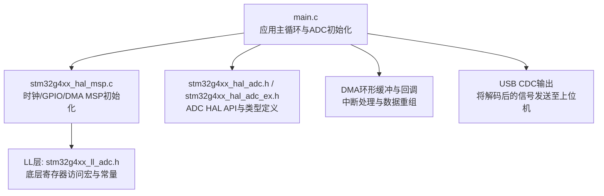
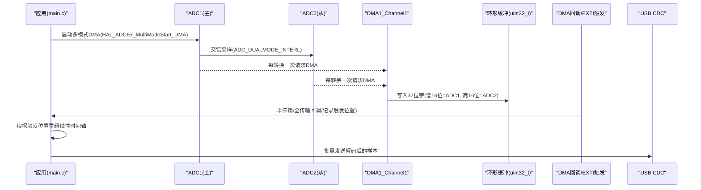
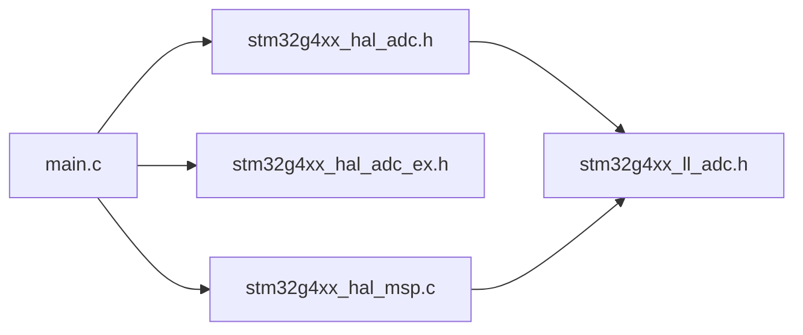

# ADC通道配置详解

<cite>
**本文引用的文件列表**
- [Core/Src/main.c](file://Core/Src/main.c)
- [Core/Inc/main.h](file://Core/Inc/main.h)
- [Core/Src/stm32g4xx_hal_msp.c](file://Core/Src/stm32g4xx_hal_msp.c)
- [Drivers/STM32G4xx_HAL_Driver/Inc/stm32g4xx_hal_adc.h](file://Drivers/STM32G4xx_HAL_Driver/Inc/stm32g4xx_hal_adc.h)
- [Drivers/STM32G4xx_HAL_Driver/Inc/stm32g4xx_hal_adc_ex.h](file://Drivers/STM32G4xx_HAL_Driver/Inc/stm32g4xx_hal_adc_ex.h)
- [Drivers/STM32G4xx_HAL_Driver/Inc/stm32g4xx_ll_adc.h](file://Drivers/STM32G4xx_HAL_Driver/Inc/stm32g4xx_ll_adc.h)
- [Drivers/STM32G4xx_HAL_Driver/Src/stm32g4xx_hal_adc_ex.c](file://Drivers/STM32G4xx_HAL_Driver/Src/stm32g4xx_hal_adc_ex.c)
- [Drivers/STM32G4xx_HAL_Driver/Src/stm32g4xx_hal_adc.c](file://Drivers/STM32G4xx_HAL_Driver/Src/stm32g4xx_hal_adc.c)
- [G4test.ioc](file://G4test.ioc)
</cite>

## 目录
1. [简介](#简介)
2. [项目结构](#项目结构)
3. [核心组件](#核心组件)
4. [架构总览](#架构总览)
5. [详细组件分析](#详细组件分析)
6. [依赖关系分析](#依赖关系分析)
7. [性能与精度考量](#性能与精度考量)
8. [故障排查指南](#故障排查指南)
9. [结论](#结论)
10. [附录：参数与可选值速查](#附录参数与可选值速查)

## 简介
本技术文档围绕STM32G4的ADC1与ADC2通道配置，系统阐述以下要点：
- ADC1与ADC2的通道配置流程、引脚映射与差分输入模式（ADC_DIFFERENTIAL_ENDED）的配置方法与优势。
- 采样时间（ADC_SAMPLETIME_2CYCLES_5）对采集精度的影响，以及分辨率（ADC_RESOLUTION_12B）的数据格式。
- 扫描模式与连续转换模式的差异，溢出处理策略（ADC_OVR_DATA_PRESERVED）。
- 双ADC交错模式（ADC_DUALMODE_INTERL）与DMA环形缓冲配合的高吞吐采集方案。
- 为初学者提供基础概念，为高级开发者提供优化技巧与可操作建议。

## 项目结构
本项目基于STM32CubeMX生成的工程，核心应用逻辑位于Core/Src/main.c，MSP硬件初始化在Core/Src/stm32g4xx_hal_msp.c中完成，HAL驱动定义位于Drivers/STM32G4xx_HAL_Driver/Inc下。

图表来源
- [Core/Src/main.c:344-464](file://Core/Src/main.c#L344-L464)
- [Core/Src/stm32g4xx_hal_msp.c:92-185](file://Core/Src/stm32g4xx_hal_msp.c#L92-L185)
- [Drivers/STM32G4xx_HAL_Driver/Inc/stm32g4xx_hal_adc.h:612-829](file://Drivers/STM32G4xx_HAL_Driver/Inc/stm32g4xx_hal_adc.h#L612-L829)
- [Drivers/STM32G4xx_HAL_Driver/Inc/stm32g4xx_ll_adc.h:2260-2397](file://Drivers/STM32G4xx_HAL_Driver/Inc/stm32g4xx_ll_adc.h#L2260-L2397)

章节来源
- [Core/Src/main.c:344-464](file://Core/Src/main.c#L344-L464)
- [Core/Src/stm32g4xx_hal_msp.c:92-185](file://Core/Src/stm32g4xx_hal_msp.c#L92-L185)

## 核心组件
- ADC1与ADC2实例：分别用于主从双ADC交错采集，配置为12位分辨率、右对齐、连续转换、软件触发。
- 多模式配置：使用ADC_DUALMODE_INTERL实现双ADC交错模式，并设置两采样延迟。
- 通道配置：选择ADC_CHANNEL_3，设置为差分输入（ADC_DIFFERENTIAL_ENDED），采样时间ADC_SAMPLETIME_2CYCLES_5。
- DMA与环形缓冲：DMA1_Channel1以环形模式工作，将ADC1/ADC2结果打包到uint32_t缓冲区，低16位为ADC1，高16位为ADC2。
- 溢出处理：Overrun设为ADC_OVR_DATA_PRESERVED，确保新数据不被覆盖，避免丢样。

章节来源
- [Core/Src/main.c:360-402](file://Core/Src/main.c#L360-L402)
- [Core/Src/main.c:429-459](file://Core/Src/main.c#L429-L459)
- [Core/Src/main.c:381-389](file://Core/Src/main.c#L381-L389)
- [Core/Src/main.c:469-481](file://Core/Src/main.c#L469-L481)
- [Core/Src/stm32g4xx_hal_msp.c:127-148](file://Core/Src/stm32g4xx_hal_msp.c#L127-L148)

## 架构总览
下图展示了ADC1/ADC2双通道交错采集的整体数据流：主从ADC按交错时序采样，DMA将结果写入环形缓冲，主循环根据触发事件截取前后样本并重组为线性时间轴，最后通过USB CDC输出。

图表来源
- [Core/Src/main.c:249-255](file://Core/Src/main.c#L249-L255)
- [Core/Src/main.c:381-389](file://Core/Src/main.c#L381-L389)
- [Core/Src/main.c:136-149](file://Core/Src/main.c#L136-L149)
- [Core/Src/main.c:156-171](file://Core/Src/main.c#L156-L171)
- [Core/Src/main.c:178-212](file://Core/Src/main.c#L178-L212)

## 详细组件分析

### ADC1与ADC2通道配置过程
- 公共配置（ADC_Init）：
  - 时钟分频：ADC_CLOCK_SYNC_PCLK_DIV1
  - 分辨率：ADC_RESOLUTION_12B
  - 数据对齐：ADC_DATAALIGN_RIGHT
  - 扫描模式：ADC_SCAN_DISABLE（单通道）
  - 连续转换：ENABLE
  - 外部触发：软件触发
  - DMA连续请求：ADC1启用，ADC2禁用（由多模式接口管理）
  - 溢出处理：ADC_OVR_DATA_PRESERVED
- 多模式配置（MultiModeConfigChannel）：
  - 模式：ADC_DUALMODE_INTERL（交错）
  - DMA访问模式：ADC_DMAACCESSMODE_12_10_BITS
  - 两采样延迟：ADC_TWOSAMPLINGDELAY_4CYCLES
- 通道配置（ConfigChannel）：
  - 通道号：ADC_CHANNEL_3
  - Rank：ADC_REGULAR_RANK_1
  - 采样时间：ADC_SAMPLETIME_2CYCLES_5
  - 单端/差分：ADC_DIFFERENTIAL_ENDED
  - 偏移：无偏移

章节来源
- [Core/Src/main.c:360-402](file://Core/Src/main.c#L360-L402)
- [Core/Src/main.c:429-459](file://Core/Src/main.c#L429-L459)
- [Core/Src/main.c:381-389](file://Core/Src/main.c#L381-L389)

### 为什么选择ADC_CHANNEL_3？引脚映射关系
- ADC1：PA2对应IN3，PA3对应IN4（差分对）
- ADC2：PA6对应IN3，PA7对应IN4（差分对）
- 选择ADC_CHANNEL_3的原因：
  - 该通道在两个ADC上均支持差分输入，且具备对应的负端通道（i+1）自动配置，便于构建差分测量路径。
  - 在双ADC交错模式下，每个ADC独立采样同一通道编号，形成更高吞吐的双路采集。
- 引脚映射依据MSP初始化中的GPIO配置注释与引脚分配。

章节来源
- [Core/Src/stm32g4xx_hal_msp.c:117-125](file://Core/Src/stm32g4xx_hal_msp.c#L117-L125)
- [Core/Src/stm32g4xx_hal_msp.c:170-178](file://Core/Src/stm32g4xx_hal_msp.c#L170-L178)
- [Core/Src/main.c:393-398](file://Core/Src/main.c#L393-L398)
- [Core/Src/main.c:450-455](file://Core/Src/main.c#L450-L455)

### 差分输入模式（ADC_DIFFERENTIAL_ENDED）配置与优势
- 配置方法：
  - 在通道配置中将SingleDiff设为ADC_DIFFERENTIAL_ENDED。
  - 仅配置通道i，通道i+1作为负端自动配置。
- 优势：
  - 抑制共模噪声，提高信噪比。
  - 提升动态范围与测量精度，尤其适用于小信号或长导线传输场景。
- 注意事项：
  - 差分模式下通道i+1不可单独使用。
  - 需确保所选通道在参考手册中支持差分模式。

章节来源
- [Drivers/STM32G4xx_HAL_Driver/Inc/stm32g4xx_hal_adc_ex.h:108-125](file://Drivers/STM32G4xx_HAL_Driver/Inc/stm32g4xx_hal_adc_ex.h#L108-L125)
- [Core/Src/main.c:396-398](file://Core/Src/main.c#L396-L398)
- [Core/Src/main.c:453-455](file://Core/Src/main.c#L453-L455)

### 采样时间（ADC_SAMPLETIME_2CYCLES_5）对精度的影响
- 采样时间越短，转换越快，但RC充电不足可能导致误差增大；越长则精度提升但吞吐降低。
- 2.5周期是兼顾速度与精度的折中，适合高频小信号采集。
- 内部通道（如VrefInt）有额外约束，需参考器件手册。

章节来源
- [Drivers/STM32G4xx_HAL_Driver/Inc/stm32g4xx_hal_adc.h:806](file://Drivers/STM32G4xx_HAL_Driver/Inc/stm32g4xx_hal_adc.h#L806)
- [Drivers/STM32G4xx_HAL_Driver/Inc/stm32g4xx_hal_adc.h:1393](file://Drivers/STM32G4xx_HAL_Driver/Inc/stm32g4xx_hal_adc.h#L1393)
- [Core/Src/main.c:395](file://Core/Src/main.c#L395)
- [Core/Src/main.c:452](file://Core/Src/main.c#L452)

### 分辨率（ADC_RESOLUTION_12B）与数据格式
- 12位分辨率，数据右对齐，有效范围0–4095。
- 在DMA打包时，每个ADC结果占16位，组合成32位字以便交错存储。

章节来源
- [Drivers/STM32G4xx_HAL_Driver/Inc/stm32g4xx_hal_adc.h:612](file://Drivers/STM32G4xx_HAL_Driver/Inc/stm32g4xx_hal_adc.h#L612)
- [Core/Src/main.c:362](file://Core/Src/main.c#L362)
- [Core/Src/main.c:431](file://Core/Src/main.c#L431)
- [Core/Src/main.c:168-169](file://Core/Src/main.c#L168-L169)

### 扫描模式与连续转换模式差异
- 扫描模式（ScanConvMode）：
  - 启用后按序列依次转换多个通道；本项目关闭扫描，仅转换单个通道。
- 连续转换模式（ContinuousConvMode）：
  - 启用后持续触发转换，适合高速采集；本项目启用。
- 不连续模式（DiscontinuousConvMode）：
  - 仅在扫描模式下生效，且与连续模式互斥；本项目关闭。

章节来源
- [Drivers/STM32G4xx_HAL_Driver/Inc/stm32g4xx_hal_adc.h:128-138](file://Drivers/STM32G4xx_HAL_Driver/Inc/stm32g4xx_hal_adc.h#L128-L138)
- [Drivers/STM32G4xx_HAL_Driver/Inc/stm32g4xx_hal_adc.h:165-169](file://Drivers/STM32G4xx_HAL_Driver/Inc/stm32g4xx_hal_adc.h#L165-L169)
- [Drivers/STM32G4xx_HAL_Driver/Inc/stm32g4xx_hal_adc.h:189-198](file://Drivers/STM32G4xx_HAL_Driver/Inc/stm32g4xx_hal_adc.h#L189-L198)
- [Core/Src/main.c:365](file://Core/Src/main.c#L365)
- [Core/Src/main.c:368](file://Core/Src/main.c#L368)
- [Core/Src/main.c:370](file://Core/Src/main.c#L370)

### 溢出处理策略（ADC_OVR_DATA_PRESERVED）
- 当DMA来不及读取导致溢出时，保留旧数据不被覆盖，保证数据完整性。
- 在高吞吐场景中尤为重要，避免丢样。

章节来源
- [Drivers/STM32G4xx_HAL_Driver/Inc/stm32g4xx_hal_adc.h:772](file://Drivers/STM32G4xx_HAL_Driver/Inc/stm32g4xx_hal_adc.h#L772)
- [Core/Src/main.c:374](file://Core/Src/main.c#L374)
- [Core/Src/main.c:441](file://Core/Src/main.c#L441)

### 双ADC交错模式（ADC_DUALMODE_INTERL）与DMA环形缓冲
- 交错模式使ADC1与ADC2交替采样，等效采样率翻倍。
- DMA环形缓冲保证连续写入，结合半传输/全传输回调定位触发点。
- 32位打包：低16位为ADC1，高16位为ADC2，便于后续解包。

章节来源
- [Core/Src/main.c:381-389](file://Core/Src/main.c#L381-L389)
- [Core/Src/main.c:136-149](file://Core/Src/main.c#L136-L149)
- [Core/Src/main.c:156-171](file://Core/Src/main.c#L156-L171)
- [Core/Src/stm32g4xx_hal_msp.c:127-148](file://Core/Src/stm32g4xx_hal_msp.c#L127-L148)

### 完整通道配置示例（以代码片段路径替代具体代码）
- ADC1初始化与通道配置：
  - 路径：[Core/Src/main.c:344-406](file://Core/Src/main.c#L344-L406)
- ADC2初始化与通道配置：
  - 路径：[Core/Src/main.c:414-464](file://Core/Src/main.c#L414-L464)
- 关键参数说明（参考路径）：
  - 分辨率：[Drivers/STM32G4xx_HAL_Driver/Inc/stm32g4xx_hal_adc.h:612](file://Drivers/STM32G4xx_HAL_Driver/Inc/stm32g4xx_hal_adc.h#L612)
  - 采样时间：[Drivers/STM32G4xx_HAL_Driver/Inc/stm32g4xx_hal_adc.h:806](file://Drivers/STM32G4xx_HAL_Driver/Inc/stm32g4xx_hal_adc.h#L806)
  - 通道号：[Drivers/STM32G4xx_HAL_Driver/Inc/stm32g4xx_hal_adc.h:829](file://Drivers/STM32G4xx_HAL_Driver/Inc/stm32g4xx_hal_adc.h#L829)
  - 差分模式：[Drivers/STM32G4xx_HAL_Driver/Inc/stm32g4xx_hal_adc_ex.h:391](file://Drivers/STM32G4xx_HAL_Driver/Inc/stm32g4xx_hal_adc_ex.h#L391)
  - 溢出处理：[Drivers/STM32G4xx_HAL_Driver/Inc/stm32g4xx_hal_adc.h:772](file://Drivers/STM32G4xx_HAL_Driver/Inc/stm32g4xx_hal_adc.h#L772)

章节来源
- [Core/Src/main.c:344-406](file://Core/Src/main.c#L344-L406)
- [Core/Src/main.c:414-464](file://Core/Src/main.c#L414-L464)
- [Drivers/STM32G4xx_HAL_Driver/Inc/stm32g4xx_hal_adc.h:612](file://Drivers/STM32G4xx_HAL_Driver/Inc/stm32g4xx_hal_adc.h#L612)
- [Drivers/STM32G4xx_HAL_Driver/Inc/stm32g4xx_hal_adc.h:806](file://Drivers/STM32G4xx_HAL_Driver/Inc/stm32g4xx_hal_adc.h#L806)
- [Drivers/STM32G4xx_HAL_Driver/Inc/stm32g4xx_hal_adc.h:829](file://Drivers/STM32G4xx_HAL_Driver/Inc/stm32g4xx_hal_adc.h#L829)
- [Drivers/STM32G4xx_HAL_Driver/Inc/stm32g4xx_hal_adc_ex.h:391](file://Drivers/STM32G4xx_HAL_Driver/Inc/stm32g4xx_hal_adc_ex.h#L391)
- [Drivers/STM32G4xx_HAL_Driver/Inc/stm32g4xx_hal_adc.h:772](file://Drivers/STM32G4xx_HAL_Driver/Inc/stm32g4xx_hal_adc.h#L772)

## 依赖关系分析
- main.c依赖HAL ADC API进行初始化与启动，依赖DMA与中断回调进行数据处理。
- MSP负责外设时钟、GPIO与DMA的底层资源绑定。
- LL层提供底层常量与寄存器访问宏，HAL在此基础上封装API。

图表来源
- [Core/Src/main.c:344-464](file://Core/Src/main.c#L344-L464)
- [Core/Src/stm32g4xx_hal_msp.c:92-185](file://Core/Src/stm32g4xx_hal_msp.c#L92-L185)
- [Drivers/STM32G4xx_HAL_Driver/Inc/stm32g4xx_ll_adc.h:2260-2397](file://Drivers/STM32G4xx_HAL_Driver/Inc/stm32g4xx_ll_adc.h#L2260-L2397)

章节来源
- [Core/Src/main.c:344-464](file://Core/Src/main.c#L344-L464)
- [Core/Src/stm32g4xx_hal_msp.c:92-185](file://Core/Src/stm32g4xx_hal_msp.c#L92-L185)

## 性能与精度考量
- 采样时间与吞吐权衡：
  - 较短采样时间（如2.5周期）提升吞吐，但需评估源阻抗与噪声。
- 差分输入提升精度：
  - 抑制共模干扰，适合微弱信号。
- 双ADC交错模式：
  - 双倍采样率，注意两采样延迟与DMA带宽。
- 溢出保护：
  - 使用ADC_OVR_DATA_PRESERVED避免丢样，必要时增加DMA优先级或减少CPU负载。
- 数据重组与传输：
  - 环形缓冲+触发定位确保捕获前后波形；批量传输减少中断开销。

[本节为通用指导，无需特定文件引用]

## 故障排查指南
- 无法启动多模式DMA：
  - 确认已调用HAL_ADCEx_MultiModeStart_DMA而非普通DMA启动函数。
- 数据错位或乱序：
  - 检查DMA环形缓冲大小与触发位置计算逻辑，确保start_idx与取模正确。
- 触发丢失或重复：
  - 检查EXTI优先级与uart_busy标志，避免在UART传输期间误触发。
- 采样精度不足：
  - 调整采样时间，检查差分引脚布局与接地，减小源阻抗。
- 溢出报警或数据覆盖：
  - 确认Overrun设为ADC_OVR_DATA_PRESERVED，并评估DMA与CPU处理能力。

章节来源
- [Drivers/STM32G4xx_HAL_Driver/Src/stm32g4xx_hal_adc.c:1996-2020](file://Drivers/STM32G4xx_HAL_Driver/Src/stm32g4xx_hal_adc.c#L1996-L2020)
- [Core/Src/main.c:91-113](file://Core/Src/main.c#L91-L113)
- [Core/Src/main.c:156-171](file://Core/Src/main.c#L156-L171)
- [Core/Src/main.c:374](file://Core/Src/main.c#L374)

## 结论
本项目通过ADC1/ADC2双通道交错模式与DMA环形缓冲，实现了高吞吐、高精度的数据采集。合理选择通道与差分模式、优化采样时间与溢出策略，是保障性能的关键。对于初学者，理解通道映射与基本配置即可上手；对于高级开发者，可通过调整延迟、DMA优先级与数据重组算法进一步提升系统稳定性与实时性。

[本节为总结，无需特定文件引用]

## 附录：参数与可选值速查
- 分辨率：
  - ADC_RESOLUTION_12B（12位）
- 数据对齐：
  - ADC_DATAALIGN_RIGHT（右对齐）
- 扫描模式：
  - ADC_SCAN_DISABLE（关闭扫描）
- 连续转换：
  - ENABLE（连续）
- 外部触发：
  - ADC_SOFTWARE_START（软件触发）
- DMA连续请求：
  - ENABLE（ADC1）、DISABLE（ADC2）
- 溢出处理：
  - ADC_OVR_DATA_PRESERVED（保留旧数据）
- 多模式：
  - ADC_DUALMODE_INTERL（交错）
- 两采样延迟：
  - ADC_TWOSAMPLINGDELAY_4CYCLES
- 通道号：
  - ADC_CHANNEL_3
- 采样时间：
  - ADC_SAMPLETIME_2CYCLES_5
- 单端/差分：
  - ADC_DIFFERENTIAL_ENDED（差分）

章节来源
- [Drivers/STM32G4xx_HAL_Driver/Inc/stm32g4xx_hal_adc.h:612](file://Drivers/STM32G4xx_HAL_Driver/Inc/stm32g4xx_hal_adc.h#L612)
- [Drivers/STM32G4xx_HAL_Driver/Inc/stm32g4xx_hal_adc.h:806](file://Drivers/STM32G4xx_HAL_Driver/Inc/stm32g4xx_hal_adc.h#L806)
- [Drivers/STM32G4xx_HAL_Driver/Inc/stm32g4xx_hal_adc.h:829](file://Drivers/STM32G4xx_HAL_Driver/Inc/stm32g4xx_hal_adc.h#L829)
- [Drivers/STM32G4xx_HAL_Driver/Inc/stm32g4xx_hal_adc.h:634](file://Drivers/STM32G4xx_HAL_Driver/Inc/stm32g4xx_hal_adc.h#L634)
- [Drivers/STM32G4xx_HAL_Driver/Inc/stm32g4xx_hal_adc.h:772](file://Drivers/STM32G4xx_HAL_Driver/Inc/stm32g4xx_hal_adc.h#L772)
- [Drivers/STM32G4xx_HAL_Driver/Inc/stm32g4xx_hal_adc_ex.h:391](file://Drivers/STM32G4xx_HAL_Driver/Inc/stm32g4xx_hal_adc_ex.h#L391)
- [Core/Src/main.c:360-402](file://Core/Src/main.c#L360-L402)
- [Core/Src/main.c:429-459](file://Core/Src/main.c#L429-L459)
- [Core/Src/main.c:381-389](file://Core/Src/main.c#L381-L389)