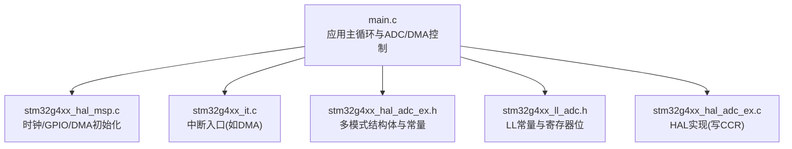
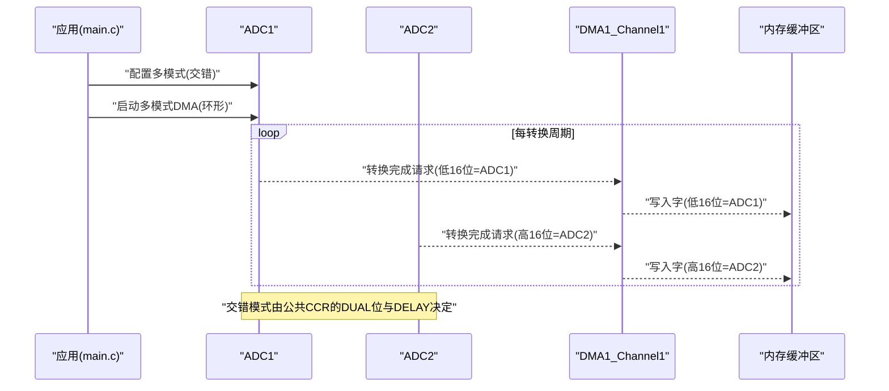
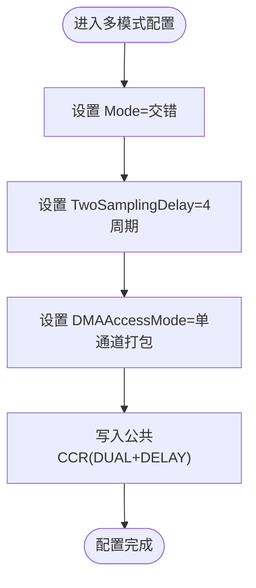
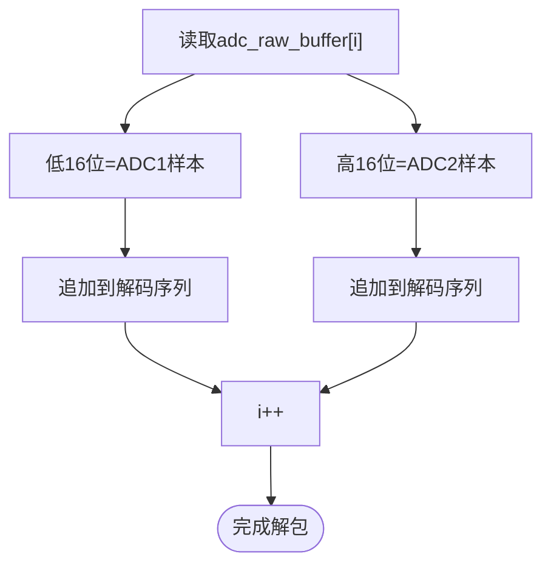
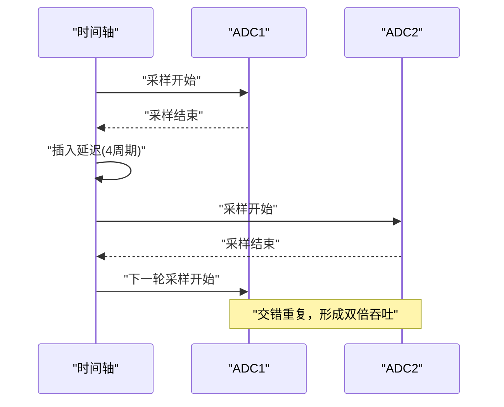
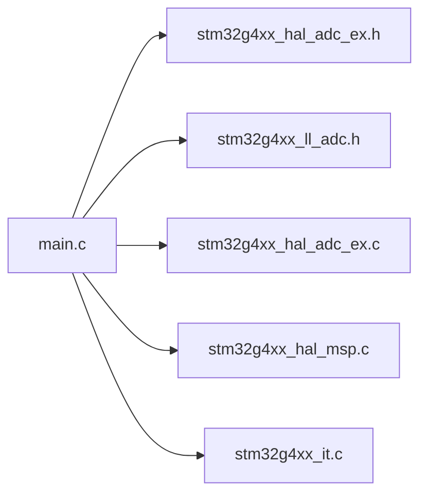

# 双通道交错模式配置

<cite>
**本文引用的文件**   
- [main.c](file://Core/Src/main.c)
- [stm32g4xx_hal_msp.c](file://Core/Src/stm32g4xx_hal_msp.c)
- [stm32g4xx_it.c](file://Core/Src/stm32g4xx_it.c)
- [stm32g4xx_hal_adc_ex.h](file://Drivers/STM32G4xx_HAL_Driver/Inc/stm32g4xx_hal_adc_ex.h)
- [stm32g4xx_ll_adc.h](file://Drivers/STM32G4xx_HAL_Driver/Inc/stm32g4xx_ll_adc.h)
- [stm32g4xx_hal_adc_ex.c](file://Drivers/STM32G4xx_HAL_Driver/Src/stm32g4xx_hal_adc_ex.c)
</cite>

## 目录
1. [简介](#简介)
2. [项目结构](#项目结构)
3. [核心组件](#核心组件)
4. [架构总览](#架构总览)
5. [详细组件分析](#详细组件分析)
6. [依赖关系分析](#依赖关系分析)
7. [性能考虑](#性能考虑)
8. [故障排除指南](#故障排除指南)
9. [结论](#结论)
10. [附录](#附录)

## 简介
本技术文档围绕 STM32G4 的 ADC 双通道交错模式（ADC_DUALMODE_INTERL）展开，系统阐述以下要点：
- ADC1 与 ADC2 在交错模式下的同步工作机制与时序
- 如何实现 8 MSPS 总采样率（时钟分配、采样延迟配置、DMA 访问模式）
- 多模式配置参数（multimode 结构体）含义与使用方式
- DMA 缓冲区中交错数据的存储格式与解包流程
- 面向初学者的基本概念说明，以及面向高级开发者的性能优化与排错建议

## 项目结构
本项目基于 STM32CubeMX 生成的工程，关键代码位于 Core 与 Drivers 目录：
- Core/Src/main.c：应用主循环、ADC 初始化、DMA 启动、触发与数据解包逻辑
- Core/Src/stm32g4xx_hal_msp.c：外设时钟、GPIO、DMA 初始化（含 ADC1/ADC2 的时钟源选择与 DMA 绑定）
- Core/Src/stm32g4xx_it.c：中断服务程序入口（DMA 中断等）
- Drivers/STM32G4xx_HAL_Driver/Inc/stm32g4xx_hal_adc_ex.h：ADC 扩展 HAL 接口与多模式结构体定义
- Drivers/STM32G4xx_HAL_Driver/Inc/stm32g4xx_ll_adc.h：LL 层常量与寄存器位定义（包括交错模式与采样延迟）
- Drivers/STM32G4xx_HAL_Driver/Src/stm32g4xx_hal_adc_ex.c：HAL 实现（写入公共 CCR 寄存器以设置多模式与延迟）

图表来源
- [main.c:344-464](file://Core/Src/main.c#L344-L464)
- [stm32g4xx_hal_msp.c:92-179](file://Core/Src/stm32g4xx_hal_msp.c#L92-L179)
- [stm32g4xx_it.c:1-200](file://Core/Src/stm32g4xx_it.c#L1-L200)
- [stm32g4xx_hal_adc_ex.h:250-275](file://Drivers/STM32G4xx_HAL_Driver/Inc/stm32g4xx_hal_adc_ex.h#L250-L275)
- [stm32g4xx_ll_adc.h:2244-2267](file://Drivers/STM32G4xx_HAL_Driver/Inc/stm32g4xx_ll_adc.h#L2244-L2267)
- [stm32g4xx_hal_adc_ex.c:2180-2230](file://Drivers/STM32G4xx_HAL_Driver/Src/stm32g4xx_hal_adc_ex.c#L2180-L2230)

章节来源
- [main.c:344-464](file://Core/Src/main.c#L344-L464)
- [stm32g4xx_hal_msp.c:92-179](file://Core/Src/stm32g4xx_hal_msp.c#L92-L179)
- [stm32g4xx_it.c:1-200](file://Core/Src/stm32g4xx_it.c#L1-L200)
- [stm32g4xx_hal_adc_ex.h:250-275](file://Drivers/STM32G4xx_HAL_Driver/Inc/stm32g4xx_hal_adc_ex.h#L250-L275)
- [stm32g4xx_ll_adc.h:2244-2267](file://Drivers/STM32G4xx_HAL_Driver/Inc/stm32g4xx_ll_adc.h#L2244-L2267)
- [stm32g4xx_hal_adc_ex.c:2180-2230](file://Drivers/STM32G4xx_HAL_Driver/Src/stm32g4xx_hal_adc_ex.c#L2180-L2230)

## 核心组件
- ADC1/ADC2 实例与句柄：用于配置与启动转换
- DMA1_Channel1：将 ADC 结果从外设搬运至内存，采用环形缓冲
- 多模式配置（multimode）：设置交错模式、DMA 访问模式、两阶段采样延迟
- 触发与回调：EXTI 触发捕获 DMA 位置；DMA 半传输/完成回调用于停止采集并标记数据就绪

章节来源
- [main.c:47-70](file://Core/Src/main.c#L47-L70)
- [main.c:344-464](file://Core/Src/main.c#L344-L464)
- [stm32g4xx_hal_msp.c:127-143](file://Core/Src/stm32g4xx_hal_msp.c#L127-L143)

## 架构总览
下图展示了交错模式下 ADC1/ADC2 与 DMA 的数据流与控制流。

图表来源
- [main.c:381-389](file://Core/Src/main.c#L381-L389)
- [stm32g4xx_hal_adc_ex.c:2192-2200](file://Drivers/STM32G4xx_HAL_Driver/Src/stm32g4xx_hal_adc_ex.c#L2192-L2200)
- [stm32g4xx_ll_adc.h:2244-2267](file://Drivers/STM32G4xx_HAL_Driver/Inc/stm32g4xx_ll_adc.h#L2244-L2267)

## 详细组件分析

### 交错模式原理与同步机制
- 模式选择：通过 multimode.Mode = ADC_DUALMODE_INTERL 启用“组合组常规交错”模式。该模式使 ADC1 与 ADC2 在同一转换序列中交替执行采样/转换。
- 延迟配置：TwoSamplingDelay 设置为 ADC_TWOSAMPLINGDELAY_4CYCLES，表示两个采样阶段之间插入 4 个 ADC 时钟周期的延迟，确保内部流水线稳定。
- DMA 访问模式：DMAAccessMode 设置为 ADC_DMAACCESSMODE_12_10_BITS，表示使用一个 DMA 通道（主 ADC 的 DMA），并将两个 ADC 的结果打包到一个 32 位字中（低 16 位为 ADC1，高 16 位为 ADC2）。
- 寄存器写入：HAL 在多模式配置函数中将 Mode 与 TwoSamplingDelay 写入公共 CCR 寄存器的 DUAL 与 DELAY 字段，从而协调 ADC1/ADC2 的时序。

图表来源
- [main.c:381-389](file://Core/Src/main.c#L381-L389)
- [stm32g4xx_hal_adc_ex.c:2192-2200](file://Drivers/STM32G4xx_HAL_Driver/Src/stm32g4xx_hal_adc_ex.c#L2192-L2200)
- [stm32g4xx_ll_adc.h:2244-2267](file://Drivers/STM32G4xx_HAL_Driver/Inc/stm32g4xx_ll_adc.h#L2244-L2267)

章节来源
- [main.c:381-389](file://Core/Src/main.c#L381-L389)
- [stm32g4xx_hal_adc_ex.c:2180-2230](file://Drivers/STM32G4xx_HAL_Driver/Src/stm32g4xx_hal_adc_ex.c#L2180-L2230)
- [stm32g4xx_ll_adc.h:2244-2267](file://Drivers/STM32G4xx_HAL_Driver/Inc/stm32g4xx_ll_adc.h#L2244-L2267)

### 时钟分配与 8 MSPS 总采样率
- ADC 时钟源：在 MSP 初始化中选择 PLL 作为 ADC12 时钟源，并通过 RCC 配置生效。
- 分频设置：ADC 初始化中 ClockPrescaler 设为 ADC_CLOCK_SYNC_PCLK_DIV1，即不分频，ADC 时钟等于 PCLK。
- 采样时间：每个通道采样时间为 2.5 个 ADC 时钟周期。
- 交错效果：在交错模式下，ADC1 与 ADC2 交替转换，等效总采样率为单个 ADC 的两倍。若单个 ADC 达到 4 MSPS，则交错后总采样率为 8 MSPS。
- 延迟影响：TwoSamplingDelay=4 会在两次采样阶段间引入额外延迟，但整体吞吐仍由 ADC 时钟与采样时间主导。

章节来源
- [stm32g4xx_hal_msp.c:104-115](file://Core/Src/stm32g4xx_hal_msp.c#L104-L115)
- [main.c:360-376](file://Core/Src/main.c#L360-L376)
- [main.c:393-399](file://Core/Src/main.c#L393-L399)

### DMA 访问模式与环形缓冲
- DMA 通道：DMA1_Channel1，方向为外设到内存，外设地址不增，内存地址递增，数据对齐为 32 位字。
- 模式：DMA_CIRCULAR 环形模式，保证连续采集无需重配。
- 数据打包：由于 DMAAccessMode 为 12/10 位打包模式，每次 DMA 传输写入一个 32 位字，其中低 16 位为 ADC1 结果，高 16 位为 ADC2 结果。
- 中断：DMA 半传输与完成回调用于检测采集窗口并完成处理。

章节来源
- [stm32g4xx_hal_msp.c:127-143](file://Core/Src/stm32g4xx_hal_msp.c#L127-L143)
- [main.c:136-149](file://Core/Src/main.c#L136-L149)

### 数据在 DMA 缓冲区中的交错存储格式
- 缓冲区类型：uint32_t adc_raw_buffer[]，每个元素为一个 32 位字。
- 存储格式：低 16 位存放 ADC1 的 12 位结果（右对齐），高 16 位存放 ADC2 的 12 位结果（右对齐）。
- 解包过程：应用侧按顺序读取缓冲区，依次提取低 16 位与高 16 位，得到按时间顺序排列的 ADC1/ADC2 样本序列。

图表来源
- [main.c:156-171](file://Core/Src/main.c#L156-L171)

章节来源
- [main.c:53-62](file://Core/Src/main.c#L53-L62)
- [main.c:156-171](file://Core/Src/main.c#L156-L171)

### 多模式配置完整示例（代码片段路径）
以下为多模式配置的参考路径，包含模式、DMA 访问模式与采样延迟的设置：
- 多模式结构体定义与字段说明：[stm32g4xx_hal_adc_ex.h:250-275](file://Drivers/STM32G4xx_HAL_Driver/Inc/stm32g4xx_hal_adc_ex.h#L250-L275)
- 应用侧配置调用（模式=交错、DMA=打包、延迟=4周期）：[main.c:381-389](file://Core/Src/main.c#L381-L389)
- HAL 实现写入公共 CCR（DUAL+DELAY）：[stm32g4xx_hal_adc_ex.c:2192-2200](file://Drivers/STM32G4xx_HAL_Driver/Src/stm32g4xx_hal_adc_ex.c#L2192-L2200)
- LL 层交错模式常量（LL_ADC_MULTI_DUAL_REG_INTERL）：[stm32g4xx_ll_adc.h:2244-2267](file://Drivers/STM32G4xx_HAL_Driver/Inc/stm32g4xx_ll_adc.h#L2244-L2267)
- LL 层采样延迟常量（ADC_TWOSAMPLINGDELAY_4CYCLES）：[stm32g4xx_ll_adc.h:2304-2332](file://Drivers/STM32G4xx_HAL_Driver/Inc/stm32g4xx_ll_adc.h#L2304-L2332)

章节来源
- [stm32g4xx_hal_adc_ex.h:250-275](file://Drivers/STM32G4xx_HAL_Driver/Inc/stm32g4xx_hal_adc_ex.h#L250-L275)
- [main.c:381-389](file://Core/Src/main.c#L381-L389)
- [stm32g4xx_hal_adc_ex.c:2192-2200](file://Drivers/STM32G4xx_HAL_Driver/Src/stm32g4xx_hal_adc_ex.c#L2192-L2200)
- [stm32g4xx_ll_adc.h:2244-2267](file://Drivers/STM32G4xx_HAL_Driver/Inc/stm32g4xx_ll_adc.h#L2244-L2267)
- [stm32g4xx_ll_adc.h:2304-2332](file://Drivers/STM32G4xx_HAL_Driver/Inc/stm32g4xx_ll_adc.h#L2304-L2332)

### 时序图：两个 ADC 的采样时序关系
交错模式下，ADC1 与 ADC2 的采样/转换在时间上交错进行，中间插入 TwoSamplingDelay 指定的延迟。

图表来源
- [main.c:381-389](file://Core/Src/main.c#L381-L389)
- [stm32g4xx_ll_adc.h:2304-2332](file://Drivers/STM32G4xx_HAL_Driver/Inc/stm32g4xx_ll_adc.h#L2304-L2332)

## 依赖关系分析
- main.c 依赖 HAL/LL 头文件与驱动实现，负责应用逻辑与外设控制
- stm32g4xx_hal_msp.c 提供时钟、GPIO、DMA 的底层初始化
- stm32g4xx_it.c 提供中断入口（DMA 中断等）
- HAL/LL 层提供多模式配置与寄存器操作

图表来源
- [main.c:344-464](file://Core/Src/main.c#L344-L464)
- [stm32g4xx_hal_msp.c:92-179](file://Core/Src/stm32g4xx_hal_msp.c#L92-L179)
- [stm32g4xx_it.c:1-200](file://Core/Src/stm32g4xx_it.c#L1-L200)
- [stm32g4xx_hal_adc_ex.h:250-275](file://Drivers/STM32G4xx_HAL_Driver/Inc/stm32g4xx_hal_adc_ex.h#L250-L275)
- [stm32g4xx_ll_adc.h:2244-2267](file://Drivers/STM32G4xx_HAL_Driver/Inc/stm32g4xx_ll_adc.h#L2244-L2267)
- [stm32g4xx_hal_adc_ex.c:2180-2230](file://Drivers/STM32G4xx_HAL_Driver/Src/stm32g4xx_hal_adc_ex.c#L2180-L2230)

章节来源
- [main.c:344-464](file://Core/Src/main.c#L344-L464)
- [stm32g4xx_hal_msp.c:92-179](file://Core/Src/stm32g4xx_hal_msp.c#L92-L179)
- [stm32g4xx_it.c:1-200](file://Core/Src/stm32g4xx_it.c#L1-L200)
- [stm32g4xx_hal_adc_ex.h:250-275](file://Drivers/STM32G4xx_HAL_Driver/Inc/stm32g4xx_hal_adc_ex.h#L250-L275)
- [stm32g4xx_ll_adc.h:2244-2267](file://Drivers/STM32G4xx_HAL_Driver/Inc/stm32g4xx_ll_adc.h#L2244-L2267)
- [stm32g4xx_hal_adc_ex.c:2180-2230](file://Drivers/STM32G4xx_HAL_Driver/Src/stm32g4xx_hal_adc_ex.c#L2180-L2230)

## 性能考虑
- 时钟与分频：确保 ADC 时钟满足目标采样率要求，PCLK 需具备 50% 占空比（参考手册约束）。
- 采样时间与延迟：在保证信号带宽的前提下尽量减小采样时间；合理设置 TwoSamplingDelay 以避免流水线冲突。
- DMA 模式：使用环形缓冲与单次 DMA 通道打包可降低 CPU 负载，提高吞吐。
- 中断与回调：尽量减少回调中的耗时操作，避免阻塞 DMA 数据流。

## 故障排除指南
- 数据错位或乱序：检查 DMA 打包模式与缓冲区解包逻辑是否一致（低 16 位/高 16 位对应 ADC1/ADC2）。
- 采样率不足：确认 ADC 时钟源与分频设置，核对采样时间与延迟配置。
- 触发丢失或误触发：检查 EXTI 优先级与去抖逻辑，确保在 UART 传输期间忽略触发。
- DMA 溢出或丢数：确认 DMA 环形缓冲大小足够，回调中及时停止与重启采集。

章节来源
- [main.c:91-113](file://Core/Src/main.c#L91-L113)
- [main.c:136-149](file://Core/Src/main.c#L136-L149)
- [main.c:156-171](file://Core/Src/main.c#L156-L171)

## 结论
通过正确配置 ADC 多模式（交错）、DMA 打包与环形缓冲，并结合合理的时钟与采样延迟设置，可在 STM32G4 上实现稳定的 8 MSPS 总采样率。应用侧只需按固定格式解包 DMA 缓冲区，即可获得按时间顺序排列的双通道样本序列。对于高性能场景，应重点关注时钟质量、DMA 效率与中断开销。

## 附录
- 相关宏与常量路径：
  - 交错模式常量：[stm32g4xx_ll_adc.h:2244-2267](file://Drivers/STM32G4xx_HAL_Driver/Inc/stm32g4xx_ll_adc.h#L2244-L2267)
  - 采样延迟常量（4周期）：[stm32g4xx_ll_adc.h:2304-2332](file://Drivers/STM32G4xx_HAL_Driver/Inc/stm32g4xx_ll_adc.h#L2304-L2332)
  - 多模式结构体定义：[stm32g4xx_hal_adc_ex.h:250-275](file://Drivers/STM32G4xx_HAL_Driver/Inc/stm32g4xx_hal_adc_ex.h#L250-L275)
  - HAL 写入 CCR 的实现：[stm32g4xx_hal_adc_ex.c:2192-2200](file://Drivers/STM32G4xx_HAL_Driver/Src/stm32g4xx_hal_adc_ex.c#L2192-L2200)