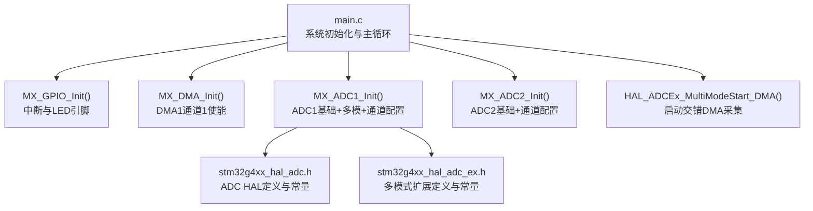
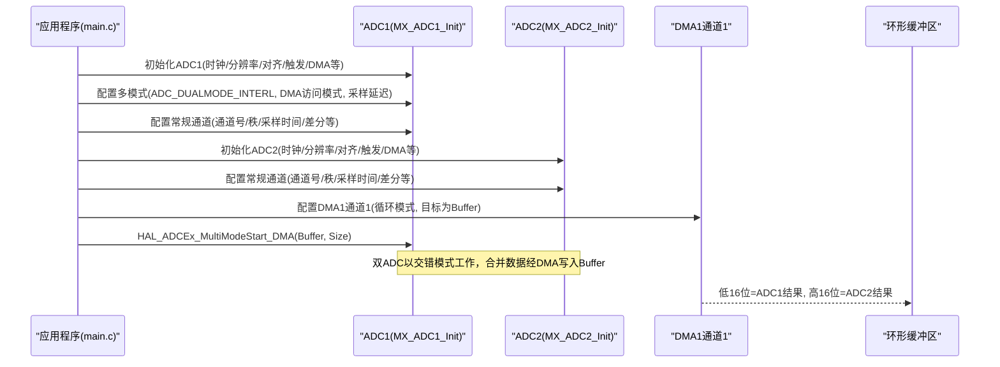
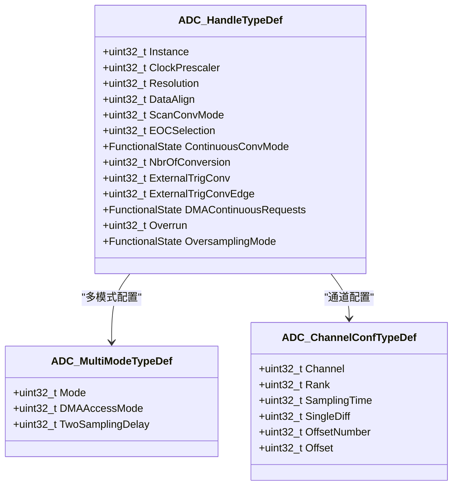
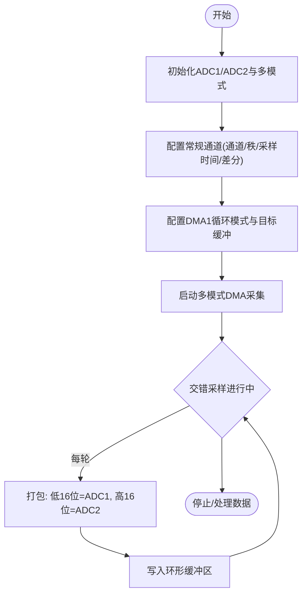
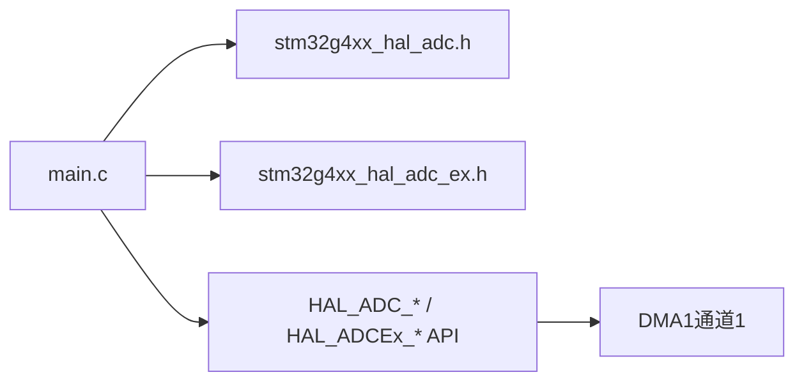

# ADC初始化API

<cite>
**本文引用的文件**   
- [Core/Src/main.c](file://Core/Src/main.c)
- [Core/Inc/main.h](file://Core/Inc/main.h)
- [Drivers/STM32G4xx_HAL_Driver/Inc/stm32g4xx_hal_adc.h](file://Drivers/STM32G4xx_HAL_Driver/Inc/stm32g4xx_hal_adc.h)
- [Drivers/STM32G4xx_HAL_Driver/Inc/stm32g4xx_hal_adc_ex.h](file://Drivers/STM32G4xx_HAL_Driver/Inc/stm32g4xx_hal_adc_ex.h)
</cite>

## 目录
1. [简介](#简介)
2. [项目结构](#项目结构)
3. [核心组件](#核心组件)
4. [架构总览](#架构总览)
5. [详细组件分析](#详细组件分析)
6. [依赖关系分析](#依赖关系分析)
7. [性能与功耗考量](#性能与功耗考量)
8. [故障排查指南](#故障排查指南)
9. [结论](#结论)
10. [附录：配置要点与最佳实践](#附录配置要点与最佳实践)

## 简介
本文件面向使用STM32G4系列MCU的工程师，聚焦于ADC初始化函数MX_ADC1_Init()与MX_ADC2_Init()的实现细节与API说明。文档深入解析以下关键点：
- ADC_HandleTypeDef结构体的关键配置项（时钟预分频、分辨率、数据对齐、扫描模式、触发源、DMA请求、溢出处理等）
- ADC_MultiModeTypeDef多模式配置结构体，重点解释multimode.Mode=ADC_DUALMODE_INTERL交错模式的含义与适用场景
- ADC_ChannelConfTypeDef通道配置结构体的成员变量及有效范围（Channel、Rank、SamplingTime、SingleDiff、OffsetNumber、Offset等）
- 时钟预分频器(ADC_CLOCK_SYNC_PCLK_DIV1)、分辨率(ADC_RESOLUTION_12B)、数据对齐方式的作用与影响
- 完整配置示例路径与最佳实践建议

## 项目结构
本项目为基于CubeMX生成的STM32G4工程，应用层入口在main.c中完成系统时钟、GPIO、DMA、ADC与USB设备的初始化，并在主循环中启动双ADC交错采集并通过DMA环形缓冲接收数据。

图表来源
- [Core/Src/main.c:344-464](file://Core/Src/main.c#L344-L464)
- [Drivers/STM32G4xx_HAL_Driver/Inc/stm32g4xx_hal_adc.h:90-252](file://Drivers/STM32G4xx_HAL_Driver/Inc/stm32g4xx_hal_adc.h#L90-L252)
- [Drivers/STM32G4xx_HAL_Driver/Inc/stm32g4xx_hal_adc_ex.h:259-274](file://Drivers/STM32G4xx_HAL_Driver/Inc/stm32g4xx_hal_adc_ex.h#L259-L274)

章节来源
- [Core/Src/main.c:219-290](file://Core/Src/main.c#L219-L290)
- [Core/Inc/main.h:30](file://Core/Inc/main.h#L30)

## 核心组件
- ADC_HandleTypeDef：描述ADC实例及其常规组配置的全局句柄，包含时钟、分辨率、对齐、扫描、触发、DMA、溢出等参数。
- ADC_MultiModeTypeDef：多模式配置结构体，用于设置双ADC工作模式（独立、同时、交错、交替触发等）、DMA访问模式与两次采样间隔延迟。
- ADC_ChannelConfTypeDef：常规组通道配置结构体，指定通道号、序列秩、采样时间、单端/差分输入、偏移等。

章节来源
- [Drivers/STM32G4xx_HAL_Driver/Inc/stm32g4xx_hal_adc.h:90-252](file://Drivers/STM32G4xx_HAL_Driver/Inc/stm32g4xx_hal_adc.h#L90-L252)
- [Drivers/STM32G4xx_HAL_Driver/Inc/stm32g4xx_hal_adc_ex.h:259-274](file://Drivers/STM32G4xx_HAL_Driver/Inc/stm32g4xx_hal_adc_ex.h#L259-L274)

## 架构总览
下图展示了ADC1/ADC2在多模式交错配置下的初始化与数据采集流程，以及DMA环形缓冲的数据组织方式。

图表来源
- [Core/Src/main.c:344-464](file://Core/Src/main.c#L344-L464)
- [Core/Src/main.c:249-255](file://Core/Src/main.c#L249-L255)

## 详细组件分析

### MX_ADC1_Init() 实现细节
- 初始化ADC1基本参数：
  - 时钟预分频：ADC_CLOCK_SYNC_PCLK_DIV1（同步时钟来自APB，不分频）
  - 分辨率：ADC_RESOLUTION_12B（12位）
  - 数据对齐：ADC_DATAALIGN_RIGHT（右对齐）
  - 扫描模式：ADC_SCAN_DISABLE（单次转换）
  - EOC选择：ADC_EOC_SINGLE_CONV（单次转换结束标志）
  - 连续转换：ENABLE（持续转换）
  - 外部触发：ADC_SOFTWARE_START（软件触发）
  - DMA连续请求：ENABLE（配合DMA循环模式）
  - 溢出行为：ADC_OVR_DATA_PRESERVED（保留旧数据）
  - 过采样：DISABLE
- 配置多模式：
  - multimode.Mode = ADC_DUALMODE_INTERL（双ADC交错模式）
  - multimode.DMAAccessMode = ADC_DMAACCESSMODE_12_10_BITS（12/10位时共用一个DMA通道）
  - multimode.TwoSamplingDelay = ADC_TWOSAMPLINGDELAY_4CYCLES（两次采样间隔4个ADC时钟周期）
- 配置常规通道：
  - Channel = ADC_CHANNEL_3
  - Rank = ADC_REGULAR_RANK_1
  - SamplingTime = ADC_SAMPLETIME_2CYCLES_5
  - SingleDiff = ADC_DIFFERENTIAL_ENDED（差分输入）
  - OffsetNumber = ADC_OFFSET_NONE，Offset = 0

章节来源
- [Core/Src/main.c:344-407](file://Core/Src/main.c#L344-L407)
- [Drivers/STM32G4xx_HAL_Driver/Inc/stm32g4xx_hal_adc.h:90-252](file://Drivers/STM32G4xx_HAL_Driver/Inc/stm32g4xx_hal_adc.h#L90-L252)
- [Drivers/STM32G4xx_HAL_Driver/Inc/stm32g4xx_hal_adc_ex.h:259-274](file://Drivers/STM32G4xx_HAL_Driver/Inc/stm32g4xx_hal_adc_ex.h#L259-L274)

### MX_ADC2_Init() 实现细节
- 初始化ADC2基本参数：
  - 时钟预分频：ADC_CLOCK_SYNC_PCLK_DIV1
  - 分辨率：ADC_RESOLUTION_12B
  - 数据对齐：ADC_DATAALIGN_RIGHT
  - 扫描模式：ADC_SCAN_DISABLE
  - EOC选择：ADC_EOC_SINGLE_CONV
  - 连续转换：ENABLE
  - 外部触发：默认继承多模式（由ADC1主控）
  - DMA连续请求：DISABLE（仅主ADC启用DMA连续请求）
  - 溢出行为：ADC_OVR_DATA_PRESERVED
  - 过采样：DISABLE
- 配置常规通道：
  - Channel = ADC_CHANNEL_3
  - Rank = ADC_REGULAR_RANK_1
  - SamplingTime = ADC_SAMPLETIME_2CYCLES_5
  - SingleDiff = ADC_DIFFERENTIAL_ENDED
  - OffsetNumber = ADC_OFFSET_NONE，Offset = 0

章节来源
- [Core/Src/main.c:414-464](file://Core/Src/main.c#L414-L464)
- [Drivers/STM32G4xx_HAL_Driver/Inc/stm32g4xx_hal_adc.h:90-252](file://Drivers/STM32G4xx_HAL_Driver/Inc/stm32g4xx_hal_adc.h#L90-L252)

### ADC_MultiModeTypeDef 多模式配置详解
- Mode字段：
  - ADC_DUALMODE_INTERL：双ADC常规组交错模式。两个ADC按固定顺序交替进行采样与转换，提高等效采样率并降低单个ADC的负载。适合需要更高吞吐量的应用。
- DMAAccessMode字段：
  - ADC_DMAACCESSMODE_12_10_BITS：当分辨率为12或10位时，使用一个DMA通道（主ADC的DMA）将两路结果打包传输。
- TwoSamplingDelay字段：
  - ADC_TWOSAMPLINGDELAY_4CYCLES：两次采样阶段之间的延迟为4个ADC时钟周期，确保内部开关稳定与信号建立时间。

章节来源
- [Drivers/STM32G4xx_HAL_Driver/Inc/stm32g4xx_hal_adc_ex.h:259-274](file://Drivers/STM32G4xx_HAL_Driver/Inc/stm32g4xx_hal_adc_ex.h#L259-L274)
- [Drivers/STM32G4xx_HAL_Driver/Inc/stm32g4xx_hal_adc_ex.h:445-500](file://Drivers/STM32G4xx_HAL_Driver/Inc/stm32g4xx_hal_adc_ex.h#L445-L500)

### ADC_ChannelConfTypeDef 通道配置详解
- Channel：
  - 可选值包括ADC_CHANNEL_0~ADC_CHANNEL_18，以及内部通道如VREFINT、温度传感器、VBAT等。不同器件封装与ADC实例可用性不同，需参考数据手册。
- Rank：
  - 常规组序列秩，支持ADC_REGULAR_RANK_1~ADC_REGULAR_RANK_16。若ScanConvMode禁用，则仅Rank1生效。
- SamplingTime：
  - 单位：ADC时钟周期。常见值包括ADC_SAMPLETIME_2CYCLES_5、6.5、12.5、24.5、47.5、92.5、247.5、640.5等。采样时间与分辨率共同决定转换时间。
- SingleDiff：
  - 选择单端或差分输入。差分模式下，通道i与i+1构成差分对，仅需配置通道i，i+1自动配置。
- OffsetNumber/Offset：
  - 可选ADC_OFFSET_NONE或ADC_OFFSET_1~ADC_OFFSET_4；Offset范围为对应分辨率的最大数字量（12位为0x000~0xFFF）。

章节来源
- [Drivers/STM32G4xx_HAL_Driver/Inc/stm32g4xx_hal_adc.h:267-300](file://Drivers/STM32G4xx_HAL_Driver/Inc/stm32g4xx_hal_adc.h#L267-L300)
- [Drivers/STM32G4xx_HAL_Driver/Inc/stm32g4xx_hal_adc.h:804-878](file://Drivers/STM32G4xx_HAL_Driver/Inc/stm32g4xx_hal_adc.h#L804-L878)
- [Drivers/STM32G4xx_HAL_Driver/Inc/stm32g4xx_hal_adc_ex.h:400-414](file://Drivers/STM32G4xx_HAL_Driver/Inc/stm32g4xx_hal_adc_ex.h#L400-L414)

### 关键配置选项的作用与影响
- 时钟预分频器(ADC_CLOCK_SYNC_PCLK_DIV1)：
  - 同步时钟来源于APB总线时钟，且不分频。需注意APB时钟占空比要求与最高ADC频率限制。
- 分辨率(ADC_RESOLUTION_12B)：
  - 12位分辨率提供更高的精度，但转换时间更长。转换时间=采样时间+处理时间（12位时为12.5个ADC时钟周期）。
- 数据对齐方式(ADC_DATAALIGN_RIGHT)：
  - 右对齐便于直接读取低位有效数据，常用于数值计算与显示。左对齐适用于某些特定格式需求。

章节来源
- [Drivers/STM32G4xx_HAL_Driver/Inc/stm32g4xx_hal_adc.h:90-127](file://Drivers/STM32G4xx_HAL_Driver/Inc/stm32g4xx_hal_adc.h#L90-L127)
- [Drivers/STM32G4xx_HAL_Driver/Inc/stm32g4xx_hal_adc.h:610-630](file://Drivers/STM32G4xx_HAL_Driver/Inc/stm32g4xx_hal_adc.h#L610-L630)

### 类图：ADC相关结构体与关系

图表来源
- [Drivers/STM32G4xx_HAL_Driver/Inc/stm32g4xx_hal_adc.h:90-252](file://Drivers/STM32G4xx_HAL_Driver/Inc/stm32g4xx_hal_adc.h#L90-L252)
- [Drivers/STM32G4xx_HAL_Driver/Inc/stm32g4xx_hal_adc_ex.h:259-274](file://Drivers/STM32G4xx_HAL_Driver/Inc/stm32g4xx_hal_adc_ex.h#L259-L274)

### 流程图：交错模式DMA数据组织

图表来源
- [Core/Src/main.c:249-255](file://Core/Src/main.c#L249-L255)
- [Core/Src/main.c:344-464](file://Core/Src/main.c#L344-L464)

## 依赖关系分析
- main.c依赖HAL库头文件stm32g4xx_hal_adc.h与stm32g4xx_hal_adc_ex.h，获取ADC类型、常量与API。
- MX_ADC1_Init()调用HAL_ADC_Init()、HAL_ADCEx_MultiModeConfigChannel()、HAL_ADC_ConfigChannel()。
- MX_ADC2_Init()调用HAL_ADC_Init()、HAL_ADC_ConfigChannel()。
- 主循环通过HAL_ADCEx_MultiModeStart_DMA()启动双ADC交错采集，DMA1通道1负责数据传输。

图表来源
- [Core/Src/main.c:344-464](file://Core/Src/main.c#L344-L464)
- [Core/Src/main.c:249-255](file://Core/Src/main.c#L249-L255)

章节来源
- [Core/Src/main.c:219-290](file://Core/Src/main.c#L219-L290)
- [Core/Inc/main.h:30](file://Core/Inc/main.h#L30)

## 性能与功耗考量
- 采样时间与分辨率：
  - 12位分辨率下，转换时间为采样时间+12.5个ADC时钟周期。增加采样时间可提高抗噪能力，但降低采样率。
- 时钟预分频：
  - ADC_CLOCK_SYNC_PCLK_DIV1直接使用APB时钟，需确保APB时钟满足ADC最大频率与占空比要求。
- 多模式交错：
  - 交错模式提升等效采样率，但需合理设置TwoSamplingDelay以保证信号建立时间。
- DMA与溢出：
  - 使用DMA循环模式可避免CPU频繁搬运数据；溢出设置为保留数据时需在中断回调中及时读取，否则可能丢失新数据。

[本节为通用指导，不直接分析具体文件]

## 故障排查指南
- 初始化失败：
  - 检查HAL_ADC_Init()返回值，确认ADC状态与参数合法性（如时钟、分辨率、对齐等）。
- 多模式配置无效：
  - 确认Master与Slave ADC均处于禁用状态后再配置多模式；检查Mode、DMAAccessMode与TwoSamplingDelay组合是否合法。
- 通道配置错误：
  - 确认Channel在目标ADC实例上可用；差分模式下确保配对通道正确；Rank与NbrOfConversion一致。
- DMA未触发或数据错位：
  - 确认DMA1通道1已使能且优先级设置正确；DMA循环模式与ADC DMA连续请求匹配；缓冲大小与Size一致。
- 溢出事件：
  - 若Overrun设为保留数据，需在回调中读取并清除标志，避免数据堆积。

章节来源
- [Core/Src/main.c:344-464](file://Core/Src/main.c#L344-L464)
- [Drivers/STM32G4xx_HAL_Driver/Inc/stm32g4xx_hal_adc.h:227-252](file://Drivers/STM32G4xx_HAL_Driver/Inc/stm32g4xx_hal_adc.h#L227-L252)

## 结论
通过对MX_ADC1_Init()与MX_ADC2_Init()的详细分析，明确了ADC_HandleTypeDef、ADC_MultiModeTypeDef与ADC_ChannelConfTypeDef的关键配置项及其作用。交错模式结合DMA可实现高效的双通道数据采集，适用于高频采样场景。遵循最佳实践与注意事项，可有效提升系统稳定性与性能。

[本节为总结性内容，不直接分析具体文件]

## 附录：配置要点与最佳实践
- 时钟与分辨率：
  - 使用ADC_CLOCK_SYNC_PCLK_DIV1时，确保APB时钟满足ADC频率与占空比要求；12位分辨率适合高精度应用。
- 数据对齐：
  - 右对齐便于数据处理；如需高位优先，可选择左对齐。
- 多模式交错：
  - ADC_DUALMODE_INTERL适合提高采样率；DMAAccessMode根据分辨率选择；TwoSamplingDelay需根据信号特性调整。
- 通道配置：
  - 差分模式需正确配对通道；采样时间根据信号带宽与噪声环境调整；Offset可用于校准。
- DMA与溢出：
  - 使用DMA循环模式；溢出策略根据应用需求选择；在中断回调中及时处理数据。

章节来源
- [Core/Src/main.c:344-464](file://Core/Src/main.c#L344-L464)
- [Drivers/STM32G4xx_HAL_Driver/Inc/stm32g4xx_hal_adc.h:90-252](file://Drivers/STM32G4xx_HAL_Driver/Inc/stm32g4xx_hal_adc.h#L90-L252)
- [Drivers/STM32G4xx_HAL_Driver/Inc/stm32g4xx_hal_adc_ex.h:259-274](file://Drivers/STM32G4xx_HAL_Driver/Inc/stm32g4xx_hal_adc_ex.h#L259-L274)