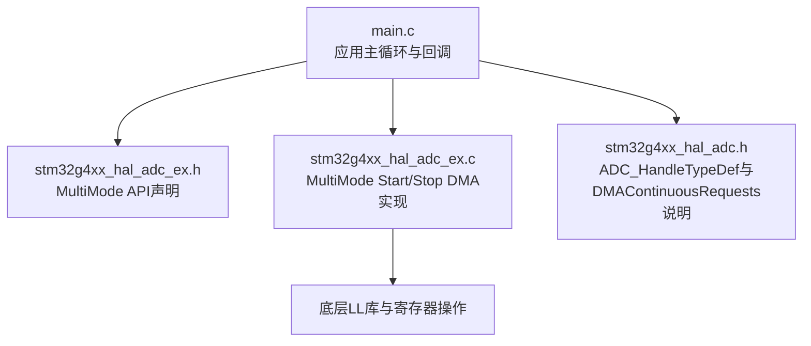
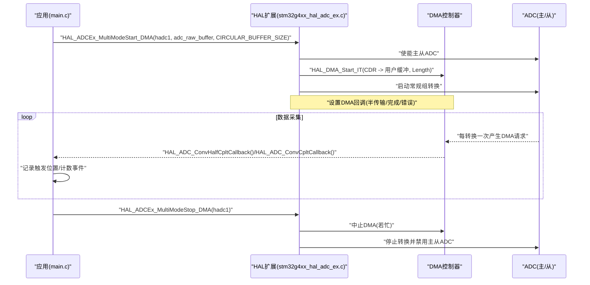
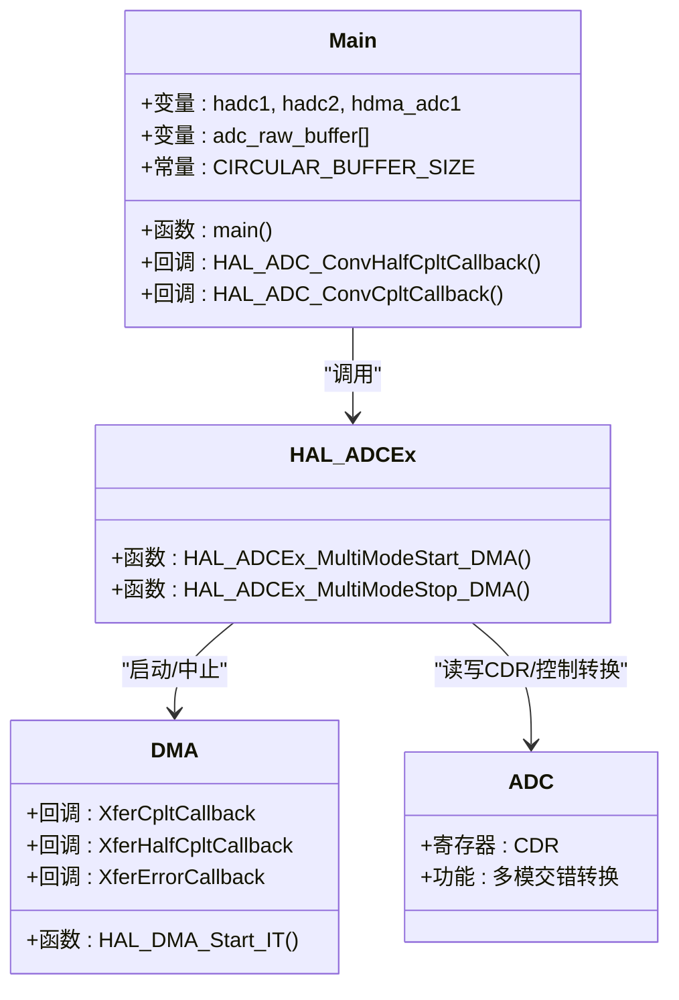

# ADC启动停止API

<cite>
**本文引用的文件**
- [Core/Src/main.c](file://Core/Src/main.c)
- [Core/Inc/main.h](file://Core/Inc/main.h)
- [Drivers/STM32G4xx_HAL_Driver/Inc/stm32g4xx_hal_adc_ex.h](file://Drivers/STM32G4xx_HAL_Driver/Inc/stm32g4xx_hal_adc_ex.h)
- [Drivers/STM32G4xx_HAL_Driver/Src/stm32g4xx_hal_adc_ex.c](file://Drivers/STM32G4xx_HAL_Driver/Src/stm32g4xx_hal_adc_ex.c)
- [Drivers/STM32G4xx_HAL_Driver/Inc/stm32g4xx_hal_adc.h](file://Drivers/STM32G4xx_HAL_Driver/Inc/stm32g4xx_hal_adc.h)
</cite>

## 目录
1. [简介](#简介)
2. [项目结构](#项目结构)
3. [核心组件](#核心组件)
4. [架构总览](#架构总览)
5. [详细组件分析](#详细组件分析)
6. [依赖关系分析](#依赖关系分析)
7. [性能与配置要点](#性能与配置要点)
8. [故障排查指南](#故障排查指南)
9. [结论](#结论)
10. [附录：完整调用流程示例路径](#附录完整调用流程示例路径)

## 简介
本文件为ADC交错模式（双ADC）DMA传输的启动与停止API文档，聚焦以下函数：
- HAL_ADCEx_MultiModeStart_DMA()：以DMA方式启动多模（交错）转换
- HAL_ADCEx_MultiModeStop_DMA()：停止多模转换并关闭DMA通道

文档将详细说明：
- 参数含义与设置方法（hadc1指针、DMA缓冲区地址adc_raw_buffer、缓冲区大小CIRCULAR_BUFFER_SIZE）
- DMA连续请求模式（DMAContinuousRequests = ENABLE）对数据传输的影响
- 返回值类型与错误处理机制（HAL_OK/HAL_ERROR等）
- 启动-停止流程的完整代码示例位置与异常处理策略

## 项目结构
本项目基于STM32CubeMX生成的工程，使用HAL驱动。与本次API相关的核心位置如下：
- 应用层入口与初始化：Core/Src/main.c
- HAL扩展接口声明：Drivers/STM32G4xx_HAL_Driver/Inc/stm32g4xx_hal_adc_ex.h
- HAL扩展实现（含MultiMode Start/Stop DMA）：Drivers/STM32G4xx_HAL_Driver/Src/stm32g4xx_hal_adc_ex.c
- ADC通用结构体定义（含DMAContinuousRequests字段说明）：Drivers/STM32G4xx_HAL_Driver/Inc/stm32g4xx_hal_adc.h

图表来源
- [Core/Src/main.c:249-254](file://Core/Src/main.c#L249-L254)
- [Drivers/STM32G4xx_HAL_Driver/Inc/stm32g4xx_hal_adc_ex.h:1506-1508](file://Drivers/STM32G4xx_HAL_Driver/Inc/stm32g4xx_hal_adc_ex.h#L1506-L1508)
- [Drivers/STM32G4xx_HAL_Driver/Src/stm32g4xx_hal_adc_ex.c:862-966](file://Drivers/STM32G4xx_HAL_Driver/Src/stm32g4xx_hal_adc_ex.c#L862-L966)
- [Drivers/STM32G4xx_HAL_Driver/Inc/stm32g4xx_hal_adc.h:219-225](file://Drivers/STM32G4xx_HAL_Driver/Inc/stm32g4xx_hal_adc.h#L219-L225)

章节来源
- [Core/Src/main.c:249-254](file://Core/Src/main.c#L249-L254)
- [Drivers/STM32G4xx_HAL_Driver/Inc/stm32g4xx_hal_adc_ex.h:1506-1508](file://Drivers/STM32G4xx_HAL_Driver/Inc/stm32g4xx_hal_adc_ex.h#L1506-L1508)
- [Drivers/STM32G4xx_HAL_Driver/Src/stm32g4xx_hal_adc_ex.c:862-966](file://Drivers/STM32G4xx_HAL_Driver/Src/stm32g4xx_hal_adc_ex.c#L862-L966)
- [Drivers/STM32G4xx_HAL_Driver/Inc/stm32g4xx_hal_adc.h:219-225](file://Drivers/STM32G4xx_HAL_Driver/Inc/stm32g4xx_hal_adc.h#L219-L225)

## 核心组件
- HAL_ADCEx_MultiModeStart_DMA()
  - 功能：启用ADC外设（主从），启动多模（交错）转换，并通过DMA将合并数据写入内存
  - 关键行为：
    - 校验主ADC实例与相关参数
    - 使能主从ADC
    - 设置DMA回调（半传输、完成、错误）
    - 清除标志位，开启溢出中断
    - 启动DMA（源地址为公共数据寄存器CDR，目的地址为用户缓冲）
    - 启动ADC常规组转换（软件触发或外部触发）
- HAL_ADCEx_MultiModeStop_DMA()
  - 功能：停止多模转换，禁用DMA通道，必要时禁用主从ADC
  - 关键行为：
    - 等待主从转换结束（带超时）
    - 中止正在进行的DMA传输
    - 关闭溢出中断
    - 禁用主从ADC，更新状态

章节来源
- [Drivers/STM32G4xx_HAL_Driver/Src/stm32g4xx_hal_adc_ex.c:862-966](file://Drivers/STM32G4xx_HAL_Driver/Src/stm32g4xx_hal_adc_ex.c#L862-L966)
- [Drivers/STM32G4xx_HAL_Driver/Src/stm32g4xx_hal_adc_ex.c:981-1100](file://Drivers/STM32G4xx_HAL_Driver/Src/stm32g4xx_hal_adc_ex.c#L981-L1100)

## 架构总览
下图展示了应用层如何通过HAL API启动/停止多模DMA采集，以及DMA回调在环形缓冲中的协作。

图表来源
- [Core/Src/main.c:249-254](file://Core/Src/main.c#L249-L254)
- [Core/Src/main.c:136-149](file://Core/Src/main.c#L136-L149)
- [Drivers/STM32G4xx_HAL_Driver/Src/stm32g4xx_hal_adc_ex.c:862-966](file://Drivers/STM32G4xx_HAL_Driver/Src/stm32g4xx_hal_adc_ex.c#L862-L966)
- [Drivers/STM32G4xx_HAL_Driver/Src/stm32g4xx_hal_adc_ex.c:981-1100](file://Drivers/STM32G4xx_HAL_Driver/Src/stm32g4xx_hal_adc_ex.c#L981-L1100)

## 详细组件分析

### HAL_ADCEx_MultiModeStart_DMA()
- 函数原型与位置
  - 声明：[stm32g4xx_hal_adc_ex.h:1507](file://Drivers/STM32G4xx_HAL_Driver/Inc/stm32g4xx_hal_adc_ex.h#L1507)
  - 实现：[stm32g4xx_hal_adc_ex.c:862-966](file://Drivers/STM32G4xx_HAL_Driver/Src/stm32g4xx_hal_adc_ex.c#L862-L966)
- 参数说明
  - hadc：指向主ADC的句柄指针（例如&hadc1）。仅支持主ADC实例。
  - pData：目标缓冲区地址（uint32_t*）。在多模模式下，DMA源地址为公共数据寄存器CDR，数据格式由多模DMA访问模式决定（如12/10位时，两个ADC结果打包到一个32位字中）。
  - Length：要传输的数据项数量（Length个uint32_t）。对于交错模式，每个DMA传输包含一个主+从的打包数据。
- 返回值
  - HAL_StatusTypeDef：成功返回HAL_OK；失败可能返回HAL_BUSY（已有转换进行中）、HAL_ERROR（参数或配置错误）等。
- 关键行为
  - 校验主ADC实例与参数（包括DMAContinuousRequests有效性）
  - 使能主从ADC
  - 设置DMA回调（XferCpltCallback/XferHalfCpltCallback/XferErrorCallback）
  - 清除标志位，开启溢出中断
  - 启动DMA（源=CDR，目的=pData，长度=Length）
  - 启动ADC常规组转换（立即或等待触发）
- 典型调用位置
  - [main.c:249-254](file://Core/Src/main.c#L249-L254)

章节来源
- [Drivers/STM32G4xx_HAL_Driver/Inc/stm32g4xx_hal_adc_ex.h:1507](file://Drivers/STM32G4xx_HAL_Driver/Inc/stm32g4xx_hal_adc_ex.h#L1507)
- [Drivers/STM32G4xx_HAL_Driver/Src/stm32g4xx_hal_adc_ex.c:862-966](file://Drivers/STM32G4xx_HAL_Driver/Src/stm32g4xx_hal_adc_ex.c#L862-L966)
- [Core/Src/main.c:249-254](file://Core/Src/main.c#L249-L254)

### HAL_ADCEx_MultiModeStop_DMA()
- 函数原型与位置
  - 声明：[stm32g4xx_hal_adc_ex.h:1508](file://Drivers/STM32G4xx_HAL_Driver/Inc/stm32g4xx_hal_adc_ex.h#L1508)
  - 实现：[stm32g4xx_hal_adc_ex.c:981-1100](file://Drivers/STM32G4xx_HAL_Driver/Src/stm32g4xx_hal_adc_ex.c#L981-L1100)
- 参数说明
  - hadc：指向主ADC的句柄指针。
- 返回值
  - HAL_StatusTypeDef：成功返回HAL_OK；失败可能返回HAL_ERROR（内部错误、DMA中止失败、超时等）。
- 关键行为
  - 停止主从ADC转换（常规与注入组）
  - 等待转换结束（带超时保护）
  - 中止DMA（若处于忙状态）
  - 关闭溢出中断
  - 禁用主从ADC，更新状态机
- 使用场景与调用时机
  - 当需要停止采集（例如触发后已收集到足够数据）时调用
  - 在应用层根据DMA回调事件判断是否满足条件后调用
  - 参考应用层逻辑：在检测到两次DMA事件（半传输+全传输）后停止
    - [main.c:119-131](file://Core/Src/main.c#L119-L131)

章节来源
- [Drivers/STM32G4xx_HAL_Driver/Inc/stm32g4xx_hal_adc_ex.h:1508](file://Drivers/STM32G4xx_HAL_Driver/Inc/stm32g4xx_hal_adc_ex.h#L1508)
- [Drivers/STM32G4xx_HAL_Driver/Src/stm32g4xx_hal_adc_ex.c:981-1100](file://Drivers/STM32G4xx_HAL_Driver/Src/stm32g4xx_hal_adc_ex.c#L981-L1100)
- [Core/Src/main.c:119-131](file://Core/Src/main.c#L119-L131)

### DMA连续请求模式（DMAContinuousRequests = ENABLE）的影响
- 字段定义与说明
  - DMAContinuousRequests位于ADC_HandleTypeDef.Init，用于指定DMA请求是一次性还是连续模式
  - 文档注释指出：连续模式下必须将DMA配置为环形模式，否则到达缓冲区末尾时将触发溢出错误
  - 参考定义与注释：[stm32g4xx_hal_adc.h:219-225](file://Drivers/STM32G4xx_HAL_Driver/Inc/stm32g4xx_hal_adc.h#L219-L225)
- 在本项目中的配置
  - 主ADC（hadc1）设置为ENABLE，配合环形DMA缓冲进行连续采集
    - [main.c:372](file://Core/Src/main.c#L372)
  - 从ADC（hadc2）设置为DISABLE（多模下由主ADC统一控制DMA）
    - [main.c:439](file://Core/Src/main.c#L439)
- 影响总结
  - ENABLE + DMA环形模式：可实现无限制的数据流，适合持续采样与触发捕获
  - DISABLE + DMA非环形模式：一次性传输，达到长度后停止，适用于单次采集

章节来源
- [Drivers/STM32G4xx_HAL_Driver/Inc/stm32g4xx_hal_adc.h:219-225](file://Drivers/STM32G4xx_HAL_Driver/Inc/stm32g4xx_hal_adc.h#L219-L225)
- [Core/Src/main.c:372](file://Core/Src/main.c#L372)
- [Core/Src/main.c:439](file://Core/Src/main.c#L439)

### 返回值类型与错误处理机制
- 返回值类型
  - HAL_StatusTypeDef，常见值：
    - HAL_OK：成功
    - HAL_BUSY：资源忙（例如已有转换在进行）
    - HAL_ERROR：参数/配置错误或内部错误
    - HAL_TIMEOUT：等待超时（停止函数中可能出现）
- 错误处理建议
  - 启动失败：检查hadc是否为有效的ADC主实例、DMA句柄是否正确、DMA是否已配置为环形模式且长度匹配
  - 停止失败：确认DMA是否仍在忙、是否存在未结束的转换、是否发生DMA中止错误
  - 应用层可结合Error_Handler进行停机或重试策略
- 参考实现中的错误分支
  - 启动：参数校验失败、DMA起始失败、ADC使能失败等路径返回HAL_ERROR或HAL_BUSY
    - [stm32g4xx_hal_adc_ex.c:862-966](file://Drivers/STM32G4xx_HAL_Driver/Src/stm32g4xx_hal_adc_ex.c#L862-L966)
  - 停止：等待转换超时、DMA中止失败、ADC禁用失败等路径返回HAL_ERROR
    - [stm32g4xx_hal_adc_ex.c:981-1100](file://Drivers/STM32G4xx_HAL_Driver/Src/stm32g4xx_hal_adc_ex.c#L981-L1100)

章节来源
- [Drivers/STM32G4xx_HAL_Driver/Src/stm32g4xx_hal_adc_ex.c:862-966](file://Drivers/STM32G4xx_HAL_Driver/Src/stm32g4xx_hal_adc_ex.c#L862-L966)
- [Drivers/STM32G4xx_HAL_Driver/Src/stm32g4xx_hal_adc_ex.c:981-1100](file://Drivers/STM32G4xx_HAL_Driver/Src/stm32g4xx_hal_adc_ex.c#L981-L1100)

### 启动-停止流程与异常处理策略（应用层）
- 启动流程
  - 初始化系统时钟、GPIO、DMA、ADC1/ADC2
  - 配置多模（交错模式）与通道
  - 调用HAL_ADCEx_MultiModeStart_DMA(&hadc1, (uint32_t*)adc_raw_buffer, CIRCULAR_BUFFER_SIZE)
  - 检查返回值，失败则进入错误处理
  - 参考：[main.c:249-254](file://Core/Src/main.c#L249-L254)
- 停止流程
  - 在DMA回调中累计事件（半传输+全传输），达到阈值后调用HAL_ADCEx_MultiModeStop_DMA(&hadc1)
  - 停止成功后置位data_ready标志，主循环处理数据并再次启动
  - 参考：
    - 回调与停止逻辑：[main.c:119-131](file://Core/Src/main.c#L119-L131)
    - 主循环重启：[main.c:282-286](file://Core/Src/main.c#L282-L286)
- 异常处理
  - 启动失败：Error_Handler（当前实现为死循环）
    - [main.c:252-254](file://Core/Src/main.c#L252-L254)
  - 停止失败：应检查DMA状态与ADC状态，必要时复位或重新初始化
    - [stm32g4xx_hal_adc_ex.c:981-1100](file://Drivers/STM32G4xx_HAL_Driver/Src/stm32g4xx_hal_adc_ex.c#L981-L1100)

章节来源
- [Core/Src/main.c:249-254](file://Core/Src/main.c#L249-L254)
- [Core/Src/main.c:119-131](file://Core/Src/main.c#L119-L131)
- [Core/Src/main.c:282-286](file://Core/Src/main.c#L282-L286)
- [Drivers/STM32G4xx_HAL_Driver/Src/stm32g4xx_hal_adc_ex.c:981-1100](file://Drivers/STM32G4xx_HAL_Driver/Src/stm32g4xx_hal_adc_ex.c#L981-L1100)

## 依赖关系分析
- 应用层依赖HAL扩展接口
- HAL扩展实现依赖底层LL库与DMA/ADC寄存器操作
- 多模DMA数据源为公共数据寄存器CDR，主从ADC共享同一DMA通道

图表来源
- [Core/Src/main.c:48-59](file://Core/Src/main.c#L48-L59)
- [Drivers/STM32G4xx_HAL_Driver/Src/stm32g4xx_hal_adc_ex.c:862-966](file://Drivers/STM32G4xx_HAL_Driver/Src/stm32g4xx_hal_adc_ex.c#L862-L966)
- [Drivers/STM32G4xx_HAL_Driver/Src/stm32g4xx_hal_adc_ex.c:981-1100](file://Drivers/STM32G4xx_HAL_Driver/Src/stm32g4xx_hal_adc_ex.c#L981-L1100)

章节来源
- [Core/Src/main.c:48-59](file://Core/Src/main.c#L48-L59)
- [Drivers/STM32G4xx_HAL_Driver/Src/stm32g4xx_hal_adc_ex.c:862-966](file://Drivers/STM32G4xx_HAL_Driver/Src/stm32g4xx_hal_adc_ex.c#L862-L966)
- [Drivers/STM32G4xx_HAL_Driver/Src/stm32g4xx_hal_adc_ex.c:981-1100](file://Drivers/STM32G4xx_HAL_Driver/Src/stm32g4xx_hal_adc_ex.c#L981-L1100)

## 性能与配置要点
- 多模DMA访问模式
  - 12/10位分辨率时使用单DMA通道打包两个ADC结果（主/从各16位）
  - 8/6位分辨率时使用另一打包模式
  - 参考：[stm32g4xx_hal_adc_ex.h:460-470](file://Drivers/STM32G4xx_HAL_Driver/Inc/stm32g4xx_hal_adc_ex.h#L460-L470)
- DMA环形缓冲
  - 必须与DMAContinuousRequests=ENABLE配合，避免溢出
  - 缓冲区大小需覆盖期望的采样窗口（预触发+后触发）
  - 参考：[stm32g4xx_hal_adc.h:219-225](file://Drivers/STM32G4xx_HAL_Driver/Inc/stm32g4xx_hal_adc.h#L219-L225)
- 触发与时间窗
  - 通过EXTI捕获触发时刻，读取DMA剩余计数计算触发位置
  - 利用半传输/全传输回调确保足够的后触发样本
  - 参考：[main.c:91-113](file://Core/Src/main.c#L91-L113)、[main.c:119-131](file://Core/Src/main.c#L119-L131)

章节来源
- [Drivers/STM32G4xx_HAL_Driver/Inc/stm32g4xx_hal_adc_ex.h:460-470](file://Drivers/STM32G4xx_HAL_Driver/Inc/stm32g4xx_hal_adc_ex.h#L460-L470)
- [Drivers/STM32G4xx_HAL_Driver/Inc/stm32g4xx_hal_adc.h:219-225](file://Drivers/STM32G4xx_HAL_Driver/Inc/stm32g4xx_hal_adc.h#L219-L225)
- [Core/Src/main.c:91-113](file://Core/Src/main.c#L91-L113)
- [Core/Src/main.c:119-131](file://Core/Src/main.c#L119-L131)

## 故障排查指南
- 常见问题
  - 启动返回HAL_BUSY：已有转换在进行，需先停止或等待
  - 启动返回HAL_ERROR：参数无效（非主ADC实例）、DMA句柄未正确关联、DMA未配置为环形模式
  - 停止返回HAL_ERROR：DMA中止失败、转换未结束导致超时、ADC禁用失败
- 定位步骤
  - 检查hadc是否为ADC主实例（hadc1）
  - 确认DMA句柄hdma_adc1已初始化并关联至ADC1
  - 确认DMA模式为环形，缓冲区长度与CIRCULAR_BUFFER_SIZE一致
  - 检查DMAContinuousRequests在主ADC上设为ENABLE，从ADC可为DISABLE
  - 查看回调是否被调用（半传输/全传输），确认触发位置计算逻辑
- 参考实现位置
  - 启动错误分支：[stm32g4xx_hal_adc_ex.c:862-966](file://Drivers/STM32G4xx_HAL_Driver/Src/stm32g4xx_hal_adc_ex.c#L862-L966)
  - 停止错误分支：[stm32g4xx_hal_adc_ex.c:981-1100](file://Drivers/STM32G4xx_HAL_Driver/Src/stm32g4xx_hal_adc_ex.c#L981-L1100)
  - 应用层错误处理入口：[main.c:530-539](file://Core/Src/main.c#L530-L539)

章节来源
- [Drivers/STM32G4xx_HAL_Driver/Src/stm32g4xx_hal_adc_ex.c:862-966](file://Drivers/STM32G4xx_HAL_Driver/Src/stm32g4xx_hal_adc_ex.c#L862-L966)
- [Drivers/STM32G4xx_HAL_Driver/Src/stm32g4xx_hal_adc_ex.c:981-1100](file://Drivers/STM32G4xx_HAL_Driver/Src/stm32g4xx_hal_adc_ex.c#L981-L1100)
- [Core/Src/main.c:530-539](file://Core/Src/main.c#L530-L539)

## 结论
- HAL_ADCEx_MultiModeStart_DMA()与HAL_ADCEx_MultiModeStop_DMA()提供了便捷的多模（交错）DMA采集能力
- 正确配置DMAContinuousRequests与DMA环形模式是保证稳定连续采集的关键
- 应用层应结合DMA回调与触发事件，合理管理启动/停止流程，并对错误码进行处理

## 附录：完整调用流程示例路径
- 启动调用位置
  - [main.c:249-254](file://Core/Src/main.c#L249-L254)
- 停止调用位置（在回调中）
  - [main.c:119-131](file://Core/Src/main.c#L119-L131)
- 再次启动（主循环中）
  - [main.c:282-286](file://Core/Src/main.c#L282-L286)
- DMA回调
  - 半传输回调：[main.c:136-140](file://Core/Src/main.c#L136-L140)
  - 全传输回调：[main.c:145-149](file://Core/Src/main.c#L145-L149)
- 触发检测与位置计算
  - EXTI回调：[main.c:91-113](file://Core/Src/main.c#L91-L113)
- 错误处理入口
  - Error_Handler：[main.c:530-539](file://Core/Src/main.c#L530-L539)