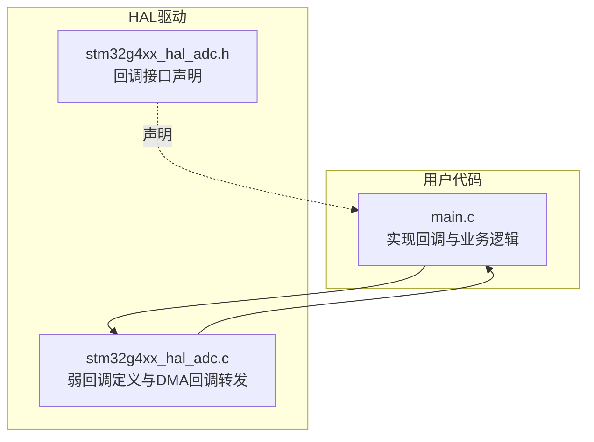
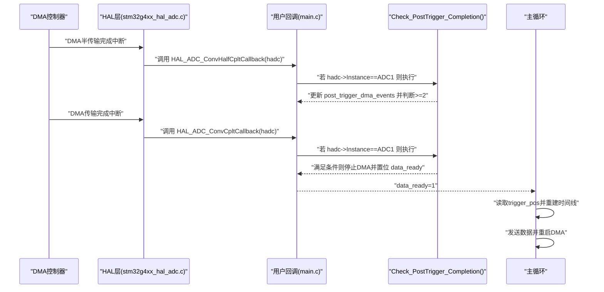
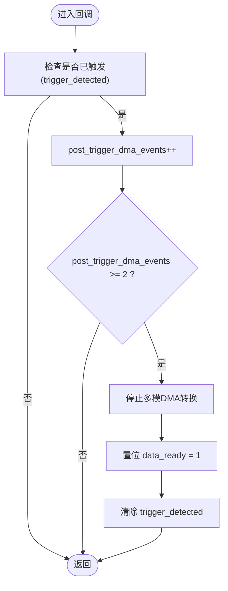
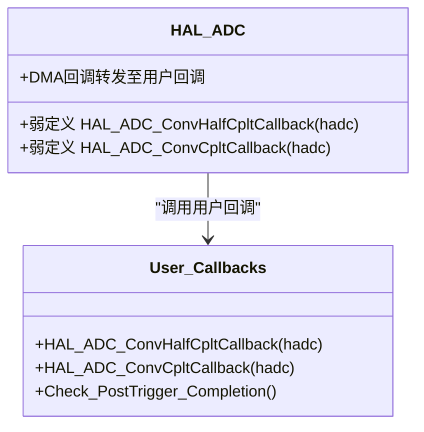

# ADC回调API

<cite>
**本文引用的文件**   
- [Core/Src/main.c](file://Core/Src/main.c)
- [Drivers/STM32G4xx_HAL_Driver/Src/stm32g4xx_hal_adc.c](file://Drivers/STM32G4xx_HAL_Driver/Src/stm32g4xx_hal_adc.c)
- [Drivers/STM32G4xx_HAL_Driver/Inc/stm32g4xx_hal_adc.h](file://Drivers/STM32G4xx_HAL_Driver/Inc/stm32g4xx_hal_adc.h)
</cite>

## 目录
1. [简介](#简介)
2. [项目结构](#项目结构)
3. [核心组件](#核心组件)
4. [架构总览](#架构总览)
5. [详细组件分析](#详细组件分析)
6. [依赖关系分析](#依赖关系分析)
7. [性能与中断上下文约束](#性能与中断上下文约束)
8. [故障排查指南](#故障排查指南)
9. [结论](#结论)
10. [附录：回调注册与自定义处理示例](#附录回调注册与自定义处理示例)

## 简介
本文件面向使用STM32 HAL库的ADC DMA环形缓冲应用，聚焦于以下回调API的使用与实现细节：
- HAL_ADC_ConvHalfCpltCallback()：DMA半传输完成回调
- HAL_ADC_ConvCpltCallback()：DMA传输完成回调
并深入解释：
- 触发条件与调用路径（HAL层到用户回调）
- hadc->Instance == ADC1的判断机制
- 两个回调在环形缓冲区管理中的协作关系
- Check_PostTrigger_Completion()共享后触发完成逻辑的实现原理与post_trigger_dma_events计数器的作用
- 在中断上下文中的执行限制与性能考虑
- 回调函数注册与自定义处理的完整示例

## 项目结构
本项目采用CubeMX生成的标准分层结构：
- Core/Src/main.c：用户业务逻辑、回调实现、主循环
- Drivers/STM32G4xx_HAL_Driver：HAL驱动源码与头文件，包含ADC回调的弱定义与DMA回调转发逻辑

图表来源
- [Core/Src/main.c:136-149](file://Core/Src/main.c#L136-L149)
- [Drivers/STM32G4xx_HAL_Driver/Src/stm32g4xx_hal_adc.c:2662-2685](file://Drivers/STM32G4xx_HAL_Driver/Src/stm32g4xx_hal_adc.c#L2662-L2685)
- [Drivers/STM32G4xx_HAL_Driver/Inc/stm32g4xx_hal_adc.h:2254-2255](file://Drivers/STM32G4xx_HAL_Driver/Inc/stm32g4xx_hal_adc.h#L2254-L2255)

章节来源
- [Core/Src/main.c:1-556](file://Core/Src/main.c#L1-L556)
- [Drivers/STM32G4xx_HAL_Driver/Src/stm32g4xx_hal_adc.c:2662-2685](file://Drivers/STM32G4xx_HAL_Driver/Src/stm32g4xx_hal_adc.c#L2662-L2685)
- [Drivers/STM32G4xx_HAL_Driver/Inc/stm32g4xx_hal_adc.h:2254-2255](file://Drivers/STM32G4xx_HAL_Driver/Inc/stm32g4xx_hal_adc.h#L2254-L2255)

## 核心组件
- HAL_ADC_ConvHalfCpltCallback()：由HAL在DMA半传输完成时调用，用于处理半块数据到达事件。
- HAL_ADC_ConvCpltCallback()：由HAL在DMA传输完成（整圈）时调用，用于处理一圈数据到达事件。
- Check_PostTrigger_Completion()：用户侧共享的后触发完成判定逻辑，结合外部触发与DMA事件计数，决定何时停止采集并通知主循环处理数据。

章节来源
- [Core/Src/main.c:136-149](file://Core/Src/main.c#L136-L149)
- [Core/Src/main.c:118-131](file://Core/Src/main.c#L118-L131)
- [Drivers/STM32G4xx_HAL_Driver/Src/stm32g4xx_hal_adc.c:2662-2685](file://Drivers/STM32G4xx_HAL_Driver/Src/stm32g4xx_hal_adc.c#L2662-L2685)

## 架构总览
下图展示了从DMA中断到用户回调的完整调用链，以及用户回调如何协同工作以完成“前触发+后触发”的数据窗口捕获。

图表来源
- [Drivers/STM32G4xx_HAL_Driver/Src/stm32g4xx_hal_adc.c:3664-3675](file://Drivers/STM32G4xx_HAL_Driver/Src/stm32g4xx_hal_adc.c#L3664-L3675)
- [Drivers/STM32G4xx_HAL_Driver/Src/stm32g4xx_hal_adc.c:3633-3638](file://Drivers/STM32G4xx_HAL_Driver/Src/stm32g4xx_hal_adc.c#L3633-L3638)
- [Core/Src/main.c:136-149](file://Core/Src/main.c#L136-L149)
- [Core/Src/main.c:118-131](file://Core/Src/main.c#L118-L131)
- [Core/Src/main.c:264-287](file://Core/Src/main.c#L264-L287)

## 详细组件分析

### HAL_ADC_ConvHalfCpltCallback() 半传输完成回调
- 触发条件
  - 当ADC配置为DMA模式且启用半传输中断时，DMA每写入一半缓冲区即产生一次半传输完成中断。
  - HAL内部通过DMA回调入口将事件转发至用户实现的HAL_ADC_ConvHalfCpltCallback()。
- 处理逻辑
  - 用户实现中首先判断hadc->Instance是否为ADC1，确保仅对目标ADC实例进行处理。
  - 随后调用Check_PostTrigger_Completion()进行后触发完成判定。
- 设计要点
  - 该回调运行在中断上下文中，必须保持轻量，避免阻塞操作。
  - 通常只更新状态或计数器，并将需要延后处理的工作交给主循环。

章节来源
- [Core/Src/main.c:136-140](file://Core/Src/main.c#L136-L140)
- [Drivers/STM32G4xx_HAL_Driver/Src/stm32g4xx_hal_adc.c:3664-3675](file://Drivers/STM32G4xx_HAL_Driver/Src/stm32g4xx_hal_adc.c#L3664-L3675)
- [Drivers/STM32G4xx_HAL_Driver/Src/stm32g4xx_hal_adc.c:2677-2685](file://Drivers/STM32G4xx_HAL_Driver/Src/stm32g4xx_hal_adc.c#L2677-L2685)

### HAL_ADC_ConvCpltCallback() 传输完成回调
- 触发条件
  - 当DMA完成一整圈数据传输（环形缓冲写回起点）时，产生传输完成中断。
  - HAL内部同样将该事件转发至用户实现的HAL_ADC_ConvCpltCallback()。
- 处理逻辑
  - 与半传输回调相同，先判断hadc->Instance是否为ADC1，再调用Check_PostTrigger_Completion()。
- 作用
  - 与半传输回调配合，共同保证“至少两次DMA事件（HT+TC）”的条件达成，从而可靠地认为已收集到足够的后触发数据。

章节来源
- [Core/Src/main.c:145-149](file://Core/Src/main.c#L145-L149)
- [Drivers/STM32G4xx_HAL_Driver/Src/stm32g4xx_hal_adc.c:3633-3638](file://Drivers/STM32G4xx_HAL_Driver/Src/stm32g4xx_hal_adc.c#L3633-L3638)
- [Drivers/STM32G4xx_HAL_Driver/Src/stm32g4xx_hal_adc.c:2662-2670](file://Drivers/STM32G4xx_HAL_Driver/Src/stm32g4xx_hal_adc.c#L2662-L2670)

### Check_PostTrigger_Completion() 共享后触发完成逻辑
- 目的
  - 在检测到外部触发后，确保已经采集到足够数量的“后触发”样本，再进行停止与数据处理。
- 关键变量
  - trigger_detected：标记是否已发生外部触发。
  - post_trigger_dma_events：记录触发后的DMA事件次数。
- 算法流程
  - 若处于触发后阶段，则每次进入回调时递增post_trigger_dma_events。
  - 当post_trigger_dma_events >= 2时，说明至少经历了半传输和传输完成两个事件，足以覆盖所需的后触发样本数。
  - 此时停止多模DMA转换，置位data_ready标志，并清除触发标志，以便主循环处理数据。
- 为什么是>=2
  - 半传输与传输完成分别代表不同阶段的DMA事件，两者都到达可确保环形缓冲中后触发段的数据完整性。

图表来源
- [Core/Src/main.c:118-131](file://Core/Src/main.c#L118-L131)

章节来源
- [Core/Src/main.c:118-131](file://Core/Src/main.c#L118-L131)

### 环形缓冲区管理与协作关系
- 数据结构
  - adc_raw_buffer：环形DMA缓冲，每个元素打包ADC1与ADC2各16位数据。
  - decoded_signal：线性重建的时间线缓冲，按采样顺序存放。
- 协作方式
  - 外部触发发生时，EXTI回调记录当前DMA剩余计数以确定触发点在环形缓冲中的位置（trigger_pos）。
  - 半传输与传输完成回调负责累计后触发事件，达到阈值后停止DMA并通知主循环。
  - 主循环根据trigger_pos快照，从环形缓冲中按序解包为线性时间线，然后进行后续处理（如串口/USB发送），最后重启DMA等待下一次触发。

章节来源
- [Core/Src/main.c:53-70](file://Core/Src/main.c#L53-L70)
- [Core/Src/main.c:91-113](file://Core/Src/main.c#L91-L113)
- [Core/Src/main.c:156-171](file://Core/Src/main.c#L156-L171)
- [Core/Src/main.c:264-287](file://Core/Src/main.c#L264-L287)

## 依赖关系分析
- HAL层回调注册与调用
  - HAL提供弱定义的HAL_ADC_ConvHalfCpltCallback与HAL_ADC_ConvCpltCallback，用户可在应用中重写以实现自定义处理。
  - DMA回调入口（ADC_DMAHalfConvCplt等）会调用用户回调或动态注册的回调指针。
- 用户回调与HAL的关系
  - 用户回调通过hadc->Instance区分具体ADC实例，避免误处理其他ADC的事件。
  - 用户回调仅做最小化处理，并通过全局volatile标志与主循环通信。

图表来源
- [Drivers/STM32G4xx_HAL_Driver/Src/stm32g4xx_hal_adc.c:2662-2685](file://Drivers/STM32G4xx_HAL_Driver/Src/stm32g4xx_hal_adc.c#L2662-L2685)
- [Drivers/STM32G4xx_HAL_Driver/Src/stm32g4xx_hal_adc.c:3664-3675](file://Drivers/STM32G4xx_HAL_Driver/Src/stm32g4xx_hal_adc.c#L3664-L3675)
- [Core/Src/main.c:136-149](file://Core/Src/main.c#L136-L149)

章节来源
- [Drivers/STM32G4xx_HAL_Driver/Src/stm32g4xx_hal_adc.c:2662-2685](file://Drivers/STM32G4xx_HAL_Driver/Src/stm32g4xx_hal_adc.c#L2662-L2685)
- [Drivers/STM32G4xx_HAL_Driver/Src/stm32g4xx_hal_adc.c:3664-3675](file://Drivers/STM32G4xx_HAL_Driver/Src/stm32g4xx_hal_adc.c#L3664-L3675)
- [Core/Src/main.c:136-149](file://Core/Src/main.c#L136-L149)

## 性能与中断上下文约束
- 中断上下文限制
  - 回调函数在中断上下文中执行，应避免长时间阻塞、复杂计算或可能睡眠的API。
  - 推荐做法：仅更新状态/计数器，设置标志位交由主循环处理。
- 性能考量
  - 使用volatile修饰跨中断与主循环共享的标志变量，确保可见性。
  - 在主循环中对trigger_pos进行快照后再处理，避免ISR修改导致的不一致。
  - 使用内联函数Check_PostTrigger_Completion()减少函数调用开销。
- 稳定性保障
  - 通过>=2的DMA事件阈值确保后触发数据的完整性，避免因单次事件导致的时序抖动问题。

章节来源
- [Core/Src/main.c:64-70](file://Core/Src/main.c#L64-L70)
- [Core/Src/main.c:118-131](file://Core/Src/main.c#L118-L131)
- [Core/Src/main.c:264-287](file://Core/Src/main.c#L264-L287)

## 故障排查指南
- 现象：回调未触发
  - 检查DMA中断优先级与使能是否正确配置。
  - 确认ADC DMA连续请求与环形缓冲大小配置正确。
- 现象：数据不完整或错位
  - 检查trigger_pos的计算与边界保护逻辑。
  - 确认post_trigger_dma_events计数与>=2条件是否生效。
- 现象：主循环处理与ISR竞争
  - 确保使用volatile标志并在主循环中及时清零。
  - 在处理期间屏蔽新的触发（例如uart_busy标志）。

章节来源
- [Core/Src/main.c:91-113](file://Core/Src/main.c#L91-L113)
- [Core/Src/main.c:118-131](file://Core/Src/main.c#L118-L131)
- [Core/Src/main.c:264-287](file://Core/Src/main.c#L264-L287)

## 结论
- HAL_ADC_ConvHalfCpltCallback与HAL_ADC_ConvCpltCallback分别在DMA半传输与整圈传输完成时触发，用户需针对目标ADC实例进行处理。
- Check_PostTrigger_Completion通过post_trigger_dma_events计数与>=2条件，确保后触发数据窗口的完整性。
- 回调应保持轻量，主循环负责数据重建与发送，最终重启DMA以等待下一次触发。

## 附录：回调注册与自定义处理示例
- 默认行为
  - HAL提供弱定义的回调函数，用户只需在应用中实现同名函数即可覆盖默认行为。
- 动态注册（可选）
  - 若启用USE_HAL_ADC_REGISTER_CALLBACKS宏，可通过HAL_ADC_RegisterCallback动态注册回调，支持运行时切换处理逻辑。
- 自定义处理建议
  - 在回调中仅更新状态与计数器，设置data_ready标志。
  - 主循环中根据标志进行数据重建、发送与DMA重启。

章节来源
- [Drivers/STM32G4xx_HAL_Driver/Src/stm32g4xx_hal_adc.c:2662-2685](file://Drivers/STM32G4xx_HAL_Driver/Src/stm32g4xx_hal_adc.c#L2662-L2685)
- [Drivers/STM32G4xx_HAL_Driver/Src/stm32g4xx_hal_adc.c:3664-3675](file://Drivers/STM32G4xx_HAL_Driver/Src/stm32g4xx_hal_adc.c#L3664-L3675)
- [Core/Src/main.c:136-149](file://Core/Src/main.c#L136-L149)
- [Core/Src/main.c:264-287](file://Core/Src/main.c#L264-L287)