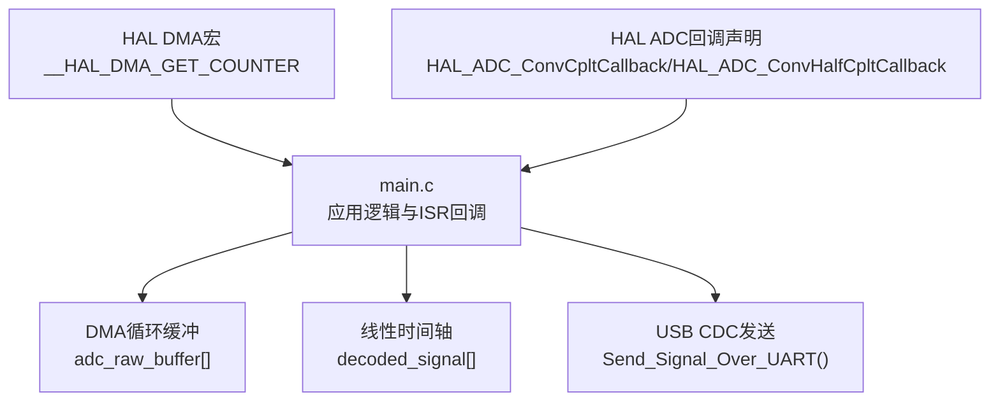
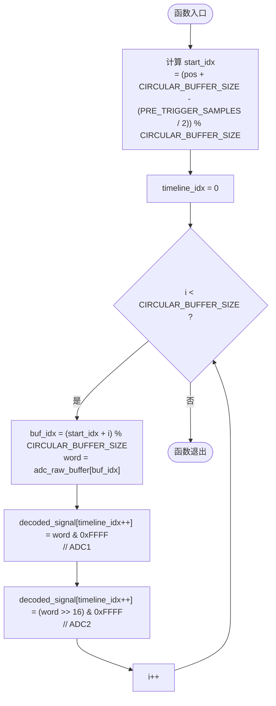
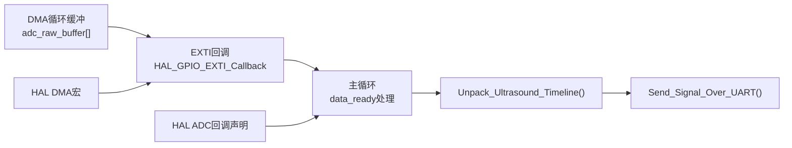

# ADC数据处理API

<cite>
**本文引用的文件**   
- [Core/Src/main.c](file://Core/Src/main.c)
- [Drivers/STM32G4xx_HAL_Driver/Inc/stm32g4xx_hal_dma.h](file://Drivers/STM32G4xx_HAL_Driver/Inc/stm32g4xx_hal_dma.h)
- [Drivers/STM32G4xx_HAL_Driver/Inc/stm32g4xx_hal_adc.h](file://Drivers/STM32G4xx_HAL_Driver/Inc/stm32g4xx_hal_adc.h)
</cite>

## 目录
1. [简介](#简介)
2. [项目结构](#项目结构)
3. [核心组件](#核心组件)
4. [架构总览](#架构总览)
5. [详细组件分析](#详细组件分析)
6. [依赖关系分析](#依赖关系分析)
7. [性能考量](#性能考量)
8. [故障排查指南](#故障排查指南)
9. [结论](#结论)
10. [附录](#附录)

## 简介
本文件为ADC数据处理API的完整文档，重点围绕数据解包函数 Unpack_Ultrasound_Timeline() 的实现与使用。内容涵盖：
- 环形缓冲区到线性时间轴的转换算法
- start_idx 计算公式的数学原理
- 高低16位数据的提取方法（ADC1/ADC2）
- trigger_pos 快照机制避免ISR数据竞争的重要性
- decoded_signal 数组的内存布局与时序关系
- 数据验证与错误检测的实现示例

## 项目结构
本项目基于STM32G4系列，采用双通道ADC交错模式+DMA循环写入，外部中断触发后在DMA回调中计数完成，主循环进行数据解包并通过USB CDC输出。关键源文件位于 Core/Src/main.c，HAL驱动头文件提供DMA计数器宏与ADC回调接口定义。



图表来源
- [Core/Src/main.c:52-70](file://Core/Src/main.c#L52-L70)
- [Core/Src/main.c:135-149](file://Core/Src/main.c#L135-L149)
- [Core/Src/main.c:178-212](file://Core/Src/main.c#L178-L212)
- [Drivers/STM32G4xx_HAL_Driver/Inc/stm32g4xx_hal_dma.h:739](file://Drivers/STM32G4xx_HAL_Driver/Inc/stm32g4xx_hal_dma.h#L739)
- [Drivers/STM32G4xx_HAL_Driver/Inc/stm32g4xx_hal_adc.h:2253-2254](file://Drivers/STM32G4xx_HAL_Driver/Inc/stm32g4xx_hal_adc.h#L2253-L2254)

章节来源
- [Core/Src/main.c:52-70](file://Core/Src/main.c#L52-L70)
- [Core/Src/main.c:135-149](file://Core/Src/main.c#L135-L149)
- [Core/Src/main.c:178-212](file://Core/Src/main.c#L178-L212)
- [Drivers/STM32G4xx_HAL_Driver/Inc/stm32g4xx_hal_dma.h:739](file://Drivers/STM32G4xx_HAL_Driver/Inc/stm32g4xx_hal_dma.h#L739)
- [Drivers/STM32G4xx_HAL_Driver/Inc/stm32g4xx_hal_adc.h:2253-2254](file://Drivers/STM32G4xx_HAL_Driver/Inc/stm32g4xx_hal_adc.h#L2253-L2254)

## 核心组件
- 环形缓冲区 adc_raw_buffer[CIRCULAR_BUFFER_SIZE]：每个元素为uint32_t，低16位存放ADC1采样值，高16位存放ADC2采样值，形成交错采集的数据流。
- 线性时间轴 decoded_signal[TOTAL_SAMPLES]：按时间顺序展开的uint16_t序列，偶数索引为ADC1，奇数索引为ADC2。
- 触发位置 trigger_pos：由EXTI中断捕获当前DMA写指针，用于计算start_idx。
- 解包函数 Unpack_Ultrasound_Timeline(pos)：将环形缓冲按时间顺序重排至线性时间轴。
- 传输函数 Send_Signal_Over_UART()：将解码后的信号通过USB CDC以十进制字符串形式逐行输出。

章节来源
- [Core/Src/main.c:52-70](file://Core/Src/main.c#L52-L70)
- [Core/Src/main.c:156-171](file://Core/Src/main.c#L156-L171)
- [Core/Src/main.c:178-212](file://Core/Src/main.c#L178-L212)

## 架构总览
下图展示了从触发到数据输出的整体流程，包括EXTI中断、DMA回调、主循环处理与解包过程。

```mermaid
sequenceDiagram
participant EXTI as "EXTI中断"
participant ISR as "HAL_GPIO_EXTI_Callback()"
participant DMA as "DMA控制器"
participant HAL as "HAL ADC回调"
participant Main as "主循环"
participant Dec as "Unpack_Ultrasound_Timeline()"
participant USB as "USB CDC发送"
EXTI->>ISR : "上升沿触发"
ISR->>DMA : "__HAL_DMA_GET_COUNTER(&hdma_adc1)"
DMA-->>ISR : "剩余计数remaining"
ISR->>ISR : "计算trigger_pos = CIRCULAR_BUFFER_SIZE - remaining"
ISR->>Main : "置位trigger_detected/data_ready"
HAL->>Main : "HT/TC回调 -> Check_PostTrigger_Completion()"
Main->>Main : "snap_pos = trigger_pos; 关闭新触发"
Main->>Dec : "Unpack_Ultrasound_Timeline(snap_pos)"
Dec-->>Main : "填充decoded_signal[]"
Main->>USB : "Send_Signal_Over_UART()"
USB-->>Main : "发送完成"
Main->>DMA : "重启DMA循环采集"
```

图表来源
- [Core/Src/main.c:91-113](file://Core/Src/main.c#L91-L113)
- [Core/Src/main.c:119-131](file://Core/Src/main.c#L119-L131)
- [Core/Src/main.c:135-149](file://Core/Src/main.c#L135-L149)
- [Core/Src/main.c:264-287](file://Core/Src/main.c#L264-L287)
- [Core/Src/main.c:156-171](file://Core/Src/main.c#L156-L171)
- [Core/Src/main.c:178-212](file://Core/Src/main.c#L178-L212)

## 详细组件分析

### API：Unpack_Ultrasound_Timeline(uint16_t pos)
- 功能：将环形缓冲区按时间顺序解包为线性时间轴，确保包含触发前与触发后的完整波形片段。
- 输入参数：pos——触发时刻对应的环形缓冲区索引（snapshot）。
- 输出结果：填充全局数组 decoded_signal[TOTAL_SAMPLES]。
- 复杂度：O(CIRCULAR_BUFFER_SIZE)，每次调用遍历一次环形缓冲。

#### 环形缓冲到线性时间轴的转换逻辑
- 起始索引计算：
  - start_idx = (pos + CIRCULAR_BUFFER_SIZE - (PRE_TRIGGER_SAMPLES / 2)) % CIRCULAR_BUFFER_SIZE
  - 该公式保证从“触发点之前半个预触发窗口”的位置开始读取，从而在最终的时间轴中包含完整的预触发段与后触发段。
- 线性索引推进：
  - timeline_idx 从0递增，每读取一个uint32_t word，依次写入两个uint16_t样本（ADC1、ADC2），因此每个word对应两个时间步。
- 环形访问：
  - buf_idx = (start_idx + i) % CIRCULAR_BUFFER_SIZE，实现无分支的环形步进。

#### start_idx 计算公式的数学原理
- 目标：在时间轴上对齐触发事件，使触发点大致位于中间位置，前后分别覆盖 PRE_TRIGGER_SAMPLES 与 POST_TRIGGER_SAMPLES 个样本。
- 由于每个uint32_t包含两个样本，因此“半个预触发窗口”对应 PRE_TRIGGER_SAMPLES / 2 个uint32_t单元。
- 为保证模运算非负，先加 CIRCULAR_BUFFER_SIZE 再取模，避免负数下标问题。
- 当 pos 接近环形缓冲末尾时，(pos - offset) 可能为负，加上长度后再取模可正确回绕。

#### 高低16位数据的提取方法
- 低16位（ADC1）：(word & 0xFFFF)
  - 掩码保留低16位，屏蔽高16位，得到ADC1采样值。
- 高16位（ADC2）：((word >> 16) & 0xFFFF)
  - 右移16位将高16位移到低位，再用掩码获取ADC2采样值。
- 时序关系：
  - decoded_signal[timeline_idx++] 写入ADC1；
  - decoded_signal[timeline_idx++] 写入ADC2；
  - 偶数索引为ADC1，奇数索引为ADC2，严格保持交错采样的时间顺序。

#### trigger_pos 快照机制避免ISR数据竞争
- 风险：EXTI中断可能在主循环处理期间更新 trigger_pos，导致不一致的视图。
- 解决：在主循环中立即复制 snapshot = trigger_pos，并清零相关标志，随后仅使用快照进行解包。
- 效果：确保解包过程对ISR可见的共享状态是原子一致的，避免竞态条件。

#### decoded_signal 数组的内存布局与时序关系
- 布局：连续uint16_t序列，长度为 TOTAL_SAMPLES。
- 时序：按时间先后顺序排列，偶数位为ADC1，奇数位为ADC2。
- 触发对齐：通过 start_idx 的计算，使得触发事件大致位于时间轴中部，前后分别覆盖预触发与后触发窗口。



图表来源
- [Core/Src/main.c:156-171](file://Core/Src/main.c#L156-L171)

章节来源
- [Core/Src/main.c:156-171](file://Core/Src/main.c#L156-L171)
- [Core/Src/main.c:264-287](file://Core/Src/main.c#L264-L287)

### API：Send_Signal_Over_UART(void)
- 功能：将 decoded_signal 中的全部样本转换为十进制字符串，每行一个数值，通过USB CDC一次性发送。
- 缓冲区大小：TOTAL_SAMPLES * 6（最大字符数考虑“65535\n”）。
- 发送策略：构建完整输出缓冲后调用CDC_Transmit_FS，若端点满则重试。

章节来源
- [Core/Src/main.c:178-212](file://Core/Src/main.c#L178-L212)

### 触发与DMA回调协作
- EXTI中断：
  - 读取DMA剩余计数 remaining，计算 trigger_pos = CIRCULAR_BUFFER_SIZE - remaining。
  - 设置 post_trigger_dma_events 与 trigger_detected 标志。
- DMA回调：
  - HT/TC回调均调用 Check_PostTrigger_Completion()，累计两次事件后停止DMA并置 data_ready。
- 主循环：
  - 检测到 data_ready 后，快照 trigger_pos，调用解包函数，发送数据，重启DMA。

章节来源
- [Core/Src/main.c:91-113](file://Core/Src/main.c#L91-L113)
- [Core/Src/main.c:119-131](file://Core/Src/main.c#L119-L131)
- [Core/Src/main.c:135-149](file://Core/Src/main.c#L135-L149)
- [Core/Src/main.c:264-287](file://Core/Src/main.c#L264-L287)

## 依赖关系分析
- main.c 依赖：
  - HAL DMA宏 __HAL_DMA_GET_COUNTER 用于读取DMA剩余计数。
  - HAL ADC回调接口 HAL_ADC_ConvCpltCallback/HAL_ADC_ConvHalfCpltCallback 用于DMA完成通知。
- 数据流向：
  - DMA循环写入 adc_raw_buffer → EXTI中断记录触发位置 → 主循环解包至 decoded_signal → USB CDC输出。



图表来源
- [Core/Src/main.c:91-113](file://Core/Src/main.c#L91-L113)
- [Core/Src/main.c:135-149](file://Core/Src/main.c#L135-L149)
- [Core/Src/main.c:156-171](file://Core/Src/main.c#L156-L171)
- [Core/Src/main.c:178-212](file://Core/Src/main.c#L178-L212)
- [Drivers/STM32G4xx_HAL_Driver/Inc/stm32g4xx_hal_dma.h:739](file://Drivers/STM32G4xx_HAL_Driver/Inc/stm32g4xx_hal_dma.h#L739)
- [Drivers/STM32G4xx_HAL_Driver/Inc/stm32g4xx_hal_adc.h:2253-2254](file://Drivers/STM32G4xx_HAL_Driver/Inc/stm32g4xx_hal_adc.h#L2253-L2254)

章节来源
- [Core/Src/main.c:91-113](file://Core/Src/main.c#L91-L113)
- [Core/Src/main.c:135-149](file://Core/Src/main.c#L135-L149)
- [Core/Src/main.c:156-171](file://Core/Src/main.c#L156-L171)
- [Core/Src/main.c:178-212](file://Core/Src/main.c#L178-L212)
- [Drivers/STM32G4xx_HAL_Driver/Inc/stm32g4xx_hal_dma.h:739](file://Drivers/STM32G4xx_HAL_Driver/Inc/stm32g4xx_hal_dma.h#L739)
- [Drivers/STM32G4xx_HAL_Driver/Inc/stm32g4xx_hal_adc.h:2253-2254](file://Drivers/STM32G4xx_HAL_Driver/Inc/stm32g4xx_hal_adc.h#L2253-L2254)

## 性能考量
- 解包复杂度：O(CIRCULAR_BUFFER_SIZE)，适合在中断外执行。
- 位操作开销：& 0xFFFF 与 >> 16 均为常数时间操作，CPU友好。
- 环形访问：使用模运算实现无分支跳转，减少分支预测失败。
- USB发送：一次性构建缓冲后发送，减少多次系统调用开销。

## 故障排查指南
- 触发丢失或重复：
  - 检查 uart_busy 与 trigger_detected 双重保护是否生效。
  - 确认EXTI引脚配置与优先级。
- 数据错位：
  - 核对 start_idx 计算是否正确，特别是 PRE_TRIGGER_SAMPLES / 2 的整除语义。
  - 确认每个uint32_t的读写顺序（先ADC1后ADC2）。
- DMA计数异常：
  - 检查 remaining 边界保护（==0或>CIRCULAR_BUFFER_SIZE）是否有效。
  - 确认NDTR寄存器重载瞬态不会导致误判。
- 发送失败：
  - 检查CDC_Transmit_FS返回值与重试逻辑。
  - 确认USB设备初始化成功且端点可用。

章节来源
- [Core/Src/main.c:91-113](file://Core/Src/main.c#L91-L113)
- [Core/Src/main.c:156-171](file://Core/Src/main.c#L156-L171)
- [Core/Src/main.c:178-212](file://Core/Src/main.c#L178-L212)

## 结论
Unpack_Ultrasound_Timeline() 通过精确的环形缓冲索引计算与高效的位操作，实现了从交错采样的环形缓冲区到线性时间轴的可靠转换。结合 trigger_pos 快照机制，避免了ISR与主循环之间的数据竞争，确保了数据的一致性与完整性。配合DMA回调与USB CDC发送，形成了完整的超声数据采集与传输链路。

## 附录

### 数据验证与错误检测示例
以下示例展示如何在解包后进行基本的数据验证与错误检测（概念性说明，不直接引用代码）：
- 范围校验：
  - 对每个 uint16_t 样本检查是否在合法范围内（例如0~4095，对应12位分辨率）。
- 一致性校验：
  - 对比相邻样本的变化幅度，识别异常跳变。
- 触发对齐校验：
  - 统计触发点附近样本的均值与方差，判断是否合理。
- 溢出与缺失检测：
  - 检查 decoded_signal 是否被完整填充（长度等于 TOTAL_SAMPLES）。
  - 若存在全零段或异常恒定值，提示可能的DMA或ADC配置问题。

章节来源
- [Core/Src/main.c:156-171](file://Core/Src/main.c#L156-L171)
- [Core/Src/main.c:178-212](file://Core/Src/main.c#L178-L212)