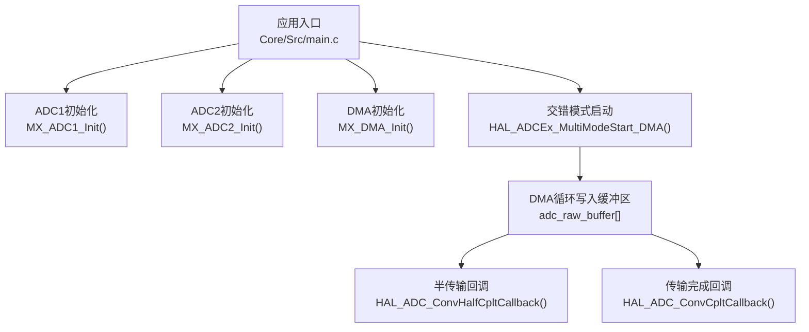
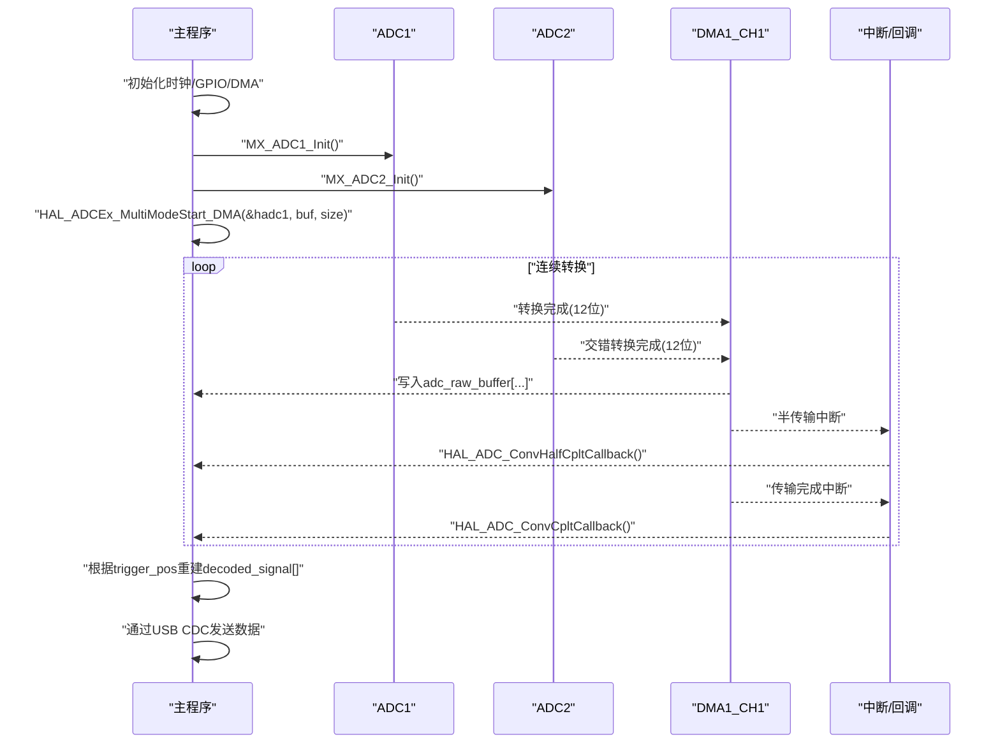
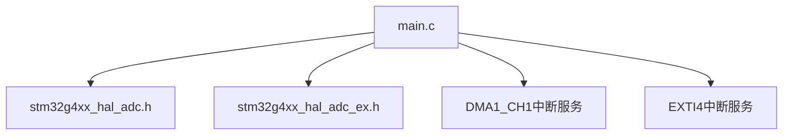

# ADC采集API

<cite>
**本文引用的文件**   
- [main.c](file://Core/Src/main.c)
- [stm32g4xx_hal_adc.h](file://Drivers/STM32G4xx_HAL_Driver/Inc/stm32g4xx_hal_adc.h)
- [stm32g4xx_hal_adc_ex.h](file://Drivers/STM32G4xx_HAL_Driver/Inc/stm32g4xx_hal_adc_ex.h)
</cite>

## 目录
1. [简介](#简介)
2. [项目结构](#项目结构)
3. [核心组件](#核心组件)
4. [架构总览](#架构总览)
5. [详细组件分析](#详细组件分析)
6. [依赖关系分析](#依赖关系分析)
7. [性能考虑](#性能考虑)
8. [故障排查指南](#故障排查指南)
9. [结论](#结论)
10. [附录：配置示例与最佳实践](#附录配置示例与最佳实践)

## 简介
本文件为基于STM32G4的ADC数据采集系统提供完整的API参考文档，重点覆盖以下方面：
- MX_ADC1_Init() 与 MX_ADC2_Init() 双通道初始化函数的配置参数说明
- ADC_MultiModeTypeDef 多模式配置结构体成员详解
- ADC_ChannelConfTypeDef 通道配置结构体成员详解
- HAL_ADCEx_MultiModeStart_DMA() 交错模式启动函数参数含义（DMA缓冲区地址与长度）
- ADC回调函数 HAL_ADC_ConvHalfCpltCallback() 与 HAL_ADC_ConvCpltCallback() 的中断处理机制
- 关键ADC配置项（分辨率、采样时间、差分输入等）的有效范围与默认值
- 完整配置示例与最佳实践建议

## 项目结构
本项目采用CubeMX生成的标准工程结构，应用层位于 Core/Src/main.c，HAL驱动接口定义位于 Drivers/STM32G4xx_HAL_Driver/Inc 下的头文件中。ADC相关功能由 main.c 中的初始化与回调实现，并通过HAL扩展接口完成双ADC交错采集与DMA传输。

图表来源
- [main.c:344-407](file://Core/Src/main.c#L344-L407)
- [main.c:414-464](file://Core/Src/main.c#L414-L464)
- [main.c:469-481](file://Core/Src/main.c#L469-L481)
- [main.c:249-255](file://Core/Src/main.c#L249-L255)
- [main.c:136-149](file://Core/Src/main.c#L136-L149)

章节来源
- [main.c:344-407](file://Core/Src/main.c#L344-L407)
- [main.c:414-464](file://Core/Src/main.c#L414-L464)
- [main.c:469-481](file://Core/Src/main.c#L469-L481)
- [main.c:249-255](file://Core/Src/main.c#L249-L255)
- [main.c:136-149](file://Core/Src/main.c#L136-L149)

## 核心组件
- ADC句柄与全局变量
  - hadc1、hadc2：分别代表ADC1与ADC2实例句柄
  - hdma_adc1：DMA1通道1句柄，用于将ADC数据搬运到内存
  - adc_raw_buffer[]：环形DMA缓冲区，低16位存放ADC1结果，高16位存放ADC2结果
  - decoded_signal[]：线性重建后的时序信号数组
- 触发与状态标志
  - trigger_detected、trigger_pos、post_trigger_dma_events、data_ready、uart_busy：用于EXTI触发与DMA事件协调

章节来源
- [main.c:48-70](file://Core/Src/main.c#L48-L70)
- [main.c:53-69](file://Core/Src/main.c#L53-L69)

## 架构总览
下图展示了从初始化到数据采集、回调处理与数据重建的整体流程。

图表来源
- [main.c:344-407](file://Core/Src/main.c#L344-L407)
- [main.c:414-464](file://Core/Src/main.c#L414-L464)
- [main.c:249-255](file://Core/Src/main.c#L249-L255)
- [main.c:136-149](file://Core/Src/main.c#L136-L149)
- [main.c:156-171](file://Core/Src/main.c#L156-L171)

## 详细组件分析

### MX_ADC1_Init() 与 MX_ADC2_Init() 初始化函数
- 共同点
  - 设置ADC实例、时钟分频、分辨率、数据对齐、扫描模式、EOC选择、连续转换、外部触发源、DMA连续请求、溢出行为、过采样开关
  - 配置常规通道：通道号、序列等级、采样时间、单端/差分、偏移编号与偏移值
- 差异点
  - ADC1启用DMA连续请求；ADC2在交错模式下通常由主ADC控制DMA，此处设置为禁用
  - 多模式配置仅在ADC1中调用 HAL_ADCEx_MultiModeConfigChannel()

章节来源
- [main.c:344-407](file://Core/Src/main.c#L344-L407)
- [main.c:414-464](file://Core/Src/main.c#L414-L464)

#### ADC_InitTypeDef 成员详解（ADC通用与常规组）
- ClockPrescaler：ADC时钟源与分频器（同步PCLK或异步系统时钟），有效值参见常量定义
- Resolution：分辨率，支持12/10/8/6位
- DataAlign：数据对齐方式，右对齐或左对齐
- GainCompensation：增益补偿系数（2.12格式，范围0~约3.999756）
- ScanConvMode：扫描模式（禁用/启用）
- EOCSelection：EOC标志选择（单次转换结束/序列结束）
- LowPowerAutoWait：低功耗自动等待（不建议与中断/DMA同时使用）
- ContinuousConvMode：连续转换模式（启用/禁用）
- NbrOfConversion：常规组转换数量（1~8）
- DiscontinuousConvMode：间断模式（需配合扫描模式）
- NbrOfDiscConversion：间断转换次数（1~8）
- ExternalTrigConv：外部触发源（软件或外设触发）
- ExternalTrigConvEdge：外部触发边沿（上升/下降/双边沿）
- SamplingMode：采样模式（正常/灯泡/触发控制）
- DMAContinuousRequests：DMA连续请求（启用/禁用）
- Overrun：溢出行为（保留/覆盖）
- OversamplingMode：过采样开关
- Oversampling：过采样参数（比率、移位、触发模式、作用域）

章节来源
- [stm32g4xx_hal_adc.h:90-252](file://Drivers/STM32G4xx_HAL_Driver/Inc/stm32g4xx_hal_adc.h#L90-L252)

#### ADC_ChannelConfTypeDef 成员详解（常规通道）
- Channel：通道号（外部引脚或内部通道）
- Rank：序列等级（1~16）
- SamplingTime：采样时间（单位：ADC时钟周期）
- SingleDiff：单端或差分输入
- OffsetNumber：偏移编号（无/1~4）
- Offset：偏移值（与分辨率匹配的范围）
- OffsetSign：偏移符号（正/负）
- OffsetSaturation：偏移饱和（启用/禁用）

章节来源
- [stm32g4xx_hal_adc.h:267-338](file://Drivers/STM32G4xx_HAL_Driver/Inc/stm32g4xx_hal_adc.h#L267-L338)

#### ADC_MultiModeTypeDef 成员详解（多模式）
- Mode：多模式工作模式（独立/双模同时/交错/注入同时/交替触发等）
- DMAAccessMode：DMA访问模式（按分辨率选择12/10位或8/6位）
- TwoSamplingDelay：两次采样之间的延迟（1~12个ADC时钟周期，取决于分辨率）

章节来源
- [stm32g4xx_hal_adc_ex.h:259-275](file://Drivers/STM32G4xx_HAL_Driver/Inc/stm32g4xx_hal_adc_ex.h#L259-L275)

### HAL_ADCEx_MultiModeStart_DMA() 交错模式启动
- 原型：HAL_ADCEx_MultiModeStart_DMA(ADC_HandleTypeDef *hadc, uint32_t *pData, uint32_t Length)
- 参数含义
  - hadc：主ADC句柄（本例为ADC1）
  - pData：DMA目标缓冲区指针（本例为adc_raw_buffer）
  - Length：DMA传输长度（以字为单位，本例为CIRCULAR_BUFFER_SIZE）
- 行为
  - 启动主从ADC交错转换，DMA循环写入缓冲区
  - 每两个ADC转换结果打包为一个32位字（低16位=ADC1，高16位=ADC2）

章节来源
- [stm32g4xx_hal_adc_ex.h:1507](file://Drivers/STM32G4xx_HAL_Driver/Inc/stm32g4xx_hal_adc_ex.h#L1507)
- [main.c:249-255](file://Core/Src/main.c#L249-L255)
- [main.c:53-69](file://Core/Src/main.c#L53-L69)

### ADC回调函数与中断处理机制
- HAL_ADC_ConvHalfCpltCallback(hadc)
  - 当DMA完成一半传输时触发（例如写满缓冲区的一半）
  - 本例用于检测并计数后触发停止条件
- HAL_ADC_ConvCpltCallback(hadc)
  - 当DMA完成一次完整循环时触发
  - 同样参与停止条件判断
- 停止逻辑
  - 在检测到触发事件后，需要至少两次DMA事件（半传输+传输完成）以确保足够的“触发后”样本数
  - 达到阈值后调用 HAL_ADCEx_MultiModeStop_DMA() 停止采集，置位 data_ready 标志

章节来源
- [main.c:136-149](file://Core/Src/main.c#L136-L149)
- [main.c:119-131](file://Core/Src/main.c#L119-L131)
- [stm32g4xx_hal_adc_ex.h:1508](file://Drivers/STM32G4xx_HAL_Driver/Inc/stm32g4xx_hal_adc_ex.h#L1508)

### 关键配置项有效范围与默认值
- 分辨率（Resolution）
  - 有效值：12/10/8/6位
  - 本例默认：12位
- 采样时间（SamplingTime）
  - 有效值：2.5/3.5/6.5/12.5/24.5/47.5/92.5/247.5/640.5个ADC时钟周期
  - 本例默认：2.5周期
- 差分输入（SingleDiff）
  - 有效值：单端/差分
  - 本例默认：差分
- 数据对齐（DataAlign）
  - 有效值：右对齐/左对齐
  - 本例默认：右对齐
- 扫描模式（ScanConvMode）
  - 有效值：禁用/启用
  - 本例默认：禁用（仅单通道）
- 溢出行为（Overrun）
  - 有效值：保留/覆盖
  - 本例默认：保留
- 外部触发（ExternalTrigConv）
  - 有效值：软件触发或多种外设触发
  - 本例默认：软件触发
- 多模式延迟（TwoSamplingDelay）
  - 有效值：1~12个ADC时钟周期（随分辨率变化）
  - 本例默认：4周期

章节来源
- [stm32g4xx_hal_adc.h:610-619](file://Drivers/STM32G4xx_HAL_Driver/Inc/stm32g4xx_hal_adc.h#L610-L619)
- [stm32g4xx_hal_adc.h:804-820](file://Drivers/STM32G4xx_HAL_Driver/Inc/stm32g4xx_hal_adc.h#L804-L820)
- [stm32g4xx_hal_adc.h:621-630](file://Drivers/STM32G4xx_HAL_Driver/Inc/stm32g4xx_hal_adc.h#L621-L630)
- [stm32g4xx_hal_adc.h:632-639](file://Drivers/STM32G4xx_HAL_Driver/Inc/stm32g4xx_hal_adc.h#L632-L639)
- [stm32g4xx_hal_adc.h:770-779](file://Drivers/STM32G4xx_HAL_Driver/Inc/stm32g4xx_hal_adc.h#L770-L779)
- [stm32g4xx_hal_adc.h:641-727](file://Drivers/STM32G4xx_HAL_Driver/Inc/stm32g4xx_hal_adc.h#L641-L727)
- [stm32g4xx_hal_adc_ex.h:473-502](file://Drivers/STM32G4xx_HAL_Driver/Inc/stm32g4xx_hal_adc_ex.h#L473-L502)
- [main.c:362-375](file://Core/Src/main.c#L362-L375)
- [main.c:395-398](file://Core/Src/main.c#L395-L398)
- [main.c:383-385](file://Core/Src/main.c#L383-L385)

## 依赖关系分析
- 应用层依赖HAL驱动接口进行ADC与DMA配置
- 多模式功能依赖扩展头文件提供的结构与函数声明
- DMA与EXTI中断协同工作，确保触发事件的精确捕获与数据处理

图表来源
- [main.c:344-407](file://Core/Src/main.c#L344-L407)
- [main.c:414-464](file://Core/Src/main.c#L414-L464)
- [main.c:469-481](file://Core/Src/main.c#L469-L481)
- [main.c:91-113](file://Core/Src/main.c#L91-L113)

章节来源
- [main.c:91-113](file://Core/Src/main.c#L91-L113)
- [main.c:469-481](file://Core/Src/main.c#L469-L481)

## 性能考虑
- 交错模式提升吞吐率：ADC1与ADC2交错转换，提高整体采样速率
- DMA循环模式避免CPU频繁干预，降低中断开销
- 合理设置采样时间与分辨率平衡精度与速度
- 注意DMA缓冲区大小与触发窗口匹配，确保足够的前/后触发样本

## 故障排查指南
- 常见问题
  - DMA未正确配置或中断优先级不当导致数据丢失
  - 触发事件与DMA事件时序不匹配导致数据不完整
  - 缓冲区边界保护不足导致越界访问
- 定位方法
  - 检查DMA计数器与缓冲区索引计算逻辑
  - 验证回调函数中停止条件与标志位更新顺序
  - 确认EXTI中断屏蔽策略（如UART传输期间忽略触发）

章节来源
- [main.c:91-113](file://Core/Src/main.c#L91-L113)
- [main.c:119-131](file://Core/Src/main.c#L119-L131)
- [main.c:156-171](file://Core/Src/main.c#L156-L171)

## 结论
本系统通过ADC1/ADC2交错模式与DMA循环传输实现了高速、稳定的数据采集。合理的初始化配置、回调处理与触发管理确保了数据的完整性与时序准确性。遵循本文档的配置说明与最佳实践，可快速搭建可靠的ADC采集方案。

## 附录：配置示例与最佳实践
- 初始化步骤
  - 配置系统时钟与GPIO（包括触发引脚与LED指示）
  - 初始化DMA控制器与中断优先级
  - 初始化ADC1与ADC2，设置分辨率、采样时间、差分模式
  - 配置多模式为交错模式，设置DMA访问模式与采样延迟
  - 启动交错模式DMA采集
- 数据处理
  - 在回调中统计DMA事件，满足条件后停止采集
  - 根据触发位置重建线性时序数据
  - 通过USB CDC批量发送数据
- 最佳实践
  - 使用volatile标志确保ISR与主循环间的数据一致性
  - 在触发处理中加入边界保护与重入防护
  - 调整缓冲区大小以满足前/后触发样本需求
  - 合理设置DMA与EXTI中断优先级，避免竞争条件

章节来源
- [main.c:249-255](file://Core/Src/main.c#L249-L255)
- [main.c:136-149](file://Core/Src/main.c#L136-L149)
- [main.c:156-171](file://Core/Src/main.c#L156-L171)
- [main.c:178-212](file://Core/Src/main.c#L178-L212)