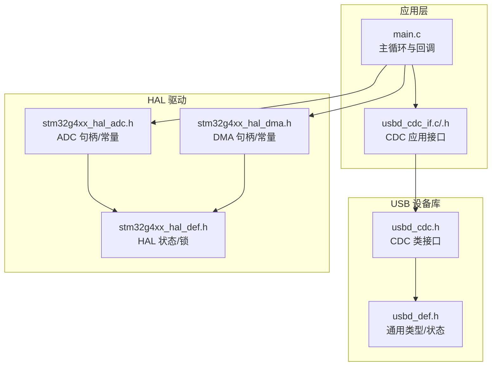
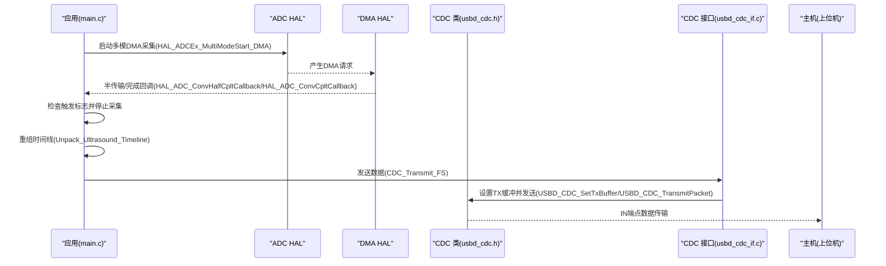
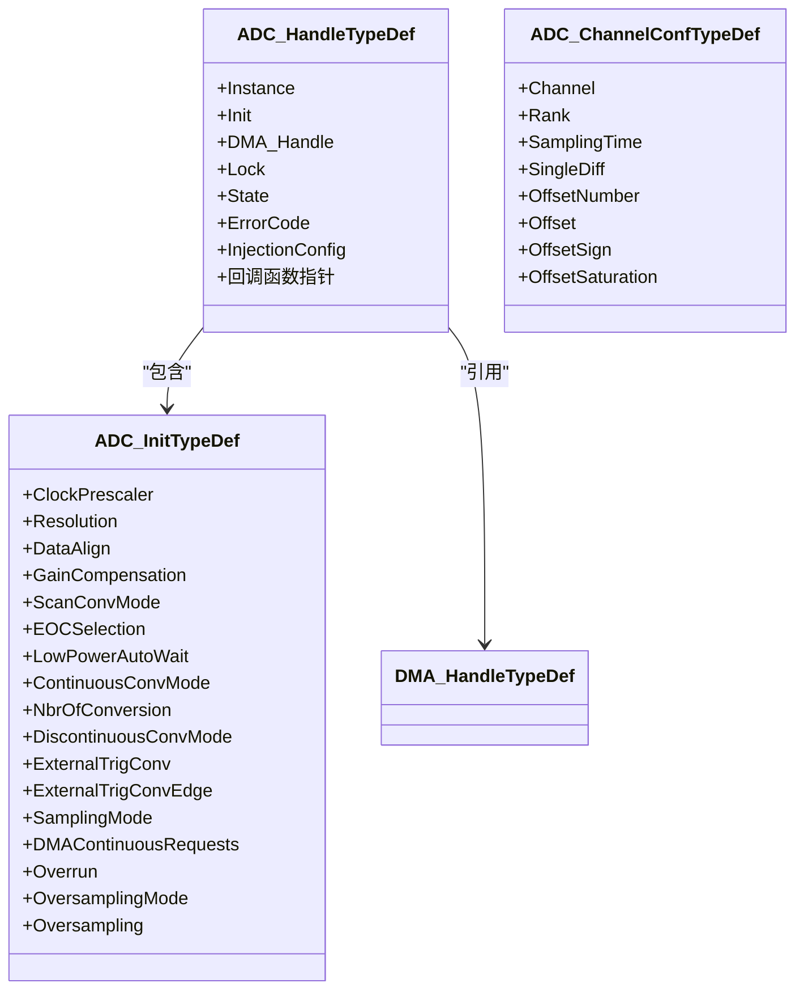
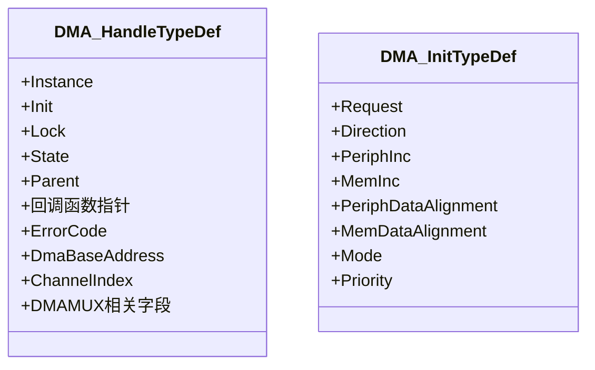
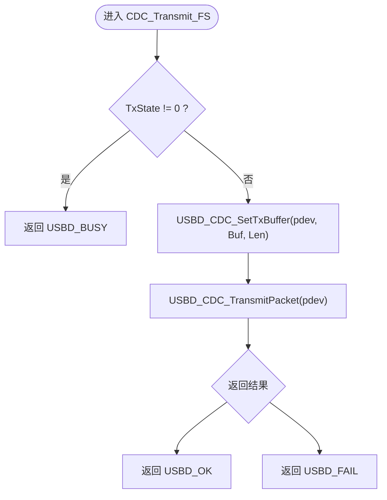
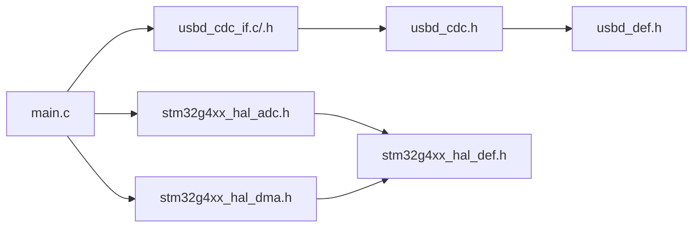

# API参考手册

<cite>
**本文引用的文件**   
- [main.c](file://Core/Src/main.c)
- [main.h](file://Core/Inc/main.h)
- [stm32g4xx_hal_def.h](file://Drivers/STM32G4xx_HAL_Driver/Inc/stm32g4xx_hal_def.h)
- [stm32g4xx_hal_adc.h](file://Drivers/STM32G4xx_HAL_Driver/Inc/stm32g4xx_hal_adc.h)
- [stm32g4xx_hal_dma.h](file://Drivers/STM32G4xx_HAL_Driver/Inc/stm32g4xx_hal_dma.h)
- [usbd_def.h](file://Middlewares/ST/STM32_USB_Device_Library/Core/Inc/usbd_def.h)
- [usbd_cdc.h](file://Middlewares/ST/STM32_USB_Device_Library/Class/CDC/Inc/usbd_cdc.h)
- [usbd_cdc_if.h](file://USB_Device/App/usbd_cdc_if.h)
- [usbd_cdc_if.c](file://USB_Device/App/usbd_cdc_if.c)
</cite>

## 目录
1. [简介](#简介)
2. [项目结构](#项目结构)
3. [核心组件](#核心组件)
4. [架构总览](#架构总览)
5. [详细组件分析](#详细组件分析)
6. [依赖关系分析](#依赖关系分析)
7. [性能考虑](#性能考虑)
8. [故障排查指南](#故障排查指南)
9. [结论](#结论)
10. [附录：常用API速查](#附录常用api速查)

## 简介
本手册面向使用 STM32G4 的开发者，聚焦于以下公共接口与数据结构：
- ADC HAL 驱动（ADC_HandleTypeDef、DMA_HandleTypeDef）
- USB CDC 通信类库（发送/接收、状态查询、错误处理）
- 关键配置参数范围与默认值（采样率、分辨率、缓冲区大小等）
- 标准错误码与异常处理机制（HAL_ERROR、USBD_BUSY 等）
并提供函数原型、参数说明、返回值定义与调用示例路径，帮助快速定位与使用。

## 项目结构
本项目采用分层组织：
- Core：应用入口与外设初始化（main.c、main.h）
- Drivers：HAL 驱动与底层寄存器访问（ADC/DMA 头文件与实现）
- Middlewares：USB 设备库（CDC 类与核心）
- USB_Device：用户层 CDC 接口封装与应用缓冲

图表来源 
- [main.c:1-120](file://Core/Src/main.c#L1-L120)
- [usbd_cdc_if.h:1-133](file://USB_Device/App/usbd_cdc_if.h#L1-L133)
- [usbd_cdc.h:1-176](file://Middlewares/ST/STM32_USB_Device_Library/Class/CDC/Inc/usbd_cdc.h#L1-L176)
- [usbd_def.h:1-120](file://Middlewares/ST/STM32_USB_Device_Library/Core/Inc/usbd_def.h#L1-L120)
- [stm32g4xx_hal_adc.h:1-120](file://Drivers/STM32G4xx_HAL_Driver/Inc/stm32g4xx_hal_adc.h#L1-L120)
- [stm32g4xx_hal_dma.h:1-120](file://Drivers/STM32G4xx_HAL_Driver/Inc/stm32g4xx_hal_dma.h#L1-L120)
- [stm32g4xx_hal_def.h:1-120](file://Drivers/STM32G4xx_HAL_Driver/Inc/stm32g4xx_hal_def.h#L1-L120)

章节来源
- [main.c:1-120](file://Core/Src/main.c#L1-L120)
- [usbd_cdc_if.h:1-133](file://USB_Device/App/usbd_cdc_if.h#L1-L133)
- [usbd_cdc.h:1-176](file://Middlewares/ST/STM32_USB_Device_Library/Class/CDC/Inc/usbd_cdc.h#L1-L176)
- [usbd_def.h:1-120](file://Middlewares/ST/STM32_USB_Device_Library/Core/Inc/usbd_def.h#L1-L120)
- [stm32g4xx_hal_adc.h:1-120](file://Drivers/STM32G4xx_HAL_Driver/Inc/stm32g4xx_hal_adc.h#L1-L120)
- [stm32g4xx_hal_dma.h:1-120](file://Drivers/STM32G4xx_HAL_Driver/Inc/stm32g4xx_hal_dma.h#L1-L120)
- [stm32g4xx_hal_def.h:1-120](file://Drivers/STM32G4xx_HAL_Driver/Inc/stm32g4xx_hal_def.h#L1-L120)

## 核心组件
- ADC_HandleTypeDef：ADC 实例句柄，包含时钟、分辨率、对齐、扫描模式、触发源、DMA 请求、溢出行为、过采样等配置，以及 DMA 指针、状态、错误码和回调。
- DMA_HandleTypeDef：DMA 通道句柄，包含请求源、方向、地址增量、数据宽度、模式、优先级、状态、错误码及回调。
- USB CDC 接口：提供注册接口、设置收发缓冲、发送/接收包、控制命令处理等。

章节来源
- [stm32g4xx_hal_adc.h:480-520](file://Drivers/STM32G4xx_HAL_Driver/Inc/stm32g4xx_hal_adc.h#L480-L520)
- [stm32g4xx_hal_dma.h:110-152](file://Drivers/STM32G4xx_HAL_Driver/Inc/stm32g4xx_hal_dma.h#L110-L152)
- [usbd_cdc.h:140-160](file://Middlewares/ST/STM32_USB_Device_Library/Class/CDC/Inc/usbd_cdc.h#L140-L160)

## 架构总览
系统以 ADC 双通道交错采集为数据源，通过 DMA 环形缓冲写入内存；外部触发中断记录触发点，随后在 DMA 半传输/完成回调中停止采集并重组时间线；最终经 USB CDC 将样本序列发送至主机。

图表来源 
- [main.c:240-290](file://Core/Src/main.c#L240-L290)
- [main.c:130-150](file://Core/Src/main.c#L130-L150)
- [usbd_cdc_if.c:280-293](file://USB_Device/App/usbd_cdc_if.c#L280-L293)
- [usbd_cdc.h:149-158](file://Middlewares/ST/STM32_USB_Device_Library/Class/CDC/Inc/usbd_cdc.h#L149-L158)

## 详细组件分析

### ADC HAL 组件
- 关键结构体
  - ADC_InitTypeDef：全局与常规组配置（时钟分频、分辨率、对齐、扫描、EOC选择、自动等待、连续模式、转换次数、不连续模式、外部触发源与边沿、采样模式、DMA连续请求、溢出行为、过采样）。
  - ADC_ChannelConfTypeDef：通道配置（通道号、序列秩、采样时间、单端/差分、偏移号/值/符号/饱和）。
  - ADC_HandleTypeDef：实例句柄（Instance、Init、DMA_Handle、Lock、State、ErrorCode、InjectionConfig、回调指针）。
- 重要常量与枚举
  - 分辨率：12B/10B/8B/6B
  - 数据对齐：右对齐/左对齐
  - 扫描模式：禁用/启用
  - 外部触发源与边沿：软件/定时器/HRTIM/EXTI 等
  - EOC选择：单次/序列结束
  - 溢出行为：保留/覆盖
  - 采样模式：正常/灯泡/触发控制
- 典型流程
  - 初始化：HAL_ADC_Init()
  - 通道配置：HAL_ADC_ConfigChannel()
  - 启动采集：HAL_ADC_Start()/HAL_ADC_Start_IT()/HAL_ADC_Start_DMA()
  - 读取结果：HAL_ADC_GetValue()
  - 停止：HAL_ADC_Stop()/HAL_ADC_Stop_IT()/HAL_ADC_Stop_DMA()
  - 回调：HAL_ADC_ConvCpltCallback()/HAL_ADC_ConvHalfCpltCallback()/HAL_ADC_ErrorCallback()

图表来源 
- [stm32g4xx_hal_adc.h:480-520](file://Drivers/STM32G4xx_HAL_Driver/Inc/stm32g4xx_hal_adc.h#L480-L520)
- [stm32g4xx_hal_adc.h:90-252](file://Drivers/STM32G4xx_HAL_Driver/Inc/stm32g4xx_hal_adc.h#L90-L252)
- [stm32g4xx_hal_adc.h:267-338](file://Drivers/STM32G4xx_HAL_Driver/Inc/stm32g4xx_hal_adc.h#L267-L338)

章节来源
- [stm32g4xx_hal_adc.h:480-520](file://Drivers/STM32G4xx_HAL_Driver/Inc/stm32g4xx_hal_adc.h#L480-L520)
- [stm32g4xx_hal_adc.h:90-252](file://Drivers/STM32G4xx_HAL_Driver/Inc/stm32g4xx_hal_adc.h#L90-L252)
- [stm32g4xx_hal_adc.h:267-338](file://Drivers/STM32G4xx_HAL_Driver/Inc/stm32g4xx_hal_adc.h#L267-L338)
- [stm32g4xx_hal_adc.h:556-570](file://Drivers/STM32G4xx_HAL_Driver/Inc/stm32g4xx_hal_adc.h#L556-L570)
- [stm32g4xx_hal_adc.h:610-630](file://Drivers/STM32G4xx_HAL_Driver/Inc/stm32g4xx_hal_adc.h#L610-L630)
- [stm32g4xx_hal_adc.h:632-639](file://Drivers/STM32G4xx_HAL_Driver/Inc/stm32g4xx_hal_adc.h#L632-L639)
- [stm32g4xx_hal_adc.h:732-740](file://Drivers/STM32G4xx_HAL_Driver/Inc/stm32g4xx_hal_adc.h#L732-L740)
- [stm32g4xx_hal_adc.h:744-759](file://Drivers/STM32G4xx_HAL_Driver/Inc/stm32g4xx_hal_adc.h#L744-L759)
- [stm32g4xx_hal_adc.h:770-779](file://Drivers/STM32G4xx_HAL_Driver/Inc/stm32g4xx_hal_adc.h#L770-L779)

### DMA HAL 组件
- 关键结构体
  - DMA_InitTypeDef：请求源、方向、外设/内存增量、数据宽度、模式、优先级。
  - DMA_HandleTypeDef：实例、Init、Lock、State、Parent、回调、ErrorCode、基址、通道索引、DMAMUX相关。
- 重要常量与枚举
  - 方向：外设到内存/内存到外设/内存到内存
  - 增量：外设/内存独立使能或禁用
  - 数据宽度：Byte/HalfWord/Word
  - 模式：Normal/Circular
  - 优先级：Low/Medium/High/Very_High
  - 错误码：无错/传输错误/超时/不支持/同步/请求生成器溢出
- 典型流程
  - 初始化：HAL_DMA_Init()
  - 启动：HAL_DMA_Start()/HAL_DMA_Start_IT()
  - 轮询：HAL_DMA_PollForTransfer()
  - 中止：HAL_DMA_Abort()/HAL_DMA_Abort_IT()
  - 中断处理：HAL_DMA_IRQHandler()
  - 回调：XferCpltCallback/XferHalfCpltCallback/XferErrorCallback/XferAbortCallback

图表来源 
- [stm32g4xx_hal_dma.h:110-152](file://Drivers/STM32G4xx_HAL_Driver/Inc/stm32g4xx_hal_dma.h#L110-L152)
- [stm32g4xx_hal_dma.h:46-74](file://Drivers/STM32G4xx_HAL_Driver/Inc/stm32g4xx_hal_dma.h#L46-L74)

章节来源
- [stm32g4xx_hal_dma.h:110-152](file://Drivers/STM32G4xx_HAL_Driver/Inc/stm32g4xx_hal_dma.h#L110-L152)
- [stm32g4xx_hal_dma.h:46-74](file://Drivers/STM32G4xx_HAL_Driver/Inc/stm32g4xx_hal_dma.h#L46-L74)
- [stm32g4xx_hal_dma.h:162-174](file://Drivers/STM32G4xx_HAL_Driver/Inc/stm32g4xx_hal_dma.h#L162-L174)
- [stm32g4xx_hal_dma.h:356-422](file://Drivers/STM32G4xx_HAL_Driver/Inc/stm32g4xx_hal_dma.h#L356-L422)

### USB CDC 通信组件
- 关键结构体与常量
  - USBD_CDC_ItfTypeDef：应用侧回调（Init/DeInit/Control/Receive/TransmitCplt）
  - USBD_CDC_HandleTypeDef：内部缓冲与状态（Rx/Tx缓冲指针、长度、操作码、状态）
  - 端点与包大小：IN/OUT 数据端点、CMD 控制端点；FS/HS 最大包长
  - LineCoding：波特率、停止位、校验、数据位
- 主要API
  - 注册接口：USBD_CDC_RegisterInterface(pdev, &fops)
  - 设置缓冲：USBD_CDC_SetTxBuffer(pdev, buf, len)、USBD_CDC_SetRxBuffer(pdev, buf)
  - 收发包：USBD_CDC_TransmitPacket(pdev)、USBD_CDC_ReceivePacket(pdev)
  - 应用封装：CDC_Transmit_FS(Buf, Len)
- 状态与错误
  - USBD_StatusTypeDef：OK/BUSY/EMEM/FAIL
  - 发送忙返回：USBD_BUSY（当 TxState != 0）

图表来源 
- [usbd_cdc_if.c:280-293](file://USB_Device/App/usbd_cdc_if.c#L280-L293)
- [usbd_cdc.h:149-158](file://Middlewares/ST/STM32_USB_Device_Library/Class/CDC/Inc/usbd_cdc.h#L149-L158)
- [usbd_def.h:246-253](file://Middlewares/ST/STM32_USB_Device_Library/Core/Inc/usbd_def.h#L246-L253)

章节来源
- [usbd_cdc.h:94-125](file://Middlewares/ST/STM32_USB_Device_Library/Class/CDC/Inc/usbd_cdc.h#L94-L125)
- [usbd_cdc.h:140-160](file://Middlewares/ST/STM32_USB_Device_Library/Class/CDC/Inc/usbd_cdc.h#L140-L160)
- [usbd_cdc_if.h:109-110](file://USB_Device/App/usbd_cdc_if.h#L109-L110)
- [usbd_cdc_if.c:280-293](file://USB_Device/App/usbd_cdc_if.c#L280-L293)
- [usbd_def.h:246-253](file://Middlewares/ST/STM32_USB_Device_Library/Core/Inc/usbd_def.h#L246-L253)

## 依赖关系分析
- main.c 依赖 HAL（ADC/DMA）、USB 设备库与 CDC 接口
- CDC 接口依赖 usbd_cdc.h 提供的类接口
- HAL 模块共享 stm32g4xx_hal_def.h 中的通用类型（HAL_StatusTypeDef、HAL_LockTypeDef）

图表来源 
- [main.c:1-120](file://Core/Src/main.c#L1-L120)
- [usbd_cdc_if.h:1-133](file://USB_Device/App/usbd_cdc_if.h#L1-L133)
- [usbd_cdc.h:1-176](file://Middlewares/ST/STM32_USB_Device_Library/Class/CDC/Inc/usbd_cdc.h#L1-L176)
- [usbd_def.h:1-120](file://Middlewares/ST/STM32_USB_Device_Library/Core/Inc/usbd_def.h#L1-L120)
- [stm32g4xx_hal_adc.h:1-120](file://Drivers/STM32G4xx_HAL_Driver/Inc/stm32g4xx_hal_adc.h#L1-L120)
- [stm32g4xx_hal_dma.h:1-120](file://Drivers/STM32G4xx_HAL_Driver/Inc/stm32g4xx_hal_dma.h#L1-L120)
- [stm32g4xx_hal_def.h:1-120](file://Drivers/STM32G4xx_HAL_Driver/Inc/stm32g4xx_hal_def.h#L1-L120)

章节来源
- [main.c:1-120](file://Core/Src/main.c#L1-L120)
- [usbd_cdc_if.h:1-133](file://USB_Device/App/usbd_cdc_if.h#L1-L133)
- [usbd_cdc.h:1-176](file://Middlewares/ST/STM32_USB_Device_Library/Class/CDC/Inc/usbd_cdc.h#L1-L176)
- [usbd_def.h:1-120](file://Middlewares/ST/STM32_USB_Device_Library/Core/Inc/usbd_def.h#L1-L120)
- [stm32g4xx_hal_adc.h:1-120](file://Drivers/STM32G4xx_HAL_Driver/Inc/stm32g4xx_hal_adc.h#L1-L120)
- [stm32g4xx_hal_dma.h:1-120](file://Drivers/STM32G4xx_HAL_Driver/Inc/stm32g4xx_hal_dma.h#L1-L120)
- [stm32g4xx_hal_def.h:1-120](file://Drivers/STM32G4xx_HAL_Driver/Inc/stm32g4xx_hal_def.h#L1-L120)

## 性能考虑
- ADC 时钟与采样时间
  - 同步时钟来自 AHB，异步时钟可来自系统/PLL，注意最高频率限制与占空比要求。
  - 采样时间与分辨率共同决定转换周期；高分辨率需要更长采样时间。
- DMA 环形缓冲
  - 使用 Circular 模式避免重复配置；合理设置缓冲区大小，确保触发前后数据完整。
- USB CDC 吞吐
  - FS 端点最大包长 64 字节，HS 可达 512 字节；批量发送时建议累积数据后一次性发送，减少往返。
- 回调与中断
  - 在回调中仅做最小必要工作（如置标志），耗时逻辑放入主循环。

[本节为通用指导，无需源码引用]

## 故障排查指南
- HAL 状态与错误码
  - HAL_StatusTypeDef：HAL_OK、HAL_ERROR、HAL_BUSY、HAL_TIMEOUT
  - ADC 错误码：无错、内部错误、溢出、DMA 错误、注入队列溢出、无效回调
  - DMA 错误码：无错、传输错误、无传输中止、超时、不支持、同步/请求生成器溢出
- USB CDC 状态
  - USBD_StatusTypeDef：OK、BUSY、EMEM、FAIL
  - 常见 BUSY：发送时 TxState 非零，需等待完成或重试
- 调试建议
  - 检查 ADC 时钟与 GPIO 配置是否正确
  - 确认 DMA 通道与请求映射正确
  - 验证 CDC 端点描述符与缓冲大小匹配
  - 在回调中打印或翻转 LED 辅助定位

章节来源
- [stm32g4xx_hal_def.h:38-44](file://Drivers/STM32G4xx_HAL_Driver/Inc/stm32g4xx_hal_def.h#L38-L44)
- [stm32g4xx_hal_adc.h:556-570](file://Drivers/STM32G4xx_HAL_Driver/Inc/stm32g4xx_hal_adc.h#L556-L570)
- [stm32g4xx_hal_dma.h:162-174](file://Drivers/STM32G4xx_HAL_Driver/Inc/stm32g4xx_hal_dma.h#L162-L174)
- [usbd_def.h:246-253](file://Middlewares/ST/STM32_USB_Device_Library/Core/Inc/usbd_def.h#L246-L253)
- [usbd_cdc_if.c:280-293](file://USB_Device/App/usbd_cdc_if.c#L280-L293)

## 结论
本手册梳理了 ADC/DMA/USB CDC 的核心 API 与数据结构，明确了配置项范围与默认值、错误码含义与处理策略，并结合实际工程给出调用流程与最佳实践。开发者可据此快速集成与调试数据采集与串口透传功能。

[本节为总结性内容，无需源码引用]

## 附录：常用API速查

- ADC HAL
  - 初始化：HAL_ADC_Init(&hadc)
  - 通道配置：HAL_ADC_ConfigChannel(&hadc, &sConfig)
  - 启动采集：HAL_ADC_Start()/HAL_ADC_Start_IT()/HAL_ADC_Start_DMA()
  - 停止采集：HAL_ADC_Stop()/HAL_ADC_Stop_IT()/HAL_ADC_Stop_DMA()
  - 获取数据：HAL_ADC_GetValue(&hadc)
  - 回调：HAL_ADC_ConvCpltCallback()/HAL_ADC_ConvHalfCpltCallback()/HAL_ADC_ErrorCallback()
  - 参考路径
    - [stm32g4xx_hal_adc.h:90-252](file://Drivers/STM32G4xx_HAL_Driver/Inc/stm32g4xx_hal_adc.h#L90-L252)
    - [stm32g4xx_hal_adc.h:267-338](file://Drivers/STM32G4xx_HAL_Driver/Inc/stm32g4xx_hal_adc.h#L267-L338)
    - [stm32g4xx_hal_adc.h:480-520](file://Drivers/STM32G4xx_HAL_Driver/Inc/stm32g4xx_hal_adc.h#L480-L520)

- DMA HAL
  - 初始化：HAL_DMA_Init(&hdma)
  - 启动：HAL_DMA_Start()/HAL_DMA_Start_IT()
  - 轮询：HAL_DMA_PollForTransfer()
  - 中止：HAL_DMA_Abort()/HAL_DMA_Abort_IT()
  - 中断处理：HAL_DMA_IRQHandler()
  - 回调：XferCpltCallback/XferHalfCpltCallback/XferErrorCallback/XferAbortCallback
  - 参考路径
    - [stm32g4xx_hal_dma.h:110-152](file://Drivers/STM32G4xx_HAL_Driver/Inc/stm32g4xx_hal_dma.h#L110-L152)
    - [stm32g4xx_hal_dma.h:759-792](file://Drivers/STM32G4xx_HAL_Driver/Inc/stm32g4xx_hal_dma.h#L759-L792)

- USB CDC
  - 注册接口：USBD_CDC_RegisterInterface(pdev, &fops)
  - 设置缓冲：USBD_CDC_SetTxBuffer()/USBD_CDC_SetRxBuffer()
  - 发送包：USBD_CDC_TransmitPacket()
  - 接收包：USBD_CDC_ReceivePacket()
  - 应用封装：CDC_Transmit_FS(Buf, Len)
  - 参考路径
    - [usbd_cdc.h:140-160](file://Middlewares/ST/STM32_USB_Device_Library/Class/CDC/Inc/usbd_cdc.h#L140-L160)
    - [usbd_cdc_if.h:109-110](file://USB_Device/App/usbd_cdc_if.h#L109-L110)
    - [usbd_cdc_if.c:280-293](file://USB_Device/App/usbd_cdc_if.c#L280-L293)

- 配置参数要点
  - ADC 分辨率：12/10/8/6 bit
  - 数据对齐：右/左
  - 扫描模式：禁用/启用
  - 外部触发：软件/定时器/HRTIM/EXTI 等
  - EOC 选择：单次/序列结束
  - 溢出行为：保留/覆盖
  - 采样模式：正常/灯泡/触发控制
  - DMA 模式：Normal/Circular
  - DMA 数据宽度：Byte/HalfWord/Word
  - USB CDC 包大小：FS 64B / HS 512B
  - 参考路径
    - [stm32g4xx_hal_adc.h:610-630](file://Drivers/STM32G4xx_HAL_Driver/Inc/stm32g4xx_hal_adc.h#L610-L630)
    - [stm32g4xx_hal_adc.h:632-639](file://Drivers/STM32G4xx_HAL_Driver/Inc/stm32g4xx_hal_adc.h#L632-L639)
    - [stm32g4xx_hal_adc.h:732-740](file://Drivers/STM32G4xx_HAL_Driver/Inc/stm32g4xx_hal_adc.h#L732-L740)
    - [stm32g4xx_hal_adc.h:744-759](file://Drivers/STM32G4xx_HAL_Driver/Inc/stm32g4xx_hal_adc.h#L744-L759)
    - [stm32g4xx_hal_adc.h:770-779](file://Drivers/STM32G4xx_HAL_Driver/Inc/stm32g4xx_hal_adc.h#L770-L779)
    - [stm32g4xx_hal_dma.h:356-422](file://Drivers/STM32G4xx_HAL_Driver/Inc/stm32g4xx_hal_dma.h#L356-L422)
    - [usbd_cdc.h:56-68](file://Middlewares/ST/STM32_USB_Device_Library/Class/CDC/Inc/usbd_cdc.h#L56-L68)

- 错误码速查
  - HAL：HAL_OK、HAL_ERROR、HAL_BUSY、HAL_TIMEOUT
  - ADC：无错、内部错误、溢出、DMA 错误、注入队列溢出、无效回调
  - DMA：无错、传输错误、无传输中止、超时、不支持、同步/请求生成器溢出
  - USB CDC：OK、BUSY、EMEM、FAIL
  - 参考路径
    - [stm32g4xx_hal_def.h:38-44](file://Drivers/STM32G4xx_HAL_Driver/Inc/stm32g4xx_hal_def.h#L38-L44)
    - [stm32g4xx_hal_adc.h:556-570](file://Drivers/STM32G4xx_HAL_Driver/Inc/stm32g4xx_hal_adc.h#L556-L570)
    - [stm32g4xx_hal_dma.h:162-174](file://Drivers/STM32G4xx_HAL_Driver/Inc/stm32g4xx_hal_dma.h#L162-L174)
    - [usbd_def.h:246-253](file://Middlewares/ST/STM32_USB_Device_Library/Core/Inc/usbd_def.h#L246-L253)