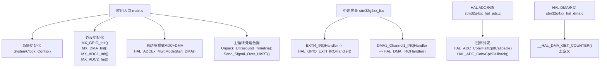
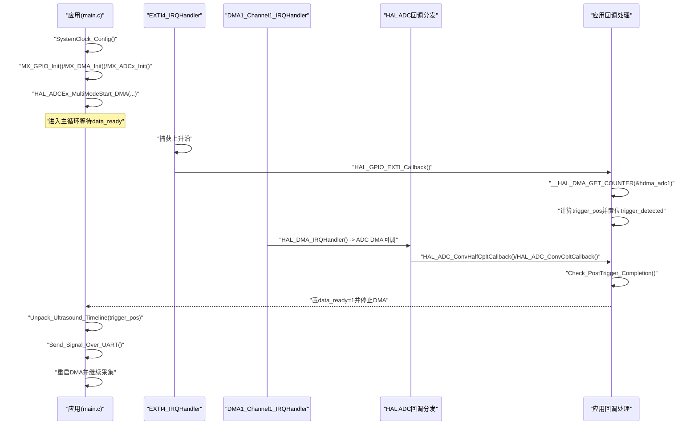
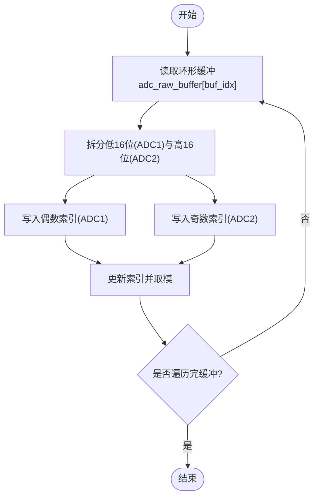
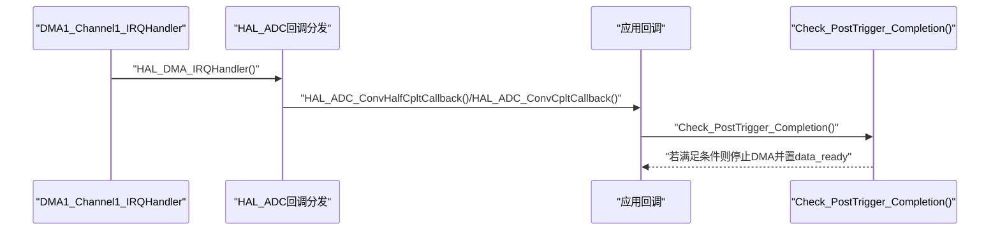
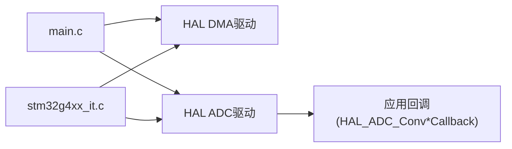

# DMA传输API

<cite>
**本文引用的文件**   
- [Core/Src/main.c](file://Core/Src/main.c)
- [Core/Inc/main.h](file://Core/Inc/main.h)
- [Core/Src/stm32g4xx_it.c](file://Core/Src/stm32g4xx_it.c)
- [Drivers/STM32G4xx_HAL_Driver/Inc/stm32g4xx_hal_dma.h](file://Drivers/STM32G4xx_HAL_Driver/Inc/stm32g4xx_hal_dma.h)
- [Drivers/STM32G4xx_HAL_Driver/Src/stm32g4xx_hal_dma.c](file://Drivers/STM32G4xx_HAL_Driver/Src/stm32g4xx_hal_dma.c)
- [Drivers/STM32G4xx_HAL_Driver/Inc/stm32g4xx_ll_dma.h](file://Drivers/STM32G4xx_HAL_Driver/Inc/stm32g4xx_ll_dma.h)
- [Drivers/STM32G4xx_HAL_Driver/Src/stm32g4xx_hal_adc.c](file://Drivers/STM32G4xx_HAL_Driver/Src/stm32g4xx_hal_adc.c)
- [Drivers/STM32G4xx_HAL_Driver/Src/stm32g4xx_hal_adc_ex.c](file://Drivers/STM32G4xx_HAL_Driver/Src/stm32g4xx_hal_adc_ex.c)
</cite>

## 目录
1. [简介](#简介)
2. [项目结构](#项目结构)
3. [核心组件](#核心组件)
4. [架构总览](#架构总览)
5. [详细组件分析](#详细组件分析)
6. [依赖关系分析](#依赖关系分析)
7. [性能考虑](#性能考虑)
8. [故障排查指南](#故障排查指南)
9. [结论](#结论)
10. [附录](#附录)

## 简介
本文件为基于STM32G4的DMA数据传输系统的API参考文档，重点覆盖：
- MX_DMA_Init()初始化流程（DMA控制器时钟使能、中断优先级设置等）
- __HAL_DMA_GET_COUNTER()宏读取剩余传输计数器的使用方法与注意事项
- 环形缓冲区管理策略与双通道交错存储格式（低16位=ADC1，高16位=ADC2）
- DMA半传输与全传输中断处理机制
- Check_PostTrigger_Completion()后触发完成检测逻辑的实现细节
- DMA性能优化技巧与内存对齐要求说明

## 项目结构
本项目采用CubeMX生成的标准分层结构：应用层位于Core/Src与Core/Inc，外设驱动位于Drivers/STM32G4xx_HAL_Driver。DMA相关的关键实现分布在main.c与HAL/LL驱动中。

图表来源
- [Core/Src/main.c:219-290](file://Core/Src/main.c#L219-L290)
- [Core/Src/stm32g4xx_it.c:205-228](file://Core/Src/stm32g4xx_it.c#L205-L228)
- [Drivers/STM32G4xx_HAL_Driver/Src/stm32g4xx_hal_adc.c:3633-3685](file://Drivers/STM32G4xx_HAL_Driver/Src/stm32g4xx_hal_adc.c#L3633-L3685)
- [Drivers/STM32G4xx_HAL_Driver/Inc/stm32g4xx_hal_dma.h:735-741](file://Drivers/STM32G4xx_HAL_Driver/Inc/stm32g4xx_hal_dma.h#L735-L741)

章节来源
- [Core/Src/main.c:219-290](file://Core/Src/main.c#L219-L290)
- [Core/Src/stm32g4xx_it.c:205-228](file://Core/Src/stm32g4xx_it.c#L205-L228)

## 核心组件
- 应用层
  - 环形缓冲与解码：adc_raw_buffer[]、decoded_signal[]、Unpack_Ultrasound_Timeline()
  - 触发与完成检测：Check_PostTrigger_Completion()、HAL_ADC_ConvHalfCpltCallback()/HAL_ADC_ConvCpltCallback()
  - 串口输出：Send_Signal_Over_UART()
- 驱动层
  - DMA初始化：MX_DMA_Init()
  - DMA宏与状态访问：__HAL_DMA_GET_COUNTER()
  - ADC多模式与DMA回调分发：stm32g4xx_hal_adc.c/ex

章节来源
- [Core/Src/main.c:53-70](file://Core/Src/main.c#L53-L70)
- [Core/Src/main.c:119-149](file://Core/Src/main.c#L119-L149)
- [Core/Src/main.c:156-171](file://Core/Src/main.c#L156-L171)
- [Core/Src/main.c:469-481](file://Core/Src/main.c#L469-L481)
- [Drivers/STM32G4xx_HAL_Driver/Inc/stm32g4xx_hal_dma.h:735-741](file://Drivers/STM32G4xx_HAL_Driver/Inc/stm32g4xx_hal_dma.h#L735-L741)
- [Drivers/STM32G4xx_HAL_Driver/Src/stm32g4xx_hal_adc.c:3633-3685](file://Drivers/STM32G4xx_HAL_Driver/Src/stm32g4xx_hal_adc.c#L3633-L3685)

## 架构总览
下图展示了从触发到数据输出的完整时序与关键函数调用链。

图表来源
- [Core/Src/main.c:219-290](file://Core/Src/main.c#L219-L290)
- [Core/Src/main.c:91-113](file://Core/Src/main.c#L91-L113)
- [Core/Src/main.c:119-149](file://Core/Src/main.c#L119-L149)
- [Core/Src/stm32g4xx_it.c:205-228](file://Core/Src/stm32g4xx_it.c#L205-L228)
- [Drivers/STM32G4xx_HAL_Driver/Src/stm32g4xx_hal_adc.c:3633-3685](file://Drivers/STM32G4xx_HAL_Driver/Src/stm32g4xx_hal_adc.c#L3633-L3685)

## 详细组件分析

### MX_DMA_Init() 初始化流程
- 功能要点
  - 使能DMAMUX1与DMA1时钟
  - 配置DMA1通道1中断优先级并启用中断
- 典型步骤
  - 调用RCC宏开启外设时钟
  - 通过NVIC设置中断优先级与使能
- 适用场景
  - 作为ADC DMA链路的基础设施，确保DMA请求与中断路径可用

章节来源
- [Core/Src/main.c:469-481](file://Core/Src/main.c#L469-L481)

### __HAL_DMA_GET_COUNTER() 宏使用
- 作用
  - 返回当前DMA通道的剩余传输单元数（CNDTR寄存器）
- 用法要点
  - 在触发中断中读取剩余计数，结合缓冲区大小推算写入位置
  - 需对边界情况做保护（如剩余计数为0或越界时的回退值）
- 返回值语义
  - 数值越小表示已写入越多；当为0时可能处于重载瞬态，需要容错处理

章节来源
- [Core/Src/main.c:101-105](file://Core/Src/main.c#L101-L105)
- [Drivers/STM32G4xx_HAL_Driver/Inc/stm32g4xx_hal_dma.h:735-741](file://Drivers/STM32G4xx_HAL_Driver/Inc/stm32g4xx_hal_dma.h#L735-L741)

### 环形缓冲区管理与双通道交错存储
- 存储格式
  - adc_raw_buffer[]为uint32_t数组，每个元素包含两个12位ADC采样：
    - 低16位：ADC1采样
    - 高16位：ADC2采样
- 缓冲区尺寸
  - CIRCULAR_BUFFER_SIZE定义了环形缓冲长度（单位：uint32_t字）
  - TOTAL_SAMPLES为解交错后的线性样本总数（2倍于缓冲长度）
- 解交错算法
  - Unpack_Ultrasound_Timeline()以trigger_pos为起点，按顺序将低/高16位分别写入decoded_signal[]，形成时间线

图表来源
- [Core/Src/main.c:156-171](file://Core/Src/main.c#L156-L171)

章节来源
- [Core/Src/main.c:53-70](file://Core/Src/main.c#L53-L70)
- [Core/Src/main.c:156-171](file://Core/Src/main.c#L156-L171)

### DMA半传输与全传输中断处理
- 回调入口
  - HAL_ADC_ConvHalfCpltCallback()：半传输完成（写满一半缓冲）
  - HAL_ADC_ConvCpltCallback()：全传输完成（缓冲写满一圈）
- 处理逻辑
  - 两者均调用Check_PostTrigger_Completion()进行统一的后触发完成判定
  - 当检测到触发且累计事件数达到阈值（HT+TC至少两次），则停止DMA并置data_ready标志

图表来源
- [Core/Src/stm32g4xx_it.c:219-228](file://Core/Src/stm32g4xx_it.c#L219-L228)
- [Core/Src/main.c:136-149](file://Core/Src/main.c#L136-L149)
- [Core/Src/main.c:119-131](file://Core/Src/main.c#L119-L131)
- [Drivers/STM32G4xx_HAL_Driver/Src/stm32g4xx_hal_adc.c:3633-3685](file://Drivers/STM32G4xx_HAL_Driver/Src/stm32g4xx_hal_adc.c#L3633-L3685)

章节来源
- [Core/Src/main.c:136-149](file://Core/Src/main.c#L136-L149)
- [Core/Src/main.c:119-131](file://Core/Src/main.c#L119-L131)
- [Core/Src/stm32g4xx_it.c:219-228](file://Core/Src/stm32g4xx_it.c#L219-L228)
- [Drivers/STM32G4xx_HAL_Driver/Src/stm32g4xx_hal_adc.c:3633-3685](file://Drivers/STM32G4xx_HAL_Driver/Src/stm32g4xx_hal_adc.c#L3633-L3685)

### Check_PostTrigger_Completion() 后触发完成检测
- 设计目标
  - 保证在触发之后至少采集到足够的“后触发”样本（例如≥80个word）
- 实现要点
  - 维护post_trigger_dma_events计数器，仅在trigger_detected为真时累加
  - 当事件数≥2（即HT与TC各至少一次）时，停止DMA并通知主循环处理
- 与触发定位的关系
  - 触发时刻由EXTI捕获并通过__HAL_DMA_GET_COUNTER()计算trigger_pos
  - 主循环据此截取环形缓冲中的前/后触发片段

章节来源
- [Core/Src/main.c:119-131](file://Core/Src/main.c#L119-L131)
- [Core/Src/main.c:91-113](file://Core/Src/main.c#L91-L113)

### 数据输出与重采流程
- 输出流程
  - Send_Signal_Over_UART()将decoded_signal[]序列化为文本并通过USB CDC发送
- 重采流程
  - 主循环在data_ready置位后，重建时间线、发送数据，然后重启DMA继续采集

章节来源
- [Core/Src/main.c:178-212](file://Core/Src/main.c#L178-L212)
- [Core/Src/main.c:264-287](file://Core/Src/main.c#L264-L287)

## 依赖关系分析
- 模块耦合
  - main.c依赖HAL DMA/ADC驱动提供的回调与宏
  - stm32g4xx_it.c提供中断入口，转发至HAL层
  - HAL ADC驱动负责回调分发，最终落到用户实现的回调函数
- 外部依赖
  - RCC/NVIC用于时钟与中断配置
  - USB CDC用于数据输出

图表来源
- [Core/Src/main.c:219-290](file://Core/Src/main.c#L219-L290)
- [Core/Src/stm32g4xx_it.c:205-228](file://Core/Src/stm32g4xx_it.c#L205-L228)
- [Drivers/STM32G4xx_HAL_Driver/Src/stm32g4xx_hal_adc.c:3633-3685](file://Drivers/STM32G4xx_HAL_Driver/Src/stm32g4xx_hal_adc.c#L3633-L3685)

章节来源
- [Core/Src/main.c:219-290](file://Core/Src/main.c#L219-L290)
- [Core/Src/stm32g4xx_it.c:205-228](file://Core/Src/stm32g4xx_it.c#L205-L228)
- [Drivers/STM32G4xx_HAL_Driver/Src/stm32g4xx_hal_adc.c:3633-3685](file://Drivers/STM32G4xx_HAL_Driver/Src/stm32g4xx_hal_adc.c#L3633-L3685)

## 性能考虑
- 内存对齐
  - 建议将adc_raw_buffer与解码缓冲按CPU总线宽度对齐（例如32位对齐），避免非对齐访问带来的额外开销
  - 对于DMA源/目的地址，遵循外设与内存的数据宽度匹配（如半字/字）
- 缓存与一致性
  - 若启用D-Cache，需在DMA读写前后执行必要的Cache维护操作，避免脏数据未落盘或读入陈旧数据
- 中断与回调
  - 中断服务程序保持最小化，仅记录必要状态；耗时操作移至主循环
  - 合理设置DMA与EXTI中断优先级，确保触发与DMA回调及时响应
- 传输参数
  - 使用循环模式减少频繁重配CNDTR的开销
  - 选择合适的内存/外设数据宽度与增量模式，避免不必要的字节搬运

[本节为通用指导，不直接分析具体文件]

## 故障排查指南
- 常见问题
  - 触发位置计算异常：检查__HAL_DMA_GET_COUNTER()返回值是否为0或越界，确认边界保护逻辑
  - 后触发样本不足：确认HT与TC回调均被调用，且post_trigger_dma_events计数正确
  - 数据错位：核对环形缓冲起始索引与解交错逻辑，确保按低/高16位顺序写入
- 调试手段
  - 在中断与回调中增加最小化的状态标记或LED翻转，验证时序
  - 通过USB CDC打印关键变量（trigger_pos、post_trigger_dma_events、remaining）辅助定位

章节来源
- [Core/Src/main.c:101-105](file://Core/Src/main.c#L101-L105)
- [Core/Src/main.c:119-131](file://Core/Src/main.c#L119-L131)
- [Core/Src/main.c:156-171](file://Core/Src/main.c#L156-L171)

## 结论
本系统通过DMA环形缓冲与ADC多模式采集实现了高效的双通道交错采样，利用EXTI触发与DMA回调协同完成精确的前/后触发窗口捕获。合理的初始化、宏使用与回调处理确保了实时性与可靠性。在实际部署中，应关注内存对齐、中断优先级与Cache一致性，以获得最佳性能。

[本节为总结性内容，不直接分析具体文件]

## 附录
- 关键宏与接口
  - __HAL_DMA_GET_COUNTER(hdma)：读取剩余传输计数
  - HAL_ADC_ConvHalfCpltCallback()/HAL_ADC_ConvCpltCallback()：ADC DMA回调入口
  - HAL_ADCEx_MultiModeStart_DMA()/HAL_ADCEx_MultiModeStop_DMA()：多模式ADC+DMA启停
- 相关驱动文件
  - DMA宏定义与API：stm32g4xx_hal_dma.h/c
  - LL层辅助函数：stm32g4xx_ll_dma.h
  - ADC驱动回调分发：stm32g4xx_hal_adc.c/ex

章节来源
- [Drivers/STM32G4xx_HAL_Driver/Inc/stm32g4xx_hal_dma.h:735-741](file://Drivers/STM32G4xx_HAL_Driver/Inc/stm32g4xx_hal_dma.h#L735-L741)
- [Drivers/STM32G4xx_HAL_Driver/Src/stm32g4xx_hal_adc.c:3633-3685](file://Drivers/STM32G4xx_HAL_Driver/Src/stm32g4xx_hal_adc.c#L3633-L3685)
- [Drivers/STM32G4xx_HAL_Driver/Src/stm32g4xx_hal_adc_ex.c:909-942](file://Drivers/STM32G4xx_HAL_Driver/Src/stm32g4xx_hal_adc_ex.c#L909-L942)