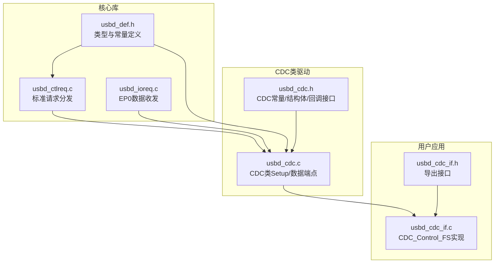
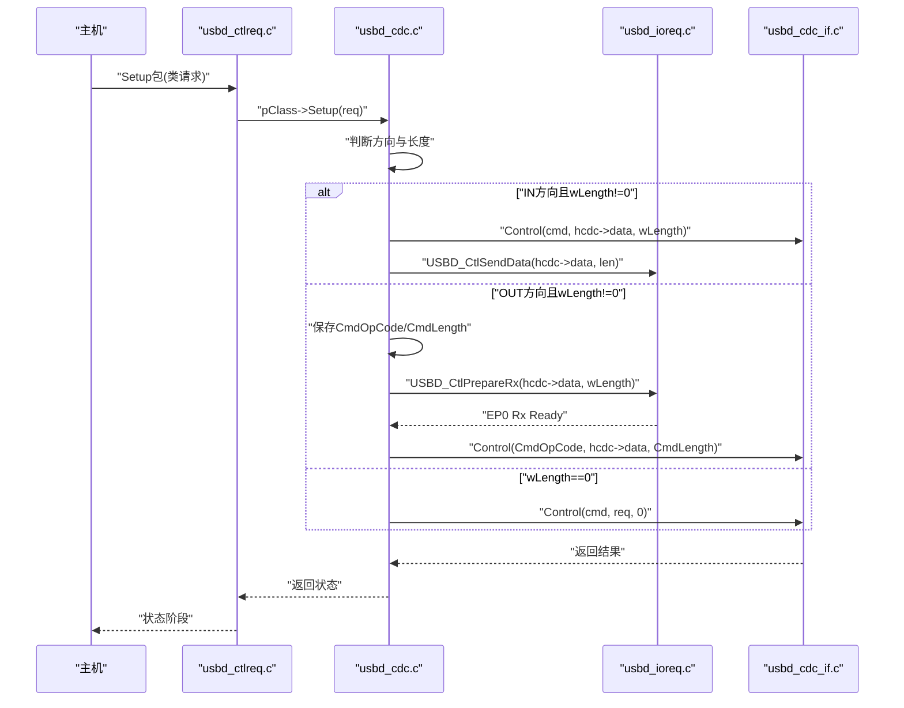
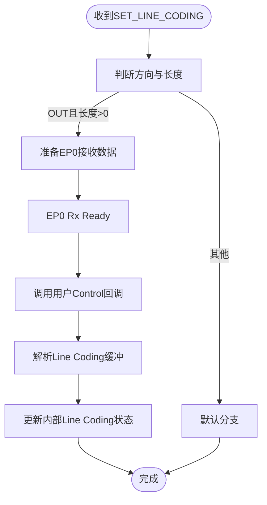
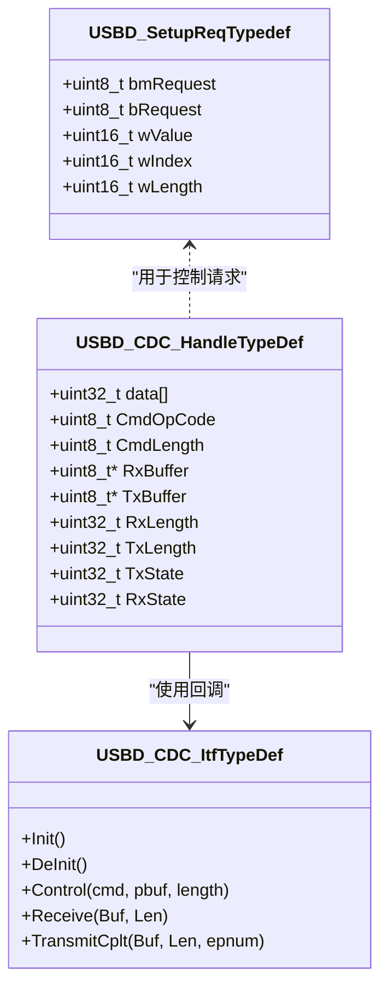

# CDC控制请求处理

<cite>
**本文引用的文件**
- [usbd_cdc.c](file://Middlewares/ST/STM32_USB_Device_Library/Class/CDC/Src/usbd_cdc.c)
- [usbd_cdc.h](file://Middlewares/ST/STM32_USB_Device_Library/Class/CDC/Inc/usbd_cdc.h)
- [usbd_ctlreq.c](file://Middlewares/ST/STM32_USB_Device_Library/Core/Src/usbd_ctlreq.c)
- [usbd_ioreq.c](file://Middlewares/ST/STM32_USB_Device_Library/Core/Src/usbd_ioreq.c)
- [usbd_def.h](file://Middlewares/ST/STM32_USB_Device_Library/Core/Inc/usbd_def.h)
- [usbd_cdc_if.c](file://USB_Device/App/usbd_cdc_if.c)
- [usbd_cdc_if.h](file://USB_Device/App/usbd_cdc_if.h)
</cite>

## 目录
1. [简介](#简介)
2. [项目结构](#项目结构)
3. [核心组件](#核心组件)
4. [架构总览](#架构总览)
5. [详细组件分析](#详细组件分析)
6. [依赖关系分析](#依赖关系分析)
7. [性能考虑](#性能考虑)
8. [故障排查指南](#故障排查指南)
9. [结论](#结论)
10. [附录](#附录)

## 简介
本技术文档围绕CDC（通信设备类）控制请求处理机制，重点解析在STM32 USB设备库中，CDC类驱动如何与用户应用层协作，完成标准控制命令的处理。文档覆盖以下要点：
- CDC_Control_FS()函数中支持的各类控制命令（如CDC_SEND_ENCAPSULATED_COMMAND、CDC_SET_LINE_CODING、CDC_GET_LINE_CODING、CDC_SET_CONTROL_LINE_STATE等）的实现方式与扩展方法
- Line Coding结构体字段含义与配置方法（dwDTERate、bCharFormat、bParityType、bDataBits）
- 波特率设置、停止位配置、校验位设置的完整示例路径
- 控制请求处理流程与错误响应机制
- 如何实现自定义扩展命令

## 项目结构
本项目采用分层设计：
- 核心USB设备库：负责标准USB请求分发、端点I/O、状态机管理
- CDC类驱动：实现CDC抽象控制模型（ACM）的类特定控制请求转发与数据端点管理
- 用户接口层：提供USBD_CDC_ItfTypeDef回调表，由用户在CDC_Control_FS()中实现具体业务逻辑（如串口参数配置）

图表来源
- [usbd_ctlreq.c:100-154](file://Middlewares/ST/STM32_USB_Device_Library/Core/Src/usbd_ctlreq.c#L100-L154)
- [usbd_ioreq.c:131-148](file://Middlewares/ST/STM32_USB_Device_Library/Core/Src/usbd_ioreq.c#L131-L148)
- [usbd_def.h:172-179](file://Middlewares/ST/STM32_USB_Device_Library/Core/Inc/usbd_def.h#L172-L179)
- [usbd_cdc.c:586-681](file://Middlewares/ST/STM32_USB_Device_Library/Class/CDC/Src/usbd_cdc.c#L586-L681)
- [usbd_cdc.h:94-124](file://Middlewares/ST/STM32_USB_Device_Library/Class/CDC/Inc/usbd_cdc.h#L94-L124)
- [usbd_cdc_if.c:138-145](file://USB_Device/App/usbd_cdc_if.c#L138-L145)

章节来源
- [usbd_cdc.c:586-681](file://Middlewares/ST/STM32_USB_Device_Library/Class/CDC/Src/usbd_cdc.c#L586-L681)
- [usbd_cdc_if.c:138-145](file://USB_Device/App/usbd_cdc_if.c#L138-L145)

## 核心组件
- USBD_SetupReqTypedef：USB Setup包结构，包含bmRequest、bRequest、wValue、wIndex、wLength等字段，用于描述控制请求
- USBD_CDC_HandleTypeDef：CDC类句柄，包含数据缓冲区、命令操作码、长度、发送/接收状态等
- USBD_CDC_ItfTypeDef：用户回调接口表，包含Init、DeInit、Control、Receive、TransmitCplt等回调函数指针
- CDC控制常量：CDC_SET_LINE_CODING、CDC_GET_LINE_CODING、CDC_SET_CONTROL_LINE_STATE、CDC_SEND_BREAK等

章节来源
- [usbd_def.h:172-179](file://Middlewares/ST/STM32_USB_Device_Library/Core/Inc/usbd_def.h#L172-L179)
- [usbd_cdc.h:94-124](file://Middlewares/ST/STM32_USB_Device_Library/Class/CDC/Inc/usbd_cdc.h#L94-L124)
- [usbd_cdc.h:72-80](file://Middlewares/ST/STM32_USB_Device_Library/Class/CDC/Inc/usbd_cdc.h#L72-L80)

## 架构总览
CDC控制请求从主机发出后，经由USB核心库的标准请求分发器进入CDC类驱动的Setup处理，再由CDC类驱动将类特定请求转发到用户实现的CDC_Control_FS()进行具体处理。对于需要双向数据传输的命令（如SET_LINE_CODING），通过EP0的数据阶段完成数据交换；对于无数据的命令（如SET_CONTROL_LINE_STATE），直接调用用户回调。

图表来源
- [usbd_ctlreq.c:100-154](file://Middlewares/ST/STM32_USB_Device_Library/Core/Src/usbd_ctlreq.c#L100-L154)
- [usbd_cdc.c:586-681](file://Middlewares/ST/STM32_USB_Device_Library/Class/CDC/Src/usbd_cdc.c#L586-L681)
- [usbd_ioreq.c:131-148](file://Middlewares/ST/STM32_USB_Device_Library/Core/Src/usbd_ioreq.c#L131-L148)
- [usbd_cdc_if.c:180-244](file://USB_Device/App/usbd_cdc_if.c#L180-L244)

## 详细组件分析

### CDC类Setup处理（USBD_CDC_Setup）
- 入口：当USB核心识别到类或厂商请求时，调用CDC类的Setup回调
- 分支逻辑：
  - 类请求（USB_REQ_TYPE_CLASS）：根据方向与长度决定是读取数据还是写入数据，并调用用户Control回调
  - 标准请求（USB_REQ_TYPE_STANDARD）：处理GET_STATUS、GET_INTERFACE、SET_INTERFACE、CLEAR_FEATURE等
- 错误处理：对不支持或非法请求调用USBD_CtlError并返回失败状态

章节来源
- [usbd_cdc.c:586-681](file://Middlewares/ST/STM32_USB_Device_Library/Class/CDC/Src/usbd_cdc.c#L586-L681)

### EP0数据接收完成回调（USBD_CDC_EP0_RxReady）
- 当EP0数据阶段完成（即主机发送了SET_LINE_CODING等命令的数据部分），触发此回调
- 将之前保存的CmdOpCode与数据缓冲交由用户Control回调处理
- 完成后重置CmdOpCode为无效值，避免重复处理

章节来源
- [usbd_cdc.c:757-775](file://Middlewares/ST/STM32_USB_Device_Library/Class/CDC/Src/usbd_cdc.c#L757-L775)

### 用户CDC控制回调（CDC_Control_FS）
- 入口：由CDC类驱动在Setup或EP0 RxReady时调用
- 支持命令（框架已声明，需用户实现）：
  - CDC_SEND_ENCAPSULATED_COMMAND
  - CDC_GET_ENCAPSULATED_RESPONSE
  - CDC_SET_COMM_FEATURE / CDC_GET_COMM_FEATURE / CDC_CLEAR_COMM_FEATURE
  - CDC_SET_LINE_CODING / CDC_GET_LINE_CODING
  - CDC_SET_CONTROL_LINE_STATE
  - CDC_SEND_BREAK
- 默认返回USBD_OK，未实现命令可保持空分支或添加错误处理

章节来源
- [usbd_cdc_if.c:180-244](file://USB_Device/App/usbd_cdc_if.c#L180-L244)

### Line Coding结构与字段说明
Line Coding用于描述串行通信的参数，包括波特率、停止位、校验位和数据位。在项目中，该结构以USBD_CDC_LineCodingTypeDef形式存在，字段映射如下：
- bitrate：对应dwDTERate，表示波特率（单位bps）
- format：对应bCharFormat，表示停止位（0=1位，1=1.5位，2=2位）
- paritytype：对应bParityType，表示校验位（0=无，1=奇校验，2=偶校验，3=标记，4=空格）
- datatype：对应bDataBits，表示数据位（5/6/7/8/16）

章节来源
- [usbd_cdc.h:94-100](file://Middlewares/ST/STM32_USB_Device_Library/Class/CDC/Inc/usbd_cdc.h#L94-L100)
- [usbd_cdc_if.c:205-221](file://USB_Device/App/usbd_cdc_if.c#L205-L221)

### SET_LINE_CODING处理流程
- 主机通过SET_LINE_CODING下发Line Coding参数
- CDC类驱动在Setup阶段检测到OUT方向且wLength!=0，保存命令码与长度，并准备EP0接收数据
- EP0 RxReady时，CDC类驱动调用用户Control回调，传入Line Coding数据缓冲
- 用户应在CDC_Control_FS中解析数据缓冲，更新内部Line Coding状态，并可据此重新配置底层UART

图表来源
- [usbd_cdc.c:601-627](file://Middlewares/ST/STM32_USB_Device_Library/Class/CDC/Src/usbd_cdc.c#L601-L627)
- [usbd_cdc.c:757-775](file://Middlewares/ST/STM32_USB_Device_Library/Class/CDC/Src/usbd_cdc.c#L757-L775)
- [usbd_cdc_if.c:180-244](file://USB_Device/App/usbd_cdc_if.c#L180-L244)

### GET_LINE_CODING处理流程
- 主机通过GET_LINE_CODING获取当前Line Coding参数
- CDC类驱动在Setup阶段检测到IN方向且wLength!=0，先调用用户Control回调填充数据缓冲，再通过EP0发送数据
- 用户应在Control回调中将当前Line Coding写入hcdc->data缓冲，确保长度不超过CDC_REQ_MAX_DATA_SIZE

章节来源
- [usbd_cdc.c:601-627](file://Middlewares/ST/STM32_USB_Device_Library/Class/CDC/Src/usbd_cdc.c#L601-L627)
- [usbd_cdc.h:68](file://Middlewares/ST/STM32_USB_Device_Library/Class/CDC/Inc/usbd_cdc.h#L68)

### SET_CONTROL_LINE_STATE处理流程
- 主机通过SET_CONTROL_LINE_STATE通知设备控制线状态（如DTR、RTS）
- 由于wLength通常为0，CDC类驱动直接调用用户Control回调，传入Setup包指针
- 用户可在Control回调中解析wValue字段，更新硬件引脚状态或记录状态

章节来源
- [usbd_cdc.c:622-627](file://Middlewares/ST/STM32_USB_Device_Library/Class/CDC/Src/usbd_cdc.c#L622-L627)
- [usbd_cdc_if.c:230-232](file://USB_Device/App/usbd_cdc_if.c#L230-L232)

### SEND_BREAK处理流程
- 主机通过SEND_BREAK请求设备发送BREAK信号
- 通常wLength为0，CDC类驱动直接调用用户Control回调
- 用户可在回调中触发底层UART发送BREAK

章节来源
- [usbd_cdc_if.c:234-236](file://USB_Device/App/usbd_cdc_if.c#L234-L236)

### 错误响应机制
- 对于不支持或非法的控制请求，CDC类驱动调用USBD_CtlError并返回失败状态
- 标准请求中的异常分支也会调用USBD_CtlError
- 用户实现应保证Control回调返回USBD_OK，否则上层可能认为处理失败

章节来源
- [usbd_cdc.c:667-677](file://Middlewares/ST/STM32_USB_Device_Library/Class/CDC/Src/usbd_cdc.c#L667-L677)
- [usbd_ctlreq.c:142-150](file://Middlewares/ST/STM32_USB_Device_Library/Core/Src/usbd_ctlreq.c#L142-L150)

### 自定义扩展命令实现
- 在CDC_Control_FS中添加新的case分支，处理厂商自定义命令
- 若命令需要数据交互，遵循SET/GET模式：
  - SET类：在Setup阶段准备EP0接收，EP0 RxReady时处理数据
  - GET类：在Setup阶段调用用户回调填充缓冲，再发送数据
- 注意长度限制与缓冲区对齐，避免越界访问

章节来源
- [usbd_cdc_if.c:180-244](file://USB_Device/App/usbd_cdc_if.c#L180-L244)
- [usbd_cdc.c:601-627](file://Middlewares/ST/STM32_USB_Device_Library/Class/CDC/Src/usbd_cdc.c#L601-L627)

## 依赖关系分析
- usbd_ctlreq.c负责标准请求分发，将类/厂商请求委派给pClass->Setup
- usbd_cdc.c实现CDC类的Setup与数据端点处理，并通过回调表调用用户实现
- usbd_ioreq.c提供EP0数据收发原语（USBD_CtlSendData、USBD_CtlPrepareRx）
- usbd_def.h定义通用类型与常量（如USBD_SetupReqTypedef）
- usbd_cdc_if.c提供用户回调实现，包含CDC_Control_FS的具体逻辑

图表来源
- [usbd_def.h:172-179](file://Middlewares/ST/STM32_USB_Device_Library/Core/Inc/usbd_def.h#L172-L179)
- [usbd_cdc.h:112-124](file://Middlewares/ST/STM32_USB_Device_Library/Class/CDC/Inc/usbd_cdc.h#L112-L124)
- [usbd_cdc.h:102-109](file://Middlewares/ST/STM32_USB_Device_Library/Class/CDC/Inc/usbd_cdc.h#L102-L109)

章节来源
- [usbd_ctlreq.c:100-154](file://Middlewares/ST/STM32_USB_Device_Library/Core/Src/usbd_ctlreq.c#L100-L154)
- [usbd_cdc.c:586-681](file://Middlewares/ST/STM32_USB_Device_Library/Class/CDC/Src/usbd_cdc.c#L586-L681)
- [usbd_ioreq.c:131-148](file://Middlewares/ST/STM32_USB_Device_Library/Core/Src/usbd_ioreq.c#L131-L148)
- [usbd_def.h:172-179](file://Middlewares/ST/STM32_USB_Device_Library/Core/Inc/usbd_def.h#L172-L179)
- [usbd_cdc.h:94-124](file://Middlewares/ST/STM32_USB_Device_Library/Class/CDC/Inc/usbd_cdc.h#L94-L124)

## 性能考虑
- EP0数据阶段长度受CDC_REQ_MAX_DATA_SIZE限制，GET_LINE_CODING时应确保返回长度不超限
- 高带宽场景下，合理设置CDC数据端点最大包大小（FS/HS）以提升吞吐
- 避免在Control回调中进行耗时操作，必要时异步处理并尽快返回

[本节为一般性指导，无需源码引用]

## 故障排查指南
- 现象：主机无法正确配置波特率
  - 检查CDC_Control_FS中是否实现了CDC_SET_LINE_CODING分支
  - 确认EP0数据接收与解析逻辑是否正确
  - 验证Line Coding结构体字段映射是否与主机一致
- 现象：GET_LINE_CODING返回错误或主机超时
  - 检查CDC类驱动是否在IN方向调用用户回调填充缓冲
  - 确认USBD_CtlSendData调用是否成功
- 现象：SET_CONTROL_LINE_STATE无效
  - 检查wValue解析逻辑与硬件引脚控制是否正确
- 常见错误：非法请求导致USBD_CtlError
  - 查看CDC类驱动default分支与标准请求default分支的错误处理

章节来源
- [usbd_cdc.c:667-677](file://Middlewares/ST/STM32_USB_Device_Library/Class/CDC/Src/usbd_cdc.c#L667-L677)
- [usbd_cdc_if.c:180-244](file://USB_Device/App/usbd_cdc_if.c#L180-L244)

## 结论
CDC控制请求处理通过“核心库分发—类驱动转发—用户回调实现”的分层架构，提供了灵活且可扩展的控制命令处理能力。用户只需在CDC_Control_FS中实现所需命令（特别是Line Coding相关），即可满足大多数虚拟串口应用场景。通过理解EP0数据阶段与回调机制，开发者可以安全地扩展自定义命令并保持与USB规范的兼容。

[本节为总结性内容，无需源码引用]

## 附录

### Line Coding字段配置示例路径
- 波特率设置（dwDTERate/bitrate）
  - 参考路径：[usbd_cdc_if.c:205-221](file://USB_Device/App/usbd_cdc_if.c#L205-L221)
- 停止位配置（bCharFormat/format）
  - 参考路径：[usbd_cdc_if.c:205-221](file://USB_Device/App/usbd_cdc_if.c#L205-L221)
- 校验位设置（bParityType/paritytype）
  - 参考路径：[usbd_cdc_if.c:205-221](file://USB_Device/App/usbd_cdc_if.c#L205-L221)
- 数据位设置（bDataBits/datatype）
  - 参考路径：[usbd_cdc_if.c:205-221](file://USB_Device/App/usbd_cdc_if.c#L205-L221)

章节来源
- [usbd_cdc_if.c:205-221](file://USB_Device/App/usbd_cdc_if.c#L205-L221)