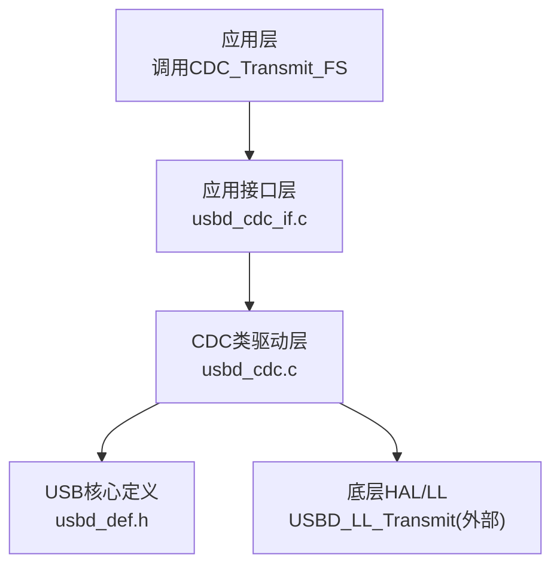
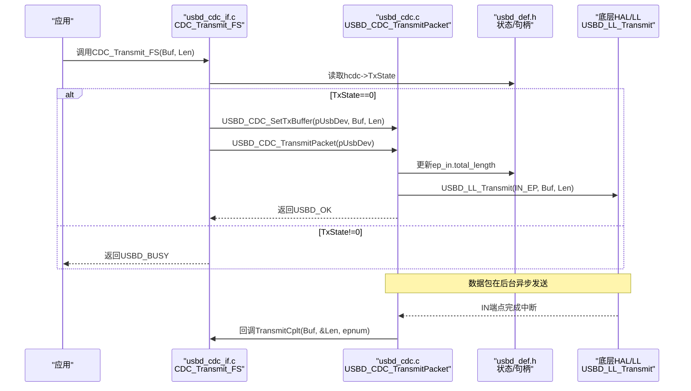
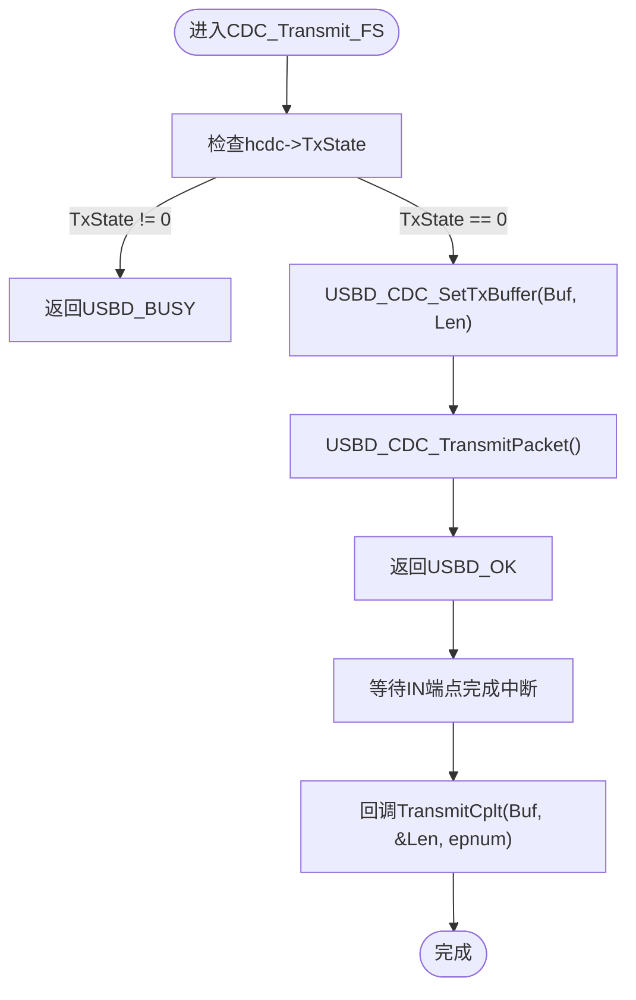
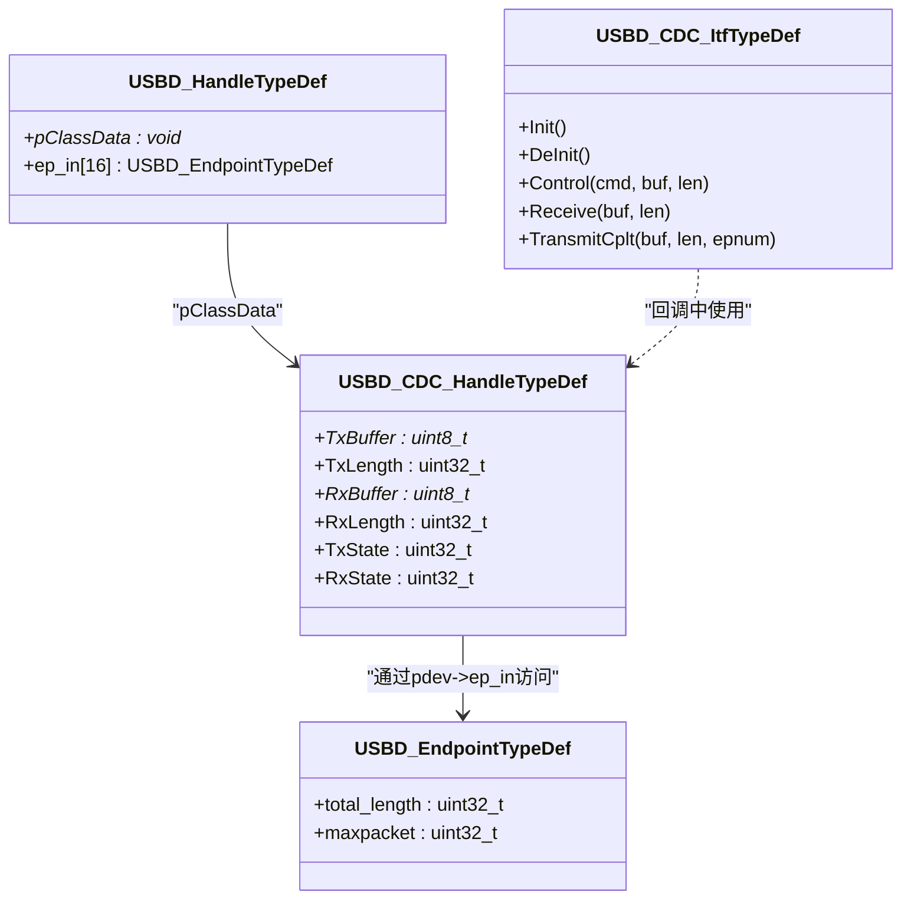

# CDC数据传输API

<cite>
**本文引用的文件**   
- [usbd_cdc.c](file://Middlewares/ST/STM32_USB_Device_Library/Class/CDC/Src/usbd_cdc.c)
- [usbd_cdc.h](file://Middlewares/ST/STM32_USB_Device_Library/Class/CDC/Inc/usbd_cdc.h)
- [usbd_def.h](file://Middlewares/ST/STM32_USB_Device_Library/Core/Inc/usbd_def.h)
- [usbd_cdc_if.c](file://USB_Device/App/usbd_cdc_if.c)
- [usbd_cdc_if.h](file://USB_Device/App/usbd_cdc_if.h)
</cite>

## 目录
1. [简介](#简介)
2. [项目结构](#项目结构)
3. [核心组件](#核心组件)
4. [架构总览](#架构总览)
5. [详细组件分析](#详细组件分析)
6. [依赖关系分析](#依赖关系分析)
7. [性能与可靠性建议](#性能与可靠性建议)
8. [故障排查指南](#故障排查指南)
9. [结论](#结论)

## 简介
本文件为CDC_Transmit_FS()函数的完整API文档，面向使用STM32 USB设备库实现虚拟串口（VCP）的开发者。内容涵盖函数原型、参数规范、返回值状态码含义与处理策略、非阻塞式传输机制、与回调函数的协作关系，以及应用层可靠传输的实现要点。

## 项目结构
本项目采用分层设计：
- 应用接口层：提供CDC_Transmit_FS等用户可见函数
- CDC类驱动层：封装USBD_CDC_SetTxBuffer、USBD_CDC_TransmitPacket等底层操作
- USB核心层：定义通用类型与状态码

图表来源
- [usbd_cdc_if.c:281-293](file://USB_Device/App/usbd_cdc_if.c#L281-L293)
- [usbd_cdc.c:857-924](file://Middlewares/ST/STM32_USB_Device_Library/Class/CDC/Src/usbd_cdc.c#L857-L924)
- [usbd_def.h:247-253](file://Middlewares/ST/STM32_USB_Device_Library/Core/Inc/usbd_def.h#L247-L253)

章节来源
- [usbd_cdc_if.c:281-293](file://USB_Device/App/usbd_cdc_if.c#L281-L293)
- [usbd_cdc.c:857-924](file://Middlewares/ST/STM32_USB_Device_Library/Class/CDC/Src/usbd_cdc.c#L857-L924)
- [usbd_def.h:247-253](file://Middlewares/ST/STM32_USB_Device_Library/Core/Inc/usbd_def.h#L247-L253)

## 核心组件
- CDC_Transmit_FS：应用层发送入口，负责检查TxState并发起一次非阻塞发送
- USBD_CDC_SetTxBuffer：设置待发送缓冲区指针与长度
- USBD_CDC_TransmitPacket：将数据提交给底层端点IN传输
- USBD_CDC_ItfTypeDef::TransmitCplt：完成回调，通知上层一次IN传输结束
- USBD_StatusTypeDef：统一的状态码枚举（OK/BUSY/FAIL等）

章节来源
- [usbd_cdc_if.c:281-293](file://USB_Device/App/usbd_cdc_if.c#L281-L293)
- [usbd_cdc.c:857-924](file://Middlewares/ST/STM32_USB_Device_Library/Class/CDC/Src/usbd_cdc.c#L857-L924)
- [usbd_cdc.h:102-124](file://Middlewares/ST/STM32_USB_Device_Library/Class/CDC/Inc/usbd_cdc.h#L102-L124)
- [usbd_def.h:247-253](file://Middlewares/ST/STM32_USB_Device_Library/Core/Inc/usbd_def.h#L247-L253)

## 架构总览
CDC发送流程从应用层进入，经接口层到CDC类驱动，最终由底层HAL/LL完成实际的数据包发送。

图表来源
- [usbd_cdc_if.c:281-293](file://USB_Device/App/usbd_cdc_if.c#L281-L293)
- [usbd_cdc.c:899-924](file://Middlewares/ST/STM32_USB_Device_Library/Class/CDC/Src/usbd_cdc.c#L899-L924)
- [usbd_cdc.c:690-722](file://Middlewares/ST/STM32_USB_Device_Library/Class/CDC/Src/usbd_cdc.c#L690-L722)
- [usbd_def.h:247-253](file://Middlewares/ST/STM32_USB_Device_Library/Core/Inc/usbd_def.h#L247-L253)

## 详细组件分析

### CDC_Transmit_FS 函数原型与参数
- 函数原型
  - uint8_t CDC_Transmit_FS(uint8_t* Buf, uint16_t Len);
- 参数说明
  - Buf：指向待发送数据的缓冲区指针。需保证在传输完成前有效且不被修改。
  - Len：要发送的数据长度（字节）。
- 返回值
  - USBD_OK：成功启动一次非阻塞发送；后续通过回调确认完成。
  - USBD_BUSY：当前仍有未完成的发送任务，无法立即启动新发送。
  - USBD_FAIL：内部错误（如句柄为空），应视为异常路径。

章节来源
- [usbd_cdc_if.h:109](file://USB_Device/App/usbd_cdc_if.h#L109)
- [usbd_cdc_if.c:281-293](file://USB_Device/App/usbd_cdc_if.c#L281-L293)
- [usbd_def.h:247-253](file://Middlewares/ST/STM32_USB_Device_Library/Core/Inc/usbd_def.h#L247-L253)

### 非阻塞式传输机制
- 状态检查
  - 通过hcdc->TxState判断是否已有正在进行的发送。若不为0则直接返回BUSY。
- 缓冲区设置
  - 调用USBD_CDC_SetTxBuffer设置TxBuffer与TxLength。
- 数据包发送
  - 调用USBD_CDC_TransmitPacket：
    - 将TxLength写入对应IN端点的total_length
    - 调用底层USBD_LL_Transmit触发实际发送
    - 返回USBD_OK表示已入队
- 完成回调
  - 当IN端点传输完成后，CDC类驱动会置零TxState并调用TransmitCplt回调，通知上层本次发送已完成。

图表来源
- [usbd_cdc_if.c:281-293](file://USB_Device/App/usbd_cdc_if.c#L281-L293)
- [usbd_cdc.c:857-871](file://Middlewares/ST/STM32_USB_Device_Library/Class/CDC/Src/usbd_cdc.c#L857-L871)
- [usbd_cdc.c:899-924](file://Middlewares/ST/STM32_USB_Device_Library/Class/CDC/Src/usbd_cdc.c#L899-L924)
- [usbd_cdc.c:690-722](file://Middlewares/ST/STM32_USB_Device_Library/Class/CDC/Src/usbd_cdc.c#L690-L722)

章节来源
- [usbd_cdc.c:857-924](file://Middlewares/ST/STM32_USB_Device_Library/Class/CDC/Src/usbd_cdc.c#L857-L924)
- [usbd_cdc.c:690-722](file://Middlewares/ST/STM32_USB_Device_Library/Class/CDC/Src/usbd_cdc.c#L690-L722)

### 返回值状态码与处理策略
- USBD_OK
  - 含义：已成功启动一次发送，数据将在后台发送。
  - 处理：继续业务逻辑，等待TransmitCplt回调以确认完成或进行下一次发送。
- USBD_BUSY
  - 含义：上一次发送尚未完成，设备忙。
  - 处理：应用层可重试（延时后再次调用）、排队缓冲、或丢弃低优先级数据。
- USBD_FAIL
  - 含义：内部错误（例如pClassData为空）。
  - 处理：记录日志、复位USB或上报错误，避免死循环重试。

章节来源
- [usbd_def.h:247-253](file://Middlewares/ST/STM32_USB_Device_Library/Core/Inc/usbd_def.h#L247-L253)
- [usbd_cdc_if.c:281-293](file://USB_Device/App/usbd_cdc_if.c#L281-L293)
- [usbd_cdc.c:899-924](file://Middlewares/ST/STM32_USB_Device_Library/Class/CDC/Src/usbd_cdc.c#L899-L924)

### 与CDC_TransmitCplt_FS回调的协作
- 回调时机
  - 当IN端点完成一次传输时，CDC类驱动会置零TxState并调用TransmitCplt回调。
- 回调职责
  - 用于释放资源、标记发送完成、触发下一次发送或更新统计信息。
- 注意事项
  - 不要在回调中执行耗时操作，以免阻塞USB中断上下文。
  - 如需再次发送，应在回调中安排下一次CDC_Transmit_FS调用（注意再次检查BUSY）。

章节来源
- [usbd_cdc.c:690-722](file://Middlewares/ST/STM32_USB_Device_Library/Class/CDC/Src/usbd_cdc.c#L690-L722)
- [usbd_cdc_if.c:307-316](file://USB_Device/App/usbd_cdc_if.c#L307-L316)

### 应用层可靠传输示例（无代码片段）
以下给出一种常见的可靠发送模式思路（不展示具体代码）：
- 维护一个发送队列（环形缓冲区），包含多个“数据块+长度”条目
- 主循环或定时器任务：
  - 若队列非空且CDC_Transmit_FS返回USBD_OK，则从队列取出下一块数据并发送
  - 若返回USBD_BUSY，稍后重试（退避策略）
  - 若返回USBD_FAIL，记录错误并尝试恢复（如重新初始化CDC或重启USB）
- TransmitCplt回调：
  - 标记当前块发送完成，唤醒任务或触发下一次发送
- 超时与重传：
  - 对长时间未完成的任务设置超时计数，超过阈值则判定失败并清理状态

[本节为概念性指导，不直接分析具体文件]

## 依赖关系分析
- CDC_Transmit_FS依赖：
  - hUsbDeviceFS全局句柄（来自应用初始化）
  - USBD_CDC_HandleTypeDef中的TxState/TxBuffer/TxLength
  - USBD_CDC_SetTxBuffer与USBD_CDC_TransmitPacket
- USBD_CDC_TransmitPacket依赖：
  - pdev->ep_in[CDC_IN_EP].total_length
  - 底层USBD_LL_Transmit（HAL/LL层）
- 回调链：
  - 底层IN完成 -> CDC_DataIn -> 回调TransmitCplt

图表来源
- [usbd_cdc.h:102-124](file://Middlewares/ST/STM32_USB_Device_Library/Class/CDC/Inc/usbd_cdc.h#L102-L124)
- [usbd_def.h:274-312](file://Middlewares/ST/STM32_USB_Device_Library/Core/Inc/usbd_def.h#L274-L312)

章节来源
- [usbd_cdc.h:102-124](file://Middlewares/ST/STM32_USB_Device_Library/Class/CDC/Inc/usbd_cdc.h#L102-L124)
- [usbd_def.h:274-312](file://Middlewares/ST/STM32_USB_Device_Library/Core/Inc/usbd_def.h#L274-L312)

## 性能与可靠性建议
- 批量发送优化
  - 尽量按端点最大包大小对齐发送，减少ZLP次数，提高吞吐
- 背压与流控
  - 遇到USBD_BUSY时采用指数退避或基于事件的重试，避免忙等
- 内存与生命周期
  - 确保Buf在TransmitCplt之前保持有效，避免被提前覆盖或释放
- 中断上下文安全
  - TransmitCplt中仅做轻量操作，复杂逻辑放入任务或队列处理

[本节为通用建议，不直接分析具体文件]

## 故障排查指南
- 现象：一直返回USBD_BUSY
  - 检查是否有遗漏的TransmitCplt回调导致TxState未被清零
  - 确认没有在同一线程内重复调用发送而未等待完成
- 现象：返回USBD_FAIL
  - 检查hUsbDeviceFS是否正确初始化且pClassData有效
  - 确认CDC类已注册且Init阶段已设置好收发缓冲区
- 现象：主机未收到数据
  - 检查端点配置与最大包大小是否与主机匹配
  - 确认数据长度是否为端点最大包的整数倍，必要时发送ZLP

章节来源
- [usbd_cdc.c:690-722](file://Middlewares/ST/STM32_USB_Device_Library/Class/CDC/Src/usbd_cdc.c#L690-L722)
- [usbd_cdc.c:857-924](file://Middlewares/ST/STM32_USB_Device_Library/Class/CDC/Src/usbd_cdc.c#L857-L924)

## 结论
CDC_Transmit_FS提供了简洁的非阻塞发送接口，配合TransmitCplt回调可实现高效可靠的USB CDC数据传输。正确理解TxState状态机、合理处理BUSY与FAIL状态、并在回调中安排后续发送，是构建稳定应用的关键。