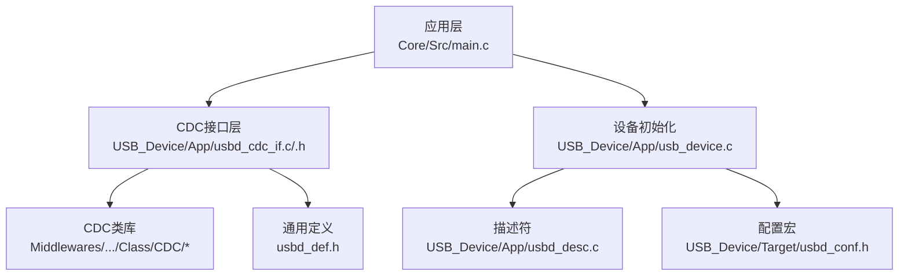
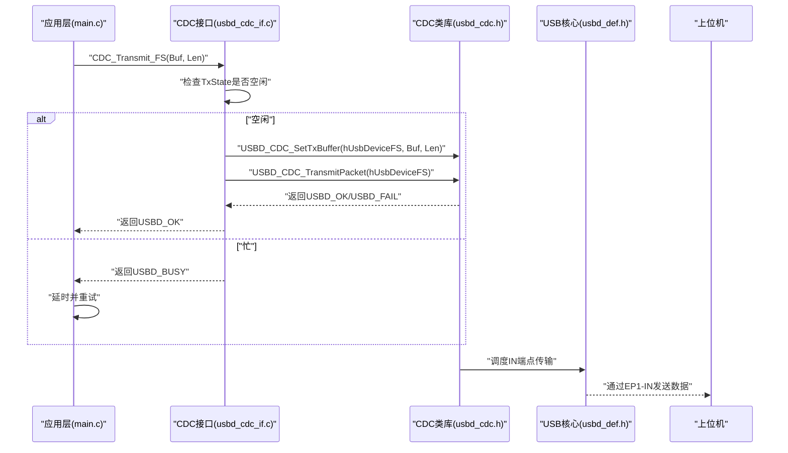
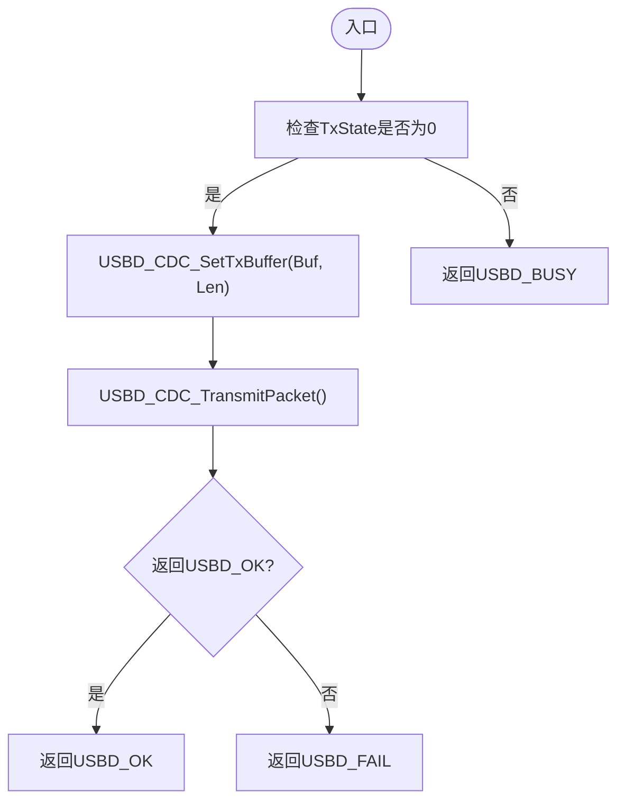
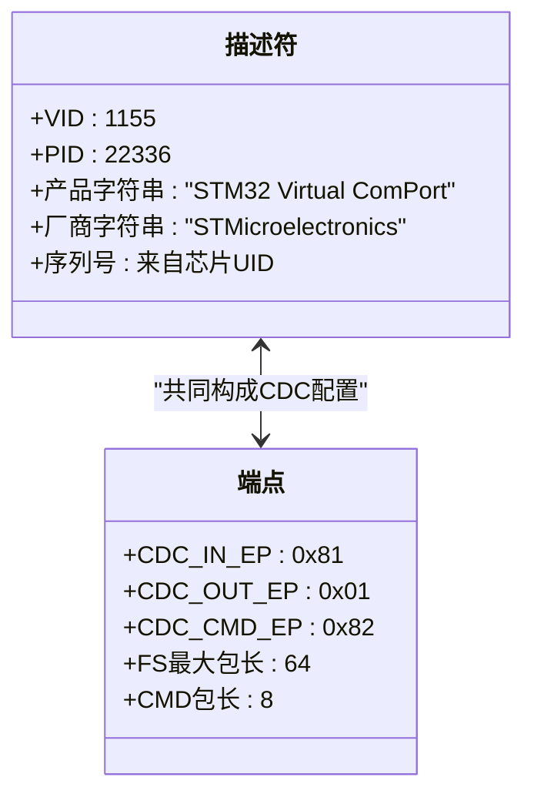
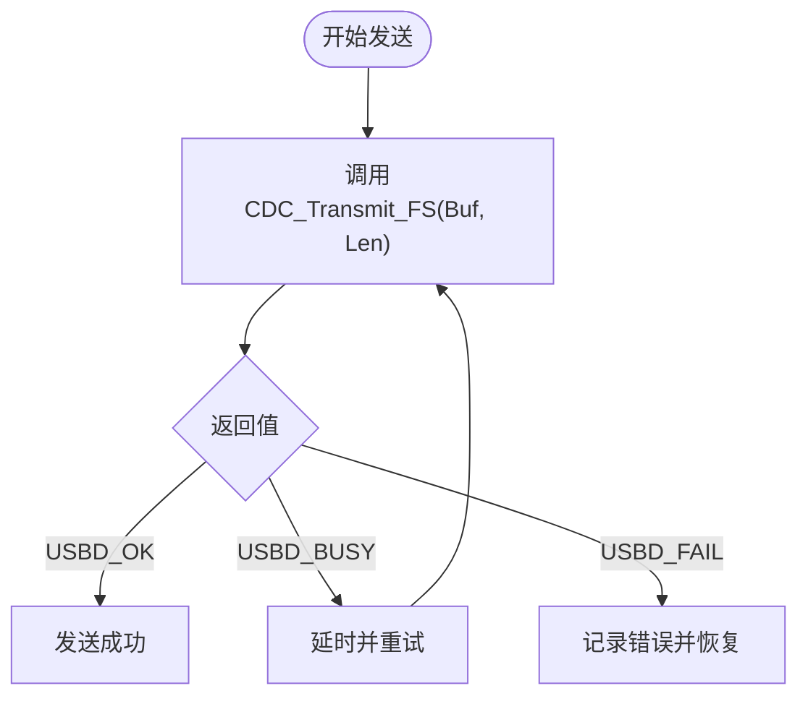
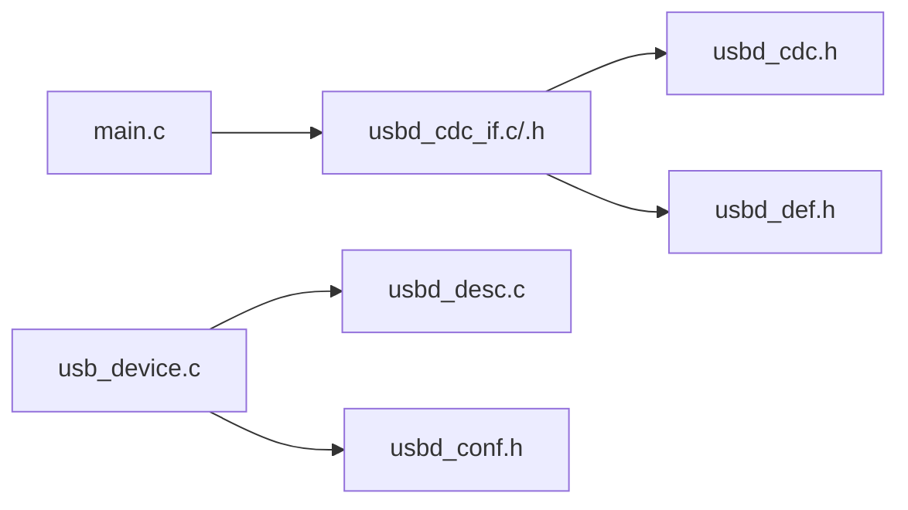

# USB CDC通信API

<cite>
**本文引用的文件列表**
- [main.c](file://Core/Src/main.c)
- [usbd_cdc_if.c](file://USB_Device/App/usbd_cdc_if.c)
- [usbd_cdc_if.h](file://USB_Device/App/usbd_cdc_if.h)
- [usbd_cdc.h](file://Middlewares/ST/STM32_USB_Device_Library/Class/CDC/Inc/usbd_cdc.h)
- [usbd_desc.c](file://USB_Device/App/usbd_desc.c)
- [usb_device.c](file://USB_Device/App/usb_device.c)
- [usbd_def.h](file://Middlewares/ST/STM32_USB_Device_Library/Core/Inc/usbd_def.h)
- [usbd_conf.h](file://USB_Device/Target/usbd_conf.h)
</cite>

## 目录
1. [简介](#简介)
2. [项目结构](#项目结构)
3. [核心组件](#核心组件)
4. [架构总览](#架构总览)
5. [详细组件分析](#详细组件分析)
6. [依赖关系分析](#依赖关系分析)
7. [性能与缓冲区管理](#性能与缓冲区管理)
8. [故障排查指南](#故障排查指南)
9. [结论](#结论)
10. [附录：上位机通信协议规范](#附录上位机通信协议规范)

## 简介
本文件为基于STM32的USB CDC虚拟串口通信的API参考文档，重点围绕CDC_Transmit_FS()数据传输函数、USB状态码、设备描述符配置、非阻塞传输机制与重试策略、以及上位机通信协议进行系统化说明。文档面向具备基础嵌入式开发知识的读者，力求以循序渐进的方式呈现从应用层到驱动层的完整链路。

## 项目结构
本项目采用分层组织方式：
- 应用层（Core/Src/main.c）：采集ADC数据、组装文本帧并通过CDC发送。
- CDC接口层（USB_Device/App/usbd_cdc_if.*）：封装CDC发送/接收回调与缓冲设置。
- CDC类库（Middlewares/.../Class/CDC/*）：提供CDC类实现与端点定义。
- 描述符与设备初始化（USB_Device/App/usbd_desc.c, usb_device.c）：定义设备ID、字符串描述符、端点配置并启动USB栈。
- 通用定义与配置（Middlewares/.../Core/Inc/usbd_def.h, USB_Device/Target/usbd_conf.h）：定义状态码、端点大小、宏等。

图表来源
- [main.c:178-212](file://Core/Src/main.c#L178-L212)
- [usbd_cdc_if.c:281-293](file://USB_Device/App/usbd_cdc_if.c#L281-L293)
- [usbd_cdc.h:44-66](file://Middlewares/ST/STM32_USB_Device_Library/Class/CDC/Inc/usbd_cdc.h#L44-L66)
- [usb_device.c:66-88](file://USB_Device/App/usb_device.c#L66-L88)
- [usbd_desc.c:147-167](file://USB_Device/App/usbd_desc.c#L147-L167)
- [usbd_def.h:246-253](file://Middlewares/ST/STM32_USB_Device_Library/Core/Inc/usbd_def.h#L246-L253)
- [usbd_conf.h:68-86](file://USB_Device/Target/usbd_conf.h#L68-L86)

章节来源
- [main.c:178-212](file://Core/Src/main.c#L178-L212)
- [usbd_cdc_if.c:281-293](file://USB_Device/App/usbd_cdc_if.c#L281-L293)
- [usbd_cdc.h:44-66](file://Middlewares/ST/STM32_USB_Device_Library/Class/CDC/Inc/usbd_cdc.h#L44-L66)
- [usb_device.c:66-88](file://USB_Device/App/usb_device.c#L66-L88)
- [usbd_desc.c:147-167](file://USB_Device/App/usbd_desc.c#L147-L167)
- [usbd_def.h:246-253](file://Middlewares/ST/STM32_USB_Device_Library/Core/Inc/usbd_def.h#L246-L253)
- [usbd_conf.h:68-86](file://USB_Device/Target/usbd_conf.h#L68-L86)

## 核心组件
- CDC_Transmit_FS()：应用层调用此函数将数据放入CDC IN端点队列。该函数为非阻塞式，若端点忙则返回USBD_BUSY，需上层重试。
- USBD_CDC_ItfTypeDef：CDC类接口回调表，包含初始化、控制命令、接收完成、发送完成等回调指针。
- USBD_HandleTypeDef：USB设备句柄，维护端点状态、速度、配置等。
- 描述符模块：提供设备描述符、字符串描述符、配置描述符等，用于枚举和主机识别。

章节来源
- [usbd_cdc_if.c:281-293](file://USB_Device/App/usbd_cdc_if.c#L281-L293)
- [usbd_cdc_if.c:138-145](file://USB_Device/App/usbd_cdc_if.c#L138-L145)
- [usbd_def.h:285-312](file://Middlewares/ST/STM32_USB_Device_Library/Core/Inc/usbd_def.h#L285-L312)
- [usbd_desc.c:132-141](file://USB_Device/App/usbd_desc.c#L132-L141)

## 架构总览
下图展示了从应用层到USB底层的数据流与控制流：

图表来源
- [main.c:208-211](file://Core/Src/main.c#L208-L211)
- [usbd_cdc_if.c:281-293](file://USB_Device/App/usbd_cdc_if.c#L281-L293)
- [usbd_cdc.h:152-157](file://Middlewares/ST/STM32_USB_Device_Library/Class/CDC/Inc/usbd_cdc.h#L152-L157)
- [usbd_def.h:285-312](file://Middlewares/ST/STM32_USB_Device_Library/Core/Inc/usbd_def.h#L285-L312)

## 详细组件分析

### CDC_Transmit_FS() API参考
- 功能：将用户数据提交至CDC IN端点进行发送。
- 原型：uint8_t CDC_Transmit_FS(uint8_t* Buf, uint16_t Len);
- 参数：
  - Buf：待发送数据的缓冲区指针（由调用者负责生命周期）。
  - Len：待发送字节数（建议不超过APP_TX_DATA_SIZE，且尽量按端点最大包长对齐以提升吞吐）。
- 返回值：
  - USBD_OK：成功入队。
  - USBD_BUSY：端点忙（TxState非零），需上层重试。
  - USBD_FAIL：底层失败（如句柄无效、端点未启用等）。
- 行为特性：
  - 非阻塞：立即返回，实际传输在USB事务中异步完成。
  - 内部使用USBD_CDC_SetTxBuffer设置发送缓冲与长度，再调用USBD_CDC_TransmitPacket触发一次IN传输。
  - 发送完成后会进入回调CDC_TransmitCplt_FS（当前为空实现），可用于释放资源或统计。

图表来源
- [usbd_cdc_if.c:281-293](file://USB_Device/App/usbd_cdc_if.c#L281-L293)
- [usbd_cdc.h:152-157](file://Middlewares/ST/STM32_USB_Device_Library/Class/CDC/Inc/usbd_cdc.h#L152-L157)

章节来源
- [usbd_cdc_if.c:281-293](file://USB_Device/App/usbd_cdc_if.c#L281-L293)
- [usbd_cdc_if.h:109](file://USB_Device/App/usbd_cdc_if.h#L109)
- [usbd_cdc.h:152-157](file://Middlewares/ST/STM32_USB_Device_Library/Class/CDC/Inc/usbd_cdc.h#L152-L157)

### USB状态码含义与处理
- USBD_OK：操作成功。
- USBD_BUSY：设备忙（通常表示端点正在传输或队列满）。
- USBD_EMEM：内存不足（较少见）。
- USBD_FAIL：操作失败（如句柄错误、端点未配置等）。

处理方式建议：
- 收到USBD_BUSY时，采用“短延时+重试”的策略，避免忙等导致系统卡顿。
- 收到USBD_FAIL时，记录错误并尝试恢复（例如重新注册接口、重启USB栈等）。

章节来源
- [usbd_def.h:246-253](file://Middlewares/ST/STM32_USB_Device_Library/Core/Inc/usbd_def.h#L246-L253)
- [usbd_cdc_if.c:281-293](file://USB_Device/App/usbd_cdc_if.c#L281-L293)

### 设备描述符与端点配置
- 设备ID：
  - VID=1155，PID=22336（十进制），产品名“STM32 Virtual ComPort”，厂商“STMicroelectronics”。
- 字符串描述符：
  - 语言ID、制造商、产品、序列号、配置、接口字符串均通过描述符函数生成。
  - 序列号由芯片唯一ID拼接生成。
- 端点配置：
  - CDC_IN_EP=0x81（EP1-IN，数据上行）
  - CDC_OUT_EP=0x01（EP1-OUT，数据下行）
  - CDC_CMD_EP=0x82（EP2-CMD，控制命令）
  - FS端点最大包长：64字节；CMD包长：8字节。
- 配置描述符大小：67字节（标准CDC配置）。

图表来源
- [usbd_desc.c:65-71](file://USB_Device/App/usbd_desc.c#L65-L71)
- [usbd_desc.c:147-167](file://USB_Device/App/usbd_desc.c#L147-L167)
- [usbd_cdc.h:44-66](file://Middlewares/ST/STM32_USB_Device_Library/Class/CDC/Inc/usbd_cdc.h#L44-L66)

章节来源
- [usbd_desc.c:65-71](file://USB_Device/App/usbd_desc.c#L65-L71)
- [usbd_desc.c:147-167](file://USB_Device/App/usbd_desc.c#L147-L167)
- [usbd_cdc.h:44-66](file://Middlewares/ST/STM32_USB_Device_Library/Class/CDC/Inc/usbd_cdc.h#L44-L66)

### 非阻塞式数据传输与重试策略
- 非阻塞机制：
  - CDC_Transmit_FS仅将数据入队并返回，不等待物理传输完成。
  - 实际传输由USB核心在IN事务中完成，并在完成后触发CDC_TransmitCplt_FS回调。
- 重试策略（示例）：
  - 当返回USBD_BUSY时，调用HAL_Delay进行短延时后重试，直到返回USBD_OK或达到最大重试次数。
  - 主循环中可结合标志位控制重试，避免阻塞其他任务。

图表来源
- [main.c:208-211](file://Core/Src/main.c#L208-L211)
- [usbd_cdc_if.c:281-293](file://USB_Device/App/usbd_cdc_if.c#L281-L293)

章节来源
- [main.c:208-211](file://Core/Src/main.c#L208-L211)
- [usbd_cdc_if.c:281-293](file://USB_Device/App/usbd_cdc_if.c#L281-L293)

### 连接状态监控与错误恢复示例
- 连接状态：
  - 可通过USBD_HandleTypeDef中的dev_connection_status字段判断设备是否被主机枚举并配置。
- 错误恢复：
  - 若CDC_Transmit_FS返回USBD_FAIL，可尝试重新注册CDC接口或重启USB栈。
  - 若长时间BUSY，可增加退避时间或限制重试次数，防止饿死其他任务。

章节来源
- [usbd_def.h:285-312](file://Middlewares/ST/STM32_USB_Device_Library/Core/Inc/usbd_def.h#L285-L312)
- [usb_device.c:66-88](file://USB_Device/App/usb_device.c#L66-L88)

## 依赖关系分析
- 应用层依赖CDC接口层提供的CDC_Transmit_FS。
- CDC接口层依赖CDC类库的SetTxBuffer与TransmitPacket。
- 设备初始化依赖描述符与配置宏。
- 状态码定义来源于通用定义头文件。

图表来源
- [main.c:208-211](file://Core/Src/main.c#L208-L211)
- [usbd_cdc_if.c:281-293](file://USB_Device/App/usbd_cdc_if.c#L281-L293)
- [usbd_cdc.h:152-157](file://Middlewares/ST/STM32_USB_Device_Library/Class/CDC/Inc/usbd_cdc.h#L152-L157)
- [usb_device.c:66-88](file://USB_Device/App/usb_device.c#L66-L88)
- [usbd_desc.c:132-141](file://USB_Device/App/usbd_desc.c#L132-L141)
- [usbd_conf.h:68-86](file://USB_Device/Target/usbd_conf.h#L68-L86)

章节来源
- [main.c:208-211](file://Core/Src/main.c#L208-L211)
- [usbd_cdc_if.c:281-293](file://USB_Device/App/usbd_cdc_if.c#L281-L293)
- [usbd_cdc.h:152-157](file://Middlewares/ST/STM32_USB_Device_Library/Class/CDC/Inc/usbd_cdc.h#L152-L157)
- [usb_device.c:66-88](file://USB_Device/App/usb_device.c#L66-L88)
- [usbd_desc.c:132-141](file://USB_Device/App/usbd_desc.c#L132-L141)
- [usbd_conf.h:68-86](file://USB_Device/Target/usbd_conf.h#L68-L86)

## 性能与缓冲区管理
- 端点最大包长：
  - FS模式下数据端点最大包长为64字节，CMD端点为8字节。
- 应用缓冲：
  - APP_RX_DATA_SIZE与APP_TX_DATA_SIZE均为2048字节，适合批量发送。
- 发送策略：
  - 建议按端点最大包长分片发送，减少重传概率。
  - 对于大帧（如本项目的多行ASCII文本），可在应用层构建完整输出缓冲后一次性提交，但需注意USBD_BUSY时的重试。

章节来源
- [usbd_cdc.h:57-66](file://Middlewares/ST/STM32_USB_Device_Library/Class/CDC/Inc/usbd_cdc.h#L57-L66)
- [usbd_cdc_if.h:52-53](file://USB_Device/App/usbd_cdc_if.h#L52-L53)
- [main.c:178-212](file://Core/Src/main.c#L178-L212)

## 故障排查指南
- 现象：CDC_Transmit_FS返回USBD_BUSY
  - 原因：端点忙或队列满。
  - 处理：短延时重试，必要时增加退避时间或限制重试次数。
- 现象：CDC_Transmit_FS返回USBD_FAIL
  - 原因：句柄无效、端点未启用或底层错误。
  - 处理：检查USB初始化流程，确认已注册CDC类与接口；必要时重启USB栈。
- 现象：主机无法识别设备
  - 原因：描述符错误或VID/PID不匹配。
  - 处理：核对设备描述符与字符串描述符，确保序列号生成逻辑正常。

章节来源
- [usbd_cdc_if.c:281-293](file://USB_Device/App/usbd_cdc_if.c#L281-L293)
- [usb_device.c:66-88](file://USB_Device/App/usb_device.c#L66-L88)
- [usbd_desc.c:339-356](file://USB_Device/App/usbd_desc.c#L339-L356)

## 结论
本API参考聚焦于CDC_Transmit_FS的使用要点、USB状态码语义、描述符与端点配置、非阻塞传输与重试策略，并结合项目代码给出可视化流程图与依赖图。遵循本文档的实践建议，可实现稳定高效的USB CDC虚拟串口通信。

## 附录：上位机通信协议规范
- 文本格式：
  - 每行一个数值（十进制），以换行符终止。
  - 编码：ASCII。
- 示例约定：
  - 每行末尾包含换行符，便于上位机逐行解析。
- 解析建议：
  - 上位机按行读取，去除换行符后进行数值转换。
  - 对空行或异常数据进行容错处理。

章节来源
- [main.c:178-212](file://Core/Src/main.c#L178-L212)