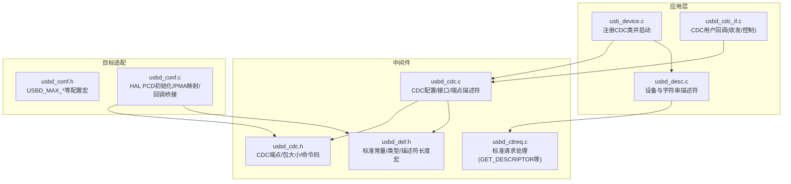
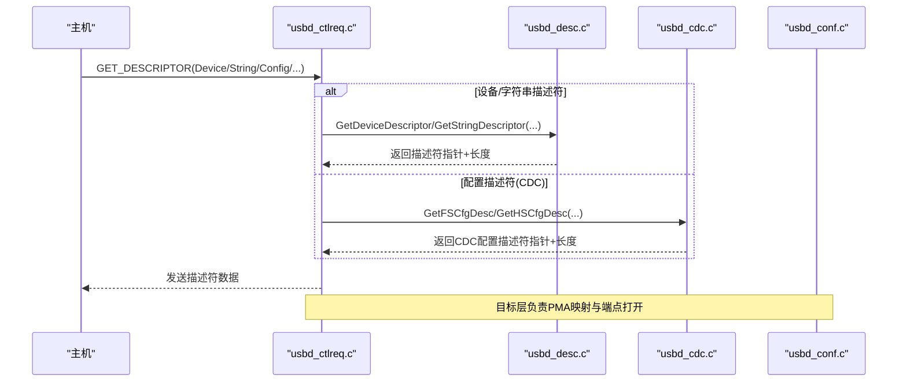
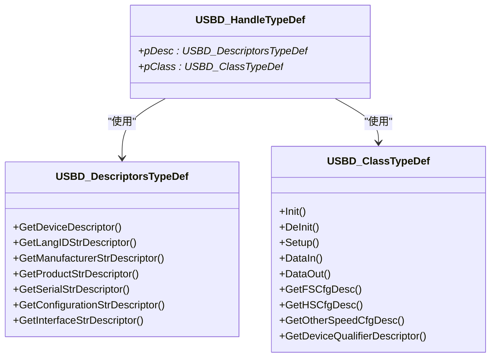

# USB设备描述符配置

<cite>
**本文引用的文件**   
- [usbd_desc.c](file://USB_Device/App/usbd_desc.c)
- [usbd_desc.h](file://USB_Device/App/usbd_desc.h)
- [usb_device.c](file://USB_Device/App/usb_device.c)
- [usbd_def.h](file://Middlewares/ST/STM32_USB_Device_Library/Core/Inc/usbd_def.h)
- [usbd_ctlreq.c](file://Middlewares/ST/STM32_USB_Device_Library/Core/Src/usbd_ctlreq.c)
- [usbd_cdc.h](file://Middlewares/ST/STM32_USB_Device_Library/Class/CDC/Inc/usbd_cdc.h)
- [usbd_cdc.c](file://Middlewares/ST/STM32_USB_Device_Library/Class/CDC/Src/usbd_cdc.c)
- [usbd_conf.h](file://USB_Device/Target/usbd_conf.h)
- [usbd_conf.c](file://USB_Device/Target/usbd_conf.c)
</cite>

## 目录
1. [简介](#简介)
2. [项目结构](#项目结构)
3. [核心组件](#核心组件)
4. [架构总览](#架构总览)
5. [详细组件分析](#详细组件分析)
6. [依赖关系分析](#依赖关系分析)
7. [性能与端点配置要点](#性能与端点配置要点)
8. [故障排查指南](#故障排查指南)
9. [结论](#结论)
10. [附录：描述符模板与自定义指南](#附录描述符模板与自定义指南)

## 简介
本文件面向在STM32G4上使用STM32 USB设备库实现CDC（虚拟串口）设备的工程师，系统化说明如何配置和定制USB设备描述符。内容覆盖：
- 设备描述符关键字段（bDeviceClass、bDeviceSubClass、bDeviceProtocol等）的含义与配置方法
- 字符串描述符的编码格式与多语言支持机制
- 接口描述符与端点描述符的关键参数（端点地址、传输类型、最大包大小等）
- 完整描述符模板与可操作修改指南（厂商ID、产品ID、序列号等）
- 描述符验证工具与调试技巧

## 项目结构
本项目采用分层组织：应用层定义设备描述符与CDC接口回调；中间件提供USB设备核心与CDC类驱动；目标板适配层负责底层HAL/PCD初始化与PMA内存映射。

图表来源
- [usbd_desc.c:132-141](file://USB_Device/App/usbd_desc.c#L132-L141)
- [usb_device.c:66-88](file://USB_Device/App/usb_device.c#L66-L88)
- [usbd_cdc_if.c:138-145](file://USB_Device/App/usbd_cdc_if.c#L138-L145)
- [usbd_def.h:76-140](file://Middlewares/ST/STM32_USB_Device_Library/Core/Inc/usbd_def.h#L76-L140)
- [usbd_ctlreq.c:100-154](file://Middlewares/ST/STM32_USB_Device_Library/Core/Src/usbd_ctlreq.c#L100-L154)
- [usbd_cdc.c:158-354](file://Middlewares/ST/STM32_USB_Device_Library/Class/CDC/Src/usbd_cdc.c#L158-L354)
- [usbd_cdc.h:44-68](file://Middlewares/ST/STM32_USB_Device_Library/Class/CDC/Inc/usbd_cdc.h#L44-L68)
- [usbd_conf.h:68-83](file://USB_Device/Target/usbd_conf.h#L68-L83)
- [usbd_conf.c:394-451](file://USB_Device/Target/usbd_conf.c#L394-L451)

章节来源
- [usbd_desc.c:132-141](file://USB_Device/App/usbd_desc.c#L132-L141)
- [usb_device.c:66-88](file://USB_Device/App/usb_device.c#L66-L88)
- [usbd_cdc_if.c:138-145](file://USB_Device/App/usbd_cdc_if.c#L138-L145)
- [usbd_def.h:76-140](file://Middlewares/ST/STM32_USB_Device_Library/Core/Inc/usbd_def.h#L76-L140)
- [usbd_ctlreq.c:100-154](file://Middlewares/ST/STM32_USB_Device_Library/Core/Src/usbd_ctlreq.c#L100-L154)
- [usbd_cdc.c:158-354](file://Middlewares/ST/STM32_USB_Device_Library/Class/CDC/Src/usbd_cdc.c#L158-L354)
- [usbd_cdc.h:44-68](file://Middlewares/ST/STM32_USB_Device_Library/Class/CDC/Inc/usbd_cdc.h#L44-L68)
- [usbd_conf.h:68-83](file://USB_Device/Target/usbd_conf.h#L68-L83)
- [usbd_conf.c:394-451](file://USB_Device/Target/usbd_conf.c#L394-L451)

## 核心组件
- 设备描述符与字符串描述符：由应用层集中维护，通过函数指针表暴露给核心库。
- CDC类描述符：由中间件CDC类驱动提供，包含通信接口与数据接口的描述符及功能描述符。
- 标准请求处理：核心库根据GET_DESCRIPTOR请求分发到具体描述符获取函数。
- 目标适配层：完成HAL PCD初始化、中断与PMA缓冲区映射，将上层描述符与底层硬件连接。

章节来源
- [usbd_desc.c:132-141](file://USB_Device/App/usbd_desc.c#L132-L141)
- [usbd_cdc.c:158-354](file://Middlewares/ST/STM32_USB_Device_Library/Class/CDC/Src/usbd_cdc.c#L158-L354)
- [usbd_ctlreq.c:100-154](file://Middlewares/ST/STM32_USB_Device_Library/Core/Src/usbd_ctlreq.c#L100-L154)
- [usbd_conf.c:394-451](file://USB_Device/Target/usbd_conf.c#L394-L451)

## 架构总览
下图展示从主机枚举到描述符返回的核心流程，以及各模块职责边界。

图表来源
- [usbd_ctlreq.c:100-154](file://Middlewares/ST/STM32_USB_Device_Library/Core/Src/usbd_ctlreq.c#L100-L154)
- [usbd_desc.c:222-332](file://USB_Device/App/usbd_desc.c#L222-L332)
- [usbd_cdc.c:158-354](file://Middlewares/ST/STM32_USB_Device_Library/Class/CDC/Src/usbd_cdc.c#L158-L354)
- [usbd_conf.c:394-451](file://USB_Device/Target/usbd_conf.c#L394-L451)

## 详细组件分析

### 设备描述符（Device Descriptor）
- 关键字段含义与配置要点
  - bDeviceClass/bDeviceSubClass/bDeviceProtocol：用于声明设备级类别。当前示例设置为“按接口分类”，即设备级为0x00，由接口描述符分别指定通信和数据接口类别。
  - idVendor/idProduct：厂商ID与产品ID，决定主机识别的设备身份。
  - iManufacturer/iProduct/iSerial：字符串描述符索引，指向字符串描述符表中的对应项。
  - bNumConfigurations：配置数量，通常为1。
- 修改位置
  - 厂商/产品字符串、VID/PID、语言ID等常量定义位于应用层描述符源文件中。
  - 设备描述符数组位于同一文件，字段顺序严格遵循USB规范。

章节来源
- [usbd_desc.c:65-72](file://USB_Device/App/usbd_desc.c#L65-L72)
- [usbd_desc.c:147-167](file://USB_Device/App/usbd_desc.c#L147-L167)
- [usbd_def.h:76-90](file://Middlewares/ST/STM32_USB_Device_Library/Core/Inc/usbd_def.h#L76-L90)

### 字符串描述符（String Descriptors）
- 编码格式
  - 首字节为长度，第二字节为描述符类型（字符串），后续为UTF-16LE编码字符对。
  - 语言ID描述符仅包含语言标识（如英语美国）。
- 多语言支持
  - 通过语言ID描述符声明支持的语言集合，主机随后以特定语言索引请求具体字符串。
  - 当前工程默认只声明一种语言，如需多语言，需扩展语言ID列表并在字符串获取函数中按索引返回对应语言文本。
- 动态序列号
  - 序列号字符串通过读取芯片唯一ID生成，避免重复。
- 修改位置
  - 字符串常量、语言ID、序列号缓冲与转换逻辑均位于应用层描述符源文件。

章节来源
- [usbd_desc.c:185-205](file://USB_Device/App/usbd_desc.c#L185-L205)
- [usbd_desc.c:248-332](file://USB_Device/App/usbd_desc.c#L248-L332)
- [usbd_desc.c:339-384](file://USB_Device/App/usbd_desc.c#L339-L384)
- [usbd_desc.h:49-53](file://USB_Device/App/usbd_desc.h#L49-L53)

### 配置描述符（Configuration Descriptor）与接口/端点描述符
- 配置描述符
  - 声明接口数量、配置值、电源属性、最大功耗等。
- 接口描述符
  - 通信接口：bInterfaceClass=0x02（Communication），bInterfaceSubClass=0x02（ACM），bInterfaceProtocol=0x01（AT命令兼容）。
  - 数据接口：bInterfaceClass=0x0A（CDC Data）。
- 功能描述符（CDC Class-Specific）
  - Header、Call Management、Abstract Control Management、Union等功能描述符用于描述ACM能力与接口关联。
- 端点描述符
  - 命令端点（中断）：方向IN，最大包大小较小，bInterval非零。
  - 数据端点（批量）：OUT与IN两个端点，最大包大小依据速度（FS=64B，HS=512B）。
- 修改位置
  - CDC配置描述符（含接口与端点）由中间件CDC类驱动提供，可在相应数组中调整端点地址、传输类型、最大包大小与间隔。

章节来源
- [usbd_cdc.c:158-354](file://Middlewares/ST/STM32_USB_Device_Library/Class/CDC/Src/usbd_cdc.c#L158-L354)
- [usbd_cdc.h:44-68](file://Middlewares/ST/STM32_USB_Device_Library/Class/CDC/Inc/usbd_cdc.h#L44-L68)

### 描述符获取与标准请求处理
- 主机发起GET_DESCRIPTOR时，核心库解析请求类型与索引，调用应用层或类层的描述符获取函数。
- 设备/字符串描述符由应用层提供；配置描述符由CDC类提供。
- 该流程确保描述符按需返回，减少总线负载。

章节来源
- [usbd_ctlreq.c:100-154](file://Middlewares/ST/STM32_USB_Device_Library/Core/Src/usbd_ctlreq.c#L100-L154)
- [usbd_desc.c:222-332](file://USB_Device/App/usbd_desc.c#L222-L332)
- [usbd_cdc.c:158-354](file://Middlewares/ST/STM32_USB_Device_Library/Class/CDC/Src/usbd_cdc.c#L158-L354)

### 目标适配层与PMA映射
- HAL PCD初始化：设置USB时钟源、中断优先级、速度、PHY类型等。
- PMA缓冲区映射：为EP0、命令端点、数据端点分配独立PMA区域，避免冲突。
- 回调桥接：将HAL中断回调转发至USB设备库，触发描述符响应与数据传输。

章节来源
- [usbd_conf.c:394-451](file://USB_Device/Target/usbd_conf.c#L394-L451)
- [usbd_conf.h:68-83](file://USB_Device/Target/usbd_conf.h#L68-L83)

## 依赖关系分析
- 应用层依赖中间件核心与CDC类头文件，提供设备/字符串描述符与CDC用户回调。
- CDC类依赖核心定义（描述符类型、长度、端点类型等）。
- 目标适配层依赖HAL与核心库，负责硬件相关初始化与PMA配置。

图表来源
- [usbd_def.h:256-312](file://Middlewares/ST/STM32_USB_Device_Library/Core/Inc/usbd_def.h#L256-L312)

章节来源
- [usbd_def.h:256-312](file://Middlewares/ST/STM32_USB_Device_Library/Core/Inc/usbd_def.h#L256-L312)

## 性能与端点配置要点
- 端点最大包大小
  - FS模式数据端点最大64字节；HS模式最大512字节。应根据带宽需求与主机兼容性选择。
- 中断端点间隔
  - 命令端点bInterval影响控制消息延迟，通常设为较低值以获得更快响应。
- PMA布局
  - 合理划分PMA缓冲区，避免端点间重叠，提升吞吐与稳定性。
- 自供电与功耗
  - bmAttributes与MaxPower需与实际供电方案一致，避免主机拒绝枚举。

章节来源
- [usbd_cdc.h:44-68](file://Middlewares/ST/STM32_USB_Device_Library/Class/CDC/Inc/usbd_cdc.h#L44-L68)
- [usbd_cdc.c:158-354](file://Middlewares/ST/STM32_USB_Device_Library/Class/CDC/Src/usbd_cdc.c#L158-L354)
- [usbd_conf.c:443-450](file://USB_Device/Target/usbd_conf.c#L443-L450)

## 故障排查指南
- 主机无法识别设备
  - 检查VID/PID与字符串索引是否匹配，确认设备描述符长度与字段顺序正确。
  - 使用USB抓包工具（如Wireshark USBPcap、Bus Hound）抓取枚举阶段GET_DESCRIPTOR请求与响应，核对描述符内容。
- 端口不可用或频繁断开
  - 核查PMA映射是否冲突，确认端点地址与类型与描述符一致。
  - 检查中断优先级与时钟配置，确保USB LP中断能及时处理。
- 串口无数据
  - 确认CDC用户回调已注册，接收/发送缓冲区已设置，端点已打开且未Stall。
  - 检查Line Coding请求处理路径是否正确更新波特率/停止位/校验/数据位。

章节来源
- [usbd_conf.c:394-451](file://USB_Device/Target/usbd_conf.c#L394-L451)
- [usbd_cdc_if.c:138-145](file://USB_Device/App/usbd_cdc_if.c#L138-L145)
- [usbd_ctlreq.c:100-154](file://Middlewares/ST/STM32_USB_Device_Library/Core/Src/usbd_ctlreq.c#L100-L154)

## 结论
通过明确设备/字符串/配置/接口/端点描述符的职责与修改位置，结合目标适配层的PMA与中断配置，可以稳定实现CDC虚拟串口设备。建议在生产固件中固化唯一序列号，合理设置VID/PID与字符串，并根据实际带宽需求优化端点最大包大小与PMA布局。

## 附录：描述符模板与自定义指南

### 设备描述符模板（字段顺序参考）
- bLength
- bDescriptorType = DEVICE
- bcdUSB（低字节、高字节）
- bDeviceClass / bDeviceSubClass / bDeviceProtocol
- bMaxPacketSize0
- idVendor（低字节、高字节）
- idProduct（低字节、高字节）
- bcdDevice（低字节、高字节）
- iManufacturer / iProduct / iSerial
- bNumConfigurations

章节来源
- [usbd_desc.c:147-167](file://USB_Device/App/usbd_desc.c#L147-L167)
- [usbd_def.h:76-90](file://Middlewares/ST/STM32_USB_Device_Library/Core/Inc/usbd_def.h#L76-L90)

### 字符串描述符模板（UTF-16LE）
- bLength
- bDescriptorType = STRING
- wLANGID（低字节、高字节）
- 后续每字符为wChar（UTF-16LE）

章节来源
- [usbd_desc.c:185-205](file://USB_Device/App/usbd_desc.c#L185-L205)

### 配置/接口/端点描述符模板（CDC ACM）
- 配置描述符：总长度、接口数、配置值、电源属性、最大功耗
- 通信接口描述符：接口号、端点数、类/子类/协议、iInterface
- 功能描述符：Header、Call Management、ACM、Union
- 端点描述符：命令端点（中断）、数据端点（批量OUT/IN）

章节来源
- [usbd_cdc.c:158-354](file://Middlewares/ST/STM32_USB_Device_Library/Class/CDC/Src/usbd_cdc.c#L158-L354)
- [usbd_cdc.h:44-68](file://Middlewares/ST/STM32_USB_Device_Library/Class/CDC/Inc/usbd_cdc.h#L44-L68)

### 关键标识信息修改指南
- 厂商ID/产品ID
  - 修改设备描述符数组中的idVendor/idProduct字段。
- 序列号
  - 若需固定序列号，替换动态生成逻辑为静态字符串；否则保持读取芯片UID的方式。
- 字符串内容
  - 修改厂商、产品、配置、接口字符串常量，并确保索引与设备描述符一致。

章节来源
- [usbd_desc.c:65-72](file://USB_Device/App/usbd_desc.c#L65-L72)
- [usbd_desc.c:147-167](file://USB_Device/App/usbd_desc.c#L147-L167)
- [usbd_desc.c:339-384](file://USB_Device/App/usbd_desc.c#L339-L384)

### 描述符验证与调试技巧
- 使用USB枚举抓包工具验证描述符完整性与顺序
- 在应用层增加日志输出，打印描述符长度与关键字段
- 逐步缩小问题范围：先验证设备描述符，再验证字符串，最后验证配置/接口/端点

章节来源
- [usbd_ctlreq.c:100-154](file://Middlewares/ST/STM32_USB_Device_Library/Core/Src/usbd_ctlreq.c#L100-L154)
- [usbd_desc.c:222-332](file://USB_Device/App/usbd_desc.c#L222-L332)