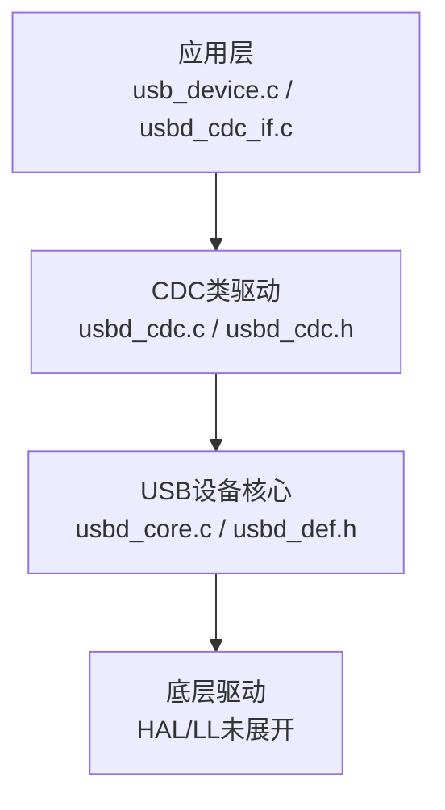
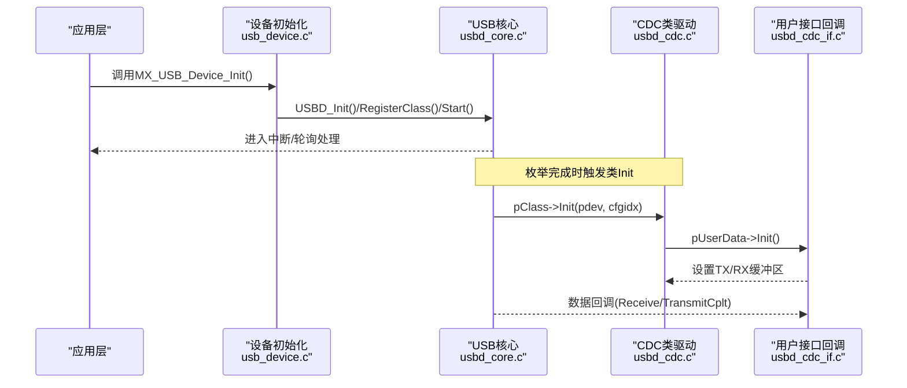
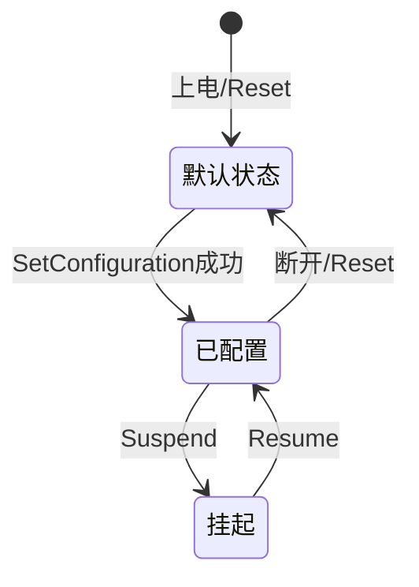
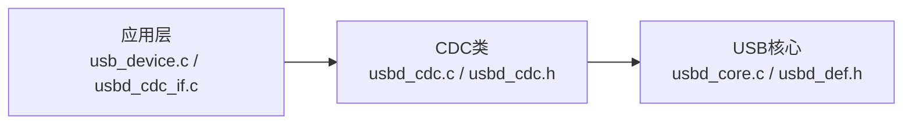
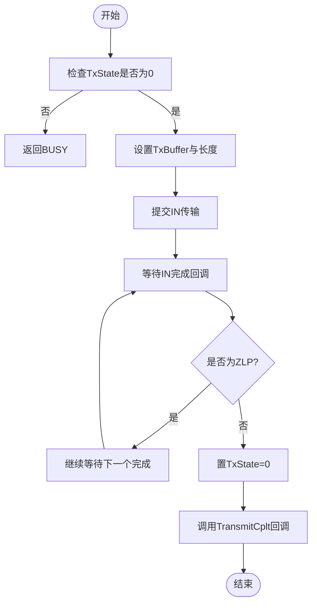
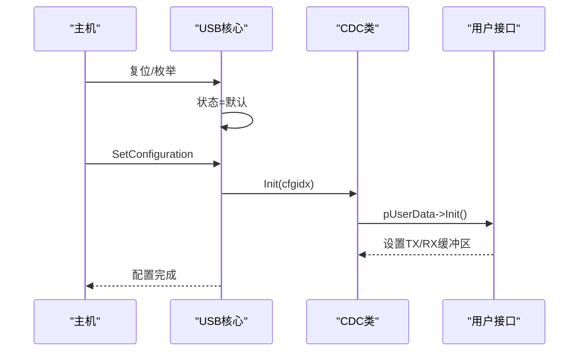

# USB连接状态管理

<cite>
**本文引用的文件**   
- [usbd_def.h](file://Middlewares/ST/STM32_USB_Device_Library/Core/Inc/usbd_def.h)
- [usbd_cdc.h](file://Middlewares/ST/STM32_USB_Device_Library/Class/CDC/Inc/usbd_cdc.h)
- [usbd_cdc.c](file://Middlewares/ST/STM32_USB_Device_Library/Class/CDC/Src/usbd_cdc.c)
- [usbd_core.c](file://Middlewares/ST/STM32_USB_Device_Library/Core/Src/usbd_core.c)
- [usb_device.c](file://USB_Device/App/usb_device.c)
- [usbd_cdc_if.c](file://USB_Device/App/usbd_cdc_if.c)
- [usbd_cdc_if.h](file://USB_Device/App/usbd_cdc_if.h)
</cite>

## 目录
1. [简介](#简介)
2. [项目结构](#项目结构)
3. [核心组件](#核心组件)
4. [架构总览](#架构总览)
5. [详细组件分析](#详细组件分析)
6. [依赖关系分析](#依赖关系分析)
7. [性能与并发考虑](#性能与并发考虑)
8. [故障排查指南](#故障排查指南)
9. [结论](#结论)
10. [附录：关键流程时序图](#附录关键流程时序图)

## 简介
本文件围绕USB CDC设备在STM32G4平台上的连接状态管理机制，系统性说明以下要点：
- USBD_CDC_HandleTypeDef中TxState、RxState等状态标志的含义与更新时机
- USB枚举过程中的状态变化（默认→已寻址→已配置→挂起/恢复）
- 如何检测上位机连接断开与重新连接事件
- 多线程环境下的状态同步与竞态条件处理策略
- 状态恢复与错误处理的完整示例路径指引

## 项目结构
本项目采用分层组织：
- 应用层：USB初始化、CDC接口回调实现
- 类库层：CDC类驱动（数据收发、控制请求）
- 核心层：USB设备核心（枚举、端点、状态机）
- HAL/LL层：底层驱动（不在本文重点范围）

图表来源
- [usb_device.c:66-88](file://USB_Device/App/usb_device.c#L66-L88)
- [usbd_cdc_if.c:138-145](file://USB_Device/App/usbd_cdc_if.c#L138-L145)
- [usbd_cdc.c:140-156](file://Middlewares/ST/STM32_USB_Device_Library/Class/CDC/Src/usbd_cdc.c#L140-L156)
- [usbd_core.c:89-122](file://Middlewares/ST/STM32_USB_Device_Library/Core/Src/usbd_core.c#L89-L122)

章节来源
- [usb_device.c:66-88](file://USB_Device/App/usb_device.c#L66-L88)
- [usbd_cdc_if.c:138-145](file://USB_Device/App/usbd_cdc_if.c#L138-L145)
- [usbd_cdc.c:140-156](file://Middlewares/ST/STM32_USB_Device_Library/Class/CDC/Src/usbd_cdc.c#L140-L156)
- [usbd_core.c:89-122](file://Middlewares/ST/STM32_USB_Device_Library/Core/Src/usbd_core.c#L89-L122)

## 核心组件
- USB设备句柄与状态字段定义：USBD_HandleTypeDef及其dev_state、ep0_state、dev_connection_status等
- CDC类句柄与传输状态：USBD_CDC_HandleTypeDef的TxState、RxState
- CDC类驱动：负责端点打开/关闭、控制请求分发、IN/OUT数据回调
- USB核心：负责枚举阶段状态机、复位/挂起/恢复、连接/断开事件、标准请求处理

章节来源
- [usbd_def.h:285-312](file://Middlewares/ST/STM32_USB_Device_Library/Core/Inc/usbd_def.h#L285-L312)
- [usbd_cdc.h:112-124](file://Middlewares/ST/STM32_USB_Device_Library/Class/CDC/Inc/usbd_cdc.h#L112-L124)
- [usbd_cdc.c:467-542](file://Middlewares/ST/STM32_USB_Device_Library/Class/CDC/Src/usbd_cdc.c#L467-L542)
- [usbd_core.c:490-570](file://Middlewares/ST/STM32_USB_Device_Library/Core/Src/usbd_core.c#L490-L570)

## 架构总览
下图展示了从应用到核心的调用链与状态流转关键点。

图表来源
- [usb_device.c:66-88](file://USB_Device/App/usb_device.c#L66-L88)
- [usbd_core.c:250-261](file://Middlewares/ST/STM32_USB_Device_Library/Core/Src/usbd_core.c#L250-L261)
- [usbd_cdc.c:467-542](file://Middlewares/ST/STM32_USB_Device_Library/Class/CDC/Src/usbd_cdc.c#L467-L542)
- [usbd_cdc_if.c:152-160](file://USB_Device/App/usbd_cdc_if.c#L152-L160)

## 详细组件分析

### 1) USBD_CDC_HandleTypeDef 状态字段详解
- TxState（发送忙标志）
  - 含义：指示当前是否有正在进行的IN传输尚未完成
  - 更新时机：
    - 初始化时置0
    - 当IN传输完成且非ZLP时置0；若为ZLP则继续等待后续完成
    - 上层发起新的发送前需检查该标志，避免重复提交导致BUSY
  - 相关位置：
    - 初始化清零：[usbd_cdc.c:525-526](file://Middlewares/ST/STM32_USB_Device_Library/Class/CDC/Src/usbd_cdc.c#L525-L526)
    - IN完成回调置0：[usbd_cdc.c:713](file://Middlewares/ST/STM32_USB_Device_Library/Class/CDC/Src/usbd_cdc.c#L713)
    - 上层发送前检查：[usbd_cdc_if.c:286-288](file://USB_Device/App/usbd_cdc_if.c#L286-L288)

- RxState（接收忙标志）
  - 含义：指示是否已有OUT数据待处理或正在处理
  - 更新时机：
    - 初始化时置0
    - OUT数据到达后由类驱动回调通知上层处理，并在上层再次准备接收后保持可用
  - 相关位置：
    - 初始化清零：[usbd_cdc.c:525-526](file://Middlewares/ST/STM32_USB_Device_Library/Class/CDC/Src/usbd_cdc.c#L525-L526)
    - OUT回调入口：[usbd_cdc.c:731-749](file://Middlewares/ST/STM32_USB_Device_Library/Class/CDC/Src/usbd_cdc.c#L731-L749)
    - 上层再次准备接收：[usbd_cdc_if.c:264-266](file://USB_Device/App/usbd_cdc_if.c#L264-L266)

- 其他关键字段
  - CmdOpCode/CmdLength：暂存控制请求操作码与长度，用于EP0 RxReady时转发至用户Control回调
  - RxBuffer/TxBuffer/RxLength/TxLength：数据缓冲与长度记录

章节来源
- [usbd_cdc.h:112-124](file://Middlewares/ST/STM32_USB_Device_Library/Class/CDC/Inc/usbd_cdc.h#L112-L124)
- [usbd_cdc.c:525-526](file://Middlewares/ST/STM32_USB_Device_Library/Class/CDC/Src/usbd_cdc.c#L525-L526)
- [usbd_cdc.c:713](file://Middlewares/ST/STM32_USB_Device_Library/Class/CDC/Src/usbd_cdc.c#L713)
- [usbd_cdc.c:731-749](file://Middlewares/ST/STM32_USB_Device_Library/Class/CDC/Src/usbd_cdc.c#L731-L749)
- [usbd_cdc_if.c:264-266](file://USB_Device/App/usbd_cdc_if.c#L264-L266)
- [usbd_cdc_if.c:286-288](file://USB_Device/App/usbd_cdc_if.c#L286-L288)

### 2) USB枚举过程的状态变化
设备状态机定义与转换关键点：
- 初始状态：USBD_STATE_DEFAULT
- Reset事件：回到默认状态，清空配置、远程唤醒等
- SetConfiguration成功：进入USBD_STATE_CONFIGURED，并触发类Init
- Suspend/Resume：保存旧状态并切换至挂起，恢复时还原
- 断开事件：回退至默认状态，释放类资源

图表来源
- [usbd_def.h:142-146](file://Middlewares/ST/STM32_USB_Device_Library/Core/Inc/usbd_def.h#L142-L146)
- [usbd_core.c:490-570](file://Middlewares/ST/STM32_USB_Device_Library/Core/Src/usbd_core.c#L490-L570)
- [usbd_core.c:250-261](file://Middlewares/ST/STM32_USB_Device_Library/Core/Src/usbd_core.c#L250-L261)
- [usbd_core.c:667-678](file://Middlewares/ST/STM32_USB_Device_Library/Core/Src/usbd_core.c#L667-L678)

章节来源
- [usbd_def.h:142-146](file://Middlewares/ST/STM32_USB_Device_Library/Core/Inc/usbd_def.h#L142-L146)
- [usbd_core.c:490-570](file://Middlewares/ST/STM32_USB_Device_Library/Core/Src/usbd_core.c#L490-L570)
- [usbd_core.c:250-261](file://Middlewares/ST/STM32_USB_Device_Library/Core/Src/usbd_core.c#L250-L261)
- [usbd_core.c:667-678](file://Middlewares/ST/STM32_USB_Device_Library/Core/Src/usbd_core.c#L667-L678)

### 3) 连接状态监控：检测断开与重连
- 断开事件
  - 核心层在检测到断开时将设备状态重置为默认，并调用类的DeInit释放资源
  - 应用可在DeInit回调中清理状态、停止任务或提示上层
  - 参考：[usbd_core.c:667-678](file://Middlewares/ST/STM32_USB_Device_Library/Core/Src/usbd_core.c#L667-L678)

- 重连事件
  - 重新枚举完成后会再次进入SetConfiguration，触发类Init
  - 应用可在类Init中重新分配缓冲区、启动接收等
  - 参考：[usbd_core.c:250-261](file://Middlewares/ST/STM32_USB_Device_Library/Core/Src/usbd_core.c#L250-L261)、[usbd_cdc.c:467-542](file://Middlewares/ST/STM32_USB_Device_Library/Class/CDC/Src/usbd_cdc.c#L467-L542)

- 连接状态字段
  - dev_connection_status：可用于快速判断物理链路状态（具体更新逻辑由底层驱动维护）
  - 参考：[usbd_def.h:285-312](file://Middlewares/ST/STM32_USB_Device_Library/Core/Inc/usbd_def.h#L285-L312)

章节来源
- [usbd_core.c:667-678](file://Middlewares/ST/STM32_USB_Device_Library/Core/Src/usbd_core.c#L667-L678)
- [usbd_core.c:250-261](file://Middlewares/ST/STM32_USB_Device_Library/Core/Src/usbd_core.c#L250-L261)
- [usbd_cdc.c:467-542](file://Middlewares/ST/STM32_USB_Device_Library/Class/CDC/Src/usbd_cdc.c#L467-L542)
- [usbd_def.h:285-312](file://Middlewares/ST/STM32_USB_Device_Library/Core/Inc/usbd_def.h#L285-L312)

### 4) 状态同步机制与竞态条件处理
- 原子性与易失性
  - TxState/RxState使用__IO修饰，表明可能被中断上下文修改，读取时应注意一致性
  - 建议：在访问这些标志时屏蔽中断或使用临界区保护，避免读-改-写竞争
- 发送流程竞态防护
  - 在发起发送前检查TxState是否为0，否则返回BUSY
  - 参考：[usbd_cdc_if.c:286-288](file://USB_Device/App/usbd_cdc_if.c#L286-L288)
- 接收流程再入防护
  - OUT回调中尽快将数据交给上层，并在上层再次准备接收，防止NAK堆积
  - 参考：[usbd_cdc.c:731-749](file://Middlewares/ST/STM32_USB_Device_Library/Class/CDC/Src/usbd_cdc.c#L731-L749)、[usbd_cdc_if.c:264-266](file://USB_Device/App/usbd_cdc_if.c#L264-L266)
- ZLP处理与IN完成
  - 当发送长度为包大小整数倍时，需要发送零长度包以结束事务；此时不立即置TxState=0，直到最后一个数据包完成
  - 参考：[usbd_cdc.c:702-722](file://Middlewares/ST/STM32_USB_Device_Library/Class/CDC/Src/usbd_cdc.c#L702-L722)

章节来源
- [usbd_cdc.h:112-124](file://Middlewares/ST/STM32_USB_Device_Library/Class/CDC/Inc/usbd_cdc.h#L112-L124)
- [usbd_cdc_if.c:286-288](file://USB_Device/App/usbd_cdc_if.c#L286-L288)
- [usbd_cdc.c:702-722](file://Middlewares/ST/STM32_USB_Device_Library/Class/CDC/Src/usbd_cdc.c#L702-L722)
- [usbd_cdc.c:731-749](file://Middlewares/ST/STM32_USB_Device_Library/Class/CDC/Src/usbd_cdc.c#L731-L749)
- [usbd_cdc_if.c:264-266](file://USB_Device/App/usbd_cdc_if.c#L264-L266)

### 5) 状态恢复与错误处理示例路径
- 复位后的恢复
  - Reset回调中将设备状态置为默认，并调用类DeInit；应用应在DeInit中清理资源
  - 参考：[usbd_core.c:490-524](file://Middlewares/ST/STM32_USB_Device_Library/Core/Src/usbd_core.c#L490-L524)
- 断开后的恢复
  - 断开回调中将设备状态置为默认，并调用类DeInit；应用应在此处停止任务、释放缓冲区
  - 参考：[usbd_core.c:667-678](file://Middlewares/ST/STM32_USB_Device_Library/Core/Src/usbd_core.c#L667-L678)
- 配置变更与错误
  - 标准请求处理中，对非配置状态下的SET_INTERFACE等请求返回错误
  - 参考：[usbd_cdc.c:656-671](file://Middlewares/ST/STM32_USB_Device_Library/Class/CDC/Src/usbd_cdc.c#L656-L671)
- 发送失败与重试
  - 若TxState不为0，返回BUSY；应用可延迟重试或队列化发送
  - 参考：[usbd_cdc_if.c:286-288](file://USB_Device/App/usbd_cdc_if.c#L286-L288)

章节来源
- [usbd_core.c:490-524](file://Middlewares/ST/STM32_USB_Device_Library/Core/Src/usbd_core.c#L490-L524)
- [usbd_core.c:667-678](file://Middlewares/ST/STM32_USB_Device_Library/Core/Src/usbd_core.c#L667-L678)
- [usbd_cdc.c:656-671](file://Middlewares/ST/STM32_USB_Device_Library/Class/CDC/Src/usbd_cdc.c#L656-L671)
- [usbd_cdc_if.c:286-288](file://USB_Device/App/usbd_cdc_if.c#L286-L288)

## 依赖关系分析
- 应用层依赖CDC类接口（注册接口、设置缓冲区、发送/接收）
- CDC类依赖USB核心提供的端点操作与状态机
- 核心层依赖底层驱动（HAL/LL）提供中断与端点操作

图表来源
- [usb_device.c:66-88](file://USB_Device/App/usb_device.c#L66-L88)
- [usbd_cdc_if.c:138-145](file://USB_Device/App/usbd_cdc_if.c#L138-L145)
- [usbd_cdc.c:140-156](file://Middlewares/ST/STM32_USB_Device_Library/Class/CDC/Src/usbd_cdc.c#L140-L156)
- [usbd_core.c:89-122](file://Middlewares/ST/STM32_USB_Device_Library/Core/Src/usbd_core.c#L89-L122)

章节来源
- [usb_device.c:66-88](file://USB_Device/App/usb_device.c#L66-L88)
- [usbd_cdc_if.c:138-145](file://USB_Device/App/usbd_cdc_if.c#L138-L145)
- [usbd_cdc.c:140-156](file://Middlewares/ST/STM32_USB_Device_Library/Class/CDC/Src/usbd_cdc.c#L140-L156)
- [usbd_core.c:89-122](file://Middlewares/ST/STM32_USB_Device_Library/Core/Src/usbd_core.c#L89-L122)

## 性能与并发考虑
- 发送吞吐优化
  - 合理设置最大包大小与批量发送，减少ZLP次数
  - 在上层实现环形缓冲与批处理，降低频繁提交开销
- 接收处理时效
  - OUT回调中尽量短小，尽快将数据拷贝到应用缓冲并再次准备接收
- 并发安全
  - 对共享状态（如TxState/RxState）加临界区保护
  - 避免在中断上下文中执行耗时操作

## 故障排查指南
- 现象：发送一直返回BUSY
  - 检查TxState是否被正确置0（IN完成回调）
  - 确认是否存在ZLP导致的延迟完成
  - 参考：[usbd_cdc.c:702-722](file://Middlewares/ST/STM32_USB_Device_Library/Class/CDC/Src/usbd_cdc.c#L702-L722)、[usbd_cdc_if.c:286-288](file://USB_Device/App/usbd_cdc_if.c#L286-L288)
- 现象：上位机断开后无法重连
  - 检查断开回调是否调用了类DeInit
  - 检查重连后类Init是否重新设置了缓冲区并启动接收
  - 参考：[usbd_core.c:667-678](file://Middlewares/ST/STM32_USB_Device_Library/Core/Src/usbd_core.c#L667-L678)、[usbd_cdc.c:467-542](file://Middlewares/ST/STM32_USB_Device_Library/Class/CDC/Src/usbd_cdc.c#L467-L542)
- 现象：控制请求无响应
  - 检查EP0 RxReady是否正确转发至用户Control回调
  - 参考：[usbd_cdc.c:757-775](file://Middlewares/ST/STM32_USB_Device_Library/Class/CDC/Src/usbd_cdc.c#L757-L775)

章节来源
- [usbd_cdc.c:702-722](file://Middlewares/ST/STM32_USB_Device_Library/Class/CDC/Src/usbd_cdc.c#L702-L722)
- [usbd_cdc_if.c:286-288](file://USB_Device/App/usbd_cdc_if.c#L286-L288)
- [usbd_core.c:667-678](file://Middlewares/ST/STM32_USB_Device_Library/Core/Src/usbd_core.c#L667-L678)
- [usbd_cdc.c:467-542](file://Middlewares/ST/STM32_USB_Device_Library/Class/CDC/Src/usbd_cdc.c#L467-L542)
- [usbd_cdc.c:757-775](file://Middlewares/ST/STM32_USB_Device_Library/Class/CDC/Src/usbd_cdc.c#L757-L775)

## 结论
通过明确USBD_CDC_HandleTypeDef的TxState/RxState语义与更新时机，结合USB核心的状态机与事件回调，可以在STM32G4平台上构建稳定可靠的CDC通信栈。关键在于：
- 严格遵循枚举状态机，确保类Init/DeInit的正确调用
- 在发送/接收路径中对共享状态进行临界区保护
- 正确处理ZLP与IN完成回调，避免误判发送完成
- 在断开/复位事件中彻底清理资源，保证重连后可恢复

## 附录：关键流程时序图

### 发送流程（含ZLP处理）

图表来源
- [usbd_cdc.c:702-722](file://Middlewares/ST/STM32_USB_Device_Library/Class/CDC/Src/usbd_cdc.c#L702-L722)
- [usbd_cdc_if.c:286-288](file://USB_Device/App/usbd_cdc_if.c#L286-L288)

### 枚举与配置流程

图表来源
- [usbd_core.c:250-261](file://Middlewares/ST/STM32_USB_Device_Library/Core/Src/usbd_core.c#L250-L261)
- [usbd_cdc.c:467-542](file://Middlewares/ST/STM32_USB_Device_Library/Class/CDC/Src/usbd_cdc.c#L467-L542)
- [usbd_cdc_if.c:152-160](file://USB_Device/App/usbd_cdc_if.c#L152-L160)