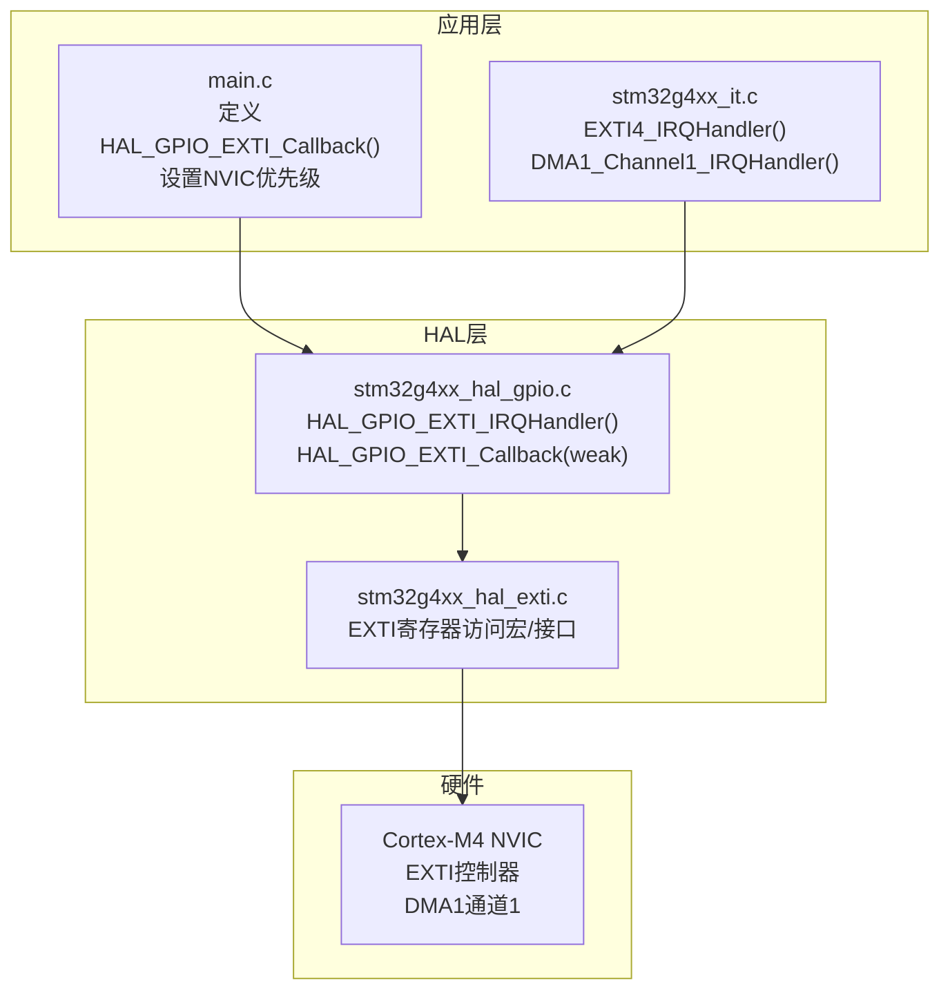
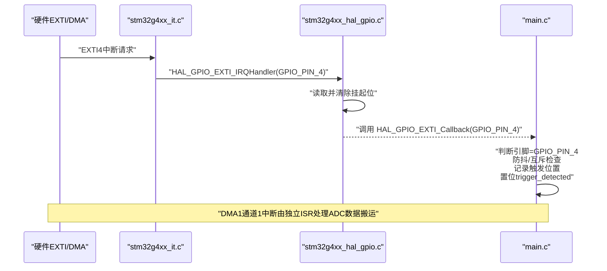
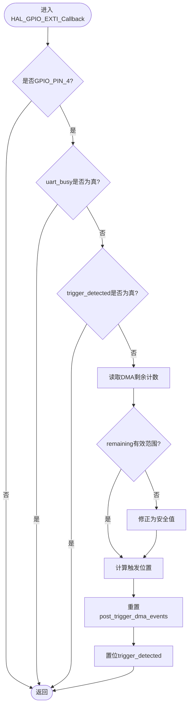
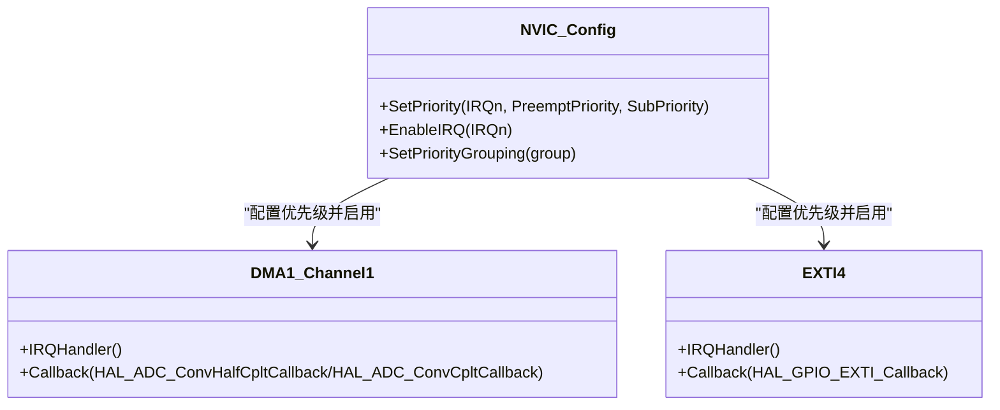
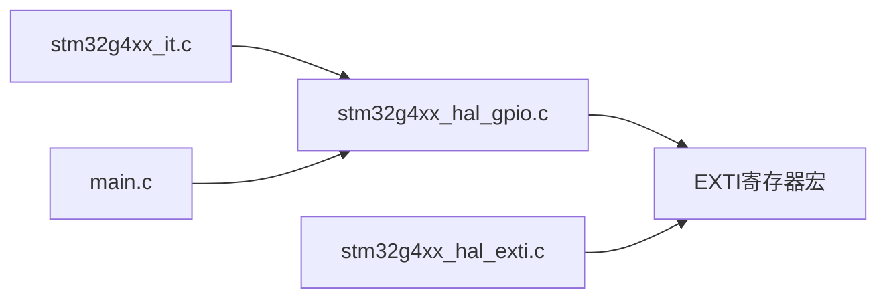

# 中断处理API

<cite>
**本文引用的文件**
- [Core/Src/stm32g4xx_it.c](file://Core/Src/stm32g4xx_it.c)
- [Core/Inc/stm32g4xx_it.h](file://Core/Inc/stm32g4xx_it.h)
- [Core/Src/main.c](file://Core/Src/main.c)
- [Core/Inc/main.h](file://Core/Inc/main.h)
- [Drivers/STM32G4xx_HAL_Driver/Inc/stm32g4xx_hal_gpio.h](file://Drivers/STM32G4xx_HAL_Driver/Inc/stm32g4xx_hal_gpio.h)
- [Drivers/STM32G4xx_HAL_Driver/Src/stm32g4xx_hal_gpio.c](file://Drivers/STM32G4xx_HAL_Driver/Src/stm32g4xx_hal_gpio.c)
- [Drivers/STM32G4xx_HAL_Driver/Inc/stm32g4xx_hal_exti.h](file://Drivers/STM32G4xx_HAL_Driver/Inc/stm32g4xx_hal_exti.h)
- [Drivers/STM32G4xx_HAL_Driver/Src/stm32g4xx_hal_exti.c](file://Drivers/STM32G4xx_HAL_Driver/Src/stm32g4xx_hal_exti.c)
</cite>

## 目录
1. [简介](#简介)
2. [项目结构](#项目结构)
3. [核心组件](#核心组件)
4. [架构总览](#架构总览)
5. [详细组件分析](#详细组件分析)
6. [依赖关系分析](#依赖关系分析)
7. [性能与实时性](#性能与实时性)
8. [故障排查指南](#故障排查指南)
9. [结论](#结论)

## 简介
本文件为中断处理系统的API参考文档，聚焦于外部中断回调 HAL_GPIO_EXTI_Callback() 的实现细节、GPIO_PIN_4 的上升沿触发检测与防抖策略、NVIC 优先级配置（EXTI4_IRQn 与 DMA1_Channel1_IRQn）、中断服务程序执行上下文限制与实时性要求、uart_busy 标志位的互斥保护机制、中断嵌套与原子操作最佳实践，以及中断延迟分析与性能优化技巧。

## 项目结构
本项目基于 STM32G4 HAL 库，中断相关代码主要分布在：
- 应用层中断入口与回调：Core/Src/stm32g4xx_it.c、Core/Src/main.c
- HAL GPIO/EXTI 驱动：Drivers/STM32G4xx_HAL_Driver/Src/stm32g4xx_hal_gpio.c、stm32g4xx_hal_exti.c
- 头文件声明：Core/Inc/stm32g4xx_it.h、Core/Inc/main.h、Drivers/STM32G4xx_HAL_Driver/Inc/*.h

图表来源
- [Core/Src/main.c:470-520](file://Core/Src/main.c#L470-L520)
- [Core/Src/stm32g4xx_it.c:200-230](file://Core/Src/stm32g4xx_it.c#L200-L230)
- [Drivers/STM32G4xx_HAL_Driver/Src/stm32g4xx_hal_gpio.c:486-514](file://Drivers/STM32G4xx_HAL_Driver/Src/stm32g4xx_hal_gpio.c#L486-L514)
- [Drivers/STM32G4xx_HAL_Driver/Inc/stm32g4xx_hal_exti.h:145-154](file://Drivers/STM32G4xx_HAL_Driver/Inc/stm32g4xx_hal_exti.h#L145-L154)

章节来源
- [Core/Src/stm32g4xx_it.c:200-230](file://Core/Src/stm32g4xx_it.c#L200-L230)
- [Core/Src/main.c:470-520](file://Core/Src/main.c#L470-L520)
- [Drivers/STM32G4xx_HAL_Driver/Src/stm32g4xx_hal_gpio.c:486-514](file://Drivers/STM32G4xx_HAL_Driver/Src/stm32g4xx_hal_gpio.c#L486-L514)
- [Drivers/STM32G4xx_HAL_Driver/Inc/stm32g4xx_hal_exti.h:145-154](file://Drivers/STM32G4xx_HAL_Driver/Inc/stm32g4xx_hal_exti.h#L145-L154)

## 核心组件
- EXTI4 中断入口：在 stm32g4xx_it.c 中实现，调用 HAL_GPIO_EXTI_IRQHandler(GPIO_PIN_4)。
- HAL GPIO 中断处理：在 stm32g4xx_hal_gpio.c 中实现，检查并清除挂起位后调用弱函数 HAL_GPIO_EXTI_Callback()。
- 用户回调：在 main.c 中实现 HAL_GPIO_EXTI_Callback(uint16_t GPIO_Pin)，完成触发时刻采样、状态标记与防抖逻辑。
- DMA1 通道1中断：在 stm32g4xx_it.c 中实现，调用 HAL_DMA_IRQHandler(&hdma_adc1)，用于ADC数据搬运与半满/完成回调。
- NVIC 优先级：在 main.c 中通过 HAL_NVIC_SetPriority() 和 HAL_NVIC_EnableIRQ() 配置 EXTI4_IRQn 与 DMA1_Channel1_IRQn。

章节来源
- [Core/Src/stm32g4xx_it.c:200-230](file://Core/Src/stm32g4xx_it.c#L200-L230)
- [Drivers/STM32G4xx_HAL_Driver/Src/stm32g4xx_hal_gpio.c:486-514](file://Drivers/STM32G4xx_HAL_Driver/Src/stm32g4xx_hal_gpio.c#L486-L514)
- [Core/Src/main.c:90-113](file://Core/Src/main.c#L90-L113)
- [Core/Src/main.c:470-520](file://Core/Src/main.c#L470-L520)

## 架构总览
下图展示了从硬件边沿到应用回调的完整路径，包括中断入口、HAL 层处理与用户回调。

图表来源
- [Core/Src/stm32g4xx_it.c:200-230](file://Core/Src/stm32g4xx_it.c#L200-L230)
- [Drivers/STM32G4xx_HAL_Driver/Src/stm32g4xx_hal_gpio.c:486-514](file://Drivers/STM32G4xx_HAL_Driver/Src/stm32g4xx_hal_gpio.c#L486-L514)
- [Core/Src/main.c:90-113](file://Core/Src/main.c#L90-L113)

## 详细组件分析

### HAL_GPIO_EXTI_Callback() 外部中断回调
- 触发条件：GPIOA 的 PIN4 配置为上升沿中断模式，当检测到上升沿时进入 EXTI4_IRQHandler，最终调用 HAL_GPIO_EXTI_Callback(GPIO_PIN_4)。
- 引脚识别：回调内部对 GPIO_Pin 进行判断，仅处理 GPIO_PIN_4。
- 防抖与重入保护：
  - 使用 uart_busy 标志位屏蔽UART传输期间的误触发。
  - 使用 trigger_detected 标志位防止同一事件重复触发。
- 触发时刻定位：
  - 通过 __HAL_DMA_GET_COUNTER(&hdma_adc1) 获取剩余计数，结合环形缓冲区大小计算触发点在缓冲中的索引。
  - 对 remaining==0 或越界情况进行边界保护，避免NDTR重载瞬态导致的错误索引。
- 状态更新：
  - 重置 post_trigger_dma_events 计数器。
  - 置位 trigger_detected 以通知主循环准备数据处理。

图表来源
- [Core/Src/main.c:90-113](file://Core/Src/main.c#L90-L113)

章节来源
- [Core/Src/main.c:90-113](file://Core/Src/main.c#L90-L113)
- [Drivers/STM32G4xx_HAL_Driver/Src/stm32g4xx_hal_gpio.c:486-514](file://Drivers/STM32G4xx_HAL_Driver/Src/stm32g4xx_hal_gpio.c#L486-L514)

### GPIO_PIN_4 上升沿触发检测与防抖机制
- 引脚配置：在 MX_GPIO_Init() 中将 PA4 配置为 GPIO_MODE_IT_RISING，无上下拉。
- 触发检测：EXTI 硬件根据上升沿产生中断请求；HAL 层在 IRQHandler 中清除挂起位后调用用户回调。
- 防抖策略：
  - 软件层面通过 uart_busy 与 trigger_detected 双重门控，避免在数据传输期间或同一事件内重复处理。
  - 未使用硬件去抖或延时消抖，而是采用“首次触发+互斥”的策略保证单次可靠响应。

章节来源
- [Core/Src/main.c:488-520](file://Core/Src/main.c#L488-L520)
- [Core/Src/main.c:90-113](file://Core/Src/main.c#L90-L113)
- [Drivers/STM32G4xx_HAL_Driver/Inc/stm32g4xx_hal_gpio.h:124-130](file://Drivers/STM32G4xx_HAL_Driver/Inc/stm32g4xx_hal_gpio.h#L124-L130)

### 中断优先级配置（EXTI4_IRQn 与 DMA1_Channel1_IRQn）
- 优先级设置：
  - DMA1_Channel1_IRQn：在 MX_DMA_Init() 中通过 HAL_NVIC_SetPriority(DMA1_Channel1_IRQn, 0, 0) 设置为抢占优先级0、子优先级0。
  - EXTI4_IRQn：在 MX_GPIO_Init() 中通过 HAL_NVIC_SetPriority(EXTI4_IRQn, 0, 0) 设置为抢占优先级0、子优先级0。
- 中断使能：
  - 两者均通过 HAL_NVIC_EnableIRQ() 启用。
- 优先级分组：
  - HAL 初始化时默认设置优先级分组为 NVIC_PRIORITYGROUP_4（见 HAL 初始化流程），因此上述两个中断均为最高优先级级别。

图表来源
- [Core/Src/main.c:470-520](file://Core/Src/main.c#L470-L520)
- [Drivers/STM32G4xx_HAL_Driver/Src/stm32g4xx_hal.c:160-170](file://Drivers/STM32G4xx_HAL_Driver/Src/stm32g4xx_hal.c#L160-L170)

章节来源
- [Core/Src/main.c:470-520](file://Core/Src/main.c#L470-L520)
- [Drivers/STM32G4xx_HAL_Driver/Src/stm32g4xx_hal.c:160-170](file://Drivers/STM32G4xx_HAL_Driver/Src/stm32g4xx_hal.c#L160-L170)

### 中断服务程序的执行上下文限制与实时性要求
- EXTI4 ISR 上下文：
  - 入口为 EXTI4_IRQHandler()，仅做最小化转发至 HAL_GPIO_EXTI_IRQHandler()，随后进入用户回调。
  - 用户回调 HAL_GPIO_EXTI_Callback() 必须保持极短的执行时间，避免阻塞高优先级任务。
- DMA1 Channel1 ISR 上下文：
  - 入口为 DMA1_Channel1_IRQHandler()，调用 HAL_DMA_IRQHandler()，进而触发 ADC 半满/完成回调。
  - 这些回调同样应在 ISR 上下文中快速完成，仅做必要的数据搬运与状态更新。
- 实时性要求：
  - 由于 EXTI4 与 DMA1 均为最高优先级，任何在回调中的耗时操作都会影响系统实时性。
  - 建议将耗时任务（如USB CDC发送）移至主循环，并通过标志位协调。

章节来源
- [Core/Src/stm32g4xx_it.c:200-230](file://Core/Src/stm32g4xx_it.c#L200-L230)
- [Core/Src/main.c:90-113](file://Core/Src/main.c#L90-L113)
- [Core/Src/main.c:136-149](file://Core/Src/main.c#L136-L149)

### uart_busy 标志位的互斥保护机制
- 目的：防止在 UART（USB CDC）传输期间误触发 EXTI4，导致数据竞争或不一致。
- 机制：
  - 主循环在处理数据前设置 uart_busy = 1，并在发送完成后清零。
  - EXTI4 回调在进入后立即检查 uart_busy，若为真则直接返回，忽略本次触发。
- 效果：
  - 确保在传输期间不会因外部信号变化而干扰当前处理流程。
  - 与 trigger_detected 配合，形成“互斥+防重入”的双重保护。

章节来源
- [Core/Src/main.c:65-70](file://Core/Src/main.c#L65-L70)
- [Core/Src/main.c:90-113](file://Core/Src/main.c#L90-L113)
- [Core/Src/main.c:264-289](file://Core/Src/main.c#L264-L289)

### 中断嵌套处理与原子操作最佳实践
- 中断嵌套：
  - EXTI4 与 DMA1 均为最高优先级，理论上可相互嵌套。但为避免复杂性与抖动，建议在回调中不主动开启新的中断源。
- 原子操作：
  - 共享变量（如 trigger_pos、trigger_detected、data_ready、uart_busy）在 ISR 与主循环之间读写，需保证原子性。
  - 在主循环中先快照 trigger_pos 并立即清零相关标志，关闭原子性窗口，再执行耗时任务。
- 推荐做法：
  - 在回调中只进行最小化的状态更新与快照保存。
  - 在主循环中集中处理耗时逻辑，并使用 volatile 修饰共享变量。

章节来源
- [Core/Src/main.c:264-289](file://Core/Src/main.c#L264-L289)
- [Core/Src/main.c:65-70](file://Core/Src/main.c#L65-L70)

### 中断延迟分析与性能优化技巧
- 中断路径延迟：
  - EXTI4 → HAL_GPIO_EXTI_IRQHandler → HAL_GPIO_EXTI_Callback，路径短且轻量，适合高频触发场景。
  - DMA1 Channel1 → HAL_DMA_IRQHandler → ADC 回调，负责数据搬运与状态推进，应尽量减少额外开销。
- 优化建议：
  - 在回调中使用局部变量与内联函数减少栈操作。
  - 避免在回调中进行浮点运算、内存分配或阻塞式IO。
  - 使用环形缓冲与快照技术降低数据竞争风险。
  - 合理设置 NVIC 优先级分组与具体优先级，确保关键路径不被低优先级中断打断。

章节来源
- [Core/Src/main.c:90-113](file://Core/Src/main.c#L90-L113)
- [Core/Src/main.c:136-149](file://Core/Src/main.c#L136-L149)
- [Core/Src/main.c:470-520](file://Core/Src/main.c#L470-L520)

## 依赖关系分析
- 应用层依赖 HAL 层：
  - stm32g4xx_it.c 依赖 stm32g4xx_hal_gpio.c 提供的 HAL_GPIO_EXTI_IRQHandler()。
  - main.c 提供 HAL_GPIO_EXTI_Callback() 的具体实现。
- HAL 层依赖底层寄存器：
  - stm32g4xx_hal_gpio.c 使用 __HAL_GPIO_EXTI_GET_IT/CLEAR_IT 等宏访问 EXTI 寄存器。
  - stm32g4xx_hal_exti.c 提供 EXTI 配置与查询接口。

图表来源
- [Core/Src/stm32g4xx_it.c:200-230](file://Core/Src/stm32g4xx_it.c#L200-L230)
- [Drivers/STM32G4xx_HAL_Driver/Src/stm32g4xx_hal_gpio.c:486-514](file://Drivers/STM32G4xx_HAL_Driver/Src/stm32g4xx_hal_gpio.c#L486-L514)
- [Drivers/STM32G4xx_HAL_Driver/Inc/stm32g4xx_hal_exti.h:145-154](file://Drivers/STM32G4xx_HAL_Driver/Inc/stm32g4xx_hal_exti.h#L145-L154)

章节来源
- [Core/Src/stm32g4xx_it.c:200-230](file://Core/Src/stm32g4xx_it.c#L200-L230)
- [Drivers/STM32G4xx_HAL_Driver/Src/stm32g4xx_hal_gpio.c:486-514](file://Drivers/STM32G4xx_HAL_Driver/Src/stm32g4xx_hal_gpio.c#L486-L514)
- [Drivers/STM32G4xx_HAL_Driver/Inc/stm32g4xx_hal_exti.h:145-154](file://Drivers/STM32G4xx_HAL_Driver/Inc/stm32g4xx_hal_exti.h#L145-L154)

## 性能与实时性
- 中断路径应尽量短小，避免在回调中进行阻塞或复杂计算。
- 使用 DMA 与环形缓冲降低 CPU 负载，提高吞吐能力。
- 合理设置 NVIC 优先级，确保关键中断不被低优先级任务打断。
- 在主循环中集中处理耗时任务，并通过标志位与 ISR 协作。

[本节为通用指导，无需特定文件引用]

## 故障排查指南
- 现象：多次触发或漏触发
  - 检查 uart_busy 与 trigger_detected 的状态流转是否正确。
  - 确认 EXTI 挂起位是否在 HAL 层被正确清除。
- 现象：数据错位或时序异常
  - 验证 trigger_pos 快照与 Unpack_Ultrasound_Timeline 的起始索引计算。
  - 检查 DMA 剩余计数与环形缓冲区大小的边界保护。
- 现象：系统卡顿或实时性下降
  - 审查回调中是否存在耗时操作（如CDC发送）。
  - 调整 NVIC 优先级分组与具体优先级，确保关键路径优先。

章节来源
- [Core/Src/main.c:90-113](file://Core/Src/main.c#L90-L113)
- [Core/Src/main.c:156-171](file://Core/Src/main.c#L156-L171)
- [Core/Src/main.c:264-289](file://Core/Src/main.c#L264-L289)

## 结论
本项目的中断处理系统通过简洁的 HAL 层封装与用户回调实现了可靠的 EXTI4 上升沿检测与防抖策略。借助 DMA 与环形缓冲，系统在高频数据采集场景下具备良好的实时性与稳定性。合理的 NVIC 优先级配置与互斥保护机制进一步提升了系统的鲁棒性。遵循本文档的最佳实践与优化建议，可在实际应用中获得更优的性能表现。

[本节为总结性内容，无需特定文件引用]