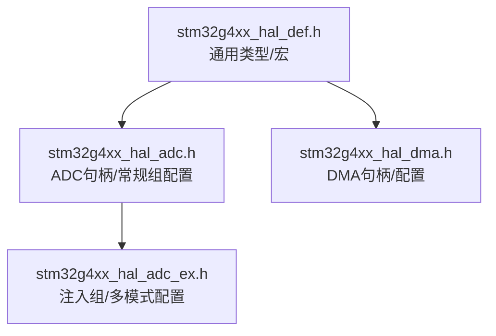
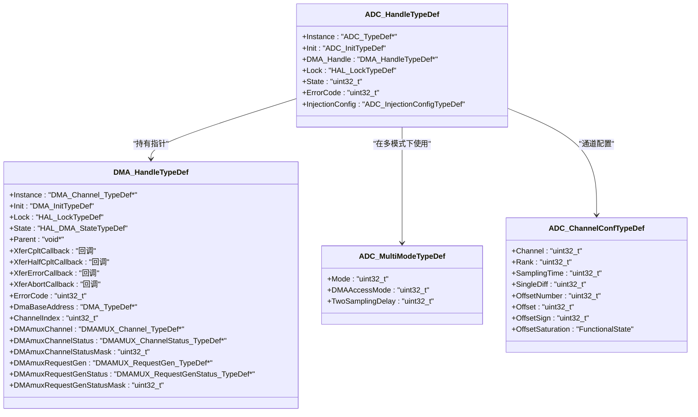
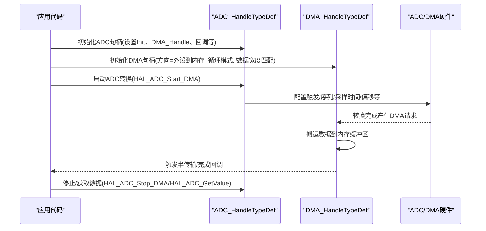
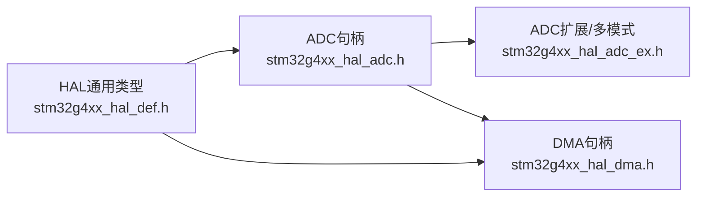

# 数据结构定义

<cite>
**本文引用的文件**   
- [stm32g4xx_hal_adc.h](file://Drivers/STM32G4xx_HAL_Driver/Inc/stm32g4xx_hal_adc.h)
- [stm32g4xx_hal_adc_ex.h](file://Drivers/STM32G4xx_HAL_Driver/Inc/stm32g4xx_hal_adc_ex.h)
- [stm32g4xx_hal_dma.h](file://Drivers/STM32G4xx_HAL_Driver/Inc/stm32g4xx_hal_dma.h)
- [stm32g4xx_hal_def.h](file://Drivers/STM32G4xx_HAL_Driver/Inc/stm32g4xx_hal_def.h)
</cite>

## 目录
1. [简介](#简介)
2. [项目结构](#项目结构)
3. [核心组件](#核心组件)
4. [架构总览](#架构总览)
5. [详细组件分析](#详细组件分析)
6. [依赖关系分析](#依赖关系分析)
7. [性能与内存布局](#性能与内存布局)
8. [故障排查指南](#故障排查指南)
9. [结论](#结论)

## 简介
本参考文档聚焦于STM32G4 HAL驱动中ADC与DMA相关的关键数据结构，系统性说明以下结构体的成员、作用与配置要点：
- ADC_HandleTypeDef：ADC句柄，包含实例指针、初始化参数、DMA句柄、锁定对象、状态与错误码等。
- DMA_HandleTypeDef：DMA句柄，包含实例指针、初始化参数、锁定对象、状态、回调与错误码等。
- ADC_MultiModeTypeDef：多模式配置（双ADC同时/交错/交替触发等），含模式选择、DMA访问模式、两次采样延迟等。
- ADC_ChannelConfTypeDef：常规组通道配置，含单端/差分输入、采样时间、偏移校准等。

文档还给出结构体间的依赖关系图、典型调用时序图，以及内存布局与对齐建议。

## 项目结构
与本次文档相关的头文件位于HAL驱动层，主要涉及：
- ADC HAL主接口：stm32g4xx_hal_adc.h
- ADC扩展功能（注入组、多模式）：stm32g4xx_hal_adc_ex.h
- DMA HAL接口：stm32g4xx_hal_dma.h
- HAL通用类型与宏：stm32g4xx_hal_def.h

图表来源
- [stm32g4xx_hal_def.h:1-212](file://Drivers/STM32G4xx_HAL_Driver/Inc/stm32g4xx_hal_def.h#L1-L212)
- [stm32g4xx_hal_adc.h:1-800](file://Drivers/STM32G4xx_HAL_Driver/Inc/stm32g4xx_hal_adc.h#L1-L800)
- [stm32g4xx_hal_adc_ex.h:1-800](file://Drivers/STM32G4xx_HAL_Driver/Inc/stm32g4xx_hal_adc_ex.h#L1-L800)
- [stm32g4xx_hal_dma.h:1-800](file://Drivers/STM32G4xx_HAL_Driver/Inc/stm32g4xx_hal_dma.h#L1-L800)

章节来源
- [stm32g4xx_hal_def.h:1-212](file://Drivers/STM32G4xx_HAL_Driver/Inc/stm32g4xx_hal_def.h#L1-L212)
- [stm32g4xx_hal_adc.h:1-800](file://Drivers/STM32G4xx_HAL_Driver/Inc/stm32g4xx_hal_adc.h#L1-L800)
- [stm32g4xx_hal_adc_ex.h:1-800](file://Drivers/STM32G4xx_HAL_Driver/Inc/stm32g4xx_hal_adc_ex.h#L1-L800)
- [stm32g4xx_hal_dma.h:1-800](file://Drivers/STM32G4xx_HAL_Driver/Inc/stm32g4xx_hal_dma.h#L1-L800)

## 核心组件
本节概述各关键结构体的职责与成员分组，便于快速定位与理解。

- ADC_HandleTypeDef：封装单个ADC外设的运行时上下文，包括寄存器基址指针、ADC_InitTypeDef初始化参数、DMA_HandleTypeDef指针、Lock锁定对象、State状态位图、ErrorCode错误码、注入组上下文构建结构等。
- DMA_HandleTypeDef：封装DMA通道的运行时上下文，包括通道寄存器基址指针、DMA_InitTypeDef初始化参数、Lock、State、Parent父对象指针、各类回调函数指针、ErrorCode、DMA控制器基地址、通道索引、DMAMUX相关指针与掩码等。
- ADC_MultiModeTypeDef：用于双ADC或多ADC协同工作时的模式配置，包含Mode（独立/同时/交错/交替）、DMAAccessMode（DMA共享或各自）、TwoSamplingDelay（两次采样间隔）。
- ADC_ChannelConfTypeDef：常规组通道级配置，包含Channel、Rank、SamplingTime、SingleDiff（单端/差分）、OffsetNumber、Offset、OffsetSign、OffsetSaturation等。

章节来源
- [stm32g4xx_hal_adc.h:486-517](file://Drivers/STM32G4xx_HAL_Driver/Inc/stm32g4xx_hal_adc.h#L486-L517)
- [stm32g4xx_hal_dma.h:113-151](file://Drivers/STM32G4xx_HAL_Driver/Inc/stm32g4xx_hal_dma.h#L113-L151)
- [stm32g4xx_hal_adc_ex.h:259-275](file://Drivers/STM32G4xx_HAL_Driver/Inc/stm32g4xx_hal_adc_ex.h#L259-L275)
- [stm32g4xx_hal_adc.h:267-338](file://Drivers/STM32G4xx_HAL_Driver/Inc/stm32g4xx_hal_adc.h#L267-L338)

## 架构总览
下图展示ADC句柄与DMA句柄之间的关联，以及多模式配置在双ADC场景下的使用位置。

图表来源
- [stm32g4xx_hal_adc.h:486-517](file://Drivers/STM32G4xx_HAL_Driver/Inc/stm32g4xx_hal_adc.h#L486-L517)
- [stm32g4xx_hal_dma.h:113-151](file://Drivers/STM32G4xx_HAL_Driver/Inc/stm32g4xx_hal_dma.h#L113-L151)
- [stm32g4xx_hal_adc_ex.h:259-275](file://Drivers/STM32G4xx_HAL_Driver/Inc/stm32g4xx_hal_adc_ex.h#L259-L275)
- [stm32g4xx_hal_adc.h:267-338](file://Drivers/STM32G4xx_HAL_Driver/Inc/stm32g4xx_hal_adc.h#L267-L338)

## 详细组件分析

### ADC_HandleTypeDef 结构体
- Instance：指向当前ADC外设的寄存器基地址，用于直接访问硬件寄存器。
- Init：ADC_InitTypeDef，包含时钟分频、分辨率、数据对齐、扫描模式、EOC选择、自动低功耗等待、连续转换、转换数量、间断模式、外部触发源与边沿、采样模式、DMA连续请求、溢出行为、过采样使能与参数等。
- DMA_Handle：指向DMA_HandleTypeDef的指针，用于将ADC转换结果通过DMA搬运至内存。
- Lock：HAL_LockTypeDef，用于临界区保护，防止并发修改同一ADC句柄。
- State：位图状态，表示复位、就绪、内部忙、超时、错误、常规组忙/完成/溢出、注入组忙/完成/队列溢出、模拟看门狗事件、从模式等。
- ErrorCode：错误码，如内部错误、溢出、DMA错误、注入队列溢出等。
- InjectionConfig：注入组上下文构建结构，用于批量配置注入序列。

配置要点
- 修改Init中的大部分参数需在ADC禁用或无转换进行的状态下进行；某些参数（如LowPowerAutoWait、DMAContinuousRequests）有更严格的条件。
- EOCSelection决定轮询/中断使用的标志是单次转换结束还是序列结束。
- Overrun控制溢出时数据保留或覆盖的行为，影响不同编程模型下的错误上报策略。
- OversamplingMode与Oversampling共同启用并配置过采样。

章节来源
- [stm32g4xx_hal_adc.h:486-517](file://Drivers/STM32G4xx_HAL_Driver/Inc/stm32g4xx_hal_adc.h#L486-L517)
- [stm32g4xx_hal_adc.h:90-252](file://Drivers/STM32G4xx_HAL_Driver/Inc/stm32g4xx_hal_adc.h#L90-L252)
- [stm32g4xx_hal_adc.h:428-478](file://Drivers/STM32G4xx_HAL_Driver/Inc/stm32g4xx_hal_adc.h#L428-L478)

### DMA_HandleTypeDef 结构体
- Instance：指向具体DMA通道寄存器基地址。
- Init：DMA_InitTypeDef，包含请求源、传输方向、外设/内存自增、外设/内存数据宽度、模式（正常/循环）、优先级等。
- Lock：HAL_LockTypeDef，用于互斥访问。
- State：HAL_DMA_StateTypeDef，表示重置、就绪、忙、超时。
- Parent：父对象指针，通常回指拥有该DMA句柄的外设句柄（例如ADC_HandleTypeDef）。
- XferCpltCallback/XferHalfCpltCallback/XferErrorCallback/XferAbortCallback：传输完成、半传输、错误、中止回调。
- ErrorCode：DMA错误码，如传输错误、超时、不支持模式、同步/请求生成器溢出等。
- DmaBaseAddress/ChannelIndex：DMA控制器基地址与通道索引，便于宏计算标志位。
- DMAMUX相关指针与掩码：用于DMAMUX通道状态与请求生成器的访问。

配置要点
- Direction支持外设到内存、内存到外设、内存到内存。
- PeriphInc/MemInc控制地址是否自增。
- PeriphDataAlignment/MemDataAlignment需与外设/内存数据类型匹配。
- Mode为循环模式时，常用于持续采集（如ADC DMA）。
- Priority设置DMA通道优先级。

章节来源
- [stm32g4xx_hal_dma.h:113-151](file://Drivers/STM32G4xx_HAL_Driver/Inc/stm32g4xx_hal_dma.h#L113-L151)
- [stm32g4xx_hal_dma.h:46-74](file://Drivers/STM32G4xx_HAL_Driver/Inc/stm32g4xx_hal_dma.h#L46-L74)
- [stm32g4xx_hal_dma.h:79-94](file://Drivers/STM32G4xx_HAL_Driver/Inc/stm32g4xx_hal_dma.h#L79-L94)

### ADC_MultiModeTypeDef 多模式配置
- Mode：选择独立、双ADC同时、双ADC交错、双ADC注入同时/交替触发等模式。
- DMAAccessMode：选择DMA访问模式，支持每个ADC使用独立DMA通道，或由主ADC共用一个DMA通道（根据分辨率选择12/10位或8/6位）。
- TwoSamplingDelay：两次采样阶段的延迟，范围随分辨率变化（1~12个ADC时钟周期）。

配置要点
- 多模式必须在所有涉及的ADC均禁用的状态下配置。
- DMAAccessMode与分辨率绑定，需确保DMA缓冲大小与数据格式一致。
- TwoSamplingDelay影响双ADC采样的时序，需结合系统时钟与分辨率评估。

章节来源
- [stm32g4xx_hal_adc_ex.h:259-275](file://Drivers/STM32G4xx_HAL_Driver/Inc/stm32g4xx_hal_adc_ex.h#L259-L275)
- [stm32g4xx_hal_adc_ex.h:438-506](file://Drivers/STM32G4xx_HAL_Driver/Inc/stm32g4xx_hal_adc_ex.h#L438-L506)

### ADC_ChannelConfTypeDef 通道配置
- Channel：选择的ADC通道号。
- Rank：在常规组序列中的排名。
- SamplingTime：采样时间（单位：ADC时钟周期），与分辨率共同决定转换时间。
- SingleDiff：单端或差分输入选择。差分模式下，通道i与i+1构成差分对，仅配置i即可。
- OffsetNumber：偏移编号（最多4个），每个通道只能绑定一个偏移。
- Offset：偏移值，正数，按分辨率左对齐。
- OffsetSign：偏移符号（加或减）。
- OffsetSaturation：溢出/下溢饱和使能。

配置要点
- 修改SingleDiff需在ADC禁用时进行；其他参数可在特定条件下动态更新。
- 差分输入需确认引脚可用性，且配对通道不可单独使用。
- Offset与OffsetSign配合实现硬件偏移校正，注意分辨率对齐。

章节来源
- [stm32g4xx_hal_adc.h:267-338](file://Drivers/STM32G4xx_HAL_Driver/Inc/stm32g4xx_hal_adc.h#L267-L338)
- [stm32g4xx_hal_adc_ex.h:388-425](file://Drivers/STM32G4xx_HAL_Driver/Inc/stm32g4xx_hal_adc_ex.h#L388-L425)

### 典型调用流程（ADC+DMA）
下图展示ADC启动并通过DMA搬运数据的典型流程，体现ADC句柄与DMA句柄的协作。

图表来源
- [stm32g4xx_hal_adc.h:486-517](file://Drivers/STM32G4xx_HAL_Driver/Inc/stm32g4xx_hal_adc.h#L486-L517)
- [stm32g4xx_hal_dma.h:113-151](file://Drivers/STM32G4xx_HAL_Driver/Inc/stm32g4xx_hal_dma.h#L113-L151)

## 依赖关系分析
- ADC_HandleTypeDef依赖DMA_HandleTypeDef以进行DMA数据传输，并在多模式下依赖ADC_MultiModeTypeDef进行双ADC协同配置。
- DMA_HandleTypeDef依赖HAL通用类型（如HAL_LockTypeDef、HAL_StatusTypeDef）与底层寄存器类型（DMA_Channel_TypeDef、DMAMUX_*）。
- ADC_ChannelConfTypeDef与ADC_InitTypeDef共同决定ADC的通道与时序行为。

图表来源
- [stm32g4xx_hal_def.h:1-212](file://Drivers/STM32G4xx_HAL_Driver/Inc/stm32g4xx_hal_def.h#L1-L212)
- [stm32g4xx_hal_adc.h:486-517](file://Drivers/STM32G4xx_HAL_Driver/Inc/stm32g4xx_hal_adc.h#L486-L517)
- [stm32g4xx_hal_adc_ex.h:259-275](file://Drivers/STM32G4xx_HAL_Driver/Inc/stm32g4xx_hal_adc_ex.h#L259-L275)
- [stm32g4xx_hal_dma.h:113-151](file://Drivers/STM32G4xx_HAL_Driver/Inc/stm32g4xx_hal_dma.h#L113-L151)

章节来源
- [stm32g4xx_hal_def.h:1-212](file://Drivers/STM32G4xx_HAL_Driver/Inc/stm32g4xx_hal_def.h#L1-L212)
- [stm32g4xx_hal_adc.h:486-517](file://Drivers/STM32G4xx_HAL_Driver/Inc/stm32g4xx_hal_adc.h#L486-L517)
- [stm32g4xx_hal_adc_ex.h:259-275](file://Drivers/STM32G4xx_HAL_Driver/Inc/stm32g4xx_hal_adc_ex.h#L259-L275)
- [stm32g4xx_hal_dma.h:113-151](file://Drivers/STM32G4xx_HAL_Driver/Inc/stm32g4xx_hal_dma.h#L113-L151)

## 性能与内存布局
- 对齐要求：
  - HAL通用宏提供__ALIGN_BEGIN/__ALIGN_END用于变量按4字节对齐，建议在声明ADC_HandleTypeDef、DMA_HandleTypeDef及其嵌套结构时使用，以确保跨编译器一致性。
  - DMA_HandleTypeDef包含多个指针字段，在32位ARM架构上天然按4字节对齐；若平台ABI不同，建议使用__attribute__((aligned(4)))或工具链对应宏。
- 内存布局建议：
  - 将ADC_HandleTypeDef与DMA_HandleTypeDef置于全局或静态存储区，避免栈空间不足与碎片化。
  - 在DMA循环模式下，确保目标缓冲区长度与DMA计数一致，避免越界。
- 性能优化：
  - 合理设置ADC时钟分频与分辨率，平衡功耗与吞吐。
  - 使用DMA循环模式与半传输/完成回调，降低CPU干预。
  - 多模式下调整TwoSamplingDelay，避免采样冲突与数据竞争。

章节来源
- [stm32g4xx_hal_def.h:128-154](file://Drivers/STM32G4xx_HAL_Driver/Inc/stm32g4xx_hal_def.h#L128-L154)
- [stm32g4xx_hal_dma.h:113-151](file://Drivers/STM32G4xx_HAL_Driver/Inc/stm32g4xx_hal_dma.h#L113-L151)
- [stm32g4xx_hal_adc.h:486-517](file://Drivers/STM32G4xx_HAL_Driver/Inc/stm32g4xx_hal_adc.h#L486-L517)

## 故障排查指南
- ADC错误码：
  - HAL_ADC_ERROR_NONE：无错误。
  - HAL_ADC_ERROR_INTERNAL：内部错误（时钟、使能/禁用、状态异常等）。
  - HAL_ADC_ERROR_OVR：溢出错误。
  - HAL_ADC_ERROR_DMA：DMA传输错误。
  - HAL_ADC_ERROR_JQOVF：注入队列溢出错误。
- DMA错误码：
  - HAL_DMA_ERROR_NONE：无错误。
  - HAL_DMA_ERROR_TE：传输错误。
  - HAL_DMA_ERROR_TIMEOUT：超时错误。
  - HAL_DMA_ERROR_NOT_SUPPORTED：不支持的模式。
  - HAL_DMA_ERROR_SYNC/REQGEN：DMAMUX同步或请求生成器溢出错误。
- 常见问题与建议：
  - 检查ADC状态位（如REG_BUSY、INJ_BUSY、AWDx）以确定当前运行阶段。
  - 确认DMA方向、数据宽度与外设寄存器宽度一致。
  - 多模式下确保所有ADC处于禁用状态再配置Mode与DMAAccessMode。
  - 使用__HAL_LOCK/__HAL_UNLOCK保护关键段，避免并发修改句柄。

章节来源
- [stm32g4xx_hal_adc.h:559-567](file://Drivers/STM32G4xx_HAL_Driver/Inc/stm32g4xx_hal_adc.h#L559-L567)
- [stm32g4xx_hal_dma.h:165-172](file://Drivers/STM32G4xx_HAL_Driver/Inc/stm32g4xx_hal_dma.h#L165-L172)
- [stm32g4xx_hal_adc.h:428-478](file://Drivers/STM32G4xx_HAL_Driver/Inc/stm32g4xx_hal_adc.h#L428-L478)
- [stm32g4xx_hal_def.h:93-109](file://Drivers/STM32G4xx_HAL_Driver/Inc/stm32g4xx_hal_def.h#L93-L109)

## 结论
通过对ADC_HandleTypeDef、DMA_HandleTypeDef、ADC_MultiModeTypeDef与ADC_ChannelConfTypeDef的系统性梳理，明确了各结构体的成员职责、配置约束与相互依赖关系。结合对齐与内存布局建议、典型调用流程与故障排查要点，可为STM32G4平台的ADC与DMA开发提供可靠的数据结构参考与实践指导。