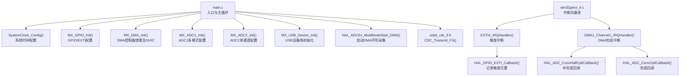
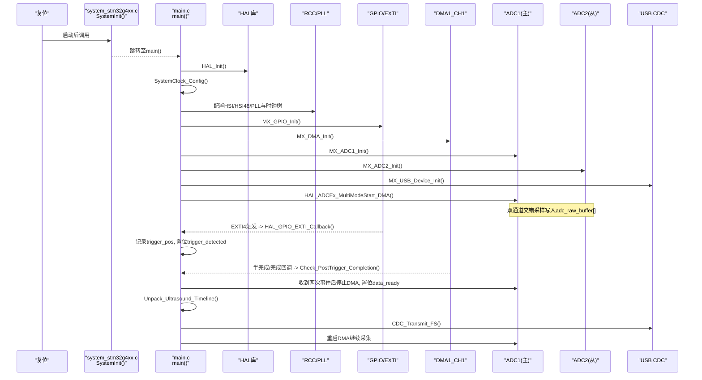
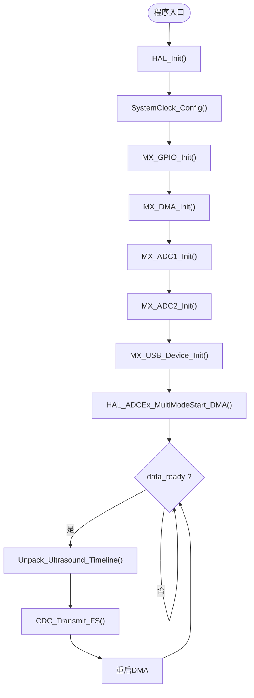
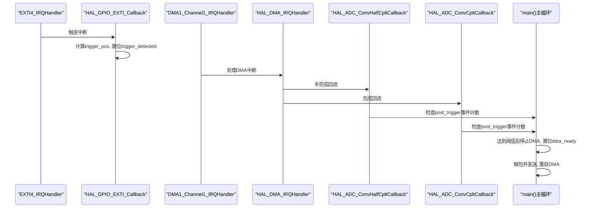
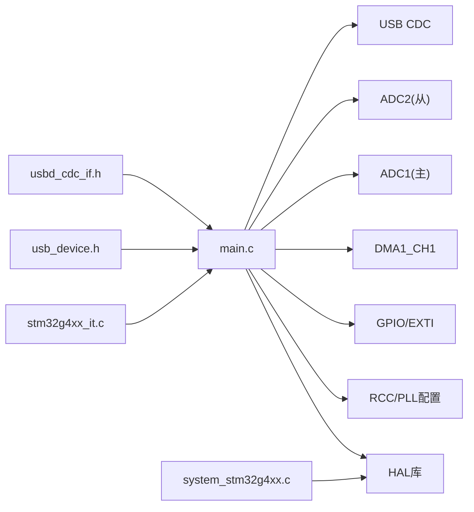

# 核心API接口

<cite>
**本文引用的文件**   
- [Core/Src/main.c](file://Core/Src/main.c)
- [Core/Inc/main.h](file://Core/Inc/main.h)
- [Core/Inc/stm32g4xx_it.h](file://Core/Inc/stm32g4xx_it.h)
- [Core/Src/stm32g4xx_it.c](file://Core/Src/stm32g4xx_it.c)
- [Core/Src/system_stm32g4xx.c](file://Core/Src/system_stm32g4xx.c)
- [USB_Device/App/usb_device.h](file://USB_Device/App/usb_device.h)
- [USB_Device/App/usbd_cdc_if.h](file://USB_Device/App/usbd_cdc_if.h)
</cite>

## 目录
1. [简介](#简介)
2. [项目结构](#项目结构)
3. [核心组件](#核心组件)
4. [架构总览](#架构总览)
5. [详细组件分析](#详细组件分析)
6. [依赖关系分析](#依赖关系分析)
7. [性能考虑](#性能考虑)
8. [故障排查指南](#故障排查指南)
9. [结论](#结论)

## 简介
本文件为核心系统API参考文档，聚焦于应用程序入口点 main()、时钟配置 SystemClock_Config()、错误处理 Error_Handler() 的完整实现与调用约定；详细说明全局数据缓冲 adc_raw_buffer[]、decoded_signal[] 的内存布局与使用方式；解释 volatile 标志位 data_ready、trigger_detected、trigger_pos 等的状态管理机制；给出 HAL_Init()、MX_*_Init() 系列初始化函数的调用顺序与依赖关系；并补充中断回调链路、DMA/ADC双通道交错采集、USB CDC 传输路径以及异常恢复机制。

## 项目结构
本项目基于 STM32G4 系列，采用 CubeMX 生成的工程骨架，应用逻辑集中在 Core/Src/main.c，外设初始化函数 MX_GPIO_Init、MX_DMA_Init、MX_ADC1_Init、MX_ADC2_Init、MX_USB_Device_Init 在 main.c 中按固定顺序调用。中断服务程序位于 Core/Src/stm32g4xx_it.c，通过 HAL 层回调将 DMA/EXTI 事件转发到 main.c 中的回调函数。USB CDC 通信由 USB_Device/App 下的模块提供，main.c 通过 usbd_cdc_if.h 暴露的 CDC_Transmit_FS 进行发送。

图表来源
- [Core/Src/main.c:219-290](file://Core/Src/main.c#L219-L290)
- [Core/Src/main.c:296-337](file://Core/Src/main.c#L296-L337)
- [Core/Src/main.c:488-520](file://Core/Src/main.c#L488-L520)
- [Core/Src/main.c:469-481](file://Core/Src/main.c#L469-L481)
- [Core/Src/main.c:344-407](file://Core/Src/main.c#L344-L407)
- [Core/Src/main.c:414-464](file://Core/Src/main.c#L414-L464)
- [Core/Src/stm32g4xx_it.c:205-214](file://Core/Src/stm32g4xx_it.c#L205-L214)
- [Core/Src/stm32g4xx_it.c:219-228](file://Core/Src/stm32g4xx_it.c#L219-L228)
- [USB_Device/App/usbd_cdc_if.h:109](file://USB_Device/App/usbd_cdc_if.h#L109)

章节来源
- [Core/Src/main.c:219-290](file://Core/Src/main.c#L219-L290)
- [Core/Src/stm32g4xx_it.c:205-228](file://Core/Src/stm32g4xx_it.c#L205-L228)
- [USB_Device/App/usbd_cdc_if.h:109](file://USB_Device/App/usbd_cdc_if.h#L109)

## 核心组件
本节概述 main() 入口、SystemClock_Config()、Error_Handler() 的职责与参数/返回值约定，以及关键全局变量和中断回调的作用域。

- main()
  - 职责：MCU 初始化（HAL_Init）、系统时钟配置、外设初始化（GPIO/DMA/ADC/USB），启动 ADC 双通道交错 DMA 环形采集，主循环检测数据就绪后解包并通过 USB CDC 发送。
  - 返回值：int（标准C入口）。
  - 关键流程：见“初始化序列”与“主循环处理”。

- SystemClock_Config()
  - 职责：配置内部振荡器 HSI 与 HSI48，开启 PLL，设置 SYSCLK/HCLK/APB1/APB2 分频，更新 Flash 等待周期。
  - 参数：无。
  - 返回值：void。
  - 错误处理：RCC 配置失败时调用 Error_Handler()。

- Error_Handler()
  - 职责：统一错误处理入口，关闭全局中断并进入死循环，便于调试定位。
  - 参数：无。
  - 返回值：void。

- 全局数据缓冲区
  - adc_raw_buffer[]：环形 DMA 缓冲，uint32_t 类型，每个元素低16位为 ADC1 采样，高16位为 ADC2 采样，交错打包。
  - decoded_signal[]：线性时间线缓冲，uint16_t 类型，按时间顺序存放 ADC1/ADC2 样本。

- 中断与标志位
  - EXTI4_IRQHandler -> HAL_GPIO_EXTI_Callback：捕获触发时刻，计算 trigger_pos，置位 trigger_detected。
  - DMA1_Channel1_IRQHandler -> HAL_ADC_ConvHalfCpltCallback / HAL_ADC_ConvCpltCallback：统计 post_trigger_dma_events，达到阈值后停止 DMA，置位 data_ready。
  - 标志位：data_ready、trigger_detected、trigger_pos、post_trigger_dma_events、uart_busy 均为 volatile，用于 ISR 与主循环同步。

章节来源
- [Core/Src/main.c:219-290](file://Core/Src/main.c#L219-L290)
- [Core/Src/main.c:296-337](file://Core/Src/main.c#L296-L337)
- [Core/Src/main.c:530-539](file://Core/Src/main.c#L530-L539)
- [Core/Src/main.c:52-70](file://Core/Src/main.c#L52-L70)
- [Core/Src/main.c:91-113](file://Core/Src/main.c#L91-L113)
- [Core/Src/main.c:119-131](file://Core/Src/main.c#L119-L131)
- [Core/Src/main.c:136-149](file://Core/Src/main.c#L136-L149)
- [Core/Src/stm32g4xx_it.c:205-228](file://Core/Src/stm32g4xx_it.c#L205-L228)

## 架构总览
下图展示了从复位到数据采集、触发、解包与传输的整体时序与组件交互。

图表来源
- [Core/Src/system_stm32g4xx.c:181-192](file://Core/Src/system_stm32g4xx.c#L181-L192)
- [Core/Src/main.c:219-290](file://Core/Src/main.c#L219-L290)
- [Core/Src/main.c:296-337](file://Core/Src/main.c#L296-L337)
- [Core/Src/main.c:488-520](file://Core/Src/main.c#L488-L520)
- [Core/Src/main.c:469-481](file://Core/Src/main.c#L469-L481)
- [Core/Src/main.c:344-407](file://Core/Src/main.c#L344-L407)
- [Core/Src/main.c:414-464](file://Core/Src/main.c#L414-L464)
- [Core/Src/stm32g4xx_it.c:205-228](file://Core/Src/stm32g4xx_it.c#L205-L228)
- [USB_Device/App/usbd_cdc_if.h:109](file://USB_Device/App/usbd_cdc_if.h#L109)

## 详细组件分析

### main() 入口与初始化序列
- 调用顺序与依赖
  - HAL_Init()：初始化内核级外设（如 SysTick）与 HAL 框架。
  - SystemClock_Config()：在 HAL_Init 之后配置系统时钟，确保后续外设工作频率正确。
  - MX_GPIO_Init()：启用 PA4 上升沿中断（EXTI4），PC13 LED 输出。
  - MX_DMA_Init()：使能 DMA1/DMAMUX 时钟，配置 NVIC 优先级并开启 DMA1_Channel1 中断。
  - MX_ADC1_Init()：配置 ADC1 为多模式主设备，开启连续转换、DMA 请求、过采样关闭等。
  - MX_ADC2_Init()：配置 ADC2 为从设备，通道与采样时间与 ADC1 对齐。
  - MX_USB_Device_Init()：初始化 USB 设备栈，为 CDC 传输做准备。
  - HAL_ADCEx_MultiModeStart_DMA()：启动 DMA 环形采集，目标缓冲为 adc_raw_buffer[]。

- 主循环处理
  - 检测 data_ready：若置位，则快照 trigger_pos 并立即清零相关标志，防止 ISR 竞争。
  - 解包：Unpack_Ultrasound_Timeline(snap_pos) 将环形缓冲转换为线性时间线 decoded_signal[]。
  - 传输：Send_Signal_Over_UART() 将解码后的样本以十进制字符串形式通过 USB CDC 发送。
  - 重启：再次调用 HAL_ADCEx_MultiModeStart_DMA() 继续采集。

- 错误处理
  - 任何初始化或启动步骤返回非 HAL_OK 时，调用 Error_Handler() 进入错误态。

章节来源
- [Core/Src/main.c:219-290](file://Core/Src/main.c#L219-L290)
- [Core/Src/main.c:296-337](file://Core/Src/main.c#L296-L337)
- [Core/Src/main.c:488-520](file://Core/Src/main.c#L488-L520)
- [Core/Src/main.c:469-481](file://Core/Src/main.c#L469-L481)
- [Core/Src/main.c:344-407](file://Core/Src/main.c#L344-L407)
- [Core/Src/main.c:414-464](file://Core/Src/main.c#L414-L464)

#### 初始化流程图

图表来源
- [Core/Src/main.c:219-290](file://Core/Src/main.c#L219-L290)
- [Core/Src/main.c:296-337](file://Core/Src/main.c#L296-L337)
- [Core/Src/main.c:488-520](file://Core/Src/main.c#L488-L520)
- [Core/Src/main.c:469-481](file://Core/Src/main.c#L469-L481)
- [Core/Src/main.c:344-407](file://Core/Src/main.c#L344-L407)
- [Core/Src/main.c:414-464](file://Core/Src/main.c#L414-L464)

### SystemClock_Config() 时钟配置
- 功能要点
  - 配置电压调节器为 Scale1。
  - 启用 HSI 与 HSI48，开启 PLL，选择 HSI 作为 PLL 源，设置分频系数。
  - 配置 SYSCLK 为 PLL 输出，AHB/APB1/APB2 分频为 1。
  - 设置 Flash 等待周期为 1。
- 错误处理
  - RCC_OscConfig 或 RCC_ClockConfig 失败时调用 Error_Handler()。

章节来源
- [Core/Src/main.c:296-337](file://Core/Src/main.c#L296-L337)

### Error_Handler() 错误处理
- 行为
  - 关闭全局中断，进入无限循环，便于断点调试。
- 扩展建议
  - 可在此添加错误码上报（如通过串口/LED指示），但需保证最小开销与确定性。

章节来源
- [Core/Src/main.c:530-539](file://Core/Src/main.c#L530-L539)

### 全局数据缓冲区与内存布局
- adc_raw_buffer[]
  - 类型：uint32_t 数组，环形缓冲。
  - 布局：每个元素的低16位为 ADC1 样本，高16位为 ADC2 样本，形成交错打包。
  - 用途：DMA 直接写入，避免 CPU 参与，提高吞吐。
- decoded_signal[]
  - 类型：uint16_t 数组，线性时间线。
  - 布局：按时间顺序依次存放 ADC1/ADC2 样本，便于上位机解析。
  - 用途：在主循环中由 Unpack_Ultrasound_Timeline() 生成。

章节来源
- [Core/Src/main.c:52-70](file://Core/Src/main.c#L52-L70)
- [Core/Src/main.c:156-171](file://Core/Src/main.c#L156-L171)

### 中断与标志位状态管理
- EXTI4_IRQHandler
  - 调用 HAL_GPIO_EXTI_IRQHandler(GPIO_PIN_4)，最终进入 HAL_GPIO_EXTI_Callback。
- HAL_GPIO_EXTI_Callback
  - 忽略 uart_busy 期间与重复触发。
  - 读取 DMA 剩余计数，计算触发位置 trigger_pos。
  - 置位 trigger_detected，重置 post_trigger_dma_events。
- DMA1_Channel1_IRQHandler
  - 调用 HAL_DMA_IRQHandler(&hdma_adc1)，进而触发 ADC 半完成/完成回调。
- HAL_ADC_ConvHalfCpltCallback / HAL_ADC_ConvCpltCallback
  - 共享逻辑 Check_PostTrigger_Completion()：当 trigger_detected 为真且累计两次事件（半完成+完成）后，停止 DMA，置位 data_ready，清除 trigger_detected。
- 主循环
  - 检测到 data_ready 后，快照 trigger_pos 并清零标志，执行解包与发送，然后重启 DMA。

图表来源
- [Core/Src/stm32g4xx_it.c:205-214](file://Core/Src/stm32g4xx_it.c#L205-L214)
- [Core/Src/stm32g4xx_it.c:219-228](file://Core/Src/stm32g4xx_it.c#L219-L228)
- [Core/Src/main.c:91-113](file://Core/Src/main.c#L91-L113)
- [Core/Src/main.c:119-131](file://Core/Src/main.c#L119-L131)
- [Core/Src/main.c:136-149](file://Core/Src/main.c#L136-L149)
- [Core/Src/main.c:219-290](file://Core/Src/main.c#L219-L290)

章节来源
- [Core/Src/stm32g4xx_it.c:205-228](file://Core/Src/stm32g4xx_it.c#L205-L228)
- [Core/Src/main.c:91-113](file://Core/Src/main.c#L91-L113)
- [Core/Src/main.c:119-131](file://Core/Src/main.c#L119-L131)
- [Core/Src/main.c:136-149](file://Core/Src/main.c#L136-L149)
- [Core/Src/main.c:219-290](file://Core/Src/main.c#L219-L290)

### USB CDC 传输路径
- 接口
  - CDC_Transmit_FS(uint8_t* Buf, uint16_t Len)：将数据放入 USB 端点队列，非阻塞。
- 使用方式
  - 主循环在解包完成后构建文本缓冲，循环调用 CDC_Transmit_FS 直至成功。
  - 为避免阻塞，可在发送期间屏蔽新的触发（uart_busy 标志）。

章节来源
- [USB_Device/App/usbd_cdc_if.h:109](file://USB_Device/App/usbd_cdc_if.h#L109)
- [Core/Src/main.c:178-212](file://Core/Src/main.c#L178-L212)

## 依赖关系分析
- 模块耦合
  - main.c 依赖 HAL 层（HAL_Init、HAL_ADCEx_MultiModeStart_DMA 等）、外设驱动（MX_*_Init）、USB CDC 接口。
  - stm32g4xx_it.c 仅负责中断分发，实际业务逻辑集中在 main.c 的回调函数中，保持 ISR 轻量。
- 外部依赖
  - system_stm32g4xx.c 提供 SystemInit 与系统时钟变量，供 HAL 与用户代码使用。
  - usb_device.h 声明 MX_USB_Device_Init 原型，供 main.c 调用。

图表来源
- [Core/Src/main.c:219-290](file://Core/Src/main.c#L219-L290)
- [Core/Src/stm32g4xx_it.c:205-228](file://Core/Src/stm32g4xx_it.c#L205-L228)
- [Core/Src/system_stm32g4xx.c:181-192](file://Core/Src/system_stm32g4xx.c#L181-L192)
- [USB_Device/App/usb_device.h:78](file://USB_Device/App/usb_device.h#L78)
- [USB_Device/App/usbd_cdc_if.h:109](file://USB_Device/App/usbd_cdc_if.h#L109)

章节来源
- [Core/Src/main.c:219-290](file://Core/Src/main.c#L219-L290)
- [Core/Src/stm32g4xx_it.c:205-228](file://Core/Src/stm32g4xx_it.c#L205-L228)
- [Core/Src/system_stm32g4xx.c:181-192](file://Core/Src/system_stm32g4xx.c#L181-L192)
- [USB_Device/App/usb_device.h:78](file://USB_Device/App/usb_device.h#L78)
- [USB_Device/App/usbd_cdc_if.h:109](file://USB_Device/App/usbd_cdc_if.h#L109)

## 性能考虑
- DMA 环形缓冲与交错打包减少 CPU 干预，提升采样吞吐。
- 触发位置计算基于 DMA 剩余计数，避免额外锁机制，降低中断延迟。
- 解包与发送在主循环中进行，注意避免长时间占用导致错过下一次触发窗口。
- USB CDC 发送为非阻塞，必要时轮询重试，确保数据可靠传输。

[本节为通用指导，不直接分析具体文件]

## 故障排查指南
- 常见问题
  - 未触发或数据不完整：检查 EXTI4 引脚配置与中断优先级，确认 HAL_GPIO_EXTI_Callback 是否被调用。
  - DMA 未完成即停止：核对 post_trigger_dma_events 计数逻辑，确保半完成与完成回调均到达。
  - USB 无法发送：确认 MX_USB_Device_Init 成功，CDC_Transmit_FS 返回值是否为 USBD_OK。
  - 系统卡死：Error_Handler 会关闭中断并停驻，可通过调试器查看调用堆栈定位失败点。
- 建议措施
  - 在 Error_Handler 中添加错误码上报或 LED 指示。
  - 对关键标志位读写加临界区保护或使用原子操作，避免竞争条件。
  - 增加日志输出（如通过 UART/USB）辅助定位问题。

章节来源
- [Core/Src/main.c:530-539](file://Core/Src/main.c#L530-L539)
- [Core/Src/main.c:91-113](file://Core/Src/main.c#L91-L113)
- [Core/Src/main.c:119-131](file://Core/Src/main.c#L119-L131)
- [Core/Src/main.c:178-212](file://Core/Src/main.c#L178-L212)

## 结论
本项目的核心 API 围绕 main() 入口展开，通过 HAL_Init 与 SystemClock_Config 建立基础运行环境，随后按序初始化 GPIO、DMA、ADC 与 USB，并以 DMA 环形缓冲实现高速交错采样。EXTI 触发与 DMA 回调协同工作，利用 volatile 标志位在主循环与 ISR 之间安全传递状态。错误处理集中于 Error_Handler，便于快速定位与恢复。整体设计兼顾实时性与可靠性，适合超声信号采集与上位机可视化场景。