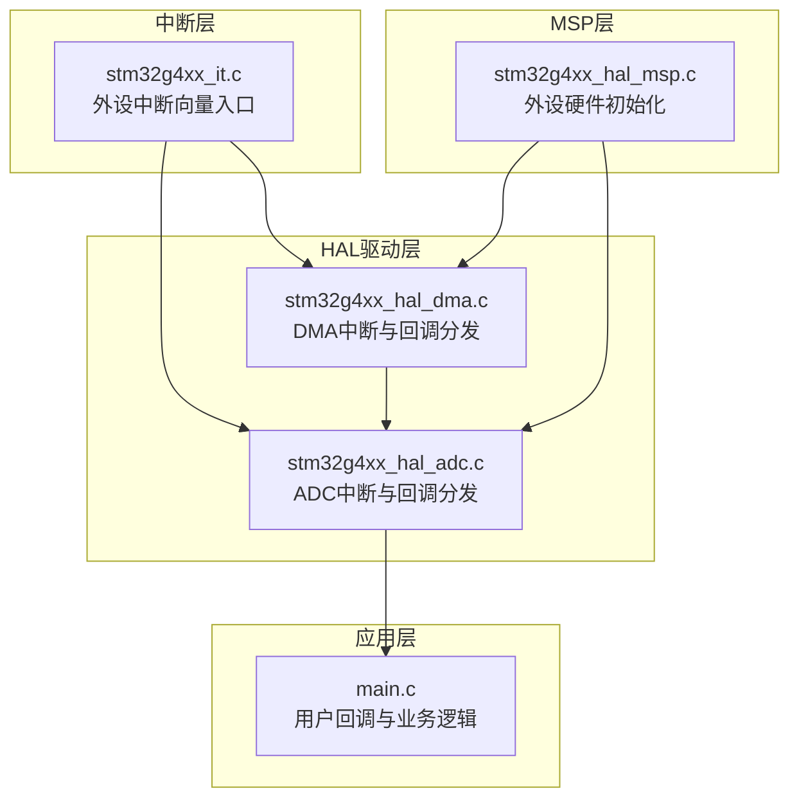
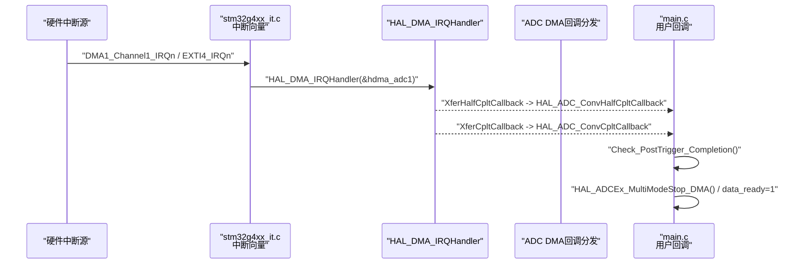
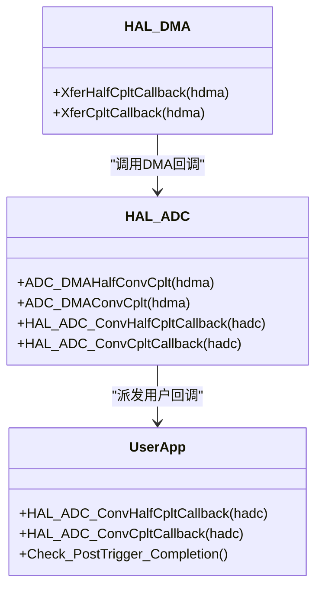
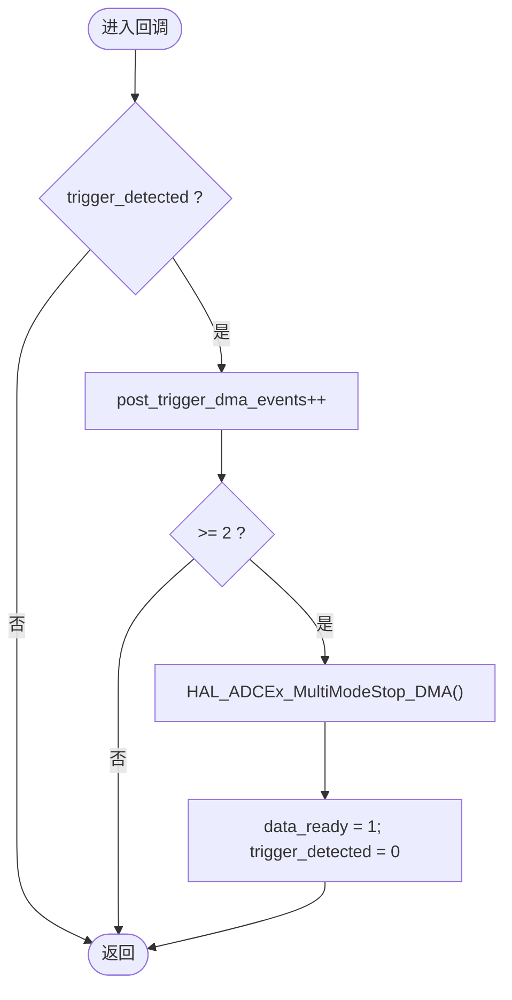
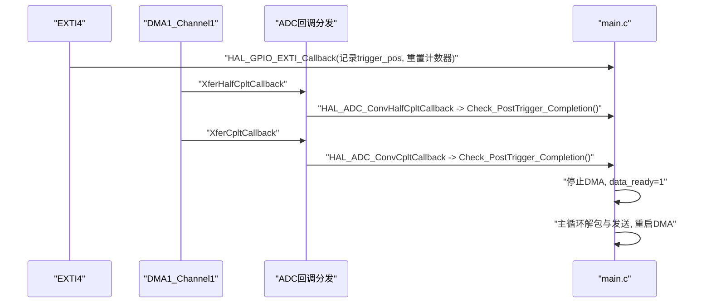
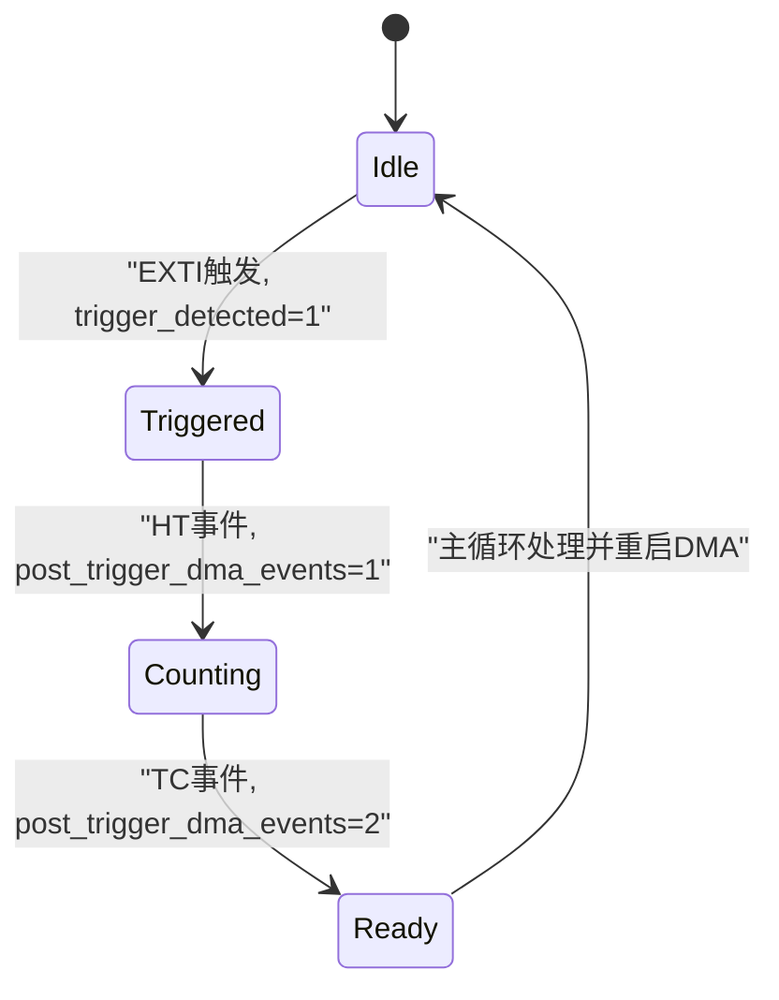
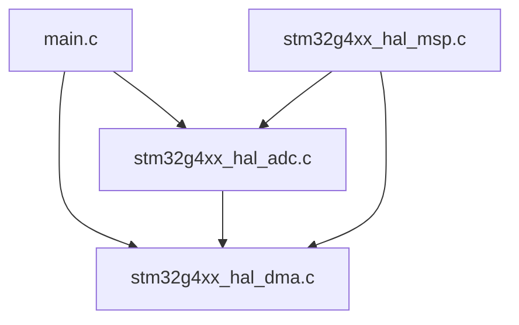

# DMA中断处理机制

<cite>
**本文引用的文件**
- [Core/Src/main.c](file://Core/Src/main.c)
- [Core/Inc/main.h](file://Core/Inc/main.h)
- [Core/Src/stm32g4xx_it.c](file://Core/Src/stm32g4xx_it.c)
- [Drivers/STM32G4xx_HAL_Driver/Src/stm32g4xx_hal_adc.c](file://Drivers/STM32G4xx_HAL_Driver/Src/stm32g4xx_hal_adc.c)
- [Drivers/STM32G4xx_HAL_Driver/Src/stm32g4xx_hal_dma.c](file://Drivers/STM32G4xx_HAL_Driver/Src/stm32g4xx_hal_dma.c)
- [Core/Src/stm32g4xx_hal_msp.c](file://Core/Src/stm32g4xx_hal_msp.c)
</cite>

## 目录
1. [引言](#引言)
2. [项目结构](#项目结构)
3. [核心组件](#核心组件)
4. [架构总览](#架构总览)
5. [详细组件分析](#详细组件分析)
6. [依赖关系分析](#依赖关系分析)
7. [性能与实时性考虑](#性能与实时性考虑)
8. [故障排查指南](#故障排查指南)
9. [结论](#结论)

## 引言
本技术文档围绕基于STM32G4的ADC+DMA双通道交错采样与环形缓冲的中断处理机制，重点阐述以下要点：
- HAL_ADC_ConvHalfCpltCallback与HAL_ADC_ConvCpltCallback回调的作用与实现路径
- 半传输（HT）与全传输（TC）事件的处理逻辑
- post_trigger_dma_events计数器的作用与设计动机
- Check_PostTrigger_Completion函数的设计思路与“确保足够后触发样本数量”的机制
- 中断服务程序的实时性要求、最小化处理时间与原子操作保证
- 中断优先级配置与嵌套中断处理的最佳实践
- 中断时序图与状态转换图

## 项目结构
本项目采用分层组织方式：
- 应用层：main.c负责系统初始化、外设启动、数据处理与通信
- 中断层：stm32g4xx_it.c提供外设中断向量入口，转发至HAL层
- HAL驱动层：stm32g4xx_hal_adc.c与stm32g4xx_hal_dma.c实现ADC/DMA的底层中断与回调分发
- MSP层：stm32g4xx_hal_msp.c完成外设时钟、GPIO、DMA等硬件相关初始化

图表来源
- [Core/Src/main.c:115-149](file://Core/Src/main.c#L115-L149)
- [Core/Src/stm32g4xx_it.c:205-228](file://Core/Src/stm32g4xx_it.c#L205-L228)
- [Drivers/STM32G4xx_HAL_Driver/Src/stm32g4xx_hal_adc.c:3586-3675](file://Drivers/STM32G4xx_HAL_Driver/Src/stm32g4xx_hal_adc.c#L3586-L3675)
- [Drivers/STM32G4xx_HAL_Driver/Src/stm32g4xx_hal_dma.c:748-790](file://Drivers/STM32G4xx_HAL_Driver/Src/stm32g4xx_hal_dma.c#L748-L790)
- [Core/Src/stm32g4xx_hal_msp.c:127-143](file://Core/Src/stm32g4xx_hal_msp.c#L127-L143)

章节来源
- [Core/Src/main.c:219-290](file://Core/Src/main.c#L219-L290)
- [Core/Src/stm32g4xx_it.c:205-228](file://Core/Src/stm32g4xx_it.c#L205-L228)
- [Core/Src/stm32g4xx_hal_msp.c:127-143](file://Core/Src/stm32g4xx_hal_msp.c#L127-L143)

## 核心组件
- ADC多模式交错采样与DMA环形缓冲：通过HAL_ADCEx_MultiModeStart_DMA启动，DMA以循环模式将ADC1/ADC2数据打包写入环形缓冲区。
- 用户回调：HAL_ADC_ConvHalfCpltCallback与HAL_ADC_ConvCpltCallback在DMA半传输和全传输时由HAL层调用，用于更新后触发事件计数并判断是否满足停止条件。
- 触发检测：EXTI上升沿捕获触发时刻，记录当前DMA写指针位置，重置后触发事件计数器。
- 主循环处理：在主循环中等待data_ready标志，进行数据解包与发送，然后重启DMA。

章节来源
- [Core/Src/main.c:249-255](file://Core/Src/main.c#L249-L255)
- [Core/Src/main.c:115-149](file://Core/Src/main.c#L115-L149)
- [Core/Src/main.c:156-171](file://Core/Src/main.c#L156-L171)
- [Core/Src/main.c:264-287](file://Core/Src/main.c#L264-L287)

## 架构总览
下图展示了从硬件中断到用户回调的完整链路，以及关键变量与函数之间的交互。

图表来源
- [Core/Src/stm32g4xx_it.c:219-228](file://Core/Src/stm32g4xx_it.c#L219-L228)
- [Drivers/STM32G4xx_HAL_Driver/Src/stm32g4xx_hal_dma.c:748-790](file://Drivers/STM32G4xx_HAL_Driver/Src/stm32g4xx_hal_dma.c#L748-L790)
- [Drivers/STM32G4xx_HAL_Driver/Src/stm32g4xx_hal_adc.c:3586-3675](file://Drivers/STM32G4xx_HAL_Driver/Src/stm32g4xx_hal_adc.c#L3586-L3675)
- [Core/Src/main.c:115-149](file://Core/Src/main.c#L115-L149)

## 详细组件分析

### 回调函数与中断链路
- HAL层回调分发：
  - DMA中断进入HAL_DMA_IRQHandler后，根据标志位分别调用XferHalfCpltCallback或XferCpltCallback。
  - ADC侧在DMA回调中进一步调用ADC_DMAConvCplt与ADC_DMAHalfConvCplt，最终派发至用户实现的HAL_ADC_ConvCpltCallback与HAL_ADC_ConvHalfCpltCallback。
- 用户回调职责：
  - HAL_ADC_ConvHalfCpltCallback：当DMA写入环形缓冲一半时触发，用于累计一次后触发事件。
  - HAL_ADC_ConvCpltCallback：当DMA完成一轮环形缓冲写入时触发，再次累计后触发事件。

图表来源
- [Drivers/STM32G4xx_HAL_Driver/Src/stm32g4xx_hal_dma.c:748-790](file://Drivers/STM32G4xx_HAL_Driver/Src/stm32g4xx_hal_dma.c#L748-L790)
- [Drivers/STM32G4xx_HAL_Driver/Src/stm32g4xx_hal_adc.c:3586-3675](file://Drivers/STM32G4xx_HAL_Driver/Src/stm32g4xx_hal_adc.c#L3586-L3675)
- [Core/Src/main.c:115-149](file://Core/Src/main.c#L115-L149)

章节来源
- [Drivers/STM32G4xx_HAL_Driver/Src/stm32g4xx_hal_dma.c:748-790](file://Drivers/STM32G4xx_HAL_Driver/Src/stm32g4xx_hal_dma.c#L748-L790)
- [Drivers/STM32G4xx_HAL_Driver/Src/stm32g4xx_hal_adc.c:3586-3675](file://Drivers/STM32G4xx_HAL_Driver/Src/stm32g4xx_hal_adc.c#L3586-L3675)
- [Core/Src/main.c:115-149](file://Core/Src/main.c#L115-L149)

### 半传输与全传输事件处理逻辑
- 半传输（HT）：DMA写入环形缓冲的前半部分（例如60个word），触发HAL_ADC_ConvHalfCpltCallback。
- 全传输（TC）：DMA完成一整轮环形缓冲写入（例如120个word），触发HAL_ADC_ConvCpltCallback。
- 两者均调用Check_PostTrigger_Completion，对post_trigger_dma_events进行递增，并在达到阈值后停止DMA并置位data_ready。

图表来源
- [Core/Src/main.c:115-149](file://Core/Src/main.c#L115-L149)
- [Core/Src/main.c:118-131](file://Core/Src/main.c#L118-L131)

章节来源
- [Core/Src/main.c:115-149](file://Core/Src/main.c#L115-L149)
- [Core/Src/main.c:118-131](file://Core/Src/main.c#L118-L131)

### post_trigger_dma_events计数器的作用
- 目的：确保至少采集到两个DMA事件（HT与TC各一次），从而保证后触发段包含足够的样本数（例如≥80个word）。
- 工作机制：
  - 在EXTI触发时重置为0。
  - 每次进入HT或TC回调时递增。
  - 当计数≥2时，认为已覆盖完整的后触发窗口，停止DMA并通知主循环处理。

章节来源
- [Core/Src/main.c:107-112](file://Core/Src/main.c#L107-L112)
- [Core/Src/main.c:118-131](file://Core/Src/main.c#L118-L131)

### Check_PostTrigger_Completion的设计思路
- 输入：全局状态trigger_detected与post_trigger_dma_events。
- 输出：停止DMA并置位data_ready，允许主循环进行数据解包与发送。
- 关键点：
  - 仅在检测到触发后才开始计数，避免误判。
  - 需要两次事件（HT+TC）以确保环形缓冲的后半段被填满，满足后触发样本数量的下限。
  - 停止DMA后立即置位data_ready，主循环可安全读取trigger_pos快照并进行后续处理。

章节来源
- [Core/Src/main.c:118-131](file://Core/Src/main.c#L118-L131)
- [Core/Src/main.c:264-287](file://Core/Src/main.c#L264-L287)

### 中断服务程序的实时性要求与原子操作保证
- 实时性要求：
  - EXTI与DMA中断必须快速响应，回调内仅做最小化工作（读寄存器、设置标志、计数）。
  - 避免在回调中进行耗时操作（如串口/USB发送、复杂计算）。
- 原子性与一致性：
  - 使用volatile修饰共享变量（如trigger_pos、post_trigger_dma_events、data_ready），防止编译器优化导致不一致。
  - 主循环在处理前对trigger_pos进行快照并立即关闭trigger_detected，避免ISR修改造成竞态。
  - 使用uart_busy作为互斥锁，防止在数据传输期间重复触发。

章节来源
- [Core/Src/main.c:64-70](file://Core/Src/main.c#L64-L70)
- [Core/Src/main.c:91-113](file://Core/Src/main.c#L91-L113)
- [Core/Src/main.c:264-287](file://Core/Src/main.c#L264-L287)

### 中断优先级配置与嵌套中断处理最佳实践
- 优先级配置：
  - DMA1_Channel1与EXTI4均设置为最高优先级（0,0），确保数据采集与触发捕获的及时性。
- 嵌套处理建议：
  - 保持回调短小，避免阻塞；若需长时间处理，应置位标志交由主循环或低优先级任务处理。
  - 使用互斥标志（如uart_busy）保护临界区，防止重入与竞争。
  - 合理设置NVIC抢占优先级与子优先级，确保高实时性中断不被低优先级任务延迟。

章节来源
- [Core/Src/main.c:477-480](file://Core/Src/main.c#L477-L480)
- [Core/Src/main.c:505-506](file://Core/Src/main.c#L505-L506)
- [Core/Src/main.c:264-287](file://Core/Src/main.c#L264-L287)

### 中断时序图
下图展示从EXTI触发到DMA回调再到主循环处理的时序关系。

图表来源
- [Core/Src/main.c:91-113](file://Core/Src/main.c#L91-L113)
- [Core/Src/main.c:115-149](file://Core/Src/main.c#L115-L149)
- [Core/Src/main.c:264-287](file://Core/Src/main.c#L264-L287)

### 状态转换图
下图描述触发与DMA事件的状态机变化。

图表来源
- [Core/Src/main.c:91-113](file://Core/Src/main.c#L91-L113)
- [Core/Src/main.c:118-131](file://Core/Src/main.c#L118-L131)
- [Core/Src/main.c:264-287](file://Core/Src/main.c#L264-L287)

## 依赖关系分析
- 应用层依赖HAL层提供的回调接口与外设控制API。
- HAL层依赖DMA与ADC的底层中断处理与状态管理。
- MSP层负责硬件初始化，确保DMA请求映射、时钟与GPIO正确配置。

图表来源
- [Core/Src/main.c:249-255](file://Core/Src/main.c#L249-L255)
- [Drivers/STM32G4xx_HAL_Driver/Src/stm32g4xx_hal_adc.c:3586-3675](file://Drivers/STM32G4xx_HAL_Driver/Src/stm32g4xx_hal_adc.c#L3586-L3675)
- [Drivers/STM32G4xx_HAL_Driver/Src/stm32g4xx_hal_dma.c:748-790](file://Drivers/STM32G4xx_HAL_Driver/Src/stm32g4xx_hal_dma.c#L748-L790)
- [Core/Src/stm32g4xx_hal_msp.c:127-143](file://Core/Src/stm32g4xx_hal_msp.c#L127-L143)

章节来源
- [Core/Src/main.c:249-255](file://Core/Src/main.c#L249-L255)
- [Core/Src/stm32g4xx_hal_msp.c:127-143](file://Core/Src/stm32g4xx_hal_msp.c#L127-L143)

## 性能与实时性考虑
- 回调最小化：在中断上下文中仅执行必要的寄存器读取、标志设置与计数，避免阻塞操作。
- 原子性保障：使用volatile与快照策略，确保主循环与ISR之间的一致性。
- 优先级配置：将关键中断（DMA、EXTI）设为最高优先级，减少抖动与延迟。
- 环形缓冲与解耦：DMA持续填充环形缓冲，主循环在非实时路径进行数据解包与发送，降低实时路径压力。

[本节为通用指导，不直接分析具体文件]

## 故障排查指南
- 现象：未收到任何回调或数据不完整
  - 检查DMA中断是否启用且优先级正确
  - 确认HAL_ADCEx_MultiModeStart_DMA返回值与错误码
  - 验证DMA环形缓冲大小与ADC采样率匹配
- 现象：触发后未停止DMA或数据未就绪
  - 检查trigger_detected与post_trigger_dma_events是否正确更新
  - 确认Check_PostTrigger_Completion在HT与TC回调中均被调用
- 现象：主循环处理时数据错乱
  - 检查trigger_pos快照与uart_busy互斥是否生效
  - 确认Unpack_Ultrasound_Timeline索引计算与边界处理

章节来源
- [Core/Src/main.c:249-255](file://Core/Src/main.c#L249-L255)
- [Core/Src/main.c:118-131](file://Core/Src/main.c#L118-L131)
- [Core/Src/main.c:264-287](file://Core/Src/main.c#L264-L287)

## 结论
本方案通过EXTI触发与DMA环形缓冲结合，利用HAL_ADC_ConvHalfCpltCallback与HAL_ADC_ConvCpltCallback回调，实现了可靠的后触发样本采集与处理。post_trigger_dma_events计数器确保了后触发窗口的完整性，Check_PostTrigger_Completion提供了简洁而健壮的事件判定逻辑。通过合理的优先级配置与原子性保障，系统在实时性与稳定性方面达到了良好平衡。

[本节为总结性内容，不直接分析具体文件]