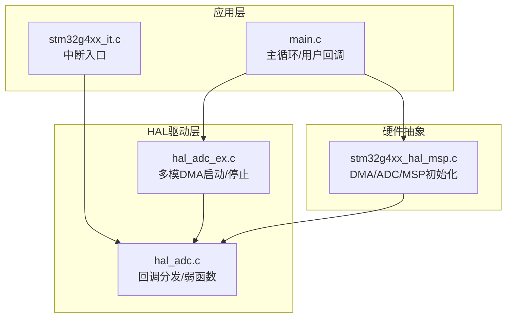
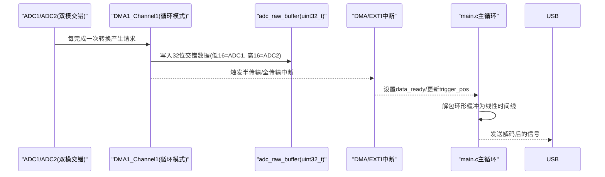
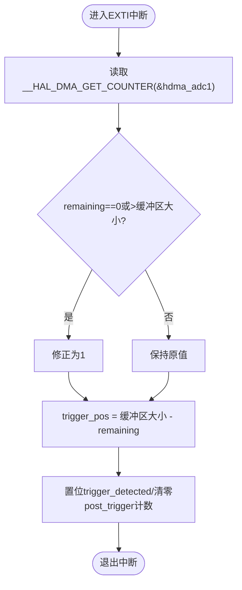
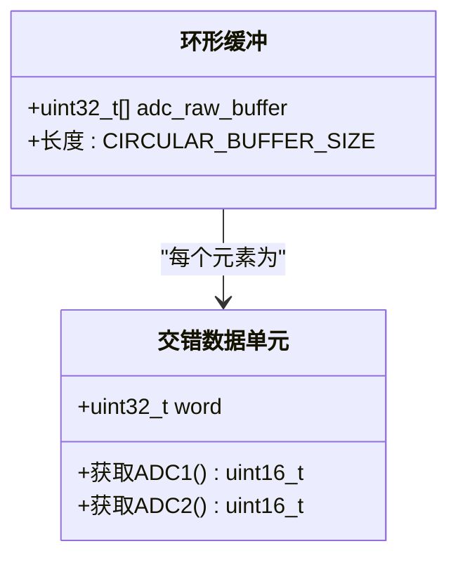
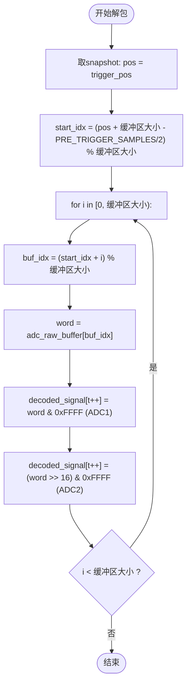
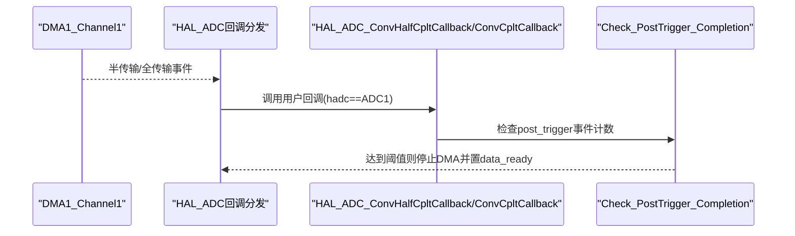
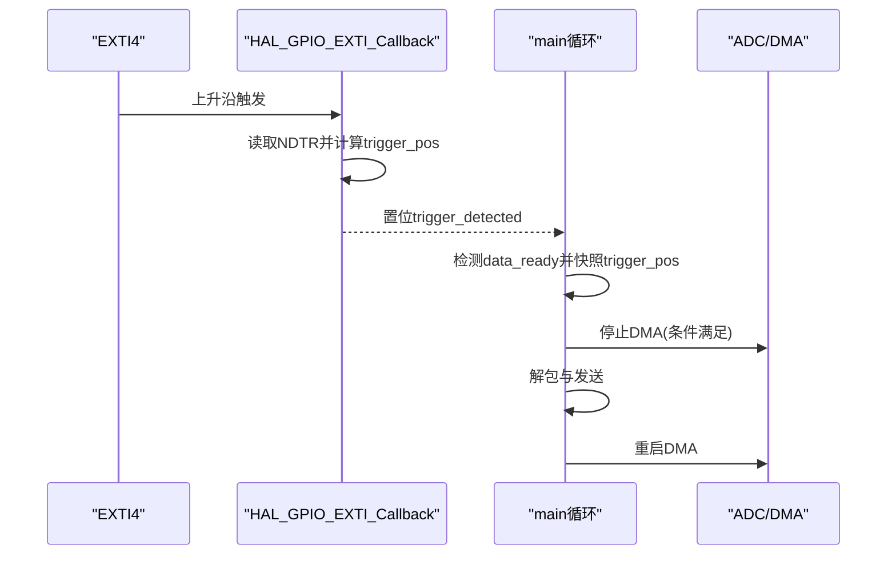
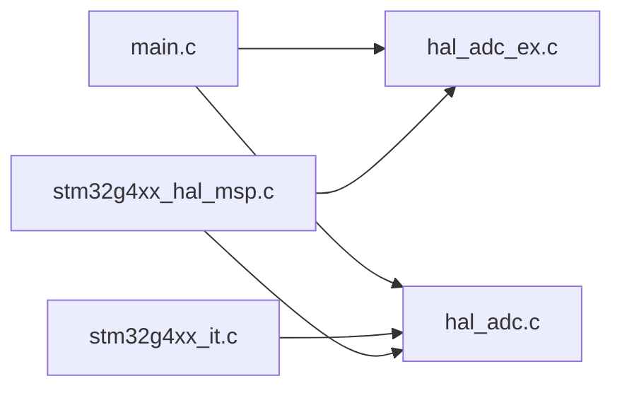
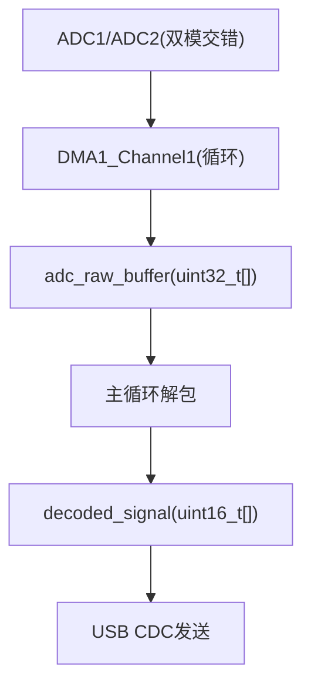
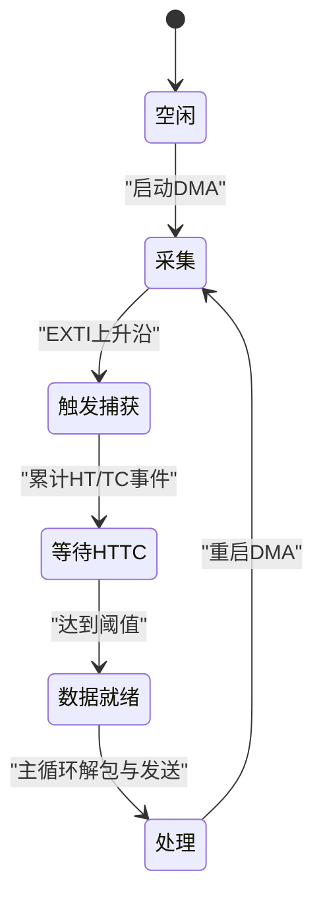

# DMA缓冲管理系统

<cite>
**本文引用的文件**
- [Core/Src/main.c](file://Core/Src/main.c)
- [Core/Inc/main.h](file://Core/Inc/main.h)
- [Core/Src/stm32g4xx_it.c](file://Core/Src/stm32g4xx_it.c)
- [Core/Inc/stm32g4xx_it.h](file://Core/Inc/stm32g4xx_it.h)
- [Core/Src/stm32g4xx_hal_msp.c](file://Core/Src/stm32g4xx_hal_msp.c)
- [Drivers/STM32G4xx_HAL_Driver/Src/stm32g4xx_hal_adc_ex.c](file://Drivers/STM32G4xx_HAL_Driver/Src/stm32g4xx_hal_adc_ex.c)
- [Drivers/STM32G4xx_HAL_Driver/Src/stm32g4xx_hal_adc.c](file://Drivers/STM32G4xx_HAL_Driver/Src/stm32g4xx_hal_adc.c)
</cite>

## 目录
1. [简介](#简介)
2. [项目结构](#项目结构)
3. [核心组件](#核心组件)
4. [架构总览](#架构总览)
5. [详细组件分析](#详细组件分析)
6. [依赖关系分析](#依赖关系分析)
7. [性能与内存布局优化](#性能与内存布局优化)
8. [故障排查指南](#故障排查指南)
9. [结论](#结论)
10. [附录](#附录)

## 简介
本技术文档围绕基于STM32G4的DMA环形缓冲管理系统，系统阐述以下要点：
- DMA循环模式的工作原理与配置方法，重点说明NDTR寄存器在触发时刻的定位作用。
- 32位交错存储格式的设计：低16位为ADC1数据、高16位为ADC2数据的实现逻辑。
- 环形缓冲区的数据打包与解包算法，包括索引计算与边界处理。
- DMA中断回调机制：半传输（HT）与全传输（TC）事件的处理流程。
- 内存布局优化策略与零拷贝数据处理技巧。
- 提供DMA数据流图与缓冲区状态图，帮助理解数据传输过程。

## 项目结构
本项目采用CubeMX生成的标准工程结构，关键代码集中在Core目录，HAL驱动位于Drivers目录。与DMA环形缓冲管理直接相关的源文件如下：
- 应用主循环与用户回调：Core/Src/main.c
- 中断向量与外设中断入口：Core/Src/stm32g4xx_it.c
- HAL MSP初始化（DMA/ADC时钟、GPIO、DMA通道绑定）：Core/Src/stm32g4xx_hal_msp.c
- HAL ADC多模启动/停止与回调分发：Drivers/STM32G4xx_HAL_Driver/Src/stm32g4xx_hal_adc_ex.c 与 stm32g4xx_hal_adc.c

图表来源
- [Core/Src/main.c:219-290](file://Core/Src/main.c#L219-L290)
- [Core/Src/stm32g4xx_it.c:205-228](file://Core/Src/stm32g4xx_it.c#L205-L228)
- [Core/Src/stm32g4xx_hal_msp.c:127-148](file://Core/Src/stm32g4xx_hal_msp.c#L127-L148)
- [Drivers/STM32G4xx_HAL_Driver/Src/stm32g4xx_hal_adc_ex.c:862-966](file://Drivers/STM32G4xx_HAL_Driver/Src/stm32g4xx_hal_adc_ex.c#L862-L966)
- [Drivers/STM32G4xx_HAL_Driver/Src/stm32g4xx_hal_adc.c:2661-2682](file://Drivers/STM32G4xx_HAL_Driver/Src/stm32g4xx_hal_adc.c#L2661-L2682)

章节来源
- [Core/Src/main.c:219-290](file://Core/Src/main.c#L219-L290)
- [Core/Src/stm32g4xx_it.c:205-228](file://Core/Src/stm32g4xx_it.c#L205-L228)
- [Core/Src/stm32g4xx_hal_msp.c:127-148](file://Core/Src/stm32g4xx_hal_msp.c#L127-L148)
- [Drivers/STM32G4xx_HAL_Driver/Src/stm32g4xx_hal_adc_ex.c:862-966](file://Drivers/STM32G4xx_HAL_Driver/Src/stm32g4xx_hal_adc_ex.c#L862-L966)
- [Drivers/STM32G4xx_HAL_Driver/Src/stm32g4xx_hal_adc.c:2661-2682](file://Drivers/STM32G4xx_HAL_Driver/Src/stm32g4xx_hal_adc.c#L2661-L2682)

## 核心组件
- 环形缓冲区与解码缓冲区
  - adc_raw_buffer：uint32_t数组，长度由CIRCULAR_BUFFER_SIZE定义；每个元素为32位，低16位存放ADC1采样值，高16位存放ADC2采样值。
  - decoded_signal：uint16_t线性时间线数组，长度为TOTAL_SAMPLES，用于按时间顺序输出ADC1/ADC2交替样本。
- 标志与同步变量
  - data_ready、trigger_detected、trigger_pos、post_trigger_dma_events、uart_busy等volatile标志，用于ISR与主循环之间的安全通信。
- DMA与ADC多模配置
  - DMA1_Channel1，方向为外设到内存，外设地址固定，内存自增，数据宽度均为字（32位），模式为循环。
  - ADC1/ADC2双模交错模式（INTERL），通过HAL_ADCEx_MultiModeStart_DMA启动DMA连续采集。

章节来源
- [Core/Src/main.c:52-70](file://Core/Src/main.c#L52-L70)
- [Core/Src/stm32g4xx_hal_msp.c:127-148](file://Core/Src/stm32g4xx_hal_msp.c#L127-L148)
- [Core/Src/main.c:344-407](file://Core/Src/main.c#L344-L407)
- [Core/Src/main.c:414-464](file://Core/Src/main.c#L414-L464)
- [Drivers/STM32G4xx_HAL_Driver/Src/stm32g4xx_hal_adc_ex.c:862-966](file://Drivers/STM32G4xx_HAL_Driver/Src/stm32g4xx_hal_adc_ex.c#L862-L966)

## 架构总览
下图展示了从ADC转换到DMA写入环形缓冲，再到中断回调与主循环处理的完整数据流。

图表来源
- [Core/Src/main.c:249-255](file://Core/Src/main.c#L249-L255)
- [Core/Src/main.c:135-149](file://Core/Src/main.c#L135-L149)
- [Core/Src/main.c:156-171](file://Core/Src/main.c#L156-L171)
- [Core/Src/stm32g4xx_it.c:219-228](file://Core/Src/stm32g4xx_it.c#L219-L228)
- [Drivers/STM32G4xx_HAL_Driver/Src/stm32g4xx_hal_adc_ex.c:862-966](file://Drivers/STM32G4xx_HAL_Driver/Src/stm32g4xx_hal_adc_ex.c#L862-L966)

## 详细组件分析

### DMA循环模式与NDTR的使用
- DMA配置要点
  - 模式：DMA_CIRCULAR，使能自动回绕，无需软件重装载NDTR。
  - 数据对齐：外设与内存均为字（32位），保证每次传输一个交错样本。
  - 地址增量：外设地址固定（ADC_DR），内存地址自增，依次填充adc_raw_buffer。
- NDTR的作用与读取
  - __HAL_DMA_GET_COUNTER返回剩余待传输次数，可用于定位触发时刻对应的环形缓冲写入位置。
  - 在EXTI上升沿中断中读取remaining，并转换为trigger_pos = CIRCULAR_BUFFER_SIZE - remaining，作为“触发点”的快照。
  - 对remaining进行边界保护，避免NDTR重载瞬态导致的越界或误判。

图表来源
- [Core/Src/main.c:91-113](file://Core/Src/main.c#L91-L113)
- [Core/Src/main.c:100-105](file://Core/Src/main.c#L100-L105)

章节来源
- [Core/Src/stm32g4xx_hal_msp.c:127-148](file://Core/Src/stm32g4xx_hal_msp.c#L127-L148)
- [Core/Src/main.c:91-113](file://Core/Src/main.c#L91-L113)

### 32位交错存储格式设计
- 存储布局
  - 每个uint32_t单元包含两个12位ADC结果：低16位为ADC1，高16位为ADC2。
  - 该布局来源于ADC双模交错模式下的DMA数据打包行为，由HAL在多模模式下将两路ADC结果合并为一个32位字写入内存。
- 访问方式
  - 读取时分别使用掩码与移位操作提取低/高16位，得到ADC1与ADC2的采样值。

图表来源
- [Core/Src/main.c:58-62](file://Core/Src/main.c#L58-L62)
- [Core/Src/main.c:166-170](file://Core/Src/main.c#L166-L170)
- [Drivers/STM32G4xx_HAL_Driver/Src/stm32g4xx_hal_adc_ex.c:862-966](file://Drivers/STM32G4xx_HAL_Driver/Src/stm32g4xx_hal_adc_ex.c#L862-L966)

章节来源
- [Core/Src/main.c:58-62](file://Core/Src/main.c#L58-L62)
- [Core/Src/main.c:166-170](file://Core/Src/main.c#L166-L170)
- [Drivers/STM32G4xx_HAL_Driver/Src/stm32g4xx_hal_adc_ex.c:862-966](file://Drivers/STM32G4xx_HAL_Driver/Src/stm32g4xx_hal_adc_ex.c#L862-L966)

### 环形缓冲区打包与解包算法
- 打包（DMA侧）
  - DMA以循环模式持续将32位交错数据写入adc_raw_buffer，无需软件干预。
- 解包（主循环侧）
  - 使用trigger_pos快照确定起始索引start_idx，考虑预触发窗口（PRE_TRIGGER_SAMPLES）。
  - 遍历缓冲区，按(start_idx + i) % CIRCULAR_BUFFER_SIZE顺序读取，依次将低/高16位写入decoded_signal的时间线。
  - 边界处理：所有索引计算均使用模运算，确保跨环回绕正确。

图表来源
- [Core/Src/main.c:156-171](file://Core/Src/main.c#L156-L171)

章节来源
- [Core/Src/main.c:156-171](file://Core/Src/main.c#L156-L171)

### DMA中断回调机制（HT与TC）
- 回调入口
  - HAL库在DMA传输过程中调用ADC相关回调：HAL_ADC_ConvHalfCpltCallback（半传输）与HAL_ADC_ConvCpltCallback（全传输）。
- 业务逻辑
  - 仅在hadc实例为ADC1时执行共享逻辑Check_PostTrigger_Completion。
  - 若已检测到触发，则累计post_trigger_dma_events，当达到2次（HT+TC各一次）后，停止多模DMA转换，置data_ready，允许主循环处理数据。
- 中断链路
  - DMA1_Channel1_IRQHandler -> HAL_DMA_IRQHandler -> HAL层回调分发 -> 用户回调。

图表来源
- [Core/Src/main.c:135-149](file://Core/Src/main.c#L135-L149)
- [Core/Src/main.c:119-131](file://Core/Src/main.c#L119-L131)
- [Core/Src/stm32g4xx_it.c:219-228](file://Core/Src/stm32g4xx_it.c#L219-L228)
- [Drivers/STM32G4xx_HAL_Driver/Src/stm32g4xx_hal_adc.c:2661-2682](file://Drivers/STM32G4xx_HAL_Driver/Src/stm32g4xx_hal_adc.c#L2661-L2682)

章节来源
- [Core/Src/main.c:135-149](file://Core/Src/main.c#L135-L149)
- [Core/Src/main.c:119-131](file://Core/Src/main.c#L119-L131)
- [Core/Src/stm32g4xx_it.c:219-228](file://Core/Src/stm32g4xx_it.c#L219-L228)
- [Drivers/STM32G4xx_HAL_Driver/Src/stm32g4xx_hal_adc.c:2661-2682](file://Drivers/STM32G4xx_HAL_Driver/Src/stm32g4xx_hal_adc.c#L2661-L2682)

### 触发与数据就绪流程
- EXTI触发
  - PA4上升沿触发，屏蔽UART传输期间的重复触发，记录trigger_pos并复位post_trigger计数。
- 数据就绪
  - 主循环检测data_ready后，立即快照trigger_pos并关闭触发门限，随后解包并发送数据，最后重启DMA等待下一次触发。

图表来源
- [Core/Src/main.c:91-113](file://Core/Src/main.c#L91-L113)
- [Core/Src/main.c:264-287](file://Core/Src/main.c#L264-L287)
- [Core/Src/stm32g4xx_it.c:205-214](file://Core/Src/stm32g4xx_it.c#L205-L214)

章节来源
- [Core/Src/main.c:91-113](file://Core/Src/main.c#L91-L113)
- [Core/Src/main.c:264-287](file://Core/Src/main.c#L264-L287)
- [Core/Src/stm32g4xx_it.c:205-214](file://Core/Src/stm32g4xx_it.c#L205-L214)

## 依赖关系分析
- 模块耦合
  - main.c依赖HAL ADC多模API与DMA回调，负责应用逻辑与数据解包。
  - stm32g4xx_it.c仅做中断入口转发，降低耦合度。
  - stm32g4xx_hal_msp.c集中配置DMA/ADC时钟、GPIO与DMA通道绑定。
  - HAL驱动层负责回调分发与底层寄存器操作。
- 外部依赖
  - USB CDC用于数据输出，但不在本技术文档范围内深入展开。

图表来源
- [Core/Src/main.c:249-255](file://Core/Src/main.c#L249-L255)
- [Core/Src/stm32g4xx_it.c:219-228](file://Core/Src/stm32g4xx_it.c#L219-L228)
- [Core/Src/stm32g4xx_hal_msp.c:127-148](file://Core/Src/stm32g4xx_hal_msp.c#L127-L148)
- [Drivers/STM32G4xx_HAL_Driver/Src/stm32g4xx_hal_adc_ex.c:862-966](file://Drivers/STM32G4xx_HAL_Driver/Src/stm32g4xx_hal_adc_ex.c#L862-L966)
- [Drivers/STM32G4xx_HAL_Driver/Src/stm32g4xx_hal_adc.c:2661-2682](file://Drivers/STM32G4xx_HAL_Driver/Src/stm32g4xx_hal_adc.c#L2661-L2682)

章节来源
- [Core/Src/main.c:249-255](file://Core/Src/main.c#L249-L255)
- [Core/Src/stm32g4xx_it.c:219-228](file://Core/Src/stm32g4xx_it.c#L219-L228)
- [Core/Src/stm32g4xx_hal_msp.c:127-148](file://Core/Src/stm32g4xx_hal_msp.c#L127-L148)
- [Drivers/STM32G4xx_HAL_Driver/Src/stm32g4xx_hal_adc_ex.c:862-966](file://Drivers/STM32G4xx_HAL_Driver/Src/stm32g4xx_hal_adc_ex.c#L862-L966)
- [Drivers/STM32G4xx_HAL_Driver/Src/stm32g4xx_hal_adc.c:2661-2682](file://Drivers/STM32G4xx_HAL_Driver/Src/stm32g4xx_hal_adc.c#L2661-L2682)

## 性能与内存布局优化
- 零拷贝数据处理
  - DMA直接写入adc_raw_buffer，主循环仅进行位域提取与顺序重组，无额外中间拷贝，减少CPU开销。
- 内存布局建议
  - 将adc_raw_buffer与decoded_signal置于SRAM连续区域，避免跨段访问带来的总线效率损失。
  - 使用volatile修饰跨ISR与主循环共享的标志，避免编译器优化导致的状态不一致。
- 缓存与对齐
  - 32位对齐的缓冲区有利于DMA高效传输；若启用D-Cache，需确保一致性策略与DMA非缓存区配置合理。
- 中断最小化
  - EXTI回调与DMA回调中仅做必要标记与快速计算，复杂处理移至主循环，降低中断延迟。

[本节为通用指导，不直接分析具体文件]

## 故障排查指南
- 常见问题
  - 触发位置不准确：检查__HAL_DMA_GET_COUNTER返回值是否被边界保护，确认NDTR重载瞬态处理逻辑。
  - 数据丢失或覆盖：确认DMA模式为循环且未在中断中错误停止；检查post_trigger事件计数是否正确累积。
  - 解码错位：核对start_idx计算公式与模运算边界，确保跨环回绕正确。
- 调试建议
  - 在主循环中打印trigger_pos与start_idx，验证解包起点是否符合预期。
  - 在回调中增加LED翻转或串口日志，观察HT/TC事件到达时序。
  - 使用调试器查看DMA状态寄存器与NDTR值，对比remaining与trigger_pos的一致性。

章节来源
- [Core/Src/main.c:100-105](file://Core/Src/main.c#L100-L105)
- [Core/Src/main.c:119-131](file://Core/Src/main.c#L119-L131)
- [Core/Src/main.c:156-171](file://Core/Src/main.c#L156-L171)

## 结论
本系统利用STM32G4的ADC双模交错与DMA循环模式，实现了高效的实时数据采集与处理。通过NDTR读取精确定位触发点，结合环形缓冲与位域提取，达成零拷贝的数据通路。HT/TC回调与EXTI触发的协同确保了可靠的触发捕获与数据就绪通知。合理的内存布局与中断最小化策略进一步提升了系统性能与稳定性。

[本节为总结性内容，不直接分析具体文件]

## 附录

### DMA数据流图

图表来源
- [Core/Src/main.c:249-255](file://Core/Src/main.c#L249-L255)
- [Core/Src/main.c:156-171](file://Core/Src/main.c#L156-L171)
- [Core/Src/main.c:178-212](file://Core/Src/main.c#L178-L212)

### 缓冲区状态图

图表来源
- [Core/Src/main.c:249-255](file://Core/Src/main.c#L249-L255)
- [Core/Src/main.c:119-131](file://Core/Src/main.c#L119-L131)
- [Core/Src/main.c:264-287](file://Core/Src/main.c#L264-L287)