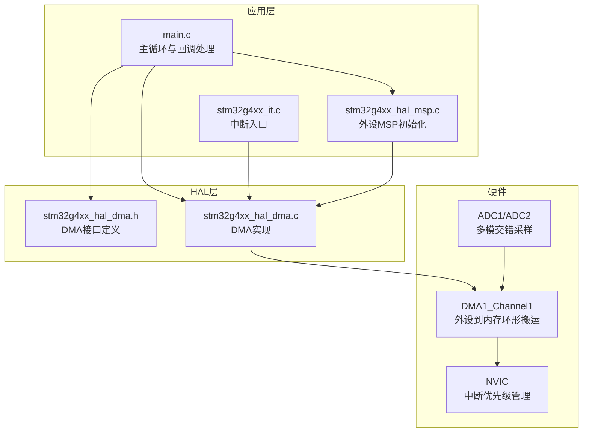
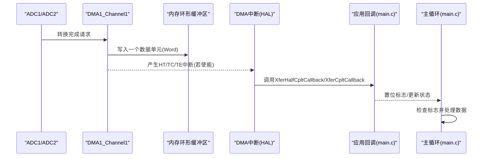
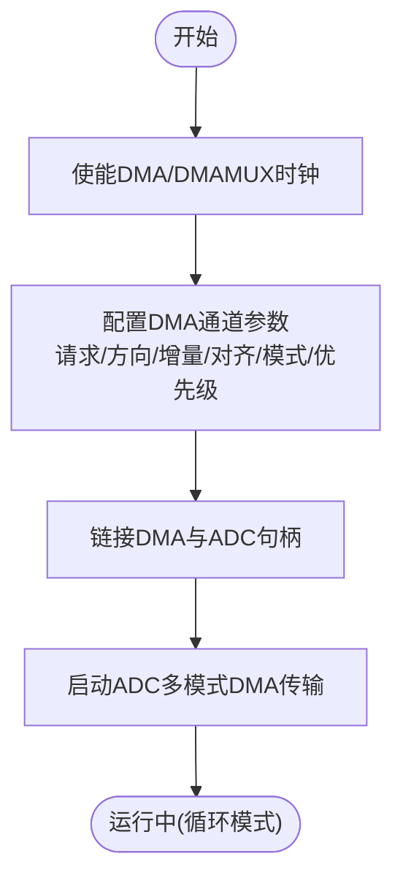
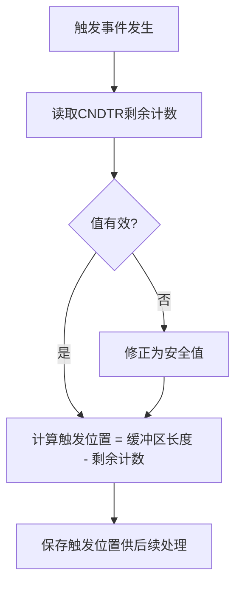
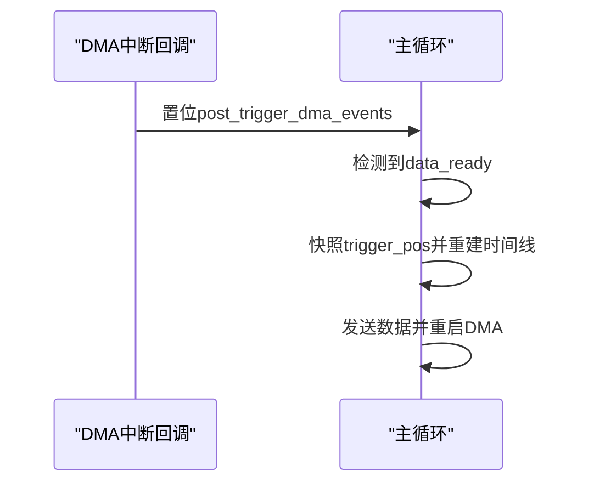
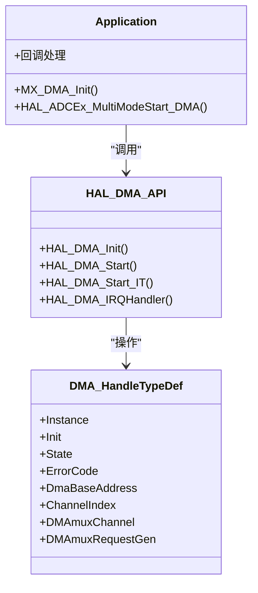

# DMA配置原理

<cite>
**本文引用的文件**   
- [Core/Src/main.c](file://Core/Src/main.c)
- [Core/Src/stm32g4xx_it.c](file://Core/Src/stm32g4xx_it.c)
- [Core/Src/stm32g4xx_hal_msp.c](file://Core/Src/stm32g4xx_hal_msp.c)
- [Drivers/STM32G4xx_HAL_Driver/Inc/stm32g4xx_hal_dma.h](file://Drivers/STM32G4xx_HAL_Driver/Inc/stm32g4xx_hal_dma.h)
- [Drivers/STM32G4xx_HAL_Driver/Src/stm32g4xx_hal_dma.c](file://Drivers/STM32G4xx_HAL_Driver/Src/stm32g4xx_hal_dma.c)
</cite>

## 目录
1. [简介](#简介)
2. [项目结构](#项目结构)
3. [核心组件](#核心组件)
4. [架构总览](#架构总览)
5. [详细组件分析](#详细组件分析)
6. [依赖关系分析](#依赖关系分析)
7. [性能与实时性考虑](#性能与实时性考虑)
8. [故障排查指南](#故障排查指南)
9. [结论](#结论)
10. [附录：寄存器操作与数据流示例](#附录寄存器操作与数据流示例)

## 简介
本技术文档围绕STM32 DMA控制器在该项目中的配置与使用，系统阐述DMA通道配置、传输方向设置、循环模式启用、NDTR（数据传输计数寄存器）的作用与读取方法、中断优先级与NVIC配置，并结合工程代码给出初始化流程、数据流图与关键路径的时序说明。读者可据此理解底层实现机制并应用于实际开发。

## 项目结构
本项目基于STM32G4系列，采用HAL库驱动ADC并通过DMA将转换结果搬运至内存，形成环形缓冲区；外部触发事件用于标记“触发时刻”，结合DMA剩余计数定位触发位置，最终在主循环中重组时间线并输出。

图表来源
- [Core/Src/main.c:219-290](file://Core/Src/main.c#L219-L290)
- [Core/Src/stm32g4xx_it.c:219-228](file://Core/Src/stm32g4xx_it.c#L219-L228)
- [Core/Src/stm32g4xx_hal_msp.c:127-148](file://Core/Src/stm32g4xx_hal_msp.c#L127-L148)
- [Drivers/STM32G4xx_HAL_Driver/Inc/stm32g4xx_hal_dma.h:759-778](file://Drivers/STM32G4xx_HAL_Driver/Inc/stm32g4xx_hal_dma.h#L759-L778)
- [Drivers/STM32G4xx_HAL_Driver/Src/stm32g4xx_hal_dma.c:378-483](file://Drivers/STM32G4xx_HAL_Driver/Src/stm32g4xx_hal_dma.c#L378-L483)

章节来源
- [Core/Src/main.c:219-290](file://Core/Src/main.c#L219-L290)
- [Core/Src/stm32g4xx_it.c:219-228](file://Core/Src/stm32g4xx_it.c#L219-L228)
- [Core/Src/stm32g4xx_hal_msp.c:127-148](file://Core/Src/stm32g4xx_hal_msp.c#L127-L148)
- [Drivers/STM32G4xx_HAL_Driver/Inc/stm32g4xx_hal_dma.h:759-778](file://Drivers/STM32G4xx_HAL_Driver/Inc/stm32g4xx_hal_dma.h#L759-L778)
- [Drivers/STM32G4xx_HAL_Driver/Src/stm32g4xx_hal_dma.c:378-483](file://Drivers/STM32G4xx_HAL_Driver/Src/stm32g4xx_hal_dma.c#L378-L483)

## 核心组件
- DMA句柄与配置结构体：包含请求源、传输方向、地址增量、数据宽度、模式（正常/循环）、优先级等字段。
- DMA控制宏与API：使能/禁用通道、开启/关闭中断、获取标志位、清除标志位、获取剩余计数等。
- 中断处理：DMA通道全局中断服务函数调用HAL层统一处理，分发到半传输/全传输/错误回调。
- 应用层回调：ADC HAL通过回调间接调用用户注册的DMA回调，完成业务逻辑。

章节来源
- [Drivers/STM32G4xx_HAL_Driver/Inc/stm32g4xx_hal_dma.h:46-74](file://Drivers/STM32G4xx_HAL_Driver/Inc/stm32g4xx_hal_dma.h#L46-L74)
- [Drivers/STM32G4xx_HAL_Driver/Inc/stm32g4xx_hal_dma.h:735-741](file://Drivers/STM32G4xx_HAL_Driver/Inc/stm32g4xx_hal_dma.h#L735-L741)
- [Drivers/STM32G4xx_HAL_Driver/Src/stm32g4xx_hal_dma.c:748-800](file://Drivers/STM32G4xx_HAL_Driver/Src/stm32g4xx_hal_dma.c#L748-L800)
- [Core/Src/stm32g4xx_it.c:219-228](file://Core/Src/stm32g4xx_it.c#L219-L228)

## 架构总览
下图展示了从ADC转换到DMA搬运再到内存缓冲区的完整数据流，以及中断与主循环的交互。

图表来源
- [Core/Src/main.c:136-149](file://Core/Src/main.c#L136-L149)
- [Drivers/STM32G4xx_HAL_Driver/Src/stm32g4xx_hal_dma.c:748-800](file://Drivers/STM32G4xx_HAL_Driver/Src/stm32g4xx_hal_dma.c#L748-L800)
- [Core/Src/stm32g4xx_it.c:219-228](file://Core/Src/stm32g4xx_it.c#L219-L228)

## 详细组件分析

### DMA初始化与通道配置
- 时钟使能：DMA控制器与DMAMUX需先使能。
- 通道参数：选择请求源（如ADC1）、方向（外设到内存）、地址增量（外设不增、内存自增）、数据宽度（Word）、模式（循环）、优先级（低）。
- 链接DMA与ADC：通过宏将ADC句柄与DMA句柄绑定。
- 启动传输：调用ADC的多模式DMA启动API，内部会设置CNDTR、CPAR/CMAR并使能通道。

图表来源
- [Core/Src/main.c:469-481](file://Core/Src/main.c#L469-L481)
- [Core/Src/stm32g4xx_hal_msp.c:127-148](file://Core/Src/stm32g4xx_hal_msp.c#L127-L148)
- [Core/Src/main.c:249-254](file://Core/Src/main.c#L249-L254)
- [Drivers/STM32G4xx_HAL_Driver/Src/stm32g4xx_hal_dma.c:378-410](file://Drivers/STM32G4xx_HAL_Driver/Src/stm32g4xx_hal_dma.c#L378-L410)

章节来源
- [Core/Src/main.c:469-481](file://Core/Src/main.c#L469-L481)
- [Core/Src/stm32g4xx_hal_msp.c:127-148](file://Core/Src/stm32g4xx_hal_msp.c#L127-L148)
- [Core/Src/main.c:249-254](file://Core/Src/main.c#L249-L254)
- [Drivers/STM32G4xx_HAL_Driver/Src/stm32g4xx_hal_dma.c:378-410](file://Drivers/STM32G4xx_HAL_Driver/Src/stm32g4xx_hal_dma.c#L378-L410)

### 传输方向与地址增量
- 方向：外设到内存（ADC→DMA→内存），对应方向常量。
- 地址增量：外设地址固定（ADC数据寄存器），内存地址自增以写入连续缓冲区。
- 数据宽度：外设与内存均为Word对齐，保证一次搬运一个字。

章节来源
- [Core/Src/stm32g4xx_hal_msp.c:130-135](file://Core/Src/stm32g4xx_hal_msp.c#L130-L135)
- [Drivers/STM32G4xx_HAL_Driver/Inc/stm32g4xx_hal_dma.h:359-400](file://Drivers/STM32G4xx_HAL_Driver/Inc/stm32g4xx_hal_dma.h#L359-L400)

### 循环模式启用
- 模式设置为循环，确保DMA在写满缓冲区后自动回到起始地址继续写入，适合持续采集场景。
- 非循环模式下，HAL会在半传输或全传输时自动关闭相应中断，而循环模式下保持中断可用。

章节来源
- [Core/Src/stm32g4xx_hal_msp.c:136](file://Core/Src/stm32g4xx_hal_msp.c#L136)
- [Drivers/STM32G4xx_HAL_Driver/Src/stm32g4xx_hal_dma.c:755-785](file://Drivers/STM32G4xx_HAL_Driver/Src/stm32g4xx_hal_dma.c#L755-L785)

### NDTR（数据传输计数寄存器）作用与用法
- CNDTR记录当前剩余待传输的数据单元数。
- 在环形缓冲场景中，可通过读取剩余计数推算当前写入指针位置，从而确定触发事件发生时的相对索引。
- 注意边界保护：当CNDTR为0或越界时，应做容错处理，避免误判。

图表来源
- [Core/Src/main.c:100-105](file://Core/Src/main.c#L100-L105)
- [Drivers/STM32G4xx_HAL_Driver/Inc/stm32g4xx_hal_dma.h:735-741](file://Drivers/STM32G4xx_HAL_Driver/Inc/stm32g4xx_hal_dma.h#L735-L741)
- [Drivers/STM32G4xx_HAL_Driver/Src/stm32g4xx_hal_dma.c:1022-1023](file://Drivers/STM32G4xx_HAL_Driver/Src/stm32g4xx_hal_dma.c#L1022-L1023)

章节来源
- [Core/Src/main.c:100-105](file://Core/Src/main.c#L100-L105)
- [Drivers/STM32G4xx_HAL_Driver/Inc/stm32g4xx_hal_dma.h:735-741](file://Drivers/STM32G4xx_HAL_Driver/Inc/stm32g4xx_hal_dma.h#L735-L741)
- [Drivers/STM32G4xx_HAL_Driver/Src/stm32g4xx_hal_dma.c:1022-1023](file://Drivers/STM32G4xx_HAL_Driver/Src/stm32g4xx_hal_dma.c#L1022-L1023)

### DMA中断优先级与NVIC设置
- 在DMA初始化中设置DMA通道中断优先级并启用中断。
- 中断服务函数中调用HAL统一处理，再分发到用户回调。
- 建议根据实时需求合理设置优先级，避免高负载任务阻塞关键中断。

章节来源
- [Core/Src/main.c:476-479](file://Core/Src/main.c#L476-L479)
- [Core/Src/stm32g4xx_it.c:219-228](file://Core/Src/stm32g4xx_it.c#L219-L228)
- [Drivers/STM32G4xx_HAL_Driver/Src/stm32g4xx_hal_dma.c:748-800](file://Drivers/STM32G4xx_HAL_Driver/Src/stm32g4xx_hal_dma.c#L748-L800)

### 回调与主循环协作
- 半传输/全传输回调用于统计事件次数，达到阈值后停止DMA并置位数据就绪标志。
- 主循环检测标志后，快照触发位置，重建线性时间线，并通过USB CDC发送数据，然后重启DMA等待下一次触发。

图表来源
- [Core/Src/main.c:119-131](file://Core/Src/main.c#L119-L131)
- [Core/Src/main.c:136-149](file://Core/Src/main.c#L136-L149)
- [Core/Src/main.c:264-287](file://Core/Src/main.c#L264-L287)

章节来源
- [Core/Src/main.c:119-131](file://Core/Src/main.c#L119-L131)
- [Core/Src/main.c:136-149](file://Core/Src/main.c#L136-L149)
- [Core/Src/main.c:264-287](file://Core/Src/main.c#L264-L287)

## 依赖关系分析
- main.c依赖HAL DMA API进行启动与状态查询，依赖中断服务函数转发到HAL处理。
- HAL DMA实现负责寄存器级操作（CCR/CNDTR/CPAR/CMAR/IFCR/ISR等）和DMAMUX配置。
- MSP文件完成DMA通道具体参数配置并与ADC句柄绑定。

图表来源
- [Drivers/STM32G4xx_HAL_Driver/Inc/stm32g4xx_hal_dma.h:113-151](file://Drivers/STM32G4xx_HAL_Driver/Inc/stm32g4xx_hal_dma.h#L113-L151)
- [Drivers/STM32G4xx_HAL_Driver/Inc/stm32g4xx_hal_dma.h:759-778](file://Drivers/STM32G4xx_HAL_Driver/Inc/stm32g4xx_hal_dma.h#L759-L778)
- [Core/Src/main.c:469-481](file://Core/Src/main.c#L469-L481)

章节来源
- [Drivers/STM32G4xx_HAL_Driver/Inc/stm32g4xx_hal_dma.h:113-151](file://Drivers/STM32G4xx_HAL_Driver/Inc/stm32g4xx_hal_dma.h#L113-L151)
- [Drivers/STM32G4xx_HAL_Driver/Inc/stm32g4xx_hal_dma.h:759-778](file://Drivers/STM32G4xx_HAL_Driver/Inc/stm32g4xx_hal_dma.h#L759-L778)
- [Core/Src/main.c:469-481](file://Core/Src/main.c#L469-L481)

## 性能与实时性考虑
- 循环模式避免频繁重配DMA，降低CPU开销。
- 使用半传输/全传输回调可实现双缓冲式处理，提高吞吐。
- 读取CNDTR应在临界段内快速完成，避免被更高优先级中断打断导致位置误判。
- 合理设置DMA与外设中断优先级，确保关键路径及时响应。

[本节为通用指导，无需源码引用]

## 故障排查指南
- 无中断进入：检查NVIC是否使能DMA通道中断，确认回调是否注册。
- 数据错位：核对方向与地址增量配置是否正确，确认外设与内存数据宽度一致。
- 循环未生效：确认模式设置为循环，且未在内存到内存模式下启用循环。
- 触发位置异常：增加对CNDTR的边界保护，避免在重载瞬间读到0或越界值。

章节来源
- [Core/Src/main.c:476-479](file://Core/Src/main.c#L476-L479)
- [Core/Src/stm32g4xx_it.c:219-228](file://Core/Src/stm32g4xx_it.c#L219-L228)
- [Core/Src/main.c:100-105](file://Core/Src/main.c#L100-L105)
- [Drivers/STM32G4xx_HAL_Driver/Src/stm32g4xx_hal_dma.c:632-637](file://Drivers/STM32G4xx_HAL_Driver/Src/stm32g4xx_hal_dma.c#L632-L637)

## 结论
通过合理的DMA通道配置、循环模式启用与中断优先级设置，结合NDTR的剩余计数读取，可在高频采样场景下稳定捕获触发事件并重建时间线。HAL层封装简化了寄存器操作，但理解底层机制有助于优化与排障。

[本节为总结，无需源码引用]

## 附录：寄存器操作与数据流示例
- 关键寄存器
  - CCR：控制寄存器（方向、增量、模式、中断使能等）
  - CNDTR：剩余传输计数
  - CPAR/CMAR：外设与内存地址寄存器
  - ISR/IFCR：中断状态与清除寄存器
- 典型操作流程
  - 初始化：配置CCR、设置请求源、使能中断
  - 启动：设置CNDTR、CPAR/CMAR、使能通道
  - 运行：外设触发DMA搬运，更新CNDTR，到达阈值产生HT/TC中断
  - 处理：在中断中清标志、调用回调；主循环读取CNDTR定位触发点

章节来源
- [Drivers/STM32G4xx_HAL_Driver/Src/stm32g4xx_hal_dma.c:1008-1043](file://Drivers/STM32G4xx_HAL_Driver/Src/stm32g4xx_hal_dma.c#L1008-L1043)
- [Drivers/STM32G4xx_HAL_Driver/Inc/stm32g4xx_hal_dma.h:498-506](file://Drivers/STM32G4xx_HAL_Driver/Inc/stm32g4xx_hal_dma.h#L498-L506)
- [Drivers/STM32G4xx_HAL_Driver/Inc/stm32g4xx_hal_dma.h:709-733](file://Drivers/STM32G4xx_HAL_Driver/Inc/stm32g4xx_hal_dma.h#L709-L733)