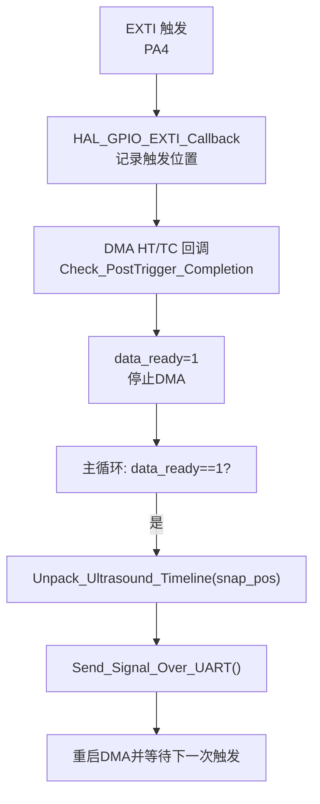
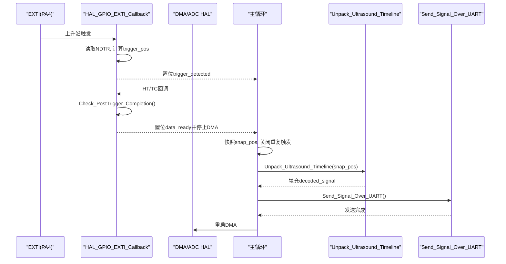
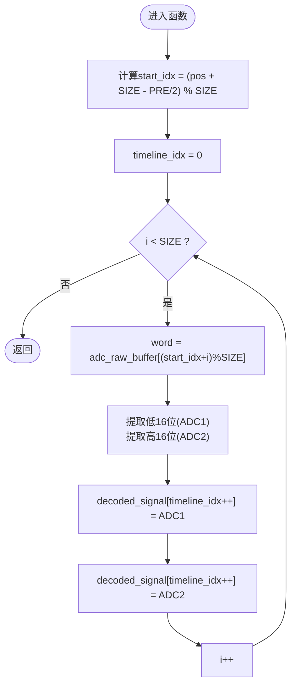
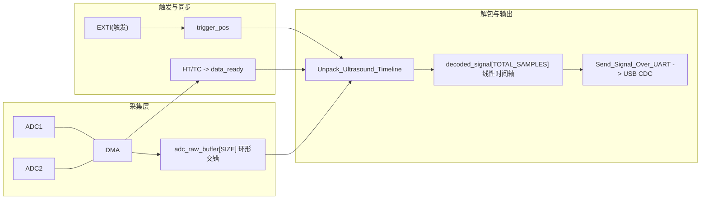
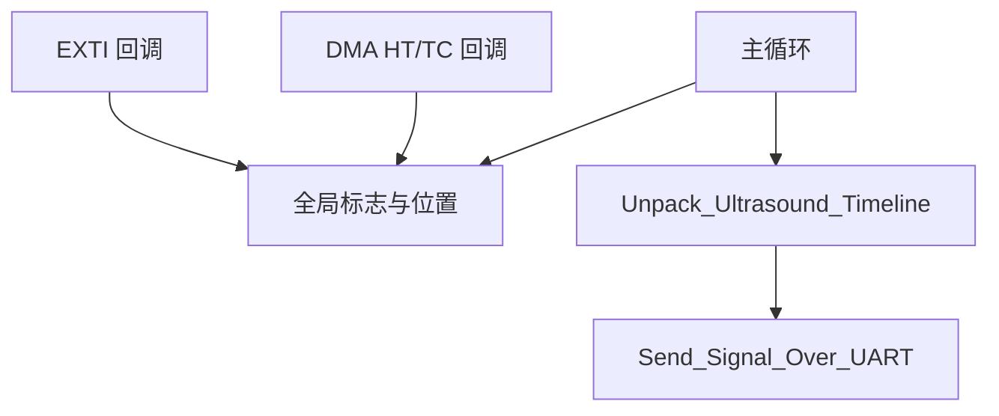

# 数据打包解包算法

<cite>
**本文引用的文件**   
- [main.c](file://Core/Src/main.c)
</cite>

## 目录
1. [简介](#简介)
2. [项目结构](#项目结构)
3. [核心组件](#核心组件)
4. [架构总览](#架构总览)
5. [详细组件分析](#详细组件分析)
6. [依赖关系分析](#依赖关系分析)
7. [性能考量](#性能考量)
8. [故障排查指南](#故障排查指南)
9. [结论](#结论)
10. [附录](#附录)

## 简介
本技术文档聚焦于超声数据采集与处理中的“数据打包/解包”算法，重点解析从环形缓冲区到线性时间轴的转换过程、触发位置计算、交错数据的重组（ADC1/ADC2分离与重排）、索引计算与边界处理（取模与溢出保护），并提供数据流向图与时间轴重建示例，帮助读者深入理解 Unpack_Ultrasound_Timeline 函数的实现逻辑。

## 项目结构
本项目为基于 STM32G4 的嵌入式应用，采用 DMA + ADC 双通道交错采集，通过 EXTI 外部中断捕获触发时刻，随后在主循环中完成数据解包与串口输出。关键代码集中在 main.c 中，包含：
- 环形缓冲与全局变量定义
- 触发检测与 DMA 回调
- 解包函数 Unpack_Ultrasound_Timeline
- 数据发送函数 Send_Signal_Over_UART
- ADC/DMA/GPIO/USB CDC 初始化与主循环控制流

图表来源
- [main.c:91-113](file://Core/Src/main.c#L91-L113)
- [main.c:119-131](file://Core/Src/main.c#L119-L131)
- [main.c:136-149](file://Core/Src/main.c#L136-L149)
- [main.c:156-171](file://Core/Src/main.c#L156-L171)
- [main.c:178-212](file://Core/Src/main.c#L178-L212)
- [main.c:259-290](file://Core/Src/main.c#L259-L290)

章节来源
- [main.c:52-70](file://Core/Src/main.c#L52-L70)
- [main.c:242-290](file://Core/Src/main.c#L242-L290)

## 核心组件
- 环形缓冲区 adc_raw_buffer[CIRCULAR_BUFFER_SIZE]：由 DMA 以 uint32_t 写入，低16位为 ADC1 样本，高16位为 ADC2 样本，形成交错打包格式。
- 线性时间轴 decoded_signal[TOTAL_SAMPLES]：解包后的顺序化一维数组，按时间先后存放所有样本。
- 触发相关标志与位置：trigger_detected、trigger_pos、post_trigger_dma_events、data_ready、uart_busy。
- 解包函数 Unpack_Ultrasound_Timeline(pos)：将环形缓冲区按时间顺序展开至线性时间轴，同时分离 ADC1/ADC2 数据。
- 传输函数 Send_Signal_Over_UART()：将解码后的信号序列化为文本并通过 USB CDC 发送。

章节来源
- [main.c:52-70](file://Core/Src/main.c#L52-L70)
- [main.c:156-171](file://Core/Src/main.c#L156-L171)
- [main.c:178-212](file://Core/Src/main.c#L178-L212)

## 架构总览
系统工作流如下：
- ADC1/ADC2 在双通道交错模式下运行，DMA 以循环模式将每字（uint32_t）写入 adc_raw_buffer，其中低16位为 ADC1，高16位为 ADC2。
- PA4 上升沿触发时，EXTI 回调读取 DMA 剩余计数，计算触发点在环形缓冲中的位置 trigger_pos，并置位 trigger_detected。
- 当 DMA 半传输（HT）和全传输（TC）各发生一次后，Check_PostTrigger_Completion 停止 DMA 并置位 data_ready。
- 主循环检测到 data_ready 后，快照 trigger_pos，调用 Unpack_Ultrasound_Timeline 进行解包，再通过 Send_Signal_Over_UART 输出，最后重启 DMA 等待下一次触发。

图表来源
- [main.c:91-113](file://Core/Src/main.c#L91-L113)
- [main.c:119-131](file://Core/Src/main.c#L119-L131)
- [main.c:136-149](file://Core/Src/main.c#L136-L149)
- [main.c:156-171](file://Core/Src/main.c#L156-L171)
- [main.c:178-212](file://Core/Src/main.c#L178-L212)
- [main.c:259-290](file://Core/Src/main.c#L259-L290)

## 详细组件分析

### Unpack_Ultrasound_Timeline 函数详解
该函数负责将环形缓冲区中的数据按时间顺序展开到线性时间轴，并完成 ADC1/ADC2 的分离与重排。

- 输入参数 pos：触发时刻对应的环形缓冲区索引快照（来自 trigger_pos）。
- 起始索引 start_idx：根据触发位置与预触发窗口大小计算，确保时间轴起点位于触发前适当位置。
- 遍历策略：以 start_idx 为起点，按 i 递增并在环形缓冲上取模访问，保证跨环边界的正确性。
- 数据分离：每个 uint32_t 字包含两个16位样本，低16位为 ADC1，高16位为 ADC2；依次写入 decoded_signal 的偶数与奇数索引，形成交错输出的时序序列。

图表来源
- [main.c:156-171](file://Core/Src/main.c#L156-L171)

章节来源
- [main.c:156-171](file://Core/Src/main.c#L156-L171)

#### 触发位置计算算法与 PRE_TRIGGER_SAMPLES / POST_TRIGGER_SAMPLES 配置原理
- 触发位置 trigger_pos：在 EXTI 回调中通过 DMA 剩余计数 NDTR 计算得到，表示当前 DMA 写入指针在环形缓冲中的位置。
- 预触发与后触发窗口：
  - PRE_TRIGGER_SAMPLES：触发前的采样点数，用于捕捉触发事件之前的波形片段。
  - POST_TRIGGER_SAMPLES：触发后的采样点数，用于捕捉触发事件之后的波形片段。
- 时间轴起点调整：在 Unpack_Ultrasound_Timeline 中，使用 (PRE_TRIGGER_SAMPLES / 2) 对 start_idx 进行偏移，使时间轴中心大致对齐触发点，从而兼顾前后窗口。
- 边界保护：EXTI 回调中对 remaining 做边界检查，避免 NDTR 瞬时为 0 或越界导致的错误索引。

章节来源
- [main.c:91-113](file://Core/Src/main.c#L91-L113)
- [main.c:156-171](file://Core/Src/main.c#L156-L171)

#### 交错数据的重组过程（ADC1/ADC2 分离与重新排序）
- 打包格式：adc_raw_buffer 每个元素为 uint32_t，低16位为 ADC1，高16位为 ADC2，形成交错打包。
- 解包策略：在遍历过程中，先写 ADC1 再写 ADC2，分别放入 decoded_signal 的偶数与奇数索引，保持时间顺序。
- 结果：decoded_signal 成为线性时间轴上的完整样本序列，便于后续处理或可视化。

章节来源
- [main.c:57-62](file://Core/Src/main.c#L57-L62)
- [main.c:156-171](file://Core/Src/main.c#L156-L171)

#### 索引计算与边界处理（取模运算与溢出处理）
- 环形索引计算：buf_idx = (start_idx + i) % SIZE，确保在环形缓冲上正确回绕。
- 起始索引计算：start_idx = (pos + SIZE - (PRE_TRIGGER_SAMPLES / 2)) % SIZE，防止负数下溢。
- 溢出保护：EXTI 回调中对 remaining 进行范围校验，避免 NDTR 瞬态导致的位置错误。
- 原子性保障：主循环在调用解包前先快照 trigger_pos 并关闭重复触发，避免 ISR 修改造成不一致。

章节来源
- [main.c:91-113](file://Core/Src/main.c#L91-L113)
- [main.c:156-171](file://Core/Src/main.c#L156-L171)
- [main.c:259-290](file://Core/Src/main.c#L259-L290)

#### 数据流向图与时间轴重建示例
- 数据流向：
  - ADC1/ADC2 -> DMA -> adc_raw_buffer（环形，交错打包）
  - EXTI 触发 -> 记录 trigger_pos
  - DMA HT/TC -> 停止DMA并置位 data_ready
  - 主循环 -> Unpack_Ultrasound_Timeline -> decoded_signal（线性时间轴）
  - Send_Signal_Over_UART -> USB CDC 输出
- 时间轴重建示例（概念示意）：
  - 假设 SIZE=120，PRE_TRIGGER_SAMPLES=80，POST_TRIGGER_SAMPLES=160。
  - 触发位置 pos 对应环形缓冲某索引，start_idx 向前偏移 PRE/2 个单位，确保时间轴覆盖触发前后。
  - 遍历 SIZE 次，每次取出一个 uint32_t，拆分为 ADC1/ADC2 写入 decoded_signal，最终得到按时间顺序排列的 240 个样本。

图表来源
- [main.c:52-70](file://Core/Src/main.c#L52-L70)
- [main.c:91-113](file://Core/Src/main.c#L91-L113)
- [main.c:119-131](file://Core/Src/main.c#L119-L131)
- [main.c:156-171](file://Core/Src/main.c#L156-L171)
- [main.c:178-212](file://Core/Src/main.c#L178-L212)
- [main.c:259-290](file://Core/Src/main.c#L259-L290)

## 依赖关系分析
- 模块耦合：
  - EXTI 回调与 DMA 回调共同维护触发状态与数据就绪标志。
  - 主循环依赖这些标志协调解包与传输流程。
  - 解包函数仅依赖环形缓冲与全局常量，具备良好内聚性。
- 外部依赖：
  - HAL ADC/DMA 驱动提供多模式与 DMA 回调机制。
  - USB CDC 用于数据传输。
- 潜在循环依赖：无直接循环依赖，但需注意标志位的读写顺序与临界区保护。

图表来源
- [main.c:91-113](file://Core/Src/main.c#L91-L113)
- [main.c:119-131](file://Core/Src/main.c#L119-L131)
- [main.c:156-171](file://Core/Src/main.c#L156-L171)
- [main.c:178-212](file://Core/Src/main.c#L178-L212)
- [main.c:259-290](file://Core/Src/main.c#L259-L290)

章节来源
- [main.c:91-113](file://Core/Src/main.c#L91-L113)
- [main.c:119-131](file://Core/Src/main.c#L119-L131)
- [main.c:156-171](file://Core/Src/main.c#L156-L171)
- [main.c:178-212](file://Core/Src/main.c#L178-L212)
- [main.c:259-290](file://Core/Src/main.c#L259-L290)

## 性能考量
- 解包复杂度：O(SIZE)，每次触发进行一次线性扫描，适合实时处理。
- 内存占用：环形缓冲与线性时间轴均为固定大小，避免动态分配开销。
- 中断开销：EXTI 回调与 DMA 回调尽量轻量，减少耗时操作。
- 传输优化：批量构建输出缓冲区后一次性发送，降低 USB CDC 调用次数。

## 故障排查指南
- 触发丢失或重复触发：
  - 检查 uart_busy 与 trigger_detected 的互斥逻辑，确保传输期间忽略新触发。
  - 确认 EXTI 引脚配置与中断优先级。
- 触发位置异常：
  - 验证 remaining 的边界保护逻辑，避免 NDTR 瞬态为 0 或越界。
  - 核对 CIRCULAR_BUFFER_SIZE 与实际 DMA 配置一致。
- 数据错位或乱序：
  - 确认 start_idx 计算与取模逻辑正确。
  - 检查 ADC1/ADC2 分离位掩码与移位操作是否匹配打包格式。
- 数据未就绪或卡死：
  - 检查 Check_PostTrigger_Completion 的 HT/TC 计数条件，确保两次事件后停止 DMA 并置位 data_ready。
  - 确认主循环在完成后重启 DMA。

章节来源
- [main.c:91-113](file://Core/Src/main.c#L91-L113)
- [main.c:119-131](file://Core/Src/main.c#L119-L131)
- [main.c:156-171](file://Core/Src/main.c#L156-L171)
- [main.c:259-290](file://Core/Src/main.c#L259-L290)

## 结论
Unpack_Ultrasound_Timeline 函数通过精确的索引计算与取模回绕，将环形缓冲中的交错打包数据高效地转换为线性时间轴，并分离出 ADC1/ADC2 样本。配合 EXTI 触发与 DMA 回调的状态机，系统在实时性与可靠性之间取得平衡。合理的 PRE_TRIGGER_SAMPLES 与 POST_TRIGGER_SAMPLES 配置确保了触发前后波形的完整捕获。整体架构清晰、内聚性强，具备良好的可维护性与扩展性。

## 附录
- 关键常量说明：
  - CIRCULAR_BUFFER_SIZE：环形缓冲长度（uint32_t 数量）。
  - TOTAL_SAMPLES：线性时间轴样本总数（等于 CIRCULAR_BUFFER_SIZE * 2）。
  - PRE_TRIGGER_SAMPLES / POST_TRIGGER_SAMPLES：触发前后采样窗口大小。
- 数据格式约定：
  - adc_raw_buffer 每个元素为 uint32_t，低16位为 ADC1，高16位为 ADC2。
  - decoded_signal 为 uint16_t 线性序列，按时间顺序交替存放 ADC1/ADC2。

章节来源
- [main.c:52-70](file://Core/Src/main.c#L52-L70)
- [main.c:156-171](file://Core/Src/main.c#L156-L171)