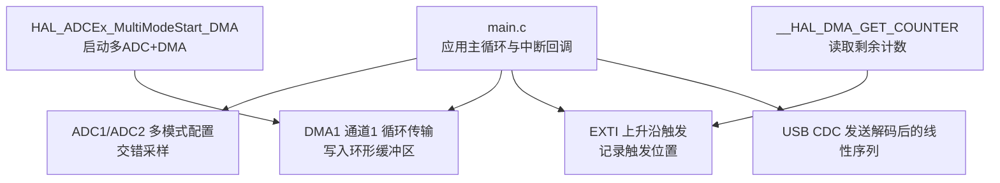
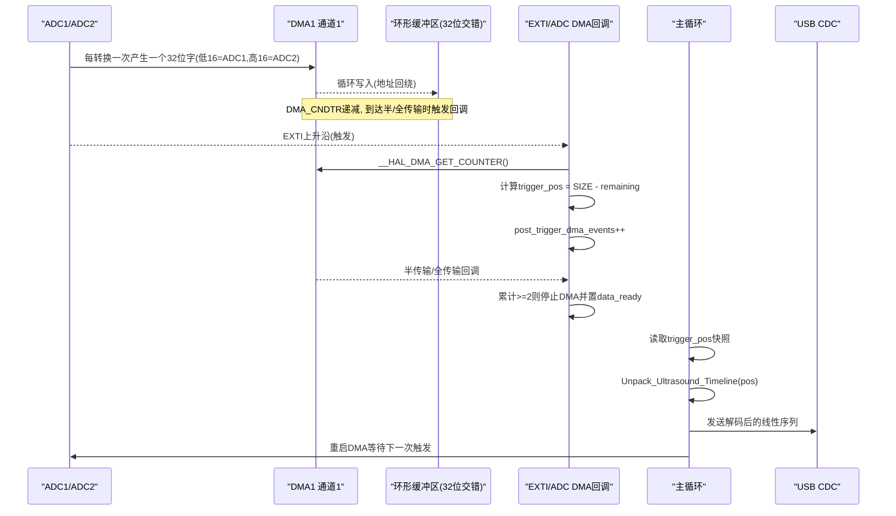
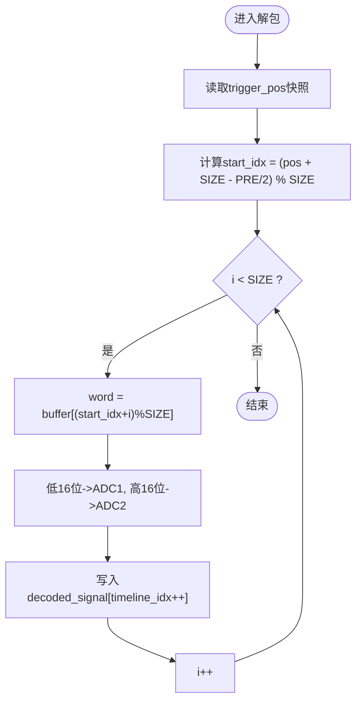
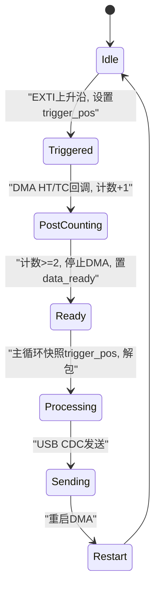
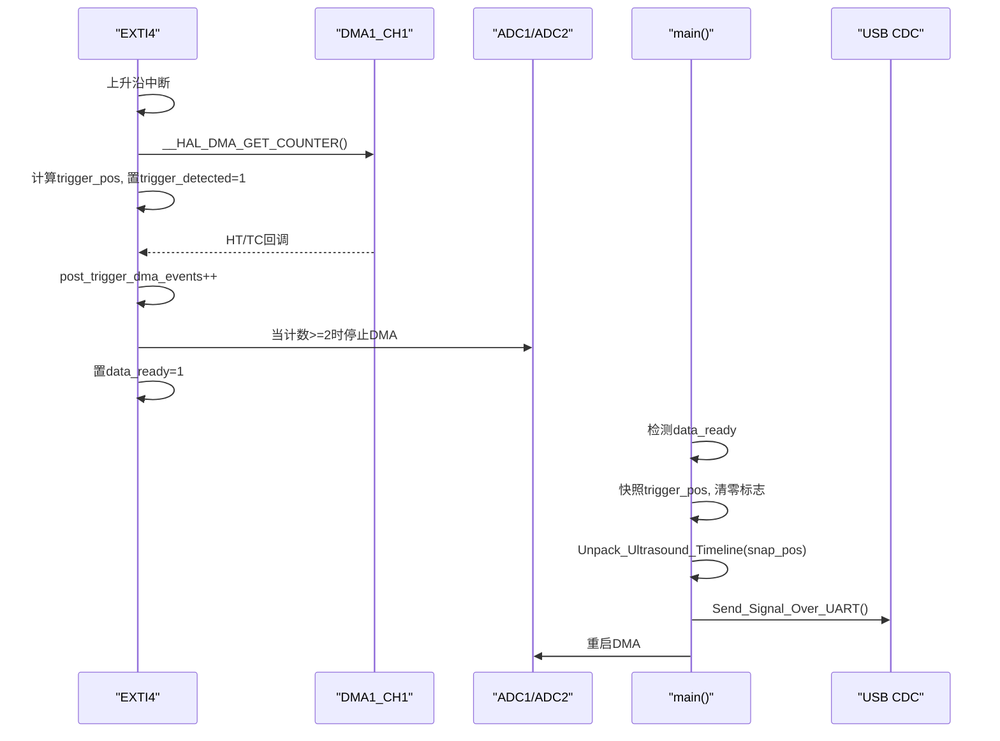
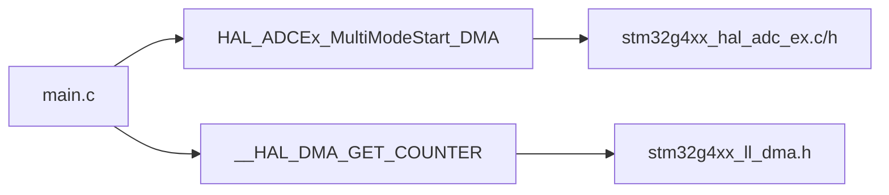

# 环形缓冲区设计

<cite>
**本文引用的文件**
- [Core/Src/main.c](file://Core/Src/main.c)
- [Core/Inc/main.h](file://Core/Inc/main.h)
- [Drivers/STM32G4xx_HAL_Driver/Inc/stm32g4xx_hal_adc_ex.h](file://Drivers/STM32G4xx_HAL_Driver/Inc/stm32g4xx_hal_adc_ex.h)
- [Drivers/STM32G4xx_HAL_Driver/Inc/stm32g4xx_hal_dma.h](file://Drivers/STM32G4xx_HAL_Driver/Inc/stm32g4xx_hal_dma.h)
- [Drivers/STM32G4xx_HAL_Driver/Inc/stm32g4xx_ll_dma.h](file://Drivers/STM32G4xx_HAL_Driver/Inc/stm32g4xx_ll_dma.h)
- [Drivers/STM32G4xx_HAL_Driver/Src/stm32g4xx_hal_adc_ex.c](file://Drivers/STM32G4xx_HAL_Driver/Src/stm32g4xx_hal_adc_ex.c)
</cite>

## 目录
1. [简介](#简介)
2. [项目结构](#项目结构)
3. [核心组件](#核心组件)
4. [架构总览](#架构总览)
5. [详细组件分析](#详细组件分析)
6. [依赖关系分析](#依赖关系分析)
7. [性能与内存分析](#性能与内存分析)
8. [故障排查指南](#故障排查指南)
9. [结论](#结论)

## 简介
本技术文档围绕 STM32G4 平台上的双 ADC 交错采样与 DMA 环形缓冲区实现，系统性阐述以下要点：
- 32位交错存储格式的设计思路：低16位存放 ADC1 数据、高16位存放 ADC2 数据。
- 缓冲区大小选择策略（CIRCULAR_BUFFER_SIZE = 120）与内存布局优化。
- 环形索引计算算法与边界处理（取模运算）。
- 缓冲区状态管理策略：读写指针同步与数据完整性保证。
- 内存使用分析与性能优化技巧，包括零拷贝数据处理方法。

该方案基于 HAL 库的多模式 ADC 与 DMA 循环传输，结合 EXTI 触发事件，实现对超声信号的“预触发+后触发”捕获并通过 USB CDC 上报。

## 项目结构
本项目为基于 STM32CubeMX 生成的裸机工程，核心逻辑集中在应用层 main.c 中，HAL 驱动位于 Drivers 目录。环形缓冲区的定义、DMA 回调、触发处理与数据解包均位于同一文件中，便于理解控制流与数据流。

图表来源
- [Core/Src/main.c:248-287](file://Core/Src/main.c#L248-L287)
- [Core/Src/main.c:91-113](file://Core/Src/main.c#L91-L113)
- [Core/Src/main.c:156-171](file://Core/Src/main.c#L156-L171)
- [Drivers/STM32G4xx_HAL_Driver/Src/stm32g4xx_hal_adc_ex.c:862-942](file://Drivers/STM32G4xx_HAL_Driver/Src/stm32g4xx_hal_adc_ex.c#L862-L942)
- [Drivers/STM32G4xx_HAL_Driver/Inc/stm32g4xx_hal_dma.h:739](file://Drivers/STM32G4xx_HAL_Driver/Inc/stm32g4xx_hal_dma.h#L739)

章节来源
- [Core/Src/main.c:219-290](file://Core/Src/main.c#L219-L290)
- [Core/Inc/main.h:1-70](file://Core/Inc/main.h#L1-L70)

## 核心组件
- 环形缓冲区与常量定义
  - 环形缓冲区大小：CIRCULAR_BUFFER_SIZE = 120（uint32_t 元素），每个元素包含一次 ADC1 和一次 ADC2 的采样结果，合计 240 个样本点。
  - 线性重建数组：decoded_signal[TOTAL_SAMPLES]，用于按时间顺序存放解包后的 16 位样本。
  - 触发相关标志与位置：trigger_detected、trigger_pos、post_trigger_dma_events、data_ready、uart_busy。
- DMA 与 ADC 多模式
  - 通过 HAL_ADCEx_MultiModeStart_DMA 启动 ADC1/ADC2 交错模式，DMA 以循环方式将 32 位打包数据写入环形缓冲区。
  - DMA 半传输与全传输回调用于统计后触发完成次数，确保至少采集到足够的后触发数据。
- 触发与位置快照
  - EXTI 上升沿中断中读取 DMA 剩余计数，计算触发时刻在环形缓冲区中的写入位置 trigger_pos。
- 数据解包与输出
  - Unpack_Ultrasound_Timeline 根据 trigger_pos 与预触发样本数，从环形缓冲区按时间顺序解出线性序列。
  - Send_Signal_Over_UART 将线性序列转换为文本并通过 USB CDC 一次性发送。

章节来源
- [Core/Src/main.c:52-70](file://Core/Src/main.c#L52-L70)
- [Core/Src/main.c:91-113](file://Core/Src/main.c#L91-L113)
- [Core/Src/main.c:119-149](file://Core/Src/main.c#L119-L149)
- [Core/Src/main.c:156-171](file://Core/Src/main.c#L156-L171)
- [Core/Src/main.c:178-212](file://Core/Src/main.c#L178-L212)
- [Core/Src/main.c:248-287](file://Core/Src/main.c#L248-L287)

## 架构总览
下图展示了从硬件采集到用户输出的完整数据流与控制流，重点体现环形缓冲区的 32 位交错格式、触发定位与线性重建过程。

图表来源
- [Core/Src/main.c:91-113](file://Core/Src/main.c#L91-L113)
- [Core/Src/main.c:119-149](file://Core/Src/main.c#L119-L149)
- [Core/Src/main.c:156-171](file://Core/Src/main.c#L156-L171)
- [Core/Src/main.c:178-212](file://Core/Src/main.c#L178-L212)
- [Core/Src/main.c:248-287](file://Core/Src/main.c#L248-L287)
- [Drivers/STM32G4xx_HAL_Driver/Inc/stm32g4xx_hal_dma.h:739](file://Drivers/STM32G4xx_HAL_Driver/Inc/stm32g4xx_hal_dma.h#L739)

## 详细组件分析

### 32位交错存储格式设计
- 数据组织
  - 环形缓冲区元素类型为 uint32_t，每个元素包含两个 16 位样本：低16位为 ADC1 的采样值，高16位为 ADC2 的采样值。
  - 这种打包方式充分利用了 DMA 单次传输宽度，减少传输次数与总线开销，同时保持 ADC1/ADC2 的时间对齐。
- 解包逻辑
  - 解包函数按环形顺序遍历缓冲区，依次提取低16位与高16位，填充到线性数组 decoded_signal，得到严格时序的样本序列。
- 优点
  - 降低 CPU 参与搬运的次数；
  - 简化后续信号处理对时间戳与相位关系的处理；
  - 有利于缓存局部性，提高解包效率。

章节来源
- [Core/Src/main.c:58-62](file://Core/Src/main.c#L58-L62)
- [Core/Src/main.c:156-171](file://Core/Src/main.c#L156-L171)

### 缓冲区大小选择策略与内存布局优化
- 缓冲区大小
  - CIRCULAR_BUFFER_SIZE = 120（uint32_t），对应 240 个 16 位样本点。
  - 预触发样本 PRE_TRIGGER_SAMPLES = 80，后触发样本 POST_TRIGGER_SAMPLES = 160，合计 240，正好填满环形缓冲区容量。
- 选择依据
  - 满足“前80 + 后160”的触发窗口需求；
  - 与 DMA 半/全传输阈值配合，确保两次回调（HT+TC）能覆盖足够后触发数据；
  - 控制内存占用，避免过大导致堆栈或全局变量压力。
- 内存布局
  - adc_raw_buffer 为全局静态数组，位于 RAM 段，DMA 直接写入；
  - decoded_signal 为线性重建区，解包后供上层处理或串口发送；
  - 标志位与计数器均为 volatile，保证中断与主循环间的可见性与原子性。

章节来源
- [Core/Src/main.c:52-70](file://Core/Src/main.c#L52-L70)
- [Core/Src/main.c:119-149](file://Core/Src/main.c#L119-L149)

### 环形索引计算算法与边界处理
- 触发位置计算
  - 在 EXTI 中断中读取 DMA 剩余计数 remaining = __HAL_DMA_GET_COUNTER(&hdma_adc1)。
  - 为防止 NDTR 重装载瞬态导致的 remaining==0 异常，进行边界保护，最小设为 1。
  - 触发位置 trigger_pos = CIRCULAR_BUFFER_SIZE - remaining，表示触发时刻对应的环形缓冲区写入索引。
- 线性重建起始索引
  - start_idx = (trigger_pos + CIRCULAR_BUFFER_SIZE - (PRE_TRIGGER_SAMPLES / 2)) % CIRCULAR_BUFFER_SIZE。
  - 由于每个环形元素包含两个样本，预触发样本数需折半换算为环形元素偏移。
- 遍历与取模
  - 对于 i 从 0 到 CIRCULAR_BUFFER_SIZE-1，buf_idx = (start_idx + i) % CIRCULAR_BUFFER_SIZE，实现环形回绕访问。
- 复杂度
  - 解包为 O(N)，N=CIRCULAR_BUFFER_SIZE，常数级操作，适合实时处理。

图表来源
- [Core/Src/main.c:156-171](file://Core/Src/main.c#L156-L171)
- [Core/Src/main.c:100-105](file://Core/Src/main.c#L100-L105)

章节来源
- [Core/Src/main.c:100-105](file://Core/Src/main.c#L100-L105)
- [Core/Src/main.c:156-171](file://Core/Src/main.c#L156-L171)

### 缓冲区状态管理与数据完整性保证
- 触发检测与防抖
  - EXTI 回调中检查 uart_busy 与 trigger_detected，防止 UART 传输期间误触发与重复触发。
- 后触发完成判定
  - 共享逻辑 Check_PostTrigger_Completion 在 HT/TC 回调中递增 post_trigger_dma_events，当累计达到 2 次时认为已采集到足够后触发数据，停止 DMA 并置 data_ready。
- 主循环原子性
  - 主循环检测到 data_ready 后，立即快照 trigger_pos 并清零相关标志，随后执行解包与发送，最后重启 DMA。
- 数据一致性
  - 通过 snapshot 机制与 volatile 标志，避免在解包过程中被中断修改 trigger_pos；
  - 使用 DMA 半/全传输事件作为“数据就绪”的可靠指示，确保数据完整性。

图表来源
- [Core/Src/main.c:91-113](file://Core/Src/main.c#L91-L113)
- [Core/Src/main.c:119-149](file://Core/Src/main.c#L119-L149)
- [Core/Src/main.c:264-287](file://Core/Src/main.c#L264-L287)

章节来源
- [Core/Src/main.c:91-113](file://Core/Src/main.c#L91-L113)
- [Core/Src/main.c:119-149](file://Core/Src/main.c#L119-L149)
- [Core/Src/main.c:264-287](file://Core/Src/main.c#L264-L287)

### 关键流程时序图（代码级映射）

图表来源
- [Core/Src/main.c:91-113](file://Core/Src/main.c#L91-L113)
- [Core/Src/main.c:119-149](file://Core/Src/main.c#L119-L149)
- [Core/Src/main.c:156-171](file://Core/Src/main.c#L156-L171)
- [Core/Src/main.c:178-212](file://Core/Src/main.c#L178-L212)
- [Core/Src/main.c:248-287](file://Core/Src/main.c#L248-L287)

## 依赖关系分析
- 应用层依赖 HAL 驱动
  - HAL_ADCEx_MultiModeStart_DMA 负责启动多模式 ADC 与 DMA 传输，并注册 DMA 回调。
  - __HAL_DMA_GET_COUNTER 宏直接访问 DMA 通道寄存器 CNDTR，获取剩余计数。
- 驱动层接口
  - stm32g4xx_hal_adc_ex.h 定义了多模式结构与常量（如 ADC_DUALMODE_INTERL）。
  - stm32g4xx_ll_dma.h 提供 DMA 底层操作（循环模式、CNDTR 访问等）。
- 耦合与内聚
  - 应用层集中了触发、解包与发送逻辑，内聚度高；
  - 与 HAL 驱动耦合清晰，仅通过标准 API 与宏访问外设。

图表来源
- [Core/Src/main.c:248-287](file://Core/Src/main.c#L248-L287)
- [Drivers/STM32G4xx_HAL_Driver/Inc/stm32g4xx_hal_adc_ex.h:445-449](file://Drivers/STM32G4xx_HAL_Driver/Inc/stm32g4xx_hal_adc_ex.h#L445-L449)
- [Drivers/STM32G4xx_HAL_Driver/Inc/stm32g4xx_hal_dma.h:739](file://Drivers/STM32G4xx_HAL_Driver/Inc/stm32g4xx_hal_dma.h#L739)
- [Drivers/STM32G4xx_HAL_Driver/Inc/stm32g4xx_ll_dma.h:981-1027](file://Drivers/STM32G4xx_HAL_Driver/Inc/stm32g4xx_ll_dma.h#L981-L1027)

章节来源
- [Core/Src/main.c:248-287](file://Core/Src/main.c#L248-L287)
- [Drivers/STM32G4xx_HAL_Driver/Inc/stm32g4xx_hal_adc_ex.h:445-449](file://Drivers/STM32G4xx_HAL_Driver/Inc/stm32g4xx_hal_adc_ex.h#L445-L449)
- [Drivers/STM32G4xx_HAL_Driver/Inc/stm32g4xx_hal_dma.h:739](file://Drivers/STM32G4xx_HAL_Driver/Inc/stm32g4xx_hal_dma.h#L739)
- [Drivers/STM32G4xx_HAL_Driver/Inc/stm32g4xx_ll_dma.h:981-1027](file://Drivers/STM32G4xx_HAL_Driver/Inc/stm32g4xx_ll_dma.h#L981-L1027)

## 性能与内存分析
- 内存占用
  - adc_raw_buffer: 120 × 4 字节 = 480 字节；
  - decoded_signal: 240 × 2 字节 = 480 字节；
  - 标志位与临时变量占用较小，整体 RAM 占用约 1KB 量级。
- 零拷贝数据处理
  - DMA 直接将 32 位交错数据写入环形缓冲区，无需中间拷贝；
  - 解包阶段仅做位域拆分与顺序重排，属于轻量级 CPU 操作；
  - 发送阶段构建一次性文本缓冲区，减少多次系统调用开销。
- 优化建议
  - 若需要更高吞吐，可考虑将解包与发送合并为流水线，利用双缓冲交替处理；
  - 针对 USB CDC 发送，可使用非阻塞队列与 DMA 传输进一步降低 CPU 负载；
  - 合理调整 CIRCULAR_BUFFER_SIZE 以满足不同触发窗口需求，避免过大的缓冲区造成缓存抖动。

[本节为通用性能讨论，不直接分析具体文件，故无章节来源]

## 故障排查指南
- 常见问题
  - 触发位置异常：检查 __HAL_DMA_GET_COUNTER 返回值是否为 0 或越界，确认边界保护逻辑生效。
  - 数据不完整：确认 HT/TC 回调是否都被调用，post_trigger_dma_events 是否正确累计至 2。
  - 重复触发：检查 uart_busy 与 trigger_detected 标志，确保在发送期间忽略新触发。
  - 解包错位：核对 PRE_TRIGGER_SAMPLES 与环形元素偏移的换算（除以 2），以及取模运算的正确性。
- 调试手段
  - 在 EXTI 与 DMA 回调中加入断点或 LED 翻转，验证中断路径；
  - 打印 trigger_pos 与 remaining，观察触发时刻与 DMA 计数关系；
  - 对比 decoded_signal 的前后波形，确认时间顺序正确。

章节来源
- [Core/Src/main.c:100-105](file://Core/Src/main.c#L100-L105)
- [Core/Src/main.c:119-149](file://Core/Src/main.c#L119-L149)
- [Core/Src/main.c:156-171](file://Core/Src/main.c#L156-L171)

## 结论
本方案通过双 ADC 交错模式与 DMA 循环传输，实现了高效、可靠的环形缓冲区数据采集与触发捕获。32 位交错格式在保证时间对齐的同时降低了传输开销；基于 DMA 剩余计数的触发位置快照与 HT/TC 事件计数，确保了数据完整性与一致性。整体内存占用小、CPU 负载低，适合高速超声信号采集与实时处理场景。

[本节为总结性内容，不直接分析具体文件，故无章节来源]