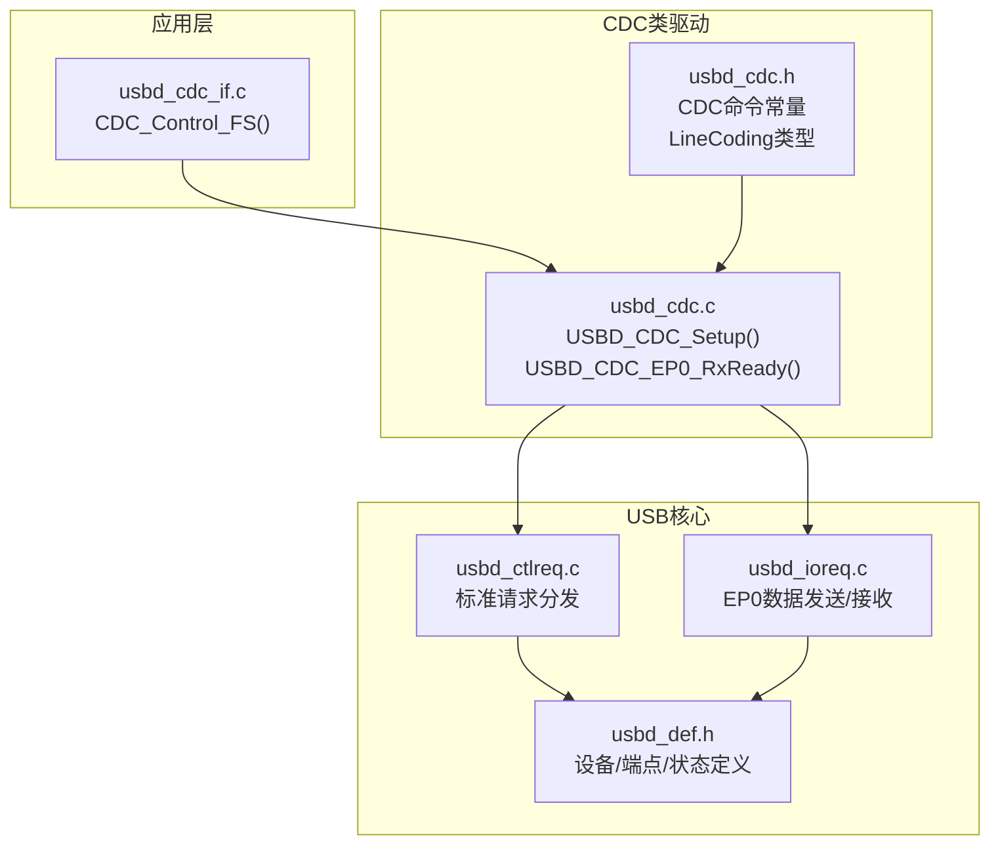
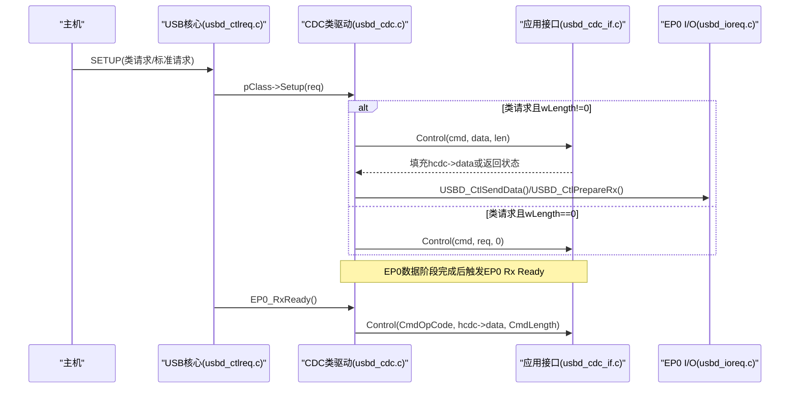
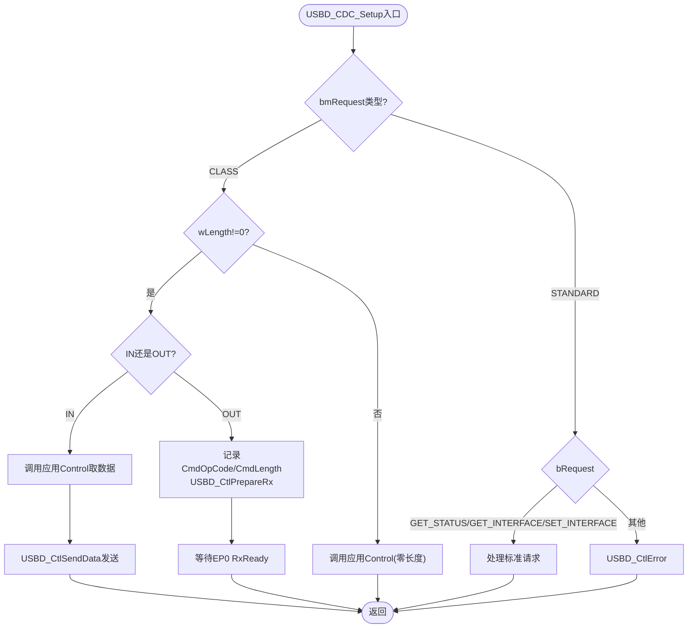
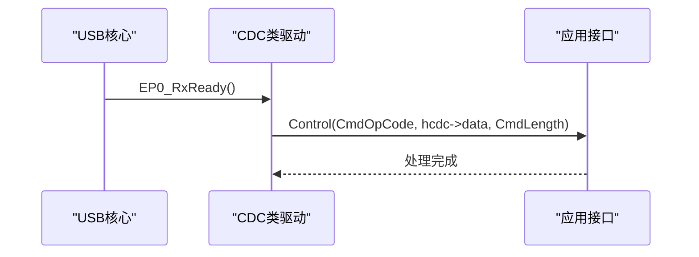
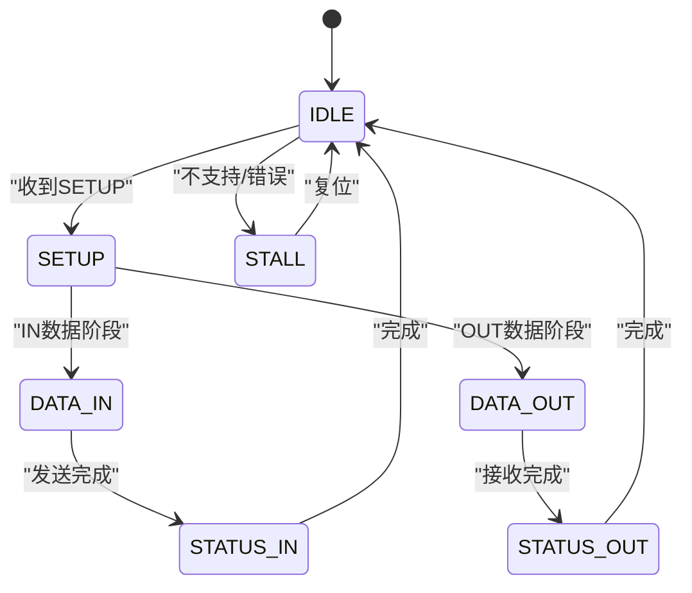
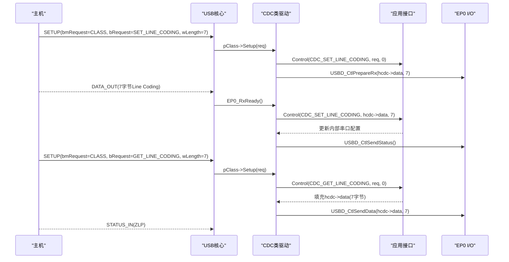
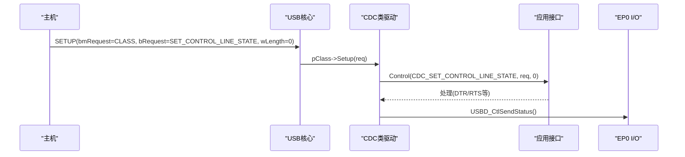
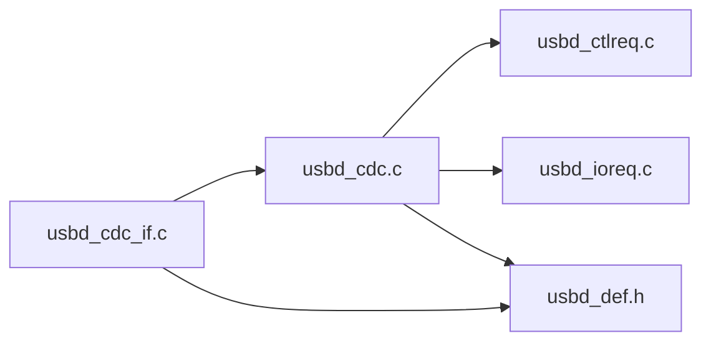

# CDC命令处理机制

<cite>
**本文引用的文件**
- [usbd_cdc.c](file://Middlewares/ST/STM32_USB_Device_Library/Class/CDC/Src/usbd_cdc.c)
- [usbd_cdc.h](file://Middlewares/ST/STM32_USB_Device_Library/Class/CDC/Inc/usbd_cdc.h)
- [usbd_ctlreq.c](file://Middlewares/ST/STM32_USB_Device_Library/Core/Src/usbd_ctlreq.c)
- [usbd_ioreq.c](file://Middlewares/ST/STM32_USB_Device_Library/Core/Src/usbd_ioreq.c)
- [usbd_def.h](file://Middlewares/ST/STM32_USB_Device_Library/Core/Inc/usbd_def.h)
- [usbd_cdc_if.c](file://USB_Device/App/usbd_cdc_if.c)
- [usbd_cdc_if.h](file://USB_Device/App/usbd_cdc_if.h)
</cite>

## 目录
1. [简介](#简介)
2. [项目结构](#项目结构)
3. [核心组件](#核心组件)
4. [架构总览](#架构总览)
5. [详细组件分析](#详细组件分析)
6. [依赖关系分析](#依赖关系分析)
7. [性能与端点协议](#性能与端点协议)
8. [故障排查指南](#故障排查指南)
9. [结论](#结论)
10. [附录：自定义命令扩展最佳实践](#附录自定义命令扩展最佳实践)

## 简介
本技术文档聚焦于基于 STM32 USB 设备库的 CDC（通信设备类）控制面命令处理机制，重点解析控制请求在库层与应用层的分发路径，覆盖 SET_LINE_CODING、GET_LINE_CODING、SET_CONTROL_LINE_STATE 等标准 CDC 命令的处理流程；详细说明 Line Coding 结构体字段定义与配置方法；解释控制端点的数据传输协议与状态机转换；提供关键时序图与错误处理策略；并给出自定义命令扩展的实现方法与最佳实践。

## 项目结构
本项目采用分层设计：
- 中间件库层：CDC 类驱动与 USB 核心控制请求处理
- 应用接口层：用户实现的 CDC 回调（包含控制命令处理入口）
- 底层 HAL/LL：由库封装，负责端点操作与 DMA/中断

图表来源
- [usbd_cdc.c:586-681](file://Middlewares/ST/STM32_USB_Device_Library/Class/CDC/Src/usbd_cdc.c#L586-L681)
- [usbd_cdc.c:757-775](file://Middlewares/ST/STM32_USB_Device_Library/Class/CDC/Src/usbd_cdc.c#L757-L775)
- [usbd_ctlreq.c:100-154](file://Middlewares/ST/STM32_USB_Device_Library/Core/Src/usbd_ctlreq.c#L100-L154)
- [usbd_ioreq.c:87-148](file://Middlewares/ST/STM32_USB_Device_Library/Core/Src/usbd_ioreq.c#L87-L148)
- [usbd_def.h:172-312](file://Middlewares/ST/STM32_USB_Device_Library/Core/Inc/usbd_def.h#L172-L312)
- [usbd_cdc_if.c:180-244](file://USB_Device/App/usbd_cdc_if.c#L180-L244)

章节来源
- [usbd_cdc.c:140-156](file://Middlewares/ST/STM32_USB_Device_Library/Class/CDC/Src/usbd_cdc.c#L140-L156)
- [usbd_cdc.h:44-100](file://Middlewares/ST/STM32_USB_Device_Library/Class/CDC/Inc/usbd_cdc.h#L44-L100)
- [usbd_cdc_if.c:138-145](file://USB_Device/App/usbd_cdc_if.c#L138-L145)

## 核心组件
- CDC 类驱动
  - 负责枚举描述符、端点初始化、控制请求分发和数据端点收发回调
  - 将 CDC 类特定请求转发到应用层回调 USBD_CDC_ItfTypeDef::Control
- 应用层 CDC 接口
  - 实现 CDC_Control_FS，处理具体 CDC 命令（如 SET_LINE_CODING、GET_LINE_CODING、SET_CONTROL_LINE_STATE）
- USB 核心
  - 标准请求路由、EP0 数据传输、状态机管理

章节来源
- [usbd_cdc.c:467-542](file://Middlewares/ST/STM32_USB_Device_Library/Class/CDC/Src/usbd_cdc.c#L467-L542)
- [usbd_cdc.c:586-681](file://Middlewares/ST/STM32_USB_Device_Library/Class/CDC/Src/usbd_cdc.c#L586-L681)
- [usbd_cdc.c:757-775](file://Middlewares/ST/STM32_USB_Device_Library/Class/CDC/Src/usbd_cdc.c#L757-L775)
- [usbd_cdc_if.c:180-244](file://USB_Device/App/usbd_cdc_if.c#L180-L244)

## 架构总览
CDC 控制面请求从主机发出后，经 USB 核心进入 CDC 类驱动，再由 CDC 类驱动调用应用层回调完成具体命令处理。

图表来源
- [usbd_ctlreq.c:100-154](file://Middlewares/ST/STM32_USB_Device_Library/Core/Src/usbd_ctlreq.c#L100-L154)
- [usbd_cdc.c:586-681](file://Middlewares/ST/STM32_USB_Device_Library/Class/CDC/Src/usbd_cdc.c#L586-L681)
- [usbd_cdc.c:757-775](file://Middlewares/ST/STM32_USB_Device_Library/Class/CDC/Src/usbd_cdc.c#L757-L775)
- [usbd_ioreq.c:87-148](file://Middlewares/ST/STM32_USB_Device_Library/Core/Src/usbd_ioreq.c#L87-L148)

## 详细组件分析

### CDC 控制请求分发逻辑（USBD_CDC_Setup）
- 入口：当 USB 核心收到类请求时，调用 CDC 类的 Setup 回调
- 分支：
  - 类请求且 wLength != 0：
    - IN 方向：调用应用层 Control 获取数据至 hcdc->data，随后通过 USBD_CtlSendData 发送
    - OUT 方向：记录 CmdOpCode 与 CmdLength，准备 EP0 接收数据（USBD_CtlPrepareRx），等待 EP0 RxReady 再调用应用层 Control
  - 类请求且 wLength == 0：直接调用应用层 Control，参数为原始 setup 包指针
  - 标准请求：处理 GET_STATUS、GET_INTERFACE、SET_INTERFACE 等，失败则走错误路径

图表来源
- [usbd_cdc.c:586-681](file://Middlewares/ST/STM32_USB_Device_Library/Class/CDC/Src/usbd_cdc.c#L586-L681)
- [usbd_ioreq.c:87-148](file://Middlewares/ST/STM32_USB_Device_Library/Core/Src/usbd_ioreq.c#L87-L148)

章节来源
- [usbd_cdc.c:586-681](file://Middlewares/ST/STM32_USB_Device_Library/Class/CDC/Src/usbd_cdc.c#L586-L681)

### EP0 RxReady 二次分发（USBD_CDC_EP0_RxReady）
- 作用：在 EP0 数据 OUT 阶段完成后，再次调用应用层 Control，传入之前记录的 CmdOpCode 与已接收的数据缓冲
- 典型用途：用于 SET_LINE_CODING、SET_CONTROL_LINE_STATE 等需要先接收数据的命令

图表来源
- [usbd_cdc.c:757-775](file://Middlewares/ST/STM32_USB_Device_Library/Class/CDC/Src/usbd_cdc.c#L757-L775)

章节来源
- [usbd_cdc.c:757-775](file://Middlewares/ST/STM32_USB_Device_Library/Class/CDC/Src/usbd_cdc.c#L757-L775)

### 应用层命令处理（CDC_Control_FS）
- 入口：应用层实现 CDC_Control_FS，根据 cmd 分派处理
- 当前模板中预留了以下命令分支：
  - CDC_SET_LINE_CODING
  - CDC_GET_LINE_CODING
  - CDC_SET_CONTROL_LINE_STATE
  - CDC_SEND_BREAK
  - 以及其它通用功能特征命令占位
- 注意：该函数仅作为命令分发骨架，实际处理逻辑需在此处补充

章节来源
- [usbd_cdc_if.c:180-244](file://USB_Device/App/usbd_cdc_if.c#L180-L244)

### Line Coding 结构体与配置方法
- 结构体定义位于 CDC 头文件，字段包括：
  - bitrate：波特率（dwDTERate）
  - format：停止位（bCharFormat）
  - paritytype：校验位（bParityType）
  - datatype：数据位（bDataBits）
- 配置方法：
  - 主机发送 SET_LINE_CODING 时，应用层在 CDC_Control_FS 中读取 pbuf 指向的 7 字节数据，解析为上述字段并更新内部串口配置
  - 主机发送 GET_LINE_CODING 时，应用层将当前 Line Coding 写入 hcdc->data 并通过上层发送

章节来源
- [usbd_cdc.h:94-100](file://Middlewares/ST/STM32_USB_Device_Library/Class/CDC/Inc/usbd_cdc.h#L94-L100)
- [usbd_cdc_if.c:205-221](file://USB_Device/App/usbd_cdc_if.c#L205-L221)

### 控制端点数据传输协议与状态机
- 控制端点（EP0）遵循 USB 标准三阶段：
  - SETUP：携带 bmRequest、bRequest、wValue/wIndex/wLength
  - DATA：可选，IN 或 OUT
  - STATUS：ZLP 确认
- 库内状态机变量 ep0_state 表示当前 EP0 状态（IDLE/SETUP/DATA_IN/DATA_OUT/STATUS_IN/STATUS_OUT/STALL）
- CDC 类驱动在类请求中复用 EP0 状态机，配合 USBD_CtlSendData/USBD_CtlPrepareRx 完成数据交换

图表来源
- [usbd_def.h:149-156](file://Middlewares/ST/STM32_USB_Device_Library/Core/Inc/usbd_def.h#L149-L156)
- [usbd_ioreq.c:87-148](file://Middlewares/ST/STM32_USB_Device_Library/Core/Src/usbd_ioreq.c#L87-L148)

章节来源
- [usbd_def.h:149-156](file://Middlewares/ST/STM32_USB_Device_Library/Core/Inc/usbd_def.h#L149-L156)
- [usbd_ioreq.c:87-148](file://Middlewares/ST/STM32_USB_Device_Library/Core/Src/usbd_ioreq.c#L87-L148)

### 关键时序图：SET_LINE_CODING 与 GET_LINE_CODING

图表来源
- [usbd_cdc.c:586-681](file://Middlewares/ST/STM32_USB_Device_Library/Class/CDC/Src/usbd_cdc.c#L586-L681)
- [usbd_cdc.c:757-775](file://Middlewares/ST/STM32_USB_Device_Library/Class/CDC/Src/usbd_cdc.c#L757-L775)
- [usbd_ioreq.c:87-148](file://Middlewares/ST/STM32_USB_Device_Library/Core/Src/usbd_ioreq.c#L87-L148)

章节来源
- [usbd_cdc.c:586-681](file://Middlewares/ST/STM32_USB_Device_Library/Class/CDC/Src/usbd_cdc.c#L586-L681)
- [usbd_cdc.c:757-775](file://Middlewares/ST/STM32_USB_Device_Library/Class/CDC/Src/usbd_cdc.c#L757-L775)
- [usbd_ioreq.c:87-148](file://Middlewares/ST/STM32_USB_Device_Library/Core/Src/usbd_ioreq.c#L87-L148)

### 关键时序图：SET_CONTROL_LINE_STATE

图表来源
- [usbd_cdc.c:586-681](file://Middlewares/ST/STM32_USB_Device_Library/Class/CDC/Src/usbd_cdc.c#L586-L681)

章节来源
- [usbd_cdc.c:586-681](file://Middlewares/ST/STM32_USB_Device_Library/Class/CDC/Src/usbd_cdc.c#L586-L681)

## 依赖关系分析
- CDC 类驱动依赖：
  - USB 核心：标准请求分发、EP0 数据收发
  - 应用接口：控制命令处理、数据收发回调
- 应用接口依赖：
  - CDC 类驱动 API：设置缓冲区、启动收发、注册接口
- 核心定义：
  - 设备/端点/状态/请求类型等基础定义

图表来源
- [usbd_cdc.c:586-681](file://Middlewares/ST/STM32_USB_Device_Library/Class/CDC/Src/usbd_cdc.c#L586-L681)
- [usbd_ctlreq.c:100-154](file://Middlewares/ST/STM32_USB_Device_Library/Core/Src/usbd_ctlreq.c#L100-L154)
- [usbd_ioreq.c:87-148](file://Middlewares/ST/STM32_USB_Device_Library/Core/Src/usbd_ioreq.c#L87-L148)
- [usbd_def.h:172-312](file://Middlewares/ST/STM32_USB_Device_Library/Core/Inc/usbd_def.h#L172-L312)
- [usbd_cdc_if.c:138-145](file://USB_Device/App/usbd_cdc_if.c#L138-L145)

章节来源
- [usbd_cdc.c:586-681](file://Middlewares/ST/STM32_USB_Device_Library/Class/CDC/Src/usbd_cdc.c#L586-L681)
- [usbd_cdc_if.c:138-145](file://USB_Device/App/usbd_cdc_if.c#L138-L145)

## 性能与端点协议
- 端点配置
  - 数据端点：Bulk，FS 最大包长 64 字节，HS 最大包长 512 字节
  - 命令端点：Interrupt，包长 8 字节，bInterval 按速度设定
- 传输特性
  - 数据 IN 端点在发送完整包后可能自动发送 ZLP，确保主机正确识别帧结束
  - 数据 OUT 端点每次接收回调中需重新准备下一次接收
- 性能建议
  - 合理设置应用层 Tx/Rx 缓冲区大小，避免频繁切换导致吞吐下降
  - 在高吞吐场景下，尽量批量处理数据并在回调中快速返回，减少阻塞

章节来源
- [usbd_cdc.h:44-68](file://Middlewares/ST/STM32_USB_Device_Library/Class/CDC/Inc/usbd_cdc.h#L44-L68)
- [usbd_cdc.c:690-722](file://Middlewares/ST/STM32_USB_Device_Library/Class/CDC/Src/usbd_cdc.c#L690-L722)
- [usbd_cdc.c:731-749](file://Middlewares/ST/STM32_USB_Device_Library/Class/CDC/Src/usbd_cdc.c#L731-L749)

## 故障排查指南
- 常见问题
  - 主机无法识别虚拟串口：检查描述符与端点配置是否正确
  - 控制请求无响应：确认 CDC 类驱动是否成功注册接口，pUserData 是否有效
  - 数据丢失或乱序：检查应用层是否在 Receive 回调中及时重新准备接收
- 错误处理
  - 标准请求不支持时，库会调用 USBD_CtlError 进入 STALL 状态
  - 类请求 wLength 不匹配或非法值，应返回失败并让核心处理错误
- 调试建议
  - 在 CDC_Control_FS 中添加日志，打印 cmd 与长度
  - 使用 USB 抓包工具验证 SETUP/DATA/STATUS 三阶段是否符合预期

章节来源
- [usbd_cdc.c:667-678](file://Middlewares/ST/STM32_USB_Device_Library/Class/CDC/Src/usbd_cdc.c#L667-L678)
- [usbd_cdc_if.c:261-268](file://USB_Device/App/usbd_cdc_if.c#L261-L268)

## 结论
CDC 控制面命令处理通过“USB 核心 -> CDC 类驱动 -> 应用接口”的分层模型实现，既保证了与标准的兼容性，又提供了良好的可扩展性。理解 EP0 状态机与三阶段协议、掌握 Line Coding 结构与配置方法、以及在 CDC_Control_FS 中正确实现各命令分支，是实现稳定 CDC 虚拟串口的关键。

## 附录：自定义命令扩展最佳实践
- 扩展思路
  - 在应用层 CDC_Control_FS 中新增自定义命令分支，利用 pbuf 与 length 传递参数
  - 对于需要返回数据的命令，将结果写入 hcdc->data 并通过上层发送
  - 对于需要接收数据的命令，利用 EP0 RxReady 二次分发机制处理
- 注意事项
  - 保持与现有命令命名空间隔离，避免冲突
  - 对输入参数进行边界检查，防止越界访问
  - 在长时间处理时，避免阻塞 EP0 处理，必要时拆分任务或使用异步队列
- 参考位置
  - 应用层命令分发入口：[usbd_cdc_if.c:180-244](file://USB_Device/App/usbd_cdc_if.c#L180-L244)
  - 类请求分发与数据阶段处理：[usbd_cdc.c:586-681](file://Middlewares/ST/STM32_USB_Device_Library/Class/CDC/Src/usbd_cdc.c#L586-L681)、[usbd_cdc.c:757-775](file://Middlewares/ST/STM32_USB_Device_Library/Class/CDC/Src/usbd_cdc.c#L757-L775)