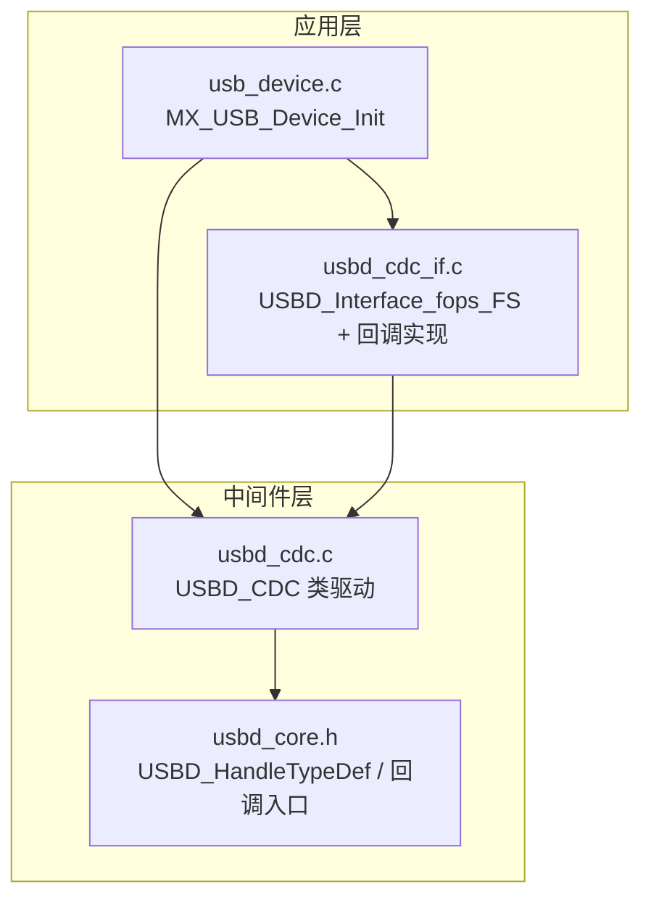
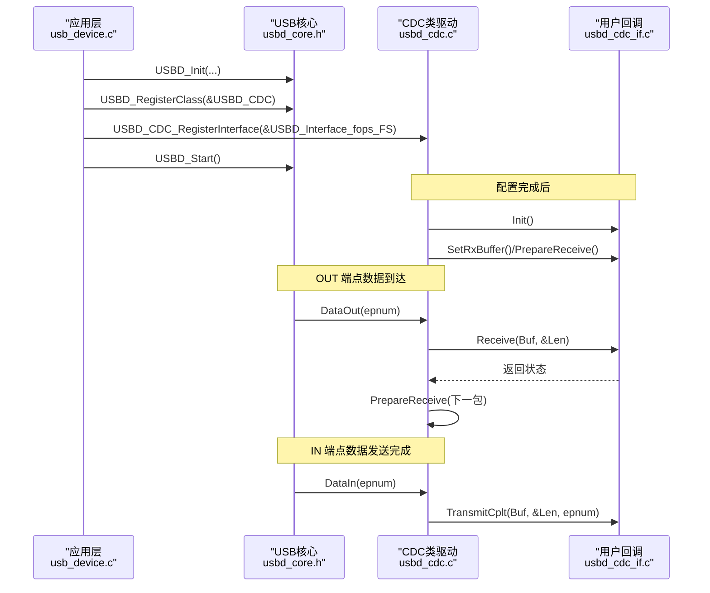
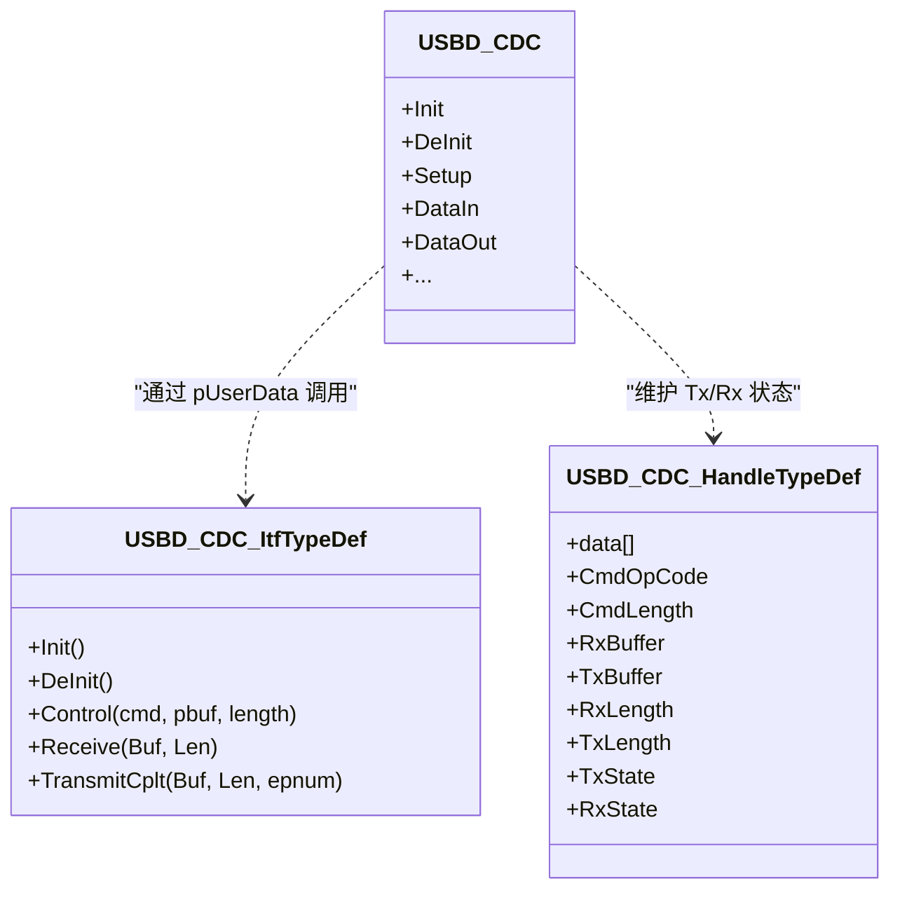
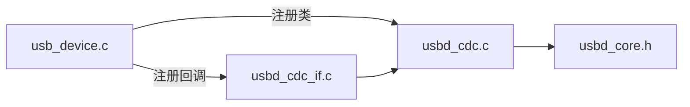

# CDC回调接口机制

<cite>
**本文引用的文件**
- [usbd_cdc.h](file://Middlewares/ST/STM32_USB_Device_Library/Class/CDC/Inc/usbd_cdc.h)
- [usbd_cdc.c](file://Middlewares/ST/STM32_USB_Device_Library/Class/CDC/Src/usbd_cdc.c)
- [usbd_cdc_if.h](file://USB_Device/App/usbd_cdc_if.h)
- [usbd_cdc_if.c](file://USB_Device/App/usbd_cdc_if.c)
- [usb_device.c](file://USB_Device/App/usb_device.c)
- [usbd_core.h](file://Middlewares/ST/STM32_USB_Device_Library/Core/Inc/usbd_core.h)
</cite>

## 目录
1. [引言](#引言)
2. [项目结构](#项目结构)
3. [核心组件](#核心组件)
4. [架构总览](#架构总览)
5. [详细组件分析](#详细组件分析)
6. [依赖关系分析](#依赖关系分析)
7. [性能与行为特性](#性能与行为特性)
8. [故障排查指南](#故障排查指南)
9. [结论](#结论)
10. [附录：API与参数约定](#附录api与参数约定)

## 引言
本文件面向使用 STM32 USB 设备库的开发者，系统性阐述 CDC（通信设备类）回调接口机制。重点包括：
- USBD_CDC_ItTypeDef 函数指针表的结构与各回调职责
- 核心回调实现要点：CDC_Init_FS、CDC_DeInit_FS、CDC_Control_FS、CDC_Receive_FS、CDC_TransmitCplt_FS
- 回调注册机制与调用时机
- 参数传递与返回值规范
- 异步数据传输与同步阻塞处理策略
- 自定义扩展方法与错误恢复建议

## 项目结构
本项目采用分层组织方式：
- 应用层：USB 设备初始化与 CDC 用户回调实现
- 中间件层：CDC 类驱动与 USB 设备核心
- 底层 HAL：端点操作、描述符等由库提供

图表来源
- [usb_device.c:66-88](file://USB_Device/App/usb_device.c#L66-L88)
- [usbd_cdc_if.c:138-145](file://USB_Device/App/usbd_cdc_if.c#L138-L145)
- [usbd_cdc.c:140-156](file://Middlewares/ST/STM32_USB_Device_Library/Class/CDC/Src/usbd_cdc.c#L140-L156)
- [usbd_core.h:85-109](file://Middlewares/ST/STM32_USB_Device_Library/Core/Inc/usbd_core.h#L85-L109)

章节来源
- [usb_device.c:66-88](file://USB_Device/App/usb_device.c#L66-L88)
- [usbd_cdc_if.c:138-145](file://USB_Device/App/usbd_cdc_if.c#L138-L145)
- [usbd_cdc.c:140-156](file://Middlewares/ST/STM32_USB_Device_Library/Class/CDC/Src/usbd_cdc.c#L140-L156)
- [usbd_core.h:85-109](file://Middlewares/ST/STM32_USB_Device_Library/Core/Inc/usbd_core.h#L85-L109)

## 核心组件
- USBD_CDC_ItfTypeDef：用户侧实现的回调函数指针表，包含 Init、DeInit、Control、Receive、TransmitCplt 五个回调。
- USBD_CDC_HandleTypeDef：CDC 类内部状态与缓冲区句柄，维护发送/接收缓冲、长度、状态位等。
- USBD_CDC 类对象：将 CDC 类的生命周期与数据路径回调绑定到核心框架。
- 应用层回调实现：在 usbd_cdc_if.c 中定义 USBD_Interface_fops_FS 并实现具体逻辑。

章节来源
- [usbd_cdc.h:102-124](file://Middlewares/ST/STM32_USB_Device_Library/Class/CDC/Inc/usbd_cdc.h#L102-L124)
- [usbd_cdc.c:140-156](file://Middlewares/ST/STM32_USB_Device_Library/Class/CDC/Src/usbd_cdc.c#L140-L156)
- [usbd_cdc_if.c:138-145](file://USB_Device/App/usbd_cdc_if.c#L138-L145)

## 架构总览
CDC 回调机制通过“类驱动 -> 用户回调”的双向解耦完成：
- 初始化阶段：应用层注册 USBD_CDC_ItfTypeDef 实例；CDC 类在枚举配置后调用用户 Init。
- 控制请求：EP0 上收到 CDC 类请求时，CDC 类解析并转发至用户 Control 回调。
- 数据路径：OUT 端点到达数据触发 Receive；IN 端点传输完成触发 TransmitCplt。
- 资源管理：DeInit 用于释放端点与用户资源。

图表来源
- [usb_device.c:66-88](file://USB_Device/App/usb_device.c#L66-L88)
- [usbd_cdc.c:467-542](file://Middlewares/ST/STM32_USB_Device_Library/Class/CDC/Src/usbd_cdc.c#L467-L542)
- [usbd_cdc.c:731-749](file://Middlewares/ST/STM32_USB_Device_Library/Class/CDC/Src/usbd_cdc.c#L731-L749)
- [usbd_cdc.c:690-722](file://Middlewares/ST/STM32_USB_Device_Library/Class/CDC/Src/usbd_cdc.c#L690-L722)
- [usbd_cdc_if.c:152-160](file://USB_Device/App/usbd_cdc_if.c#L152-L160)

## 详细组件分析

### USBD_CDC_ItTypeDef 函数指针表
- 字段与作用
  - Init：设备配置成功后调用，用于设置收发缓冲、启动接收等。
  - DeInit：设备去配置或复位时调用，用于释放资源。
  - Control：处理 CDC 类控制请求（如 SET_LINE_CODING、GET_LINE_CODING、SET_CONTROL_LINE_STATE 等）。
  - Receive：OUT 端点数据到达回调，需尽快重新准备接收以维持吞吐。
  - TransmitCplt：IN 端点数据发送完成回调，可用于释放发送缓冲或继续排队。

- 类型定义位置
  - [usbd_cdc.h:102-109](file://Middlewares/ST/STM32_USB_Device_Library/Class/CDC/Inc/usbd_cdc.h#L102-L109)

章节来源
- [usbd_cdc.h:102-109](file://Middlewares/ST/STM32_USB_Device_Library/Class/CDC/Inc/usbd_cdc.h#L102-L109)

### 回调注册机制与调用时机
- 注册流程
  - 应用层在 MX_USB_Device_Init 中依次完成：USBD_Init、USBD_RegisterClass、USBD_CDC_RegisterInterface、USBD_Start。
  - USBD_CDC_RegisterInterface 将用户回调表指针保存到 pdev->pUserData，供 CDC 类后续调用。

- 调用时机
  - Init：在 CDC 类初始化（打开端点、分配句柄）后调用。
  - DeInit：在 CDC 类去初始化（关闭端点、释放句柄）前调用。
  - Control：EP0 收到 CDC 类请求时，CDC_Setup 或 EP0 RxReady 分支调用。
  - Receive：DataOut 中断/事件触发，获取接收长度后调用。
  - TransmitCplt：DataIn 中断/事件触发，根据 ZLP 判断是否真正完成，再调用。

章节来源
- [usb_device.c:66-88](file://USB_Device/App/usb_device.c#L66-L88)
- [usbd_cdc.c:838-849](file://Middlewares/ST/STM32_USB_Device_Library/Class/CDC/Src/usbd_cdc.c#L838-L849)
- [usbd_cdc.c:467-542](file://Middlewares/ST/STM32_USB_Device_Library/Class/CDC/Src/usbd_cdc.c#L467-L542)
- [usbd_cdc.c:551-577](file://Middlewares/ST/STM32_USB_Device_Library/Class/CDC/Src/usbd_cdc.c#L551-L577)
- [usbd_cdc.c:586-681](file://Middlewares/ST/STM32_USB_Device_Library/Class/CDC/Src/usbd_cdc.c#L586-L681)
- [usbd_cdc.c:757-775](file://Middlewares/ST/STM32_USB_Device_Library/Class/CDC/Src/usbd_cdc.c#L757-L775)
- [usbd_cdc.c:731-749](file://Middlewares/ST/STM32_USB_Device_Library/Class/CDC/Src/usbd_cdc.c#L731-L749)
- [usbd_cdc.c:690-722](file://Middlewares/ST/STM32_USB_Device_Library/Class/CDC/Src/usbd_cdc.c#L690-L722)

### 核心回调实现要点

#### CDC_Init_FS
- 作用：设置应用层收发缓冲，为首次接收做准备。
- 关键点
  - 调用 USBD_CDC_SetTxBuffer 与 USBD_CDC_SetRxBuffer 绑定缓冲。
  - 通常在此处也调用一次 USBD_CDC_ReceivePacket 以启动接收（或在 CDC_Receive_FS 中每次处理完数据后再次调用）。
- 参考路径
  - [usbd_cdc_if.c:152-160](file://USB_Device/App/usbd_cdc_if.c#L152-L160)
  - [usbd_cdc.c:857-891](file://Middlewares/ST/STM32_USB_Device_Library/Class/CDC/Src/usbd_cdc.c#L857-L891)
  - [usbd_cdc.c:932-955](file://Middlewares/ST/STM32_USB_Device_Library/Class/CDC/Src/usbd_cdc.c#L932-L955)

章节来源
- [usbd_cdc_if.c:152-160](file://USB_Device/App/usbd_cdc_if.c#L152-L160)
- [usbd_cdc.c:857-891](file://Middlewares/ST/STM32_USB_Device_Library/Class/CDC/Src/usbd_cdc.c#L857-L891)
- [usbd_cdc.c:932-955](file://Middlewares/ST/STM32_USB_Device_Library/Class/CDC/Src/usbd_cdc.c#L932-L955)

#### CDC_DeInit_FS
- 作用：释放与 CDC 相关的用户资源（如有）。
- 关键点：保持与 Init 对称的资源清理。
- 参考路径
  - [usbd_cdc_if.c:166-171](file://USB_Device/App/usbd_cdc_if.c#L166-L171)
  - [usbd_cdc.c:551-577](file://Middlewares/ST/STM32_USB_Device_Library/Class/CDC/Src/usbd_cdc.c#L551-L577)

章节来源
- [usbd_cdc_if.c:166-171](file://USB_Device/App/usbd_cdc_if.c#L166-L171)
- [usbd_cdc.c:551-577](file://Middlewares/ST/STM32_USB_Device_Library/Class/CDC/Src/usbd_cdc.c#L551-L577)

#### CDC_Control_FS
- 作用：处理 CDC 抽象控制模型（ACM）命令，如波特率、停止位、校验位、流控、DTR/RTS 等。
- 关键点
  - 常见命令：CDC_SET_LINE_CODING、CDC_GET_LINE_CODING、CDC_SET_CONTROL_LINE_STATE、CDC_SEND_BREAK 等。
  - 对于需要双向数据的请求，CDC 类会在 Setup 阶段暂存 CmdOpCode 与 CmdLength，并在 EP0 RxReady 时二次调用 Control。
- 参考路径
  - [usbd_cdc_if.c:180-244](file://USB_Device/App/usbd_cdc_if.c#L180-L244)
  - [usbd_cdc.c:586-681](file://Middlewares/ST/STM32_USB_Device_Library/Class/CDC/Src/usbd_cdc.c#L586-L681)
  - [usbd_cdc.c:757-775](file://Middlewares/ST/STM32_USB_Device_Library/Class/CDC/Src/usbd_cdc.c#L757-L775)

章节来源
- [usbd_cdc_if.c:180-244](file://USB_Device/App/usbd_cdc_if.c#L180-L244)
- [usbd_cdc.c:586-681](file://Middlewares/ST/STM32_USB_Device_Library/Class/CDC/Src/usbd_cdc.c#L586-L681)
- [usbd_cdc.c:757-775](file://Middlewares/ST/STM32_USB_Device_Library/Class/CDC/Src/usbd_cdc.c#L757-L775)

#### CDC_Receive_FS
- 作用：处理 OUT 端点数据到达，并将接收缓冲重新挂接以便下一次接收。
- 关键点
  - 必须尽快调用 USBD_CDC_SetRxBuffer 与 USBD_CDC_ReceivePacket，避免主机 NAK 堆积导致丢包。
  - Len 为实际接收字节数，Buf 指向当前接收缓冲。
- 参考路径
  - [usbd_cdc_if.c:261-268](file://USB_Device/App/usbd_cdc_if.c#L261-L268)
  - [usbd_cdc.c:731-749](file://Middlewares/ST/STM32_USB_Device_Library/Class/CDC/Src/usbd_cdc.c#L731-L749)
  - [usbd_cdc.c:932-955](file://Middlewares/ST/STM32_USB_Device_Library/Class/CDC/Src/usbd_cdc.c#L932-L955)

章节来源
- [usbd_cdc_if.c:261-268](file://USB_Device/App/usbd_cdc_if.c#L261-L268)
- [usbd_cdc.c:731-749](file://Middlewares/ST/STM32_USB_Device_Library/Class/CDC/Src/usbd_cdc.c#L731-L749)
- [usbd_cdc.c:932-955](file://Middlewares/ST/STM32_USB_Device_Library/Class/CDC/Src/usbd_cdc.c#L932-L955)

#### CDC_TransmitCplt_FS
- 作用：IN 端点数据发送完成回调，通知上层可复用发送缓冲或继续发送。
- 关键点
  - 当发送长度为端点最大包的整数倍时，CDC 类会额外发送 ZLP（零长度包），ZLP 完成后才认为整批数据发送完成。
  - 可在该回调中执行非阻塞的后处理（如队列出队、DMA 切换等）。
- 参考路径
  - [usbd_cdc_if.c:307-316](file://USB_Device/App/usbd_cdc_if.c#L307-L316)
  - [usbd_cdc.c:690-722](file://Middlewares/ST/STM32_USB_Device_Library/Class/CDC/Src/usbd_cdc.c#L690-L722)

章节来源
- [usbd_cdc_if.c:307-316](file://USB_Device/App/usbd_cdc_if.c#L307-L316)
- [usbd_cdc.c:690-722](file://Middlewares/ST/STM32_USB_Device_Library/Class/CDC/Src/usbd_cdc.c#L690-L722)

### 类与数据结构关系图

图表来源
- [usbd_cdc.h:102-124](file://Middlewares/ST/STM32_USB_Device_Library/Class/CDC/Inc/usbd_cdc.h#L102-L124)
- [usbd_cdc.c:140-156](file://Middlewares/ST/STM32_USB_Device_Library/Class/CDC/Src/usbd_cdc.c#L140-L156)

## 依赖关系分析
- 应用层依赖
  - usb_device.c 负责注册 CDC 类与用户回调表。
  - usbd_cdc_if.c 提供 USBD_Interface_fops_FS 及回调实现。
- 中间件层依赖
  - usbd_cdc.c 实现 CDC 类驱动，按协议处理控制与数据路径，并调用用户回调。
  - usbd_core.h 暴露核心 API 与端点操作原语。

图表来源
- [usb_device.c:66-88](file://USB_Device/App/usb_device.c#L66-L88)
- [usbd_cdc.c:140-156](file://Middlewares/ST/STM32_USB_Device_Library/Class/CDC/Src/usbd_cdc.c#L140-L156)
- [usbd_core.h:85-109](file://Middlewares/ST/STM32_USB_Device_Library/Core/Inc/usbd_core.h#L85-L109)

章节来源
- [usb_device.c:66-88](file://USB_Device/App/usb_device.c#L66-L88)
- [usbd_cdc.c:140-156](file://Middlewares/ST/STM32_USB_Device_Library/Class/CDC/Src/usbd_cdc.c#L140-L156)
- [usbd_core.h:85-109](file://Middlewares/ST/STM32_USB_Device_Library/Core/Inc/usbd_core.h#L85-L109)

## 性能与行为特性
- 接收路径
  - 必须在 Receive 回调中尽快重新准备接收，否则主机可能因 NAK 而降低吞吐或丢弃数据。
  - 若使用 DMA，应在 DMA 完成后再调用 Receive 重挂接，避免竞态。
- 发送路径
  - 发送完成判定遵循 ZLP 语义：当发送长度为端点最大包的整数倍时，CDC 类会补发 ZLP，ZLP 完成后才触发 TransmitCplt。
  - 发送忙状态由 hcdc->TxState 标志保护，重复发送将返回 BUSY。
- 控制路径
  - 对带数据的类请求，CDC 类分两阶段处理：Setup 阶段保存命令与长度，EP0 RxReady 阶段再调用用户 Control 传入数据。

章节来源
- [usbd_cdc.c:731-749](file://Middlewares/ST/STM32_USB_Device_Library/Class/CDC/Src/usbd_cdc.c#L731-L749)
- [usbd_cdc.c:690-722](file://Middlewares/ST/STM32_USB_Device_Library/Class/CDC/Src/usbd_cdc.c#L690-L722)
- [usbd_cdc.c:586-681](file://Middlewares/ST/STM32_USB_Device_Library/Class/CDC/Src/usbd_cdc.c#L586-L681)
- [usbd_cdc.c:757-775](file://Middlewares/ST/STM32_USB_Device_Library/Class/CDC/Src/usbd_cdc.c#L757-L775)

## 故障排查指南
- 现象：主机无法识别或枚举失败
  - 检查是否正确注册 CDC 类与用户回调表。
  - 确认描述符与端点大小匹配目标速度（FS/HS）。
- 现象：接收不到数据或频繁断流
  - 确保在 Receive 回调中立即调用 SetRxBuffer 与 ReceivePacket。
  - 避免在回调中进行耗时操作，必要时仅做拷贝并交由任务处理。
- 现象：发送卡住或无完成回调
  - 检查是否重复调用发送且未等待完成（TxState 为忙）。
  - 确认发送长度是否为端点最大包的整数倍时，ZLP 是否被正确处理。
- 现象：控制请求不生效
  - 确认 CDC_Control_FS 中已处理对应命令（如 SET_LINE_CODING、SET_CONTROL_LINE_STATE）。
  - 注意带数据的类请求会在 EP0 RxReady 阶段二次进入 Control。

章节来源
- [usb_device.c:66-88](file://USB_Device/App/usb_device.c#L66-L88)
- [usbd_cdc_if.c:261-268](file://USB_Device/App/usbd_cdc_if.c#L261-L268)
- [usbd_cdc.c:690-722](file://Middlewares/ST/STM32_USB_Device_Library/Class/CDC/Src/usbd_cdc.c#L690-L722)
- [usbd_cdc.c:586-681](file://Middlewares/ST/STM32_USB_Device_Library/Class/CDC/Src/usbd_cdc.c#L586-L681)
- [usbd_cdc.c:757-775](file://Middlewares/ST/STM32_USB_Device_Library/Class/CDC/Src/usbd_cdc.c#L757-L775)

## 结论
CDC 回调接口通过清晰的函数指针表与严格的调用时序，实现了应用与库之间的解耦。正确理解各回调的职责、参数与返回值，以及异步/同步边界，是构建稳定高效虚拟串口功能的关键。建议在应用层采用环形缓冲与任务化处理的模式，配合 DMA 与中断，最大化吞吐并保证实时性。

## 附录：API与参数约定

### 回调函数签名与参数说明
- Init(void)
  - 用途：初始化用户资源，设置收发缓冲，启动接收。
  - 返回：成功/失败状态码。
- DeInit(void)
  - 用途：释放用户资源。
  - 返回：成功/失败状态码。
- Control(cmd, pbuf, length)
  - 用途：处理 CDC 类控制请求。
  - 参数：cmd 为请求码；pbuf 为数据缓冲；length 为数据长度。
  - 返回：成功/失败状态码。
- Receive(Buf, Len)
  - 用途：处理 OUT 端点数据。
  - 参数：Buf 为接收缓冲指针；Len 为接收字节数（输出）。
  - 返回：成功/失败状态码。
- TransmitCplt(Buf, Len, epnum)
  - 用途：IN 端点发送完成通知。
  - 参数：Buf 为发送缓冲指针；Len 为发送字节数（输出）；epnum 为端点号。
  - 返回：成功/失败状态码。

章节来源
- [usbd_cdc.h:102-109](file://Middlewares/ST/STM32_USB_Device_Library/Class/CDC/Inc/usbd_cdc.h#L102-L109)

### 关键库函数与行为
- USBD_CDC_RegisterInterface(pdev, fops)
  - 作用：注册用户回调表。
  - 返回：成功/失败状态码。
- USBD_CDC_SetTxBuffer(pdev, pbuff, length)
  - 作用：设置发送缓冲与长度。
  - 返回：成功/失败状态码。
- USBD_CDC_SetRxBuffer(pdev, pbuff)
  - 作用：设置接收缓冲。
  - 返回：成功/失败状态码。
- USBD_CDC_TransmitPacket(pdev)
  - 作用：发起 IN 端点传输；若正在发送则返回忙。
  - 返回：OK/BUSY/FAIL。
- USBD_CDC_ReceivePacket(pdev)
  - 作用：为 OUT 端点准备下一次接收。
  - 返回：成功/失败状态码。

章节来源
- [usbd_cdc.c:838-849](file://Middlewares/ST/STM32_USB_Device_Library/Class/CDC/Src/usbd_cdc.c#L838-L849)
- [usbd_cdc.c:857-891](file://Middlewares/ST/STM32_USB_Device_Library/Class/CDC/Src/usbd_cdc.c#L857-L891)
- [usbd_cdc.c:899-924](file://Middlewares/ST/STM32_USB_Device_Library/Class/CDC/Src/usbd_cdc.c#L899-L924)
- [usbd_cdc.c:932-955](file://Middlewares/ST/STM32_USB_Device_Library/Class/CDC/Src/usbd_cdc.c#L932-L955)

### 异步与同步处理建议
- 异步推荐
  - 在 Receive 中仅做数据入队与重挂接接收。
  - 在 TransmitCplt 中做出队与下一包发送。
  - 使用环形缓冲与信号量/消息队列协调任务。
- 同步阻塞
  - 若必须阻塞，可在发送前轮询 TxState 或等待 TransmitCplt 信号，但应避免长时间占用 CPU。
  - 谨慎使用阻塞式控制请求处理，防止影响其他 USB 事务。

章节来源
- [usbd_cdc.c:690-722](file://Middlewares/ST/STM32_USB_Device_Library/Class/CDC/Src/usbd_cdc.c#L690-L722)
- [usbd_cdc.c:731-749](file://Middlewares/ST/STM32_USB_Device_Library/Class/CDC/Src/usbd_cdc.c#L731-L749)

### 错误恢复策略
- 初始化失败
  - 检查内存分配与端点打开结果，回退到安全状态并重试。
- 控制请求异常
  - 对未知命令返回标准错误，避免挂起 EP0。
- 数据路径异常
  - 在 Receive 中检测 Len=0 的特殊情况，必要时重置接收缓冲。
  - 在发送忙时拒绝新请求并上报应用层重试。

章节来源
- [usbd_cdc.c:467-542](file://Middlewares/ST/STM32_USB_Device_Library/Class/CDC/Src/usbd_cdc.c#L467-L542)
- [usbd_cdc.c:586-681](file://Middlewares/ST/STM32_USB_Device_Library/Class/CDC/Src/usbd_cdc.c#L586-L681)
- [usbd_cdc.c:731-749](file://Middlewares/ST/STM32_USB_Device_Library/Class/CDC/Src/usbd_cdc.c#L731-L749)