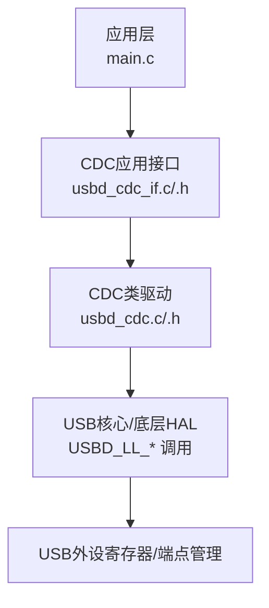
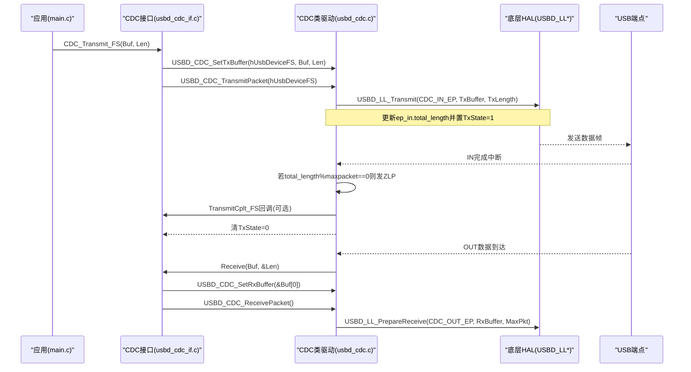
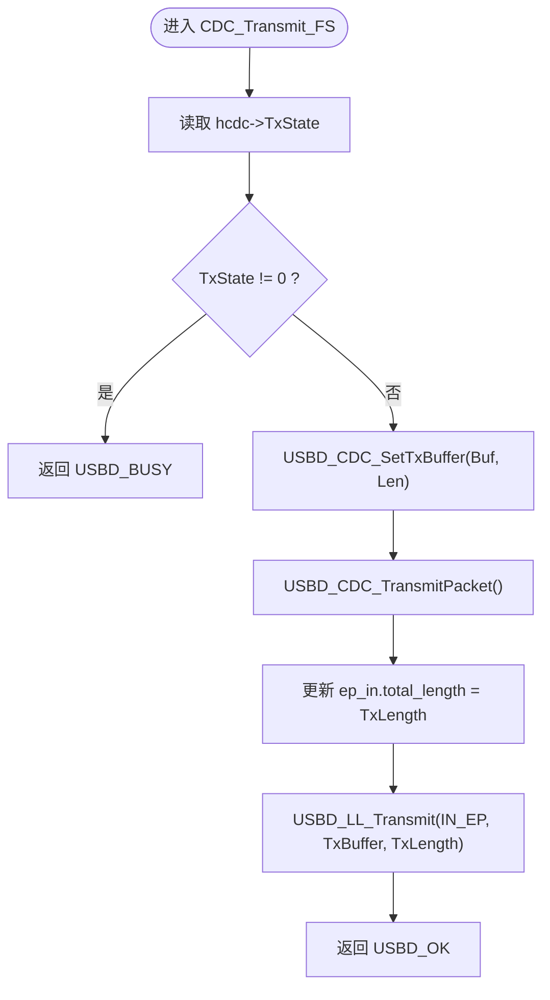
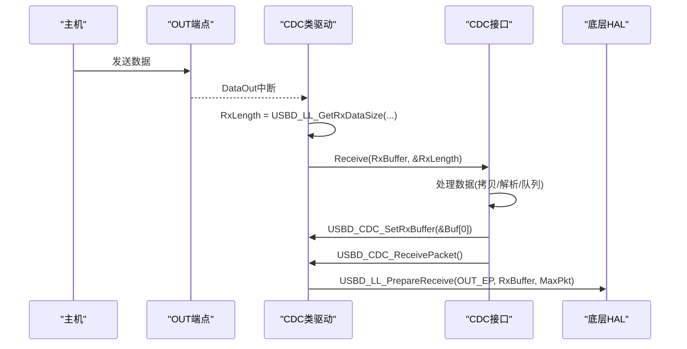
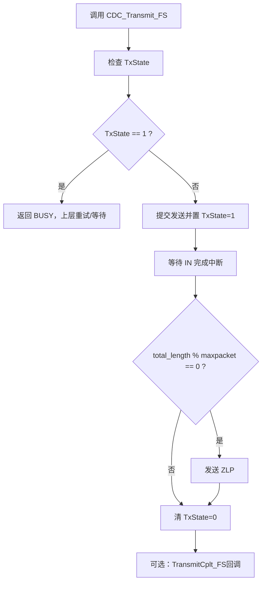
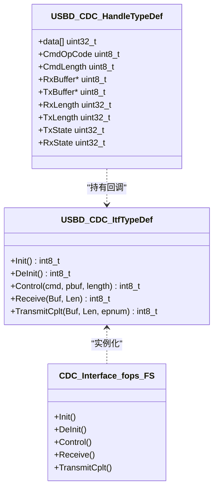

# CDC数据传输机制

<cite>
**本文引用的文件**   
- [usbd_cdc_if.c](file://USB_Device/App/usbd_cdc_if.c)
- [usbd_cdc_if.h](file://USB_Device/App/usbd_cdc_if.h)
- [usbd_cdc.c](file://Middlewares/ST/STM32_USB_Device_Library/Class/CDC/Src/usbd_cdc.c)
- [usbd_cdc.h](file://Middlewares/ST/STM32_USB_Device_Library/Class/CDC/Inc/usbd_cdc.h)
- [usb_device.c](file://USB_Device/App/usb_device.c)
- [main.c](file://Core/Src/main.c)
</cite>

## 目录
1. [简介](#简介)
2. [项目结构](#项目结构)
3. [核心组件](#核心组件)
4. [架构总览](#架构总览)
5. [详细组件分析](#详细组件分析)
6. [依赖关系分析](#依赖关系分析)
7. [性能考虑](#性能考虑)
8. [故障排查指南](#故障排查指南)
9. [结论](#结论)
10. [附录](#附录)

## 简介
本技术文档围绕CDC（通信设备类）在STM32 USB设备栈中的实现，重点解析以下主题：
- CDC_Transmit_FS与CDC_Receive_FS的实现原理与数据流处理
- 用户缓冲区UserTxBufferFS与UserRxBufferFS的管理策略
- 非阻塞式数据传输方法与状态检查机制
- 数据包分割、重组与流量控制
- 大数据量传输的性能优化技巧
- 传输错误处理与重试机制
- 为初学者提供USB数据传输概念，为高级开发者提供高吞吐优化方案

## 项目结构
本项目基于STM32CubeMX生成的工程，CDC相关代码主要分布在应用层接口与中间件库中：
- 应用层接口：USB_Device/App/usbd_cdc_if.[ch]
- CDC类驱动：Middlewares/ST/.../Class/CDC/Src/usbd_cdc.c 与 Inc/usbd_cdc.h
- 设备初始化：USB_Device/App/usb_device.c
- 应用主循环与示例用法：Core/Src/main.c

图表来源
- [usb_device.c:66-88](file://USB_Device/App/usb_device.c#L66-L88)
- [usbd_cdc_if.c:138-145](file://USB_Device/App/usbd_cdc_if.c#L138-L145)
- [usbd_cdc.c:140-156](file://Middlewares/ST/STM32_USB_Device_Library/Class/CDC/Src/usbd_cdc.c#L140-L156)

章节来源
- [usb_device.c:66-88](file://USB_Device/App/usb_device.c#L66-L88)
- [usbd_cdc_if.c:138-145](file://USB_Device/App/usbd_cdc_if.c#L138-L145)
- [usbd_cdc.c:140-156](file://Middlewares/ST/STM32_USB_Device_Library/Class/CDC/Src/usbd_cdc.c#L140-L156)

## 核心组件
- CDC应用接口（usbd_cdc_if.c/.h）
  - 定义并导出用户收发缓冲区：UserRxBufferFS、UserTxBufferFS
  - 实现回调函数：CDC_Init_FS、CDC_Control_FS、CDC_Receive_FS、CDC_TransmitCplt_FS
  - 对外暴露发送API：CDC_Transmit_FS
- CDC类驱动（usbd_cdc.c/.h）
  - 维护CDC上下文：USBD_CDC_HandleTypeDef（包含Tx/Rx缓冲指针、长度、状态等）
  - 提供设置缓冲与触发收发的API：USBD_CDC_SetTxBuffer、USBD_CDC_SetRxBuffer、USBD_CDC_TransmitPacket、USBD_CDC_ReceivePacket
  - 处理IN/OUT端点中断与ZLP补零逻辑
- 设备初始化（usb_device.c）
  - 注册CDC类与接口回调，启动USB设备
- 应用示例（main.c）
  - 使用CDC_Transmit_FS进行非阻塞发送，并在返回BUSY时轮询重试

章节来源
- [usbd_cdc_if.c:88-98](file://USB_Device/App/usbd_cdc_if.c#L88-L98)
- [usbd_cdc_if.c:138-145](file://USB_Device/App/usbd_cdc_if.c#L138-L145)
- [usbd_cdc_if.c:261-293](file://USB_Device/App/usbd_cdc_if.c#L261-L293)
- [usbd_cdc.h:112-124](file://Middlewares/ST/STM32_USB_Device_Library/Class/CDC/Inc/usbd_cdc.h#L112-L124)
- [usbd_cdc.c:857-924](file://Middlewares/ST/STM32_USB_Device_Library/Class/CDC/Src/usbd_cdc.c#L857-L924)
- [usb_device.c:66-88](file://USB_Device/App/usb_device.c#L66-L88)
- [main.c:207-212](file://Core/Src/main.c#L207-L212)

## 架构总览
CDC在STM32 USB设备栈中的分层如下：
- 应用层：通过CDC_Transmit_FS发起发送；接收侧由USB OUT端点触发回调CDC_Receive_FS
- 类驱动层：维护端点状态、缓冲指针与长度，负责将数据提交到底层端点或准备下一次接收
- 底层HAL：USBD_LL_Transmit/USBD_LL_PrepareReceive完成实际的端点操作

图表来源
- [usbd_cdc_if.c:281-293](file://USB_Device/App/usbd_cdc_if.c#L281-L293)
- [usbd_cdc.c:899-924](file://Middlewares/ST/STM32_USB_Device_Library/Class/CDC/Src/usbd_cdc.c#L899-L924)
- [usbd_cdc.c:690-722](file://Middlewares/ST/STM32_USB_Device_Library/Class/CDC/Src/usbd_cdc.c#L690-L722)
- [usbd_cdc.c:731-749](file://Middlewares/ST/STM32_USB_Device_Library/Class/CDC/Src/usbd_cdc.c#L731-L749)
- [usbd_cdc.c:932-955](file://Middlewares/ST/STM32_USB_Device_Library/Class/CDC/Src/usbd_cdc.c#L932-L955)
- [usbd_cdc_if.c:261-268](file://USB_Device/App/usbd_cdc_if.c#L261-L268)

## 详细组件分析

### CDC_Transmit_FS 实现原理与数据流
- 入口：应用调用CDC_Transmit_FS(Buf, Len)
- 关键步骤：
  - 获取CDC句柄并检查TxState是否为0（是否已有未完成的发送）
  - 设置发送缓冲与长度：USBD_CDC_SetTxBuffer
  - 提交发送：USBD_CDC_TransmitPacket
- 返回值：
  - USBD_OK：成功提交
  - USBD_BUSY：当前有正在进行的发送，需稍后重试
- 完成通知：
  - 当IN端点传输完成时，CDC类驱动会判断是否需要发送ZLP（零长度包），随后清除TxState并调用TransmitCplt_FS回调（可留空）

图表来源
- [usbd_cdc_if.c:281-293](file://USB_Device/App/usbd_cdc_if.c#L281-L293)
- [usbd_cdc.c:899-924](file://Middlewares/ST/STM32_USB_Device_Library/Class/CDC/Src/usbd_cdc.c#L899-L924)

章节来源
- [usbd_cdc_if.c:281-293](file://USB_Device/App/usbd_cdc_if.c#L281-L293)
- [usbd_cdc.c:899-924](file://Middlewares/ST/STM32_USB_Device_Library/Class/CDC/Src/usbd_cdc.c#L899-L924)
- [usbd_cdc.c:690-722](file://Middlewares/ST/STM32_USB_Device_Library/Class/CDC/Src/usbd_cdc.c#L690-L722)

### CDC_Receive_FS 实现原理与数据流
- 触发时机：主机向CDC OUT端点发送数据，USB底层触发DataOut回调
- 类驱动行为：
  - 获取本次接收长度：USBD_LL_GetRxDataSize
  - 调用应用层Receive回调：((USBD_CDC_ItfTypeDef *)pdev->pUserData)->Receive(hcdc->RxBuffer, &hcdc->RxLength)
- 应用层CDC_Receive_FS职责：
  - 重新设置接收缓冲：USBD_CDC_SetRxBuffer(&Buf[0])
  - 准备下一次接收：USBD_CDC_ReceivePacket()
- 注意：
  - 必须在退出该回调前准备好下一次接收，否则后续数据会被NAK丢弃

图表来源
- [usbd_cdc.c:731-749](file://Middlewares/ST/STM32_USB_Device_Library/Class/CDC/Src/usbd_cdc.c#L731-L749)
- [usbd_cdc_if.c:261-268](file://USB_Device/App/usbd_cdc_if.c#L261-L268)
- [usbd_cdc.c:932-955](file://Middlewares/ST/STM32_USB_Device_Library/Class/CDC/Src/usbd_cdc.c#L932-L955)

章节来源
- [usbd_cdc.c:731-749](file://Middlewares/ST/STM32_USB_Device_Library/Class/CDC/Src/usbd_cdc.c#L731-L749)
- [usbd_cdc_if.c:261-268](file://USB_Device/App/usbd_cdc_if.c#L261-L268)
- [usbd_cdc.c:932-955](file://Middlewares/ST/STM32_USB_Device_Library/Class/CDC/Src/usbd_cdc.c#L932-L955)

### 用户缓冲区 UserTxBufferFS 与 UserRxBufferFS 管理策略
- 定义位置与大小：
  - APP_RX_DATA_SIZE、APP_TX_DATA_SIZE 在头文件中定义
  - 全局数组：UserRxBufferFS、UserTxBufferFS
- 生命周期与绑定：
  - CDC_Init_FS中通过USBD_CDC_SetTxBuffer/SetRxBuffer将用户缓冲与CDC上下文绑定
  - 每次发送前需再次SetTxBuffer以指定新的数据源与长度
  - 每次接收回调中需SetRxBuffer指向可用缓冲，并PrepareReceive以继续接收
- 注意事项：
  - 避免在发送未完成时覆盖UserTxBufferFS
  - 接收回调中应尽快PrepareReceive，防止主机持续NAK

章节来源
- [usbd_cdc_if.h:51-53](file://USB_Device/App/usbd_cdc_if.h#L51-L53)
- [usbd_cdc_if.c:88-98](file://USB_Device/App/usbd_cdc_if.c#L88-L98)
- [usbd_cdc_if.c:152-160](file://USB_Device/App/usbd_cdc_if.c#L152-L160)
- [usbd_cdc.c:857-891](file://Middlewares/ST/STM32_USB_Device_Library/Class/CDC/Src/usbd_cdc.c#L857-L891)

### 非阻塞式数据传输与状态检查
- 发送非阻塞：
  - CDC_Transmit_FS内部检查TxState，若不为0则立即返回USBD_BUSY
  - 上层可在返回BUSY时采用轮询重试或事件驱动方式等待完成
- 完成回调：
  - 当IN传输完成且需要ZLP时，CDC类驱动会发送ZLP；否则直接清TxState并调用TransmitCplt_FS
- 接收非阻塞：
  - 接收回调中必须PrepareReceive，确保端点持续就绪

图表来源
- [usbd_cdc_if.c:281-293](file://USB_Device/App/usbd_cdc_if.c#L281-L293)
- [usbd_cdc.c:690-722](file://Middlewares/ST/STM32_USB_Device_Library/Class/CDC/Src/usbd_cdc.c#L690-L722)

章节来源
- [usbd_cdc_if.c:281-293](file://USB_Device/App/usbd_cdc_if.c#L281-L293)
- [usbd_cdc.c:690-722](file://Middlewares/ST/STM32_USB_Device_Library/Class/CDC/Src/usbd_cdc.c#L690-L722)

### 数据包分割、重组与流量控制
- 分割：
  - USB FS Bulk端点最大包长为64字节，CDC类驱动按端点maxpacket自动分片
  - 当发送数据长度为maxpacket的整数倍时，CDC会在完成后额外发送一个ZLP以标记结束
- 重组：
  - 主机侧根据CDC协议与自身缓冲区进行重组；设备侧无需显式重组
- 流量控制：
  - 设备侧通过TxState与端点缓冲状态隐式控制
  - 主机侧可通过暂停/恢复流控配合；设备侧在接收回调中及时PrepareReceive以避免NAK堆积

章节来源
- [usbd_cdc.h:57-66](file://Middlewares/ST/STM32_USB_Device_Library/Class/CDC/Inc/usbd_cdc.h#L57-L66)
- [usbd_cdc.c:690-722](file://Middlewares/ST/STM32_USB_Device_Library/Class/CDC/Src/usbd_cdc.c#L690-L722)

### 大数据量传输的性能优化技巧
- 批量发送：
  - 尽量合并小数据为较大块发送，减少端点切换与ZLP次数
- 非阻塞重试：
  - 当返回BUSY时，采用短延时轮询或事件驱动重试，避免长时间阻塞
- 端点配置：
  - FS模式下端点最大包长固定为64字节，无法增大；但可减少CPU占用，提升整体吞吐
- 接收路径优化：
  - 在接收回调中仅做必要处理，尽快PrepareReceive，避免主机NAK
- 内存对齐与拷贝：
  - 使用DMA或零拷贝策略（如环形缓冲+索引）减少CPU开销

章节来源
- [usbd_cdc.h:57-66](file://Middlewares/ST/STM32_USB_Device_Library/Class/CDC/Inc/usbd_cdc.h#L57-L66)
- [usbd_cdc.c:932-955](file://Middlewares/ST/STM32_USB_Device_Library/Class/CDC/Src/usbd_cdc.c#L932-L955)
- [main.c:207-212](file://Core/Src/main.c#L207-L212)

### 传输错误处理与重试机制
- 发送错误：
  - 若CDC_Transmit_FS返回USBD_BUSY，上层应重试；若返回USBD_FAIL，检查设备状态与缓冲有效性
- 接收错误：
  - 若在接收回调中未及时PrepareReceive，可能导致主机NAK与丢包
- 重试策略：
  - 简单场景可采用短延时轮询重试
  - 复杂场景可使用标志位或队列，结合TransmitCplt_FS回调进行异步处理

章节来源
- [usbd_cdc_if.c:281-293](file://USB_Device/App/usbd_cdc_if.c#L281-L293)
- [usbd_cdc.c:899-924](file://Middlewares/ST/STM32_USB_Device_Library/Class/CDC/Src/usbd_cdc.c#L899-L924)
- [usbd_cdc.c:932-955](file://Middlewares/ST/STM32_USB_Device_Library/Class/CDC/Src/usbd_cdc.c#L932-L955)

### 面向对象视角：CDC类与接口回调

图表来源
- [usbd_cdc.h:102-124](file://Middlewares/ST/STM32_USB_Device_Library/Class/CDC/Inc/usbd_cdc.h#L102-L124)
- [usbd_cdc_if.c:138-145](file://USB_Device/App/usbd_cdc_if.c#L138-L145)

章节来源
- [usbd_cdc.h:102-124](file://Middlewares/ST/STM32_USB_Device_Library/Class/CDC/Inc/usbd_cdc.h#L102-L124)
- [usbd_cdc_if.c:138-145](file://USB_Device/App/usbd_cdc_if.c#L138-L145)

## 依赖关系分析
- 应用层依赖CDC接口API（CDC_Transmit_FS）
- CDC接口依赖CDC类驱动API（SetTxBuffer/TransmitPacket/SetRxBuffer/ReceivePacket）
- CDC类驱动依赖USB核心与底层HAL（USBD_LL_Transmit/USBD_LL_PrepareReceive）
- 设备初始化阶段注册CDC类与接口回调

图表来源
- [usb_device.c:66-88](file://USB_Device/App/usb_device.c#L66-L88)
- [usbd_cdc_if.c:138-145](file://USB_Device/App/usbd_cdc_if.c#L138-L145)
- [usbd_cdc.c:140-156](file://Middlewares/ST/STM32_USB_Device_Library/Class/CDC/Src/usbd_cdc.c#L140-L156)

章节来源
- [usb_device.c:66-88](file://USB_Device/App/usb_device.c#L66-L88)
- [usbd_cdc_if.c:138-145](file://USB_Device/App/usbd_cdc_if.c#L138-L145)
- [usbd_cdc.c:140-156](file://Middlewares/ST/STM32_USB_Device_Library/Class/CDC/Src/usbd_cdc.c#L140-L156)

## 性能考虑
- FS模式端点最大包长固定为64字节，无法通过配置提高单包大小
- 建议：
  - 合并小包为大块发送，减少ZLP与端点切换
  - 在接收回调中快速PrepareReceive，避免主机NAK
  - 使用非阻塞重试策略，避免阻塞主循环
  - 在可能的情况下使用DMA或环形缓冲降低CPU占用

[本节为通用指导，不直接分析具体文件]

## 故障排查指南
- 现象：发送返回BUSY
  - 原因：上一次发送尚未完成
  - 处理：轮询重试或等待TransmitCplt回调
- 现象：接收不到数据或丢包
  - 原因：未在接收回调中PrepareReceive
  - 处理：确保在Receive回调末尾调用USBD_CDC_ReceivePacket
- 现象：主机端出现粘包或断包
  - 原因：应用层未按行或定长协议解析
  - 处理：在上层实现正确的分包/重组逻辑

章节来源
- [usbd_cdc_if.c:281-293](file://USB_Device/App/usbd_cdc_if.c#L281-L293)
- [usbd_cdc.c:932-955](file://Middlewares/ST/STM32_USB_Device_Library/Class/CDC/Src/usbd_cdc.c#L932-L955)

## 结论
- CDC_Transmit_FS与CDC_Receive_FS分别负责非阻塞发送与接收回调准备
- 用户缓冲区需在发送前设置，在接收回调中及时刷新并准备下一次接收
- 通过TxState与端点状态实现隐式流量控制，ZLP用于标记整包结束
- 在FS模式下，合理组织数据块与非阻塞重试策略是提升吞吐的关键

[本节为总结性内容，不直接分析具体文件]

## 附录
- 初学者入门要点：
  - USB设备枚举与CDC类描述符由库自动处理
  - 应用只需关注发送API与接收回调
- 高级优化建议：
  - 使用环形缓冲与双缓冲策略，减少拷贝
  - 在TransmitCplt_FS中实现异步队列，进一步解耦应用与USB栈

[本节为概念性内容，不直接分析具体文件]