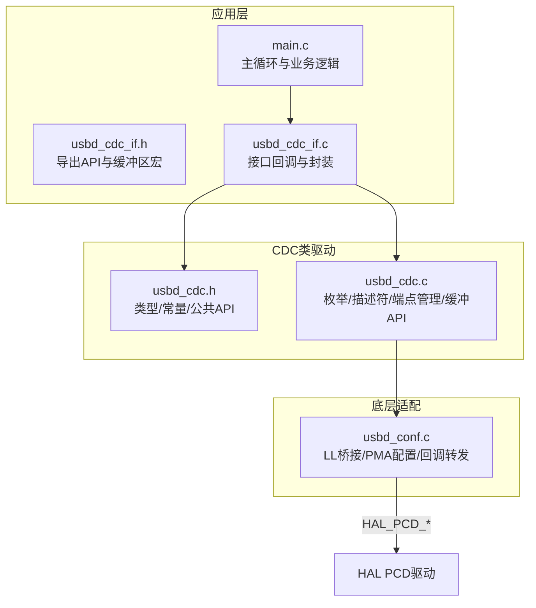
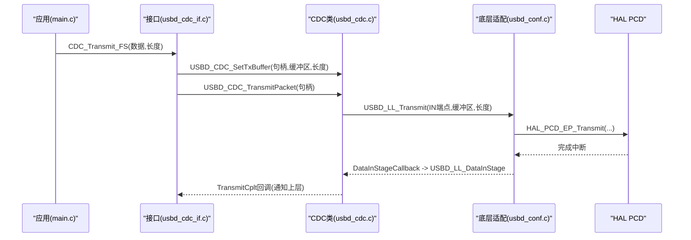
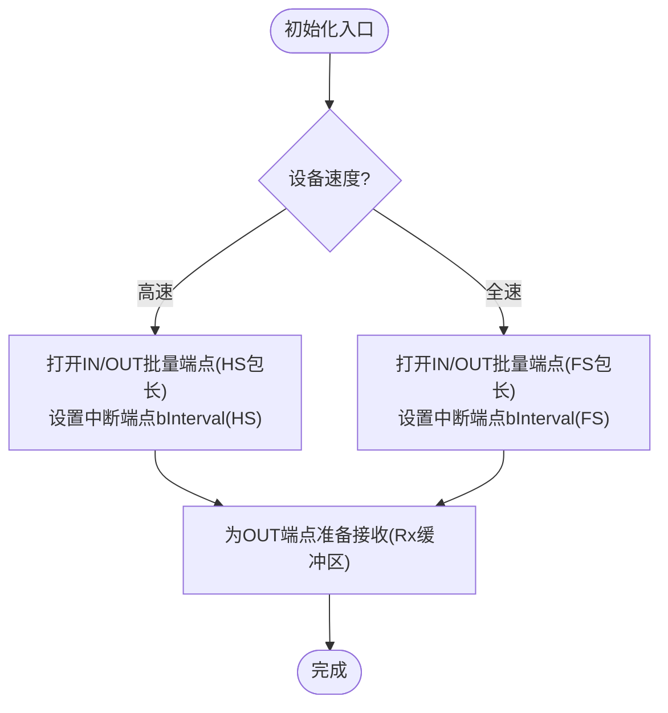
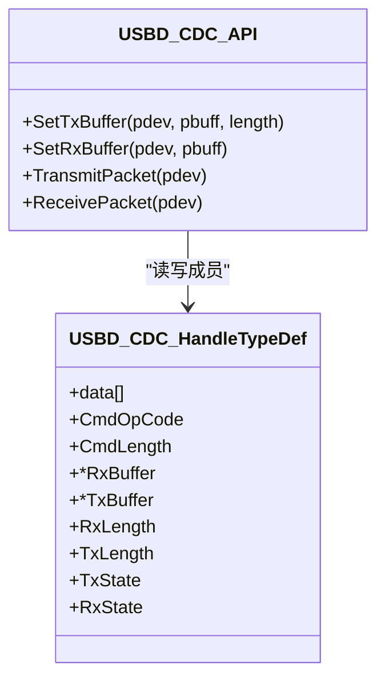
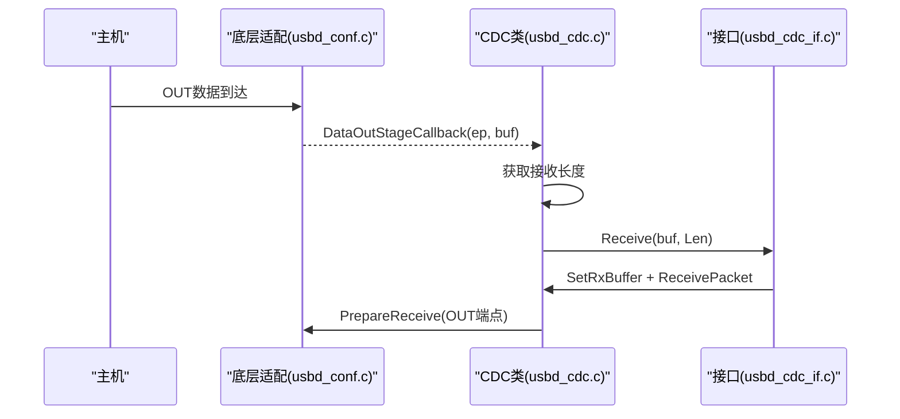

# CDC端点管理

<cite>
**本文引用的文件**   
- [usbd_cdc.h](file://Middlewares/ST/STM32_USB_Device_Library/Class/CDC/Inc/usbd_cdc.h)
- [usbd_cdc.c](file://Middlewares/ST/STM32_USB_Device_Library/Class/CDC/Src/usbd_cdc.c)
- [usbd_cdc_if.c](file://USB_Device/App/usbd_cdc_if.c)
- [usbd_cdc_if.h](file://USB_Device/App/usbd_cdc_if.h)
- [usb_device.c](file://USB_Device/App/usb_device.c)
- [usbd_conf.c](file://USB_Device/Target/usbd_conf.c)
- [main.c](file://Core/Src/main.c)
</cite>

## 目录
1. [简介](#简介)
2. [项目结构](#项目结构)
3. [核心组件](#核心组件)
4. [架构总览](#架构总览)
5. [详细组件分析](#详细组件分析)
6. [依赖关系分析](#依赖关系分析)
7. [性能与内存优化](#性能与内存优化)
8. [故障排查指南](#故障排查指南)
9. [结论](#结论)
10. [附录：端点配置速查](#附录端点配置速查)

## 简介
本技术文档围绕CDC虚拟串口设备的端点管理，重点解释中断端点（命令端点）与批量端点（数据IN/OUT）的配置、方向性、数据包大小与缓冲区管理。深入剖析缓冲管理函数（如设置发送/接收缓冲区、发送/接收包）的实现原理，说明端点的启用、禁用与重置流程，并提供状态监控与调试方法。同时给出面向初学者的USB端点基础概念，以及面向高级开发者的端点定制与性能优化建议。

## 项目结构
本项目基于STM32G4的USB设备库与CDC类实现，关键目录与职责如下：
- Middlewares/ST/STM32_USB_Device_Library/Class/CDC：CDC类驱动，包含端点描述符、初始化、收发回调与缓冲管理API
- USB_Device/App：应用层接口（注册CDC接口、定义用户收发缓冲区、封装发送函数）
- USB_Device/Target：底层HAL到USBD的桥接（端点打开/关闭、PMA配置、回调转发）
- Core/Src/main.c：应用主循环，演示通过CDC发送数据

图表来源
- [usbd_cdc.h:44-68](file://Middlewares/ST/STM32_USB_Device_Library/Class/CDC/Inc/usbd_cdc.h#L44-L68)
- [usbd_cdc.c:467-542](file://Middlewares/ST/STM32_USB_Device_Library/Class/CDC/Src/usbd_cdc.c#L467-L542)
- [usbd_conf.c:443-450](file://USB_Device/Target/usbd_conf.c#L443-L450)
- [usbd_cdc_if.c:138-145](file://USB_Device/App/usbd_cdc_if.c#L138-L145)
- [main.c:247-287](file://Core/Src/main.c#L247-L287)

章节来源
- [usbd_cdc.h:44-68](file://Middlewares/ST/STM32_USB_Device_Library/Class/CDC/Inc/usbd_cdc.h#L44-L68)
- [usbd_cdc.c:467-542](file://Middlewares/ST/STM32_USB_Device_Library/Class/CDC/Src/usbd_cdc.c#L467-L542)
- [usbd_conf.c:443-450](file://USB_Device/Target/usbd_conf.c#L443-L450)
- [usbd_cdc_if.c:138-145](file://USB_Device/App/usbd_cdc_if.c#L138-L145)
- [main.c:247-287](file://Core/Src/main.c#L247-L287)

## 核心组件
- CDC类驱动（usbd_cdc.*）
  - 定义端点地址与最大包长常量
  - 提供端点初始化/反初始化、Setup处理、IN/OUT回调
  - 暴露缓冲管理API：设置Tx/Rx缓冲区、发送/接收包
- 应用接口（usbd_cdc_if.*）
  - 定义用户级收发缓冲区大小
  - 注册CDC接口回调，封装发送函数
- 底层适配（usbd_conf.c）
  - 将USBD LL调用映射到HAL PCD API
  - 配置端点PMA内存区域
- 应用主循环（main.c）
  - 示例：在触发后打包数据并通过CDC发送

章节来源
- [usbd_cdc.h:44-68](file://Middlewares/ST/STM32_USB_Device_Library/Class/CDC/Inc/usbd_cdc.h#L44-L68)
- [usbd_cdc.c:852-955](file://Middlewares/ST/STM32_USB_Device_Library/Class/CDC/Src/usbd_cdc.c#L852-L955)
- [usbd_cdc_if.c:88-95](file://USB_Device/App/usbd_cdc_if.c#L88-L95)
- [usbd_conf.c:513-673](file://USB_Device/Target/usbd_conf.c#L513-L673)
- [main.c:247-287](file://Core/Src/main.c#L247-L287)

## 架构总览
CDC类采用“控制+数据”双接口模型：
- 控制接口（ACM）：使用一个中断端点（命令端点）传输控制请求（如波特率、流控等）
- 数据接口：使用一对批量端点（IN/OUT）进行双向数据传输

图表来源
- [main.c:207-212](file://Core/Src/main.c#L207-L212)
- [usbd_cdc_if.c:281-293](file://USB_Device/App/usbd_cdc_if.c#L281-L293)
- [usbd_cdc.c:899-924](file://Middlewares/ST/STM32_USB_Device_Library/Class/CDC/Src/usbd_cdc.c#L899-L924)
- [usbd_conf.c:643-653](file://USB_Device/Target/usbd_conf.c#L643-L653)
- [usbd_conf.c:174-186](file://USB_Device/Target/usbd_conf.c#L174-L186)

## 详细组件分析

### 端点定义与方向性
- 中断端点（命令端点）：用于ACM控制请求，方向为IN（设备→主机），类型为Interrupt
- 批量端点（数据端点）：
  - OUT端点：主机→设备，类型为Bulk
  - IN端点：设备→主机，类型为Bulk

端点地址与包大小常量定义位于CDC头文件中，分别区分高速与全速模式下的最大包长。

章节来源
- [usbd_cdc.h:44-68](file://Middlewares/ST/STM32_USB_Device_Library/Class/CDC/Inc/usbd_cdc.h#L44-L68)
- [usbd_cdc.c:216-254](file://Middlewares/ST/STM32_USB_Device_Library/Class/CDC/Src/usbd_cdc.c#L216-L254)
- [usbd_cdc.c:316-354](file://Middlewares/ST/STM32_USB_Device_Library/Class/CDC/Src/usbd_cdc.c#L316-L354)

### 端点初始化与生命周期
- 初始化（配置阶段）：
  - 根据当前速度选择FS或HS的最大包长
  - 打开IN/OUT批量端点与中断命令端点，标记已使用
  - 为OUT端点准备接收下一个包（预挂接Rx缓冲区）
- 反初始化：
  - 关闭三个端点并清除使用标志
  - 释放类实例内存，调用用户DeInit回调

图表来源
- [usbd_cdc.c:467-542](file://Middlewares/ST/STM32_USB_Device_Library/Class/CDC/Src/usbd_cdc.c#L467-L542)

章节来源
- [usbd_cdc.c:467-542](file://Middlewares/ST/STM32_USB_Device_Library/Class/CDC/Src/usbd_cdc.c#L467-L542)
- [usbd_cdc.c:551-577](file://Middlewares/ST/STM32_USB_Device_Library/Class/CDC/Src/usbd_cdc.c#L551-L577)

### 缓冲管理API与实现原理
- 设置发送缓冲区：保存Tx指针与长度，供后续发送使用
- 设置接收缓冲区：保存Rx指针，供接收回调使用
- 发送包：
  - 若未处于发送中，则置位发送状态，更新端点总长度，调用底层发送
  - 当IN端点完成时，若总长度为端点最大包长的整数倍，则自动发送ZLP（零长度包）以结束传输；否则清发送状态并回调上层
- 接收包：
  - 为OUT端点准备接收，按当前速度选择包长

图表来源
- [usbd_cdc.h:112-124](file://Middlewares/ST/STM32_USB_Device_Library/Class/CDC/Inc/usbd_cdc.h#L112-L124)
- [usbd_cdc.c:852-955](file://Middlewares/ST/STM32_USB_Device_Library/Class/CDC/Src/usbd_cdc.c#L852-L955)

章节来源
- [usbd_cdc.c:852-955](file://Middlewares/ST/STM32_USB_Device_Library/Class/CDC/Src/usbd_cdc.c#L852-L955)

### 数据路径与回调链
- 发送路径（IN端点）：
  - 应用调用封装函数 → CDC设置Tx缓冲 → CDC发送包 → 底层发送 → 完成回调 → 可能发送ZLP → 回调上层完成
- 接收路径（OUT端点）：
  - 主机发送数据 → 底层收到OUT数据 → 获取实际长度 → 回调上层接收处理 → 重新准备接收

图表来源
- [usbd_conf.c:152-165](file://USB_Device/Target/usbd_conf.c#L152-L165)
- [usbd_cdc.c:731-749](file://Middlewares/ST/STM32_USB_Device_Library/Class/CDC/Src/usbd_cdc.c#L731-L749)
- [usbd_cdc_if.c:261-268](file://USB_Device/App/usbd_cdc_if.c#L261-L268)

章节来源
- [usbd_conf.c:152-165](file://USB_Device/Target/usbd_conf.c#L152-L165)
- [usbd_cdc.c:731-749](file://Middlewares/ST/STM32_USB_Device_Library/Class/CDC/Src/usbd_cdc.c#L731-L749)
- [usbd_cdc_if.c:261-268](file://USB_Device/App/usbd_cdc_if.c#L261-L268)

### 端点启用、禁用与重置
- 启用：在CDC初始化中打开端点并标记使用，为OUT端点准备接收
- 禁用：关闭端点并清除使用标志，释放类实例
- 重置：HAL复位回调会调用USBD_LL_Reset，随后CDC会在下一次配置阶段重新初始化端点

章节来源
- [usbd_cdc.c:467-542](file://Middlewares/ST/STM32_USB_Device_Library/Class/CDC/Src/usbd_cdc.c#L467-L542)
- [usbd_cdc.c:551-577](file://Middlewares/ST/STM32_USB_Device_Library/Class/CDC/Src/usbd_cdc.c#L551-L577)
- [usbd_conf.c:214-236](file://USB_Device/Target/usbd_conf.c#L214-L236)

### 端点状态监控与调试
- 发送忙状态：检查TxState，避免重复提交导致冲突
- 端点Stall检测：通过底层接口查询IN/OUT端点是否STALL
- 接收长度：在OUT回调中获取实际接收字节数，便于统计丢包或异常
- 日志与断点：在DataIn/DataOut回调与ZLP判断处添加断点，观察total_length与maxpacket的关系

章节来源
- [usbd_cdc.c:690-722](file://Middlewares/ST/STM32_USB_Device_Library/Class/CDC/Src/usbd_cdc.c#L690-L722)
- [usbd_conf.c:603-615](file://USB_Device/Target/usbd_conf.c#L603-L615)
- [usbd_cdc_if.c:281-293](file://USB_Device/App/usbd_cdc_if.c#L281-L293)

### 应用层封装与使用示例
- 应用层定义用户收发缓冲区大小，并在CDC初始化时设置缓冲区
- 封装发送函数：先检查发送忙，再设置Tx缓冲并提交发送包
- 主循环示例：采集ADC数据后，组装文本并调用封装函数发送

章节来源
- [usbd_cdc_if.h:51-53](file://USB_Device/App/usbd_cdc_if.h#L51-L53)
- [usbd_cdc_if.c:152-160](file://USB_Device/App/usbd_cdc_if.c#L152-L160)
- [usbd_cdc_if.c:281-293](file://USB_Device/App/usbd_cdc_if.c#L281-L293)
- [main.c:207-212](file://Core/Src/main.c#L207-L212)

## 依赖关系分析
- CDC类依赖底层适配提供的端点操作与回调转发
- 应用接口依赖CDC类API与全局设备句柄
- 底层适配依赖HAL PCD驱动，负责PMA分配与中断转发

图表来源
- [usb_device.c:66-84](file://USB_Device/App/usb_device.c#L66-L84)
- [usbd_conf.c:394-452](file://USB_Device/Target/usbd_conf.c#L394-L452)

章节来源
- [usb_device.c:66-84](file://USB_Device/App/usb_device.c#L66-L84)
- [usbd_conf.c:394-452](file://USB_Device/Target/usbd_conf.c#L394-L452)

## 性能与内存优化
- 包大小与吞吐
  - FS模式下批量端点最大包长为64字节，HS模式为512字节。合理选择包长可提升吞吐
  - 对于大数据量发送，尽量一次提交接近最大包长的数据，减少ZLP次数
- ZLP机制
  - 当发送数据长度为端点最大包长的整数倍时，需额外发送ZLP以结束传输。注意避免频繁ZLP带来的开销
- 缓冲区管理
  - 用户缓冲区大小应大于等于单次发送的最大长度，避免跨包拼接复杂化
  - 接收侧在回调中尽快重新PrepareReceive，防止NAK堆积
- PMA内存布局
  - 确保各端点PMA区域不重叠，且对齐满足要求。可在底层适配中调整PMA起始地址与大小
- 中断与DMA
  - 对高频小数据，考虑使用中断端点；对大数据流，使用批量端点配合DMA更高效
- 状态机与并发
  - 发送前检查忙状态，避免重复提交；必要时引入队列与锁保护

章节来源
- [usbd_cdc.h:57-68](file://Middlewares/ST/STM32_USB_Device_Library/Class/CDC/Inc/usbd_cdc.h#L57-L68)
- [usbd_cdc.c:690-722](file://Middlewares/ST/STM32_USB_Device_Library/Class/CDC/Src/usbd_cdc.c#L690-L722)
- [usbd_conf.c:443-450](file://USB_Device/Target/usbd_conf.c#L443-L450)

## 故障排查指南
- 无法枚举或无端口
  - 检查描述符是否正确返回，确认CDC类注册成功
  - 查看底层初始化与回调是否被调用
- 发送卡住或无响应
  - 检查TxState是否为忙，避免重复提交
  - 确认IN端点是否已打开且PMA配置正确
- 接收丢失或乱序
  - 在OUT回调中及时重新PrepareReceive
  - 核对接收长度与实际数据一致
- 主机端提示端点错误
  - 使用IsStall检测端点状态，必要时清除STALL并恢复

章节来源
- [usbd_cdc.c:690-722](file://Middlewares/ST/STM32_USB_Device_Library/Class/CDC/Src/usbd_cdc.c#L690-L722)
- [usbd_conf.c:603-615](file://USB_Device/Target/usbd_conf.c#L603-L615)
- [usbd_cdc_if.c:261-268](file://USB_Device/App/usbd_cdc_if.c#L261-L268)

## 结论
CDC端点管理由CDC类驱动与应用接口协同完成：CDC类负责端点生命周期、描述符与缓冲管理API，应用接口负责用户缓冲区与发送封装，底层适配负责HAL桥接与PMA配置。理解端点方向性、包大小与ZLP机制是优化吞吐的关键。通过状态监控与回调链路调试，可有效定位问题并提升稳定性。

## 附录：端点配置速查
- 中断端点（命令端点）
  - 方向：IN（设备→主机）
  - 类型：Interrupt
  - 用途：ACM控制请求（如SET_LINE_CODING等）
- 批量端点（数据端点）
  - OUT端点：主机→设备，Bulk，用于接收数据
  - IN端点：设备→主机，Bulk，用于发送数据
- 最大包长
  - FS：64字节
  - HS：512字节
- 常用API
  - 设置发送缓冲区：SetTxBuffer
  - 设置接收缓冲区：SetRxBuffer
  - 发送包：TransmitPacket
  - 接收包：ReceivePacket

章节来源
- [usbd_cdc.h:44-68](file://Middlewares/ST/STM32_USB_Device_Library/Class/CDC/Inc/usbd_cdc.h#L44-L68)
- [usbd_cdc.c:852-955](file://Middlewares/ST/STM32_USB_Device_Library/Class/CDC/Src/usbd_cdc.c#L852-L955)