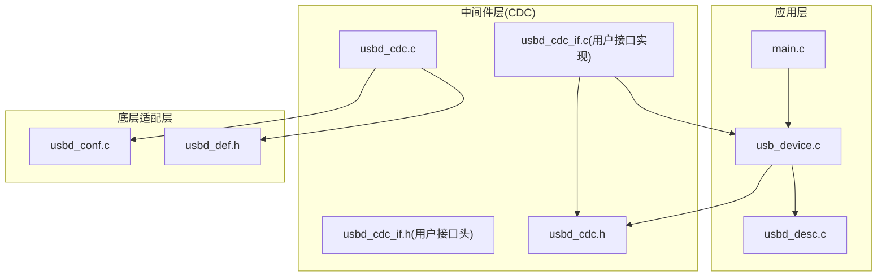
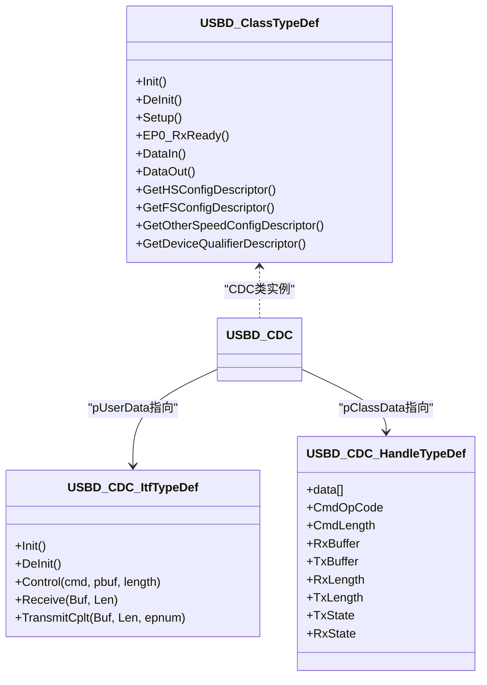
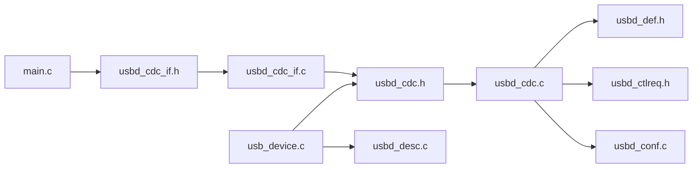
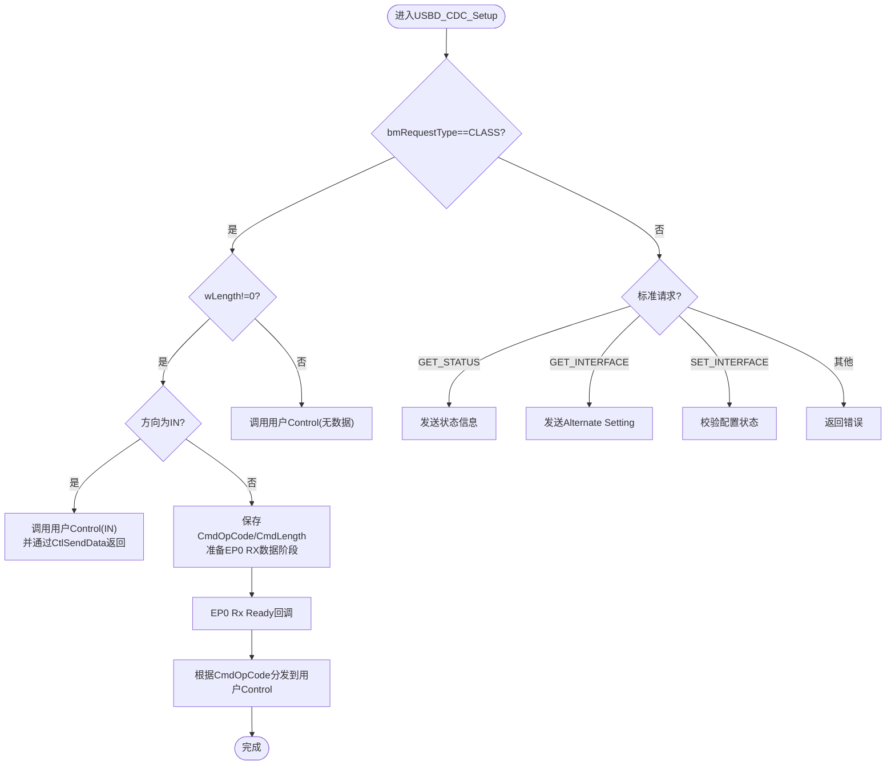
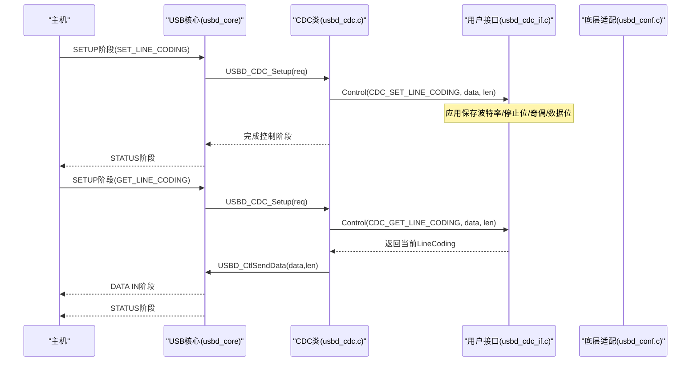
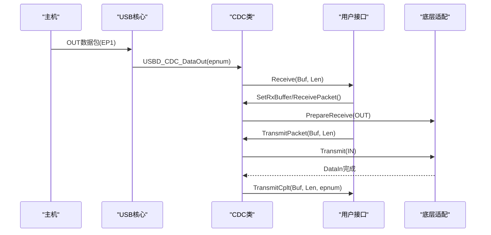

# CDC类协议实现

<cite>
**本文引用的文件**
- [usbd_cdc.h](file://Middlewares/ST/STM32_USB_Device_Library/Class/CDC/Inc/usbd_cdc.h)
- [usbd_cdc.c](file://Middlewares/ST/STM32_USB_Device_Library/Class/CDC/Src/usbd_cdc.c)
- [usbd_def.h](file://Middlewares/ST/STM32_USB_Device_Library/Core/Inc/usbd_def.h)
- [usb_device.c](file://USB_Device/App/usb_device.c)
- [usbd_desc.c](file://USB_Device/App/usbd_desc.c)
- [usbd_conf.c](file://USB_Device/Target/usbd_conf.c)
- [main.c](file://Core/Src/main.c)
</cite>

## 目录
1. [简介](#简介)
2. [项目结构](#项目结构)
3. [核心组件](#核心组件)
4. [架构总览](#架构总览)
5. [详细组件分析](#详细组件分析)
6. [依赖关系分析](#依赖关系分析)
7. [性能与端点配置](#性能与端点配置)
8. [故障排查指南](#故障排查指南)
9. [结论](#结论)
10. [附录：CDC命令处理流程与时序](#附录cdc命令处理流程与时序)

## 简介
本技术文档围绕STM32 USB设备库中的CDC（通信设备类）实现，系统性阐述其架构设计、控制接口与数据接口的分离方式、标准命令处理机制（如SET_LINE_CODING、GET_LINE_CODING、SET_CONTROL_LINE_STATE）、端点配置（中断与控制、批量数据端点）、USBD_CDC_ItfTypeDef函数指针表的使用与回调注册机制，并提供状态机与时序图。文档同时包含错误处理与异常恢复策略，既适合初学者理解CDC基础，也为高级开发者提供扩展与定制指导。

## 项目结构
本项目采用分层组织：
- 应用层：main.c负责系统初始化、ADC采集与通过CDC发送数据；usb_device.c完成USB设备库初始化并注册CDC类与用户接口；usbd_desc.c提供设备描述符与字符串描述符。
- 中间件层：usbd_cdc.{h,c}实现CDC类驱动，定义类回调接口、端点管理、请求分发与数据包收发。
- 底层适配层：usbd_conf.c将HAL PCD与USB设备库桥接，完成端点PMA分配、中断回调转发等。



图表来源
- [usb_device.c:66-88](file://USB_Device/App/usb_device.c#L66-L88)
- [usbd_cdc.c:140-156](file://Middlewares/ST/STM32_USB_Device_Library/Class/CDC/Src/usbd_cdc.c#L140-L156)
- [usbd_conf.c:394-452](file://USB_Device/Target/usbd_conf.c#L394-L452)
- [usbd_def.h:213-236](file://Middlewares/ST/STM32_USB_Device_Library/Core/Inc/usbd_def.h#L213-L236)

章节来源
- [usb_device.c:66-88](file://USB_Device/App/usb_device.c#L66-L88)
- [usbd_cdc.c:140-156](file://Middlewares/ST/STM32_USB_Device_Library/Class/CDC/Src/usbd_cdc.c#L140-L156)
- [usbd_conf.c:394-452](file://USB_Device/Target/usbd_conf.c#L394-L452)
- [usbd_def.h:213-236](file://Middlewares/ST/STM32_USB_Device_Library/Core/Inc/usbd_def.h#L213-L236)

## 核心组件
- CDC类驱动：定义USBD_ClassTypeDef实例，封装Init/DeInit/Setup/DataIn/DataOut/描述符获取等回调，内部维护USBD_CDC_HandleTypeDef以跟踪收发状态与缓冲区。
- 用户接口：USBD_CDC_ItfTypeDef函数指针表，由应用实现Init/DeInit/Control/Receive/TransmitCplt，用于对接具体硬件（如UART或DMA）。
- 底层适配：usbd_conf.c实现USBD_LL_*系列API，将上层调用映射到HAL_PCD_*，并配置端点PMA区域。
- 描述符：usbd_desc.c提供设备、配置、字符串描述符，声明为CDC类设备。

章节来源
- [usbd_cdc.h:94-125](file://Middlewares/ST/STM32_USB_Device_Library/Class/CDC/Inc/usbd_cdc.h#L94-L125)
- [usbd_cdc.c:140-156](file://Middlewares/ST/STM32_USB_Device_Library/Class/CDC/Src/usbd_cdc.c#L140-L156)
- [usbd_conf.c:394-452](file://USB_Device/Target/usbd_conf.c#L394-L452)
- [usbd_desc.c:132-141](file://USB_Device/App/usbd_desc.c#L132-L141)

## 架构总览
CDC类采用“控制接口”和“数据接口”分离的设计：
- 控制接口：使用中断端点（EP2 IN）传输ACM控制命令（如SET_LINE_CODING、GET_LINE_CODING、SET_CONTROL_LINE_STATE），由USBD_CDC_Setup解析后转发至用户Control回调。
- 数据接口：使用批量端点（EP1 OUT/IN）进行数据收发，由DataOut/DataIn回调触发用户Receive/TransmitCplt回调。



图表来源
- [usbd_def.h:213-236](file://Middlewares/ST/STM32_USB_Device_Library/Core/Inc/usbd_def.h#L213-L236)
- [usbd_cdc.h:94-125](file://Middlewares/ST/STM32_USB_Device_Library/Class/CDC/Inc/usbd_cdc.h#L94-L125)
- [usbd_cdc.c:140-156](file://Middlewares/ST/STM32_USB_Device_Library/Class/CDC/Src/usbd_cdc.c#L140-L156)

## 详细组件分析

### CDC类驱动（usbd_cdc.c/.h）
- 端点与描述符：在配置描述符中定义两个接口（控制+数据），一个中断端点（命令）和两个批量端点（数据OUT/IN）。高速/全速分别设置不同wMaxPacketSize与bInterval。
- 初始化流程：根据速度打开对应端点，设置中断端点bInterval，调用用户Init，准备接收下一个OUT包。
- 请求处理：USBD_CDC_Setup对CLASS请求进行分发，若需数据阶段则通过用户Control回调处理；对标准请求（如GET_STATUS、GET_INTERFACE、SET_INTERFACE）按状态机处理。
- 数据路径：DataOut读取接收长度并调用用户Receive；DataIn检测ZLP并调用用户TransmitCplt。
- 公共API：SetTxBuffer/SetRxBuffer/TransmitPacket/ReceivePacket用于应用层组装与调度数据。

章节来源
- [usbd_cdc.c:467-542](file://Middlewares/ST/STM32_USB_Device_Library/Class/CDC/Src/usbd_cdc.c#L467-L542)
- [usbd_cdc.c:586-681](file://Middlewares/ST/STM32_USB_Device_Library/Class/CDC/Src/usbd_cdc.c#L586-L681)
- [usbd_cdc.c:690-775](file://Middlewares/ST/STM32_USB_Device_Library/Class/CDC/Src/usbd_cdc.c#L690-L775)
- [usbd_cdc.c:899-955](file://Middlewares/ST/STM32_USB_Device_Library/Class/CDC/Src/usbd_cdc.c#L899-L955)
- [usbd_cdc.h:44-68](file://Middlewares/ST/STM32_USB_Device_Library/Class/CDC/Inc/usbd_cdc.h#L44-L68)

### 用户接口（usbd_cdc_if.c/.h）
- 函数指针表：USBD_Interface_fops_FS填充Init/DeInit/Control/Receive/TransmitCplt，供CDC类驱动调用。
- 缓冲管理：UserRxBufferFS/UserTxBufferFS作为数据收发缓冲区，Init中通过SetRxBuffer/SetTxBuffer绑定。
- 控制命令：CDC_Control_FS预留了CDC_SET_LINE_CODING、CDC_GET_LINE_CODING、CDC_SET_CONTROL_LINE_STATE等分支，便于应用实现串口参数与DTR/RTS控制逻辑。
- 数据收发：CDC_Transmit_FS封装非阻塞发送，检查TxState避免重复提交；CDC_Receive_FS在收到数据后重新准备接收。

章节来源
- [usbd_cdc_if.c:138-145](file://USB_Device/App/usbd_cdc_if.c#L138-L145)
- [usbd_cdc_if.c:152-160](file://USB_Device/App/usbd_cdc_if.c#L152-L160)
- [usbd_cdc_if.c:180-244](file://USB_Device/App/usbd_cdc_if.c#L180-L244)
- [usbd_cdc_if.c:261-293](file://USB_Device/App/usbd_cdc_if.c#L261-L293)
- [usbd_cdc_if.h:52-54](file://USB_Device/App/usbd_cdc_if.h#L52-L54)

### 底层适配（usbd_conf.c）
- HAL回调桥接：PCD_SetupStageCallback/PCD_DataInStageCallback/PCD_DataOutStageCallback等将HAL事件转发给USBD_LL_*。
- 端点PMA配置：为EP0、EP1、EP2分配PMA缓冲区地址，确保数据正确存放。
- LL API实现：OpenEP/CloseEP/Transmit/PrepareReceive等直接调用HAL_PCD_*，屏蔽底层差异。

章节来源
- [usbd_conf.c:131-186](file://USB_Device/Target/usbd_conf.c#L131-L186)
- [usbd_conf.c:443-450](file://USB_Device/Target/usbd_conf.c#L443-L450)
- [usbd_conf.c:513-673](file://USB_Device/Target/usbd_conf.c#L513-L673)

### 描述符与设备注册（usbd_desc.c、usb_device.c）
- 描述符：设备类设置为CDC（Class=0x02, SubClass=0x02, Protocol=0x00），配置描述符包含ACM功能描述符与Union集合。
- 注册流程：MX_USB_Device_Init依次调用USBD_Init、USBD_RegisterClass、USBD_CDC_RegisterInterface、USBD_Start，完成类与用户接口绑定。

章节来源
- [usbd_desc.c:147-167](file://USB_Device/App/usbd_desc.c#L147-L167)
- [usb_device.c:66-88](file://USB_Device/App/usb_device.c#L66-L88)

## 依赖关系分析
- 应用层依赖：main.c通过usbd_cdc_if.h暴露的CDC_Transmit_FS发送数据；usb_device.c依赖usbd_cdc.h与usbd_cdc_if.h完成类与接口注册。
- 中间件层依赖：usbd_cdc.c依赖usbd_def.h中的USBD_ClassTypeDef与USBD_HandleTypeDef，以及usbd_ctlreq.h提供的控制请求处理辅助。
- 底层依赖：usbd_conf.c依赖HAL与LL，提供USBD_LL_*实现。



图表来源
- [usb_device.c:66-88](file://USB_Device/App/usb_device.c#L66-L88)
- [usbd_cdc.c:59-61](file://Middlewares/ST/STM32_USB_Device_Library/Class/CDC/Src/usbd_cdc.c#L59-L61)
- [usbd_conf.c:394-452](file://USB_Device/Target/usbd_conf.c#L394-L452)

章节来源
- [usb_device.c:66-88](file://USB_Device/App/usb_device.c#L66-L88)
- [usbd_cdc.c:59-61](file://Middlewares/ST/STM32_USB_Device_Library/Class/CDC/Src/usbd_cdc.c#L59-L61)
- [usbd_conf.c:394-452](file://USB_Device/Target/usbd_conf.c#L394-L452)

## 性能与端点配置
- 端点类型与大小：
  - 命令端点（EP2 IN）：中断类型，小包尺寸（8字节），bInterval在全速下为0x10。
  - 数据端点（EP1 OUT/IN）：批量类型，全速最大包64字节，高速最大包512字节。
- 速率自适应：初始化时根据dev_speed选择对应端点大小与bInterval。
- ZLP处理：当发送数据长度为端点最大包的整数倍时，自动发送零长度包以确保主机正确结束事务。
- PMA分配：为各端点分配独立PMA缓冲区，避免冲突。

章节来源
- [usbd_cdc.c:467-542](file://Middlewares/ST/STM32_USB_Device_Library/Class/CDC/Src/usbd_cdc.c#L467-L542)
- [usbd_cdc.c:690-722](file://Middlewares/ST/STM32_USB_Device_Library/Class/CDC/Src/usbd_cdc.c#L690-L722)
- [usbd_conf.c:443-450](file://USB_Device/Target/usbd_conf.c#L443-L450)

## 故障排查指南
- 常见问题定位：
  - 枚举失败：检查设备描述符与配置描述符是否完整，确认VID/PID与类标识。
  - 无法接收数据：确认USBD_LL_PrepareReceive已调用，且用户Receive回调中再次准备接收。
  - 发送卡住：检查TxState标志位，避免重复提交；注意ZLP处理。
  - 控制命令无响应：确认USBD_CDC_RegisterInterface已调用，且Control回调分支覆盖所需命令。
- 错误码与恢复：
  - USBD_BUSY：表示正在传输，稍后重试。
  - USBD_FAIL：可能为内存不足或参数错误，检查pClassData是否为空及缓冲区有效性。
  - USBD_EMEM：动态内存分配失败，改用静态缓冲或调整配置。

章节来源
- [usbd_cdc.c:899-924](file://Middlewares/ST/STM32_USB_Device_Library/Class/CDC/Src/usbd_cdc.c#L899-L924)
- [usbd_cdc.c:932-955](file://Middlewares/ST/STM32_USB_Device_Library/Class/CDC/Src/usbd_cdc.c#L932-L955)
- [usbd_def.h:247-253](file://Middlewares/ST/STM32_USB_Device_Library/Core/Inc/usbd_def.h#L247-L253)

## 结论
该CDC实现遵循USB CDC ACM规范，采用清晰的控制/数据接口分离与回调注册机制，具备良好的可扩展性与可移植性。通过合理配置端点与PMA、完善错误处理与ZLP逻辑，可在多种速率下稳定工作。应用层仅需实现用户接口回调即可完成自定义业务逻辑，适合从入门到进阶的开发需求。

## 附录：CDC命令处理流程与时序

### 控制命令处理流程图（基于USBD_CDC_Setup与用户Control）


图表来源
- [usbd_cdc.c:586-681](file://Middlewares/ST/STM32_USB_Device_Library/Class/CDC/Src/usbd_cdc.c#L586-L681)
- [usbd_cdc.c:757-775](file://Middlewares/ST/STM32_USB_Device_Library/Class/CDC/Src/usbd_cdc.c#L757-L775)

章节来源
- [usbd_cdc.c:586-681](file://Middlewares/ST/STM32_USB_Device_Library/Class/CDC/Src/usbd_cdc.c#L586-L681)
- [usbd_cdc.c:757-775](file://Middlewares/ST/STM32_USB_Device_Library/Class/CDC/Src/usbd_cdc.c#L757-L775)

### 典型时序图：SET_LINE_CODING与GET_LINE_CODING


图表来源
- [usbd_cdc.c:586-681](file://Middlewares/ST/STM32_USB_Device_Library/Class/CDC/Src/usbd_cdc.c#L586-L681)
- [usbd_cdc.c:757-775](file://Middlewares/ST/STM32_USB_Device_Library/Class/CDC/Src/usbd_cdc.c#L757-L775)
- [usbd_cdc_if.c:180-244](file://USB_Device/App/usbd_cdc_if.c#L180-L244)

### 数据收发时序图（批量端点）


图表来源
- [usbd_cdc.c:690-775](file://Middlewares/ST/STM32_USB_Device_Library/Class/CDC/Src/usbd_cdc.c#L690-L775)
- [usbd_cdc.c:899-955](file://Middlewares/ST/STM32_USB_Device_Library/Class/CDC/Src/usbd_cdc.c#L899-L955)
- [usbd_cdc_if.c:261-293](file://USB_Device/App/usbd_cdc_if.c#L261-L293)

### CDC协议状态机（简化）
```mermaid
stateDiagram-v2
[*] --> Default
Default --> Addressed : "SET_ADDRESS"
Addressed --> Configured : "SET_CONFIGURATION"
Configured --> Suspended : "SUSPEND"
Suspended --> Configured : "RESUME"
Configured --> [*] : "RESET"
```

图表来源
- [usbd_def.h:142-146](file://Middlewares/ST/STM32_USB_Device_Library/Core/Inc/usbd_def.h#L142-L146)

### 应用层集成要点（main.c）
- 初始化顺序：系统时钟与外设初始化后，调用MX_USB_Device_Init启动USB设备。
- 数据采集与发送：ADC DMA循环采集，触发后重组时间线，通过CDC_Transmit_FS发送文本化数据。
- 并发保护：使用uart_busy标志防止在发送期间误触发采集。

章节来源
- [main.c:219-290](file://Core/Src/main.c#L219-L290)
- [main.c:178-212](file://Core/Src/main.c#L178-L212)