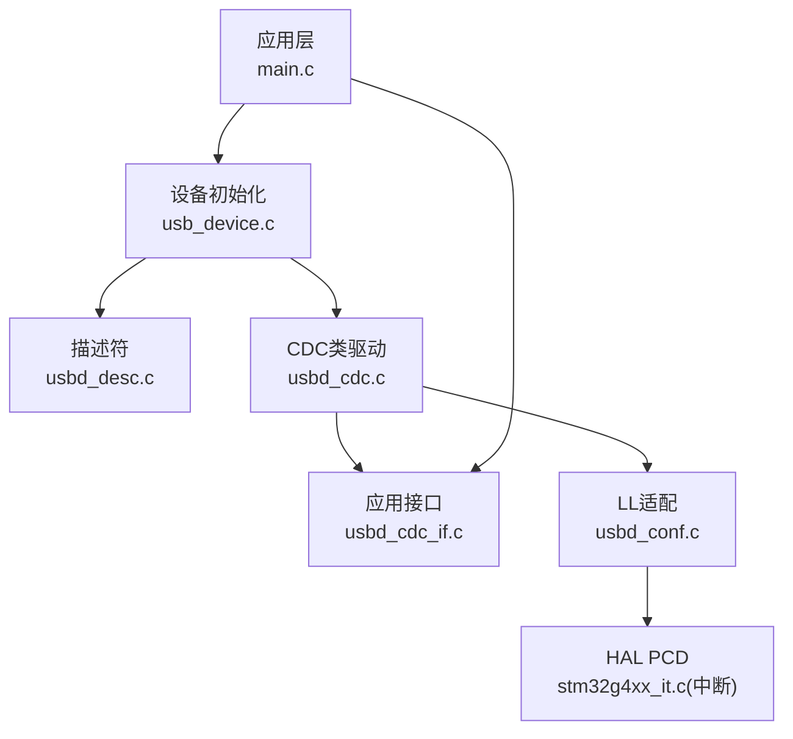
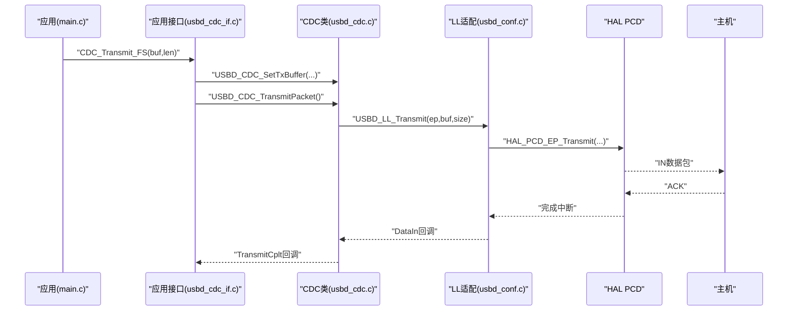
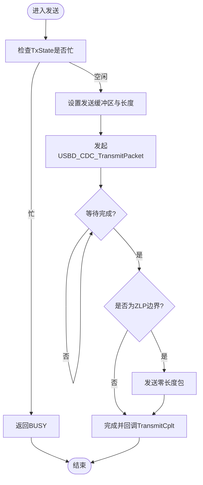
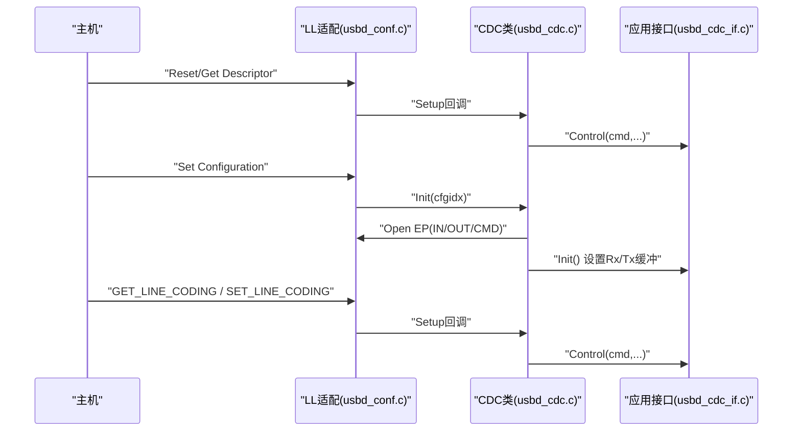

# USB CDC通信系统

<cite>
**本文引用的文件**   
- [Core/Src/main.c](file://Core/Src/main.c)
- [USB_Device/App/usb_device.c](file://USB_Device/App/usb_device.c)
- [USB_Device/App/usbd_desc.c](file://USB_Device/App/usbd_desc.c)
- [USB_Device/App/usbd_cdc_if.c](file://USB_Device/App/usbd_cdc_if.c)
- [Middlewares/ST/STM32_USB_Device_Library/Class/CDC/Src/usbd_cdc.c](file://Middlewares/ST/STM32_USB_Device_Library/Class/CDC/Src/usbd_cdc.c)
- [Middlewares/ST/STM32_USB_Device_Library/Class/CDC/Inc/usbd_cdc.h](file://Middlewares/ST/STM32_USB_Device_Library/Class/CDC/Inc/usbd_cdc.h)
- [USB_Device/Target/usbd_conf.c](file://USB_Device/Target/usbd_conf.c)
- [Core/Src/stm32g4xx_it.c](file://Core/Src/stm32g4xx_it.c)
</cite>

## 目录
1. [简介](#简介)
2. [项目结构](#项目结构)
3. [核心组件](#核心组件)
4. [架构总览](#架构总览)
5. [详细组件分析](#详细组件分析)
6. [依赖关系分析](#依赖关系分析)
7. [性能与优化](#性能与优化)
8. [故障排查指南](#故障排查指南)
9. [结论](#结论)
10. [附录：协议与配置要点](#附录协议与配置要点)

## 简介
本技术文档围绕基于STM32G4的USB CDC虚拟串口通信系统，系统性阐述以下主题：
- USB设备描述符配置（设备类、接口类、端点类）
- CDC类协议实现（控制端点与数据端点）
- 非阻塞批量数据传输机制（发送流程与状态管理）
- ASCII文本输出协议（编码与行终止符）
- 波特率与通信参数设置（Line Coding）
- USB枚举过程与连接状态管理
- 时序图与流程图（从枚举到数据传输）
- 面向初学者的USB基础概念与面向高级开发者的定制与优化建议

## 项目结构
本项目采用分层组织方式：
- 应用层：main.c负责ADC采集、DMA缓冲、触发事件处理以及通过CDC将采样结果以ASCII文本形式发送。
- 设备抽象层：usb_device.c完成USB设备库初始化、注册CDC类与应用接口回调。
- 描述符层：usbd_desc.c提供标准设备描述符与字符串描述符。
- CDC类驱动：usbd_cdc.c实现CDC类枚举、请求处理、端点管理与数据收发。
- 应用接口层：usbd_cdc_if.c实现用户侧的接收/发送回调与封装函数。
- 底层适配层：usbd_conf.c实现HAL PCD与USBD LL之间的桥接、中断与PMA配置。
- 中断服务程序：stm32g4xx_it.c分发外设中断至HAL/USBD。

图表来源
- [Core/Src/main.c:219-290](file://Core/Src/main.c#L219-L290)
- [USB_Device/App/usb_device.c:66-88](file://USB_Device/App/usb_device.c#L66-L88)
- [USB_Device/App/usbd_desc.c:132-141](file://USB_Device/App/usbd_desc.c#L132-L141)
- [Middlewares/ST/STM32_USB_Device_Library/Class/CDC/Src/usbd_cdc.c:140-156](file://Middlewares/ST/STM32_USB_Device_Library/Class/CDC/Src/usbd_cdc.c#L140-L156)
- [USB_Device/App/usbd_cdc_if.c:138-145](file://USB_Device/App/usbd_cdc_if.c#L138-L145)
- [USB_Device/Target/usbd_conf.c:394-452](file://USB_Device/Target/usbd_conf.c#L394-L452)
- [Core/Src/stm32g4xx_it.c:233-242](file://Core/Src/stm32g4xx_it.c#L233-L242)

章节来源
- [Core/Src/main.c:219-290](file://Core/Src/main.c#L219-L290)
- [USB_Device/App/usb_device.c:66-88](file://USB_Device/App/usb_device.c#L66-L88)

## 核心组件
- 设备描述符与字符串：定义设备VID/PID、产品名、序列号等，供主机枚举识别。
- CDC类驱动：实现CDC ACM协议，包含两个数据端点（IN/OUT）和一个命令端点（中断）。
- 应用接口：暴露CDC_Transmit_FS等API，封装发送流程并检查忙状态。
- 底层适配：将USBD_LL调用映射到HAL_PCD，配置PMA缓冲区与中断。
- 应用逻辑：在main中构建ASCII文本并通过CDC发送。

章节来源
- [USB_Device/App/usbd_desc.c:147-167](file://USB_Device/App/usbd_desc.c#L147-L167)
- [Middlewares/ST/STM32_USB_Device_Library/Class/CDC/Src/usbd_cdc.c:258-354](file://Middlewares/ST/STM32_USB_Device_Library/Class/CDC/Src/usbd_cdc.c#L258-L354)
- [USB_Device/App/usbd_cdc_if.c:281-293](file://USB_Device/App/usbd_cdc_if.c#L281-L293)
- [USB_Device/Target/usbd_conf.c:394-452](file://USB_Device/Target/usbd_conf.c#L394-L452)
- [Core/Src/main.c:178-212](file://Core/Src/main.c#L178-L212)

## 架构总览
下图展示了从应用层到硬件中断的完整路径，包括CDC控制面与数据面的交互。

图表来源
- [Core/Src/main.c:178-212](file://Core/Src/main.c#L178-L212)
- [USB_Device/App/usbd_cdc_if.c:281-293](file://USB_Device/App/usbd_cdc_if.c#L281-L293)
- [Middlewares/ST/STM32_USB_Device_Library/Class/CDC/Src/usbd_cdc.c:690-722](file://Middlewares/ST/STM32_USB_Device_Library/Class/CDC/Src/usbd_cdc.c#L690-L722)
- [USB_Device/Target/usbd_conf.c:643-653](file://USB_Device/Target/usbd_conf.c#L643-L653)

## 详细组件分析

### 设备描述符与字符串
- 设备描述符定义了设备类为“Communication”，子类为ACM，协议为Common AT Commands；并提供厂商、产品、序列号等字符串描述符。
- 字符串描述符使用内部缓冲区生成Unicode格式，序列号由芯片唯一ID组合生成。

章节来源
- [USB_Device/App/usbd_desc.c:147-167](file://USB_Device/App/usbd_desc.c#L147-L167)
- [USB_Device/App/usbd_desc.c:222-227](file://USB_Device/App/usbd_desc.c#L222-L227)
- [USB_Device/App/usbd_desc.c:339-356](file://USB_Device/App/usbd_desc.c#L339-L356)

### CDC配置描述符与端点定义
- 配置描述符声明两个接口：
  - 控制接口（Communication Interface Class, Subclass=ACM, Protocol=Common AT），含一个中断端点用于控制命令。
  - 数据接口（Interface Class=CDC Data），含两个批量端点（IN/OUT）用于数据传输。
- 端点大小：FS模式下数据端点最大包长为64字节，命令端点为8字节。
- 功能描述符：Header、Call Management、ACM、Union，表明控制与数据接口的关联关系。

章节来源
- [Middlewares/ST/STM32_USB_Device_Library/Class/CDC/Src/usbd_cdc.c:258-354](file://Middlewares/ST/STM32_USB_Device_Library/Class/CDC/Src/usbd_cdc.c#L258-L354)
- [Middlewares/ST/STM32_USB_Device_Library/Class/CDC/Inc/usbd_cdc.h:44-68](file://Middlewares/ST/STM32_USB_Device_Library/Class/CDC/Inc/usbd_cdc.h#L44-L68)

### CDC类驱动与请求处理
- 初始化时打开三个端点：IN数据、OUT数据、CMD中断，并根据速度选择对应包长与间隔。
- Setup阶段处理标准与类请求，将类请求委派给应用接口Control回调。
- 数据面：
  - IN端点完成时，若总长度为端点包长的整数倍则发送ZLP，否则置TxState空闲并触发TransmitCplt回调。
  - OUT端点收到数据后，立即调用Receive回调并将长度返回应用。

章节来源
- [Middlewares/ST/STM32_USB_Device_Library/Class/CDC/Src/usbd_cdc.c:467-542](file://Middlewares/ST/STM32_USB_Device_Library/Class/CDC/Src/usbd_cdc.c#L467-L542)
- [Middlewares/ST/STM32_USB_Device_Library/Class/CDC/Src/usbd_cdc.c:586-681](file://Middlewares/ST/STM32_USB_Device_Library/Class/CDC/Src/usbd_cdc.c#L586-L681)
- [Middlewares/ST/STM32_USB_Device_Library/Class/CDC/Src/usbd_cdc.c:690-749](file://Middlewares/ST/STM32_USB_Device_Library/Class/CDC/Src/usbd_cdc.c#L690-L749)

### 应用接口与发送封装
- 应用接口提供CDC_Transmit_FS，内部检查TxState避免重复发送，设置发送缓冲区并发起传输。
- 接收回调中重新设置Rx缓冲区并准备下一次接收，保证持续吞吐。

章节来源
- [USB_Device/App/usbd_cdc_if.c:281-293](file://USB_Device/App/usbd_cdc_if.c#L281-L293)
- [USB_Device/App/usbd_cdc_if.c:261-268](file://USB_Device/App/usbd_cdc_if.c#L261-L268)

### 底层适配与PMA配置
- USBD_LL_Init中配置USB时钟源为HSI48，启用USB外设与中断，注册各类回调。
- 为EP0、EP1(IN/OUT)、EP2(CMD)配置PMA缓冲区地址，确保数据通路正确。

章节来源
- [USB_Device/Target/usbd_conf.c:394-452](file://USB_Device/Target/usbd_conf.c#L394-L452)
- [USB_Device/Target/usbd_conf.c:443-450](file://USB_Device/Target/usbd_conf.c#L443-L450)

### 应用层ASCII文本输出与队列管理
- main中将ADC样本转换为十进制字符串并以换行符结尾，组装成较大缓冲区后一次性发送。
- 发送前轮询CDC_Transmit_FS返回值，若忙则延时重试，形成简单的应用层排队策略。
- 该策略简单可靠，适合中等速率场景；高吞吐时可扩展为环形队列+多包分段发送。

章节来源
- [Core/Src/main.c:178-212](file://Core/Src/main.c#L178-L212)

### 波特率与通信参数（Line Coding）
- CDC_SET_LINE_CODING/CDC_GET_LINE_CODING用于设置/获取波特率、停止位、校验位、数据位。
- 当前应用未实现具体处理逻辑，可在CDC_Control_FS中解析并保存参数，以便上层按约定处理。

章节来源
- [USB_Device/App/usbd_cdc_if.c:180-244](file://USB_Device/App/usbd_cdc_if.c#L180-L244)
- [Middlewares/ST/STM32_USB_Device_Library/Class/CDC/Inc/usbd_cdc.h:77-80](file://Middlewares/ST/STM32_USB_Device_Library/Class/CDC/Inc/usbd_cdc.h#L77-L80)

### USB枚举与连接状态管理
- 复位回调中设置全速模式并重置设备状态。
- 连接/断开回调通知USBD层更新连接状态。
- 挂起/恢复回调支持低功耗模式下的时钟恢复与状态同步。

章节来源
- [USB_Device/Target/usbd_conf.c:214-236](file://USB_Device/Target/usbd_conf.c#L214-L236)
- [USB_Device/Target/usbd_conf.c:346-379](file://USB_Device/Target/usbd_conf.c#L346-L379)
- [USB_Device/Target/usbd_conf.c:244-297](file://USB_Device/Target/usbd_conf.c#L244-L297)

### 关键流程图

#### 发送流程（非阻塞批量传输）

图表来源
- [USB_Device/App/usbd_cdc_if.c:281-293](file://USB_Device/App/usbd_cdc_if.c#L281-L293)
- [Middlewares/ST/STM32_USB_Device_Library/Class/CDC/Src/usbd_cdc.c:690-722](file://Middlewares/ST/STM32_USB_Device_Library/Class/CDC/Src/usbd_cdc.c#L690-L722)

#### 枚举与配置流程

图表来源
- [USB_Device/Target/usbd_conf.c:214-236](file://USB_Device/Target/usbd_conf.c#L214-L236)
- [Middlewares/ST/STM32_USB_Device_Library/Class/CDC/Src/usbd_cdc.c:467-542](file://Middlewares/ST/STM32_USB_Device_Library/Class/CDC/Src/usbd_cdc.c#L467-L542)
- [USB_Device/App/usbd_cdc_if.c:152-160](file://USB_Device/App/usbd_cdc_if.c#L152-L160)

## 依赖关系分析
- 应用层依赖应用接口提供的CDC_Transmit_FS。
- 应用接口依赖CDC类驱动的SetTxBuffer与TransmitPacket。
- CDC类驱动依赖LL适配进行端点操作与中断回调。
- LL适配依赖HAL PCD与中断服务程序。

图表来源
- [Core/Src/main.c:178-212](file://Core/Src/main.c#L178-L212)
- [USB_Device/App/usbd_cdc_if.c:281-293](file://USB_Device/App/usbd_cdc_if.c#L281-L293)
- [Middlewares/ST/STM32_USB_Device_Library/Class/CDC/Src/usbd_cdc.c:690-722](file://Middlewares/ST/STM32_USB_Device_Library/Class/CDC/Src/usbd_cdc.c#L690-L722)
- [USB_Device/Target/usbd_conf.c:643-653](file://USB_Device/Target/usbd_conf.c#L643-L653)
- [Core/Src/stm32g4xx_it.c:233-242](file://Core/Src/stm32g4xx_it.c#L233-L242)

章节来源
- [Core/Src/main.c:178-212](file://Core/Src/main.c#L178-L212)
- [USB_Device/App/usbd_cdc_if.c:281-293](file://USB_Device/App/usbd_cdc_if.c#L281-L293)
- [Middlewares/ST/STM32_USB_Device_Library/Class/CDC/Src/usbd_cdc.c:690-722](file://Middlewares/ST/STM32_USB_Device_Library/Class/CDC/Src/usbd_cdc.c#L690-L722)
- [USB_Device/Target/usbd_conf.c:643-653](file://USB_Device/Target/usbd_conf.c#L643-L653)
- [Core/Src/stm32g4xx_it.c:233-242](file://Core/Src/stm32g4xx_it.c#L233-L242)

## 性能与优化
- 包大小与吞吐：FS下数据端点最大包长64字节，合理分块可减少ZLP比例，提高带宽利用率。
- 非阻塞发送：利用TxState避免阻塞主循环，必要时引入环形队列与多包分段发送提升吞吐。
- PMA布局：确保各端点PMA不冲突且对齐，减少内存拷贝。
- 中断优先级：USB_LP中断优先级需高于业务处理，避免丢包。
- 应用层缓冲：增大UserTxBuffer/UserRxBuffer可降低频繁切换开销，但需权衡RAM占用。

[本节为通用指导，无需特定文件引用]

## 故障排查指南
- 无法枚举或无端口：检查设备描述符与字符串是否正确，确认VID/PID有效。
- 发送卡住或返回BUSY：检查TxState状态机，确保TransmitCplt回调被调用并释放状态。
- 接收不到数据：确认OUT端点已PrepareReceive并在Receive回调中重新设置缓冲区。
- 波特率无效：在CDC_Control_FS中实现SET_LINE_CODING处理，保存参数并反馈。
- 中断丢失：核对USB_LP中断使能与优先级，确认PMA配置无误。

章节来源
- [USB_Device/App/usbd_cdc_if.c:281-293](file://USB_Device/App/usbd_cdc_if.c#L281-L293)
- [USB_Device/App/usbd_cdc_if.c:261-268](file://USB_Device/App/usbd_cdc_if.c#L261-L268)
- [USB_Device/Target/usbd_conf.c:214-236](file://USB_Device/Target/usbd_conf.c#L214-L236)
- [USB_Device/Target/usbd_conf.c:443-450](file://USB_Device/Target/usbd_conf.c#L443-L450)

## 结论
本系统基于STM32G4实现了标准的USB CDC ACM虚拟串口通信，具备完整的设备描述符、CDC配置描述符、端点管理与非阻塞发送机制。应用层通过ASCII文本协议输出采样数据，满足调试与数据采集需求。对于更高吞吐与更复杂场景，可进一步扩展队列与协议处理能力，并结合波特率与流控参数实现更完善的串口仿真。

[本节为总结性内容，无需特定文件引用]

## 附录：协议与配置要点
- 设备类与接口类
  - 设备类：Communication，子类：Abstract Control Model，协议：Common AT Commands
  - 数据接口类：CDC Data
- 端点类型与用途
  - 中断端点：控制命令（如Line Coding）
  - 批量端点：数据IN/OUT
- Line Coding结构字段
  - dwDTERate：波特率
  - bCharFormat：停止位
  - bParityType：校验位
  - bDataBits：数据位
- ASCII文本协议
  - 每行一个数值，末尾以换行符终止
  - 编码为ASCII十进制字符串
- 枚举与状态
  - Reset/Set Address/Get Descriptor/Set Configuration
  - 连接/断开/挂起/恢复回调维护状态

章节来源
- [Middlewares/ST/STM32_USB_Device_Library/Class/CDC/Src/usbd_cdc.c:258-354](file://Middlewares/ST/STM32_USB_Device_Library/Class/CDC/Src/usbd_cdc.c#L258-L354)
- [USB_Device/App/usbd_cdc_if.c:180-244](file://USB_Device/App/usbd_cdc_if.c#L180-L244)
- [Core/Src/main.c:178-212](file://Core/Src/main.c#L178-L212)