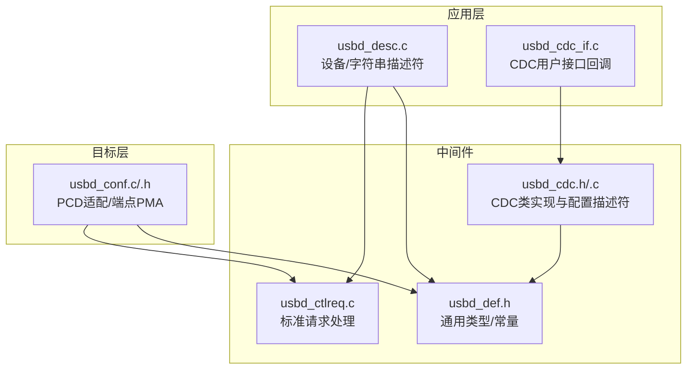
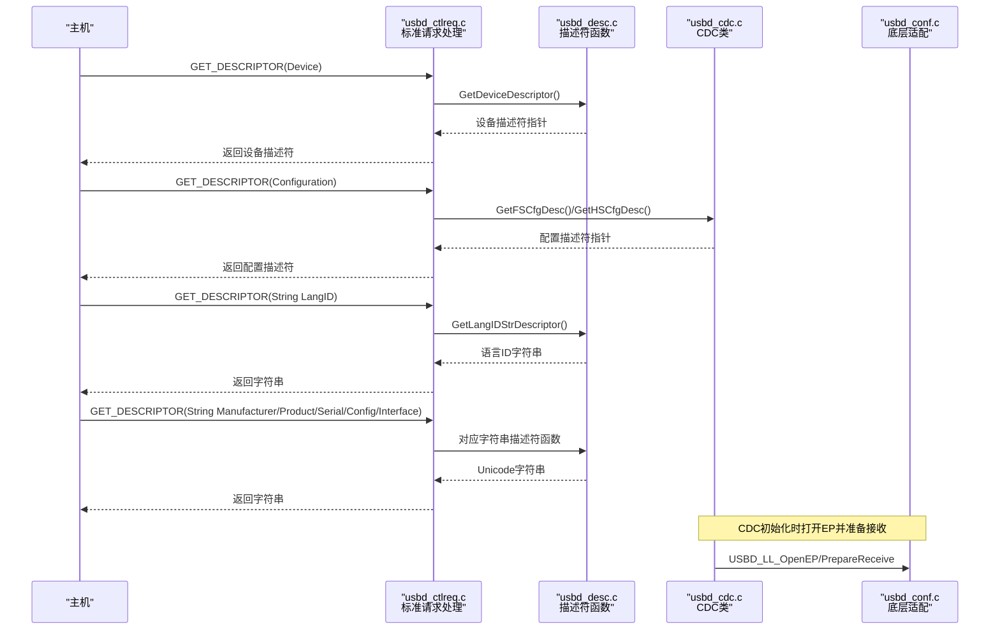
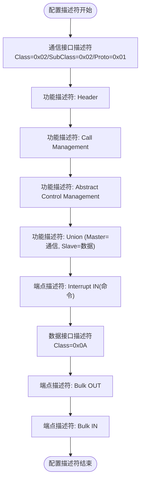
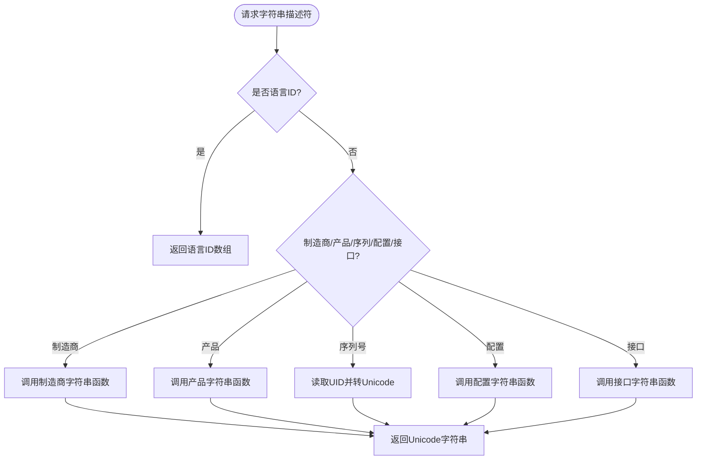
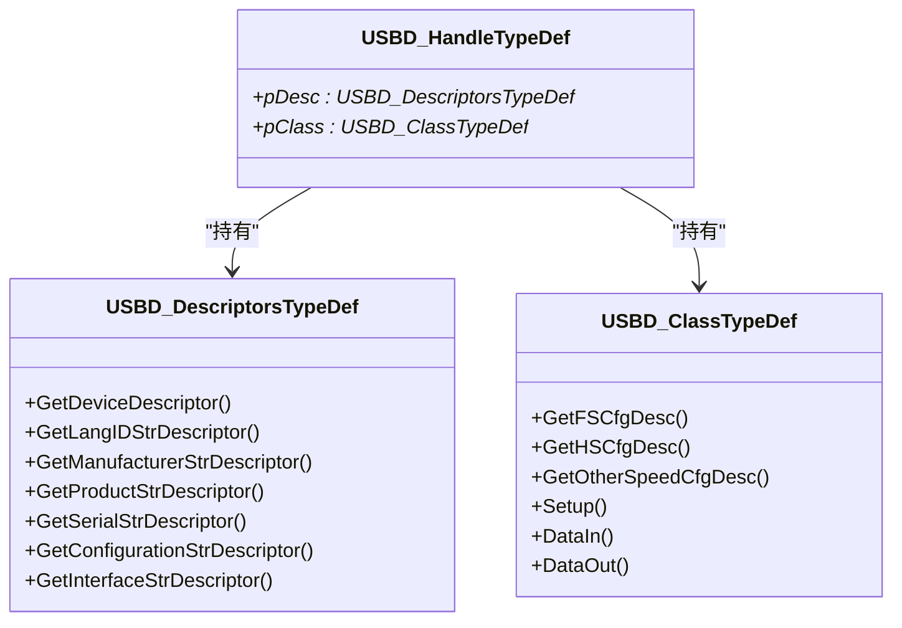

# USB设备描述符配置

<cite>
**本文引用的文件列表**
- [usbd_desc.c](file://USB_Device/App/usbd_desc.c)
- [usbd_desc.h](file://USB_Device/App/usbd_desc.h)
- [usbd_cdc_if.c](file://USB_Device/App/usbd_cdc_if.c)
- [usbd_cdc_if.h](file://USB_Device/App/usbd_cdc_if.h)
- [usbd_conf.c](file://USB_Device/Target/usbd_conf.c)
- [usbd_conf.h](file://USB_Device/Target/usbd_conf.h)
- [usbd_def.h](file://Middlewares/ST/STM32_USB_Device_Library/Core/Inc/usbd_def.h)
- [usbd_ctlreq.c](file://Middlewares/ST/STM32_USB_Device_Library/Core/Src/usbd_ctlreq.c)
- [usbd_cdc.h](file://Middlewares/ST/STM32_USB_Device_Library/Class/CDC/Inc/usbd_cdc.h)
- [usbd_cdc.c](file://Middlewares/ST/STM32_USB_Device_Library/Class/CDC/Src/usbd_cdc.c)
</cite>

## 目录
1. [简介](#简介)
2. [项目结构](#项目结构)
3. [核心组件](#核心组件)
4. [架构总览](#架构总览)
5. [详细组件分析](#详细组件分析)
6. [依赖关系分析](#依赖关系分析)
7. [性能与优化](#性能与优化)
8. [故障排查指南](#故障排查指南)
9. [结论](#结论)
10. [附录](#附录)

## 简介
本技术文档围绕STM32G4的USB CDC（虚拟串口）设备描述符配置展开，面向初学者与高级开发者。内容涵盖：
- 标准USB描述符结构与字段含义（设备、配置、接口、端点、字符串）
- CDC类设备的特殊描述符要求（通信接口+数据接口、功能描述符、Union等）
- 字符串描述符的Unicode编码与多语言支持机制
- 描述符模板与自定义方法（厂商ID、产品ID、序列号）
- 描述符验证工具与调试技巧
- 动态描述符生成思路与性能优化建议

## 项目结构
本项目采用分层组织：应用层定义描述符与CDC用户接口；中间件提供USB设备库与CDC类实现；目标层对接HAL PCD驱动并完成端点PMA分配。

图表来源
- [usbd_desc.c:132-141](file://USB_Device/App/usbd_desc.c#L132-L141)
- [usbd_cdc_if.c:138-145](file://USB_Device/App/usbd_cdc_if.c#L138-L145)
- [usbd_def.h:256-271](file://Middlewares/ST/STM32_USB_Device_Library/Core/Inc/usbd_def.h#L256-L271)
- [usbd_ctlreq.c:100-154](file://Middlewares/ST/STM32_USB_Device_Library/Core/Src/usbd_ctlreq.c#L100-L154)
- [usbd_cdc.h:44-68](file://Middlewares/ST/STM32_USB_Device_Library/Class/CDC/Inc/usbd_cdc.h#L44-L68)
- [usbd_cdc.c:159-254](file://Middlewares/ST/STM32_USB_Device_Library/Class/CDC/Src/usbd_cdc.c#L159-L254)
- [usbd_conf.c:394-451](file://USB_Device/Target/usbd_conf.c#L394-L451)

章节来源
- [usbd_desc.c:132-141](file://USB_Device/App/usbd_desc.c#L132-L141)
- [usbd_cdc_if.c:138-145](file://USB_Device/App/usbd_cdc_if.c#L138-L145)
- [usbd_def.h:256-271](file://Middlewares/ST/STM32_USB_Device_Library/Core/Inc/usbd_def.h#L256-L271)
- [usbd_ctlreq.c:100-154](file://Middlewares/ST/STM32_USB_Device_Library/Core/Src/usbd_ctlreq.c#L100-L154)
- [usbd_cdc.h:44-68](file://Middlewares/ST/STM32_USB_Device_Library/Class/CDC/Inc/usbd_cdc.h#L44-L68)
- [usbd_cdc.c:159-254](file://Middlewares/ST/STM32_USB_Device_Library/Class/CDC/Src/usbd_cdc.c#L159-L254)
- [usbd_conf.c:394-451](file://USB_Device/Target/usbd_conf.c#L394-L451)

## 核心组件
- 描述符注册表：应用层通过USBD_DescriptorsTypeDef将各类描述符函数指针注册到核心库，供枚举时按需返回。
- CDC类描述符：中间件CDC类提供FS/HS/OtherSpeed的配置描述符数组，包含通信接口、数据接口及功能描述符。
- 字符串描述符：应用层实现各字符串描述符函数，使用Unicode格式并支持多语言索引。
- 底层适配：目标层完成端点打开、PMA内存分配、中断回调桥接至USB设备库。

章节来源
- [usbd_desc.c:132-141](file://USB_Device/App/usbd_desc.c#L132-L141)
- [usbd_cdc.c:159-254](file://Middlewares/ST/STM32_USB_Device_Library/Class/CDC/Src/usbd_cdc.c#L159-L254)
- [usbd_cdc.c:258-354](file://Middlewares/ST/STM32_USB_Device_Library/Class/CDC/Src/usbd_cdc.c#L258-L354)
- [usbd_conf.c:394-451](file://USB_Device/Target/usbd_conf.c#L394-L451)

## 架构总览
下图展示从主机枚举到获取描述符的核心流程，以及CDC类在其中的角色。

图表来源
- [usbd_ctlreq.c:100-154](file://Middlewares/ST/STM32_USB_Device_Library/Core/Src/usbd_ctlreq.c#L100-L154)
- [usbd_desc.c:222-332](file://USB_Device/App/usbd_desc.c#L222-L332)
- [usbd_cdc.c:784-800](file://Middlewares/ST/STM32_USB_Device_Library/Class/CDC/Src/usbd_cdc.c#L784-L800)
- [usbd_cdc.c:467-542](file://Middlewares/ST/STM32_USB_Device_Library/Class/CDC/Src/usbd_cdc.c#L467-L542)
- [usbd_conf.c:513-541](file://USB_Device/Target/usbd_conf.c#L513-L541)

## 详细组件分析

### 设备描述符（Device Descriptor）
- 作用：向主机声明设备能力、类信息、供电方式、最大包大小、VID/PID、版本、字符串索引等。
- 关键字段：
  - bLength/bDescriptorType：长度与类型
  - bcdUSB：USB版本
  - bDeviceClass/bDeviceSubClass/bDeviceProtocol：设备级类/子类/协议（CDC示例中为通信类）
  - bMaxPacketSize0：控制端点最大包长
  - idVendor/idProduct：厂商与产品标识
  - iManufacturer/iProduct/iSerialNumber：字符串索引
  - bNumConfigurations：配置数量
- 在本项目中，设备描述符由应用层静态数组定义并通过函数返回。

章节来源
- [usbd_desc.c:147-167](file://USB_Device/App/usbd_desc.c#L147-L167)
- [usbd_def.h:114-121](file://Middlewares/ST/STM32_USB_Device_Library/Core/Inc/usbd_def.h#L114-L121)

### 配置描述符（Configuration Descriptor）与接口/端点描述符
- 作用：描述一个完整配置下的所有接口、端点及其属性。
- CDC类典型结构：
  - 通信接口（Communication Interface Class）：bInterfaceClass=0x02，bInterfaceSubClass=0x02（ACM），bInterfaceProtocol=0x01（AT命令）。
  - 数据接口（Data Interface Class）：bInterfaceClass=0x0A（CDC Data）。
  - 功能描述符（CS_INTERFACE）：Header、Call Management、Abstract Control Management、Union等。
  - 端点：
    - 命令端点（Interrupt IN）：用于发送通知/状态。
    - 数据端点（Bulk IN/OUT）：用于数据传输。
- 本项目中，CDC类在中间件内提供FS/HS/OtherSpeed三套配置描述符数组，分别适配不同速度。

章节来源
- [usbd_cdc.c:159-254](file://Middlewares/ST/STM32_USB_Device_Library/Class/CDC/Src/usbd_cdc.c#L159-L254)
- [usbd_cdc.c:258-354](file://Middlewares/ST/STM32_USB_Device_Library/Class/CDC/Src/usbd_cdc.c#L258-L354)
- [usbd_cdc.c:356-450](file://Middlewares/ST/STM32_USB_Device_Library/Class/CDC/Src/usbd_cdc.c#L356-L450)
- [usbd_cdc.h:44-68](file://Middlewares/ST/STM32_USB_Device_Library/Class/CDC/Inc/usbd_cdc.h#L44-L68)

#### CDC配置描述符结构图

图表来源
- [usbd_cdc.c:159-254](file://Middlewares/ST/STM32_USB_Device_Library/Class/CDC/Src/usbd_cdc.c#L159-L254)
- [usbd_cdc.c:258-354](file://Middlewares/ST/STM32_USB_Device_Library/Class/CDC/Src/usbd_cdc.c#L258-L354)

### 字符串描述符（String Descriptors）
- 作用：以Unicode格式提供人类可读信息（语言ID、制造商、产品、序列号、配置、接口等）。
- 关键点：
  - 首字节为长度，第二字节为类型（字符串），后续为UTF-16LE编码字符对。
  - 语言ID描述符仅包含支持的语种列表（例如英语）。
  - 序列号通常由芯片唯一ID生成，避免重复。
- 本项目中：
  - 语言ID、制造商、产品、配置、接口字符串由应用层函数返回。
  - 序列号通过读取设备唯一ID并转换为十六进制字符串填充。

章节来源
- [usbd_desc.c:185-205](file://USB_Device/App/usbd_desc.c#L185-L205)
- [usbd_desc.c:248-332](file://USB_Device/App/usbd_desc.c#L248-L332)
- [usbd_desc.c:339-384](file://USB_Device/App/usbd_desc.c#L339-L384)
- [usbd_def.h:85-90](file://Middlewares/ST/STM32_USB_Device_Library/Core/Inc/usbd_def.h#L85-L90)

#### 字符串描述符生成流程

图表来源
- [usbd_desc.c:248-332](file://USB_Device/App/usbd_desc.c#L248-L332)
- [usbd_desc.c:339-384](file://USB_Device/App/usbd_desc.c#L339-L384)

### 端点与PMA配置
- CDC需要三个端点：
  - EP1 Bulk IN/OUT（数据）
  - EP2 Interrupt IN（命令）
- 目标层负责：
  - 打开端点并设置最大包长
  - 配置PMA缓冲区地址
  - 准备接收数据
- 这些操作在CDC初始化阶段完成。

章节来源
- [usbd_cdc.c:467-542](file://Middlewares/ST/STM32_USB_Device_Library/Class/CDC/Src/usbd_cdc.c#L467-L542)
- [usbd_conf.c:442-450](file://USB_Device/Target/usbd_conf.c#L442-L450)
- [usbd_conf.c:513-541](file://USB_Device/Target/usbd_conf.c#L513-L541)

### 用户接口与数据收发
- 应用层通过USBD_CDC_ItfTypeDef暴露Init/Control/Receive/TransmitCplt回调。
- 典型用法：
  - 初始化时设置Rx/Tx缓冲
  - 接收回调中重新准备接收
  - 发送API检查忙状态后提交数据包

章节来源
- [usbd_cdc_if.c:138-145](file://USB_Device/App/usbd_cdc_if.c#L138-L145)
- [usbd_cdc_if.c:152-160](file://USB_Device/App/usbd_cdc_if.c#L152-L160)
- [usbd_cdc_if.c:261-268](file://USB_Device/App/usbd_cdc_if.c#L261-L268)
- [usbd_cdc_if.c:281-293](file://USB_Device/App/usbd_cdc_if.c#L281-L293)

## 依赖关系分析
- 应用层描述符模块依赖核心库的类型与常量定义，并在枚举时由核心库调用。
- CDC类模块提供配置描述符与端点管理逻辑，依赖核心库的标准请求处理。
- 目标层封装HAL PCD，向上提供LL接口，向下管理硬件资源。

图表来源
- [usbd_def.h:256-271](file://Middlewares/ST/STM32_USB_Device_Library/Core/Inc/usbd_def.h#L256-L271)
- [usbd_def.h:213-236](file://Middlewares/ST/STM32_USB_Device_Library/Core/Inc/usbd_def.h#L213-L236)
- [usbd_def.h:285-312](file://Middlewares/ST/STM32_USB_Device_Library/Core/Inc/usbd_def.h#L285-L312)

章节来源
- [usbd_def.h:256-271](file://Middlewares/ST/STM32_USB_Device_Library/Core/Inc/usbd_def.h#L256-L271)
- [usbd_def.h:213-236](file://Middlewares/ST/STM32_USB_Device_Library/Core/Inc/usbd_def.h#L213-L236)
- [usbd_def.h:285-312](file://Middlewares/ST/STM32_USB_Device_Library/Core/Inc/usbd_def.h#L285-L312)

## 性能与优化
- 端点包长与间隔：
  - FS Bulk端点最大包长为64字节；HS为512字节。
  - 命令端点为Interrupt类型，bInterval影响响应延迟。
- ZLP（零长度包）：当传输长度为端点最大包的整数倍时需发送ZLP以确保主机正确识别边界。
- PMA对齐与分配：确保端点缓冲区按4字节对齐，避免DMA访问异常。
- 动态描述符：
  - 可在运行时根据设备能力或配置切换不同的配置描述符指针，减少ROM占用。
  - 字符串描述符可按需生成，避免存储大量文本。

章节来源
- [usbd_cdc.h:57-68](file://Middlewares/ST/STM32_USB_Device_Library/Class/CDC/Inc/usbd_cdc.h#L57-L68)
- [usbd_cdc.c:702-722](file://Middlewares/ST/STM32_USB_Device_Library/Class/CDC/Src/usbd_cdc.c#L702-L722)
- [usbd_conf.c:442-450](file://USB_Device/Target/usbd_conf.c#L442-L450)

## 故障排查指南
- 枚举失败或无法识别：
  - 检查设备描述符中的类/子类/协议是否与CDC一致。
  - 确认配置描述符中通信接口与数据接口顺序、Union关联是否正确。
  - 核对端点类型与地址是否与描述符匹配。
- 字符串显示乱码：
  - 确认字符串描述符为UTF-16LE格式，首两字节为长度与类型。
  - 检查语言ID描述符是否被主机正确请求。
- 数据收发异常：
  - 检查端点PMA分配是否冲突或未对齐。
  - 确认接收回调中已重新准备接收，避免NAK堆积。
  - 注意ZLP发送条件。

章节来源
- [usbd_cdc.c:159-254](file://Middlewares/ST/STM32_USB_Device_Library/Class/CDC/Src/usbd_cdc.c#L159-L254)
- [usbd_cdc.c:258-354](file://Middlewares/ST/STM32_USB_Device_Library/Class/CDC/Src/usbd_cdc.c#L258-L354)
- [usbd_desc.c:339-384](file://USB_Device/App/usbd_desc.c#L339-L384)
- [usbd_conf.c:442-450](file://USB_Device/Target/usbd_conf.c#L442-L450)
- [usbd_cdc.c:702-722](file://Middlewares/ST/STM32_USB_Device_Library/Class/CDC/Src/usbd_cdc.c#L702-L722)

## 结论
本项目基于STM32 USB设备库实现了CDC虚拟串口功能。通过清晰的分层设计与标准化的描述符结构，设备能够被操作系统正确识别与配置。遵循CDC规范的功能描述符与接口组合，结合正确的端点与PMA配置，可保证稳定可靠的串口通信体验。对于高级需求，可通过动态描述符生成与参数调优进一步提升灵活性与性能。

## 附录

### 描述符模板与自定义方法
- 修改厂商ID与产品ID：
  - 在应用层描述符文件中调整相关宏或数组字段。
- 修改序列号：
  - 在序列号生成函数中替换数据来源或格式化策略。
- 添加多语言字符串：
  - 扩展语言ID描述符，增加更多语言条目，并在字符串描述符函数中根据索引返回对应语言文本。

章节来源
- [usbd_desc.c:65-72](file://USB_Device/App/usbd_desc.c#L65-L72)
- [usbd_desc.c:339-384](file://USB_Device/App/usbd_desc.c#L339-L384)

### 描述符验证工具与调试技巧
- 使用USB抓包工具（如Wireshark USB过滤器）抓取枚举过程，逐项核对描述符内容与长度。
- 借助系统设备管理器或第三方USB查看器检查设备属性与配置树。
- 在应用层加入日志输出，打印关键描述符长度与端点状态，辅助定位问题。

[本节为通用指导，不直接分析具体文件]