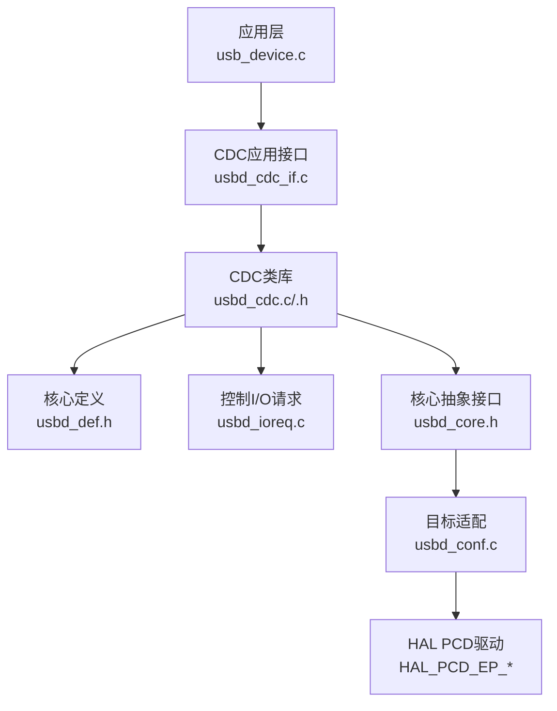
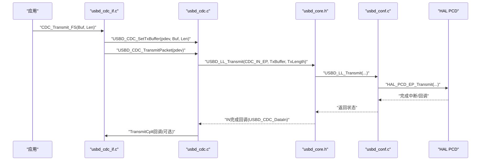
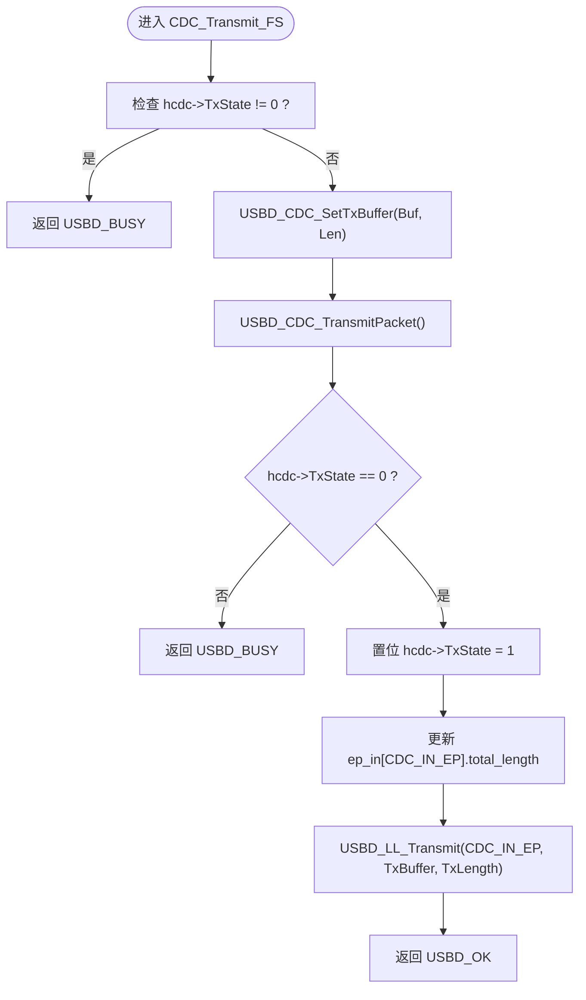
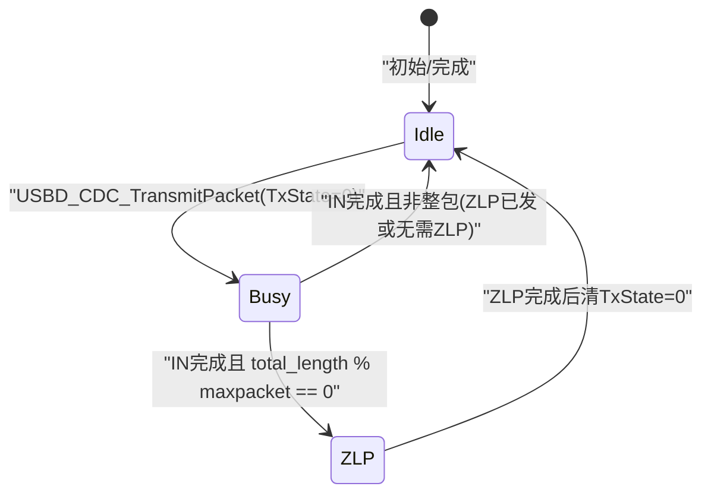
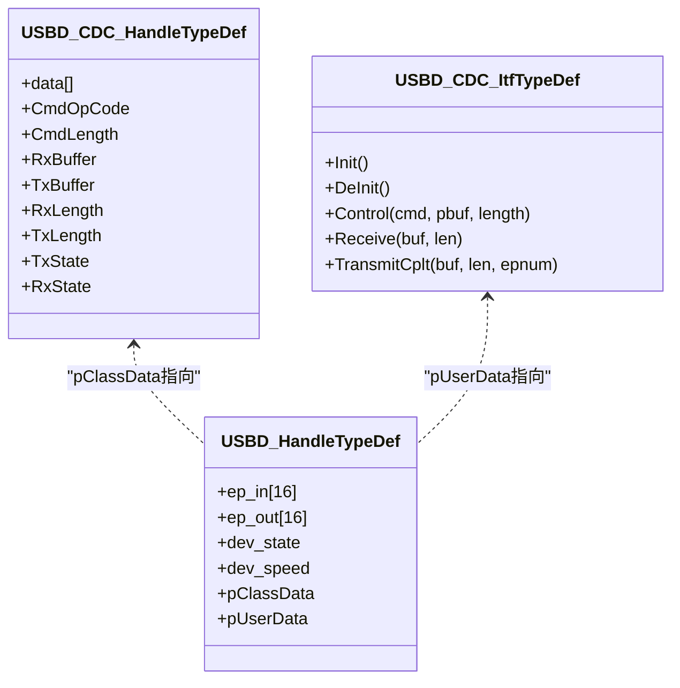
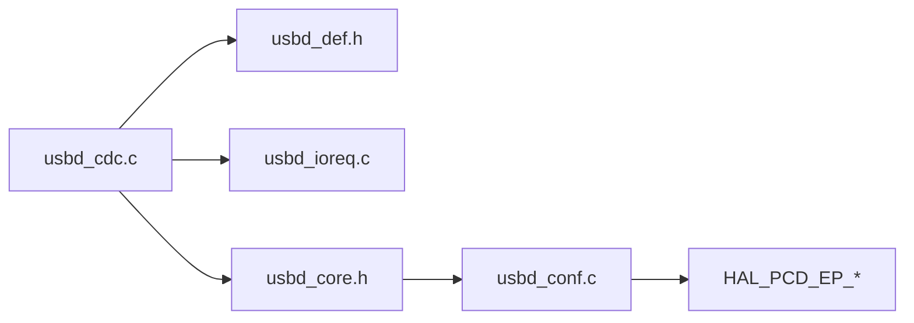
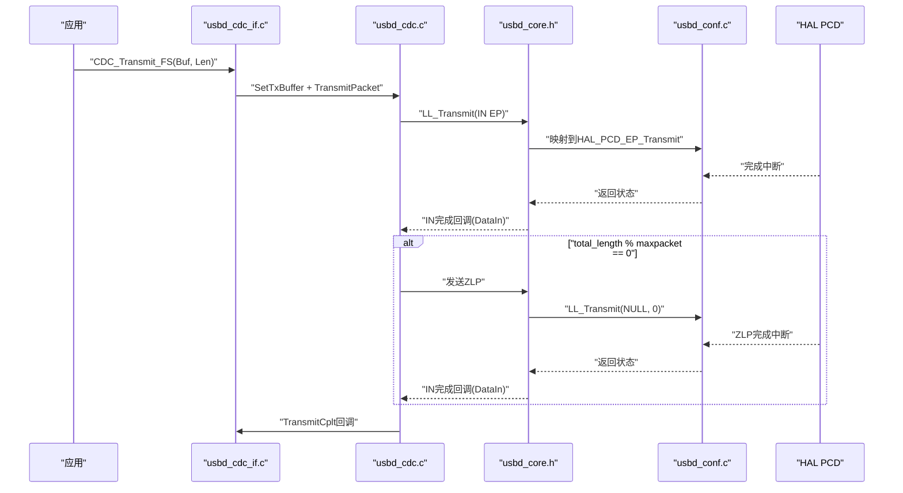
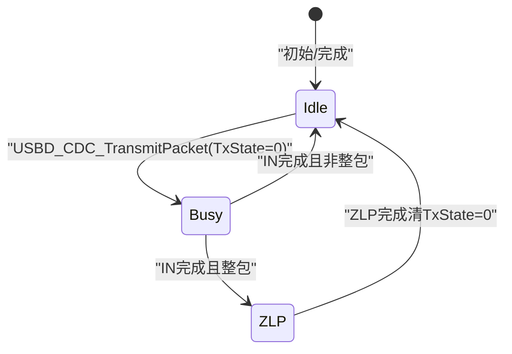

# USB传输流程

<cite>
**本文引用的文件**   
- [usbd_cdc.c](file://Middlewares/ST/STM32_USB_Device_Library/Class/CDC/Src/usbd_cdc.c)
- [usbd_cdc.h](file://Middlewares/ST/STM32_USB_Device_Library/Class/CDC/Inc/usbd_cdc.h)
- [usbd_def.h](file://Middlewares/ST/STM32_USB_Device_Library/Core/Inc/usbd_def.h)
- [usbd_ioreq.c](file://Middlewares/ST/STM32_USB_Device_Library/Core/Src/usbd_ioreq.c)
- [usbd_core.h](file://Middlewares/ST/STM32_USB_Device_Library/Core/Inc/usbd_core.h)
- [usb_device.c](file://USB_Device/App/usb_device.c)
- [usbd_cdc_if.c](file://USB_Device/App/usbd_cdc_if.c)
- [usbd_cdc_if.h](file://USB_Device/App/usbd_cdc_if.h)
- [usbd_conf.c](file://USB_Device/Target/usbd_conf.c)
</cite>

## 目录
1. [简介](#简介)
2. [项目结构](#项目结构)
3. [核心组件](#核心组件)
4. [架构总览](#架构总览)
5. [详细组件分析](#详细组件分析)
6. [依赖关系分析](#依赖关系分析)
7. [性能与实时性](#性能与实时性)
8. [故障排查指南](#故障排查指南)
9. [结论](#结论)
10. [附录：时序与状态图](#附录：时序与状态图)

## 简介
本技术文档围绕STM32 USB设备库中的CDC类实现，聚焦于USB数据传输流程，尤其是发送路径的完整调用链：从应用层接口CDC_Transmit_FS到USBD_CDC_SetTxBuffer、USBD_CDC_TransmitPacket，再到底层USBD_LL_Transmit。文档深入解析发送状态机（hcdc->TxState）与USBD_BUSY处理逻辑，说明IN/OUT端点配置与数据包传输过程，并提供完整的时序图与状态转换图。同时涵盖错误处理与超时策略建议，为初学者提供USB基础概念，为高级开发者提供高吞吐与实时性优化指导。

## 项目结构
本项目采用分层组织：
- 应用层：USB设备初始化与CDC接口回调注册
- CDC类层：实现CDC协议的数据收发、控制请求处理、端点管理
- 核心层：定义通用类型、控制I/O请求、底层抽象接口
- 目标适配层：将上层API映射到HAL PCD驱动

图表来源
- [usb_device.c:66-88](file://USB_Device/App/usb_device.c#L66-L88)
- [usbd_cdc_if.c:138-145](file://USB_Device/App/usbd_cdc_if.c#L138-L145)
- [usbd_cdc.c:140-156](file://Middlewares/ST/STM32_USB_Device_Library/Class/CDC/Src/usbd_cdc.c#L140-L156)
- [usbd_def.h:274-312](file://Middlewares/ST/STM32_USB_Device_Library/Core/Inc/usbd_def.h#L274-L312)
- [usbd_ioreq.c:87-104](file://Middlewares/ST/STM32_USB_Device_Library/Core/Src/usbd_ioreq.c#L87-L104)
- [usbd_core.h:126-135](file://Middlewares/ST/STM32_USB_Device_Library/Core/Inc/usbd_core.h#L126-L135)
- [usbd_conf.c:643-673](file://USB_Device/Target/usbd_conf.c#L643-L673)

章节来源
- [usb_device.c:66-88](file://USB_Device/App/usb_device.c#L66-L88)
- [usbd_cdc_if.c:138-145](file://USB_Device/App/usbd_cdc_if.c#L138-L145)
- [usbd_cdc.c:140-156](file://Middlewares/ST/STM32_USB_Device_Library/Class/CDC/Src/usbd_cdc.c#L140-L156)
- [usbd_def.h:274-312](file://Middlewares/ST/STM32_USB_Device_Library/Core/Inc/usbd_def.h#L274-L312)
- [usbd_ioreq.c:87-104](file://Middlewares/ST/STM32_USB_Device_Library/Core/Src/usbd_ioreq.c#L87-L104)
- [usbd_core.h:126-135](file://Middlewares/ST/STM32_USB_Device_Library/Core/Inc/usbd_core.h#L126-L135)
- [usbd_conf.c:643-673](file://USB_Device/Target/usbd_conf.c#L643-L673)

## 核心组件
- CDC类库（usbd_cdc.c/.h）：实现CDC枚举、端点初始化、数据IN/OUT回调、控制请求分发、发送/接收包函数。
- 应用接口（usbd_cdc_if.c/.h）：封装用户缓冲区、提供CDC_Transmit_FS等对外API，并注册回调表。
- 核心定义（usbd_def.h）：定义USBD_HandleTypeDef、端点描述符、状态枚举等。
- 控制I/O请求（usbd_ioreq.c）：提供EP0控制传输辅助函数。
- 目标适配（usbd_conf.c）：将USBD_LL_Transmit/PrepareReceive映射到HAL_PCD_EP_Transmit/Receive。

章节来源
- [usbd_cdc.c:467-542](file://Middlewares/ST/STM32_USB_Device_Library/Class/CDC/Src/usbd_cdc.c#L467-L542)
- [usbd_cdc.h:94-124](file://Middlewares/ST/STM32_USB_Device_Library/Class/CDC/Inc/usbd_cdc.h#L94-L124)
- [usbd_cdc_if.c:281-293](file://USB_Device/App/usbd_cdc_if.c#L281-L293)
- [usbd_def.h:274-312](file://Middlewares/ST/STM32_USB_Device_Library/Core/Inc/usbd_def.h#L274-L312)
- [usbd_ioreq.c:87-104](file://Middlewares/ST/STM32_USB_Device_Library/Core/Src/usbd_ioreq.c#L87-L104)
- [usbd_conf.c:643-673](file://USB_Device/Target/usbd_conf.c#L643-L673)

## 架构总览
CDC发送路径整体流程如下：
- 应用调用CDC_Transmit_FS设置发送缓冲并触发发送
- CDC类库检查发送状态机，更新端点长度并调用底层传输
- 底层适配层通过HAL PCD驱动完成实际硬件传输
- IN端点完成时触发回调，清理状态并通知上层

图表来源
- [usbd_cdc_if.c:281-293](file://USB_Device/App/usbd_cdc_if.c#L281-L293)
- [usbd_cdc.c:857-871](file://Middlewares/ST/STM32_USB_Device_Library/Class/CDC/Src/usbd_cdc.c#L857-L871)
- [usbd_cdc.c:899-924](file://Middlewares/ST/STM32_USB_Device_Library/Class/CDC/Src/usbd_cdc.c#L899-L924)
- [usbd_core.h:126-135](file://Middlewares/ST/STM32_USB_Device_Library/Core/Inc/usbd_core.h#L126-L135)
- [usbd_conf.c:643-673](file://USB_Device/Target/usbd_conf.c#L643-L673)
- [usbd_cdc.c:690-722](file://Middlewares/ST/STM32_USB_Device_Library/Class/CDC/Src/usbd_cdc.c#L690-L722)

## 详细组件分析

### CDC发送路径：CDC_Transmit_FS → USBD_CDC_SetTxBuffer → USBD_CDC_TransmitPacket
- CDC_Transmit_FS负责：
  - 获取CDC句柄并检查发送状态（hcdc->TxState），若忙则返回USBD_BUSY
  - 调用USBD_CDC_SetTxBuffer设置发送缓冲指针和长度
  - 调用USBD_CDC_TransmitPacket启动发送
- USBD_CDC_SetTxBuffer：
  - 校验pClassData有效性
  - 设置hcdc->TxBuffer与hcdc->TxLength
- USBD_CDC_TransmitPacket：
  - 校验pClassData有效性
  - 若hcdc->TxState为0，置位为1表示“发送进行中”
  - 更新对应IN端点的total_length
  - 调用USBD_LL_Transmit发起传输
  - 返回USBD_OK；否则返回USBD_BUSY

图表来源
- [usbd_cdc_if.c:281-293](file://USB_Device/App/usbd_cdc_if.c#L281-L293)
- [usbd_cdc.c:857-871](file://Middlewares/ST/STM32_USB_Device_Library/Class/CDC/Src/usbd_cdc.c#L857-L871)
- [usbd_cdc.c:899-924](file://Middlewares/ST/STM32_USB_Device_Library/Class/CDC/Src/usbd_cdc.c#L899-L924)

章节来源
- [usbd_cdc_if.c:281-293](file://USB_Device/App/usbd_cdc_if.c#L281-L293)
- [usbd_cdc.c:857-871](file://Middlewares/ST/STM32_USB_Device_Library/Class/CDC/Src/usbd_cdc.c#L857-L871)
- [usbd_cdc.c:899-924](file://Middlewares/ST/STM32_USB_Device_Library/Class/CDC/Src/usbd_cdc.c#L899-L924)

### 发送状态机与USBD_BUSY处理
- 状态标志：
  - hcdc->TxState：0表示空闲，1表示正在发送
- 状态转换：
  - 进入USBD_CDC_TransmitPacket且TxState==0时，置TxState=1并发起传输
  - IN端点完成回调USBD_CDC_DataIn中：
    - 若本次传输长度为端点最大包长的整数倍，则发送ZLP（零长度包）以结束传输
    - 否则清TxState=0，并调用TransmitCplt回调通知上层
- USBD_BUSY语义：
  - 当TxState!=0时，CDC_Transmit_FS直接返回USBD_BUSY，避免重复提交导致竞争

图表来源
- [usbd_cdc.c:899-924](file://Middlewares/ST/STM32_USB_Device_Library/Class/CDC/Src/usbd_cdc.c#L899-L924)
- [usbd_cdc.c:690-722](file://Middlewares/ST/STM32_USB_Device_Library/Class/CDC/Src/usbd_cdc.c#L690-L722)

章节来源
- [usbd_cdc.c:690-722](file://Middlewares/ST/STM32_USB_Device_Library/Class/CDC/Src/usbd_cdc.c#L690-L722)
- [usbd_cdc.c:899-924](file://Middlewares/ST/STM32_USB_Device_Library/Class/CDC/Src/usbd_cdc.c#L899-L924)

### 端点配置与数据包传输（IN/OUT区别）
- 端点地址与类型：
  - CDC_IN_EP：数据IN端点（Bulk）
  - CDC_OUT_EP：数据OUT端点（Bulk）
  - CDC_CMD_EP：命令端点（Interrupt）
- 初始化阶段（USBD_CDC_Init）：
  - 根据速度（FS/HS）打开IN/OUT端点并设置最大包长
  - 打开CMD端点并设置bInterval
  - 初始化hcdc->TxState/RxState为0
  - 预准备OUT端点接收下一个数据包
- 数据包传输：
  - IN方向：应用设置缓冲后，由USBD_LL_Transmit将数据推送到主机
  - OUT方向：主机发送数据，设备在USBD_CDC_DataOut中读取长度并回调用户处理，随后再次准备接收

图表来源
- [usbd_cdc.h:102-124](file://Middlewares/ST/STM32_USB_Device_Library/Class/CDC/Inc/usbd_cdc.h#L102-L124)
- [usbd_def.h:274-312](file://Middlewares/ST/STM32_USB_Device_Library/Core/Inc/usbd_def.h#L274-L312)
- [usbd_cdc.c:467-542](file://Middlewares/ST/STM32_USB_Device_Library/Class/CDC/Src/usbd_cdc.c#L467-L542)

章节来源
- [usbd_cdc.c:467-542](file://Middlewares/ST/STM32_USB_Device_Library/Class/CDC/Src/usbd_cdc.c#L467-L542)
- [usbd_cdc.h:44-66](file://Middlewares/ST/STM32_USB_Device_Library/Class/CDC/Inc/usbd_cdc.h#L44-L66)
- [usbd_def.h:274-312](file://Middlewares/ST/STM32_USB_Device_Library/Core/Inc/usbd_def.h#L274-L312)

### 控制请求与EP0交互（背景知识）
- CDC类在处理标准与类特定请求时，使用控制I/O请求函数进行EP0数据阶段：
  - USBD_CtlSendData/ContinueSendData用于IN数据阶段
  - USBD_CtlPrepareRx/ContinueRx用于OUT数据阶段
  - 这些函数最终也通过USBD_LL_Transmit/PrepareReceive驱动底层

章节来源
- [usbd_ioreq.c:87-104](file://Middlewares/ST/STM32_USB_Device_Library/Core/Src/usbd_ioreq.c#L87-L104)
- [usbd_ioreq.c:131-148](file://Middlewares/ST/STM32_USB_Device_Library/Core/Src/usbd_ioreq.c#L131-L148)
- [usbd_cdc.c:586-681](file://Middlewares/ST/STM32_USB_Device_Library/Class/CDC/Src/usbd_cdc.c#L586-L681)

## 依赖关系分析
- CDC类库依赖核心定义与IO请求模块，并通过核心抽象接口访问底层传输能力
- 目标适配层将抽象接口映射到HAL PCD驱动，屏蔽具体MCU差异
- 应用层通过注册回调表与CDC类库解耦，便于扩展与移植

图表来源
- [usbd_cdc.c:140-156](file://Middlewares/ST/STM32_USB_Device_Library/Class/CDC/Src/usbd_cdc.c#L140-L156)
- [usbd_def.h:274-312](file://Middlewares/ST/STM32_USB_Device_Library/Core/Inc/usbd_def.h#L274-L312)
- [usbd_ioreq.c:87-104](file://Middlewares/ST/STM32_USB_Device_Library/Core/Src/usbd_ioreq.c#L87-L104)
- [usbd_core.h:126-135](file://Middlewares/ST/STM32_USB_Device_Library/Core/Inc/usbd_core.h#L126-L135)
- [usbd_conf.c:643-673](file://USB_Device/Target/usbd_conf.c#L643-L673)

章节来源
- [usbd_cdc.c:140-156](file://Middlewares/ST/STM32_USB_Device_Library/Class/CDC/Src/usbd_cdc.c#L140-L156)
- [usbd_def.h:274-312](file://Middlewares/ST/STM32_USB_Device_Library/Core/Inc/usbd_def.h#L274-L312)
- [usbd_ioreq.c:87-104](file://Middlewares/ST/STM32_USB_Device_Library/Core/Src/usbd_ioreq.c#L87-L104)
- [usbd_core.h:126-135](file://Middlewares/ST/STM32_USB_Device_Library/Core/Inc/usbd_core.h#L126-L135)
- [usbd_conf.c:643-673](file://USB_Device/Target/usbd_conf.c#L643-L673)

## 性能与实时性
- 吞吐量优化
  - 合理设置端点最大包长：FS为64字节，HS为512字节，确保与应用层缓冲大小匹配
  - 避免频繁小包发送，尽量聚合数据以减少事务开销
  - 在高负载场景下，利用DMA（若HAL支持）降低CPU占用
- 实时性保证
  - 在IN完成回调中仅做必要操作，避免阻塞；复杂处理移至后台任务
  - 使用双缓冲或环形队列，减少拷贝与锁竞争
  - 对USBD_BUSY的处理：应用层应实现重试或排队机制，避免丢包
- 超时策略建议
  - 当前CDC类库未内置发送超时；建议在应用层维护定时器，若在限定时间内未收到TransmitCplt回调，则判定失败并恢复（如重置端点或重传）
  - 结合系统心跳或RTOS信号量等待回调完成，设置超时退出

[本节为通用指导，不直接分析具体文件]

## 故障排查指南
- 常见问题
  - 返回USBD_BUSY：检查是否在上次发送未完成前再次提交；确认TxState状态机是否正确复位
  - 无TransmitCplt回调：确认IN端点完成回调USBD_CDC_DataIn是否被正确调用；检查端点配置与中断使能
  - 数据不完整：检查ZLP处理逻辑，特别是当数据长度为端点最大包长整数倍时需发送ZLP
- 定位方法
  - 在CDC_Transmit_FS、USBD_CDC_TransmitPacket、USBD_CDC_DataIn处添加日志
  - 观察ep_in[CDC_IN_EP].total_length变化与maxpacket关系
  - 检查usbd_conf.c中USBD_LL_Transmit/PrepareReceive返回值及HAL状态

章节来源
- [usbd_cdc_if.c:281-293](file://USB_Device/App/usbd_cdc_if.c#L281-L293)
- [usbd_cdc.c:690-722](file://Middlewares/ST/STM32_USB_Device_Library/Class/CDC/Src/usbd_cdc.c#L690-L722)
- [usbd_conf.c:643-673](file://USB_Device/Target/usbd_conf.c#L643-L673)

## 结论
CDC发送路径通过清晰的状态机与分层抽象实现了可靠的USB数据传输。理解hcdc->TxState与USBD_BUSY语义、IN/OUT端点职责以及ZLP处理规则，是构建高性能与实时性USB应用的关键。结合应用层的超时与重试策略，可进一步提升系统的鲁棒性与吞吐能力。

[本节为总结，不直接分析具体文件]

## 附录：时序与状态图

### 发送时序图（含ZLP）

图表来源
- [usbd_cdc_if.c:281-293](file://USB_Device/App/usbd_cdc_if.c#L281-L293)
- [usbd_cdc.c:899-924](file://Middlewares/ST/STM32_USB_Device_Library/Class/CDC/Src/usbd_cdc.c#L899-L924)
- [usbd_cdc.c:690-722](file://Middlewares/ST/STM32_USB_Device_Library/Class/CDC/Src/usbd_cdc.c#L690-L722)
- [usbd_core.h:126-135](file://Middlewares/ST/STM32_USB_Device_Library/Core/Inc/usbd_core.h#L126-L135)
- [usbd_conf.c:643-673](file://USB_Device/Target/usbd_conf.c#L643-L673)

### 发送状态转换图

图表来源
- [usbd_cdc.c:899-924](file://Middlewares/ST/STM32_USB_Device_Library/Class/CDC/Src/usbd_cdc.c#L899-L924)
- [usbd_cdc.c:690-722](file://Middlewares/ST/STM32_USB_Device_Library/Class/CDC/Src/usbd_cdc.c#L690-L722)