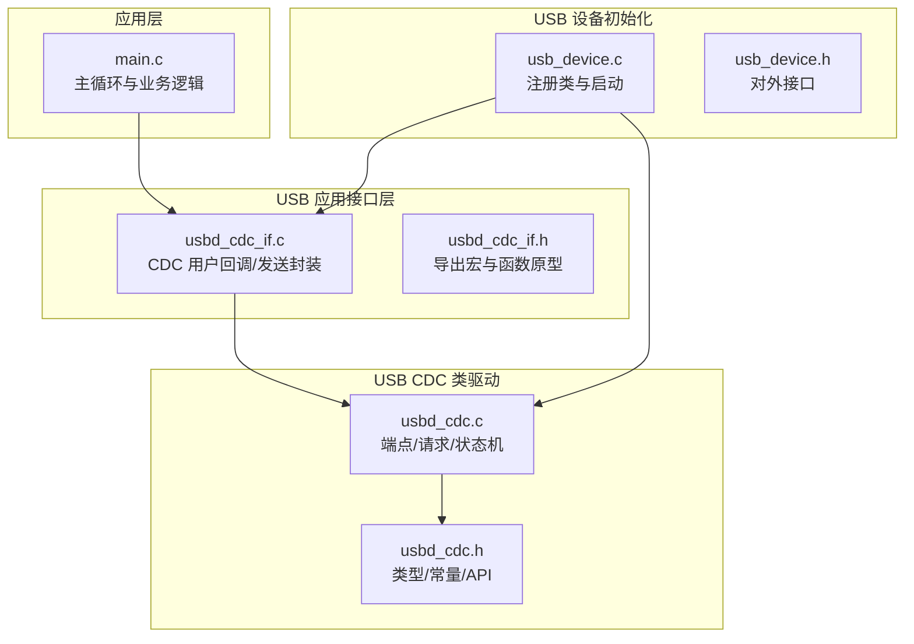
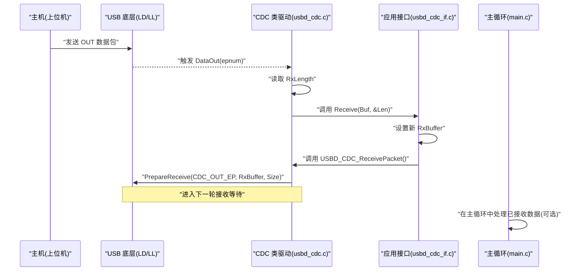
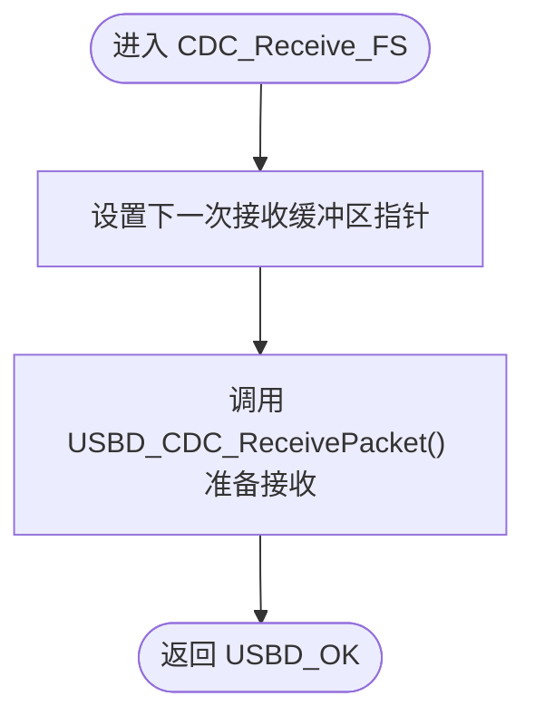
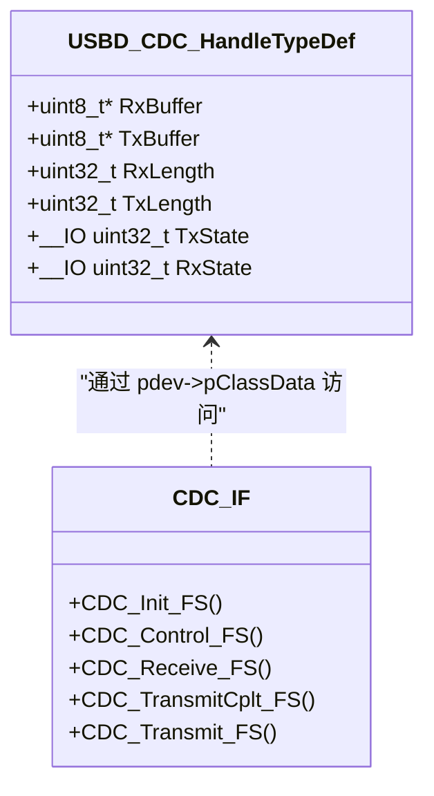
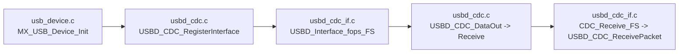

# 接收数据处理

<cite>
**本文引用的文件**   
- [main.c](file://Core/Src/main.c)
- [usbd_cdc_if.c](file://USB_Device/App/usbd_cdc_if.c)
- [usbd_cdc_if.h](file://USB_Device/App/usbd_cdc_if.h)
- [usbd_cdc.c](file://Middlewares/ST/STM32_USB_Device_Library/Class/CDC/Src/usbd_cdc.c)
- [usbd_cdc.h](file://Middlewares/ST/STM32_USB_Device_Library/Class/CDC/Inc/usbd_cdc.h)
- [usb_device.c](file://USB_Device/App/usb_device.c)
- [usb_device.h](file://USB_Device/App/usb_device.h)
</cite>

## 目录
1. [简介](#简介)
2. [项目结构](#项目结构)
3. [核心组件](#核心组件)
4. [架构总览](#架构总览)
5. [详细组件分析](#详细组件分析)
6. [依赖关系分析](#依赖关系分析)
7. [性能与并发特性](#性能与并发特性)
8. [故障排查指南](#故障排查指南)
9. [结论](#结论)
10. [附录：数据解析与处理算法](#附录数据解析与处理算法)

## 简介
本技术文档聚焦于基于 STM32G4 的 USB CDC（虚拟串口）设备的数据接收处理机制，重点解释以下方面：
- CDC_Receive_FS 回调函数的触发条件与执行流程
- 数据接收的异步处理机制，包括 USBD_CDC_ReceivePacket 的重入调用与循环接收模式
- 将接收到的数据重定向到串口或文件系统的实现方法
- 接收缓冲区的数据解析与处理算法
- 数据完整性校验与错误恢复机制
- 与主程序的数据同步与中断安全考虑
- 为初学者提供 USB 接收概念介绍，为高级开发者提供高并发接收与实时数据处理指导

## 项目结构
本项目采用分层组织方式：
- Core：应用主循环、外设初始化与中断回调
- USB_Device/App：USB 设备层与应用接口层（CDC 用户回调、发送封装）
- Middlewares/ST/.../CDC：USB CDC 类驱动（端点管理、数据包收发、状态机）
- Drivers/CMSIS 与 HAL：芯片抽象与底层驱动

图表来源
- [main.c:219-290](file://Core/Src/main.c#L219-L290)
- [usbd_cdc_if.c:138-145](file://USB_Device/App/usbd_cdc_if.c#L138-L145)
- [usbd_cdc.c:140-156](file://Middlewares/ST/STM32_USB_Device_Library/Class/CDC/Src/usbd_cdc.c#L140-L156)
- [usb_device.c:66-88](file://USB_Device/App/usb_device.c#L66-L88)

章节来源
- [main.c:219-290](file://Core/Src/main.c#L219-L290)
- [usb_device.c:66-88](file://USB_Device/App/usb_device.c#L66-L88)

## 核心组件
- CDC 用户回调层（usbd_cdc_if.c）
  - 定义并注册 USBD_Interface_fops_FS，包含 Init/Control/Receive/TransmitCplt 等回调入口
  - 暴露 CDC_Transmit_FS 供上层统一发送
  - 维护 UserRxBufferFS/UserTxBufferFS 作为收发缓冲
- CDC 类驱动（usbd_cdc.c）
  - 管理 IN/OUT 端点、控制端点、配置描述符
  - 在 DataOut 中获取长度并调用用户 Receive 回调
  - 提供 USBD_CDC_SetRxBuffer/USBD_CDC_ReceivePacket/USBD_CDC_TransmitPacket 等 API
- 应用主循环（main.c）
  - 初始化 ADC/DMA/USB，并在主循环中处理“数据就绪”标志后通过 CDC_Transmit_FS 发送

章节来源
- [usbd_cdc_if.c:138-145](file://USB_Device/App/usbd_cdc_if.c#L138-L145)
- [usbd_cdc_if.c:261-268](file://USB_Device/App/usbd_cdc_if.c#L261-L268)
- [usbd_cdc.c:731-749](file://Middlewares/ST/STM32_USB_Device_Library/Class/CDC/Src/usbd_cdc.c#L731-L749)
- [usbd_cdc.c:932-955](file://Middlewares/ST/STM32_USB_Device_Library/Class/CDC/Src/usbd_cdc.c#L932-L955)
- [main.c:219-290](file://Core/Src/main.c#L219-L290)

## 架构总览
下图展示了从主机发送数据到 MCU 的完整链路，以及 MCU 侧如何完成“接收回调—重新准备接收—继续循环”的闭环。

图表来源
- [usbd_cdc.c:731-749](file://Middlewares/ST/STM32_USB_Device_Library/Class/CDC/Src/usbd_cdc.c#L731-L749)
- [usbd_cdc.c:932-955](file://Middlewares/ST/STM32_USB_Device_Library/Class/CDC/Src/usbd_cdc.c#L932-L955)
- [usbd_cdc_if.c:261-268](file://USB_Device/App/usbd_cdc_if.c#L261-L268)

## 详细组件分析

### CDC_Receive_FS 回调：触发条件与执行流程
- 触发条件
  - 当 USB 主机向 CDC 数据 OUT 端点发送数据包时，底层驱动完成一次 OUT 传输后会进入 CDC 类的 DataOut 处理路径，随后调用应用注册的 Receive 回调，即 CDC_Receive_FS。
- 执行流程
  - 在 CDC_Receive_FS 中，需要立即设置下一次接收的缓冲区指针，并调用 USBD_CDC_ReceivePacket 以重新准备 OUT 端点，从而形成“接收—再准备—再接收”的循环模式。
  - 若未在回调内重新准备接收，则后续数据将被 NAK 直到再次准备，可能导致丢包。

图表来源
- [usbd_cdc_if.c:261-268](file://USB_Device/App/usbd_cdc_if.c#L261-L268)
- [usbd_cdc.c:932-955](file://Middlewares/ST/STM32_USB_Device_Library/Class/CDC/Src/usbd_cdc.c#L932-L955)

章节来源
- [usbd_cdc_if.c:261-268](file://USB_Device/App/usbd_cdc_if.c#L261-L268)
- [usbd_cdc.c:731-749](file://Middlewares/ST/STM32_USB_Device_Library/Class/CDC/Src/usbd_cdc.c#L731-L749)

### 异步接收与循环模式：USBD_CDC_ReceivePacket 的重入调用
- 循环接收模式
  - 每次收到数据后，必须在回调中再次调用 USBD_CDC_ReceivePacket，以便底层为下一个数据包准备接收。这保证了连续的高吞吐接收能力。
- 重入与线程安全
  - CDC_Receive_FS 可能在任意时刻被触发，属于中断上下文；因此应避免阻塞操作，仅做最小化处理（如拷贝到环形缓冲、置位事件标志），并将耗时处理移至主循环或任务。
- 与发送状态的解耦
  - 发送使用独立的 TxState 标志和 IN 端点，避免与接收路径竞争。

图表来源
- [usbd_cdc.h:112-124](file://Middlewares/ST/STM32_USB_Device_Library/Class/CDC/Inc/usbd_cdc.h#L112-L124)
- [usbd_cdc_if.c:138-145](file://USB_Device/App/usbd_cdc_if.c#L138-L145)

章节来源
- [usbd_cdc.c:932-955](file://Middlewares/ST/STM32_USB_Device_Library/Class/CDC/Src/usbd_cdc.c#L932-L955)
- [usbd_cdc_if.c:261-268](file://USB_Device/App/usbd_cdc_if.c#L261-L268)

### 数据重定向到串口或文件系统
- 重定向到串口（UART）
  - 在 CDC_Receive_FS 中将 Buf[0..Len-1] 拷贝至 UART 发送队列或直接调用 HAL_UART_Transmit_DMA，注意避免在中断中长时间阻塞。
- 重定向到文件系统（FATFS）
  - 在 CDC_Receive_FS 中将数据追加写入文件句柄（例如 FATFS 的 f_write），建议先拷贝到内部缓冲，再在非中断上下文中批量落盘，以减少频繁 I/O。
- 注意事项
  - 确保目标通道具备足够的缓冲与背压处理，避免溢出导致丢包。
  - 对关键路径保持短小快速，复杂逻辑放入主循环或 RTOS 任务。

章节来源
- [usbd_cdc_if.c:261-268](file://USB_Device/App/usbd_cdc_if.c#L261-L268)

### 接收缓冲区的数据解析与处理算法
- 基本思路
  - 在 CDC_Receive_FS 中只做“搬运+标记”，将数据复制到应用环形缓冲，并更新读写索引，同时置位“数据就绪”标志。
  - 主循环中检测标志，按帧边界（如换行符、固定长度帧头/尾、CRC）进行解析，提取有效载荷。
- 帧解析示例（概念性）
  - 扫描缓冲寻找帧起始标记
  - 读取帧长度字段
  - 校验 CRC/校验和
  - 将有效载荷投递给业务模块
- 复杂度
  - 线性扫描 O(N)，N 为缓冲中待处理字节数；可通过双缓冲/零拷贝优化减少复制开销。

章节来源
- [usbd_cdc_if.c:261-268](file://USB_Device/App/usbd_cdc_if.c#L261-L268)

### 数据完整性校验与错误恢复
- 完整性校验
  - 在帧级增加 CRC/校验和，解析阶段验证失败则丢弃该帧并记录统计信息。
- 错误恢复
  - 若检测到乱序或缺失，可尝试回退到最近的有效帧边界；必要时复位解析状态机。
  - 对 USB 层错误（如 ZLP 处理、端点忙）由 CDC 类驱动处理，应用侧关注上层协议错误。

章节来源
- [usbd_cdc.c:690-722](file://Middlewares/ST/STM32_USB_Device_Library/Class/CDC/Src/usbd_cdc.c#L690-L722)

### 与主程序的数据同步与中断安全
- 同步策略
  - 使用 volatile 标志位通知主循环有数据到达；主循环在处理前快照必要状态，避免与中断竞争。
- 临界区保护
  - 对共享索引/长度的修改需关闭中断或使用原子操作，防止竞态。
- 非阻塞设计
  - 中断中只做最小工作（拷贝、计数、置位），主循环负责解析与转发。

章节来源
- [main.c:219-290](file://Core/Src/main.c#L219-L290)

## 依赖关系分析
- 初始化与注册
  - usb_device.c 中完成 USBD_Init、注册 CDC 类、注册用户接口、启动设备。
- 运行时
  - usbd_cdc.c 在枚举完成后打开数据端点，并在 DataOut 中调用用户 Receive 回调。
  - usbd_cdc_if.c 在 CDC_Receive_FS 中重新准备接收，维持循环。

图表来源
- [usb_device.c:66-88](file://USB_Device/App/usb_device.c#L66-L88)
- [usbd_cdc.c:838-849](file://Middlewares/ST/STM32_USB_Device_Library/Class/CDC/Src/usbd_cdc.c#L838-L849)
- [usbd_cdc_if.c:138-145](file://USB_Device/App/usbd_cdc_if.c#L138-L145)
- [usbd_cdc.c:731-749](file://Middlewares/ST/STM32_USB_Device_Library/Class/CDC/Src/usbd_cdc.c#L731-L749)
- [usbd_cdc_if.c:261-268](file://USB_Device/App/usbd_cdc_if.c#L261-L268)

章节来源
- [usb_device.c:66-88](file://USB_Device/App/usb_device.c#L66-L88)
- [usbd_cdc.c:838-849](file://Middlewares/ST/STM32_USB_Device_Library/Class/CDC/Src/usbd_cdc.c#L838-L849)
- [usbd_cdc_if.c:138-145](file://USB_Device/App/usbd_cdc_if.c#L138-L145)

## 性能与并发特性
- 吞吐瓶颈
  - FS 模式下最大包长 64B，IN/OUT 均为 Bulk；合理聚合数据、减少系统调用次数有助于提升吞吐。
- 并发要点
  - 接收回调不可阻塞；发送使用 TxState 避免重复提交；主循环与中断之间用标志位/环形缓冲解耦。
- 内存与缓存
  - 尽量使用 DMA 与对齐缓冲，减少 CPU 参与；大报文分片发送以降低峰值占用。

章节来源
- [usbd_cdc.h:44-66](file://Middlewares/ST/STM32_USB_Device_Library/Class/CDC/Inc/usbd_cdc.h#L44-L66)
- [usbd_cdc.c:899-924](file://Middlewares/ST/STM32_USB_Device_Library/Class/CDC/Src/usbd_cdc.c#L899-L924)

## 故障排查指南
- 现象：主机发送后无回调
  - 检查是否在 CDC_Receive_FS 中调用了 USBD_CDC_ReceivePacket 以继续接收
  - 确认 USB 设备已正确枚举且配置了 CDC 类
- 现象：数据丢失或粘包
  - 检查是否在中断中做了耗时操作
  - 确认应用层帧解析是否正确识别边界
- 现象：发送卡住
  - 检查 CDC_Transmit_FS 返回值是否为 BUSY，必要时重试或排队
- 现象：ZLP 未正确处理
  - CDC 类驱动会在整包结束时自动发送 ZLP，无需应用干预

章节来源
- [usbd_cdc_if.c:261-268](file://USB_Device/App/usbd_cdc_if.c#L261-L268)
- [usbd_cdc.c:690-722](file://Middlewares/ST/STM32_USB_Device_Library/Class/CDC/Src/usbd_cdc.c#L690-L722)
- [usbd_cdc_if.c:281-293](file://USB_Device/App/usbd_cdc_if.c#L281-L293)

## 结论
本项目的 USB CDC 接收路径遵循“回调中仅准备下一次接收”的标准范式，结合主循环的非阻塞处理，实现了稳定可靠的异步数据接收。对于高吞吐与实时场景，建议引入环形缓冲、零拷贝与批处理策略，并在应用层实现健壮的帧解析与错误恢复机制。

## 附录：数据解析与处理算法
- 输入：UserRxBufferFS 中的 Len 字节
- 步骤
  - 将数据追加到应用环形缓冲
  - 更新读/写索引并置位“数据就绪”
  - 主循环中按帧格式解析（帧头/长度/载荷/CRC）
  - 校验失败则丢弃并统计错误
  - 成功则将载荷投递给业务模块
- 输出：经校验后的有效数据帧

章节来源
- [usbd_cdc_if.c:261-268](file://USB_Device/App/usbd_cdc_if.c#L261-L268)