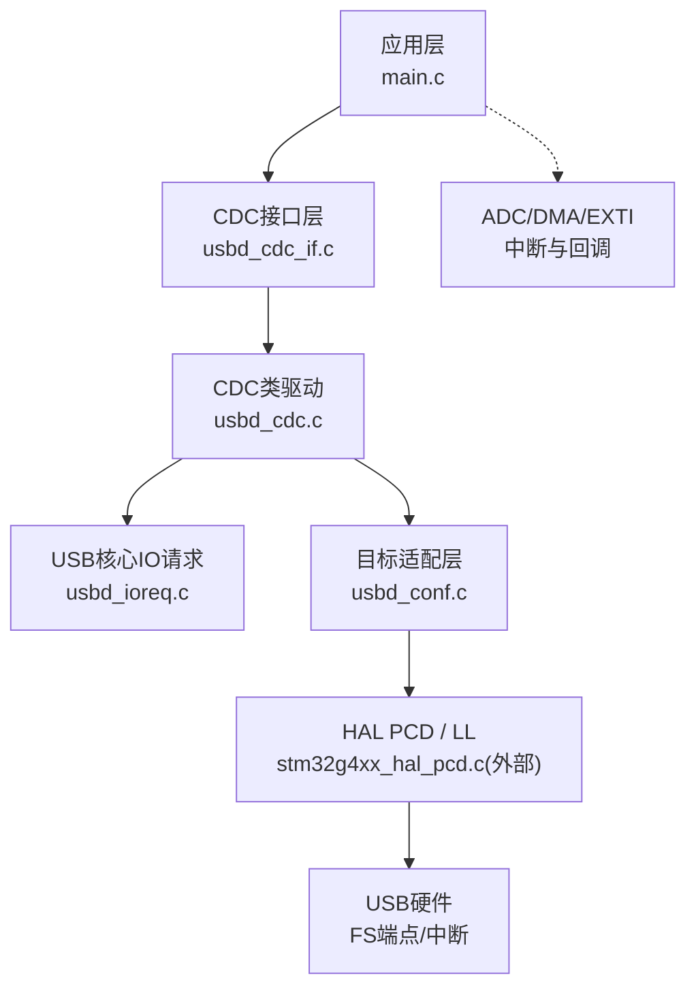
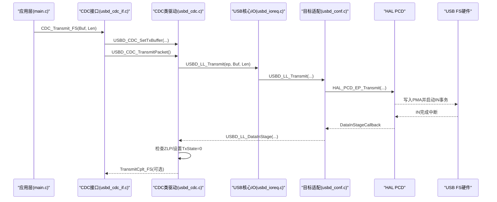
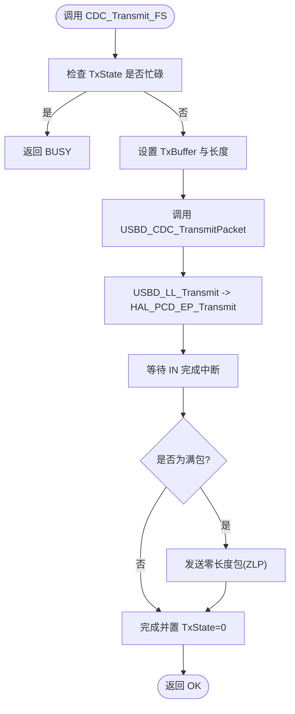
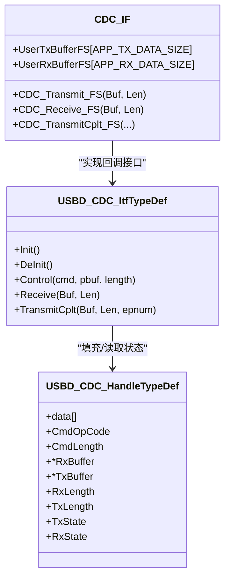
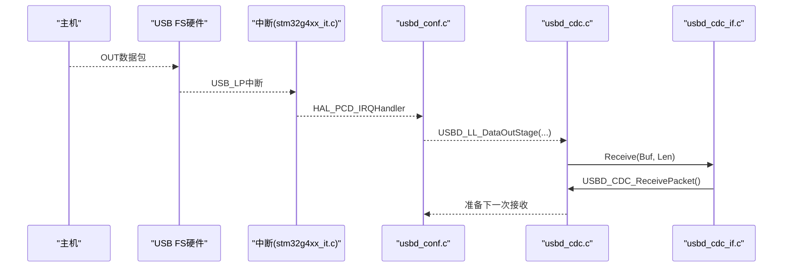
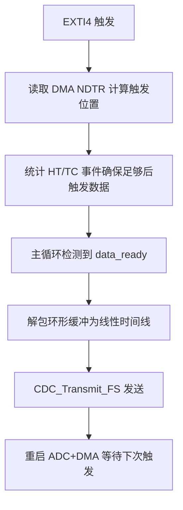
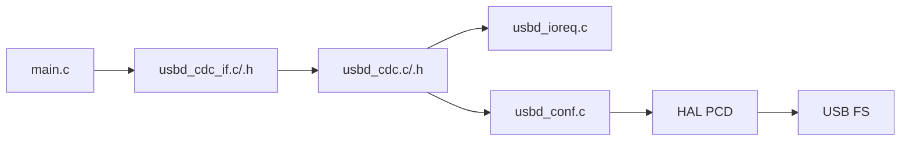

# 数据传输机制

<cite>
**本文引用的文件列表**
- [main.c](file://Core/Src/main.c)
- [usbd_cdc_if.c](file://USB_Device/App/usbd_cdc_if.c)
- [usbd_cdc_if.h](file://USB_Device/App/usbd_cdc_if.h)
- [usbd_cdc.c](file://Middlewares/ST/STM32_USB_Device_Library/Class/CDC/Src/usbd_cdc.c)
- [usbd_cdc.h](file://Middlewares/ST/STM32_USB_Device_Library/Class/CDC/Inc/usbd_cdc.h)
- [usb_device.c](file://USB_Device/App/usb_device.c)
- [usbd_conf.c](file://USB_Device/Target/usbd_conf.c)
- [stm32g4xx_it.c](file://Core/Src/stm32g4xx_it.c)
- [usbd_ioreq.c](file://Middlewares/ST/STM32_USB_Device_Library/Core/Src/usbd_ioreq.c)
- [usbd_desc.c](file://USB_Device/App/usbd_desc.c)
</cite>

## 目录
1. [简介](#简介)
2. [项目结构](#项目结构)
3. [核心组件](#核心组件)
4. [架构总览](#架构总览)
5. [详细组件分析](#详细组件分析)
6. [依赖关系分析](#依赖关系分析)
7. [性能考虑与优化](#性能考虑与优化)
8. [故障排查指南](#故障排查指南)
9. [结论](#结论)
10. [附录：初学者入门与高级实践](#附录初学者入门与高级实践)

## 简介
本技术文档围绕该工程中的USB CDC（虚拟串口）数据传输机制，系统阐述非阻塞式批量传输的工作原理、发送缓冲区管理与数据队列机制、接收数据处理流程与重定向、DMA集成与中断处理路径，并提供性能分析与优化建议。文档同时为初学者提供USB传输基础概念，并为高级开发者给出高吞吐与实时性保障的实践指导。

## 项目结构
本项目基于STM32G4系列，采用STM32 USB设备库与CDC类实现虚拟串口通信。关键目录与职责如下：
- Core/Src/main.c：应用主循环、ADC+DMA采集、触发事件处理、信号重组与通过CDC发送。
- USB_Device/App/usbd_cdc_if.c/.h：CDC接口层，定义用户收发缓冲、回调注册、CDC_Transmit_FS等对外API。
- Middlewares/ST/.../usbd_cdc.c/.h：CDC类驱动，管理端点、请求、IN/OUT数据流及状态机。
- USB_Device/App/usb_device.c：USB设备初始化，注册CDC类与接口。
- USB_Device/Target/usbd_conf.c：底层HAL PCD适配、中断映射、PMA配置、LL接口实现。
- Core/Src/stm32g4xx_it.c：全局中断入口，转发至HAL与外设。
- USB_Device/App/usbd_desc.c：设备描述符与字符串描述符。
- Middlewares/ST/.../usbd_ioreq.c：控制端点I/O请求辅助函数。

图表来源
- [main.c:178-212](file://Core/Src/main.c#L178-L212)
- [usbd_cdc_if.c:281-293](file://USB_Device/App/usbd_cdc_if.c#L281-L293)
- [usbd_cdc.c:690-722](file://Middlewares/ST/STM32_USB_Device_Library/Class/CDC/Src/usbd_cdc.c#L690-L722)
- [usbd_conf.c:643-673](file://USB_Device/Target/usbd_conf.c#L643-L673)
- [stm32g4xx_it.c:233-242](file://Core/Src/stm32g4xx_it.c#L233-L242)

章节来源
- [main.c:1-556](file://Core/Src/main.c#L1-L556)
- [usb_device.c:66-88](file://USB_Device/App/usb_device.c#L66-L88)
- [usbd_cdc_if.h:51-54](file://USB_Device/App/usbd_cdc_if.h#L51-L54)

## 核心组件
- CDC接口层（usbd_cdc_if.c/.h）
  - 暴露CDC_Transmit_FS供上层调用；维护UserTxBufferFS/UserRxBufferFS作为应用侧收发缓冲。
  - 在CDC_Init_FS中绑定缓冲指针，完成“应用缓冲”到“CDC类驱动缓冲”的桥接。
- CDC类驱动（usbd_cdc.c/.h）
  - 管理CDC端点（IN/OUT/Bulk）、控制端点（Interrupt）、枚举与请求处理。
  - 维护USBD_CDC_HandleTypeDef状态（TxState/RxState/TxLength/RxLength），并回调应用层TransmitCplt/Receive。
- 目标适配层（usbd_conf.c）
  - 将HAL_PCD中断与回调映射到USBD_LL_*接口；配置PMA内存分配给各端点；实现USBD_LL_Transmit/PrepareReceive等。
- 应用层（main.c）
  - 使用ADC+DMA环形缓冲采集双通道数据，EXTI触发后重组时间线，并通过CDC_Transmit_FS以非阻塞方式发送。

章节来源
- [usbd_cdc_if.c:152-160](file://USB_Device/App/usbd_cdc_if.c#L152-L160)
- [usbd_cdc_if.c:281-293](file://USB_Device/App/usbd_cdc_if.c#L281-L293)
- [usbd_cdc.c:467-542](file://Middlewares/ST/STM32_USB_Device_Library/Class/CDC/Src/usbd_cdc.c#L467-L542)
- [usbd_cdc.c:690-722](file://Middlewares/ST/STM32_USB_Device_Library/Class/CDC/Src/usbd_cdc.c#L690-L722)
- [usbd_conf.c:394-452](file://USB_Device/Target/usbd_conf.c#L394-L452)
- [main.c:178-212](file://Core/Src/main.c#L178-L212)

## 架构总览
下图展示了从应用层到USB硬件的完整数据通路，包括非阻塞发送、接收回调与中断路径。

图表来源
- [usbd_cdc_if.c:281-293](file://USB_Device/App/usbd_cdc_if.c#L281-L293)
- [usbd_cdc.c:690-722](file://Middlewares/ST/STM32_USB_Device_Library/Class/CDC/Src/usbd_cdc.c#L690-L722)
- [usbd_ioreq.c:87-104](file://Middlewares/ST/STM32_USB_Device_Library/Core/Src/usbd_ioreq.c#L87-L104)
- [usbd_conf.c:643-673](file://USB_Device/Target/usbd_conf.c#L643-L673)
- [stm32g4xx_it.c:233-242](file://Core/Src/stm32g4xx_it.c#L233-L242)

## 详细组件分析

### 非阻塞式批量发送：CDC_Transmit_FS内部实现与调用链
- 应用调用CDC_Transmit_FS(Buf, Len)。
- 接口层检查TxState是否忙，若忙则返回BUSY；否则设置TxBuffer与长度，并调用USBD_CDC_TransmitPacket。
- CDC类驱动将数据提交给底层USBD_LL_Transmit，进入非阻塞队列；当IN端点完成时，类驱动置TxState=0并可回调TransmitCplt。
- 应用层可轮询返回值或等待回调进行后续操作。

图表来源
- [usbd_cdc_if.c:281-293](file://USB_Device/App/usbd_cdc_if.c#L281-L293)
- [usbd_cdc.c:690-722](file://Middlewares/ST/STM32_USB_Device_Library/Class/CDC/Src/usbd_cdc.c#L690-L722)
- [usbd_conf.c:643-673](file://USB_Device/Target/usbd_conf.c#L643-L673)

章节来源
- [usbd_cdc_if.c:281-293](file://USB_Device/App/usbd_cdc_if.c#L281-L293)
- [usbd_cdc.c:690-722](file://Middlewares/ST/STM32_USB_Device_Library/Class/CDC/Src/usbd_cdc.c#L690-L722)
- [usbd_conf.c:643-673](file://USB_Device/Target/usbd_conf.c#L643-L673)

### 发送缓冲区管理与数据队列机制（UserTxBufferFS）
- UserTxBufferFS与UserRxBufferFS在usbd_cdc_if.c中定义，大小由APP_TX_DATA_SIZE/APP_RX_DATA_SIZE决定（默认2048字节）。
- CDC_Init_FS中将这两个缓冲与CDC类驱动关联，使上层可直接向这些缓冲写入数据并提交传输。
- CDC类驱动内部维护TxBuffer/TxLength/TxState，形成简单的单包队列模型：一次提交一个数据包，完成后释放锁（TxState=0）。

图表来源
- [usbd_cdc.h:102-124](file://Middlewares/ST/STM32_USB_Device_Library/Class/CDC/Inc/usbd_cdc.h#L102-L124)
- [usbd_cdc_if.c:88-95](file://USB_Device/App/usbd_cdc_if.c#L88-L95)
- [usbd_cdc_if.c:138-145](file://USB_Device/App/usbd_cdc_if.c#L138-L145)

章节来源
- [usbd_cdc_if.h:51-54](file://USB_Device/App/usbd_cdc_if.h#L51-L54)
- [usbd_cdc_if.c:88-95](file://USB_Device/App/usbd_cdc_if.c#L88-L95)
- [usbd_cdc.h:102-124](file://Middlewares/ST/STM32_USB_Device_Library/Class/CDC/Inc/usbd_cdc.h#L102-L124)

### 接收数据处理流程与重定向（CDC_Receive_FS）
- 当主机向OUT端点发送数据时，USB硬件触发中断，经HAL_PCD_IRQHandler -> PCD_DataOutStageCallback -> USBD_LL_DataOutStage -> USBD_CDC_DataOut。
- CDC类驱动获取接收长度并回调应用层Receive(Buf, Len)，即CDC_Receive_FS。
- 典型做法是在Receive中保存数据并再次准备接收下一个包（USBD_CDC_ReceivePacket），从而实现持续接收。

图表来源
- [stm32g4xx_it.c:233-242](file://Core/Src/stm32g4xx_it.c#L233-L242)
- [usbd_conf.c:152-165](file://USB_Device/Target/usbd_conf.c#L152-L165)
- [usbd_cdc.c:731-749](file://Middlewares/ST/STM32_USB_Device_Library/Class/CDC/Src/usbd_cdc.c#L731-L749)
- [usbd_cdc_if.c:261-268](file://USB_Device/App/usbd_cdc_if.c#L261-L268)

章节来源
- [usbd_cdc.c:731-749](file://Middlewares/ST/STM32_USB_Device_Library/Class/CDC/Src/usbd_cdc.c#L731-L749)
- [usbd_cdc_if.c:261-268](file://USB_Device/App/usbd_cdc_if.c#L261-L268)

### DMA传输集成与中断处理
- ADC采样链路：ADC1/ADC2多模式交错转换，DMA1_Channel1将结果搬运至adc_raw_buffer环形缓冲；DMA半传/全传回调用于检测触发后的数据完整性。
- EXTI4捕获触发时刻，结合DMA剩余计数计算触发位置，随后在主循环中重组时间线并通过CDC发送。
- USB链路本身不使用DMA进行批量数据搬运（当前实现走HAL_PCD_EP_Transmit/Receive），但可通过扩展目标适配层接入DMA以提升吞吐。

图表来源
- [main.c:91-113](file://Core/Src/main.c#L91-L113)
- [main.c:119-131](file://Core/Src/main.c#L119-L131)
- [main.c:156-171](file://Core/Src/main.c#L156-L171)
- [main.c:178-212](file://Core/Src/main.c#L178-L212)
- [stm32g4xx_it.c:219-228](file://Core/Src/stm32g4xx_it.c#L219-L228)

章节来源
- [main.c:91-113](file://Core/Src/main.c#L91-L113)
- [main.c:119-131](file://Core/Src/main.c#L119-L131)
- [main.c:156-171](file://Core/Src/main.c#L156-L171)
- [main.c:178-212](file://Core/Src/main.c#L178-L212)
- [stm32g4xx_it.c:219-228](file://Core/Src/stm32g4xx_it.c#L219-L228)

### 错误检测与重试机制
- 发送端：CDC_Transmit_FS在TxState!=0时返回BUSY；应用层可在需要时轮询并重试（例如while(CDC_Transmit_FS(...) != OK)延时重试）。
- 接收端：在CDC_Receive_FS中需保证每次返回前重新准备接收（USBD_CDC_ReceivePacket），避免丢包。
- 底层状态：USBD_LL_*接口统一将HAL状态转换为USBD状态，便于上层判断OK/FAIL/BUSY。

章节来源
- [usbd_cdc_if.c:281-293](file://USB_Device/App/usbd_cdc_if.c#L281-L293)
- [usbd_cdc_if.c:261-268](file://USB_Device/App/usbd_cdc_if.c#L261-L268)
- [usbd_conf.c:774-797](file://USB_Device/Target/usbd_conf.c#L774-L797)

## 依赖关系分析
- 应用层依赖CDC接口层提供的CDC_Transmit_FS与缓冲定义。
- CDC接口层依赖CDC类驱动的状态与端点操作。
- CDC类驱动依赖USB核心IO请求与目标适配层。
- 目标适配层依赖HAL PCD与USB硬件中断。

图表来源
- [usb_device.c:66-88](file://USB_Device/App/usb_device.c#L66-L88)
- [usbd_cdc_if.c:138-145](file://USB_Device/App/usbd_cdc_if.c#L138-L145)
- [usbd_cdc.c:467-542](file://Middlewares/ST/STM32_USB_Device_Library/Class/CDC/Src/usbd_cdc.c#L467-L542)
- [usbd_conf.c:394-452](file://USB_Device/Target/usbd_conf.c#L394-L452)

章节来源
- [usb_device.c:66-88](file://USB_Device/App/usb_device.c#L66-L88)
- [usbd_cdc_if.c:138-145](file://USB_Device/App/usbd_cdc_if.c#L138-L145)
- [usbd_cdc.c:467-542](file://Middlewares/ST/STM32_USB_Device_Library/Class/CDC/Src/usbd_cdc.c#L467-L542)
- [usbd_conf.c:394-452](file://USB_Device/Target/usbd_conf.c#L394-L452)

## 性能考虑与优化
- 端点最大包长与吞吐
  - FS Bulk端点最大包长为64字节，理论峰值约64KB/s。提高吞吐的关键在于减少CPU参与和增加批量化。
- 缓冲区大小调优
  - APP_TX_DATA_SIZE/APP_RX_DATA_SIZE应至少大于等于一次提交的包长，通常设置为N×64以便对齐。
  - 对于大批量数据，建议在应用层构建更大的输出缓冲，分片多次提交，避免单次过大导致延迟抖动。
- 传输延迟分析
  - 非阻塞发送的延迟主要来源于：应用层组装数据的时间、USB主机调度周期、IN端点空闲等待。
  - 使用ZLP（满包后发送零长度包）可加速主机确认，类驱动已自动处理。
- 中断与实时性
  - 保持中断服务程序短小，尽量在ISR中仅置标志位，主循环处理耗时逻辑。
  - 对高频数据路径，可考虑在usbd_conf.c中引入DMA搬运以降低CPU占用。
- 功耗与低功耗
  - 当前未启用低功率模式；如需降低功耗，可在usbd_conf.c中启用LPM并在唤醒时恢复时钟。

章节来源
- [usbd_cdc.h:57-59](file://Middlewares/ST/STM32_USB_Device_Library/Class/CDC/Inc/usbd_cdc.h#L57-L59)
- [usbd_cdc_if.h:51-54](file://USB_Device/App/usbd_cdc_if.h#L51-L54)
- [usbd_cdc.c:690-722](file://Middlewares/ST/STM32_USB_Device_Library/Class/CDC/Src/usbd_cdc.c#L690-L722)
- [usbd_conf.c:257-297](file://USB_Device/Target/usbd_conf.c#L257-L297)

## 故障排查指南
- 现象：CDC_Transmit_FS频繁返回BUSY
  - 原因：上一次传输未完成，TxState仍为忙。
  - 处理：轮询重试或在上次TransmitCplt回调中再发下一包；增大应用层缓冲或分片发送。
- 现象：主机收不到数据或断断续续
  - 原因：未在Receive中重新准备接收；或应用层处理过慢导致OUT端点NAK堆积。
  - 处理：确保CDC_Receive_FS末尾调用USBD_CDC_ReceivePacket；优化接收处理路径。
- 现象：USB枚举失败或无法识别
  - 原因：描述符或端点配置异常；PMA地址冲突。
  - 处理：检查usbd_desc.c描述符与usbd_conf.c中PMA配置；确认端点地址与大小匹配。
- 现象：触发后数据不完整
  - 原因：EXTI与DMA事件时序问题；NDTR瞬态为0导致位置计算异常。
  - 处理：参考现有边界保护逻辑，确保post-trigger事件计数达到阈值后再停止DMA并处理数据。

章节来源
- [usbd_cdc_if.c:281-293](file://USB_Device/App/usbd_cdc_if.c#L281-L293)
- [usbd_cdc_if.c:261-268](file://USB_Device/App/usbd_cdc_if.c#L261-L268)
- [usbd_conf.c:443-450](file://USB_Device/Target/usbd_conf.c#L443-L450)
- [main.c:91-113](file://Core/Src/main.c#L91-L113)

## 结论
本项目实现了基于STM32 USB FS的CDC虚拟串口通信，采用非阻塞批量传输与回调机制，配合ADC+DMA采集与EXTI触发，形成了稳定的数据采集与上报链路。通过合理配置端点包长与应用缓冲、优化中断与主循环分工，可获得良好的吞吐与时延表现。进一步引入DMA搬运与更完善的队列管理，可满足更高吞吐量与实时性需求。

## 附录：初学者入门与高级实践
- 初学者入门
  - USB基本概念：设备/主机、端点（Endpoint）、批量传输（Bulk）、控制传输（Control）、描述符（Descriptor）。
  - CDC类：虚拟串口协议，包含控制接口与数据接口（IN/OUT端点）。
  - 在本工程中，理解main.c如何触发采集、重组数据并通过CDC_Transmit_FS发送，以及usbd_cdc_if.c如何桥接应用缓冲与类驱动。
- 高级实践
  - 高吞吐：在usbd_conf.c中为IN/OUT端点配置DMA，减少CPU拷贝；使用双缓冲或环形队列避免竞争。
  - 实时性：将耗时处理移出中断；使用原子变量与临界区保护共享状态；必要时提升USB中断优先级。
  - 可靠性：完善错误码与重试策略；记录日志与统计指标（如发送失败次数、平均延迟）。