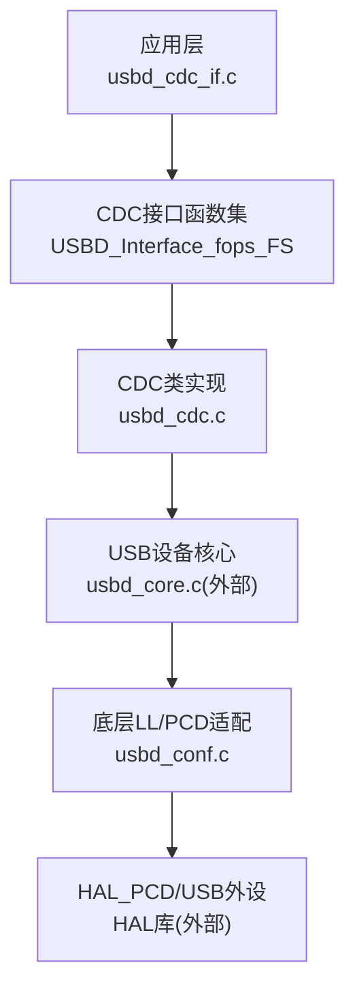
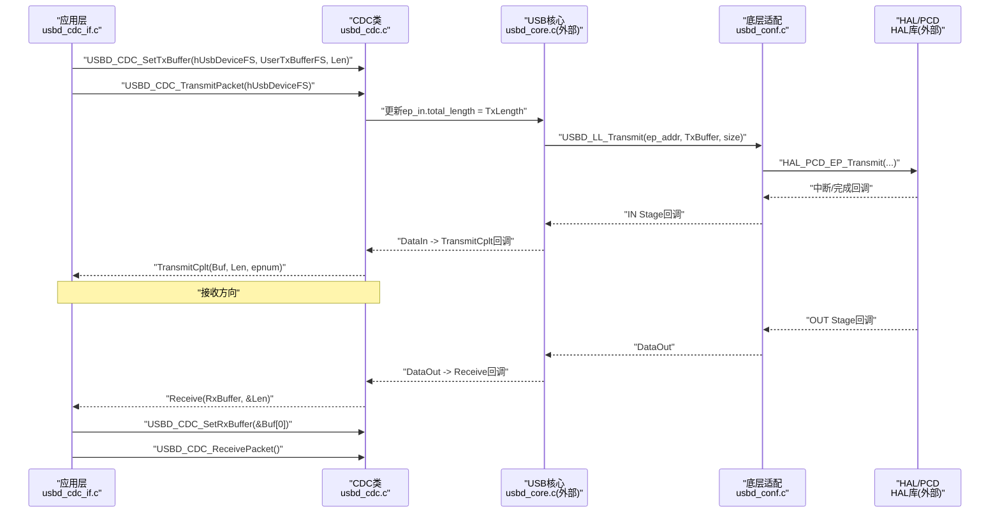
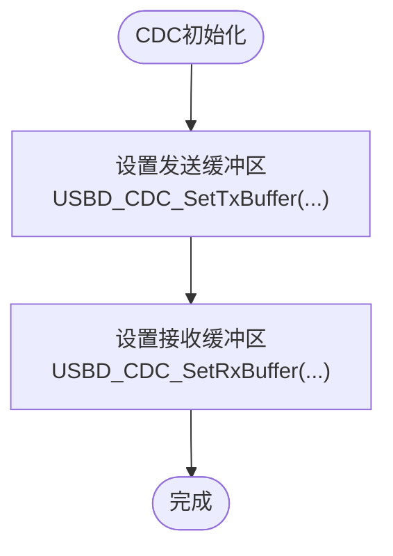
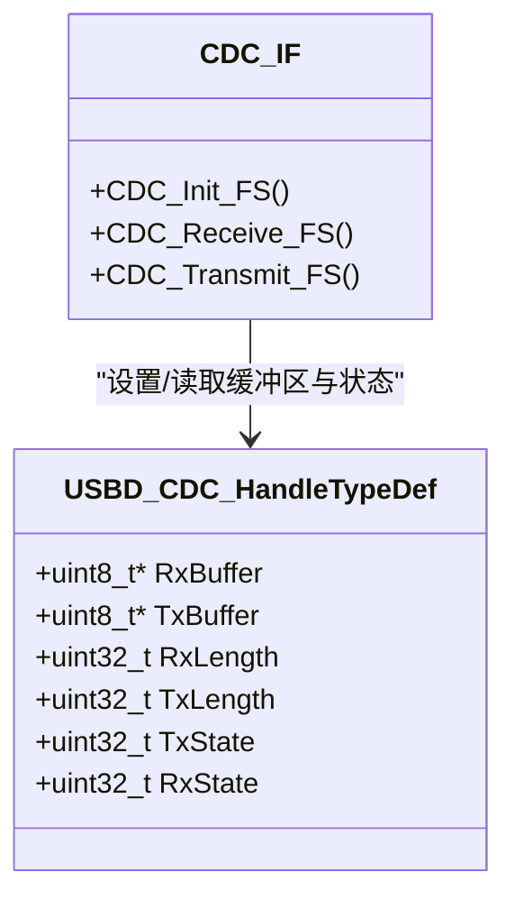
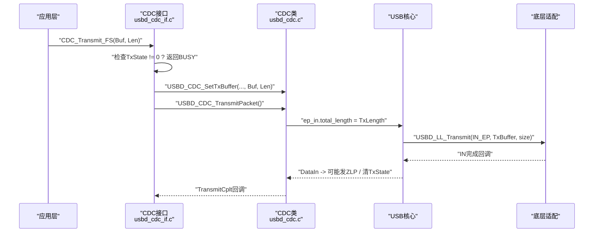
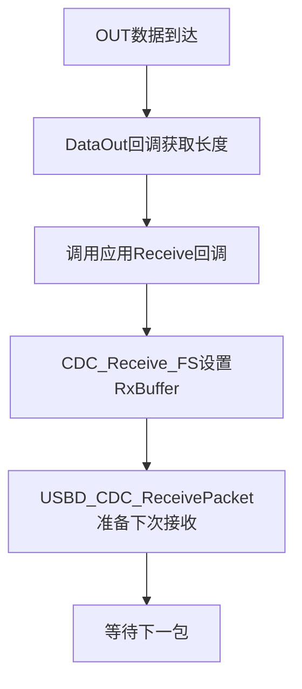

# 缓冲区管理

<cite>
**本文引用的文件**   
- [usbd_cdc_if.c](file://USB_Device/App/usbd_cdc_if.c)
- [usbd_cdc_if.h](file://USB_Device/App/usbd_cdc_if.h)
- [usbd_cdc.h](file://Middlewares/ST/STM32_USB_Device_Library/Class/CDC/Inc/usbd_cdc.h)
- [usbd_cdc.c](file://Middlewares/ST/STM32_USB_Device_Library/Class/CDC/Src/usbd_cdc.c)
- [usb_device.c](file://USB_Device/App/usb_device.c)
- [usbd_conf.c](file://USB_Device/Target/usbd_conf.c)
- [main.c](file://Core/Src/main.c)
</cite>

## 目录
1. [简介](#简介)
2. [项目结构](#项目结构)
3. [核心组件](#核心组件)
4. [架构总览](#架构总览)
5. [详细组件分析](#详细组件分析)
6. [依赖关系分析](#依赖关系分析)
7. [性能与内存优化](#性能与内存优化)
8. [故障排查指南](#故障排查指南)
9. [结论](#结论)
10. [附录：初学者入门与高级设计建议](#附录初学者入门与高级设计建议)

## 简介
本技术文档围绕USB CDC（虚拟串口）的缓冲区管理系统，重点解析用户侧发送/接收缓冲区的配置与使用方式，深入说明USBD_CDC_SetTxBuffer、USBD_CDC_SetRxBuffer的工作机制，并给出缓冲区大小对传输性能的影响分析。同时提供溢出检测与防抖策略、DMA集成与零拷贝优化思路，帮助初学者理解基本概念，并为高级开发者提供高性能缓冲区和内存池的设计指导。

## 项目结构
本项目基于STM32G4系列，采用STM32 USB设备库与CDC类实现虚拟串口通信。关键路径如下：
- 应用层：定义APP_RX_DATA_SIZE、APP_TX_DATA_SIZE及UserRxBufferFS/UserTxBufferFS，并在CDC初始化时注册到CDC类。
- CDC类层：维护收发状态、长度与缓冲区指针，封装Set/SetPacket接口。
- 底层驱动：HAL PCD回调将数据搬运至CDC层，再由CDC层调用应用回调处理。

图表来源
- [usbd_cdc_if.c:138-145](file://USB_Device/App/usbd_cdc_if.c#L138-L145)
- [usbd_cdc.c:140-156](file://Middlewares/ST/STM32_USB_Device_Library/Class/CDC/Src/usbd_cdc.c#L140-L156)
- [usbd_conf.c:394-452](file://USB_Device/Target/usbd_conf.c#L394-L452)

章节来源
- [usb_device.c:66-88](file://USB_Device/App/usb_device.c#L66-L88)
- [usbd_cdc_if.c:138-145](file://USB_Device/App/usbd_cdc_if.c#L138-L145)
- [usbd_cdc.c:140-156](file://Middlewares/ST/STM32_USB_Device_Library/Class/CDC/Src/usbd_cdc.c#L140-L156)
- [usbd_conf.c:394-452](file://USB_Device/Target/usbd_conf.c#L394-L452)

## 核心组件
- 用户缓冲区定义与大小常量
  - APP_RX_DATA_SIZE、APP_TX_DATA_SIZE在头文件中定义，用于控制接收/发送缓冲区容量。
  - UserRxBufferFS、UserTxBufferFS为实际RAM中的字节数组，作为CDC类的输入输出缓冲。
- CDC类句柄与状态
  - USBD_CDC_HandleTypeDef包含RxBuffer/TxBuffer指针、RxLength/TxLength、以及TxState/RxState等状态位。
- CDC接口回调
  - Init阶段设置用户缓冲区；Receive回调中重新绑定接收缓冲并准备下一次接收；TransmitCplt回调用于通知上层发送完成。

章节来源
- [usbd_cdc_if.h:51-54](file://USB_Device/App/usbd_cdc_if.h#L51-L54)
- [usbd_cdc_if.c:88-95](file://USB_Device/App/usbd_cdc_if.c#L88-L95)
- [usbd_cdc.h:112-124](file://Middlewares/ST/STM32_USB_Device_Library/Class/CDC/Inc/usbd_cdc.h#L112-L124)
- [usbd_cdc_if.c:152-160](file://USB_Device/App/usbd_cdc_if.c#L152-L160)
- [usbd_cdc_if.c:261-268](file://USB_Device/App/usbd_cdc_if.c#L261-L268)
- [usbd_cdc_if.c:307-316](file://USB_Device/App/usbd_cdc_if.c#L307-L316)

## 架构总览
下图展示了从应用层到硬件的完整数据流，包括缓冲区设置、数据包发送与接收的关键节点。

图表来源
- [usbd_cdc_if.c:152-160](file://USB_Device/App/usbd_cdc_if.c#L152-L160)
- [usbd_cdc_if.c:281-293](file://USB_Device/App/usbd_cdc_if.c#L281-L293)
- [usbd_cdc.c:899-924](file://Middlewares/ST/STM32_USB_Device_Library/Class/CDC/Src/usbd_cdc.c#L899-L924)
- [usbd_cdc.c:690-722](file://Middlewares/ST/STM32_USB_Device_Library/Class/CDC/Src/usbd_cdc.c#L690-L722)
- [usbd_cdc.c:731-749](file://Middlewares/ST/STM32_USB_Device_Library/Class/CDC/Src/usbd_cdc.c#L731-L749)
- [usbd_cdc.c:932-955](file://Middlewares/ST/STM32_USB_Device_Library/Class/CDC/Src/usbd_cdc.c#L932-L955)
- [usbd_conf.c:643-673](file://USB_Device/Target/usbd_conf.c#L643-L673)

## 详细组件分析

### 用户缓冲区定义与配置
- 缓冲区大小定义
  - APP_RX_DATA_SIZE、APP_TX_DATA_SIZE位于应用头文件，决定UserRxBufferFS和UserTxBufferFS的大小。
- 缓冲区变量声明
  - UserRxBufferFS、UserTxBufferFS为全局字节数组，供CDC类直接读写。
- 初始化阶段绑定
  - CDC_Init_FS中调用USBD_CDC_SetTxBuffer与USBD_CDC_SetRxBuffer，将用户缓冲区指针与长度注册到CDC类句柄。

图表来源
- [usbd_cdc_if.h:51-54](file://USB_Device/App/usbd_cdc_if.h#L51-L54)
- [usbd_cdc_if.c:88-95](file://USB_Device/App/usbd_cdc_if.c#L88-L95)
- [usbd_cdc_if.c:152-160](file://USB_Device/App/usbd_cdc_if.c#L152-L160)

章节来源
- [usbd_cdc_if.h:51-54](file://USB_Device/App/usbd_cdc_if.h#L51-L54)
- [usbd_cdc_if.c:88-95](file://USB_Device/App/usbd_cdc_if.c#L88-L95)
- [usbd_cdc_if.c:152-160](file://USB_Device/App/usbd_cdc_if.c#L152-L160)

### USBD_CDC_SetTxBuffer与USBD_CDC_SetRxBuffer工作原理
- SetTxBuffer
  - 将TxBuffer指针与TxLength写入CDC句柄，后续TransmitPacket会使用该长度进行端点传输。
- SetRxBuffer
  - 将RxBuffer指针写入CDC句柄，配合ReceivePacket为OUT端点准备下一次接收。
- 关键点
  - 这两个函数仅做指针与长度赋值，不复制数据，属于“零拷贝”的基础。
  - 发送流程中，TransmitPacket通过USBD_LL_Transmit将数据送入底层，由HAL驱动完成DMA或寄存器搬运。

图表来源
- [usbd_cdc.h:112-124](file://Middlewares/ST/STM32_USB_Device_Library/Class/CDC/Inc/usbd_cdc.h#L112-L124)
- [usbd_cdc.c:857-891](file://Middlewares/ST/STM32_USB_Device_Library/Class/CDC/Src/usbd_cdc.c#L857-L891)
- [usbd_cdc_if.c:152-160](file://USB_Device/App/usbd_cdc_if.c#L152-L160)

章节来源
- [usbd_cdc.c:857-891](file://Middlewares/ST/STM32_USB_Device_Library/Class/CDC/Src/usbd_cdc.c#L857-L891)
- [usbd_cdc.c:899-924](file://Middlewares/ST/STM32_USB_Device_Library/Class/CDC/Src/usbd_cdc.c#L899-L924)
- [usbd_cdc.c:932-955](file://Middlewares/ST/STM32_USB_Device_Library/Class/CDC/Src/usbd_cdc.c#L932-L955)

### 发送流程与状态机
- 发送入口
  - CDC_Transmit_FS检查hcdc->TxState是否空闲，若忙则返回BUSY；否则设置TxBuffer与TxLength，调用USBD_CDC_TransmitPacket。
- 传输完成
  - DataIn回调中，若total_length为最大包大小的整数倍，则发送ZLP（零长度包），否则置TxState=0并触发TransmitCplt回调。
- 典型用法
  - 应用层在主循环中构建数据，调用CDC_Transmit_FS，并根据返回值处理重试或错误。

图表来源
- [usbd_cdc_if.c:281-293](file://USB_Device/App/usbd_cdc_if.c#L281-L293)
- [usbd_cdc.c:899-924](file://Middlewares/ST/STM32_USB_Device_Library/Class/CDC/Src/usbd_cdc.c#L899-L924)
- [usbd_cdc.c:690-722](file://Middlewares/ST/STM32_USB_Device_Library/Class/CDC/Src/usbd_cdc.c#L690-L722)

章节来源
- [usbd_cdc_if.c:281-293](file://USB_Device/App/usbd_cdc_if.c#L281-L293)
- [usbd_cdc.c:899-924](file://Middlewares/ST/STM32_USB_Device_Library/Class/CDC/Src/usbd_cdc.c#L899-L924)
- [usbd_cdc.c:690-722](file://Middlewares/ST/STM32_USB_Device_Library/Class/CDC/Src/usbd_cdc.c#L690-L722)

### 接收流程与重预取
- 接收入口
  - DataOut回调获取接收长度，调用应用层的Receive回调。
- 应用层处理
  - CDC_Receive_FS中重新设置RxBuffer指针并调用USBD_CDC_ReceivePacket，为下一次OUT数据做准备。
- 注意
  - 必须在Receive回调退出前完成下一次PrepareReceive，否则主机可能继续发送导致数据丢失。

图表来源
- [usbd_cdc.c:731-749](file://Middlewares/ST/STM32_USB_Device_Library/Class/CDC/Src/usbd_cdc.c#L731-L749)
- [usbd_cdc_if.c:261-268](file://USB_Device/App/usbd_cdc_if.c#L261-L268)
- [usbd_cdc.c:932-955](file://Middlewares/ST/STM32_USB_Device_Library/Class/CDC/Src/usbd_cdc.c#L932-L955)

章节来源
- [usbd_cdc.c:731-749](file://Middlewares/ST/STM32_USB_Device_Library/Class/CDC/Src/usbd_cdc.c#L731-L749)
- [usbd_cdc_if.c:261-268](file://USB_Device/App/usbd_cdc_if.c#L261-L268)
- [usbd_cdc.c:932-955](file://Middlewares/ST/STM32_USB_Device_Library/Class/CDC/Src/usbd_cdc.c#L932-L955)

## 依赖关系分析
- 应用层依赖CDC接口函数（usbd_cdc_if.*），并通过MX_USB_Device_Init注册CDC类与接口。
- CDC类依赖USB核心与底层适配（usbd_conf.c），后者将HAL PCD回调映射到USBD_LL_*接口。
- 缓冲区大小受端点最大包大小限制：FS模式下最大包大小为64字节，HS模式为512字节。

图表来源
- [usb_device.c:66-88](file://USB_Device/App/usb_device.c#L66-L88)
- [usbd_cdc.h:56-66](file://Middlewares/ST/STM32_USB_Device_Library/Class/CDC/Inc/usbd_cdc.h#L56-L66)
- [usbd_conf.c:394-452](file://USB_Device/Target/usbd_conf.c#L394-L452)

章节来源
- [usb_device.c:66-88](file://USB_Device/App/usb_device.c#L66-L88)
- [usbd_cdc.h:56-66](file://Middlewares/ST/STM32_USB_Device_Library/Class/CDC/Inc/usbd_cdc.h#L56-L66)
- [usbd_conf.c:394-452](file://USB_Device/Target/usbd_conf.c#L394-L452)

## 性能与内存优化
- 缓冲区大小与传输性能
  - 增大APP_TX_DATA_SIZE可减少应用层调用次数，提高吞吐，但会增加RAM占用与端到端延迟（数据需累积到更大块）。
  - 减小APP_TX_DATA_SIZE可降低延迟，但频繁调用会增加CPU开销与协议栈切换成本。
  - FS端点最大包大小为64字节，合理对齐到64的倍数可避免多余ZLP，提升带宽利用率。
- 内存使用效率
  - 使用静态全局数组UserTxBufferFS/UserRxBufferFS避免动态分配，减少碎片与不确定性。
  - 根据实际业务峰值流量设定大小，避免过大造成浪费。
- 传输延迟与吞吐权衡
  - 高吞吐场景：适当增大缓冲区，批量发送；结合ZLP优化，确保last packet正确结束。
  - 低延迟场景：小缓冲区+快速处理，保证Receive回调及时PrepareReceive，避免丢包。

章节来源
- [usbd_cdc.h:56-66](file://Middlewares/ST/STM32_USB_Device_Library/Class/CDC/Inc/usbd_cdc.h#L56-L66)
- [usbd_cdc.c:690-722](file://Middlewares/ST/STM32_USB_Device_Library/Class/CDC/Src/usbd_cdc.c#L690-L722)
- [usbd_cdc_if.c:281-293](file://USB_Device/App/usbd_cdc_if.c#L281-L293)

## 故障排查指南
- 常见问题
  - 发送阻塞：检查TxState是否为1，避免重复发送；必要时增加重试与超时处理。
  - 接收丢包：确认Receive回调中已调用SetRxBuffer与ReceivePacket，确保下一次接收已准备。
  - ZLP问题：当发送长度为端点最大包的整数倍时，需发送ZLP以结束传输；CDC类内部已处理，但需确保长度设置正确。
- 调试建议
  - 在TransmitCplt回调中记录成功发送的长度与时间戳，评估吞吐与延迟。
  - 在Receive回调中统计每次接收长度，观察是否出现异常小包或大包。
  - 使用LED或日志标记关键路径，定位瓶颈。

章节来源
- [usbd_cdc_if.c:281-293](file://USB_Device/App/usbd_cdc_if.c#L281-L293)
- [usbd_cdc_if.c:261-268](file://USB_Device/App/usbd_cdc_if.c#L261-L268)
- [usbd_cdc.c:690-722](file://Middlewares/ST/STM32_USB_Device_Library/Class/CDC/Src/usbd_cdc.c#L690-L722)

## 结论
通过对UserTxBufferFS与UserRxBufferFS的配置与CDC类接口的深入分析，可以明确：
- 缓冲区大小直接影响吞吐与延迟，需根据业务需求平衡。
- SetTxBuffer/SetRxBuffer是零拷贝的基础，关键在于正确的生命周期管理与状态同步。
- 发送完成回调与接收预取是稳定性的关键，务必在回调中完成必要的状态清理与下一次准备。
- 结合DMA与ZLP优化，可在FS/HS模式下获得更佳的传输性能。

## 附录：初学者入门与高级设计建议
- 初学者入门
  - 理解缓冲区概念：发送缓冲区用于暂存待发送数据，接收缓冲区用于暂存主机下发的数据。
  - 熟悉CDC接口：Init阶段设置缓冲区，Receive回调处理数据并准备下一次接收，TransmitCplt回调用于通知发送完成。
  - 关注端点最大包大小：FS为64字节，HS为512字节，尽量按倍数发送以减少ZLP。
- 高级设计与优化
  - 环形缓冲区与双缓冲：在高吞吐场景下，使用环形缓冲或双缓冲降低锁竞争与拷贝开销。
  - DMA集成：利用HAL_PCD_EP_Transmit/Receive的DMA能力，减少CPU参与，提升实时性。
  - 零拷贝优化：在可能的情况下，直接将传感器或ADC结果写入USB端点缓冲，避免中间拷贝。
  - 内存池设计：为高频收发场景预分配固定大小的内存块，避免动态分配带来的不确定性与碎片。
  - 溢出检测与防抖：在接收路径加入计数与阈值判断，超过阈值时丢弃或回压；在发送路径增加队列与背压标志，防止拥塞。

章节来源
- [usbd_cdc.h:56-66](file://Middlewares/ST/STM32_USB_Device_Library/Class/CDC/Inc/usbd_cdc.h#L56-L66)
- [usbd_cdc.c:899-924](file://Middlewares/ST/STM32_USB_Device_Library/Class/CDC/Src/usbd_cdc.c#L899-L924)
- [usbd_cdc.c:932-955](file://Middlewares/ST/STM32_USB_Device_Library/Class/CDC/Src/usbd_cdc.c#L932-L955)
- [usbd_conf.c:643-673](file://USB_Device/Target/usbd_conf.c#L643-L673)