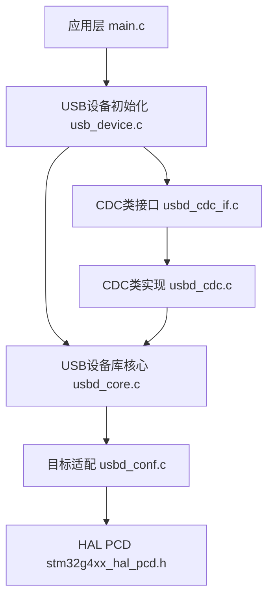
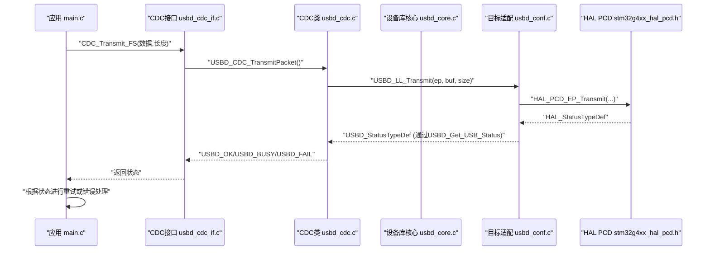

# 错误处理和重试机制

<cite>
**本文引用的文件**   
- [main.c](file://Core/Src/main.c)
- [usb_device.c](file://USB_Device/App/usb_device.c)
- [usbd_conf.c](file://USB_Device/Target/usbd_conf.c)
- [usbd_def.h](file://Middlewares/ST/STM32_USB_Device_Library/Core/Inc/usbd_def.h)
- [usbd_core.c](file://Middlewares/ST/STM32_USB_Device_Library/Core/Src/usbd_core.c)
- [usbd_cdc_if.c](file://USB_Device/App/usbd_cdc_if.c)
- [usbd_cdc.c](file://Middlewares/ST/STM32_USB_Device_Library/Class/CDC/Src/usbd_cdc.c)
- [stm32g4xx_hal_pcd.h](file://Drivers/STM32G4xx_HAL_Driver/Inc/stm32g4xx_hal_pcd.h)
</cite>

## 目录
1. [简介](#简介)
2. [项目结构](#项目结构)
3. [核心组件](#核心组件)
4. [架构总览](#架构总览)
5. [详细组件分析](#详细组件分析)
6. [依赖关系分析](#依赖关系分析)
7. [性能与稳定性考虑](#性能与稳定性考虑)
8. [故障排查指南](#故障排查指南)
9. [结论](#结论)
10. [附录：错误码与状态对照](#附录错误码与状态对照)

## 简介
本技术文档围绕该STM32G4 USB设备工程中的“错误处理与重试机制”展开，重点覆盖以下方面：
- USB传输错误的检测与分类（如USBD_BUSY、USBD_FAIL等）
- 重试策略（最大重试次数、退避算法）
- 连接断开检测与自动重连
- 错误日志与调试信息输出
- 硬件故障恢复与系统稳定性保障
- 与HAL库错误处理的集成方法
- 面向初学者的概念说明与面向高级开发者的健壮性指导

## 项目结构
本项目采用分层组织方式：
- Core层：应用主循环、外设初始化、中断回调与错误入口
- USB_Device层：设备栈初始化、类接口封装（CDC）
- Middlewares层：USB设备库核心与CDC类实现
- Drivers层：HAL驱动定义与接口

图表来源
- [usb_device.c:66-88](file://USB_Device/App/usb_device.c#L66-L88)
- [usbd_core.c:89-122](file://Middlewares/ST/STM32_USB_Device_Library/Core/Src/usbd_core.c#L89-L122)
- [usbd_conf.c:394-452](file://USB_Device/Target/usbd_conf.c#L394-L452)
- [stm32g4xx_hal_pcd.h:221-346](file://Drivers/STM32G4xx_HAL_Driver/Inc/stm32g4xx_hal_pcd.h#L221-L346)
- [usbd_cdc_if.c:281-293](file://USB_Device/App/usbd_cdc_if.c#L281-L293)
- [usbd_cdc.c:899-924](file://Middlewares/ST/STM32_USB_Device_Library/Class/CDC/Src/usbd_cdc.c#L899-L924)

章节来源
- [main.c:219-290](file://Core/Src/main.c#L219-L290)
- [usb_device.c:66-88](file://USB_Device/App/usb_device.c#L66-L88)

## 核心组件
- 应用主循环与数据发送流程：在检测到采集完成标志后，将采样数据打包并通过CDC接口发送。当前实现包含一个基于轮询的简单重试（当端点忙时延时重试）。
- CDC类接口：提供发送函数并返回USBD状态；若上层TxState非空闲则返回BUSY。
- USB设备库核心：负责设备初始化、类注册、启动与底层驱动调用。
- 目标适配层：将USB设备库的LL接口映射到HAL PCD，并提供HAL状态到USBD状态的转换。
- HAL PCD：提供USB外设的初始化、启停、端点操作与中断回调。

章节来源
- [main.c:178-212](file://Core/Src/main.c#L178-L212)
- [usbd_cdc_if.c:281-293](file://USB_Device/App/usbd_cdc_if.c#L281-L293)
- [usbd_cdc.c:899-924](file://Middlewares/ST/STM32_USB_Device_Library/Class/CDC/Src/usbd_cdc.c#L899-L924)
- [usbd_core.c:89-122](file://Middlewares/ST/STM32_USB_Device_Library/Core/Src/usbd_core.c#L89-L122)
- [usbd_conf.c:774-797](file://USB_Device/Target/usbd_conf.c#L774-L797)
- [stm32g4xx_hal_pcd.h:221-346](file://Drivers/STM32G4xx_HAL_Driver/Inc/stm32g4xx_hal_pcd.h#L221-L346)

## 架构总览
下图展示了从应用层到HAL层的调用链及错误传播路径，以及关键的状态转换点。

图表来源
- [main.c:178-212](file://Core/Src/main.c#L178-L212)
- [usbd_cdc_if.c:281-293](file://USB_Device/App/usbd_cdc_if.c#L281-L293)
- [usbd_cdc.c:899-924](file://Middlewares/ST/STM32_USB_Device_Library/Class/CDC/Src/usbd_cdc.c#L899-L924)
- [usbd_conf.c:643-653](file://USB_Device/Target/usbd_conf.c#L643-L653)
- [usbd_conf.c:774-797](file://USB_Device/Target/usbd_conf.c#L774-L797)
- [stm32g4xx_hal_pcd.h:336](file://Drivers/STM32G4xx_HAL_Driver/Inc/stm32g4xx_hal_pcd.h#L336)

## 详细组件分析

### 应用层：数据发送与基础重试
- 功能要点
  - 将ADC采样数据转换为字符串缓冲，然后调用CDC发送接口。
  - 当前实现使用while循环等待USBD_OK，失败时延时重试，属于简单的忙等重试。
- 错误处理现状
  - 未区分USBD_BUSY与USBD_FAIL，统一以延时重试处理。
  - 无最大重试次数限制，存在潜在死循环风险。
  - 无退避策略，可能导致总线拥塞时持续占用CPU。
- 改进建议
  - 引入最大重试次数与指数退避（例如1ms→2ms→4ms…上限至固定值）。
  - 对USBD_FAIL进行快速失败与上报，避免无效重试。
  - 增加超时控制，防止长时间阻塞主循环。

章节来源
- [main.c:178-212](file://Core/Src/main.c#L178-L212)

### CDC类接口：发送入口与忙状态
- 功能要点
  - CDC_Transmit_FS检查内部TxState，若不为空闲则直接返回USBD_BUSY。
  - 设置发送缓冲区并调用USBD_CDC_TransmitPacket。
- 错误处理现状
  - 忙状态立即返回，由上层决定重试策略。
  - 未记录具体错误原因（如端点是否Stall、设备是否已配置）。
- 改进建议
  - 在返回BUSY前记录上下文（端点号、上次尝试时间），便于诊断。
  - 可暴露更细粒度的状态查询API（如是否处于Suspend/Disconnected）。

章节来源
- [usbd_cdc_if.c:281-293](file://USB_Device/App/usbd_cdc_if.c#L281-L293)
- [usbd_cdc.c:899-924](file://Middlewares/ST/STM32_USB_Device_Library/Class/CDC/Src/usbd_cdc.c#L899-L924)

### 设备库核心：初始化与错误返回
- 功能要点
  - USBD_Init校验参数、分配描述符、设置初始状态并调用底层初始化。
  - 注册类与启动设备过程中，任何一步失败均向上层返回USBD_FAIL。
- 错误处理现状
  - 使用USBD_ErrLog输出调试信息（需启用调试级别宏）。
  - 上层应用通过Error_Handler进入停机处理。
- 改进建议
  - 在应用层捕获USBD_FAIL，尝试有限次数的重新初始化（带退避）。
  - 结合连接事件回调进行自动重连。

章节来源
- [usbd_core.c:89-122](file://Middlewares/ST/STM32_USB_Device_Library/Core/Src/usbd_core.c#L89-L122)
- [usb_device.c:66-88](file://USB_Device/App/usb_device.c#L66-L88)

### 目标适配层：HAL状态到USBD状态映射
- 功能要点
  - USBD_LL_*系列函数调用HAL_PCD_*接口，并将HAL状态转换为USBD状态。
  - USBD_Get_USB_Status将HAL_OK/HAL_ERROR/HAL_BUSY/HAL_TIMEOUT映射为USBD_OK/USBD_FAIL/USBD_BUSY/USBD_FAIL。
- 错误处理现状
  - 所有非OK的HAL状态均被归并为USBD_FAIL或USBD_BUSY，丢失了部分语义（如超时）。
- 改进建议
  - 保留HAL_TIMEOUT语义，以便上层区分“暂时不可用”和“严重错误”。
  - 在回调中记录错误码与上下文，辅助定位问题。

章节来源
- [usbd_conf.c:643-653](file://USB_Device/Target/usbd_conf.c#L643-L653)
- [usbd_conf.c:774-797](file://USB_Device/Target/usbd_conf.c#L774-L797)

### HAL PCD：外设控制与中断回调
- 功能要点
  - 提供端点打开/关闭/收发、地址设置、Stall控制、远程唤醒等API。
  - 中断回调包括Setup/DataIn/DataOut/SOF/Reset/Suspend/Resume/Connect/Disconnect等。
- 错误处理现状
  - 回调主要转发给设备库核心，未在上层做差异化处理。
  - 连接断开回调仅通知库层，应用层未感知。
- 改进建议
  - 在Disconnect回调中置位“设备断开”标志，应用层据此停止发送并提示用户。
  - 在Resume回调中执行必要的资源恢复（如重新准备接收端点）。

章节来源
- [stm32g4xx_hal_pcd.h:306-346](file://Drivers/STM32G4xx_HAL_Driver/Inc/stm32g4xx_hal_pcd.h#L306-L346)
- [usbd_conf.c:346-379](file://USB_Device/Target/usbd_conf.c#L346-L379)

### 连接断开检测与自动重连
- 现状
  - 目标适配层实现了Disconnect/Connect回调，但仅转发给库层，未触发应用层重连逻辑。
- 建议方案
  - 在Disconnect回调中设置全局标志，主循环检测到后暂停发送并尝试重连。
  - 重连流程：停止设备→延时→重新初始化设备→注册类→启动设备。
  - 加入最大重连次数与退避，避免频繁重启导致不稳定。

章节来源
- [usbd_conf.c:346-379](file://USB_Device/Target/usbd_conf.c#L346-L379)
- [usb_device.c:66-88](file://USB_Device/App/usb_device.c#L66-L88)

### 错误日志与调试信息
- 现状
  - 设备库核心在参数非法时调用USBD_ErrLog输出错误信息。
  - 应用层Error_Handler默认关闭中断并进入死循环。
- 建议方案
  - 启用USBD_DEBUG_LEVEL宏以输出更多调试信息。
  - 在Error_Handler中通过串口或LED指示错误类型，便于现场定位。
  - 在关键路径记录最近一次错误码与时间戳，形成简易环形日志。

章节来源
- [usbd_core.c:97-100](file://Middlewares/ST/STM32_USB_Device_Library/Core/Src/usbd_core.c#L97-L100)
- [main.c:529-539](file://Core/Src/main.c#L529-L539)

### 与HAL库错误处理的集成
- 现状
  - 目标适配层统一将HAL错误映射为USBD_FAIL/USBD_BUSY，上层仅看到这两种结果。
- 建议方案
  - 扩展USBD_Get_USB_Status，保留HAL_TIMEOUT语义，使上层能区分“超时重试”与“失败终止”。
  - 在应用层针对USBD_BUSY采用退避重试，针对USBD_FAIL快速失败并上报。

章节来源
- [usbd_conf.c:774-797](file://USB_Device/Target/usbd_conf.c#L774-L797)

## 依赖关系分析
- 耦合关系
  - 应用层依赖CDC接口；CDC接口依赖设备库核心；设备库核心依赖目标适配层；目标适配层依赖HAL PCD。
- 错误传播
  - HAL错误→USBD状态→CDC接口→应用层。
- 潜在环路
  - 当前未发现循环依赖，但应用层的重试逻辑应避免在回调中调用可能再次触发同一错误的API。

图表来源
- [usb_device.c:66-88](file://USB_Device/App/usb_device.c#L66-L88)
- [usbd_core.c:89-122](file://Middlewares/ST/STM32_USB_Device_Library/Core/Src/usbd_core.c#L89-L122)
- [usbd_conf.c:394-452](file://USB_Device/Target/usbd_conf.c#L394-L452)
- [stm32g4xx_hal_pcd.h:221-346](file://Drivers/STM32G4xx_HAL_Driver/Inc/stm32g4xx_hal_pcd.h#L221-L346)
- [usbd_cdc_if.c:281-293](file://USB_Device/App/usbd_cdc_if.c#L281-L293)
- [usbd_cdc.c:899-924](file://Middlewares/ST/STM32_USB_Device_Library/Class/CDC/Src/usbd_cdc.c#L899-L924)

## 性能与稳定性考虑
- 重试策略
  - 建议采用指数退避，上限不超过固定毫秒数，避免长时间占用CPU。
  - 对USBD_FAIL应快速失败，减少无效重试。
- 并发与中断
  - 重试逻辑应在主循环或任务中执行，避免在中断上下文中进行耗时操作。
  - 使用volatile标志在ISR与应用间通信，确保原子性与可见性。
- 内存与缓冲
  - 合理设置CDC发送缓冲大小，避免频繁小包发送造成总线拥塞。
  - 在发送前检查端点忙状态，减少不必要的重试。
- 电源与低功耗
  - 在Suspend/Resume回调中正确恢复时钟与外设状态，保证重连成功。

[本节为通用指导，不直接分析具体文件]

## 故障排查指南
- 常见问题
  - 发送一直返回BUSY：检查主机是否已配置并读取端点；确认TxState是否为0。
  - 发送返回FAIL：检查设备是否处于配置状态；查看USBD_Get_USB_Status映射是否丢失HAL_TIMEOUT语义。
  - 连接断开后无法恢复：确认Disconnect/Resume回调是否触发；应用层是否执行了重连流程。
- 定位手段
  - 启用USBD_ErrLog输出，观察初始化与类注册阶段的错误信息。
  - 在关键路径记录错误码、端点号与时间戳，形成简易日志。
  - 使用LED或串口输出状态机变化，辅助判断卡滞位置。
- 恢复措施
  - 对BUSY采用退避重试；对FAIL快速失败并尝试有限次重连。
  - 在重连前停止设备、清理端点状态、重新初始化并注册类。

章节来源
- [usbd_cdc_if.c:281-293](file://USB_Device/App/usbd_cdc_if.c#L281-L293)
- [usbd_conf.c:774-797](file://USB_Device/Target/usbd_conf.c#L774-L797)
- [usbd_core.c:97-100](file://Middlewares/ST/STM32_USB_Device_Library/Core/Src/usbd_core.c#L97-L100)
- [main.c:529-539](file://Core/Src/main.c#L529-L539)

## 结论
当前工程具备基础的USB设备能力与简单的发送重试逻辑，但在错误分类、重试策略、连接断开检测与自动重连方面仍有较大提升空间。建议：
- 细化错误码语义，保留HAL_TIMEOUT以便区分临时与严重错误。
- 实现带退避与上限的重试机制，避免忙等导致的系统不稳定。
- 完善连接事件处理，实现自动重连与资源恢复。
- 增强错误日志与调试输出，提高问题定位效率。

[本节为总结性内容，不直接分析具体文件]

## 附录：错误码与状态对照
- USBD状态枚举
  - USBD_OK：操作成功
  - USBD_BUSY：设备忙（端点正在传输）
  - USBD_EMEM：内存不足
  - USBD_FAIL：操作失败
- HAL状态到USBD状态映射（目标适配层）
  - HAL_OK → USBD_OK
  - HAL_ERROR → USBD_FAIL
  - HAL_BUSY → USBD_BUSY
  - HAL_TIMEOUT → USBD_FAIL（建议保留为独立语义）

章节来源
- [usbd_def.h:247-253](file://Middlewares/ST/STM32_USB_Device_Library/Core/Inc/usbd_def.h#L247-L253)
- [usbd_conf.c:774-797](file://USB_Device/Target/usbd_conf.c#L774-L797)