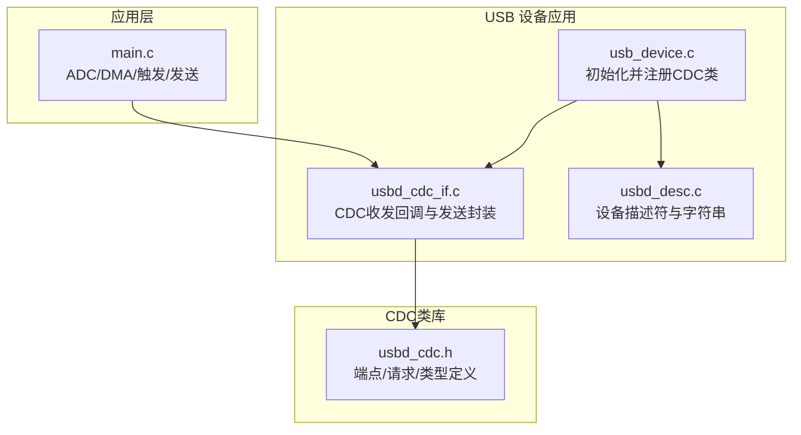
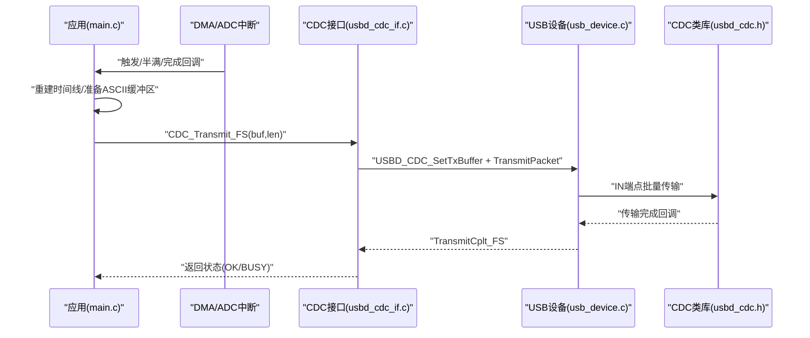
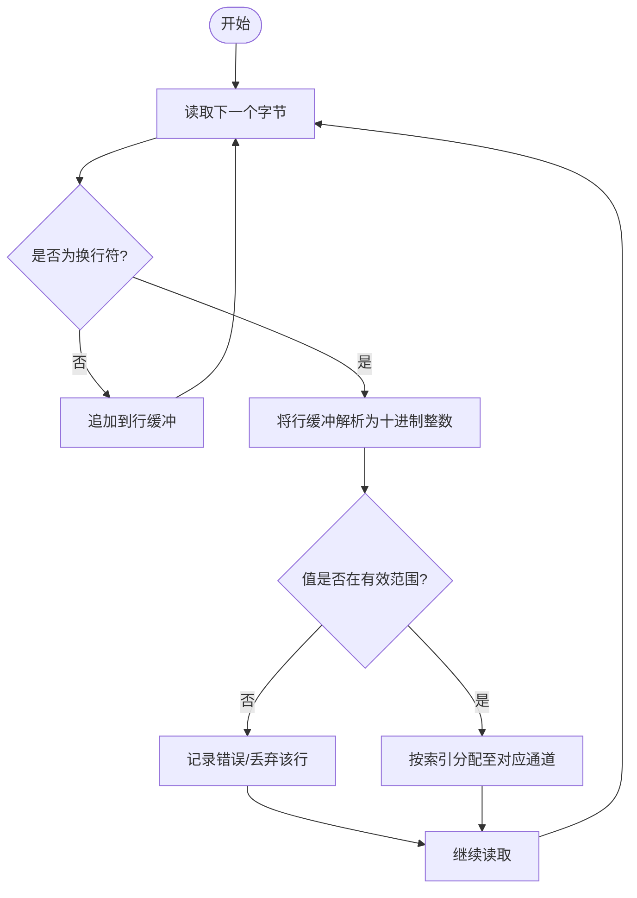
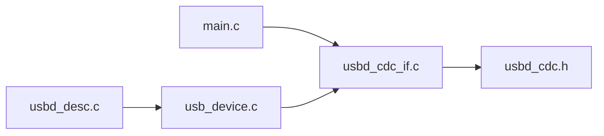

# 通信协议格式

<cite>
**本文引用的文件列表**
- [main.c](file://Core/Src/main.c)
- [usbd_cdc_if.c](file://USB_Device/App/usbd_cdc_if.c)
- [usbd_cdc_if.h](file://USB_Device/App/usbd_cdc_if.h)
- [usb_device.c](file://USB_Device/App/usb_device.c)
- [usbd_desc.c](file://USB_Device/App/usbd_desc.c)
- [usbd_cdc.h](file://Middlewares/ST/STM32_USB_Device_Library/Class/CDC/Inc/usbd_cdc.h)
</cite>

## 目录
1. [简介](#简介)
2. [项目结构](#项目结构)
3. [核心组件](#核心组件)
4. [架构总览](#架构总览)
5. [详细组件分析](#详细组件分析)
6. [依赖关系分析](#依赖关系分析)
7. [性能与吞吐特性](#性能与吞吐特性)
8. [故障排查指南](#故障排查指南)
9. [结论](#结论)
10. [附录：协议规范与对接要点](#附录协议规范与对接要点)

## 简介
本技术文档围绕基于 STM32G4 的 USB CDC（虚拟串口）设备，系统化阐述其 ASCII 文本协议格式、ADC 数据编码方式、行终止符处理、波特率配置与协商流程，并提供解析算法与上位机对接指南。同时给出数据完整性校验与错误检测建议，以及面向初学者的串口基础与面向高级开发者的二进制优化扩展方案。

## 项目结构
本项目采用分层组织：应用层在 Core/Src/main.c 中实现 ADC 采集、触发与数据打包；USB 设备栈与应用接口位于 USB_Device/App 下；CDC 类库定义位于 Middlewares/ST/STM32_USB_Device_Library/Class/CDC。

图表来源
- [main.c:219-290](file://Core/Src/main.c#L219-L290)
- [usb_device.c:66-88](file://USB_Device/App/usb_device.c#L66-L88)
- [usbd_cdc_if.c:138-145](file://USB_Device/App/usbd_cdc_if.c#L138-L145)
- [usbd_desc.c:132-141](file://USB_Device/App/usbd_desc.c#L132-L141)
- [usbd_cdc.h:44-80](file://Middlewares/ST/STM32_USB_Device_Library/Class/CDC/Inc/usbd_cdc.h#L44-L80)

章节来源
- [main.c:219-290](file://Core/Src/main.c#L219-L290)
- [usb_device.c:66-88](file://USB_Device/App/usb_device.c#L66-L88)
- [usbd_cdc_if.c:138-145](file://USB_Device/App/usbd_cdc_if.c#L138-L145)
- [usbd_desc.c:132-141](file://USB_Device/App/usbd_desc.c#L132-L141)
- [usbd_cdc.h:44-80](file://Middlewares/ST/STM32_USB_Device_Library/Class/CDC/Inc/usbd_cdc.h#L44-L80)

## 核心组件
- 应用主循环与数据流：在 main.c 中完成 ADC 双通道交错采样、DMA 环形缓冲、触发事件捕获、时间线重建与 ASCII 文本发送。
- USB CDC 应用接口：在 usbd_cdc_if.c 中提供 CDC_Transmit_FS 封装与接收回调，配合 CDC 控制命令处理框架。
- USB 设备初始化：在 usb_device.c 中完成设备栈初始化、CDC 类注册与接口绑定。
- 设备描述符：在 usbd_desc.c 中定义产品、厂商、序列号等字符串描述符。
- CDC 类库接口：在 usbd_cdc.h 中定义端点、包大小、Line Coding 结构与关键请求常量。

章节来源
- [main.c:178-212](file://Core/Src/main.c#L178-L212)
- [usbd_cdc_if.c:281-293](file://USB_Device/App/usbd_cdc_if.c#L281-L293)
- [usb_device.c:66-88](file://USB_Device/App/usb_device.c#L66-L88)
- [usbd_desc.c:132-141](file://USB_Device/App/usbd_desc.c#L132-L141)
- [usbd_cdc.h:94-124](file://Middlewares/ST/STM32_USB_Device_Library/Class/CDC/Inc/usbd_cdc.h#L94-L124)

## 架构总览
下图展示了从 ADC 采样到 USB CDC 传输的端到端数据流与控制路径。

图表来源
- [main.c:119-149](file://Core/Src/main.c#L119-L149)
- [main.c:178-212](file://Core/Src/main.c#L178-L212)
- [usbd_cdc_if.c:281-293](file://USB_Device/App/usbd_cdc_if.c#L281-L293)
- [usbd_cdc.h:152-157](file://Middlewares/ST/STM32_USB_Device_Library/Class/CDC/Inc/usbd_cdc.h#L152-L157)

## 详细组件分析

### 数据帧与ASCII文本协议
- 帧结构：每行一个采样值，以换行符结尾。无额外帧头/帧尾或分隔符。
- 字段定义：单字段为十进制整数，范围覆盖 0–65535（16位无符号）。
- 行终止符：使用“换行符”作为行结束标志。
- 示例行为：连续输出 N 行，每行包含一个整数字符串后跟换行符。

章节来源
- [main.c:178-212](file://Core/Src/main.c#L178-L212)

### ADC 数据编码与双通道交错
- 采样分辨率：12位，右对齐。
- 双通道交错：DMA 写入 32 位字，低 16 位为 ADC1 采样，高 16 位为 ADC2 采样。
- 时间线重建：按触发位置将环形缓冲展开为线性时序，偶数索引为 ADC1，奇数索引为 ADC2。
- 输出顺序：解码后的 decoded_signal 数组依次输出，即 ADC1[0], ADC2[0], ADC1[1], ADC2[1]...

章节来源
- [main.c:53-69](file://Core/Src/main.c#L53-L69)
- [main.c:156-171](file://Core/Src/main.c#L156-L171)
- [main.c:383-389](file://Core/Src/main.c#L383-L389)

### 行终止符处理机制
- 发送侧：每个样本后追加“换行符”，形成“数值+换行符”的行式文本。
- 接收侧：当前实现未对下行数据进行解析，仅维持接收缓冲与重入队列。

章节来源
- [main.c:204-212](file://Core/Src/main.c#L204-L212)
- [usbd_cdc_if.c:261-268](file://USB_Device/App/usbd_cdc_if.c#L261-L268)

### 波特率配置与通信参数协商
- Line Coding 结构：包含比特率、停止位、校验位、数据位四个字段。
- 控制请求：支持 SET_LINE_CODING 与 GET_LINE_CODING 两类请求。
- 当前实现：控制命令分支存在占位注释，未实际读写内部状态；如需动态生效，需在 CDC_Control_FS 中解析并保存 Line Coding，并在需要时应用到底层驱动。

章节来源
- [usbd_cdc_if.c:205-240](file://USB_Device/App/usbd_cdc_if.c#L205-L240)
- [usbd_cdc.h:94-100](file://Middlewares/ST/STM32_USB_Device_Library/Class/CDC/Inc/usbd_cdc.h#L94-L100)
- [usbd_cdc.h:77-80](file://Middlewares/ST/STM32_USB_Device_Library/Class/CDC/Inc/usbd_cdc.h#L77-L80)

### 协议解析算法（上位机侧）
- 输入：字节流。
- 步骤：
  1) 累积字节直到遇到“换行符”。
  2) 将换行符前的字符序列解析为十进制整数。
  3) 根据交错规则还原双通道序列：偶数位为通道1，奇数位为通道2。
  4) 可选：进行范围校验与异常计数统计。
- 复杂度：O(N)，N 为字节数。

图表来源
- [main.c:178-212](file://Core/Src/main.c#L178-L212)
- [main.c:156-171](file://Core/Src/main.c#L156-L171)

### 上位机对接指南
- 打开端口：选择由 usbd_desc.c 提供的产品名对应的虚拟 COM 端口。
- 参数设置：建议使用标准 8N1（8 数据位、无校验、1 停止位），波特率可设为常用值（如 115200），但注意本实现未动态应用 Line Coding，因此需确保两端一致。
- 读取策略：逐行读取，按换行符分割，解析十进制数值，并按交错规则重组双通道数据。
- 同步与重试：若使用阻塞 I/O，建议在发送失败时轮询重试；参考 CDC_Transmit_FS 的 BUSY 返回语义。

章节来源
- [usbd_desc.c:65-71](file://USB_Device/App/usbd_desc.c#L65-L71)
- [usbd_cdc_if.c:281-293](file://USB_Device/App/usbd_cdc_if.c#L281-L293)

### 数据完整性校验与错误检测
- 当前实现：未内置 CRC/校验和或帧头/帧尾标记。
- 建议方案：
  - 轻量级：在每行末尾附加校验和（如 Luhn 或简单累加和），上位机校验后丢弃异常行。
  - 强一致性：引入帧头/帧尾与长度字段，结合 CRC16/CRC32，提升抗干扰能力。
  - 丢包检测：为每行添加单调递增序号，便于统计丢失与乱序。

章节来源
- [main.c:178-212](file://Core/Src/main.c#L178-L212)

### 面向初学者的串口通信基础
- 概念：串口通过 TX/RX 线逐位传输，常见参数包括波特率、数据位、停止位、校验位。
- 文本模式：以换行符分隔行，适合调试与可视化。
- 注意事项：避免在高频发送时阻塞主循环；合理设置缓冲区大小与超时。

### 面向高级开发者的扩展与二进制优化
- 二进制帧：使用固定长度的二进制帧（例如 2 字节/样点），减少格式化开销，提高吞吐。
- 帧头/长度/载荷/CRC：定义统一帧格式，便于多协议共存与健壮性。
- 批量传输：利用 USB Bulk IN 端点的最大包长（FS 64B）聚合数据，降低协议开销。
- 流控：在上位机侧实现背压与速率匹配，避免溢出。

章节来源
- [usbd_cdc.h:56-66](file://Middlewares/ST/STM32_USB_Device_Library/Class/CDC/Inc/usbd_cdc.h#L56-L66)
- [usbd_cdc_if.c:281-293](file://USB_Device/App/usbd_cdc_if.c#L281-L293)

## 依赖关系分析
- 模块耦合：
  - main.c 依赖 usbd_cdc_if.h 的 CDC_Transmit_FS 接口。
  - usb_device.c 负责注册 CDC 类与接口函数表。
  - usbd_cdc_if.c 实现 CDC 控制与收发回调，依赖 usbd_cdc.h 的类型与常量。
  - usbd_desc.c 提供设备与字符串描述符，供上层枚举使用。
- 潜在环路与风险：
  - 当前为单向数据流（设备→主机），未见循环依赖。
  - 控制命令未实现具体逻辑，后续扩展需注意线程/中断上下文安全。

图表来源
- [main.c:219-290](file://Core/Src/main.c#L219-L290)
- [usb_device.c:66-88](file://USB_Device/App/usb_device.c#L66-L88)
- [usbd_cdc_if.c:138-145](file://USB_Device/App/usbd_cdc_if.c#L138-L145)
- [usbd_desc.c:132-141](file://USB_Device/App/usbd_desc.c#L132-L141)
- [usbd_cdc.h:44-80](file://Middlewares/ST/STM32_USB_Device_Library/Class/CDC/Inc/usbd_cdc.h#L44-L80)

章节来源
- [main.c:219-290](file://Core/Src/main.c#L219-L290)
- [usb_device.c:66-88](file://USB_Device/App/usb_device.c#L66-L88)
- [usbd_cdc_if.c:138-145](file://USB_Device/App/usbd_cdc_if.c#L138-L145)
- [usbd_desc.c:132-141](file://USB_Device/App/usbd_desc.c#L132-L141)
- [usbd_cdc.h:44-80](file://Middlewares/ST/STM32_USB_Device_Library/Class/CDC/Inc/usbd_cdc.h#L44-L80)

## 性能与吞吐特性
- 端点包大小：全速模式下数据端点最大包长为 64 字节，控制端点为 8 字节。
- 发送策略：应用层构建完整输出缓冲后一次性发送，减少多次调用开销。
- 并发与阻塞：CDC_Transmit_FS 在发送忙时返回 BUSY，调用方需轮询重试。
- 采样与重建：DMA 环形缓冲与触发定位保证时间线重建的原子性与实时性。

章节来源
- [usbd_cdc.h:56-66](file://Middlewares/ST/STM32_USB_Device_Library/Class/CDC/Inc/usbd_cdc.h#L56-L66)
- [main.c:178-212](file://Core/Src/main.c#L178-L212)
- [usbd_cdc_if.c:281-293](file://USB_Device/App/usbd_cdc_if.c#L281-L293)

## 故障排查指南
- 现象：上位机无法识别虚拟串口
  - 检查设备描述符中的产品字符串是否被正确加载。
- 现象：数据乱码或行不完整
  - 确认上位机行终止符处理与设备一致（换行符）。
  - 检查是否存在截断与重传逻辑。
- 现象：发送卡顿或丢包
  - 检查 CDC_Transmit_FS 返回值，BUSY 时需重试。
  - 评估端点包大小与数据量匹配度。
- 现象：波特率不生效
  - 当前未实现 Line Coding 应用逻辑，需补充 CDC_Control_FS 中的处理。

章节来源
- [usbd_desc.c:65-71](file://USB_Device/App/usbd_desc.c#L65-L71)
- [main.c:178-212](file://Core/Src/main.c#L178-L212)
- [usbd_cdc_if.c:281-293](file://USB_Device/App/usbd_cdc_if.c#L281-L293)
- [usbd_cdc_if.c:205-240](file://USB_Device/App/usbd_cdc_if.c#L205-L240)

## 结论
该工程实现了基于 USB CDC 的 ASCII 文本数据传输，具备双通道交错采样与时间线重建能力。协议简洁直观，适合快速开发与调试。为满足生产环境的高可靠与高性能需求，建议引入二进制帧、校验和与完善的 Line Coding 处理，并结合上位机侧的背压与错误恢复机制。

## 附录：协议规范与对接要点

### ASCII 文本协议规范
- 帧格式：一行一个十进制整数，后跟换行符。
- 字段：单个整数字段，取值范围 0–65535。
- 分隔符：换行符用于行结束。
- 示例：每行形如“数值\n”。

章节来源
- [main.c:178-212](file://Core/Src/main.c#L178-L212)

### ADC 数据编码与排列
- 编码：12 位采样值，右对齐，输出为十进制文本。
- 排列：双通道交错，偶数索引为 ADC1，奇数索引为 ADC2。
- 时间线：依据触发位置从环形缓冲重建线性序列。

章节来源
- [main.c:53-69](file://Core/Src/main.c#L53-L69)
- [main.c:156-171](file://Core/Src/main.c#L156-L171)

### 行终止符标准化
- 发送侧：每行末尾追加换行符。
- 接收侧：当前未实现解析，保持接收缓冲与重入队列。

章节来源
- [main.c:204-212](file://Core/Src/main.c#L204-L212)
- [usbd_cdc_if.c:261-268](file://USB_Device/App/usbd_cdc_if.c#L261-L268)

### 波特率与通信参数
- Line Coding 结构：包含比特率、停止位、校验位、数据位。
- 控制请求：SET_LINE_CODING、GET_LINE_CODING。
- 现状：控制命令分支存在但未实现具体逻辑。

章节来源
- [usbd_cdc_if.c:205-240](file://USB_Device/App/usbd_cdc_if.c#L205-L240)
- [usbd_cdc.h:94-100](file://Middlewares/ST/STM32_USB_Device_Library/Class/CDC/Inc/usbd_cdc.h#L94-L100)
- [usbd_cdc.h:77-80](file://Middlewares/ST/STM32_USB_Device_Library/Class/CDC/Inc/usbd_cdc.h#L77-L80)

### 上位机对接要点
- 端口识别：使用产品字符串对应的虚拟 COM 端口。
- 参数建议：8N1，常用波特率（如 115200）。
- 解析策略：按换行符分割，十进制解析，交错重组双通道。
- 错误处理：BUSY 重试、行校验、丢包统计。

章节来源
- [usbd_desc.c:65-71](file://USB_Device/App/usbd_desc.c#L65-L71)
- [usbd_cdc_if.c:281-293](file://USB_Device/App/usbd_cdc_if.c#L281-L293)