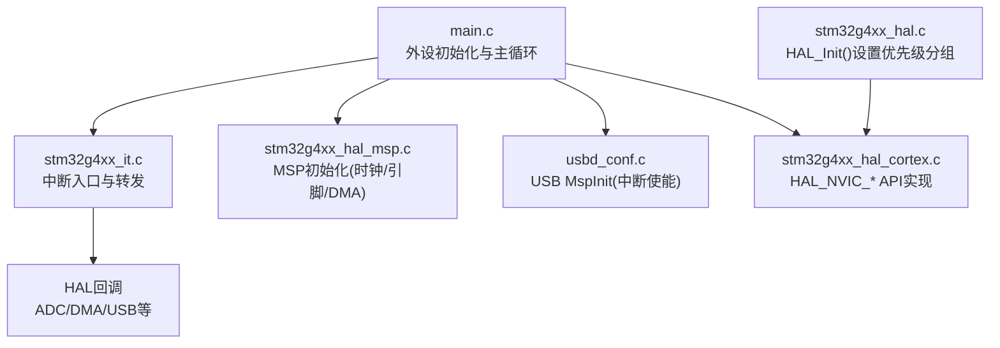
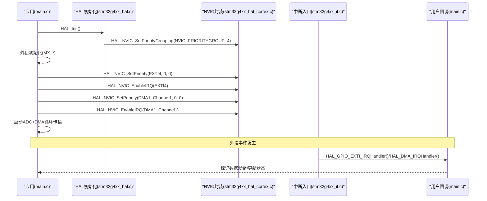
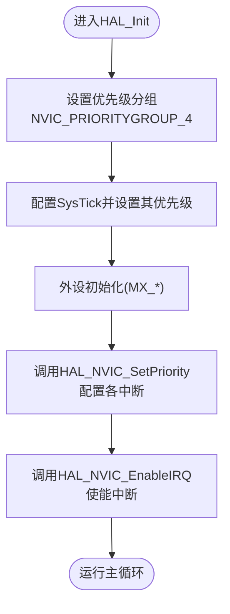
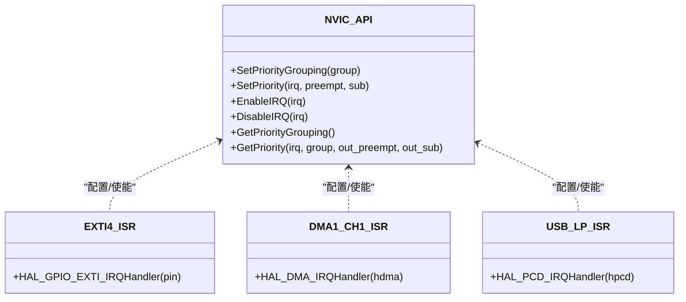
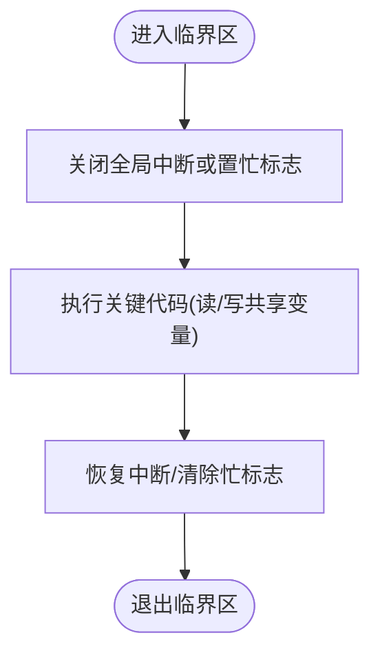
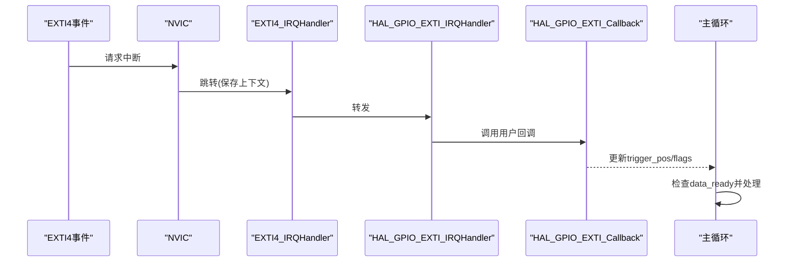
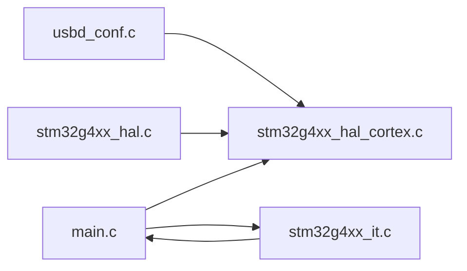

# 中断优先级管理

<cite>
**本文引用的文件列表**
- [Core/Src/main.c](file://Core/Src/main.c)
- [Core/Inc/main.h](file://Core/Inc/main.h)
- [Core/Src/stm32g4xx_it.c](file://Core/Src/stm32g4xx_it.c)
- [Core/Inc/stm32g4xx_it.h](file://Core/Inc/stm32g4xx_it.h)
- [Core/Src/stm32g4xx_hal_msp.c](file://Core/Src/stm32g4xx_hal_msp.c)
- [Drivers/STM32G4xx_HAL_Driver/Src/stm32g4xx_hal.c](file://Drivers/STM32G4xx_HAL_Driver/Src/stm32g4xx_hal.c)
- [Drivers/STM32G4xx_HAL_Driver/Src/stm32g4xx_hal_cortex.c](file://Drivers/STM32G4xx_HAL_Driver/Src/stm32g4xx_hal_cortex.c)
- [USB_Device/Target/usbd_conf.c](file://USB_Device/Target/usbd_conf.c)
</cite>

## 目录
1. [简介](#简介)
2. [项目结构](#项目结构)
3. [核心组件](#核心组件)
4. [架构总览](#架构总览)
5. [详细组件分析](#详细组件分析)
6. [依赖关系分析](#依赖关系分析)
7. [性能考虑](#性能考虑)
8. [故障排查指南](#故障排查指南)
9. [结论](#结论)
10. [附录](#附录)

## 简介
本技术文档围绕Cortex-M4内核的NVIC（嵌套向量中断控制器）在STM32G4系列上的配置与使用，结合本项目实际代码，系统阐述：
- NVIC优先级分组、抢占优先级与子优先级的概念与设置方法
- 项目中关键外设中断（EXTI4外部中断、DMA1通道1中断、USB低优先级中断）的优先级分配策略
- 中断嵌套处理机制与屏蔽技术
- HAL库中NVIC相关API的使用方法
- 中断响应时序分析与延迟优化技巧
- 为初学者提供基础概念，为高级开发者提供实时系统调度优化建议

## 项目结构
本项目采用CubeMX生成的标准工程结构，应用层位于Core目录，HAL驱动位于Drivers目录，USB设备库位于USB_Device目录。中断相关的核心逻辑集中在以下位置：
- 应用主循环与外设初始化：Core/Src/main.c
- 中断服务程序入口与转发：Core/Src/stm32g4xx_it.c
- HAL MSP初始化（含部分中断使能）：Core/Src/stm32g4xx_hal_msp.c
- HAL初始化与默认优先级分组设置：Drivers/STM32G4xx_HAL_Driver/Src/stm32g4xx_hal.c
- HAL Cortex/NVIC封装函数：Drivers/STM32G4xx_HAL_Driver/Src/stm32g4xx_hal_cortex.c
- USB设备库MSP与中断使能：USB_Device/Target/usbd_conf.c

图表来源
- [Core/Src/main.c:219-290](file://Core/Src/main.c#L219-L290)
- [Core/Src/stm32g4xx_it.c:205-242](file://Core/Src/stm32g4xx_it.c#L205-L242)
- [Core/Src/stm32g4xx_hal_msp.c:63-82](file://Core/Src/stm32g4xx_hal_msp.c#L63-L82)
- [Drivers/STM32G4xx_HAL_Driver/Src/stm32g4xx_hal.c:168-180](file://Drivers/STM32G4xx_HAL_Driver/Src/stm32g4xx_hal.c#L168-L180)
- [Drivers/STM32G4xx_HAL_Driver/Src/stm32g4xx_hal_cortex.c:163-196](file://Drivers/STM32G4xx_HAL_Driver/Src/stm32g4xx_hal_cortex.c#L163-L196)
- [USB_Device/Target/usbd_conf.c:70-101](file://USB_Device/Target/usbd_conf.c#L70-L101)

章节来源
- [Core/Src/main.c:219-290](file://Core/Src/main.c#L219-L290)
- [Core/Src/stm32g4xx_it.c:205-242](file://Core/Src/stm32g4xx_it.c#L205-L242)
- [Core/Src/stm32g4xx_hal_msp.c:63-82](file://Core/Src/stm32g4xx_hal_msp.c#L63-L82)
- [Drivers/STM32G4xx_HAL_Driver/Src/stm32g4xx_hal.c:168-180](file://Drivers/STM32G4xx_HAL_Driver/Src/stm32g4xx_hal.c#L168-L180)
- [Drivers/STM32G4xx_HAL_Driver/Src/stm32g4xx_hal_cortex.c:163-196](file://Drivers/STM32G4xx_HAL_Driver/Src/stm32g4xx_hal_cortex.c#L163-L196)
- [USB_Device/Target/usbd_conf.c:70-101](file://USB_Device/Target/usbd_conf.c#L70-L101)

## 核心组件
- NVIC优先级分组与设置
  - HAL在启动时设置全局优先级分组，随后各模块通过HAL_NVIC_SetPriority配置具体中断的抢占与子优先级。
- 关键中断源
  - EXTI4：用于触发采集的外部事件
  - DMA1_Channel1：ADC数据搬运至内存的中断
  - USB_LP：USB全速设备低优先级中断
- 中断回调链
  - 硬件中断 -> 处理器ISR -> HAL层回调 -> 用户回调（如HAL_GPIO_EXTI_Callback、HAL_ADC_ConvHalfCpltCallback等）

章节来源
- [Drivers/STM32G4xx_HAL_Driver/Src/stm32g4xx_hal.c:168-180](file://Drivers/STM32G4xx_HAL_Driver/Src/stm32g4xx_hal.c#L168-L180)
- [Core/Src/main.c:477-506](file://Core/Src/main.c#L477-L506)
- [USB_Device/Target/usbd_conf.c:94-96](file://USB_Device/Target/usbd_conf.c#L94-L96)
- [Core/Src/stm32g4xx_it.c:205-242](file://Core/Src/stm32g4xx_it.c#L205-L242)

## 架构总览
下图展示了从系统启动到中断处理的整体流程，包括优先级分组设置、外设中断使能与回调分发。

图表来源
- [Drivers/STM32G4xx_HAL_Driver/Src/stm32g4xx_hal.c:168-180](file://Drivers/STM32G4xx_HAL_Driver/Src/stm32g4xx_hal.c#L168-L180)
- [Core/Src/main.c:477-506](file://Core/Src/main.c#L477-L506)
- [Core/Src/stm32g4xx_it.c:205-242](file://Core/Src/stm32g4xx_it.c#L205-L242)

## 详细组件分析

### NVIC优先级分组与HAL API
- 优先级分组
  - HAL_Init内部调用HAL_NVIC_SetPriorityGrouping(NVIC_PRIORITYGROUP_4)，表示将全部4位用于抢占优先级，无子优先级。
- 设置与使能
  - HAL_NVIC_SetPriority(IRQn, PreemptPriority, SubPriority)根据当前分组编码后写入NVIC寄存器。
  - HAL_NVIC_EnableIRQ(IRQn)启用指定中断。
- 获取与解码
  - HAL_NVIC_GetPriorityGrouping/HAL_NVIC_GetPriority用于读取与解析优先级。

图表来源
- [Drivers/STM32G4xx_HAL_Driver/Src/stm32g4xx_hal.c:168-180](file://Drivers/STM32G4xx_HAL_Driver/Src/stm32g4xx_hal.c#L168-L180)
- [Drivers/STM32G4xx_HAL_Driver/Src/stm32g4xx_hal.c:255-287](file://Drivers/STM32G4xx_HAL_Driver/Src/stm32g4xx_hal.c#L255-L287)
- [Drivers/STM32G4xx_HAL_Driver/Src/stm32g4xx_hal_cortex.c:163-196](file://Drivers/STM32G4xx_HAL_Driver/Src/stm32g4xx_hal_cortex.c#L163-L196)

章节来源
- [Drivers/STM32G4xx_HAL_Driver/Src/stm32g4xx_hal.c:168-180](file://Drivers/STM32G4xx_HAL_Driver/Src/stm32g4xx_hal.c#L168-L180)
- [Drivers/STM32G4xx_HAL_Driver/Src/stm32g4xx_hal_cortex.c:163-196](file://Drivers/STM32G4xx_HAL_Driver/Src/stm32g4xx_hal_cortex.c#L163-L196)

### 关键中断源与优先级分配策略
- EXTI4外部中断
  - 用途：捕获超声信号上升沿作为触发点
  - 优先级：抢占=0，子=0（最高级别）
  - 目的：确保触发事件第一时间被记录，避免丢失采样窗口
- DMA1通道1中断
  - 用途：ADC数据经DMA搬运完成时触发半满/完成回调
  - 优先级：抢占=0，子=0（最高级别）
  - 目的：保证数据路径及时推进，减少丢样风险
- USB低优先级中断
  - 用途：USB FS设备通信（CDC）
  - 优先级：抢占=0，子=0（最高级别）
  - 说明：尽管命名为“低优先级”，在本工程中仍设置为最高；若需让出CPU给更关键任务，可将其抢占优先级降低

图表来源
- [Core/Src/main.c:477-506](file://Core/Src/main.c#L477-L506)
- [USB_Device/Target/usbd_conf.c:94-96](file://USB_Device/Target/usbd_conf.c#L94-L96)
- [Core/Src/stm32g4xx_it.c:205-242](file://Core/Src/stm32g4xx_it.c#L205-L242)
- [Drivers/STM32G4xx_HAL_Driver/Src/stm32g4xx_hal_cortex.c:163-196](file://Drivers/STM32G4xx_HAL_Driver/Src/stm32g4xx_hal_cortex.c#L163-L196)

章节来源
- [Core/Src/main.c:477-506](file://Core/Src/main.c#L477-L506)
- [USB_Device/Target/usbd_conf.c:94-96](file://USB_Device/Target/usbd_conf.c#L94-L96)
- [Core/Src/stm32g4xx_it.c:205-242](file://Core/Src/stm32g4xx_it.c#L205-L242)

### 中断嵌套与屏蔽技术
- 嵌套规则
  - 当抢占优先级更高（数值更小）的中断发生时，可打断当前正在执行的较低抢占优先级中断。
  - 由于本工程将优先级分组设为4位抢占、0位子优先级，因此仅比较抢占优先级决定嵌套。
- 屏蔽技术
  - 可在临界区临时关闭全局中断或使用__disable_irq/__enable_irq保护共享变量访问。
  - 工程中通过uart_busy标志位避免在USB发送期间误触发EXTI4，属于软件层面的互斥策略。

章节来源
- [Core/Src/main.c:65-70](file://Core/Src/main.c#L65-L70)
- [Core/Src/main.c:91-113](file://Core/Src/main.c#L91-L113)
- [Drivers/STM32G4xx_HAL_Driver/Src/stm32g4xx_hal.c:168-180](file://Drivers/STM32G4xx_HAL_Driver/Src/stm32g4xx_hal.c#L168-L180)

### 中断响应时序与延迟优化
- 典型路径
  - 外设事件 -> NVIC判定优先级 -> 压栈上下文 -> 跳转ISR -> HAL转发 -> 用户回调
- 影响延迟的因素
  - 中断延迟：固定开销（压栈/取向量）
  - 处理时间：ISR内操作复杂度
  - 嵌套深度：高抢占优先级中断会打断低优先级ISR
- 优化建议
  - ISR只做最小必要工作（记录触发位置、置标志），复杂处理放入主循环
  - 使用volatile修饰跨ISR与主循环共享的状态变量
  - 合理设置优先级分组与抢占优先级，确保关键路径不被阻塞
  - 避免在ISR中使用延时或阻塞式IO

图表来源
- [Core/Src/stm32g4xx_it.c:205-214](file://Core/Src/stm32g4xx_it.c#L205-L214)
- [Core/Src/main.c:91-113](file://Core/Src/main.c#L91-L113)
- [Core/Src/main.c:264-289](file://Core/Src/main.c#L264-L289)

章节来源
- [Core/Src/stm32g4xx_it.c:205-214](file://Core/Src/stm32g4xx_it.c#L205-L214)
- [Core/Src/main.c:91-113](file://Core/Src/main.c#L91-L113)
- [Core/Src/main.c:264-289](file://Core/Src/main.c#L264-L289)

### 中断优先级矩阵图与配置示例
- 优先级矩阵（基于当前配置）
  - 所有关键中断（EXTI4、DMA1_Channel1、USB_LP）均设置为抢占=0，子=0，即同等最高优先级
  - 若需要区分，可将USB_LP的抢占优先级降低（例如设为1或更高数值），使其不抢占其他关键路径
- 配置要点（以路径引用代替代码片段）
  - 设置优先级分组：[Drivers/STM32G4xx_HAL_Driver/Src/stm32g4xx_hal.c:168-180](file://Drivers/STM32G4xx_HAL_Driver/Src/stm32g4xx_hal.c#L168-L180)
  - 配置EXTI4优先级与使能：[Core/Src/main.c:504-506](file://Core/Src/main.c#L504-L506)
  - 配置DMA1_Channel1优先级与使能：[Core/Src/main.c:477-479](file://Core/Src/main.c#L477-L479)
  - 配置USB_LP优先级与使能：[USB_Device/Target/usbd_conf.c:94-96](file://USB_Device/Target/usbd_conf.c#L94-L96)

章节来源
- [Drivers/STM32G4xx_HAL_Driver/Src/stm32g4xx_hal.c:168-180](file://Drivers/STM32G4xx_HAL_Driver/Src/stm32g4xx_hal.c#L168-L180)
- [Core/Src/main.c:477-506](file://Core/Src/main.c#L477-L506)
- [USB_Device/Target/usbd_conf.c:94-96](file://USB_Device/Target/usbd_conf.c#L94-L96)

### HAL库中断优先级API使用方法
- 设置优先级分组
  - HAL_NVIC_SetPriorityGrouping(NVIC_PRIORITYGROUP_4)
- 设置中断优先级
  - HAL_NVIC_SetPriority(IRQn_Type IRQn, uint32_t PreemptPriority, uint32_t SubPriority)
- 使能/禁用中断
  - HAL_NVIC_EnableIRQ(IRQn_Type IRQn)
  - HAL_NVIC_DisableIRQ(IRQn_Type IRQn)
- 查询与解码
  - HAL_NVIC_GetPriorityGrouping()
  - HAL_NVIC_GetPriority(IRQn, PriorityGroup, &PreemptPriority, &SubPriority)

章节来源
- [Drivers/STM32G4xx_HAL_Driver/Src/stm32g4xx_hal_cortex.c:163-196](file://Drivers/STM32G4xx_HAL_Driver/Src/stm32g4xx_hal_cortex.c#L163-L196)
- [Drivers/STM32G4xx_HAL_Driver/Src/stm32g4xx_hal_cortex.c:207-230](file://Drivers/STM32G4xx_HAL_Driver/Src/stm32g4xx_hal_cortex.c#L207-L230)
- [Drivers/STM32G4xx_HAL_Driver/Src/stm32g4xx_hal_cortex.c:277-310](file://Drivers/STM32G4xx_HAL_Driver/Src/stm32g4xx_hal_cortex.c#L277-L310)

## 依赖关系分析
- 模块耦合
  - main.c依赖HAL初始化与NVIC API进行中断配置
  - stm32g4xx_it.c作为统一入口，转发到HAL层回调
  - usbd_conf.c在USB MspInit中配置USB中断
- 潜在环路与冲突
  - 无直接循环依赖；但需注意多处设置优先级与使能顺序，确保分组先于具体优先级设置
- 外部依赖
  - CMSIS底层NVIC操作由HAL封装，工程无需直接操作寄存器

图表来源
- [Core/Src/main.c:219-290](file://Core/Src/main.c#L219-L290)
- [Core/Src/stm32g4xx_it.c:205-242](file://Core/Src/stm32g4xx_it.c#L205-L242)
- [USB_Device/Target/usbd_conf.c:70-101](file://USB_Device/Target/usbd_conf.c#L70-L101)
- [Drivers/STM32G4xx_HAL_Driver/Src/stm32g4xx_hal.c:168-180](file://Drivers/STM32G4xx_HAL_Driver/Src/stm32g4xx_hal.c#L168-L180)
- [Drivers/STM32G4xx_HAL_Driver/Src/stm32g4xx_hal_cortex.c:163-196](file://Drivers/STM32G4xx_HAL_Driver/Src/stm32g4xx_hal_cortex.c#L163-L196)

章节来源
- [Core/Src/main.c:219-290](file://Core/Src/main.c#L219-L290)
- [Core/Src/stm32g4xx_it.c:205-242](file://Core/Src/stm32g4xx_it.c#L205-L242)
- [USB_Device/Target/usbd_conf.c:70-101](file://USB_Device/Target/usbd_conf.c#L70-L101)
- [Drivers/STM32G4xx_HAL_Driver/Src/stm32g4xx_hal.c:168-180](file://Drivers/STM32G4xx_HAL_Driver/Src/stm32g4xx_hal.c#L168-L180)
- [Drivers/STM32G4xx_HAL_Driver/Src/stm32g4xx_hal_cortex.c:163-196](file://Drivers/STM32G4xx_HAL_Driver/Src/stm32g4xx_hal_cortex.c#L163-L196)

## 性能考虑
- 中断路径最小化
  - 在EXTI4与DMA回调中仅做轻量操作（记录位置、计数、置标志），数据处理移至主循环
- 临界区保护
  - 使用uart_busy标志避免USB发送期间误触发EXTI4，防止竞争条件
- 优先级调整
  - 若USB吞吐成为瓶颈，可降低USB_LP抢占优先级，避免抢占数据采集路径
- 缓存与总线
  - 保持DMA连续模式与合适的内存对齐，减少总线争用

章节来源
- [Core/Src/main.c:91-113](file://Core/Src/main.c#L91-L113)
- [Core/Src/main.c:264-289](file://Core/Src/main.c#L264-L289)

## 故障排查指南
- 现象：触发丢失或采样窗口错位
  - 检查EXTI4是否被正确使能与配置为上升沿触发
  - 确认EXTI4优先级不低于DMA回调，避免被抢占导致记录滞后
- 现象：数据未就绪或重复处理
  - 检查data_ready与trigger_detected标志位的读写原子性
  - 确认UART发送期间uart_busy标志生效，避免重入
- 现象：USB通信异常
  - 检查USB_LP中断是否使能且未被更高优先级中断长期占用
  - 查看USB PCD回调是否按预期触发

章节来源
- [Core/Src/main.c:91-113](file://Core/Src/main.c#L91-L113)
- [Core/Src/main.c:264-289](file://Core/Src/main.c#L264-L289)
- [Core/Src/stm32g4xx_it.c:205-242](file://Core/Src/stm32g4xx_it.c#L205-L242)

## 结论
本项目基于Cortex-M4的NVIC实现了稳定的中断优先级管理。通过将关键中断（EXTI4、DMA1_Channel1、USB_LP）设置为最高抢占优先级，确保了数据采集与触发的实时性。配合最小化的ISR与主循环处理策略，系统在USB通信与高速ADC采集之间取得了良好平衡。对于更复杂的实时需求，可通过调整优先级分组与抢占优先级进一步优化调度策略。

## 附录
- 快速参考：关键配置路径
  - 优先级分组设置：[Drivers/STM32G4xx_HAL_Driver/Src/stm32g4xx_hal.c:168-180](file://Drivers/STM32G4xx_HAL_Driver/Src/stm32g4xx_hal.c#L168-L180)
  - EXTI4优先级与使能：[Core/Src/main.c:504-506](file://Core/Src/main.c#L504-L506)
  - DMA1_Channel1优先级与使能：[Core/Src/main.c:477-479](file://Core/Src/main.c#L477-L479)
  - USB_LP优先级与使能：[USB_Device/Target/usbd_conf.c:94-96](file://USB_Device/Target/usbd_conf.c#L94-L96)
  - HAL NVIC API定义：[Drivers/STM32G4xx_HAL_Driver/Src/stm32g4xx_hal_cortex.c:163-196](file://Drivers/STM32G4xx_HAL_Driver/Src/stm32g4xx_hal_cortex.c#L163-L196)