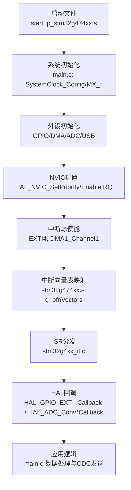
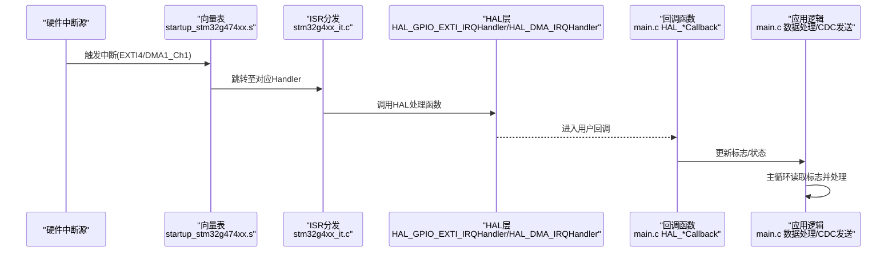
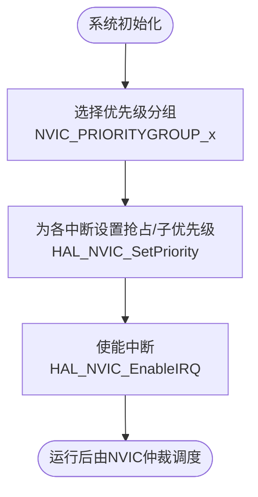
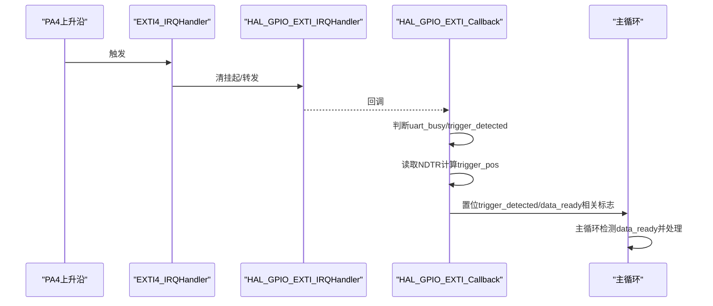
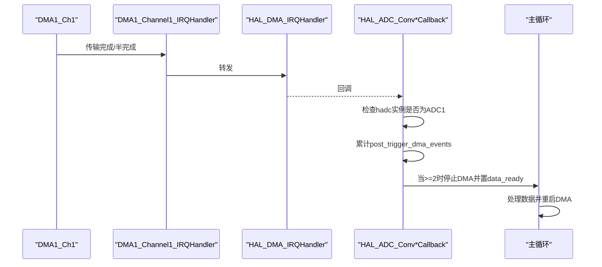
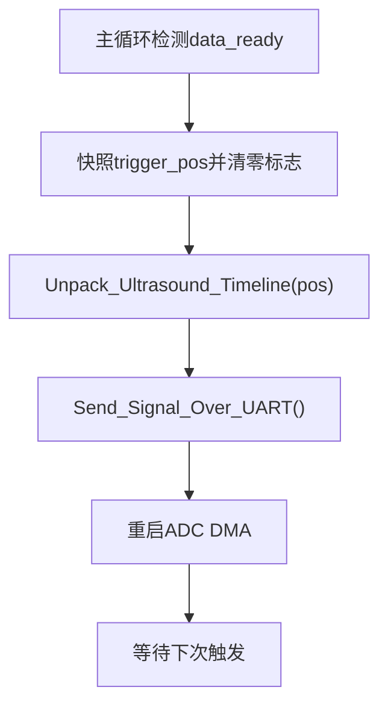
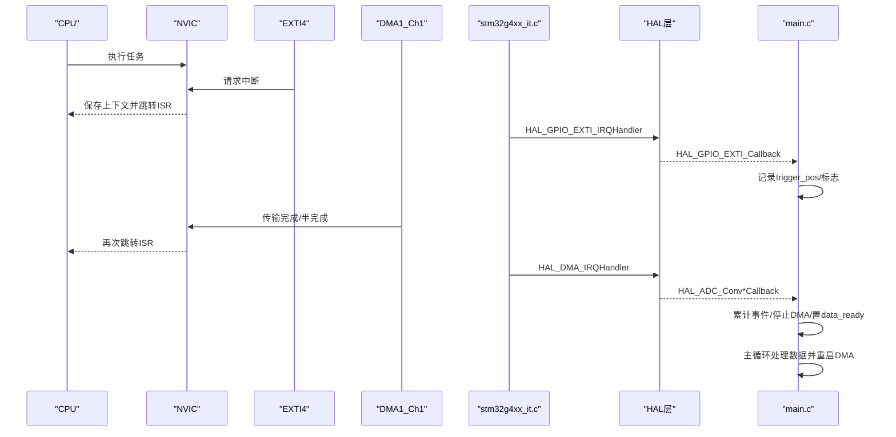
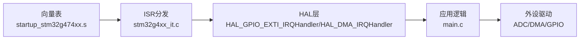

# 中断处理和实时性

<cite>
**本文引用的文件**   
- [Core/Src/stm32g4xx_it.c](file://Core/Src/stm32g4xx_it.c)
- [Core/Inc/stm32g4xx_it.h](file://Core/Inc/stm32g4xx_it.h)
- [Core/Src/main.c](file://Core/Src/main.c)
- [Core/Inc/main.h](file://Core/Inc/main.h)
- [startup_stm32g474xx.s](file://startup_stm32g474xx.s)
- [Drivers/STM32G4xx_HAL_Driver/Inc/stm32g4xx_hal_cortex.h](file://Drivers/STM32G4xx_HAL_Driver/Inc/stm32g4xx_hal_cortex.h)
- [Drivers/STM32G4xx_HAL_Driver/Src/stm32g4xx_hal_adc_ex.c](file://Drivers/STM32G4xx_HAL_Driver/Src/stm32g4xx_hal_adc_ex.c)
- [Drivers/STM32G4xx_HAL_Driver/Src/stm32g4xx_hal_flash.c](file://Drivers/STM32G4xx_HAL_Driver/Src/stm32g4xx_hal_flash.c)
</cite>

## 目录
1. [引言](#引言)
2. [项目结构](#项目结构)
3. [核心组件](#核心组件)
4. [架构总览](#架构总览)
5. [详细组件分析](#详细组件分析)
6. [依赖关系分析](#依赖关系分析)
7. [性能与实时性优化](#性能与实时性优化)
8. [故障排查指南](#故障排查指南)
9. [结论](#结论)
10. [附录：概念与术语](#附录概念与术语)

## 引言
本技术文档围绕该STM32G4项目的中断处理与实时性保证展开，重点覆盖以下方面：
- NVIC中断优先级管理与嵌套机制
- 关键ISR实现：EXTI4（外部触发）与DMA1_Channel1（ADC DMA传输完成）
- 实时性保障：临界区保护、原子操作、中断屏蔽
- 性能优化：最小化中断延迟、降低CPU占用率
- volatile关键字使用与并发访问保护
- 中断响应时序图与优先级矩阵
- 面向初学者的基础概念与面向高级开发者的设计优化策略

## 项目结构
本项目采用CubeMX生成的标准分层结构：
- Core/Src 与 Core/Inc：应用主循环、中断服务程序、外设初始化
- Drivers/STM32G4xx_HAL_Driver：HAL驱动层（Cortex、ADC、DMA等）
- startup_stm32g474xx.s：向量表与复位入口

图表来源
- [startup_stm32g474xx.s:133-200](file://startup_stm32g474xx.s#L133-L200)
- [Core/Src/main.c:226-255](file://Core/Src/main.c#L226-L255)
- [Core/Src/stm32g4xx_it.c:202-228](file://Core/Src/stm32g4xx_it.c#L202-L228)

章节来源
- [startup_stm32g474xx.s:133-200](file://startup_stm32g474xx.s#L133-L200)
- [Core/Src/main.c:226-255](file://Core/Src/main.c#L226-L255)
- [Core/Src/stm32g4xx_it.c:202-228](file://Core/Src/stm32g4xx_it.c#L202-L228)

## 核心组件
- 中断服务程序入口与分发：stm32g4xx_it.c
- 应用侧回调与数据通路：main.c（EXTI回调、DMA回调、数据处理与USB CDC输出）
- 外设与NVIC配置：main.c（GPIO EXTI、DMA、ADC多模式、NVIC优先级设置）
- 启动与向量表：startup_stm32g474xx.s
- HAL接口：stm32g4xx_hal_cortex.h（优先级分组）、stm32g4xx_hal_adc_ex.c（多模式DMA启停）

章节来源
- [Core/Src/stm32g4xx_it.c:202-228](file://Core/Src/stm32g4xx_it.c#L202-L228)
- [Core/Src/main.c:469-520](file://Core/Src/main.c#L469-L520)
- [startup_stm32g474xx.s:133-200](file://startup_stm32g474xx.s#L133-L200)
- [Drivers/STM32G4xx_HAL_Driver/Inc/stm32g4xx_hal_cortex.h:87-102](file://Drivers/STM32G4xx_HAL_Driver/Inc/stm32g4xx_hal_cortex.h#L87-L102)
- [Drivers/STM32G4xx_HAL_Driver/Src/stm32g4xx_hal_adc_ex.c:861-980](file://Drivers/STM32G4xx_HAL_Driver/Src/stm32g4xx_hal_adc_ex.c#L861-L980)

## 架构总览
下图展示了从硬件中断到应用处理的完整路径，包括NVIC优先级、向量表映射、HAL回调与应用逻辑。

图表来源
- [startup_stm32g474xx.s:133-200](file://startup_stm32g474xx.s#L133-L200)
- [Core/Src/stm32g4xx_it.c:202-228](file://Core/Src/stm32g4xx_it.c#L202-L228)
- [Core/Src/main.c:91-149](file://Core/Src/main.c#L91-L149)

## 详细组件分析

### 中断优先级管理（NVIC）
- 优先级分组：通过HAL Cortex头文件定义优先级分组常量，用于配置抢占优先级与子优先位数分配。
- 具体配置：在GPIO与DMA初始化中，分别对EXTI4与DMA1_Channel1设置优先级并启用中断。
- 嵌套规则：相同或更低优先级的中断可被更高优先级中断抢占；同优先级按子优先级顺序执行。

图表来源
- [Drivers/STM32G4xx_HAL_Driver/Inc/stm32g4xx_hal_cortex.h:87-102](file://Drivers/STM32G4xx_HAL_Driver/Inc/stm32g4xx_hal_cortex.h#L87-L102)
- [Core/Src/main.c:476-506](file://Core/Src/main.c#L476-L506)

章节来源
- [Drivers/STM32G4xx_HAL_Driver/Inc/stm32g4xx_hal_cortex.h:87-102](file://Drivers/STM32G4xx_HAL_Driver/Inc/stm32g4xx_hal_cortex.h#L87-L102)
- [Core/Src/main.c:476-506](file://Core/Src/main.c#L476-L506)

### EXTI4中断处理流程（外部触发）
- 入口：EXTI4_IRQHandler -> HAL_GPIO_EXTI_IRQHandler -> HAL_GPIO_EXTI_Callback
- 作用：捕获触发时刻的DMA写入位置，记录触发标志，准备后续数据处理窗口。
- 关键点：
  - 快速返回：仅做最小工作（读剩余计数、写volatile标志）。
  - 防抖与重入保护：忽略UART忙期间的触发与重复触发。
  - 时间定位：基于__HAL_DMA_GET_COUNTER计算环形缓冲区中的触发索引。

图表来源
- [Core/Src/stm32g4xx_it.c:202-214](file://Core/Src/stm32g4xx_it.c#L202-L214)
- [Core/Src/main.c:91-113](file://Core/Src/main.c#L91-L113)

章节来源
- [Core/Src/stm32g4xx_it.c:202-214](file://Core/Src/stm32g4xx_it.c#L202-L214)
- [Core/Src/main.c:91-113](file://Core/Src/main.c#L91-L113)

### DMA1_Channel1中断处理流程（ADC DMA）
- 入口：DMA1_Channel1_IRQHandler -> HAL_DMA_IRQHandler(&hdma_adc1) -> ADC HAL回调
- 作用：在Half-Transfer与Transfer-Complete回调中统计事件数，达到阈值后停止DMA并置位数据就绪标志。
- 关键点：
  - 双事件确认：需要HT+TC两个事件确保至少采集到足够的后置样本。
  - 停止与重启：停止当前DMA后，主循环重新开启以等待下一次触发。

图表来源
- [Core/Src/stm32g4xx_it.c:216-228](file://Core/Src/stm32g4xx_it.c#L216-L228)
- [Core/Src/main.c:136-149](file://Core/Src/main.c#L136-L149)
- [Core/Src/main.c:119-131](file://Core/Src/main.c#L119-L131)

章节来源
- [Core/Src/stm32g4xx_it.c:216-228](file://Core/Src/stm32g4xx_it.c#L216-L228)
- [Core/Src/main.c:119-149](file://Core/Src/main.c#L119-L149)

### 应用数据处理与并发保护
- 环形缓冲解包：根据trigger_pos快照将交错ADC1/ADC2数据重组为线性时间线。
- 并发安全：
  - 使用volatile修饰共享标志，避免编译器优化导致的中断/主循环同步问题。
  - 在主循环中先快照trigger_pos并立即清零相关标志，关闭原子性间隙。
  - 使用uart_busy作为互斥门控，防止在USB CDC发送期间误触发。
- 数据传输：构建整块输出缓冲区并通过USB CDC一次性发送，减少多次调用的开销。

图表来源
- [Core/Src/main.c:264-287](file://Core/Src/main.c#L264-L287)
- [Core/Src/main.c:156-171](file://Core/Src/main.c#L156-L171)
- [Core/Src/main.c:178-212](file://Core/Src/main.c#L178-L212)

章节来源
- [Core/Src/main.c:264-287](file://Core/Src/main.c#L264-L287)
- [Core/Src/main.c:156-171](file://Core/Src/main.c#L156-L171)
- [Core/Src/main.c:178-212](file://Core/Src/main.c#L178-L212)

### 中断响应时序图（EXTI4 + DMA1_Ch1）

图表来源
- [startup_stm32g474xx.s:133-200](file://startup_stm32g474xx.s#L133-L200)
- [Core/Src/stm32g4xx_it.c:202-228](file://Core/Src/stm32g4xx_it.c#L202-L228)
- [Core/Src/main.c:91-149](file://Core/Src/main.c#L91-L149)

### 优先级矩阵（示例）
说明：以下为基于代码配置的示例矩阵，展示不同优先级组合下的抢占行为。实际数值取决于优先级分组与具体配置。

| 中断源 | 抢占优先级 | 子优先级 | 是否可被更高抢占 | 备注 |
|---|---|---|---|---|
| EXTI4 | 0 | 0 | 是（若有更小的数值） | 外部触发，需快速处理 |
| DMA1_Channel1 | 0 | 0 | 是（若有更小的数值） | ADC DMA传输完成/半完成 |
| SysTick | 默认 | 默认 | 视配置而定 | 系统节拍 |
| USB_LP | 默认 | 默认 | 视配置而定 | USB低优先级中断 |

注意：
- 数值越小，优先级越高。
- 若抢占优先级相同，则按子优先级决定先后；若均相同，则按硬件固定顺序。

章节来源
- [Core/Src/main.c:476-506](file://Core/Src/main.c#L476-L506)
- [Drivers/STM32G4xx_HAL_Driver/Inc/stm32g4xx_hal_cortex.h:87-102](file://Drivers/STM32G4xx_HAL_Driver/Inc/stm32g4xx_hal_cortex.h#L87-L102)

## 依赖关系分析
- 启动与向量表：startup_stm32g474xx.s定义中断向量表，将硬件中断映射到具体Handler。
- ISR分发：stm32g4xx_it.c中的Handler负责调用HAL层函数进行进一步处理。
- HAL层：HAL_GPIO_EXTI_IRQHandler与HAL_DMA_IRQHandler负责外设寄存器操作与回调派发。
- 应用逻辑：main.c实现回调与主循环处理，包含volatile标志、临界区保护与数据重组。

图表来源
- [startup_stm32g474xx.s:133-200](file://startup_stm32g474xx.s#L133-L200)
- [Core/Src/stm32g4xx_it.c:202-228](file://Core/Src/stm32g4xx_it.c#L202-L228)
- [Core/Src/main.c:91-149](file://Core/Src/main.c#L91-L149)

章节来源
- [startup_stm32g474xx.s:133-200](file://startup_stm32g474xx.s#L133-L200)
- [Core/Src/stm32g4xx_it.c:202-228](file://Core/Src/stm32g4xx_it.c#L202-L228)
- [Core/Src/main.c:91-149](file://Core/Src/main.c#L91-L149)

## 性能与实时性优化
- 中断延迟最小化
  - 在ISR中只做最小必要工作（如EXTI回调中仅记录位置与标志），复杂逻辑移至主循环。
  - 使用__HAL_DMA_GET_COUNTER快速获取DMA位置，避免额外计算。
- CPU占用率优化
  - 批量发送：将多个样本组装成一块缓冲区后通过USB CDC一次发送，减少多次调用开销。
  - 非阻塞重试：在CDC发送失败时短暂延时并重试，避免长时间占用CPU。
- 临界区与原子操作
  - 使用volatile确保跨线程（主循环/ISR）可见性。
  - 在主循环中先快照trigger_pos并立即清零标志，关闭原子性间隙。
  - 使用uart_busy作为互斥门控，防止在串口发送期间误触发。
- 中断屏蔽技术
  - 错误处理路径中使用__disable_irq进入不可恢复状态，便于调试。
  - HAL Flash操作中通过PRIMASK临时屏蔽中断，确保关键段原子性。

章节来源
- [Core/Src/main.c:91-113](file://Core/Src/main.c#L91-L113)
- [Core/Src/main.c:178-212](file://Core/Src/main.c#L178-L212)
- [Core/Src/main.c:530-539](file://Core/Src/main.c#L530-L539)
- [Drivers/STM32G4xx_HAL_Driver/Src/stm32g4xx_hal_flash.c:763-777](file://Drivers/STM32G4xx_HAL_Driver/Src/stm32g4xx_hal_flash.c#L763-L777)

## 故障排查指南
- 常见问题
  - 中断未触发：检查NVIC优先级与使能、GPIO EXTI配置、向量表映射。
  - 数据错乱：确认volatile标志的使用与主循环中的快照/清零顺序。
  - 死循环：HardFault/NMI等异常处理函数会进入无限循环，需结合调试器查看堆栈。
- 建议步骤
  - 使用LED或调试输出来标记关键路径（例如在EXTI回调与DMA回调中）。
  - 验证DMA NDTR边界条件，避免remaining==0导致的越界。
  - 在错误处理路径中禁用全局中断，便于定位问题。

章节来源
- [Core/Src/stm32g4xx_it.c:70-140](file://Core/Src/stm32g4xx_it.c#L70-L140)
- [Core/Src/main.c:100-105](file://Core/Src/main.c#L100-L105)
- [Core/Src/main.c:530-539](file://Core/Src/main.c#L530-L539)

## 结论
本项目通过合理的NVIC优先级配置、精简的ISR实现以及主循环的数据处理，实现了对外部触发的高精度采样与可靠传输。volatile标志与临界区保护确保了中断与主循环之间的正确同步。通过批量发送与最小化ISR工作负载，有效降低了中断延迟与CPU占用率。对于扩展场景，建议进一步优化优先级分组与中断嵌套策略，并结合MPU与缓存策略提升整体实时性与稳定性。

## 附录：概念与术语
- NVIC：嵌套向量中断控制器，负责中断优先级与嵌套调度。
- 抢占优先级与子优先级：前者决定能否抢占，后者在同级中断中决定执行顺序。
- 临界区：一段不允许被中断打断的代码区域，通常通过屏蔽中断或原子操作实现。
- volatile：告诉编译器变量可能被外部因素（如ISR）修改，禁止对该变量的优化。
- DMA：直接存储器访问，允许外设与内存之间高效传输数据而不占用CPU。