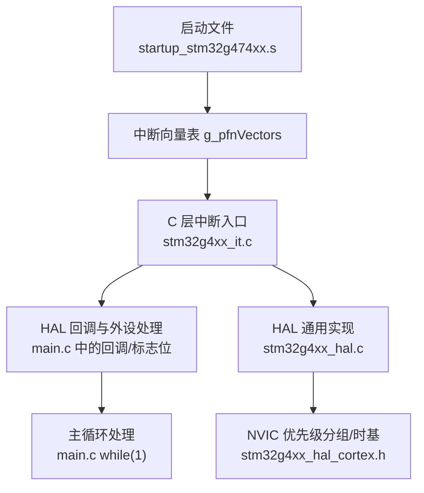
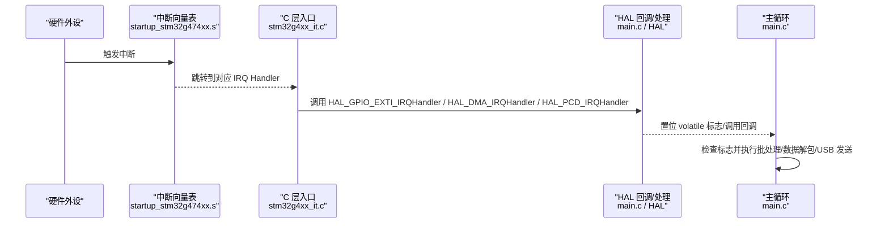
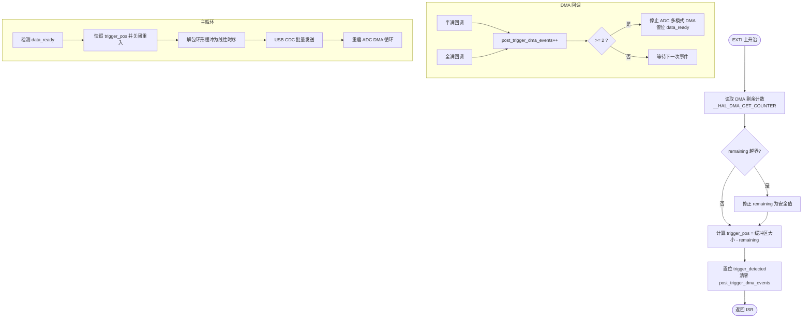
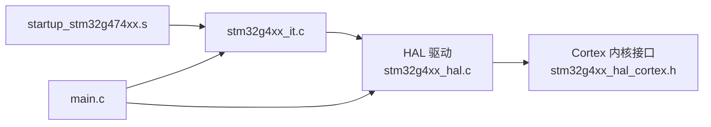

# 中断性能优化

<cite>
**本文引用的文件**
- [Core/Src/stm32g4xx_it.c](file://Core/Src/stm32g4xx_it.c)
- [Core/Inc/stm32g4xx_it.h](file://Core/Inc/stm32g4xx_it.h)
- [Core/Src/main.c](file://Core/Src/main.c)
- [startup_stm32g474xx.s](file://startup_stm32g474xx.s)
- [Drivers/STM32G4xx_HAL_Driver/Src/stm32g4xx_hal.c](file://Drivers/STM32G4xx_HAL_Driver/Src/stm32g4xx_hal.c)
- [Drivers/STM32G4xx_HAL_Driver/Inc/stm32g4xx_hal_cortex.h](file://Drivers/STM32G4xx_HAL_Driver/Inc/stm32g4xx_hal_cortex.h)
</cite>

## 目录
1. [简介](#简介)
2. [项目结构](#项目结构)
3. [核心组件](#核心组件)
4. [架构总览](#架构总览)
5. [详细组件分析](#详细组件分析)
6. [依赖关系分析](#依赖关系分析)
7. [性能考量与优化策略](#性能考量与优化策略)
8. [故障排查指南](#故障排查指南)
9. [结论](#结论)
10. [附录](#附录)

## 简介
本技术文档围绕 STM32G4 系列的中断性能优化，结合仓库中的实际代码，系统阐述以下主题：
- 中断延迟最小化：中断向量表组织、入口点优化、NVIC 优先级分组与抢占策略
- CPU 占用率优化：中断处理时间控制、主循环效率提升、忙等与阻塞的规避
- DMA 与 CPU 中断协调：减少总线冲突与内存访问开销
- 内联与编译器优化：ISR 函数内联、关键路径精简、编译选项建议
- 批处理与延迟处理：在 ISR 中仅做最小工作，将耗时逻辑下沉到主循环或低优先级任务
- 性能分析与调试：使用 DWT 周期计数器与 ITM 跟踪进行测量与定位瓶颈
- 实战对比：基于本项目 ADC+DMA+EXTI+USB CDC 的数据采集链路，给出可复现的测试方法与前后对比思路

## 项目结构
该工程为基于 STM32CubeMX 生成的应用，包含启动文件、HAL 驱动、外设初始化与应用逻辑。与中断性能密切相关的文件包括：
- 启动文件：定义中断向量表与默认异常处理
- 中断服务程序：封装 HAL 回调与外设中断入口
- 主程序：配置时钟、外设、DMA、USB，并在主循环中处理数据
- HAL 层：SysTick、NVIC 优先级分组、延时与时基

图表来源
- [startup_stm32g474xx.s:129-253](file://startup_stm32g474xx.s#L129-L253)
- [Core/Src/stm32g4xx_it.c:195-247](file://Core/Src/stm32g4xx_it.c#L195-L247)
- [Core/Src/main.c:219-290](file://Core/Src/main.c#L219-L290)
- [Drivers/STM32G4xx_HAL_Driver/Src/stm32g4xx_hal.c:148-185](file://Drivers/STM32G4xx_HAL_Driver/Src/stm32g4xx_hal.c#L148-L185)
- [Drivers/STM32G4xx_HAL_Driver/Inc/stm32g4xx_hal_cortex.h:87-102](file://Drivers/STM32G4xx_HAL_Driver/Inc/stm32g4xx_hal_cortex.h#L87-L102)

章节来源
- [startup_stm32g474xx.s:129-253](file://startup_stm32g474xx.s#L129-L253)
- [Core/Src/stm32g4xx_it.c:195-247](file://Core/Src/stm32g4xx_it.c#L195-L247)
- [Core/Src/main.c:219-290](file://Core/Src/main.c#L219-L290)
- [Drivers/STM32G4xx_HAL_Driver/Src/stm32g4xx_hal.c:148-185](file://Drivers/STM32G4xx_HAL_Driver/Src/stm32g4xx_hal.c#L148-L185)
- [Drivers/STM32G4xx_HAL_Driver/Inc/stm32g4xx_hal_cortex.h:87-102](file://Drivers/STM32G4xx_HAL_Driver/Inc/stm32g4xx_hal_cortex.h#L87-L102)

## 核心组件
- 中断向量表与默认处理器：由启动文件提供，所有未实现的 IRQ 指向默认死循环处理器，避免悬空入口
- 外设中断入口：EXTI4、DMA1_Channel1、USB_LP 等入口统一调用 HAL 层处理函数，保持 ISR 极简
- 主循环与标志位：通过 volatile 标志位与临界区保护，在主循环中完成数据解包与 USB 发送
- HAL 时基与 NVIC：HAL_Init 设置优先级分组与 SysTick；SysTick_Handler 调用 HAL_IncTick 推进时间

章节来源
- [startup_stm32g474xx.s:129-253](file://startup_stm32g474xx.s#L129-L253)
- [Core/Src/stm32g4xx_it.c:205-242](file://Core/Src/stm32g4xx_it.c#L205-L242)
- [Core/Src/main.c:219-290](file://Core/Src/main.c#L219-L290)
- [Drivers/STM32G4xx_HAL_Driver/Src/stm32g4xx_hal.c:148-185](file://Drivers/STM32G4xx_HAL_Driver/Src/stm32g4xx_hal.c#L148-L185)

## 架构总览
下图展示了从硬件中断到应用处理的完整路径，以及关键优化点（如 ISR 最小化、主循环批处理、DMA 半满/全满回调协同）。

图表来源
- [startup_stm32g474xx.s:129-253](file://startup_stm32g474xx.s#L129-L253)
- [Core/Src/stm32g4xx_it.c:205-242](file://Core/Src/stm32g4xx_it.c#L205-L242)
- [Core/Src/main.c:91-149](file://Core/Src/main.c#L91-L149)
- [Core/Src/main.c:259-290](file://Core/Src/main.c#L259-L290)

## 详细组件分析

### 中断向量表与入口点优化
- 向量表位于启动文件，按 Cortex-M 规范排列，确保异常与外设中断快速跳转
- 未使用的 IRQ 均弱引用至 Default_Handler，避免意外进入未定义行为
- 入口点优化要点：
  - 入口函数尽量短小，只做状态读取与标志置位，复杂逻辑下沉到主循环
  - 使用 __attribute__((interrupt)) 或 CMSIS 约定名称，保证链接器正确绑定
  - 对热点中断（如 DMA）可在必要时使用 Thumb-2 紧凑指令与寄存器局部变量减少栈操作

章节来源
- [startup_stm32g474xx.s:129-253](file://startup_stm32g474xx.s#L129-L253)
- [Core/Src/stm32g4xx_it.c:205-242](file://Core/Src/stm32g4xx_it.c#L205-L242)

### EXTI 触发与 DMA 协同（ADC 采样链路）
- EXTI4 作为触发源，在 ISR 中读取 DMA 剩余计数以精确定位环形缓冲写入位置，随后置位“已触发”标志
- DMA 半满/全满回调用于统计事件数，达到阈值后停止 ADC 多模式 DMA 并置位“数据就绪”标志
- 主循环捕获快照、解包环形缓冲为线性时序、通过 USB CDC 批量发送

图表来源
- [Core/Src/main.c:91-149](file://Core/Src/main.c#L91-L149)
- [Core/Src/main.c:156-212](file://Core/Src/main.c#L156-L212)
- [Core/Src/main.c:259-290](file://Core/Src/main.c#L259-L290)

章节来源
- [Core/Src/main.c:91-149](file://Core/Src/main.c#L91-L149)
- [Core/Src/main.c:156-212](file://Core/Src/main.c#L156-L212)
- [Core/Src/main.c:259-290](file://Core/Src/main.c#L259-L290)

### DMA 中断与 CPU 中断协调
- DMA1_Channel1 中断入口直接转发至 HAL_DMA_IRQHandler，避免重复判断与分支
- 通过半满/全满回调计数，确保至少两个事件到达后再停止采集，降低误判风险
- 主循环中采用“快照 + 锁”的方式避免与 ISR 竞争，减少临界区长度

章节来源
- [Core/Src/stm32g4xx_it.c:219-228](file://Core/Src/stm32g4xx_it.c#L219-L228)
- [Core/Src/main.c:119-149](file://Core/Src/main.c#L119-L149)
- [Core/Src/main.c:264-287](file://Core/Src/main.c#L264-L287)

### USB 低优先级中断
- USB_LP_IRQHandler 转发至 HAL_PCD_IRQHandler，遵循 HAL 标准流程
- 主循环在发送前设置 uart_busy 标志，屏蔽 EXTI 触发，防止回声干扰

章节来源
- [Core/Src/stm32g4xx_it.c:233-242](file://Core/Src/stm32g4xx_it.c#L233-L242)
- [Core/Src/main.c:178-212](file://Core/Src/main.c#L178-L212)

### SysTick 与时基
- HAL_Init 设置 NVIC 优先级分组与 SysTick 时基
- SysTick_Handler 调用 HAL_IncTick 推进全局 tick，供延时与超时使用

章节来源
- [Drivers/STM32G4xx_HAL_Driver/Src/stm32g4xx_hal.c:148-185](file://Drivers/STM32G4xx_HAL_Driver/Src/stm32g4xx_hal.c#L148-L185)
- [Core/Src/stm32g4xx_it.c:184-193](file://Core/Src/stm32g4xx_it.c#L184-L193)

## 依赖关系分析
- 启动文件提供向量表与默认处理器，被链接器映射到固定地址
- stm32g4xx_it.c 依赖 HAL 提供的 GPIO/DMA/PCD 处理函数
- main.c 依赖 HAL 初始化、DMA/ADC/USB 配置与回调
- HAL 层依赖 CMSIS 内核接口与 NVIC 寄存器

图表来源
- [startup_stm32g474xx.s:129-253](file://startup_stm32g474xx.s#L129-L253)
- [Core/Src/stm32g4xx_it.c:195-247](file://Core/Src/stm32g4xx_it.c#L195-L247)
- [Core/Src/main.c:219-290](file://Core/Src/main.c#L219-L290)
- [Drivers/STM32G4xx_HAL_Driver/Src/stm32g4xx_hal.c:148-185](file://Drivers/STM32G4xx_HAL_Driver/Src/stm32g4xx_hal.c#L148-L185)
- [Drivers/STM32G4xx_HAL_Driver/Inc/stm32g4xx_hal_cortex.h:87-102](file://Drivers/STM32G4xx_HAL_Driver/Inc/stm32g4xx_hal_cortex.h#L87-L102)

章节来源
- [startup_stm32g474xx.s:129-253](file://startup_stm32g474xx.s#L129-L253)
- [Core/Src/stm32g4xx_it.c:195-247](file://Core/Src/stm32g4xx_it.c#L195-L247)
- [Core/Src/main.c:219-290](file://Core/Src/main.c#L219-L290)
- [Drivers/STM32G4xx_HAL_Driver/Src/stm32g4xx_hal.c:148-185](file://Drivers/STM32G4xx_HAL_Driver/Src/stm32g4xx_hal.c#L148-L185)
- [Drivers/STM32G4xx_HAL_Driver/Inc/stm32g4xx_hal_cortex.h:87-102](file://Drivers/STM32G4xx_HAL_Driver/Inc/stm32g4xx_hal_cortex.h#L87-L102)

## 性能考量与优化策略

### 中断延迟最小化
- 向量表就近放置：确保向量表位于高速存储器区域，减少取指延迟
- 入口点精简：ISR 只读寄存器、置位标志、清中断挂起位，避免浮点运算与动态分配
- 优先级分组与抢占：
  - HAL_Init 设置优先级分组为 4（全部子优先级），适合简单实时场景
  - 若需抢占，可将关键中断（如 DMA/EXTI）设为更高抢占优先级，但需评估嵌套复杂度
- 中断使能顺序：先配置外设与 DMA，再开启中断，避免竞态窗口

章节来源
- [startup_stm32g474xx.s:129-253](file://startup_stm32g474xx.s#L129-L253)
- [Core/Src/stm32g4xx_it.c:205-242](file://Core/Src/stm32g4xx_it.c#L205-L242)
- [Drivers/STM32G4xx_HAL_Driver/Src/stm32g4xx_hal.c:148-185](file://Drivers/STM32G4xx_HAL_Driver/Src/stm32g4xx_hal.c#L148-L185)
- [Drivers/STM32G4xx_HAL_Driver/Inc/stm32g4xx_hal_cortex.h:87-102](file://Drivers/STM32G4xx_HAL_Driver/Inc/stm32g4xx_hal_cortex.h#L87-L102)

### CPU 占用率优化
- 中断处理时间控制：
  - 在 EXTI 回调中仅记录触发时刻与 DMA 位置，不做数据拷贝或格式化
  - 在 DMA 回调中仅计数事件，不执行 I/O
- 主循环效率提升：
  - 使用“快照 + 锁”策略缩短临界区，避免长时间持有共享状态
  - 批量处理：将数据解包与 USB 发送集中在主循环，减少上下文切换
- 避免忙等：
  - 使用标志位驱动主循环，而非轮询外设状态寄存器
  - 仅在必要时使用 HAL_Delay，且不在高频路径中使用

章节来源
- [Core/Src/main.c:91-149](file://Core/Src/main.c#L91-L149)
- [Core/Src/main.c:156-212](file://Core/Src/main.c#L156-L212)
- [Core/Src/main.c:259-290](file://Core/Src/main.c#L259-L290)

### DMA 与 CPU 中断协调
- 双缓冲/环形缓冲：利用 DMA 循环模式与半满/全满回调，实现零拷贝流水线
- 事件计数与门限：通过两次事件（HT+TC）确认数据完整性，避免截断
- 总线冲突缓解：
  - 将 DMA 目标与源置于不同存储域（如 SRAM1/SRAM2），减少仲裁冲突
  - 避免在 DMA 传输期间频繁访问同一总线上的共享资源

章节来源
- [Core/Src/main.c:119-149](file://Core/Src/main.c#L119-L149)
- [Core/Src/main.c:156-212](file://Core/Src/main.c#L156-L212)

### 内联与编译器优化
- ISR 内联：
  - 对极短路径可使用 static inline 辅助函数（如 LED 控制），减少函数调用开销
  - 注意：在严格实时路径上，过度内联可能增大代码体积，需权衡
- 编译器选项建议：
  - 启用 -O2/-Os 根据需求选择速度或体积优化
  - 开启 Thumb-2 指令集，提高代码密度与执行效率
  - 禁用不必要的调试信息以降低代码尺寸
- 关键路径原子性：
  - 使用 volatile 修饰跨 ISR/主循环共享的标志位
  - 在关键段使用 __disable_irq/__enable_irq 包裹最小代码块，或使用原子读写

章节来源
- [Core/Src/main.c:42-44](file://Core/Src/main.c#L42-L44)
- [Core/Src/main.c:64-70](file://Core/Src/main.c#L64-L70)

### 批处理与延迟处理
- 批处理：
  - 在 DMA 回调中仅累积事件，主循环一次性解包与发送
- 延迟处理：
  - 将耗时逻辑（如字符串格式化、USB 发送）移至主循环或低优先级任务
  - 使用队列或环形缓冲承载中间结果，避免在中断中分配内存

章节来源
- [Core/Src/main.c:156-212](file://Core/Src/main.c#L156-L212)
- [Core/Src/main.c:259-290](file://Core/Src/main.c#L259-L290)

### 性能分析与调试技巧
- DWT 周期计数器：
  - 在关键路径前后读取 DWT->CYCCNT，计算差值评估耗时
  - 适用于比较不同优化策略的效果
- ITM 跟踪：
  - 通过 ITM 端口输出轻量级日志，避免 printf 带来的高开销
  - 结合调试器查看实时轨迹，定位抖动与峰值
- 示波器/逻辑分析仪：
  - 在 EXTI 触发与 LED 翻转处打点，测量端到端延迟
- 基准测试方法：
  - 固定触发频率，统计单位时间内成功采集次数与平均延迟
  - 对比不同优先级分组与是否启用缓存的配置差异

[本节为通用指导，不直接分析具体文件]

### 实际性能测试与对比（方法学）
- 测试环境：
  - 相同硬件与固件版本，仅改变优化项（如优先级分组、内联、批处理）
- 指标：
  - 中断响应延迟（EXTI 到主循环处理开始）
  - 数据处理吞吐（每秒样本数）
  - CPU 占用率（通过 SysTick 或外部计时估算）
- 步骤：
  - 在 EXTI 回调与主循环入口处插入 DWT 计数
  - 运行多次采集，统计均值与方差
  - 记录 USB 发送耗时占比，评估批处理收益

[本节为通用指导，不直接分析具体文件]

## 故障排查指南
- 常见现象与定位：
  - 中断丢失：检查 NVIC 优先级与抢占配置，确认未在高优先级 ISR 中长时间占用
  - 数据不完整：验证 DMA 半满/全满计数逻辑，确保门限正确
  - USB 卡顿：uart_busy 标志是否正确屏蔽 EXTI，避免回声干扰
- 调试手段：
  - 使用 DWT 测量各阶段耗时
  - 使用 ITM 输出关键状态（trigger_pos、post_trigger_dma_events、data_ready）
  - 在错误路径（Error_Handler）加入 LED 指示，便于快速定位

章节来源
- [Core/Src/main.c:178-212](file://Core/Src/main.c#L178-L212)
- [Core/Src/main.c:530-539](file://Core/Src/main.c#L530-L539)

## 结论
通过对中断向量表、入口点、NVIC 优先级、DMA 协同、主循环批处理与内联优化的系统性改进，可以显著降低中断延迟、提升吞吐并稳定 CPU 占用率。结合 DWT 与 ITM 的量化分析，能够在真实应用中持续迭代优化策略，达成高性能与低功耗的平衡。

## 附录
- 相关宏与常量：
  - NVIC 优先级分组：见 HAL 头文件定义
  - SysTick 时基：见 HAL 初始化与 SysTick_Handler
- 参考路径：
  - 中断入口与回调：[Core/Src/stm32g4xx_it.c](file://Core/Src/stm32g4xx_it.c)
  - 应用逻辑与批处理：[Core/Src/main.c](file://Core/Src/main.c)
  - 启动与向量表：[startup_stm32g474xx.s](file://startup_stm32g474xx.s)
  - HAL 通用实现：[Drivers/STM32G4xx_HAL_Driver/Src/stm32g4xx_hal.c](file://Drivers/STM32G4xx_HAL_Driver/Src/stm32g4xx_hal.c)
  - Cortex 配置：[Drivers/STM32G4xx_HAL_Driver/Inc/stm32g4xx_hal_cortex.h](file://Drivers/STM32G4xx_HAL_Driver/Inc/stm32g4xx_hal_cortex.h)