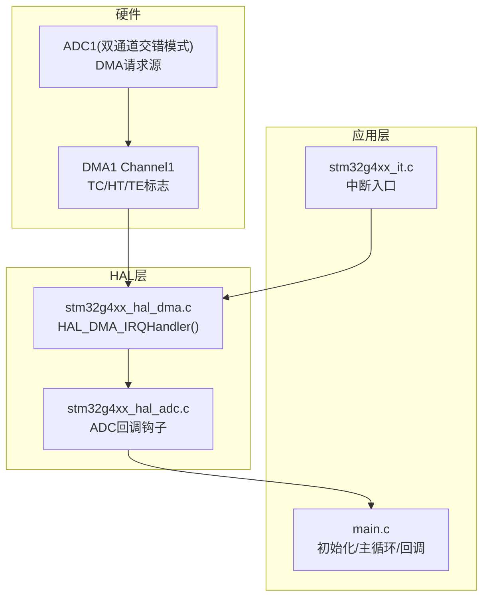
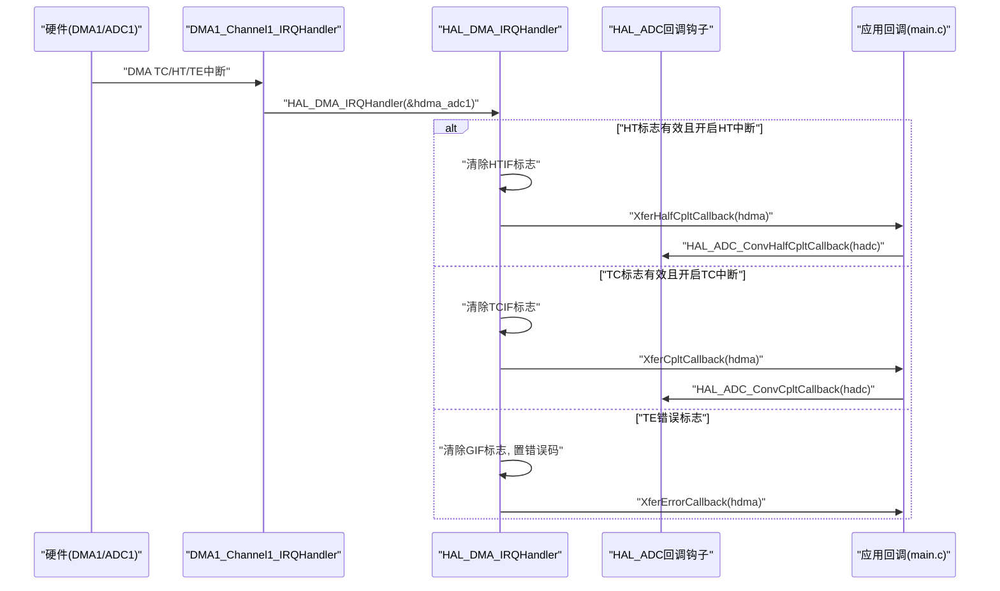
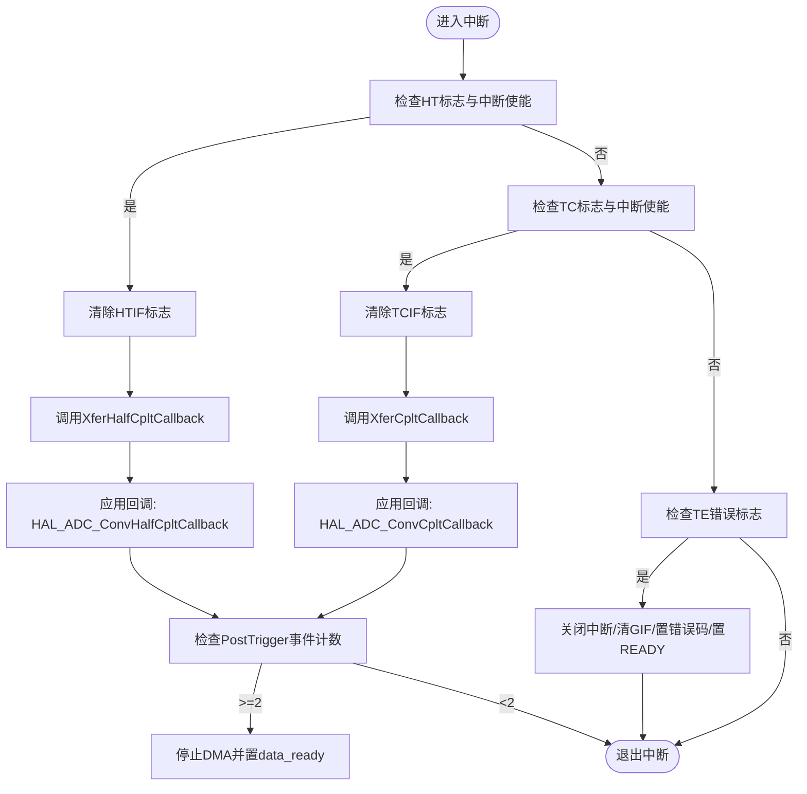
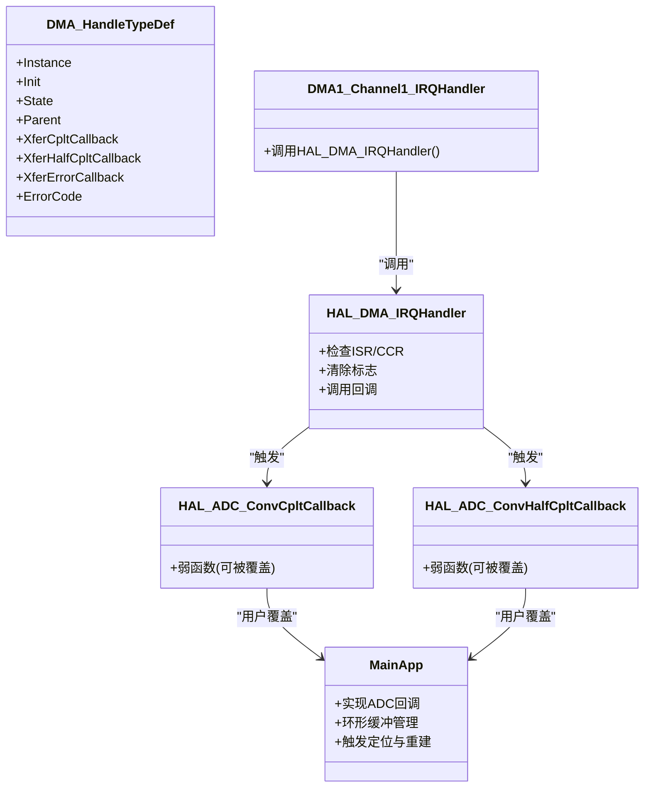

# DMA中断处理

<cite>
**本文引用的文件**   
- [Core/Src/stm32g4xx_it.c](file://Core/Src/stm32g4xx_it.c)
- [Core/Inc/stm32g4xx_it.h](file://Core/Inc/stm32g4xx_it.h)
- [Core/Src/main.c](file://Core/Src/main.c)
- [Drivers/STM32G4xx_HAL_Driver/Inc/stm32g4xx_hal_dma.h](file://Drivers/STM32G4xx_HAL_Driver/Inc/stm32g4xx_hal_dma.h)
- [Drivers/STM32G4xx_HAL_Driver/Src/stm32g4xx_hal_dma.c](file://Drivers/STM32G4xx_HAL_Driver/Src/stm32g4xx_hal_dma.c)
- [Drivers/STM32G4xx_HAL_Driver/Src/stm32g4xx_hal_adc.c](file://Drivers/STM32G4xx_HAL_Driver/Src/stm32g4xx_hal_adc.c)
</cite>

## 目录
1. [简介](#简介)
2. [项目结构](#项目结构)
3. [核心组件](#核心组件)
4. [架构总览](#架构总览)
5. [详细组件分析](#详细组件分析)
6. [依赖关系分析](#依赖关系分析)
7. [性能考虑](#性能考虑)
8. [故障排查指南](#故障排查指南)
9. [结论](#结论)
10. [附录](#附录)

## 简介
本技术文档围绕DMA中断处理展开，重点解析以下主题：
- DMA1_Channel1_IRQHandler中断服务程序的实现原理与调用链
- HAL_DMA_IRQHandler回调机制如何驱动上层应用回调
- ADC数据转换完成中断的处理流程（HAL_ADC_ConvCpltCallback、HAL_ADC_ConvHalfCpltCallback）
- DMA传输完成中断的触发条件与标志位管理
- DMA循环模式下缓冲区切换与数据完整性保证机制
- 中断延迟最小化与数据传输效率优化技巧
- 提供时序图与缓冲区管理策略，兼顾初学者入门与高级开发者的高吞吐采集优化需求

## 项目结构
本项目基于STM32G4系列，使用HAL库进行外设驱动。与DMA中断相关的关键代码分布如下：
- 中断向量与入口：Core/Src/stm32g4xx_it.c
- 用户主循环与应用逻辑（含ADC+DMA配置、回调、缓冲管理）：Core/Src/main.c
- HAL DMA驱动接口与中断处理：Drivers/STM32G4xx_HAL_Driver/Src/stm32g4xx_hal_dma.c
- HAL ADC驱动回调钩子：Drivers/STM32G4xx_HAL_Driver/Src/stm32g4xx_hal_adc.c
- DMA句柄类型定义与常量：Drivers/STM32G4xx_HAL_Driver/Inc/stm32g4xx_hal_dma.h

图表来源 
- [Core/Src/stm32g4xx_it.c:219-228](file://Core/Src/stm32g4xx_it.c#L219-L228)
- [Drivers/STM32G4xx_HAL_Driver/Src/stm32g4xx_hal_dma.c:748-830](file://Drivers/STM32G4xx_HAL_Driver/Src/stm32g4xx_hal_dma.c#L748-L830)
- [Drivers/STM32G4xx_HAL_Driver/Src/stm32g4xx_hal_adc.c:2662-2685](file://Drivers/STM32G4xx_HAL_Driver/Src/stm32g4xx_hal_adc.c#L2662-L2685)
- [Core/Src/main.c:135-149](file://Core/Src/main.c#L135-L149)

章节来源
- [Core/Src/stm32g4xx_it.c:219-228](file://Core/Src/stm32g4xx_it.c#L219-L228)
- [Core/Src/main.c:219-290](file://Core/Src/main.c#L219-L290)
- [Drivers/STM32G4xx_HAL_Driver/Src/stm32g4xx_hal_dma.c:748-830](file://Drivers/STM32G4xx_HAL_Driver/Src/stm32g4xx_hal_dma.c#L748-L830)
- [Drivers/STM32G4xx_HAL_Driver/Src/stm32g4xx_hal_adc.c:2662-2685](file://Drivers/STM32G4xx_HAL_Driver/Src/stm32g4xx_hal_adc.c#L2662-L2685)

## 核心组件
- 中断入口函数：DMA1_Channel1_IRQHandler负责将中断分发到HAL层处理函数
- HAL DMA中断处理：HAL_DMA_IRQHandler检查并清除TC/HT/TE标志，调用注册的回调
- ADC回调钩子：HAL_ADC_ConvCpltCallback与HAL_ADC_ConvHalfCpltCallback作为弱函数，由用户在应用层重写
- 应用层回调：在main.c中实现上述回调，结合环形缓冲与触发事件完成数据采集与后处理

章节来源
- [Core/Src/stm32g4xx_it.c:219-228](file://Core/Src/stm32g4xx_it.c#L219-L228)
- [Drivers/STM32G4xx_HAL_Driver/Src/stm32g4xx_hal_dma.c:748-830](file://Drivers/STM32G4xx_HAL_Driver/Src/stm32g4xx_hal_dma.c#L748-L830)
- [Core/Src/main.c:135-149](file://Core/Src/main.c#L135-L149)

## 架构总览
下图展示了从硬件中断到应用回调的完整链路，以及DMA循环模式下的半满/全满事件流转。

图表来源 
- [Core/Src/stm32g4xx_it.c:219-228](file://Core/Src/stm32g4xx_it.c#L219-L228)
- [Drivers/STM32G4xx_HAL_Driver/Src/stm32g4xx_hal_dma.c:748-830](file://Drivers/STM32G4xx_HAL_Driver/Src/stm32g4xx_hal_dma.c#L748-L830)
- [Core/Src/main.c:135-149](file://Core/Src/main.c#L135-L149)

## 详细组件分析

### DMA1_Channel1_IRQHandler中断服务程序
- 职责：捕获DMA1通道1的中断，直接转发给HAL层统一处理
- 关键点：
  - 外部变量hdma_adc1为DMA句柄，指向DMA1通道1的配置与状态
  - 调用HAL_DMA_IRQHandler(&hdma_adc1)完成标志检测、清除与回调派发
  - 该函数位于stm32g4xx_it.c，遵循CubeMX生成的标准模板

章节来源
- [Core/Src/stm32g4xx_it.c:219-228](file://Core/Src/stm32g4xx_it.c#L219-L228)
- [Core/Inc/stm32g4xx_it.h:59](file://Core/Inc/stm32g4xx_it.h#L59)

### HAL_DMA_IRQHandler回调工作机制
- 功能：根据DMA状态寄存器ISR与通道控制寄存器CCR判断中断源
- 处理分支：
  - 半传输完成（HT）：清除HTIF标志；若非循环模式则关闭HT中断；调用XferHalfCpltCallback
  - 传输完成（TC）：清除TCIF标志；若非循环模式则关闭TC/TE中断并将状态置READY；调用XferCpltCallback
  - 传输错误（TE）：关闭所有中断、清除GIF标志、设置错误码、置状态READY、调用XferErrorCallback
- 注意：
  - 循环模式下，TC/HT中断保持启用，持续产生半满/全满事件
  - 非循环模式下，单次传输完成后自动禁用相关中断并释放锁

章节来源
- [Drivers/STM32G4xx_HAL_Driver/Src/stm32g4xx_hal_dma.c:748-830](file://Drivers/STM32G4xx_HAL_Driver/Src/stm32g4xx_hal_dma.c#L748-L830)

### ADC数据转换完成中断与回调
- HAL ADC提供弱函数HAL_ADC_ConvCpltCallback与HAL_ADC_ConvHalfCpltCallback，供用户覆盖
- 在本项目中，main.c实现了这两个回调，用于：
  - 统计触发后的DMA事件数（HT+TC），确保至少收集到足够的“触发后”样本
  - 当事件计数达到阈值时停止多模式DMA并标记数据就绪
- 回调通过hadc实例区分ADC1/ADC2，仅处理ADC1路径

章节来源
- [Drivers/STM32G4xx_HAL_Driver/Src/stm32g4xx_hal_adc.c:2662-2685](file://Drivers/STM32G4xx_HAL_Driver/Src/stm32g4xx_hal_adc.c#L2662-L2685)
- [Core/Src/main.c:135-149](file://Core/Src/main.c#L135-L149)

### DMA循环模式缓冲区切换与数据完整性
- 环形缓冲设计：
  - adc_raw_buffer为uint32_t数组，低16位存放ADC1采样，高16位存放ADC2采样
  - CIRCULAR_BUFFER_SIZE定义了环形缓冲长度，配合DMA循环模式连续写入
- 触发定位：
  - EXTI上升沿触发时读取__HAL_DMA_GET_COUNTER(&hdma_adc1)得到剩余待写项数，反推当前写入位置trigger_pos
  - 对remaining=0或越界做保护，避免NDTR重载瞬态导致的误判
- 数据完整性保证：
  - 采用“触发后需两个DMA事件（HT+TC）”的策略，确保至少写入足够数量的后续样本
  - 主循环中快照trigger_pos并立即清零触发标志，避免ISR竞争导致的数据不一致
- 线性重建：
  - Unpack_Ultrasound_Timeline按trigger_pos计算起始索引，依次解包偶/奇索引为ADC1/ADC2序列，形成时间线decoded_signal

章节来源
- [Core/Src/main.c:53-70](file://Core/Src/main.c#L53-L70)
- [Core/Src/main.c:91-113](file://Core/Src/main.c#L91-L113)
- [Core/Src/main.c:119-131](file://Core/Src/main.c#L119-L131)
- [Core/Src/main.c:156-171](file://Core/Src/main.c#L156-L171)

### 关键流程图：触发与后处理

图表来源 
- [Drivers/STM32G4xx_HAL_Driver/Src/stm32g4xx_hal_dma.c:748-830](file://Drivers/STM32G4xx_HAL_Driver/Src/stm32g4xx_hal_dma.c#L748-L830)
- [Core/Src/main.c:119-131](file://Core/Src/main.c#L119-L131)

## 依赖关系分析
- 中断入口依赖HAL DMA驱动：DMA1_Channel1_IRQHandler -> HAL_DMA_IRQHandler
- HAL DMA驱动依赖ADC回调钩子：XferCplt/XferHalfCplt回调最终映射到HAL_ADC_ConvCplt/HAL_ADC_ConvHalfCplt
- 应用层回调依赖全局变量与DMA句柄：trigger_detected、post_trigger_dma_events、hdma_adc1等
- 主循环依赖回调标志data_ready执行数据打包与发送

图表来源 
- [Drivers/STM32G4xx_HAL_Driver/Inc/stm32g4xx_hal_dma.h:113-151](file://Drivers/STM32G4xx_HAL_Driver/Inc/stm32g4xx_hal_dma.h#L113-L151)
- [Core/Src/stm32g4xx_it.c:219-228](file://Core/Src/stm32g4xx_it.c#L219-L228)
- [Drivers/STM32G4xx_HAL_Driver/Src/stm32g4xx_hal_dma.c:748-830](file://Drivers/STM32G4xx_HAL_Driver/Src/stm32g4xx_hal_dma.c#L748-L830)
- [Core/Src/main.c:135-149](file://Core/Src/main.c#L135-L149)

章节来源
- [Drivers/STM32G4xx_HAL_Driver/Inc/stm32g4xx_hal_dma.h:113-151](file://Drivers/STM32G4xx_HAL_Driver/Inc/stm32g4xx_hal_dma.h#L113-L151)
- [Core/Src/stm32g4xx_it.c:219-228](file://Core/Src/stm32g4xx_it.c#L219-L228)
- [Drivers/STM32G4xx_HAL_Driver/Src/stm32g4xx_hal_dma.c:748-830](file://Drivers/STM32G4xx_HAL_Driver/Src/stm32g4xx_hal_dma.c#L748-L830)
- [Core/Src/main.c:135-149](file://Core/Src/main.c#L135-L149)

## 性能考虑
- 中断延迟最小化
  - 在中断上下文中只做最小必要操作：记录trigger_pos、更新事件计数、必要时停止DMA
  - 避免在中断中进行复杂计算或阻塞式I/O
- 数据传输效率优化
  - 使用DMA循环模式减少CPU参与，降低上下文切换开销
  - 批量打包输出：在主循环中将解码结果一次性发送到USB CDC，减少多次传输带来的延迟抖动
- 标志位与锁
  - 在非循环模式下，HAL会自动关闭中断并在TC后释放锁；在循环模式下需确保回调内不长时间占用资源
- 缓存与内存对齐
  - 确保adc_raw_buffer与解码缓冲区对齐，提升总线访问效率
- 时钟与优先级
  - 合理设置NVIC优先级，确保DMA与EXTI中断及时响应
  - 系统时钟与外设时钟配置满足采样率要求，避免欠载/过载

[本节为通用指导，不直接分析具体文件]

## 故障排查指南
- 常见问题
  - 未实现HAL_ADC_ConvCpltCallback或HAL_ADC_ConvHalfCpltCallback：需在应用层实现对应回调
  - 环形缓冲越界或trigger_pos异常：检查__HAL_DMA_GET_COUNTER返回值边界保护逻辑
  - 数据丢失或重复：确认DMA循环模式与回调事件计数策略是否一致
- 诊断步骤
  - 检查DMA中断是否使能：NVIC优先级与中断使能配置
  - 观察DMA状态与错误码：HAL_DMA_GetState与HAL_DMA_GetError
  - 验证ADC多模式配置与DMA请求源连接是否正确
- 参考实现路径
  - 中断入口与分发：[Core/Src/stm32g4xx_it.c:219-228](file://Core/Src/stm32g4xx_it.c#L219-L228)
  - HAL DMA中断处理：[Drivers/STM32G4xx_HAL_Driver/Src/stm32g4xx_hal_dma.c:748-830](file://Drivers/STM32G4xx_HAL_Driver/Src/stm32g4xx_hal_dma.c#L748-L830)
  - ADC回调钩子与用户覆盖：[Drivers/STM32G4xx_HAL_Driver/Src/stm32g4xx_hal_adc.c:2662-2685](file://Drivers/STM32G4xx_HAL_Driver/Src/stm32g4xx_hal_adc.c#L2662-L2685), [Core/Src/main.c:135-149](file://Core/Src/main.c#L135-L149)

章节来源
- [Core/Src/stm32g4xx_it.c:219-228](file://Core/Src/stm32g4xx_it.c#L219-L228)
- [Drivers/STM32G4xx_HAL_Driver/Src/stm32g4xx_hal_dma.c:748-830](file://Drivers/STM32G4xx_HAL_Driver/Src/stm32g4xx_hal_dma.c#L748-L830)
- [Drivers/STM32G4xx_HAL_Driver/Src/stm32g4xx_hal_adc.c:2662-2685](file://Drivers/STM32G4xx_HAL_Driver/Src/stm32g4xx_hal_adc.c#L2662-L2685)
- [Core/Src/main.c:135-149](file://Core/Src/main.c#L135-L149)

## 结论
- DMA1_Channel1_IRQHandler作为中断入口，将硬件中断交由HAL_DMA_IRQHandler统一处理
- HAL层依据TC/HT/TE标志与中断使能状态，调用相应回调；在循环模式下持续产生半满/全满事件
- 应用层通过覆盖HAL_ADC_ConvCpltCallback与HAL_ADC_ConvHalfCpltCallback，结合环形缓冲与触发定位，实现可靠的高吞吐数据采集
- 通过最小化中断负载、批量输出与合理的缓冲区管理，可在保证数据完整性的同时优化整体性能

[本节为总结性内容，不直接分析具体文件]

## 附录
- DMA工作原理基础（面向初学者）
  - DMA在不占用CPU的情况下，在存储器与外设之间搬运数据
  - 常用模式包括正常模式与循环模式；循环模式适合连续采集场景
  - 中断标志位包括TC（传输完成）、HT（半传输完成）、TE（传输错误）
- 高吞吐量采集优化方案（面向高级开发者）
  - 使用双缓冲或三缓冲进一步降低主循环处理压力
  - 在回调中仅做轻量级标记，主循环集中处理数据打包与传输
  - 利用DMA的半满事件进行流水线处理，提高吞吐与实时性
  - 调整NVIC优先级与中断屏蔽策略，确保关键路径的低延迟

[本节为概念性内容，不直接分析具体文件]