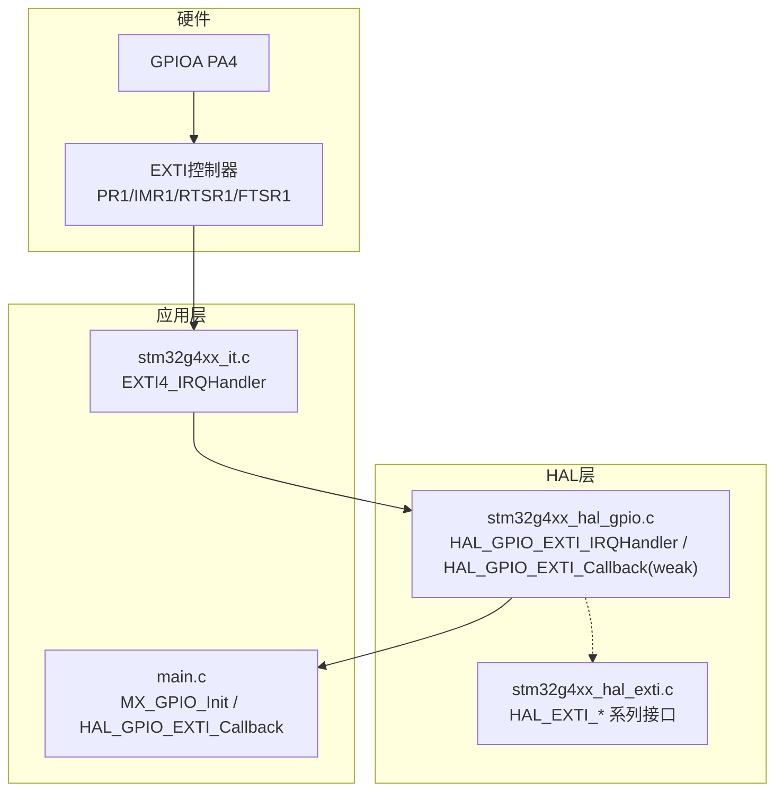
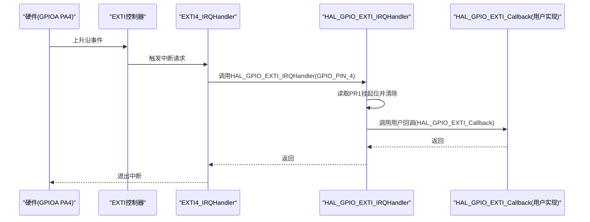
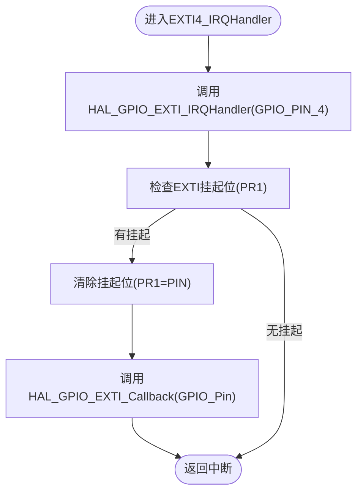
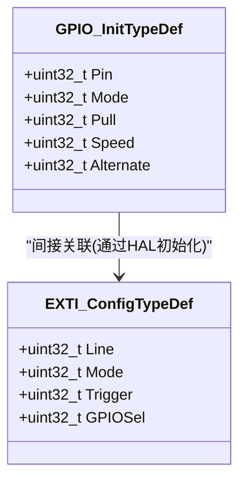
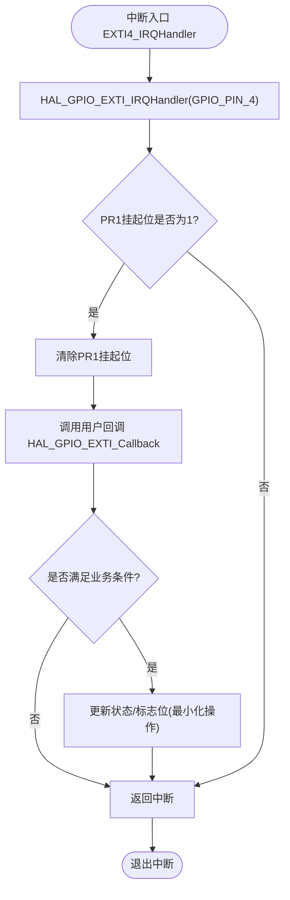
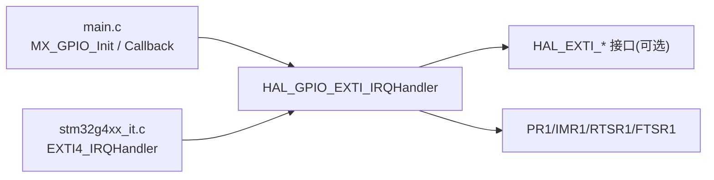

# EXTI外部中断处理

<cite>
**本文引用的文件**   
- [Core/Src/main.c](file://Core/Src/main.c)
- [Core/Inc/main.h](file://Core/Inc/main.h)
- [Core/Src/stm32g4xx_it.c](file://Core/Src/stm32g4xx_it.c)
- [Core/Inc/stm32g4xx_it.h](file://Core/Inc/stm32g4xx_it.h)
- [Drivers/STM32G4xx_HAL_Driver/Inc/stm32g4xx_hal_gpio.h](file://Drivers/STM32G4xx_HAL_Driver/Inc/stm32g4xx_hal_gpio.h)
- [Drivers/STM32G4xx_HAL_Driver/Src/stm32g4xx_hal_gpio.c](file://Drivers/STM32G4xx_HAL_Driver/Src/stm32g4xx_hal_gpio.c)
- [Drivers/STM32G4xx_HAL_Driver/Inc/stm32g4xx_hal_exti.h](file://Drivers/STM32G4xx_HAL_Driver/Inc/stm32g4xx_hal_exti.h)
- [Drivers/STM32G4xx_HAL_Driver/Src/stm32g4xx_hal_exti.c](file://Drivers/STM32G4xx_HAL_Driver/Src/stm32g4xx_hal_exti.c)
</cite>

## 目录
1. [简介](#简介)
2. [项目结构](#项目结构)
3. [核心组件](#核心组件)
4. [架构总览](#架构总览)
5. [详细组件分析](#详细组件分析)
6. [依赖关系分析](#依赖关系分析)
7. [性能考虑](#性能考虑)
8. [故障排查指南](#故障排查指南)
9. [结论](#结论)
10. [附录](#附录)

## 简介
本技术文档围绕EXTI外部中断处理，重点解析PA4引脚（GPIO_PIN_4）的上升沿触发机制、中断服务程序EXTI4_IRQHandler的执行流程、HAL层回调HAL_GPIO_EXTI_IRQHandler与用户回调HAL_GPIO_EXTI_Callback的调用链，以及中断标志位的自动清除机制。同时提供中断配置步骤（引脚模式、触发边沿、NVIC优先级）、防抖策略建议、实时优化技巧与错误处理机制，帮助初学者快速上手并指导高级开发者进行高性能中断处理设计。

## 项目结构
本项目为基于STM32G4系列的工程，使用HAL库实现外设与中断管理。与EXTI相关的关键代码分布在应用层与HAL驱动层：
- 应用层：main.c中完成GPIO初始化、NVIC配置、DMA/ADC启动，以及用户回调HAL_GPIO_EXTI_Callback的实现；stm32g4xx_it.c中定义EXTI4_IRQHandler入口。
- HAL层：stm32g4xx_hal_gpio.c提供HAL_GPIO_EXTI_IRQHandler与弱函数HAL_GPIO_EXTI_Callback；stm32g4xx_hal_exti.c提供通用EXTI处理接口与宏定义。

图表来源
- [Core/Src/main.c:488-520](file://Core/Src/main.c#L488-L520)
- [Core/Src/stm32g4xx_it.c:205-214](file://Core/Src/stm32g4xx_it.c#L205-L214)
- [Drivers/STM32G4xx_HAL_Driver/Src/stm32g4xx_hal_gpio.c:491-514](file://Drivers/STM32G4xx_HAL_Driver/Src/stm32g4xx_hal_gpio.c#L491-L514)
- [Drivers/STM32G4xx_HAL_Driver/Src/stm32g4xx_hal_exti.c:504-531](file://Drivers/STM32G4xx_HAL_Driver/Src/stm32g4xx_hal_exti.c#L504-L531)

章节来源
- [Core/Src/main.c:488-520](file://Core/Src/main.c#L488-L520)
- [Core/Src/stm32g4xx_it.c:205-214](file://Core/Src/stm32g4xx_it.c#L205-L214)
- [Drivers/STM32G4xx_HAL_Driver/Src/stm32g4xx_hal_gpio.c:491-514](file://Drivers/STM32G4xx_HAL_Driver/Src/stm32g4xx_hal_gpio.c#L491-L514)
- [Drivers/STM32G4xx_HAL_Driver/Inc/stm32g4xx_hal_gpio.h:168-197](file://Drivers/STM32G4xx_HAL_Driver/Inc/stm32g4xx_hal_gpio.h#L168-L197)

## 核心组件
- EXTI4_IRQHandler：芯片级中断向量入口，负责调用HAL层统一处理函数。
- HAL_GPIO_EXTI_IRQHandler：HAL层通用中断处理，检查挂起位、清除标志、调用用户回调。
- HAL_GPIO_EXTI_Callback：弱函数，用户需在应用中重写以实现具体逻辑。
- GPIO初始化与NVIC配置：在MX_GPIO_Init中设置PA4为上升沿中断模式，并启用EXTI4_IRQn。

章节来源
- [Core/Src/stm32g4xx_it.c:205-214](file://Core/Src/stm32g4xx_it.c#L205-L214)
- [Drivers/STM32G4xx_HAL_Driver/Src/stm32g4xx_hal_gpio.c:491-514](file://Drivers/STM32G4xx_HAL_Driver/Src/stm32g4xx_hal_gpio.c#L491-L514)
- [Core/Src/main.c:488-520](file://Core/Src/main.c#L488-L520)

## 架构总览
下图展示了从硬件信号到应用回调的完整路径，包括中断向量、HAL层处理与用户回调的关系。

图表来源
- [Core/Src/stm32g4xx_it.c:205-214](file://Core/Src/stm32g4xx_it.c#L205-L214)
- [Drivers/STM32G4xx_HAL_Driver/Src/stm32g4xx_hal_gpio.c:491-514](file://Drivers/STM32G4xx_HAL_Driver/Src/stm32g4xx_hal_gpio.c#L491-L514)

## 详细组件分析

### EXTI4_IRQHandler与HAL调用链
- 入口点：EXTI4_IRQHandler位于stm32g4xx_it.c，直接调用HAL_GPIO_EXTI_IRQHandler(GPIO_PIN_4)。
- HAL处理：HAL_GPIO_EXTI_IRQHandler通过宏__HAL_GPIO_EXTI_GET_IT检查挂起位，若置位则立即用__HAL_GPIO_EXTI_CLEAR_IT清除标志，再调用弱函数HAL_GPIO_EXTI_Callback。
- 用户回调：用户在main.c中实现HAL_GPIO_EXTI_Callback，针对GPIO_PIN_4执行最小化操作（如记录触发位置、设置标志等）。

图表来源
- [Core/Src/stm32g4xx_it.c:205-214](file://Core/Src/stm32g4xx_it.c#L205-L214)
- [Drivers/STM32G4xx_HAL_Driver/Src/stm32g4xx_hal_gpio.c:491-514](file://Drivers/STM32G4xx_HAL_Driver/Src/stm32g4xx_hal_gpio.c#L491-L514)
- [Drivers/STM32G4xx_HAL_Driver/Inc/stm32g4xx_hal_gpio.h:168-197](file://Drivers/STM32G4xx_HAL_Driver/Inc/stm32g4xx_hal_gpio.h#L168-L197)

章节来源
- [Core/Src/stm32g4xx_it.c:205-214](file://Core/Src/stm32g4xx_it.c#L205-L214)
- [Drivers/STM32G4xx_HAL_Driver/Src/stm32g4xx_hal_gpio.c:491-514](file://Drivers/STM32G4xx_HAL_Driver/Src/stm32g4xx_hal_gpio.c#L491-L514)
- [Drivers/STM32G4xx_HAL_Driver/Inc/stm32g4xx_hal_gpio.h:168-197](file://Drivers/STM32G4xx_HAL_Driver/Inc/stm32g4xx_hal_gpio.h#L168-L197)

### GPIO引脚与中断配置过程
- 引脚模式：在MX_GPIO_Init中将PA4配置为GPIO_MODE_IT_RISING（输入+中断+上升沿），上拉/下拉为GPIO_NOPULL。
- 中断使能与优先级：调用HAL_NVIC_SetPriority(EXTI4_IRQn, 0, 0)和HAL_NVIC_EnableIRQ(EXTI4_IRQn)启用并设置优先级。
- 底层行为：HAL_GPIO_Init内部会根据Mode组合写入GPIOx的MODER/EXTICR/IMR1/RTSR1/FTSR1等寄存器，建立GPIO到EXTI线的映射与触发条件。

图表来源
- [Drivers/STM32G4xx_HAL_Driver/Inc/stm32g4xx_hal_gpio.h:47-63](file://Drivers/STM32G4xx_HAL_Driver/Inc/stm32g4xx_hal_gpio.h#L47-L63)
- [Drivers/STM32G4xx_HAL_Driver/Inc/stm32g4xx_hal_exti.h:62-73](file://Drivers/STM32G4xx_HAL_Driver/Inc/stm32g4xx_hal_exti.h#L62-L73)

章节来源
- [Core/Src/main.c:488-520](file://Core/Src/main.c#L488-L520)
- [Drivers/STM32G4xx_HAL_Driver/Inc/stm32g4xx_hal_gpio.h:124-130](file://Drivers/STM32G4xx_HAL_Driver/Inc/stm32g4xx_hal_gpio.h#L124-L130)
- [Drivers/STM32G4xx_HAL_Driver/Inc/stm32g4xx_hal_exti.h:145-154](file://Drivers/STM32G4xx_HAL_Driver/Inc/stm32g4xx_hal_exti.h#L145-L154)

### 中断标志位自动清除机制
- HAL_GPIO_EXTI_IRQHandler在执行时先读取PR1判断是否挂起，随后立即写PR1对应位以清除挂起标志，确保不会重复进入同一中断。
- 该机制由HAL层保证，用户无需在中断中手动清标志。

章节来源
- [Drivers/STM32G4xx_HAL_Driver/Src/stm32g4xx_hal_gpio.c:491-499](file://Drivers/STM32G4xx_HAL_Driver/Src/stm32g4xx_hal_gpio.c#L491-L499)
- [Drivers/STM32G4xx_HAL_Driver/Inc/stm32g4xx_hal_gpio.h:173-181](file://Drivers/STM32G4xx_HAL_Driver/Inc/stm32g4xx_hal_gpio.h#L173-L181)

### 防抖处理策略
- 硬件层面：在PA4前端增加RC低通滤波或施密特触发器，抑制机械抖动或噪声引起的多次翻转。
- 软件层面：在HAL_GPIO_EXTI_Callback中采用“首次触发门控”与“时间窗去抖”策略：
  - 首次触发门控：使用volatile标志防止一次物理事件多次进入回调。
  - 时间窗去抖：记录最近一次有效触发的时间戳，若在短窗口内再次触发则忽略。
- 注意：避免在中断中进行耗时操作（如串口打印、复杂计算），将数据采样与处理移至主循环。

章节来源
- [Core/Src/main.c:91-113](file://Core/Src/main.c#L91-L113)

### 中断处理流程图（含错误处理）

图表来源
- [Core/Src/stm32g4xx_it.c:205-214](file://Core/Src/stm32g4xx_it.c#L205-L214)
- [Drivers/STM32G4xx_HAL_Driver/Src/stm32g4xx_hal_gpio.c:491-514](file://Drivers/STM32G4xx_HAL_Driver/Src/stm32g4xx_hal_gpio.c#L491-L514)

## 依赖关系分析
- 应用层依赖HAL层提供的GPIO与EXTI接口，并通过NVIC配置中断优先级。
- HAL层依赖底层寄存器访问宏与外设基地址，封装了统一的查询与清除逻辑。
- EXTI4_IRQHandler作为唯一入口，解耦了硬件向量与HAL处理，便于扩展与维护。

图表来源
- [Core/Src/main.c:488-520](file://Core/Src/main.c#L488-L520)
- [Core/Src/stm32g4xx_it.c:205-214](file://Core/Src/stm32g4xx_it.c#L205-L214)
- [Drivers/STM32G4xx_HAL_Driver/Src/stm32g4xx_hal_gpio.c:491-514](file://Drivers/STM32G4xx_HAL_Driver/Src/stm32g4xx_hal_gpio.c#L491-L514)
- [Drivers/STM32G4xx_HAL_Driver/Src/stm32g4xx_hal_exti.c:504-531](file://Drivers/STM32G4xx_HAL_Driver/Src/stm32g4xx_hal_exti.c#L504-L531)

章节来源
- [Core/Src/main.c:488-520](file://Core/Src/main.c#L488-L520)
- [Core/Src/stm32g4xx_it.c:205-214](file://Core/Src/stm32g4xx_it.c#L205-L214)
- [Drivers/STM32G4xx_HAL_Driver/Src/stm32g4xx_hal_gpio.c:491-514](file://Drivers/STM32G4xx_HAL_Driver/Src/stm32g4xx_hal_gpio.c#L491-L514)
- [Drivers/STM32G4xx_HAL_Driver/Src/stm32g4xx_hal_exti.c:504-531](file://Drivers/STM32G4xx_HAL_Driver/Src/stm32g4xx_hal_exti.c#L504-L531)

## 性能考虑
- 最小化中断处理时间：
  - 在HAL_GPIO_EXTI_Callback中仅做必要的最小操作（如记录触发位置、置位标志），避免阻塞性操作。
  - 将数据处理、通信传输放在主循环或更低优先级任务中。
- 避免在中断中进行复杂计算：
  - 复杂算法、浮点运算、内存分配、I/O操作应移出中断上下文。
- 减少重入风险：
  - 使用volatile标志与互斥锁（如uart_busy）防止在关键阶段被新中断打断。
- 合理设置NVIC优先级：
  - 根据系统实时性需求调整EXTI与其他外设（如DMA、USB）的优先级，避免高优先级抢占导致的数据竞争。
- DMA与中断协同：
  - 利用DMA半传输/完成回调配合EXTI触发，确保数据完整性与时效性。

[本节为通用性能建议，不直接分析具体文件]

## 故障排查指南
- 现象：中断未触发
  - 检查PA4是否配置为GPIO_MODE_IT_RISING且上拉/下拉正确。
  - 确认NVIC已启用EXTI4_IRQn且优先级设置合理。
  - 验证PR1挂起位是否在预期时刻置位。
- 现象：重复触发或抖动
  - 增加硬件滤波（RC/施密特）。
  - 在回调中加入首次触发门控与时间窗去抖逻辑。
- 现象：中断处理过慢影响系统
  - 精简回调逻辑，将耗时任务迁移至主循环。
  - 使用DMA与双缓冲降低CPU占用。
- 现象：数据竞争或丢失
  - 使用volatile变量同步状态，必要时在主循环中加临界区保护。
  - 结合DMA回调计数确保数据完整后再处理。

章节来源
- [Core/Src/main.c:91-113](file://Core/Src/main.c#L91-L113)
- [Core/Src/main.c:488-520](file://Core/Src/main.c#L488-L520)
- [Drivers/STM32G4xx_HAL_Driver/Src/stm32g4xx_hal_gpio.c:491-514](file://Drivers/STM32G4xx_HAL_Driver/Src/stm32g4xx_hal_gpio.c#L491-L514)

## 结论
通过对EXTI4_IRQHandler与HAL层的深入分析，明确了PA4上升沿中断的触发路径、标志位自动清除机制与用户回调的最佳实践。结合硬件滤波与软件去抖策略，可在保证实时性的前提下提升系统的鲁棒性与稳定性。对于高性能场景，建议进一步结合DMA与时间戳采集，将中断处理时间压缩到最低，并将复杂处理下沉至主循环或RTOS任务。

[本节为总结性内容，不直接分析具体文件]

## 附录
- 关键API与宏参考：
  - HAL_GPIO_EXTI_IRQHandler：通用EXTI中断处理入口。
  - HAL_GPIO_EXTI_Callback：用户回调弱函数，需重写。
  - __HAL_GPIO_EXTI_GET_IT/__HAL_GPIO_EXTI_CLEAR_IT：挂起位读写宏。
  - HAL_EXTI_GetPending/HAL_EXTI_ClearPending：通用EXTI挂起位操作。

章节来源
- [Drivers/STM32G4xx_HAL_Driver/Src/stm32g4xx_hal_gpio.c:491-514](file://Drivers/STM32G4xx_HAL_Driver/Src/stm32g4xx_hal_gpio.c#L491-L514)
- [Drivers/STM32G4xx_HAL_Driver/Inc/stm32g4xx_hal_gpio.h:168-197](file://Drivers/STM32G4xx_HAL_Driver/Inc/stm32g4xx_hal_gpio.h#L168-L197)
- [Drivers/STM32G4xx_HAL_Driver/Src/stm32g4xx_hal_exti.c:539-595](file://Drivers/STM32G4xx_HAL_Driver/Src/stm32g4xx_hal_exti.c#L539-L595)