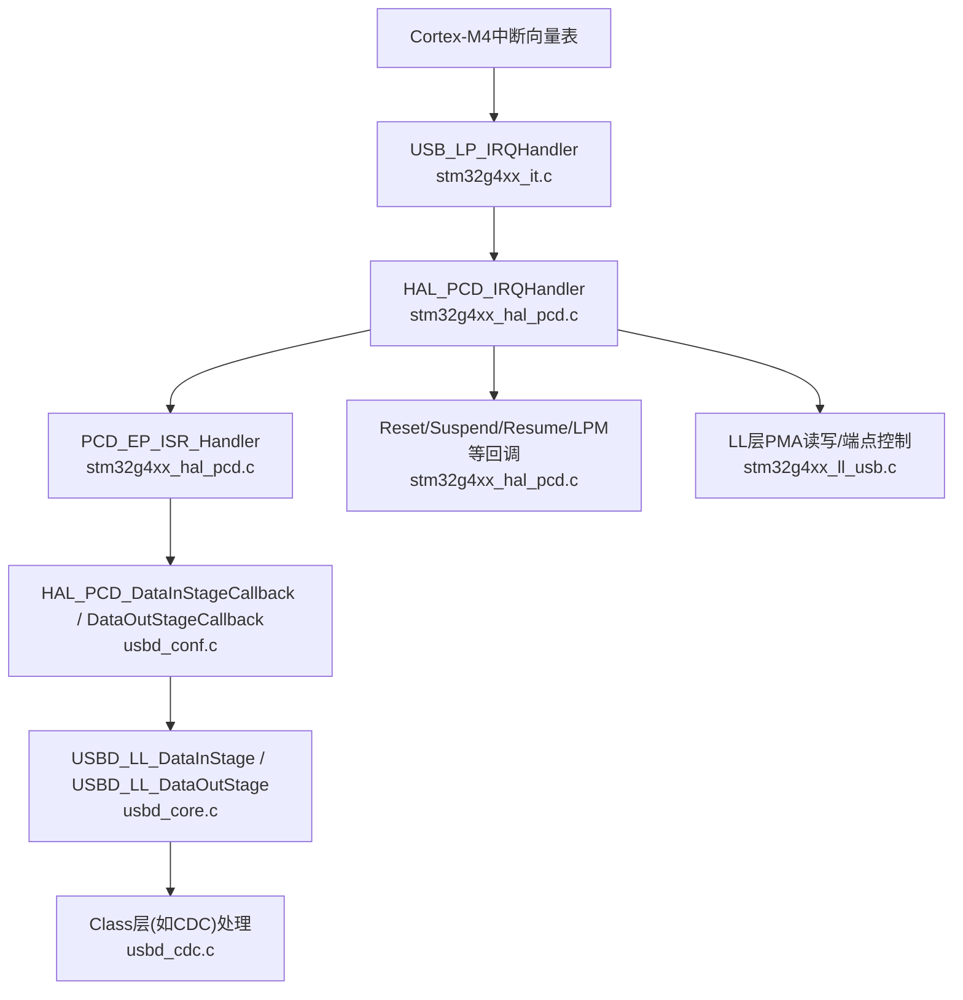
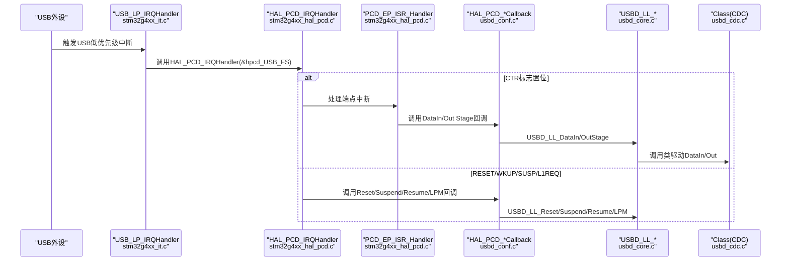
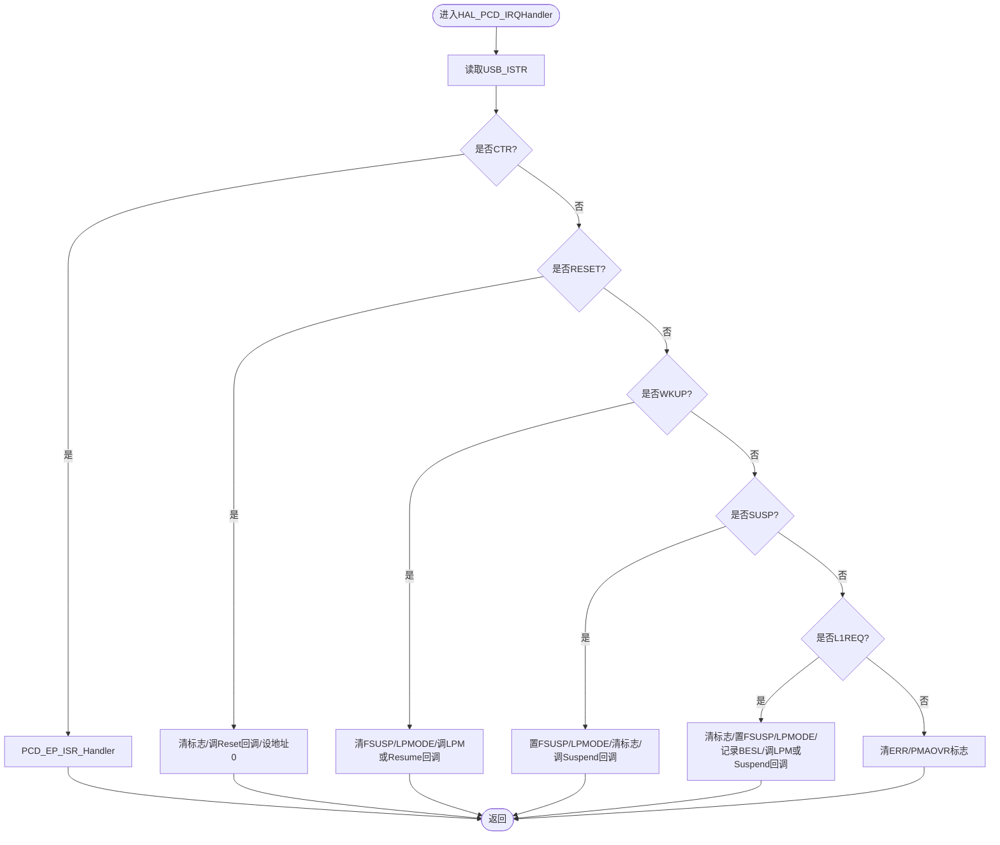
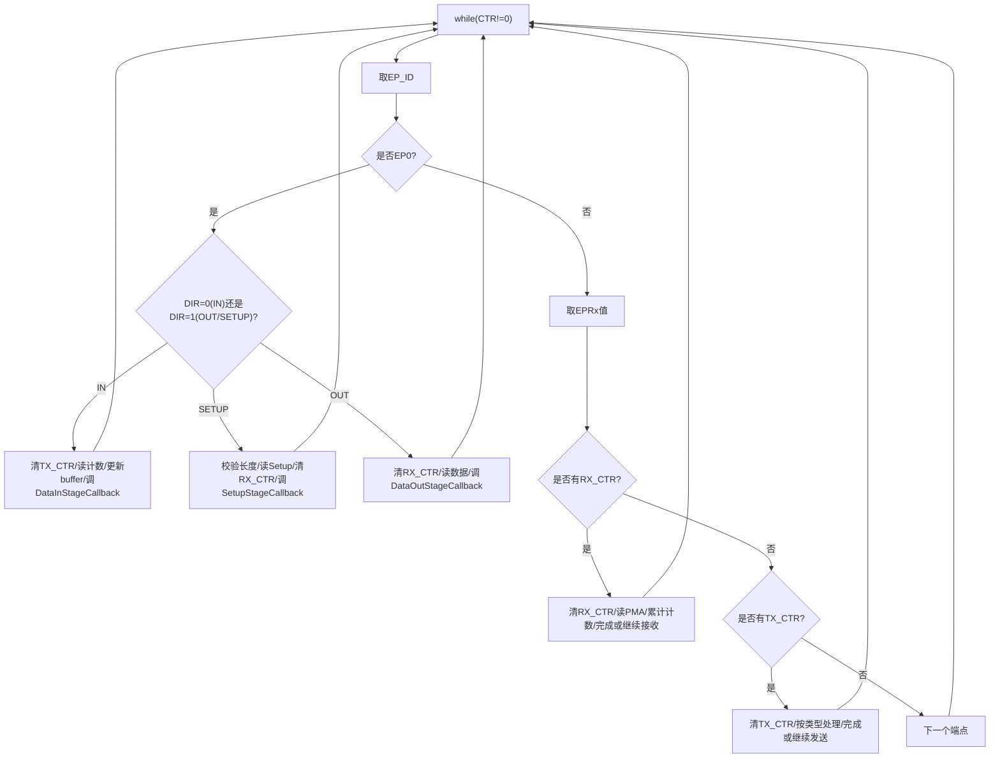
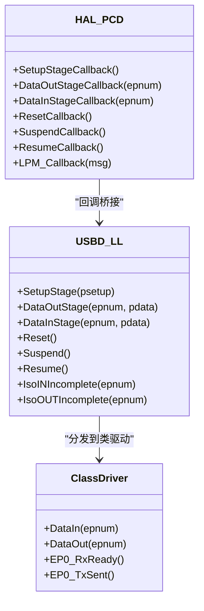
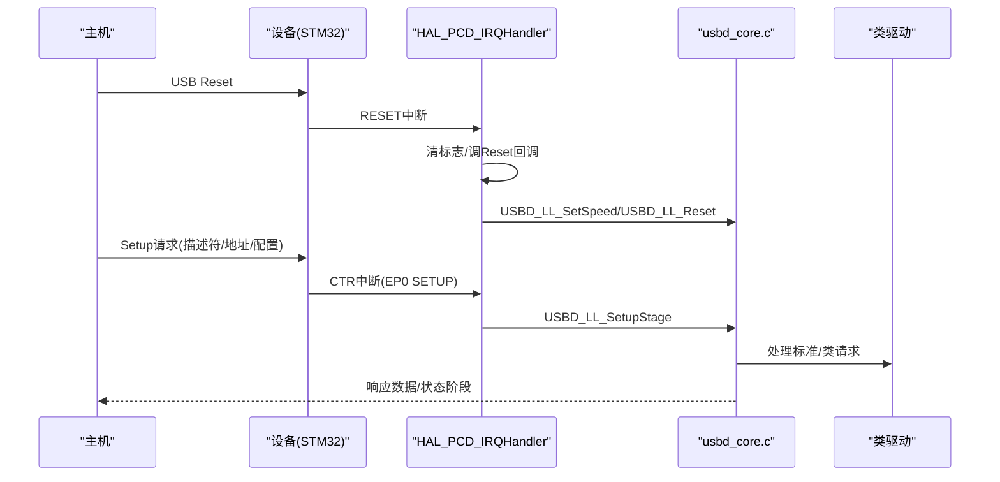
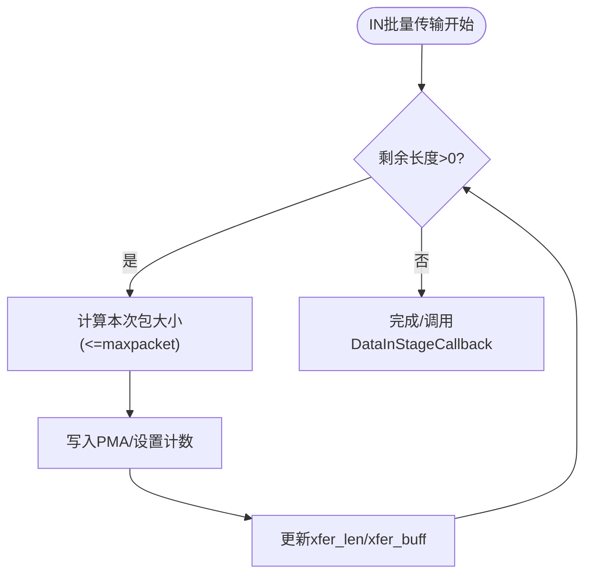
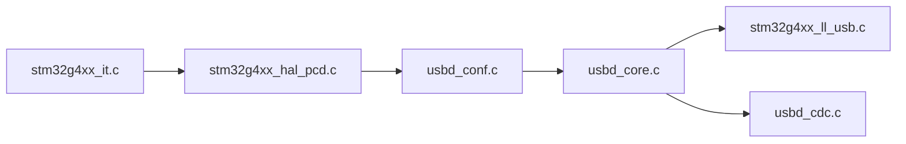

# USB中断处理

<cite>
**本文引用的文件**   
- [stm32g4xx_it.c](file://Core/Src/stm32g4xx_it.c)
- [usbd_conf.c](file://USB_Device/Target/usbd_conf.c)
- [usb_device.c](file://USB_Device/App/usb_device.c)
- [stm32g4xx_hal_pcd.c](file://Drivers/STM32G4xx_HAL_Driver/Src/stm32g4xx_hal_pcd.c)
- [usbd_core.c](file://Middlewares/ST/STM32_USB_Device_Library/Core/Src/usbd_core.c)
- [usbd_def.h](file://Middlewares/ST/STM32_USB_Device_Library/Core/Inc/usbd_def.h)
- [stm32g4xx_ll_usb.c](file://Drivers/STM32G4xx_HAL_Driver/Src/stm32g4xx_ll_usb.c)
</cite>

## 目录
1. [简介](#简介)
2. [项目结构](#项目结构)
3. [核心组件](#核心组件)
4. [架构总览](#架构总览)
5. [详细组件分析](#详细组件分析)
6. [依赖关系分析](#依赖关系分析)
7. [性能考虑](#性能考虑)
8. [故障排查指南](#故障排查指南)
9. [结论](#结论)
10. [附录](#附录)

## 简介
本技术文档围绕STM32G4系列USB设备栈的中断处理机制展开，重点解析：
- USB_LP_IRQHandler低优先级中断服务程序与HAL_PCD_IRQHandler回调的工作流程
- USB协议栈中断处理架构（枚举、数据传输、电源管理）
- 全速模式下的中断优先级管理与带宽分配策略
- 批量传输优化与实时响应改进技巧
- 中断处理状态机与错误恢复机制
- 为初学者提供USB基础概念，为高级开发者提供高带宽优化方案

## 项目结构
本项目采用分层设计：
- 应用层：USB设备初始化与类驱动注册（CDC）
- 中间件层：USB设备库核心（usbd_core）与定义（usbd_def）
- HAL层：PCD HAL驱动（stm32g4xx_hal_pcd）与LL层（stm32g4xx_ll_usb）
- 硬件抽象：NVIC中断配置与MSP初始化（usbd_conf）
- 系统中断入口：stm32g4xx_it.c中的USB_LP_IRQHandler

图表来源
- [stm32g4xx_it.c:233-242](file://Core/Src/stm32g4xx_it.c#L233-L242)
- [stm32g4xx_hal_pcd.c:929-1044](file://Drivers/STM32G4xx_HAL_Driver/Src/stm32g4xx_hal_pcd.c#L929-L1044)
- [stm32g4xx_hal_pcd.c:1630-1915](file://Drivers/STM32G4xx_HAL_Driver/Src/stm32g4xx_hal_pcd.c#L1630-L1915)
- [usbd_conf.c:131-186](file://USB_Device/Target/usbd_conf.c#L131-L186)
- [usbd_core.c:288-481](file://Middlewares/ST/STM32_USB_Device_Library/Core/Src/usbd_core.c#L288-L481)
- [stm32g4xx_ll_usb.c:833-898](file://Drivers/STM32G4xx_HAL_Driver/Src/stm32g4xx_ll_usb.c#L833-L898)

章节来源
- [stm32g4xx_it.c:233-242](file://Core/Src/stm32g4xx_it.c#L233-L242)
- [usbd_conf.c:394-452](file://USB_Device/Target/usbd_conf.c#L394-L452)
- [usb_device.c:66-88](file://USB_Device/App/usb_device.c#L66-L88)

## 核心组件
- 中断入口与桥接
  - USB_LP_IRQHandler：将底层中断转发到HAL PCD层
  - HAL_PCD_IRQHandler：读取USB_ISTR，分发至端点或事件处理分支
- 端点ISR处理
  - PCD_EP_ISR_Handler：按最高优先端点号循环处理CTR标志，区分EP0与非EP0，IN/OUT方向，单缓冲/双缓冲
- 上层回调桥接
  - usbd_conf中实现HAL_PCD_*Callback，调用USBD_LL_*接口
- 设备库核心
  - usbd_core.c：Setup/Data阶段处理、复位/挂起/唤醒、SOF、ISO不完整事件
- LL层
  - stm32g4xx_ll_usb.c：PMA读写、端点计数设置、双缓冲切换

章节来源
- [stm32g4xx_it.c:233-242](file://Core/Src/stm32g4xx_it.c#L233-L242)
- [stm32g4xx_hal_pcd.c:929-1044](file://Drivers/STM32G4xx_HAL_Driver/Src/stm32g4xx_hal_pcd.c#L929-L1044)
- [stm32g4xx_hal_pcd.c:1630-1915](file://Drivers/STM32G4xx_HAL_Driver/Src/stm32g4xx_hal_pcd.c#L1630-L1915)
- [usbd_conf.c:131-186](file://USB_Device/Target/usbd_conf.c#L131-L186)
- [usbd_core.c:288-481](file://Middlewares/ST/STM32_USB_Device_Library/Core/Src/usbd_core.c#L288-L481)
- [stm32g4xx_ll_usb.c:833-898](file://Drivers/STM32G4xx_HAL_Driver/Src/stm32g4xx_ll_usb.c#L833-L898)

## 架构总览
USB中断从硬件到应用层的完整路径如下：

图表来源
- [stm32g4xx_it.c:233-242](file://Core/Src/stm32g4xx_it.c#L233-L242)
- [stm32g4xx_hal_pcd.c:929-1044](file://Drivers/STM32G4xx_HAL_Driver/Src/stm32g4xx_hal_pcd.c#L929-L1044)
- [stm32g4xx_hal_pcd.c:1630-1915](file://Drivers/STM32G4xx_HAL_Driver/Src/stm32g4xx_hal_pcd.c#L1630-L1915)
- [usbd_conf.c:131-186](file://USB_Device/Target/usbd_conf.c#L131-L186)
- [usbd_core.c:288-481](file://Middlewares/ST/STM32_USB_Device_Library/Core/Src/usbd_core.c#L288-L481)

## 详细组件分析

### USB_LP_IRQHandler与HAL_PCD_IRQHandler
- USB_LP_IRQHandler仅做最小化转发，确保中断延迟最短。
- HAL_PCD_IRQHandler负责：
  - 读取USB_ISTR并判断事件类型
  - CTR：进入端点处理子程序
  - RESET：清除标志，调用Reset回调，设置地址为0
  - WKUP：退出低功耗，调用Resume回调
  - SUSP：进入FSUSP与LPMODE，调用Suspend回调
  - L1REQ：进入LPM L1，记录BESL，调用LPM回调或Suspend回调
  - ERR/PMAOVR：清理标志，避免重复中断

图表来源
- [stm32g4xx_hal_pcd.c:929-1044](file://Drivers/STM32G4xx_HAL_Driver/Src/stm32g4xx_hal_pcd.c#L929-L1044)

章节来源
- [stm32g4xx_it.c:233-242](file://Core/Src/stm32g4xx_it.c#L233-L242)
- [stm32g4xx_hal_pcd.c:929-1044](file://Drivers/STM32G4xx_HAL_Driver/Src/stm32g4xx_hal_pcd.c#L929-L1044)

### 端点中断处理PCD_EP_ISR_Handler
- 循环处理直到无待处理的CTR
- 提取最高优先端点号（EP_ID），对EP0与非EP0分别处理
- EP0：
  - DIR=0：IN完成，更新xfer_count/buffer指针，调用DataInStageCallback；若地址已生效且发送完成，则清零地址标记
  - DIR=1：SETUP或OUT
    - SETUP：校验长度是否为8字节，否则STALL；读取Setup包，调用SetupStageCallback
    - OUT：读取数据，分片处理，必要时重入接收以支持多包
- 非EP0：
  - OUT：根据单缓冲/双缓冲模式读取PMA，累计xfer_count，当达到maxpacket或剩余长度为0时，调用DataOutStageCallback
  - IN：根据类型（控制/批量/中断/等时）与缓冲模式处理，计算TxPctSize，若未完成则继续启动下一包，完成时调用DataInStageCallback

图表来源
- [stm32g4xx_hal_pcd.c:1630-1915](file://Drivers/STM32G4xx_HAL_Driver/Src/stm32g4xx_hal_pcd.c#L1630-L1915)

章节来源
- [stm32g4xx_hal_pcd.c:1630-1915](file://Drivers/STM32G4xx_HAL_Driver/Src/stm32g4xx_hal_pcd.c#L1630-L1915)

### HAL_PCD_IRQHandler回调与USBD_LL接口桥接
- usbd_conf.c中实现了所有HAL_PCD_*Callback，统一转发到USBD_LL_*接口
- 关键回调：
  - SetupStageCallback -> USBD_LL_SetupStage
  - DataOutStageCallback -> USBD_LL_DataOutStage
  - DataInStageCallback -> USBD_LL_DataInStage
  - ResetCallback -> USBD_LL_SetSpeed + USBD_LL_Reset
  - Suspend/Resume/LPM -> USBD_LL_Suspend/Resume/LPM
- 这些回调在usbd_core.c中被进一步分发到具体类驱动（如CDC）的DataIn/Out处理函数

图表来源
- [usbd_conf.c:131-186](file://USB_Device/Target/usbd_conf.c#L131-L186)
- [usbd_core.c:288-481](file://Middlewares/ST/STM32_USB_Device_Library/Core/Src/usbd_core.c#L288-L481)

章节来源
- [usbd_conf.c:131-186](file://USB_Device/Target/usbd_conf.c#L131-L186)
- [usbd_core.c:288-481](file://Middlewares/ST/STM32_USB_Device_Library/Core/Src/usbd_core.c#L288-L481)

### 枚举过程与Setup阶段处理
- 设备复位后，主机通过EP0进行标准请求交互（GetDescriptor/SetAddress/SetConfiguration等）
- HAL_PCD_IRQHandler在RESET事件中调用Reset回调，随后由usbd_core.c的USBD_LL_Reset重置状态并打开EP0
- Setup阶段由PCD_EP_ISR_Handler读取Setup包，调用SetupStageCallback，最终进入usbd_core.c的USBD_LL_SetupStage，解析请求并调用相应处理函数（如SetAddress、GetDescriptor等）

图表来源
- [stm32g4xx_hal_pcd.c:929-955](file://Drivers/STM32G4xx_HAL_Driver/Src/stm32g4xx_hal_pcd.c#L929-L955)
- [usbd_core.c:288-318](file://Middlewares/ST/STM32_USB_Device_Library/Core/Src/usbd_core.c#L288-L318)
- [usbd_core.c:490-524](file://Middlewares/ST/STM32_USB_Device_Library/Core/Src/usbd_core.c#L490-L524)

章节来源
- [stm32g4xx_hal_pcd.c:929-955](file://Drivers/STM32G4xx_HAL_Driver/Src/stm32g4xx_hal_pcd.c#L929-L955)
- [usbd_core.c:288-318](file://Middlewares/ST/STM32_USB_Device_Library/Core/Src/usbd_core.c#L288-L318)
- [usbd_core.c:490-524](file://Middlewares/ST/STM32_USB_Device_Library/Core/Src/usbd_core.c#L490-L524)

### 数据传输与批量传输优化
- 非控制端点的数据传输由PCD_EP_ISR_Handler处理，支持单缓冲与双缓冲模式
- 批量传输优化要点：
  - 使用双缓冲减少CPU参与次数，提高吞吐
  - 合理设置端点最大包大小（FS模式下通常为64字节）
  - 在IN方向，当剩余长度大于0时继续启动下一包，直至完成
  - 在OUT方向，当count < maxpacket或剩余长度为0时，认为一次传输完成，通知上层
- LL层PMA读写函数用于高效搬运数据，避免多次内存拷贝

图表来源
- [stm32g4xx_hal_pcd.c:1835-1915](file://Drivers/STM32G4xx_HAL_Driver/Src/stm32g4xx_hal_pcd.c#L1835-L1915)
- [stm32g4xx_ll_usb.c:430-558](file://Drivers/STM32G4xx_HAL_Driver/Src/stm32g4xx_ll_usb.c#L430-L558)

章节来源
- [stm32g4xx_hal_pcd.c:1835-1915](file://Drivers/STM32G4xx_HAL_Driver/Src/stm32g4xx_hal_pcd.c#L1835-L1915)
- [stm32g4xx_ll_usb.c:430-558](file://Drivers/STM32G4xx_HAL_Driver/Src/stm32g4xx_ll_usb.c#L430-L558)

### 电源管理与LPM
- 挂起/唤醒：
  - SUSP：置FSUSP与LPMODE，调用Suspend回调
  - WKUP：清FSUSP与LPMODE，调用Resume回调
- LPM（Link Power Management）：
  - L1REQ：进入L1睡眠，记录BESL，调用LPM回调
  - L0_ACTIVE：恢复时钟与状态，调用Resume回调
- 在usbd_conf.c中，可根据low_power_enable决定是否进入STOP模式并在唤醒后恢复系统时钟

章节来源
- [stm32g4xx_hal_pcd.c:997-1044](file://Drivers/STM32G4xx_HAL_Driver/Src/stm32g4xx_hal_pcd.c#L997-L1044)
- [usbd_conf.c:244-297](file://USB_Device/Target/usbd_conf.c#L244-L297)
- [usbd_conf.c:692-724](file://USB_Device/Target/usbd_conf.c#L692-L724)

### 中断优先级与带宽分配（全速模式）
- 中断优先级：
  - NVIC中将USB_LP_IRQn设置为最高优先级（0,0），确保USB事件及时响应
- 带宽分配策略（全速模式）：
  - 控制端点（EP0）：固定64字节，保证枚举与命令可靠
  - 批量端点：充分利用每帧可用带宽，按maxpacket累积传输
  - 中断端点：按bInterval周期调度，适合小数据量实时性要求
  - 等时端点：按帧周期连续传输，不保证可靠性但保证时序
- 在项目中，CDC类使用一个中断端点（命令）和两个批量端点（数据），符合典型串口仿真场景

章节来源
- [usbd_conf.c:95-96](file://USB_Device/Target/usbd_conf.c#L95-L96)
- [usbd_def.h:158-161](file://Middlewares/ST/STM32_USB_Device_Library/Core/Inc/usbd_def.h#L158-L161)
- [usbd_def.h:138-140](file://Middlewares/ST/STM32_USB_Device_Library/Core/Inc/usbd_def.h#L138-L140)

## 依赖关系分析
- 模块耦合关系
  - stm32g4xx_it.c依赖HAL层与NVIC配置
  - HAL_PCD_IRQHandler依赖LL层寄存器操作与回调机制
  - usbd_conf.c作为桥接层，连接HAL与USBD核心
  - usbd_core.c依赖类驱动接口，实现协议栈逻辑
  - LL层提供PMA访问与端点控制原语

图表来源
- [stm32g4xx_it.c:233-242](file://Core/Src/stm32g4xx_it.c#L233-L242)
- [stm32g4xx_hal_pcd.c:929-1044](file://Drivers/STM32G4xx_HAL_Driver/Src/stm32g4xx_hal_pcd.c#L929-L1044)
- [usbd_conf.c:131-186](file://USB_Device/Target/usbd_conf.c#L131-L186)
- [usbd_core.c:288-481](file://Middlewares/ST/STM32_USB_Device_Library/Core/Src/usbd_core.c#L288-L481)
- [stm32g4xx_ll_usb.c:833-898](file://Drivers/STM32G4xx_HAL_Driver/Src/stm32g4xx_ll_usb.c#L833-L898)

章节来源
- [stm32g4xx_it.c:233-242](file://Core/Src/stm32g4xx_it.c#L233-L242)
- [stm32g4xx_hal_pcd.c:929-1044](file://Drivers/STM32G4xx_HAL_Driver/Src/stm32g4xx_hal_pcd.c#L929-L1044)
- [usbd_conf.c:131-186](file://USB_Device/Target/usbd_conf.c#L131-L186)
- [usbd_core.c:288-481](file://Middlewares/ST/STM32_USB_Device_Library/Core/Src/usbd_core.c#L288-L481)
- [stm32g4xx_ll_usb.c:833-898](file://Drivers/STM32G4xx_HAL_Driver/Src/stm32g4xx_ll_usb.c#L833-L898)

## 性能考虑
- 中断路径最小化
  - USB_LP_IRQHandler只做转发，避免在中断中执行耗时操作
- 双缓冲与PMA直写
  - 批量传输启用双缓冲可减少CPU干预，提升吞吐
  - 使用USB_WritePMA/USB_ReadPMA直接访问PMA，降低拷贝开销
- 数据包大小与窗口
  - FS模式下尽量使用64字节包，最大化带宽利用率
  - 在多包传输中，保持缓冲区指针与长度同步，避免多余检查
- 实时性优化
  - 中断端点间隔bInterval合理设置，避免与批量传输冲突
  - 在Suspend/Resume路径中尽量减少功耗相关操作的时间
- 错误快速恢复
  - 对ERR/PMAOVR立即清标志，防止中断风暴
  - 对SETUP长度异常立即STALL，快速终止非法事务

[本节为通用指导，无需特定文件引用]

## 故障排查指南
- 常见问题定位
  - 无法枚举：检查Reset回调是否被调用，EP0是否正确打开
  - 数据丢失：确认OUT方向是否累计xfer_count并在完成时调用DataOutStageCallback
  - 发送卡住：检查IN方向TxPctSize计算与继续启动下一包的逻辑
  - 频繁错误中断：查看ERR/PMAOVR标志是否被清理
- 调试建议
  - 在回调入口处添加日志，观察Setup/Data阶段流转
  - 使用双缓冲时关注DTOG位与缓冲区释放时机
  - 在LPM路径中验证时钟恢复与SCB寄存器状态

章节来源
- [stm32g4xx_hal_pcd.c:957-969](file://Drivers/STM32G4xx_HAL_Driver/Src/stm32g4xx_hal_pcd.c#L957-L969)
- [stm32g4xx_hal_pcd.c:1700-1724](file://Drivers/STM32G4xx_HAL_Driver/Src/stm32g4xx_hal_pcd.c#L1700-L1724)
- [stm32g4xx_hal_pcd.c:1816-1833](file://Drivers/STM32G4xx_HAL_Driver/Src/stm32g4xx_hal_pcd.c#L1816-L1833)
- [stm32g4xx_hal_pcd.c:1885-1915](file://Drivers/STM32G4xx_HAL_Driver/Src/stm32g4xx_hal_pcd.c#L1885-L1915)

## 结论
本项目的USB中断处理遵循“硬件中断最小化+HAL分发+上层回调”的分层架构，确保了枚举、数据传输与电源管理的稳定与可扩展性。通过双缓冲与PMA直写优化批量传输性能，结合合理的端点类型与带宽分配策略，可在全速模式下获得良好的吞吐与时序表现。对于复杂应用，建议在回调中保持轻量，将业务逻辑下沉至线程或任务中处理，以提升整体实时性与可维护性。

[本节为总结，无需特定文件引用]

## 附录
- USB基础概念（面向初学者）
  - 端点类型：控制、批量、中断、等时
  - 数据包与帧：FS模式每帧1ms，控制端点64字节，批量端点通常64字节
  - 枚举流程：Reset→GetDescriptor→SetAddress→SetConfiguration
  - 电源管理：Suspend/Resume、LPM（L0/L1）
- 高带宽优化方案（面向高级开发者）
  - 启用双缓冲批量传输，减少CPU介入
  - 预填充PMA，利用DMA（若平台支持）进一步卸载CPU
  - 调整端点队列与缓冲区深度，平衡延迟与吞吐
  - 监控并处理PMA溢出与错误，避免中断风暴

[本节为概念性内容，无需特定文件引用]