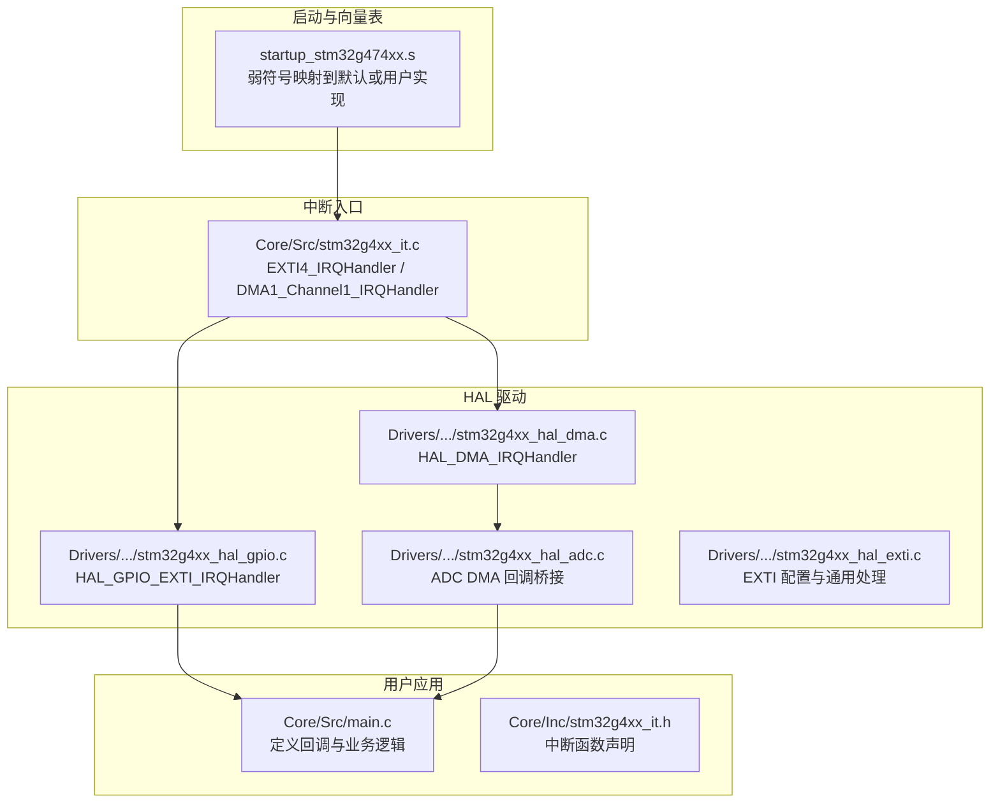
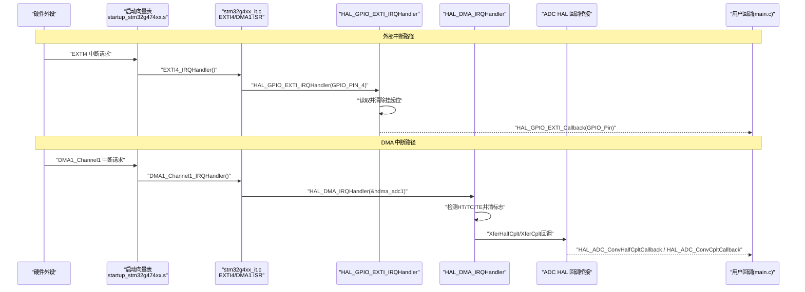
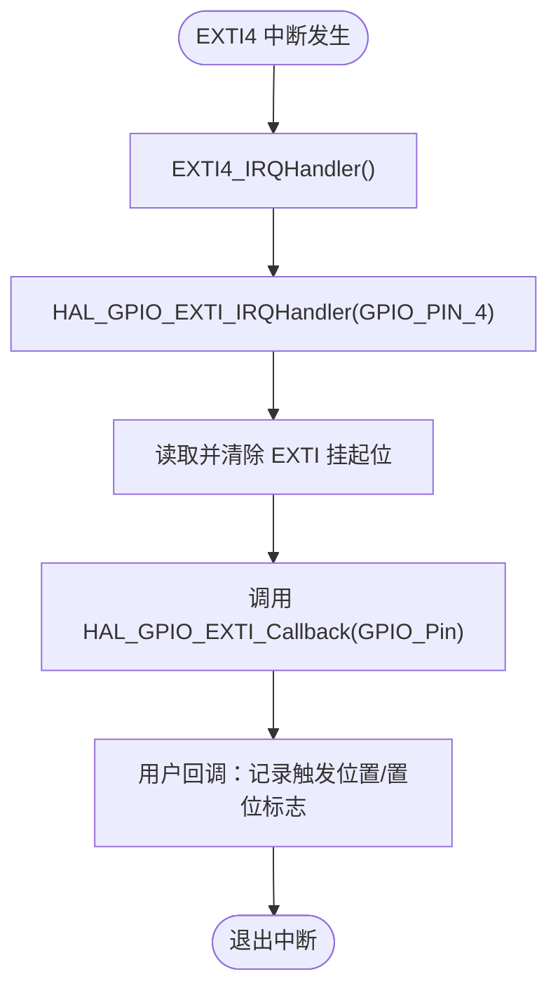
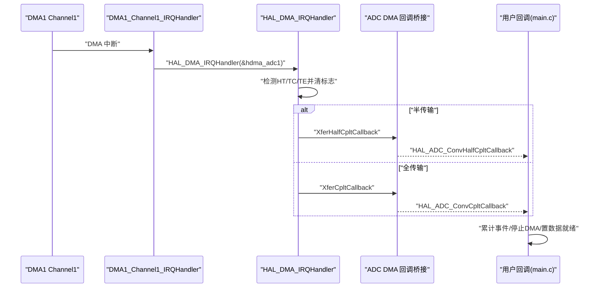
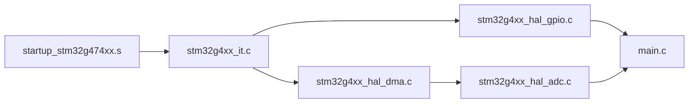

# 中断服务程序实现

<cite>
**本文引用的文件**   
- [stm32g4xx_it.c](file://Core/Src/stm32g4xx_it.c)
- [stm32g4xx_it.h](file://Core/Inc/stm32g4xx_it.h)
- [main.c](file://Core/Src/main.c)
- [stm32g4xx_hal_gpio.c](file://Drivers/STM32G4xx_HAL_Driver/Src/stm32g4xx_hal_gpio.c)
- [stm32g4xx_hal_dma.c](file://Drivers/STM32G4xx_HAL_Driver/Src/stm32g4xx_hal_dma.c)
- [stm32g4xx_hal_adc.c](file://Drivers/STM32G4xx_HAL_Driver/Src/stm32g4xx_hal_adc.c)
- [stm32g4xx_hal_exti.c](file://Drivers/STM32G4xx_HAL_Driver/Src/stm32g4xx_hal_exti.c)
- [startup_stm32g474xx.s](file://startup_stm32g474xx.s)
</cite>

## 目录
1. [引言](#引言)
2. [项目结构](#项目结构)
3. [核心组件](#核心组件)
4. [架构总览](#架构总览)
5. [详细组件分析](#详细组件分析)
6. [依赖关系分析](#依赖关系分析)
7. [性能考虑](#性能考虑)
8. [故障排查指南](#故障排查指南)
9. [结论](#结论)
10. [附录](#附录)

## 引言
本技术文档围绕 STM32G4 项目中“中断服务程序（ISR）”的实现展开，重点解析 EXTI4 外部中断与 DMA1_Channel1 DMA 中断的完整处理链路。文档从 HAL 库机制出发，解释中断标志位清除、回调函数调用与上下文保存恢复流程，并提供可操作的优化策略与错误处理建议，既适合初学者入门，也面向高级开发者提供实时性优化方案。

## 项目结构
本项目采用分层组织：用户应用位于 Core/Src 与 Core/Inc；HAL 驱动位于 Drivers/STM32G4xx_HAL_Driver；启动向量表在 startup_stm32g474xx.s。中断相关的关键入口集中在 stm32g4xx_it.c，并通过 HAL 层将硬件中断分发到用户回调。

图表来源
- [stm32g4xx_it.c:205-228](file://Core/Src/stm32g4xx_it.c#L205-L228)
- [stm32g4xx_it.h:58-60](file://Core/Inc/stm32g4xx_it.h#L58-L60)
- [stm32g4xx_hal_gpio.c:491-499](file://Drivers/STM32G4xx_HAL_Driver/Src/stm32g4xx_hal_gpio.c#L491-L499)
- [stm32g4xx_hal_dma.c:748-830](file://Drivers/STM32G4xx_HAL_Driver/Src/stm32g4xx_hal_dma.c#L748-L830)
- [stm32g4xx_hal_adc.c:3586-3675](file://Drivers/STM32G4xx_HAL_Driver/Src/stm32g4xx_hal_adc.c#L3586-L3675)
- [startup_stm32g474xx.s:410-591](file://startup_stm32g474xx.s#L410-L591)

章节来源
- [stm32g4xx_it.c:205-228](file://Core/Src/stm32g4xx_it.c#L205-L228)
- [stm32g4xx_it.h:58-60](file://Core/Inc/stm32g4xx_it.h#L58-L60)
- [startup_stm32g474xx.s:410-591](file://startup_stm32g474xx.s#L410-L591)

## 核心组件
- EXTI4_IRQHandler：外部中断入口，负责调用 HAL 层 GPIO EXTI 处理，最终触发用户回调。
- DMA1_Channel1_IRQHandler：DMA 通道中断入口，负责调用 HAL 层 DMA 处理，完成标志位清除并触发 ADC 半传输/全传输回调。
- HAL_GPIO_EXTI_IRQHandler：统一的外部中断处理，读取并清除挂起位，调用用户回调 HAL_GPIO_EXTI_Callback。
- HAL_DMA_IRQHandler：统一的 DMA 中断处理，根据状态寄存器判断 HT/TC/TE，清除对应标志位并调用相应回调。
- ADC DMA 回调桥接：HAL_ADC_ConvCpltCallback/HAL_ADC_ConvHalfCpltCallback 由 ADC HAL 内部通过 DMA 回调链调用，进入用户覆盖的回调。

章节来源
- [stm32g4xx_it.c:205-228](file://Core/Src/stm32g4xx_it.c#L205-L228)
- [stm32g4xx_hal_gpio.c:491-514](file://Drivers/STM32G4xx_HAL_Driver/Src/stm32g4xx_hal_gpio.c#L491-L514)
- [stm32g4xx_hal_dma.c:748-830](file://Drivers/STM32G4xx_HAL_Driver/Src/stm32g4xx_hal_dma.c#L748-L830)
- [stm32g4xx_hal_adc.c:3586-3675](file://Drivers/STM32G4xx_HAL_Driver/Src/stm32g4xx_hal_adc.c#L3586-L3675)

## 架构总览
下图展示从硬件中断到用户回调的完整路径，包括 EXTI 与 DMA 两条关键链路。

图表来源
- [startup_stm32g474xx.s:410-591](file://startup_stm32g474xx.s#L410-L591)
- [stm32g4xx_it.c:205-228](file://Core/Src/stm32g4xx_it.c#L205-L228)
- [stm32g4xx_hal_gpio.c:491-499](file://Drivers/STM32G4xx_HAL_Driver/Src/stm32g4xx_hal_gpio.c#L491-L499)
- [stm32g4xx_hal_dma.c:748-830](file://Drivers/STM32G4xx_HAL_Driver/Src/stm32g4xx_hal_dma.c#L748-L830)
- [stm32g4xx_hal_adc.c:3586-3675](file://Drivers/STM32G4xx_HAL_Driver/Src/stm32g4xx_hal_adc.c#L3586-L3675)

## 详细组件分析

### EXTI4 外部中断处理
- 入口函数：EXTI4_IRQHandler 直接调用 HAL_GPIO_EXTI_IRQHandler，避免在中断中做复杂操作。
- HAL 层行为：HAL_GPIO_EXTI_IRQHandler 检查并清除 EXTI 挂起位，然后调用用户回调 HAL_GPIO_EXTI_Callback。
- 用户回调：在 main.c 中实现 HAL_GPIO_EXTI_Callback，用于快速记录触发时刻的 DMA 写入位置，设置触发标志，并忽略重复触发与 UART 忙期间的干扰。

图表来源
- [stm32g4xx_it.c:205-214](file://Core/Src/stm32g4xx_it.c#L205-L214)
- [stm32g4xx_hal_gpio.c:491-499](file://Drivers/STM32G4xx_HAL_Driver/Src/stm32g4xx_hal_gpio.c#L491-L499)
- [main.c:91-113](file://Core/Src/main.c#L91-L113)

章节来源
- [stm32g4xx_it.c:205-214](file://Core/Src/stm32g4xx_it.c#L205-L214)
- [stm32g4xx_hal_gpio.c:491-514](file://Drivers/STM32G4xx_HAL_Driver/Src/stm32g4xx_hal_gpio.c#L491-L514)
- [main.c:91-113](file://Core/Src/main.c#L91-L113)

### DMA1_Channel1 DMA 中断处理
- 入口函数：DMA1_Channel1_IRQHandler 调用 HAL_DMA_IRQHandler，传入 ADC 使用的 DMA 句柄。
- HAL 层行为：HAL_DMA_IRQHandler 读取状态寄存器，分别处理半传输（HT）、全传输（TC）和错误（TE），清除对应标志位，并在非循环模式下禁用相应中断；随后调用注册的回调。
- ADC 回调桥接：ADC HAL 将 DMA 的 XferHalfCplt/XferCplt 回调映射为 HAL_ADC_ConvHalfCpltCallback/HAL_ADC_ConvCpltCallback，最终进入用户覆盖的回调。
- 用户回调：在 main.c 中实现两个回调，用于统计后触发事件数，达到阈值后停止多模式 ADC DMA 转换并置数据就绪标志。

图表来源
- [stm32g4xx_it.c:219-228](file://Core/Src/stm32g4xx_it.c#L219-L228)
- [stm32g4xx_hal_dma.c:748-830](file://Drivers/STM32G4xx_HAL_Driver/Src/stm32g4xx_hal_dma.c#L748-L830)
- [stm32g4xx_hal_adc.c:3586-3675](file://Drivers/STM32G4xx_HAL_Driver/Src/stm32g4xx_hal_adc.c#L3586-L3675)
- [main.c:135-149](file://Core/Src/main.c#L135-L149)

章节来源
- [stm32g4xx_it.c:219-228](file://Core/Src/stm32g4xx_it.c#L219-L228)
- [stm32g4xx_hal_dma.c:748-830](file://Drivers/STM32G4xx_HAL_Driver/Src/stm32g4xx_hal_dma.c#L748-L830)
- [stm32g4xx_hal_adc.c:3586-3675](file://Drivers/STM32G4xx_HAL_Driver/Src/stm32g4xx_hal_adc.c#L3586-L3675)
- [main.c:135-149](file://Core/Src/main.c#L135-L149)

### HAL 库中断处理机制要点
- EXTI 处理：HAL_GPIO_EXTI_IRQHandler 负责读取并清除 EXTI 挂起位，再调用用户回调。该函数不关心具体端口，仅以引脚号作为参数。
- DMA 处理：HAL_DMA_IRQHandler 依据通道索引计算标志位偏移，分别处理 HT/TC/TE，必要时禁用中断并更新状态，最后调用回调。
- ADC 集成：ADC HAL 在 DMA 回调中进一步转发到 HAL_ADC_ConvCpltCallback/HAL_ADC_ConvHalfCpltCallback，用户可在 main.c 中覆盖这些回调以实现业务逻辑。

章节来源
- [stm32g4xx_hal_gpio.c:491-514](file://Drivers/STM32G4xx_HAL_Driver/Src/stm32g4xx_hal_gpio.c#L491-L514)
- [stm32g4xx_hal_dma.c:748-830](file://Drivers/STM32G4xx_HAL_Driver/Src/stm32g4xx_hal_dma.c#L748-L830)
- [stm32g4xx_hal_adc.c:3586-3675](file://Drivers/STM32G4xx_HAL_Driver/Src/stm32g4xx_hal_adc.c#L3586-L3675)

### 中断服务程序编写规范与最佳实践
- 最小化中断内工作：只进行必要的数据采集、标志位设置与轻量级状态更新，复杂计算移至主循环或任务队列。
- 快速清除挂起位：确保在调用回调前清除 EXTI/DMA 挂起位，防止重复进入。
- 使用 volatile 共享变量：跨 ISR 与主循环共享的状态必须声明为 volatile，避免编译器优化导致不一致。
- 重入与互斥保护：对可能被多个中断或主循环访问的资源加锁或使用原子操作，避免竞态条件。
- 避免阻塞调用：中断中不要使用延时、阻塞式 I/O 或浮点运算密集型代码。
- 合理优先级：为高频或关键中断分配更高 NVIC 优先级，降低抖动与丢失风险。
- 回调职责单一：每个回调只做一件事，如标记完成、计数、切换状态等。

章节来源
- [main.c:65-70](file://Core/Src/main.c#L65-L70)
- [main.c:91-113](file://Core/Src/main.c#L91-L113)
- [stm32g4xx_hal_gpio.c:491-499](file://Drivers/STM32G4xx_HAL_Driver/Src/stm32g4xx_hal_gpio.c#L491-L499)
- [stm32g4xx_hal_dma.c:748-830](file://Drivers/STM32G4xx_HAL_Driver/Src/stm32g4xx_hal_dma.c#L748-L830)

### 上下文保存与恢复
- Cortex-M 自动保存：进入异常/中断时，硬件自动压栈 R0-R3、R12、LR、PC、xPSR；返回时自动出栈恢复。
- 额外寄存器：若 ISR 使用浮点或更多寄存器，需启用 FPSCR 与 S 寄存器保存（取决于编译选项与运行时）。
- 嵌套中断：高优先级中断可抢占低优先级，注意临界区与共享变量的原子性。

章节来源
- [startup_stm32g474xx.s:410-591](file://startup_stm32g474xx.s#L410-L591)

## 依赖关系分析
- 启动向量表将硬件中断映射到 stm32g4xx_it.c 中的具体 ISR。
- ISR 调用 HAL 层函数，HAL 层负责寄存器操作与回调分发。
- ADC HAL 将 DMA 回调桥接到用户回调，形成“硬件→向量表→ISR→HAL→ADC HAL→用户回调”的完整链路。

图表来源
- [startup_stm32g474xx.s:410-591](file://startup_stm32g474xx.s#L410-L591)
- [stm32g4xx_it.c:205-228](file://Core/Src/stm32g4xx_it.c#L205-L228)
- [stm32g4xx_hal_gpio.c:491-499](file://Drivers/STM32G4xx_HAL_Driver/Src/stm32g4xx_hal_gpio.c#L491-L499)
- [stm32g4xx_hal_dma.c:748-830](file://Drivers/STM32G4xx_HAL_Driver/Src/stm32g4xx_hal_dma.c#L748-L830)
- [stm32g4xx_hal_adc.c:3586-3675](file://Drivers/STM32G4xx_HAL_Driver/Src/stm32g4xx_hal_adc.c#L3586-L3675)

章节来源
- [stm32g4xx_it.c:205-228](file://Core/Src/stm32g4xx_it.c#L205-L228)
- [stm32g4xx_hal_gpio.c:491-499](file://Drivers/STM32G4xx_HAL_Driver/Src/stm32g4xx_hal_gpio.c#L491-L499)
- [stm32g4xx_hal_dma.c:748-830](file://Drivers/STM32G4xx_HAL_Driver/Src/stm32g4xx_hal_dma.c#L748-L830)
- [stm32g4xx_hal_adc.c:3586-3675](file://Drivers/STM32G4xx_HAL_Driver/Src/stm32g4xx_hal_adc.c#L3586-L3675)

## 性能考虑
- 缩短中断路径：尽量在 ISR 中只做“读寄存器+写标志”，把数据处理放到主循环。
- 减少内存访问：避免在中断中进行大量拷贝或动态分配。
- 使用环形缓冲：DMA 配合环形缓冲可减少 CPU 干预，提高吞吐。
- 关闭不必要中断：在非关键路径及时禁用中断，降低竞争与开销。
- 优化回调粒度：将大任务拆分为小步骤，利用半传输回调逐步处理。
- 避免浮点与除法：在 ISR 中使用整数运算，必要时延迟到主循环。

[本节为通用指导，无需特定文件引用]

## 故障排查指南
- 中断未进入：检查 NVIC 是否使能、中断优先级是否正确、启动向量表是否映射到用户实现。
- 重复触发：确认 EXTI/DMA 挂起位是否被正确清除；检查用户回调是否再次置位。
- 数据错乱：检查共享变量是否为 volatile；确认 DMA 环形缓冲边界与触发位置计算。
- 回调未执行：确认 HAL 层回调注册是否生效；检查 ADC HAL 的 DMA 回调桥接是否启用。
- 错误处理：DMA TE 错误会禁用所有中断并置错误码；需在用户侧捕获并恢复。

章节来源
- [stm32g4xx_hal_dma.c:798-830](file://Drivers/STM32G4xx_HAL_Driver/Src/stm32g4xx_hal_dma.c#L798-L830)
- [stm32g4xx_hal_gpio.c:491-499](file://Drivers/STM32G4xx_HAL_Driver/Src/stm32g4xx_hal_gpio.c#L491-L499)
- [main.c:65-70](file://Core/Src/main.c#L65-L70)

## 结论
通过合理的 ISR 设计与 HAL 层协作，可实现高效稳定的中断处理。EXTI4 与 DMA1_Channel1 的中断链路清晰明确：入口函数极简，HAL 层负责标志位管理与回调分发，用户回调专注业务逻辑。遵循最小化中断时间、避免复杂计算、正确使用 volatile 与原子性等最佳实践，可显著提升系统实时性与可靠性。

[本节为总结，无需特定文件引用]

## 附录
- 常用宏与接口参考：
  - EXTI 配置与查询：HAL_EXTI_SetConfigLine、HAL_EXTI_GetPending、HAL_EXTI_ClearPending
  - GPIO EXTI 处理：HAL_GPIO_EXTI_IRQHandler、HAL_GPIO_EXTI_Callback
  - DMA 处理：HAL_DMA_IRQHandler、HAL_DMA_RegisterCallback
  - ADC DMA 回调：HAL_ADC_ConvCpltCallback、HAL_ADC_ConvHalfCpltCallback

章节来源
- [stm32g4xx_hal_exti.c:504-514](file://Drivers/STM32G4xx_HAL_Driver/Src/stm32g4xx_hal_exti.c#L504-L514)
- [stm32g4xx_hal_gpio.c:491-514](file://Drivers/STM32G4xx_HAL_Driver/Src/stm32g4xx_hal_gpio.c#L491-L514)
- [stm32g4xx_hal_dma.c:748-830](file://Drivers/STM32G4xx_HAL_Driver/Src/stm32g4xx_hal_dma.c#L748-L830)
- [stm32g4xx_hal_adc.c:3586-3675](file://Drivers/STM32G4xx_HAL_Driver/Src/stm32g4xx_hal_adc.c#L3586-L3675)