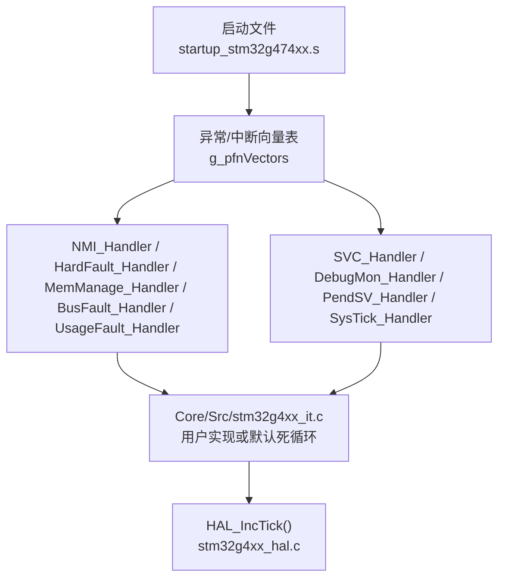
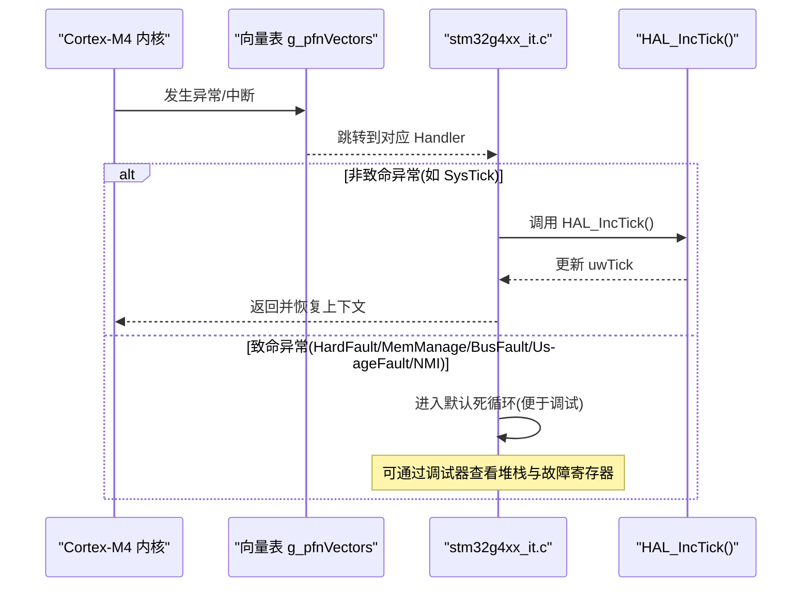
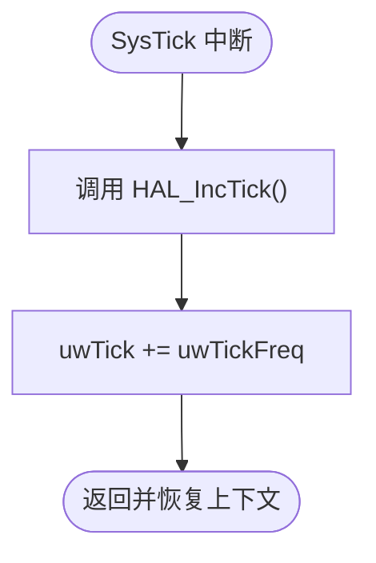
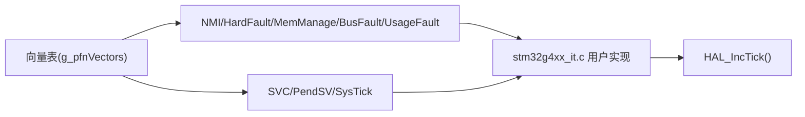

# 系统异常处理器

<cite>
**本文引用的文件**
- [Core/Src/stm32g4xx_it.c](file://Core/Src/stm32g4xx_it.c)
- [startup_stm32g474xx.s](file://startup_stm32g474xx.s)
- [Core/Inc/stm32g4xx_it.h](file://Core/Inc/stm32g4xx_it.h)
- [Drivers/CMSIS/Include/core_cm4.h](file://Drivers/CMSIS/Include/core_cm4.h)
- [Drivers/STM32G4xx_HAL_Driver/Src/stm32g4xx_hal.c](file://Drivers/STM32G4xx_HAL_Driver/Src/stm32g4xx_hal.c)
</cite>

## 目录
1. [简介](#简介)
2. [项目结构](#项目结构)
3. [核心组件](#核心组件)
4. [架构总览](#架构总览)
5. [详细组件分析](#详细组件分析)
6. [依赖关系分析](#依赖关系分析)
7. [性能与稳定性考量](#性能与稳定性考量)
8. [故障诊断与调试指南](#故障诊断与调试指南)
9. [结论](#结论)
10. [附录：Cortex-M 异常模型基础](#附录cortex-m-异常模型基础)

## 简介
本技术文档围绕 Cortex-M4 内核的异常处理机制，结合 STM32G4 工程中的实际实现，系统性阐述以下主题：
- NMI_Handler、HardFault_Handler、MemManage_Handler、BusFault_Handler、UsageFault_Handler 的处理逻辑与定位方法
- SysTick_Handler 作为时间基准的作用及与 HAL_IncTick 的关系
- SVC_Handler 与 PendSV_Handler 的典型使用场景
- 异常现场分析与错误定位技巧
- 面向初学者的异常模型入门与面向高级开发者的系统级调试与稳定性保障方案

## 项目结构
本项目采用典型的 STM32CubeMX 工程组织方式，异常处理相关代码主要位于 Core 层与启动文件：
- 中断向量表与默认弱符号映射：startup_stm32g474xx.s
- 用户可覆盖的中断/异常服务函数：Core/Src/stm32g4xx_it.c（含 stm32g4xx_it.h）
- HAL 时间基准与延时服务：Drivers/STM32G4xx_HAL_Driver/Src/stm32g4xx_hal.c
- Cortex-M4 核心寄存器访问接口：Drivers/CMSIS/Include/core_cm4.h

图表来源
- [startup_stm32g474xx.s:133-149](file://startup_stm32g474xx.s#L133-L149)
- [Core/Src/stm32g4xx_it.c:70-193](file://Core/Src/stm32g4xx_it.c#L70-L193)
- [Drivers/STM32G4xx_HAL_Driver/Src/stm32g4xx_hal.c:321-325](file://Drivers/STM32G4xx_HAL_Driver/Src/stm32g4xx_hal.c#L321-L325)

章节来源
- [startup_stm32g474xx.s:133-149](file://startup_stm32g474xx.s#L133-L149)
- [Core/Src/stm32g4xx_it.c:70-193](file://Core/Src/stm32g4xx_it.c#L70-L193)
- [Core/Inc/stm32g4xx_it.h:49-57](file://Core/Inc/stm32g4xx_it.h#L49-L57)
- [Drivers/STM32G4xx_HAL_Driver/Src/stm32g4xx_hal.c:321-325](file://Drivers/STM32G4xx_HAL_Driver/Src/stm32g4xx_hal.c#L321-L325)

## 核心组件
- 异常/中断服务函数集合：在 stm32g4xx_it.c 中提供默认实现，用户可在指定区域插入业务逻辑。
- 启动文件向量表：将异常号映射到具体 Handler；未实现的 Handler 通过弱符号指向 Default_Handler（无限循环）。
- HAL 时间基准：SysTick_Handler 调用 HAL_IncTick()，驱动 uwTick 全局变量递增，为 HAL_Delay()/HAL_GetTick() 等提供毫秒级时间源。

章节来源
- [Core/Src/stm32g4xx_it.c:70-193](file://Core/Src/stm32g4xx_it.c#L70-L193)
- [startup_stm32g474xx.s:263-288](file://startup_stm32g474xx.s#L263-L288)
- [Drivers/STM32G4xx_HAL_Driver/Src/stm32g4xx_hal.c:321-325](file://Drivers/STM32G4xx_HAL_Driver/Src/stm32g4xx_hal.c#L321-L325)

## 架构总览
下图展示了从复位到异常处理的完整路径，以及 SysTick 与 HAL 时间基准的协作关系。

图表来源
- [startup_stm32g474xx.s:133-149](file://startup_stm32g474xx.s#L133-L149)
- [Core/Src/stm32g4xx_it.c:184-193](file://Core/Src/stm32g4xx_it.c#L184-L193)
- [Drivers/STM32G4xx_HAL_Driver/Src/stm32g4xx_hal.c:321-325](file://Drivers/STM32G4xx_HAL_Driver/Src/stm32g4xx_hal.c#L321-L325)

## 详细组件分析

### NMI_Handler（非屏蔽中断）
- 作用：处理不可屏蔽中断，通常用于严重硬件事件（如外部时钟丢失、看门狗等）。
- 当前实现：进入后进入无限循环，便于在调试器中捕获现场。
- 建议：若需继续运行，应尽快记录关键状态并安全复位或降级运行。

章节来源
- [Core/Src/stm32g4xx_it.c:70-80](file://Core/Src/stm32g4xx_it.c#L70-L80)

### HardFault_Handler（硬故障）
- 触发条件：多种原因导致，包括非法地址访问、栈溢出、对齐错误、FPU 使用不当等。
- 当前实现：进入后进入无限循环，保留现场供调试。
- 定位要点：
  - 检查堆栈指针与栈大小配置
  - 检查内存访问越界、空指针解引用
  - 检查中断嵌套与优先级设置
  - 使用调试器查看 SCB 相关寄存器（见“故障诊断与调试指南”）

章节来源
- [Core/Src/stm32g4xx_it.c:85-95](file://Core/Src/stm32g4xx_it.c#L85-L95)

### MemManage_Handler（内存管理故障）
- 触发条件：MPU 配置导致的访问违规（权限、类型、属性不匹配）。
- 当前实现：进入后进入无限循环，保留现场。
- 定位要点：
  - 检查 MPU 区域配置与访问权限
  - 检查是否对未映射或只读区域进行写操作

章节来源
- [Core/Src/stm32g4xx_it.c:100-110](file://Core/Src/stm32g4xx_it.c#L100-L110)

### BusFault_Handler（总线故障）
- 触发条件：指令预取失败、数据访问总线错误（如外设未使能、地址无效）。
- 当前实现：进入后进入无限循环，保留现场。
- 定位要点：
  - 检查外设基地址与偏移是否正确
  - 检查总线使能与时钟配置

章节来源
- [Core/Src/stm32g4xx_it.c:115-125](file://Core/Src/stm32g4xx_it.c#L115-L125)

### UsageFault_Handler（用法故障）
- 触发条件：未定义指令、非法状态、对齐错误、除零等。
- 当前实现：进入后进入无限循环，保留现场。
- 定位要点：
  - 检查函数指针与跳转目标
  - 检查浮点运算与对齐要求
  - 检查编译器选项与内联汇编

章节来源
- [Core/Src/stm32g4xx_it.c:130-140](file://Core/Src/stm32g4xx_it.c#L130-L140)

### SVC_Handler（系统服务调用）
- 作用：由应用程序通过 SVC 指令发起的系统调用，常用于操作系统或 RTOS 的服务入口。
- 当前实现：空实现，用户可在此扩展系统服务分发逻辑。
- 典型用法：
  - 在裸机中用于切换特权级或执行受限操作
  - 在 RTOS 中用于任务调度、信号量、消息队列等内核服务

章节来源
- [Core/Src/stm32g4xx_it.c:145-153](file://Core/Src/stm32g4xx_it.c#L145-L153)

### PendSV_Handler（可悬挂服务请求）
- 作用：低优先级系统服务，常用于延迟到空闲时执行的上下文切换（RTOS 常用）。
- 当前实现：空实现，用户可在此实现最小化上下文切换逻辑。
- 典型用法：
  - 在 RTOS 中作为任务切换的最终阶段
  - 在裸机中用于延后处理耗时操作

章节来源
- [Core/Src/stm32g4xx_it.c:171-179](file://Core/Src/stm32g4xx_it.c#L171-L179)

### SysTick_Handler（系统滴答定时器）
- 作用：周期性中断，提供系统时间基准。
- 当前实现：调用 HAL_IncTick()，驱动 uwTick 递增，从而支持 HAL_Delay()/HAL_GetTick()。
- 注意事项：
  - 中断频率通常为 1ms，避免在中断中执行耗时操作
  - 如需更高精度，可自定义 Tick 源或提高中断频率

图表来源
- [Core/Src/stm32g4xx_it.c:184-193](file://Core/Src/stm32g4xx_it.c#L184-L193)
- [Drivers/STM32G4xx_HAL_Driver/Src/stm32g4xx_hal.c:321-325](file://Drivers/STM32G4xx_HAL_Driver/Src/stm32g4xx_hal.c#L321-L325)

章节来源
- [Core/Src/stm32g4xx_it.c:184-193](file://Core/Src/stm32g4xx_it.c#L184-L193)
- [Drivers/STM32G4xx_HAL_Driver/Src/stm32g4xx_hal.c:321-325](file://Drivers/STM32G4xx_HAL_Driver/Src/stm32g4xx_hal.c#L321-L325)

## 依赖关系分析
- 启动文件将异常号映射到具体 Handler；未实现则回退到 Default_Handler（无限循环）。
- stm32g4xx_it.c 中的 Handler 是用户可覆盖的钩子，默认多为死循环以便调试。
- SysTick_Handler 依赖 HAL_IncTick() 提供的 tick 计数，进而支撑 HAL 的时间 API。

图表来源
- [startup_stm32g474xx.s:133-149](file://startup_stm32g474xx.s#L133-L149)
- [Core/Src/stm32g4xx_it.c:70-193](file://Core/Src/stm32g4xx_it.c#L70-L193)
- [Drivers/STM32G4xx_HAL_Driver/Src/stm32g4xx_hal.c:321-325](file://Drivers/STM32G4xx_HAL_Driver/Src/stm32g4xx_hal.c#L321-L325)

章节来源
- [startup_stm32g474xx.s:263-288](file://startup_stm32g474xx.s#L263-L288)
- [Core/Src/stm32g4xx_it.c:70-193](file://Core/Src/stm32g4xx_it.c#L70-L193)
- [Drivers/STM32G4xx_HAL_Driver/Src/stm32g4xx_hal.c:321-325](file://Drivers/STM32G4xx_HAL_Driver/Src/stm32g4xx_hal.c#L321-L325)

## 性能与稳定性考量
- 异常处理应尽量短小，避免阻塞；对于致命异常，优先保存现场并停机等待调试。
- SysTick 中断应保持轻量，仅做必要计数；复杂任务放入主循环或 PendSV。
- 合理设置中断优先级，确保关键异常不被高优先级外设中断长时间抢占。
- 使用 HAL 提供的 Tick 功能时，注意 uwTick 的原子性与临界区保护。

[本节为通用指导，无需特定文件引用]

## 故障诊断与调试指南

### 快速定位策略
- 在调试器中命中异常后，立即查看：
  - 程序计数器 PC：定位触发异常的指令地址
  - 堆栈指针 SP：回溯调用链
  - 各异常专用寄存器（见下节）以判断故障类型与原因
- 若进入 HardFault/MemManage/BusFault/UsageFault 的死循环，说明未实现自定义处理逻辑，属于预期行为，便于调试。

### 关键寄存器与工具
- 获取 Fault Mask 值（用于判断是否屏蔽了其他中断）：
  - 参考 CMSIS 提供的 __get_FAULTMASK/__set_FAULTMASK 接口
- 读取故障状态寄存器（SCB_CFSR/MMFSR/BFSR/USFSR）与故障地址寄存器（MMAR/BFAR），可进一步区分 MemManage、BusFault、UsageFault 的具体原因。
- 使用调试器的“查看寄存器”和“反汇编”窗口，结合 PC 与堆栈回溯定位问题。

章节来源
- [Drivers/CMSIS/Include/core_cm4.h](file://Drivers/CMSIS/Include/core_cm4.h)
- [Core/Src/stm32g4xx_it.c:85-140](file://Core/Src/stm32g4xx_it.c#L85-L140)

### 常见故障与排查清单
- HardFault：
  - 检查栈溢出（增大栈空间或减小局部变量）
  - 检查空指针与数组越界
  - 检查中断优先级与嵌套深度
- MemManage：
  - 检查 MPU 配置与访问权限
  - 检查是否对只读/未映射区域写入
- BusFault：
  - 检查外设基地址与偏移
  - 检查外设时钟与使能
- UsageFault：
  - 检查未定义指令与对齐访问
  - 检查浮点运算与编译器选项

[本节为通用指导，无需特定文件引用]

## 结论
- 本项目中异常处理采用“默认死循环 + 用户可扩展”的模式，便于在开发期快速定位问题。
- SysTick 与 HAL_IncTick 共同构成系统时间基准，支撑 HAL 的延时与计时能力。
- 通过调试器与 CMSIS 寄存器访问接口，可对各类异常进行系统化诊断与修复。
- 建议在量产前完善异常处理逻辑，增加日志记录与安全降级策略，提升系统鲁棒性。

[本节为总结性内容，无需特定文件引用]

## 附录：Cortex-M 异常模型基础
- 异常分类：
  - 内部异常：Reset、NMI、HardFault、MemManage、BusFault、UsageFault、SVC、DebugMon、PendSV、SysTick
  - 外部中断：由 NVIC 管理的各种外设中断
- 优先级与抢占：
  - 数值越小优先级越高；NVIC 支持抢占与响应优先级分组
- 模式与栈：
  - Thread 模式与 Handler 模式；Main Stack 与 Process Stack
- 故障信息：
  - SCB_SHCSR、SCB_CFSR、SCB_MMAR、SCB_BFAR 等寄存器提供详细故障上下文

[本节为概念性介绍，无需特定文件引用]