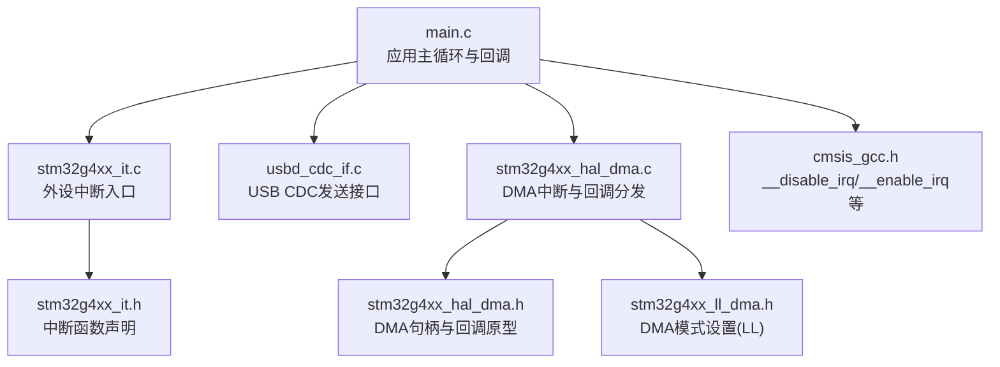
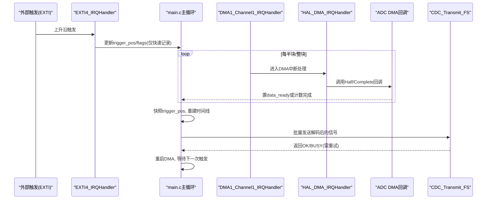
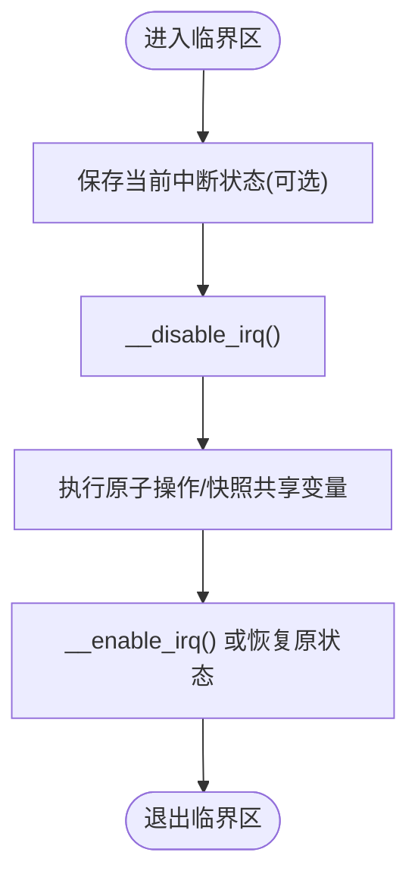
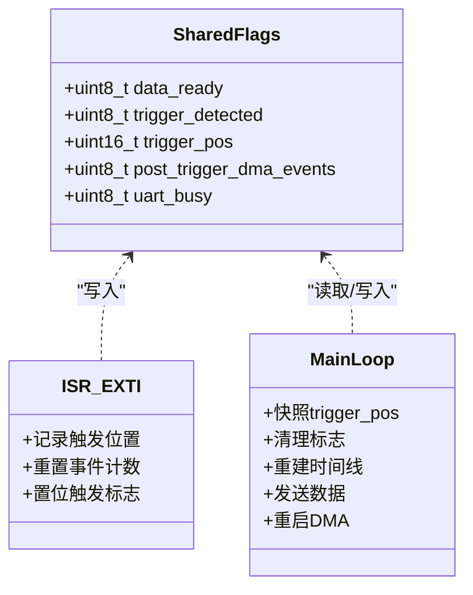
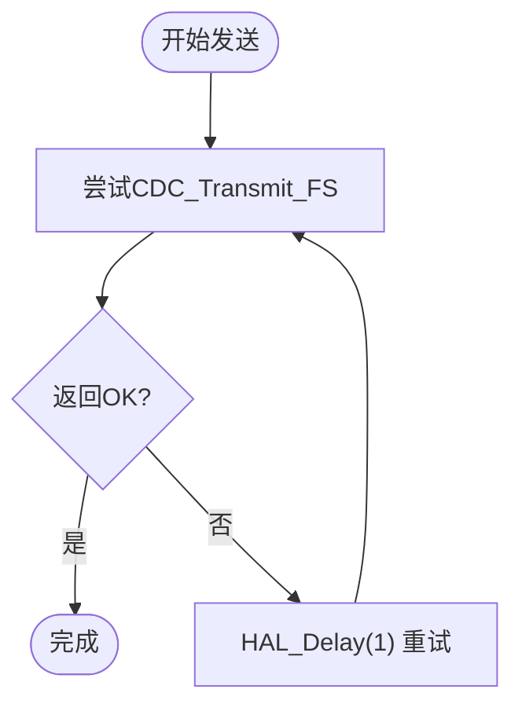
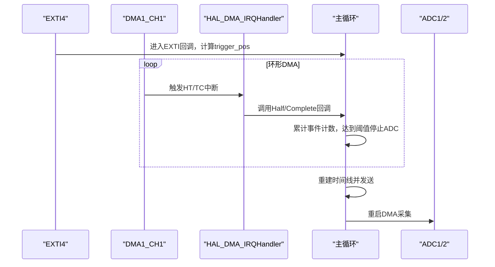
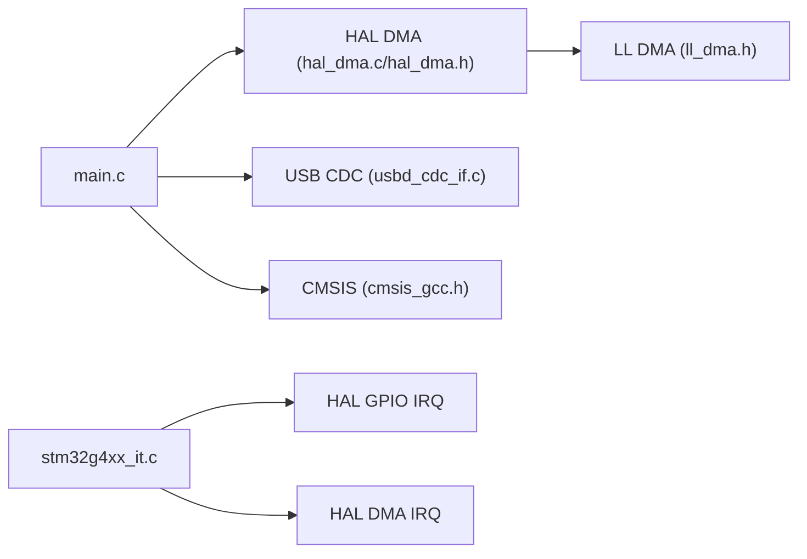

# 实时性保证机制

<cite>
**本文引用的文件**   
- [main.c](file://Core/Src/main.c)
- [stm32g4xx_it.h](file://Core/Inc/stm32g4xx_it.h)
- [stm32g4xx_it.c](file://Core/Src/stm32g4xx_it.c)
- [main.h](file://Core/Inc/main.h)
- [cmsis_gcc.h](file://Drivers/CMSIS/Include/cmsis_gcc.h)
- [core_cm35p.h](file://Drivers/CMSIS/Include/core_cm35p.h)
- [core_cm33.h](file://Drivers/CMSIS/Include/core_cm33.h)
- [core_sc000.h](file://Drivers/CMSIS/Include/core_sc000.h)
- [stm32g4xx_hal_dma.h](file://Drivers/STM32G4xx_HAL_Driver/Inc/stm32g4xx_hal_dma.h)
- [stm32g4xx_ll_dma.h](file://Drivers/STM32G4xx_HAL_Driver/Inc/stm32g4xx_ll_dma.h)
- [stm32g4xx_hal_dma.c](file://Drivers/STM32G4xx_HAL_Driver/Src/stm32g4xx_hal_dma.c)
- [usbd_cdc_if.c](file://USB_Device/App/usbd_cdc_if.c)
</cite>

## 目录
1. [引言](#引言)
2. [项目结构](#项目结构)
3. [核心组件](#核心组件)
4. [架构总览](#架构总览)
5. [详细组件分析](#详细组件分析)
6. [依赖关系分析](#依赖关系分析)
7. [性能与实时性考虑](#性能与实时性考虑)
8. [故障排查指南](#故障排查指南)
9. [结论](#结论)
10. [附录](#附录)

## 引言
本技术文档围绕该STM32G4项目的“实时性保证机制”展开，聚焦以下主题：
- 临界区保护与中断屏蔽：__disable_irq()/__enable_irq()的使用场景、注意事项与替代方案
- 原子操作与volatile的正确使用：跨ISR与主循环共享变量的访问模型
- 中断屏蔽与忙等待的合理使用边界
- DMA与中断协同：确保数据完整性与最小化延迟
- 实时性分析方法：中断延迟测量、CPU占用率监控
- 测试用例与基准：面向初学者的入门要点与面向高级开发者的设计建议

## 项目结构
本项目基于STM32CubeMX生成的工程骨架，关键实时路径集中在应用层main.c与中断处理stm32g4xx_it.c，DMA与USB CDC分别通过HAL/LL与设备库实现。

**图示来源** 
- [main.c:219-290](file://Core/Src/main.c#L219-L290)
- [stm32g4xx_it.c:205-228](file://Core/Src/stm32g4xx_it.c#L205-L228)
- [usbd_cdc_if.c:281-293](file://USB_Device/App/usbd_cdc_if.c#L281-L293)
- [stm32g4xx_hal_dma.c:753-790](file://Drivers/STM32G4xx_HAL_Driver/Src/stm32g4xx_hal_dma.c#L753-L790)
- [stm32g4xx_it.h:58-60](file://Core/Inc/stm32g4xx_it.h#L58-L60)
- [cmsis_gcc.h:196-210](file://Drivers/CMSIS/Include/cmsis_gcc.h#L196-L210)
- [stm32g4xx_hal_dma.h:113-151](file://Drivers/STM32G4xx_HAL_Driver/Inc/stm32g4xx_hal_dma.h#L113-L151)
- [stm32g4xx_ll_dma.h:683-688](file://Drivers/STM32G4xx_HAL_Driver/Inc/stm32g4xx_ll_dma.h#L683-L688)

**章节来源**
- [main.c:219-290](file://Core/Src/main.c#L219-L290)
- [stm32g4xx_it.c:205-228](file://Core/Src/stm32g4xx_it.c#L205-L228)
- [usbd_cdc_if.c:281-293](file://USB_Device/App/usbd_cdc_if.c#L281-L293)
- [stm32g4xx_hal_dma.c:753-790](file://Drivers/STM32G4xx_HAL_Driver/Src/stm32g4xx_hal_dma.c#L753-L790)
- [stm32g4xx_it.h:58-60](file://Core/Inc/stm32g4xx_it.h#L58-L60)
- [cmsis_gcc.h:196-210](file://Drivers/CMSIS/Include/cmsis_gcc.h#L196-L210)
- [stm32g4xx_hal_dma.h:113-151](file://Drivers/STM32G4xx_HAL_Driver/Inc/stm32g4xx_hal_dma.h#L113-L151)
- [stm32g4xx_ll_dma.h:683-688](file://Drivers/STM32G4xx_HAL_Driver/Inc/stm32g4xx_ll_dma.h#L683-L688)

## 核心组件
- 应用主循环与状态机：在main.c中维护触发标志、缓冲区指针快照、UART忙标志，协调DMA重启动作
- 中断服务程序：EXTI用于外部触发，DMA通道中断用于半传输/全传输回调
- USB CDC发送：非阻塞队列式发送，忙时返回BUSY并配合重试策略
- CMSIS内核API：提供__disable_irq/__enable_irq等原子级中断控制
- HAL/LL DMA驱动：负责DMA中断分发、回调调用与模式配置

**章节来源**
- [main.c:86-213](file://Core/Src/main.c#L86-L213)
- [stm32g4xx_it.c:205-228](file://Core/Src/stm32g4xx_it.c#L205-L228)
- [usbd_cdc_if.c:281-293](file://USB_Device/App/usbd_cdc_if.c#L281-L293)
- [cmsis_gcc.h:196-210](file://Drivers/CMSIS/Include/cmsis_gcc.h#L196-L210)
- [stm32g4xx_hal_dma.c:753-790](file://Drivers/STM32G4xx_HAL_Driver/Src/stm32g4xx_hal_dma.c#L753-L790)

## 架构总览
下图展示了从外部触发到数据重建与USB输出的完整时序，以及DMA回调如何参与完成判定。

**图示来源** 
- [stm32g4xx_it.c:205-214](file://Core/Src/stm32g4xx_it.c#L205-L214)
- [main.c:91-131](file://Core/Src/main.c#L91-L131)
- [stm32g4xx_hal_dma.c:753-790](file://Drivers/STM32G4xx_HAL_Driver/Src/stm32g4xx_hal_dma.c#L753-L790)
- [usbd_cdc_if.c:281-293](file://USB_Device/App/usbd_cdc_if.c#L281-L293)

## 详细组件分析

### 临界区保护与中断屏蔽
- 使用场景
  - 错误处理：Error_Handler中关闭全局中断后进入死循环，避免异常状态下继续执行导致不可恢复状态
  - 极短临界区：在主循环中对共享变量进行“快照+清理”的关键段，应尽可能缩短，必要时用__disable_irq/__enable_irq包裹
- 注意事项
  - __disable_irq/__enable_irq为全局中断屏蔽，会增大所有中断的响应延迟，仅在极小代码段使用
  - 若仅需屏蔽特定中断，优先使用NVIC Disable/Enable（如__NVIC_DisableIRQ），并结合内存屏障保证顺序
  - 注意编译器优化对内存访问的重排序，必要时插入__COMPILER_BARRIER或memory clobber

**图示来源** 
- [cmsis_gcc.h:196-210](file://Drivers/CMSIS/Include/cmsis_gcc.h#L196-L210)
- [core_cm35p.h:2165-2170](file://Drivers/CMSIS/Include/core_cm35p.h#L2165-L2170)
- [core_cm33.h:2165-2170](file://Drivers/CMSIS/Include/core_cm33.h#L2165-L2170)
- [core_sc000.h:787-795](file://Drivers/CMSIS/Include/core_sc000.h#L787-L795)

**章节来源**
- [main.c:530-539](file://Core/Src/main.c#L530-L539)
- [cmsis_gcc.h:196-210](file://Drivers/CMSIS/Include/cmsis_gcc.h#L196-L210)
- [core_cm35p.h:2165-2170](file://Drivers/CMSIS/Include/core_cm35p.h#L2165-L2170)
- [core_cm33.h:2165-2170](file://Drivers/CMSIS/Include/core_cm33.h#L2165-L2170)
- [core_sc000.h:787-795](file://Drivers/CMSIS/Include/core_sc000.h#L787-L795)

### 原子操作与volatile的正确使用
- volatile语义
  - 防止编译器对跨ISR与主循环共享变量进行缓存/重排优化，确保每次读写都访问真实内存
  - 不等同于原子性；多字节变量仍需临界区保护或使用原子指令
- 本项目中的共享变量
  - data_ready、trigger_detected、trigger_pos、post_trigger_dma_events、uart_busy均声明为volatile，用于ISR与主循环通信
- 原子性保障
  - 主循环读取trigger_pos后立即清零相关标志，避免ISR竞争
  - 对于更复杂的复合操作，可使用CMSIS提供的LDREX/STREX系列或__atomic内置函数（视编译器支持）

**图示来源** 
- [main.c:64-70](file://Core/Src/main.c#L64-L70)
- [main.c:91-131](file://Core/Src/main.c#L91-L131)
- [main.c:264-287](file://Core/Src/main.c#L264-L287)

**章节来源**
- [main.c:64-70](file://Core/Src/main.c#L64-L70)
- [main.c:91-131](file://Core/Src/main.c#L91-L131)
- [main.c:264-287](file://Core/Src/main.c#L264-L287)
- [cmsis_gcc.h:1120-1593](file://Drivers/CMSIS/Include/cmsis_gcc.h#L1120-L1593)

### 中断屏蔽技术与忙等待循环
- 中断屏蔽
  - 全局屏蔽：__disable_irq/__enable_irq，适用于极短临界区
  - 局部屏蔽：__NVIC_DisableIRQ/EnableIRQ，针对具体外设中断，降低系统抖动
- 忙等待
  - USB发送失败时的重试：while(CDC_Transmit_FS(...) != OK) { HAL_Delay(1); }
  - 风险：长时间忙等可能阻塞主循环，影响其他任务实时性
  - 改进：采用非阻塞状态机或RTOS队列，结合超时与错误上报

**图示来源** 
- [main.c:207-212](file://Core/Src/main.c#L207-L212)
- [usbd_cdc_if.c:281-293](file://USB_Device/App/usbd_cdc_if.c#L281-L293)

**章节来源**
- [main.c:207-212](file://Core/Src/main.c#L207-L212)
- [usbd_cdc_if.c:281-293](file://USB_Device/App/usbd_cdc_if.c#L281-L293)
- [core_cm35p.h:2165-2170](file://Drivers/CMSIS/Include/core_cm35p.h#L2165-L2170)
- [core_cm33.h:2165-2170](file://Drivers/CMSIS/Include/core_cm33.h#L2165-L2170)
- [core_sc000.h:787-795](file://Drivers/CMSIS/Include/core_sc000.h#L787-L795)

### DMA传输与中断处理的协调机制
- 工作模式
  - ADC双通道交错采集，DMA环形缓冲，半传输/全传输中断回调
  - 主循环根据触发位置重建线性时间线，再经USB CDC输出
- 数据完整性
  - 在EXTI回调中读取NDTR确定环形写指针，并进行边界保护
  - 在DMA回调中累计HT/TC事件数，达到阈值后停止ADC并置完成标志
- 关键流程
  - EXTI回调：记录触发时刻的DMA剩余计数，计算trigger_pos
  - DMA回调：Check_PostTrigger_Completion累计事件，满足条件则停止ADC并通知主循环
  - 主循环：快照trigger_pos，重建decoded_signal，发送数据后重启DMA

**图示来源** 
- [main.c:91-131](file://Core/Src/main.c#L91-L131)
- [stm32g4xx_hal_dma.c:753-790](file://Drivers/STM32G4xx_HAL_Driver/Src/stm32g4xx_hal_dma.c#L753-L790)
- [stm32g4xx_ll_dma.h:683-688](file://Drivers/STM32G4xx_HAL_Driver/Inc/stm32g4xx_ll_dma.h#L683-L688)

**章节来源**
- [main.c:91-131](file://Core/Src/main.c#L91-L131)
- [stm32g4xx_hal_dma.c:753-790](file://Drivers/STM32G4xx_HAL_Driver/Src/stm32g4xx_hal_dma.c#L753-L790)
- [stm32g4xx_ll_dma.h:683-688](file://Drivers/STM32G4xx_HAL_Driver/Inc/stm32g4xx_ll_dma.h#L683-L688)

### 实时性分析与测试方法
- 中断延迟测量
  - 在EXTI/DMA回调入口处翻转GPIO，退出时再次翻转，用示波器测量脉冲宽度得到中断开销
  - 在临界区前后翻转GPIO，评估__disable_irq影响的额外延迟
- CPU占用率监控
  - 利用SysTick中断周期统计忙等与阻塞时间比例
  - 在主循环中统计USB发送重试次数与平均耗时
- 基准测试建议
  - 不同采样率与缓冲区大小下的端到端延迟分布
  - 高负载下（频繁USB发送）触发抖动与丢包率
  - 对比全局中断屏蔽与局部中断屏蔽的性能差异

[本节为通用方法论，不直接分析具体文件]

## 依赖关系分析
- main.c依赖：
  - HAL DMA API与回调（HAL_ADCEx_MultiModeStart_DMA、HAL_ADC_ConvHalfCpltCallback、HAL_ADC_ConvCpltCallback）
  - USB CDC发送接口（CDC_Transmit_FS）
  - CMSIS内核API（__disable_irq/__enable_irq）
- stm32g4xx_it.c依赖：
  - HAL GPIO与DMA中断入口转发至各自处理函数
- HAL DMA依赖：
  - LL DMA模式设置（环形模式）
  - 中断标志清除与回调分发

**图示来源** 
- [main.c:219-290](file://Core/Src/main.c#L219-L290)
- [stm32g4xx_it.c:205-228](file://Core/Src/stm32g4xx_it.c#L205-L228)
- [stm32g4xx_hal_dma.c:753-790](file://Drivers/STM32G4xx_HAL_Driver/Src/stm32g4xx_hal_dma.c#L753-L790)
- [stm32g4xx_ll_dma.h:683-688](file://Drivers/STM32G4xx_HAL_Driver/Inc/stm32g4xx_ll_dma.h#L683-L688)
- [usbd_cdc_if.c:281-293](file://USB_Device/App/usbd_cdc_if.c#L281-L293)
- [cmsis_gcc.h:196-210](file://Drivers/CMSIS/Include/cmsis_gcc.h#L196-L210)

**章节来源**
- [main.c:219-290](file://Core/Src/main.c#L219-L290)
- [stm32g4xx_it.c:205-228](file://Core/Src/stm32g4xx_it.c#L205-L228)
- [stm32g4xx_hal_dma.c:753-790](file://Drivers/STM32G4xx_HAL_Driver/Src/stm32g4xx_hal_dma.c#L753-L790)
- [stm32g4xx_ll_dma.h:683-688](file://Drivers/STM32G4xx_HAL_Driver/Inc/stm32g4xx_ll_dma.h#L683-L688)
- [usbd_cdc_if.c:281-293](file://USB_Device/App/usbd_cdc_if.c#L281-L293)
- [cmsis_gcc.h:196-210](file://Drivers/CMSIS/Include/cmsis_gcc.h#L196-L210)

## 性能与实时性考虑
- 减少临界区长度：将共享变量快照与标志清理合并为最小操作集
- 避免长忙等：USB发送失败重试间隔可进一步缩短或引入非阻塞状态机
- 中断优先级规划：EXTI与DMA中断优先级高于USB低优先级中断，确保数据采集及时
- 内存访问优化：对共享变量使用volatile，并在必要处加入内存屏障
- 功耗与实时权衡：适当降低时钟或启用低功耗模式时需评估中断延迟变化

[本节为通用指导，不直接分析具体文件]

## 故障排查指南
- 常见问题
  - 触发丢失：检查EXTI引脚配置与去抖逻辑，确认uart_busy未误屏蔽
  - 数据错位：验证trigger_pos快照时机与环形缓冲索引计算
  - USB发送卡顿：关注CDC_Transmit_FS返回值与重试策略，必要时增加超时与告警
- 定位手段
  - 使用GPIO翻转测量中断与临界区开销
  - 打印或记录关键标志位变化序列，辅助复现问题
  - 调整中断优先级与屏蔽范围，观察抖动变化

**章节来源**
- [main.c:91-131](file://Core/Src/main.c#L91-L131)
- [main.c:207-212](file://Core/Src/main.c#L207-L212)
- [usbd_cdc_if.c:281-293](file://USB_Device/App/usbd_cdc_if.c#L281-L293)

## 结论
本项目通过EXTI触发、DMA环形缓冲与USB CDC输出构建了低延迟的数据采集链路。为保证实时性与数据完整性，关键在于：
- 严格限定临界区范围并使用合适的中断屏蔽策略
- 正确运用volatile与原子操作保障共享变量一致性
- 合理设计DMA回调与主循环的状态机，避免长忙等
- 建立完善的实时性测试与分析流程，持续评估与优化

[本节为总结，不直接分析具体文件]

## 附录
- 术语
  - 临界区：需要互斥访问的代码段
  - 忙等待：轮询等待某条件成立
  - 原子操作：不可分割的操作
- 参考实现路径
  - 中断屏蔽：[cmsis_gcc.h:196-210](file://Drivers/CMSIS/Include/cmsis_gcc.h#L196-L210)
  - NVIC屏蔽：[core_cm35p.h:2165-2170](file://Drivers/CMSIS/Include/core_cm35p.h#L2165-L2170)
  - DMA回调分发：[stm32g4xx_hal_dma.c:753-790](file://Drivers/STM32G4xx_HAL_Driver/Src/stm32g4xx_hal_dma.c#L753-L790)
  - USB发送接口：[usbd_cdc_if.c:281-293](file://USB_Device/App/usbd_cdc_if.c#L281-L293)