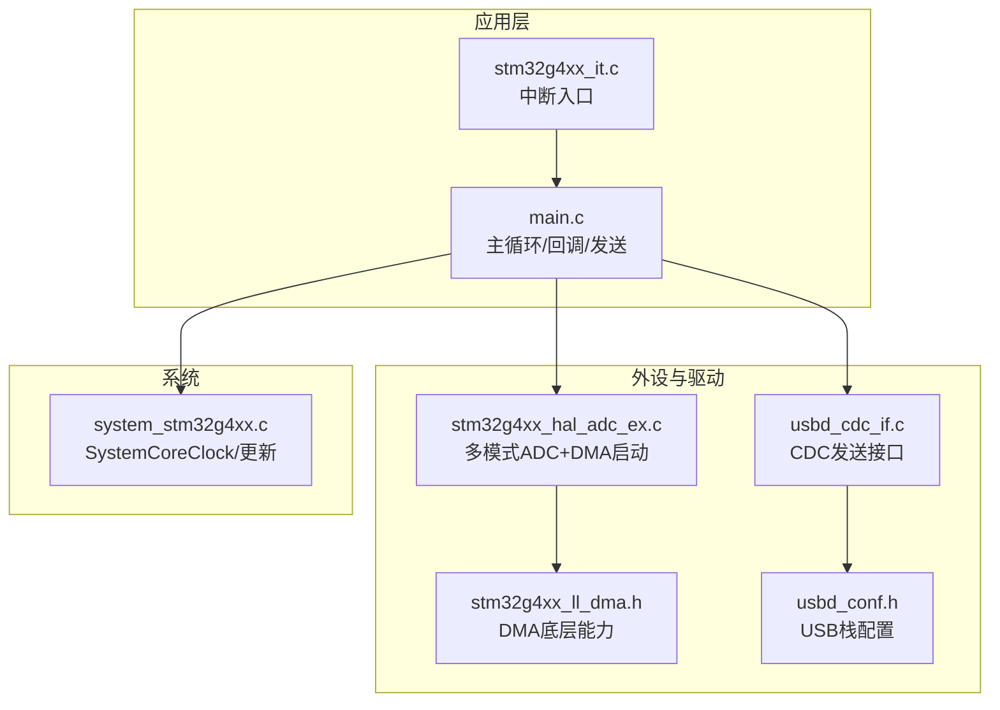
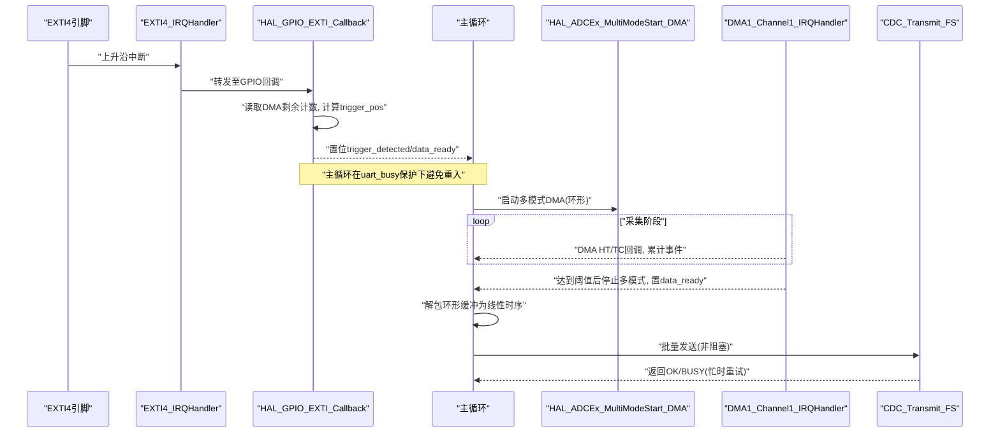
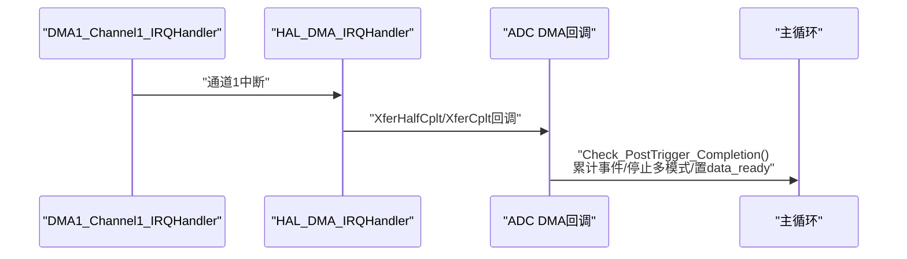
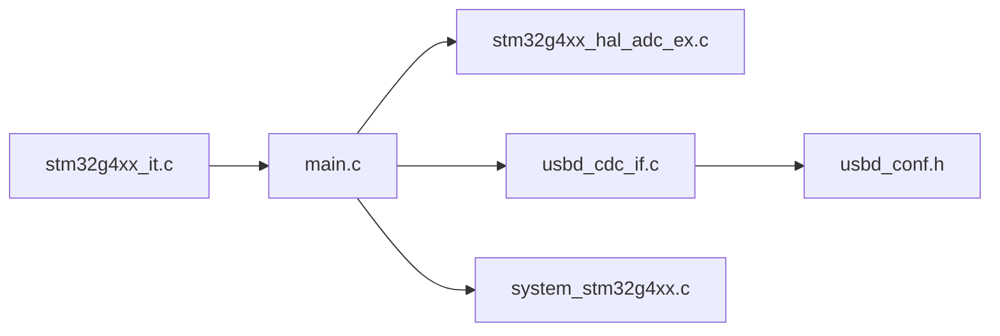

# CPU性能分析

<cite>
**本文引用的文件**   
- [main.c](file://Core/Src/main.c)
- [stm32g4xx_it.c](file://Core/Src/stm32g4xx_it.c)
- [system_stm32g4xx.c](file://Core/Src/system_stm32g4xx.c)
- [usbd_cdc_if.c](file://USB_Device/App/usbd_cdc_if.c)
- [usbd_cdc_if.h](file://USB_Device/App/usbd_cdc_if.h)
- [usbd_conf.h](file://USB_Device/Target/usbd_conf.h)
- [stm32g4xx_hal_adc_ex.c](file://Drivers/STM32G4xx_HAL_Driver/Src/stm32g4xx_hal_adc_ex.c)
- [stm32g4xx_ll_dma.h](file://Drivers/STM32G4xx_HAL_Driver/Inc/stm32g4xx_ll_dma.h)
</cite>

## 目录
1. [引言](#引言)
2. [项目结构](#项目结构)
3. [核心组件](#核心组件)
4. [架构总览](#架构总览)
5. [详细组件分析](#详细组件分析)
6. [依赖关系分析](#依赖关系分析)
7. [性能考量与基准](#性能考量与基准)
8. [故障排查指南](#故障排查指南)
9. [结论](#结论)
10. [附录](#附录)

## 引言
本指南面向嵌入式开发者，围绕STM32G474在双ADC交错采样、DMA环形缓冲、EXTI触发与USB CDC传输的系统中，提供CPU性能分析与优化方法。重点覆盖：
- 主循环执行时间与中断服务程序（ISR）开销
- HAL_ADCEx_MultiModeStart_DMA调用路径与DMA回调开销
- USB CDC传输延迟与端点缓冲区特性
- SystemClock_Config中PLL配置对CPU频率的影响（SYSCLK=75MHz）
- CPU占用率测量方法（SysTick与性能计数器）
- 中断优先级对实时性的影响（DMA1_Channel1_IRQn与EXTI4_IRQn）
- 无阻塞数据传输机制与USB端点缓冲区的性能特点
- 性能基准测试建议（中断响应时间、数据处理吞吐量、系统负载）

## 项目结构
本项目采用分层组织：应用层（main.c）、中断处理（stm32g4xx_it.c）、时钟系统（system_stm32g4xx.c）、USB CDC类接口（usbd_cdc_if.*）、HAL驱动（stm32g4xx_hal_adc_ex.c等）。关键数据流为：
- ADC1/ADC2通过多模式交错采样，经DMA写入环形缓冲
- EXTI4上升沿捕获触发时刻，结合DMA剩余计数定位触发位置
- 主循环检测标志后解包环形缓冲，并通过USB CDC发送

图表来源 
- [main.c:249-287](file://Core/Src/main.c#L249-L287)
- [stm32g4xx_it.c:205-228](file://Core/Src/stm32g4xx_it.c#L205-L228)
- [stm32g4xx_hal_adc_ex.c:862-966](file://Drivers/STM32G4xx_HAL_Driver/Src/stm32g4xx_hal_adc_ex.c#L862-L966)
- [usbd_cdc_if.c:281-293](file://USB_Device/App/usbd_cdc_if.c#L281-L293)
- [usbd_conf.h:108-108](file://USB_Device/Target/usbd_conf.h#L108-L108)
- [system_stm32g4xx.c:230-272](file://Core/Src/system_stm32g4xx.c#L230-L272)

章节来源
- [main.c:219-290](file://Core/Src/main.c#L219-L290)
- [stm32g4xx_it.c:184-228](file://Core/Src/stm32g4xx_it.c#L184-L228)
- [system_stm32g4xx.c:230-272](file://Core/Src/system_stm32g4xx.c#L230-L272)

## 核心组件
- 主循环与状态机：等待data_ready标志，快照trigger_pos并重建线性时序，随后通过USB CDC发送，再重启ADC DMA采集。
- 中断与回调：
  - EXTI4_IRQHandler -> HAL_GPIO_EXTI_Callback：读取DMA剩余计数计算触发位置，设置触发标志。
  - DMA1_Channel1_IRQHandler -> HAL_DMA_IRQHandler -> ADC DMA回调：统计HT/TC事件以判定完成并停止多模式转换。
- USB CDC：CDC_Transmit_FS将数据放入IN端点队列；若忙则返回BUSY，上层需重试或轮询。
- 时钟系统：SystemClock_Config配置HSI作为PLL源，分频得到目标SYSCLK；SystemCoreClockUpdate根据RCC寄存器计算实际核心频率。

章节来源
- [main.c:91-131](file://Core/Src/main.c#L91-L131)
- [main.c:156-212](file://Core/Src/main.c#L156-L212)
- [stm32g4xx_it.c:205-228](file://Core/Src/stm32g4xx_it.c#L205-L228)
- [usbd_cdc_if.c:281-293](file://USB_Device/App/usbd_cdc_if.c#L281-L293)
- [system_stm32g4xx.c:296-337](file://Core/Src/system_stm32g4xx.c#L296-L337)

## 架构总览
下图展示从EXTI触发到USB发送的关键时序与组件交互。

图表来源 
- [main.c:91-131](file://Core/Src/main.c#L91-L131)
- [main.c:249-287](file://Core/Src/main.c#L249-L287)
- [stm32g4xx_it.c:205-228](file://Core/Src/stm32g4xx_it.c#L205-L228)
- [stm32g4xx_hal_adc_ex.c:862-966](file://Drivers/STM32G4xx_HAL_Driver/Src/stm32g4xx_hal_adc_ex.c#L862-L966)
- [usbd_cdc_if.c:281-293](file://USB_Device/App/usbd_cdc_if.c#L281-L293)

## 详细组件分析

### 主循环执行时间与关键路径
- 关键路径包括：标志检查、snapshot trigger_pos、解包环形缓冲、构建输出缓冲、USB CDC发送、重启ADC DMA。
- 耗时热点：
  - 解包循环：按CIRCULAR_BUFFER_SIZE遍历，拆分高低16位，填充decoded_signal。
  - 文本格式化：将每个样本转为十进制字符串并追加换行，形成约1440字节输出。
  - USB发送：CDC_Transmit_FS可能返回BUSY，需要重试；实际发送由USB栈异步完成。
- 优化建议：
  - 使用固定宽度格式或二进制协议减少格式化开销。
  - 分段发送，降低单次缓冲大小与锁竞争。
  - 在主循环外进行数据预处理，缩短临界区。

章节来源
- [main.c:156-212](file://Core/Src/main.c#L156-L212)
- [main.c:264-287](file://Core/Src/main.c#L264-L287)

### 中断服务程序与回调开销
- EXTI4_IRQHandler：仅转发到HAL GPIO回调，最小化中断上下文工作。
- HAL_GPIO_EXTI_Callback：
  - 快速读取__HAL_DMA_GET_COUNTER(&hdma_adc1)，计算trigger_pos。
  - 设置trigger_detected与post_trigger_dma_events初始值。
- DMA1_Channel1_IRQHandler：
  - 转发到HAL_DMA_IRQHandler，最终进入ADC DMA回调。
  - Check_PostTrigger_Completion统计HT/TC事件，达到阈值后停止多模式并置data_ready。
- 实时性要点：
  - 回调内避免复杂逻辑与阻塞操作。
  - 使用volatile变量跨ISR与主循环通信。
  - 注意NDTR重载瞬态导致的remaining==0边界保护。

章节来源
- [stm32g4xx_it.c:205-228](file://Core/Src/stm32g4xx_it.c#L205-L228)
- [main.c:91-131](file://Core/Src/main.c#L91-L131)

#### 中断处理序列图

图表来源 
- [stm32g4xx_it.c:219-228](file://Core/Src/stm32g4xx_it.c#L219-L228)
- [main.c:119-131](file://Core/Src/main.c#L119-L131)

### HAL_ADCEx_MultiModeStart_DMA调用开销
- 功能：启用主从ADC、设置DMA回调、启动DMA、启动ADC转换。
- 关键步骤：
  - 参数校验与互斥锁保护。
  - 获取从ADC句柄并启用外设。
  - 绑定DMA回调（半传/全传/错误）。
  - 清除标志、解锁、开启OVR中断、启动DMA、启动ADC。
- 性能特征：
  - 首次启动涉及外设使能、DMA配置与中断注册，存在一定开销。
  - 后续重启仅需DMA与ADC启动，开销较低。
  - 建议在空闲时段或低负载时调用，避免与高优先级任务竞争。

章节来源
- [stm32g4xx_hal_adc_ex.c:862-966](file://Drivers/STM32G4xx_HAL_Driver/Src/stm32g4xx_hal_adc_ex.c#L862-L966)
- [main.c:249-254](file://Core/Src/main.c#L249-L254)

### USB CDC传输延迟与端点缓冲区
- CDC_Transmit_FS：
  - 检查TxState，若忙返回USBD_BUSY。
  - 设置发送缓冲并调用USBD_CDC_TransmitPacket，交由USB栈异步发送。
- 端点缓冲区：
  - APP_TX_DATA_SIZE=2048字节，决定一次可提交的最大数据量。
  - 大缓冲可降低频繁提交次数，但会增加内存占用与首包延迟。
- 延迟来源：
  - USB枚举与链路建立（首次）。
  - 主机侧接收速率与PC端软件吞吐。
  - 设备端USB中断处理与DMA搬运。
- 优化建议：
  - 控制单次发送长度，避免超过端点最大包长。
  - 使用非阻塞重试策略，避免长时间阻塞主循环。
  - 考虑批量打包与压缩，减少协议开销。

章节来源
- [usbd_cdc_if.c:281-293](file://USB_Device/App/usbd_cdc_if.c#L281-L293)
- [usbd_cdc_if.h:51-53](file://USB_Device/App/usbd_cdc_if.h#L51-L53)
- [usbd_conf.h:108-108](file://USB_Device/Target/usbd_conf.h#L108-L108)

### SystemClock_Config与PLL配置（SYSCLK=75MHz）
- 当前配置：
  - HSI作为PLL源，PLL分频系数M/N/P/Q/R，选择PLLR输出至SYSCLK。
  - AHB/APB分频均为1，确保外设时钟与核心同步。
- 频率计算：
  - SystemCoreClockUpdate依据RCC寄存器动态计算SYSCLK/HCLK。
  - 当SYSCLK=75MHz时，Flash等待周期需匹配（FLASH_LATENCY_1）。
- 性能影响：
  - 更高的SYSCLK提升指令吞吐，但也增加功耗与发热。
  - 外设如USB FS要求48MHz参考时钟，需确保HSI48可用或外部晶振配置正确。

章节来源
- [main.c:296-337](file://Core/Src/main.c#L296-L337)
- [system_stm32g4xx.c:230-272](file://Core/Src/system_stm32g4xx.c#L230-L272)

### 中断优先级与实时性
- 当前设置：
  - DMA1_Channel1_IRQn优先级设为最高（0,0）。
  - EXTI4_IRQn优先级设为最高（0,0）。
- 调度影响：
  - 同优先级中断按向量表顺序抢占，可能导致抖动。
  - 建议区分优先级：EXTI用于精确触发定位，DMA用于数据搬运，USB用于周期性维护。
- DMA通道优先级：
  - LL_DMA_SetChannelPriorityLevel可调整DMA通道优先级，影响总线仲裁与数据搬运及时性。

章节来源
- [main.c:477-479](file://Core/Src/main.c#L477-L479)
- [main.c:505-506](file://Core/Src/main.c#L505-L506)
- [stm32g4xx_ll_dma.h:944-949](file://Drivers/STM32G4xx_HAL_Driver/Inc/stm32g4xx_ll_dma.h#L944-L949)

### 无阻塞数据传输机制
- 数据采集：
  - ADC多模式+DMA环形缓冲，无需CPU参与每样本搬运。
  - 回调仅在HT/TC时触发，主循环按需处理。
- 数据传输：
  - CDC_Transmit_FS非阻塞，失败返回BUSY，上层重试。
  - 主循环在uart_busy期间屏蔽EXTI触发，避免重入与数据竞争。
- 优点：
  - 降低CPU占用，提高系统响应性。
  - 适合高频采样与大数据量传输场景。

章节来源
- [main.c:249-287](file://Core/Src/main.c#L249-L287)
- [usbd_cdc_if.c:281-293](file://USB_Device/App/usbd_cdc_if.c#L281-L293)

## 依赖关系分析
- main.c依赖：
  - HAL ADC扩展API（多模式DMA启动/停止）
  - USB CDC接口（发送）
  - GPIO与NVIC（EXTI与DMA中断）
- stm32g4xx_it.c依赖：
  - HAL GPIO/DMA/PCD中断处理
- usbd_cdc_if.c依赖：
  - USB设备库与配置宏（缓冲大小、延时）
- system_stm32g4xx.c提供：
  - SystemCoreClock变量与更新函数，供SysTick与定时器配置

图表来源 
- [main.c:249-287](file://Core/Src/main.c#L249-L287)
- [stm32g4xx_it.c:205-228](file://Core/Src/stm32g4xx_it.c#L205-L228)
- [usbd_cdc_if.c:281-293](file://USB_Device/App/usbd_cdc_if.c#L281-L293)
- [usbd_conf.h:108-108](file://USB_Device/Target/usbd_conf.h#L108-L108)
- [system_stm32g4xx.c:230-272](file://Core/Src/system_stm32g4xx.c#L230-L272)

## 性能考量与基准

### CPU占用率测量方法
- 基于SysTick：
  - 在SysTick_Handler中递增全局tick，主循环记录前后tick差估算忙时比例。
  - 注意中断嵌套与高精度需求下的误差。
- 基于性能计数器（DWT/PMU）：
  - 使用ARM Cortex-M4的性能监控单元（如Cycle Counter）统计关键路径周期数。
  - 对比不同配置（PLL频率、USB缓冲大小）下的周期消耗。
- 建议指标：
  - 主循环平均占用率、峰值占用率
  - ISR平均执行时间与尾调用开销
  - USB发送成功/重试比率

章节来源
- [stm32g4xx_it.c:184-193](file://Core/Src/stm32g4xx_it.c#L184-L193)

### 中断响应时间与抖动
- 测量方法：
  - 在EXTI引脚施加已知边沿，用示波器或逻辑分析仪测量从边沿到EXTI4_IRQHandler入口的时间。
  - 比较不同优先级组合下的响应时间与抖动。
- 影响因素：
  - 中断嵌套与同级抢占
  - 总线仲裁与缓存命中
  - 外设使能与DMA初始化开销

章节来源
- [main.c:477-479](file://Core/Src/main.c#L477-L479)
- [main.c:505-506](file://Core/Src/main.c#L505-L506)

### 数据处理吞吐量
- 定义：单位时间内成功发送的样本数量或字节数。
- 瓶颈识别：
  - 文本格式化与缓冲构建
  - USB端点队列与主机接收速率
  - DMA回调与主循环协作效率
- 优化方向：
  - 二进制协议替代文本
  - 分段发送与批处理
  - 预分配缓冲与零拷贝策略

章节来源
- [main.c:178-212](file://Core/Src/main.c#L178-L212)
- [usbd_cdc_if.c:281-293](file://USB_Device/App/usbd_cdc_if.c#L281-L293)

### 系统负载分析
- 负载构成：
  - 主循环：解包、格式化、发送、重启DMA
  - 中断：EXTI定位、DMA回调、USB维护
- 分析方法：
  - 使用性能计数器统计各模块周期占比
  - 观察不同负载（采样率、发送速率）下的系统稳定性
- 目标：
  - 保持主循环空闲时间充足，避免溢出与丢包
  - 确保EXTI与DMA回调满足实时性约束

章节来源
- [main.c:264-287](file://Core/Src/main.c#L264-L287)
- [stm32g4xx_it.c:205-228](file://Core/Src/stm32g4xx_it.c#L205-L228)

## 故障排查指南
- USB发送失败：
  - 检查CDC_Transmit_FS返回值是否为BUSY，确认主机是否就绪。
  - 增大APP_TX_DATA_SIZE或分段发送以降低拥塞。
- DMA回调未触发：
  - 确认DMA通道已使能且优先级合理。
  - 检查ADC多模式配置与DMA环形模式是否正确。
- 触发位置不准：
  - 验证__HAL_DMA_GET_COUNTER读取时机，避免NDTR重载瞬态。
  - 增加边界保护与去抖逻辑。
- 时钟异常：
  - 确认SystemCoreClockUpdate被调用或在时钟变更后重新计算。
  - 核对Flash等待周期与目标频率匹配。

章节来源
- [usbd_cdc_if.c:281-293](file://USB_Device/App/usbd_cdc_if.c#L281-L293)
- [main.c:91-131](file://Core/Src/main.c#L91-L131)
- [system_stm32g4xx.c:230-272](file://Core/Src/system_stm32g4xx.c#L230-L272)

## 结论
通过在关键路径引入非阻塞机制、合理设置中断优先级与DMA通道优先级、优化USB缓冲与协议格式，可以显著提升系统的实时性与吞吐量。结合SysTick与性能计数器进行量化评估，有助于持续迭代优化。对于初学者，建议从基础工具入手；对于高级开发者，应深入剖析硬件细节与系统级瓶颈，制定针对性优化策略。

## 附录
- 术语说明：
  - SYSCLK：系统时钟，驱动CPU与AHB总线
  - HCLK：AHB时钟，通常等于SYSCLK
  - PCLK1/PCLK2：APB1/APB2外设时钟
  - DMA：直接存储器访问，减轻CPU负担
  - CDC：USB通信设备类，虚拟串口
- 参考实现路径：
  - 多模式ADC+DMA启动：[stm32g4xx_hal_adc_ex.c:862-966](file://Drivers/STM32G4xx_HAL_Driver/Src/stm32g4xx_hal_adc_ex.c#L862-L966)
  - USB CDC发送接口：[usbd_cdc_if.c:281-293](file://USB_Device/App/usbd_cdc_if.c#L281-L293)
  - 系统时钟更新：[system_stm32g4xx.c:230-272](file://Core/Src/system_stm32g4xx.c#L230-L272)