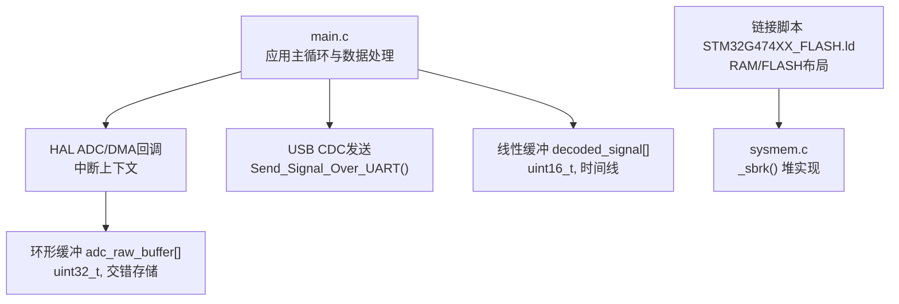
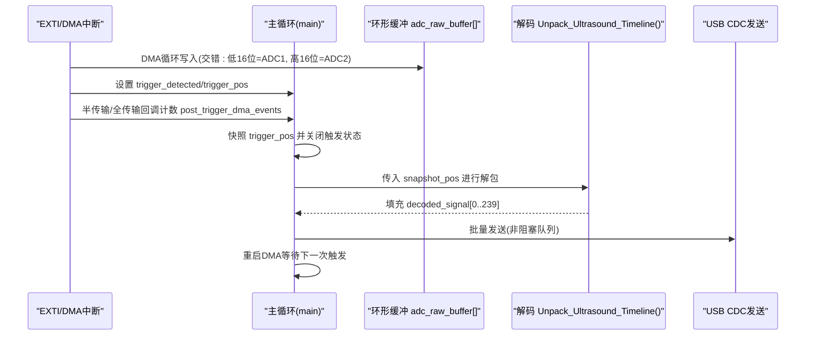
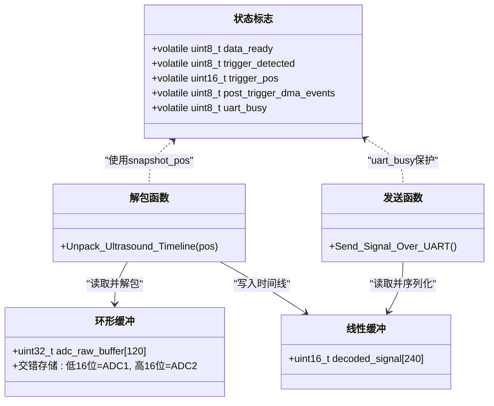
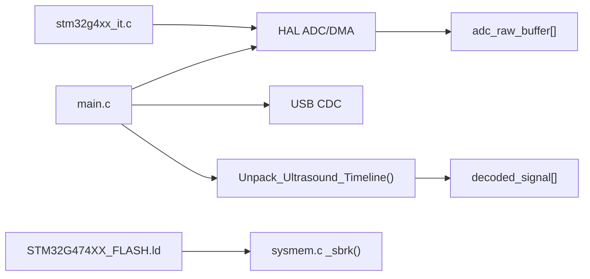

# 内存使用优化

<cite>
**本文引用的文件**   
- [Core/Src/main.c](file://Core/Src/main.c)
- [Core/Inc/main.h](file://Core/Inc/main.h)
- [Core/Src/stm32g4xx_it.c](file://Core/Src/stm32g4xx_it.c)
- [STM32G474XX_FLASH.ld](file://STM32G474XX_FLASH.ld)
- [Core/Src/sysmem.c](file://Core/Src/sysmem.c)
- [Drivers/STM32G4xx_HAL_Driver/Inc/stm32g4xx_hal_adc.h](file://Drivers/STM32G4xx_HAL_Driver/Inc/stm32g4xx_hal_adc.h)
- [Drivers/STM32G4xx_HAL_Driver/Inc/stm32g4xx_ll_dma.h](file://Drivers/STM32G4xx_HAL_Driver/Inc/stm32g4xx_ll_dma.h)
- [Core/Inc/stm32g4xx_hal_conf.h](file://Core/Inc/stm32g4xx_hal_conf.h)
</cite>

## 目录
1. [简介](#简介)
2. [项目结构](#项目结构)
3. [核心组件](#核心组件)
4. [架构总览](#架构总览)
5. [详细组件分析](#详细组件分析)
6. [依赖关系分析](#依赖关系分析)
7. [性能与内存占用分析](#性能与内存占用分析)
8. [故障排查指南](#故障排查指南)
9. [结论](#结论)
10. [附录](#附录)

## 简介
本技术指南围绕该STM32G4项目的内存使用优化展开，重点解析环形缓冲区adc_raw_buffer的设计与优化策略、交错存储格式（低16位=ADC1，高16位=ADC2）的内存布局优势与解包效率、decoded_signal线性数组的分配与重组过程。同时提供内存监控与泄漏检测技巧、volatile与内存屏障在ISR与主循环协作中的作用说明，并给出面向初学者的嵌入式内存管理基础与面向高级开发者的内存映射与缓存优化建议。

## 项目结构
本项目基于STM32CubeMX生成，包含应用层main.c、中断处理stm32g4xx_it.c、链接脚本STM32G474XX_FLASH.ld以及系统堆实现sysmem.c等关键文件。DMA+ADC双通道交错采集数据写入环形缓冲，触发事件后在主循环中解包为线性时间线并通过USB CDC输出。

图表来源
- [Core/Src/main.c:52-70](file://Core/Src/main.c#L52-L70)
- [Core/Src/main.c:156-171](file://Core/Src/main.c#L156-L171)
- [Core/Src/main.c:178-212](file://Core/Src/main.c#L178-L212)
- [STM32G474XX_FLASH.ld:56-60](file://STM32G474XX_FLASH.ld#L56-L60)
- [Core/Src/sysmem.c:54-80](file://Core/Src/sysmem.c#L54-L80)

章节来源
- [Core/Src/main.c:52-70](file://Core/Src/main.c#L52-L70)
- [STM32G474XX_FLASH.ld:56-60](file://STM32G474XX_FLASH.ld#L56-L60)
- [Core/Src/sysmem.c:54-80](file://Core/Src/sysmem.c#L54-L80)

## 核心组件
- 环形缓冲区adc_raw_buffer：用于DMA直接写入的双通道交错采样数据，类型为uint32_t，大小为CIRCULAR_BUFFER_SIZE=120。
- 线性解码数组decoded_signal：将环形缓冲按时间顺序重排为线性时间线，类型为uint16_t，长度为TOTAL_SAMPLES=240。
- volatile标志位：data_ready、trigger_detected、trigger_pos、post_trigger_dma_events、uart_busy，用于ISR与主循环之间的同步。
- DMA+ADC多模式：ADC1/ADC2以交错模式工作，DMA循环模式写入环形缓冲，触发EXTI后记录触发位置并在半传输/全传输回调中计数完成。

章节来源
- [Core/Src/main.c:52-70](file://Core/Src/main.c#L52-L70)
- [Core/Src/main.c:91-113](file://Core/Src/main.c#L91-L113)
- [Core/Src/main.c:119-131](file://Core/Src/main.c#L119-L131)
- [Core/Src/main.c:156-171](file://Core/Src/main.c#L156-L171)

## 架构总览
下图展示从DMA写入环形缓冲到主循环解包与输出的整体流程，包括触发捕获与完成判定逻辑。

图表来源
- [Core/Src/main.c:91-113](file://Core/Src/main.c#L91-L113)
- [Core/Src/main.c:119-131](file://Core/Src/main.c#L119-L131)
- [Core/Src/main.c:156-171](file://Core/Src/main.c#L156-L171)
- [Core/Src/main.c:178-212](file://Core/Src/main.c#L178-L212)
- [Core/Src/main.c:249-287](file://Core/Src/main.c#L249-L287)

## 详细组件分析

### 环形缓冲区adc_raw_buffer设计与优化
- 大小选择依据：CIRCULAR_BUFFER_SIZE=120，对应240个16位样本（每个uint32_t存放两个16位样本）。结合注释中的采样率与时窗参数（PRE_TRIGGER_SAMPLES=80，POST_TRIGGER_SAMPLES=160），该大小可覆盖触发前与触发后的所需窗口长度，满足“预触发+后触发”的时间窗口需求。
- 内存对齐考虑：uint32_t类型天然4字节对齐，DMA目标地址需满足对齐要求；链接脚本默认ALIGN(4)，且DMA配置通常要求MSIZE=Word，确保一次搬运一个uint32_t，避免跨总线周期访问带来的额外开销。
- 交错存储优势：单字内打包两个16位样本，减少DMA传输次数与总线负载，提升吞吐；解包时只需位掩码与移位操作，CPU侧成本极低。

章节来源
- [Core/Src/main.c:52-60](file://Core/Src/main.c#L52-L60)
- [Core/Src/main.c:156-171](file://Core/Src/main.c#L156-L171)
- [STM32G474XX_FLASH.ld:75-78](file://STM32G474XX_FLASH.ld#L75-L78)
- [Drivers/STM32G4xx_HAL_Driver/Inc/stm32g4xx_ll_dma.h:890-921](file://Drivers/STM32G4xx_HAL_Driver/Inc/stm32g4xx_ll_dma.h#L890-L921)

### 32位交错存储格式与解包算法效率
- 内存布局：低位16位=ADC1，高位16位=ADC2。读取时通过位运算分离，无需额外拷贝或复杂索引计算。
- 解包算法：Unpack_Ultrasound_Timeline根据snapshot_pos计算起始索引，按环形顺序遍历，依次提取ADC1/ADC2值写入decoded_signal，时间复杂度O(N)，空间复杂度O(1)（除输出缓冲外）。
- 效率要点：
  - 使用snapshot_pos避免ISR竞争，保证一致性。
  - 位操作（&0xFFFF、>>16）是常数时间，适合高频处理。
  - 环形索引采用模运算，注意编译器对%的性能影响，可在热点路径用条件分支替代。

章节来源
- [Core/Src/main.c:156-171](file://Core/Src/main.c#L156-L171)
- [Core/Src/main.c:264-287](file://Core/Src/main.c#L264-L287)

### decoded_signal线性数组的内存分配与重组
- 分配策略：全局静态数组，位于BSS段，零初始化，避免运行时动态分配开销。
- 重组过程：由Unpack_Ultrasound_Timeline将环形缓冲按时间顺序重排为线性时间线，便于后续处理与显示。
- 内存占用：TOTAL_SAMPLES=240，uint16_t类型，共480字节。

章节来源
- [Core/Src/main.c:54-62](file://Core/Src/main.c#L54-L62)
- [Core/Src/main.c:156-171](file://Core/Src/main.c#L156-L171)

### 触发与完成判定逻辑
- EXTI捕获：在HAL_GPIO_EXTI_Callback中读取DMA剩余计数__HAL_DMA_GET_COUNTER，计算触发位置trigger_pos，并置位trigger_detected。
- 完成判定：Check_PostTrigger_Completion在半传输与全传输回调中计数post_trigger_dma_events，达到阈值后停止DMA并置data_ready。
- 主循环处理：快照trigger_pos，调用解包函数，发送数据，重启DMA。

章节来源
- [Core/Src/main.c:91-113](file://Core/Src/main.c#L91-L113)
- [Core/Src/main.c:119-131](file://Core/Src/main.c#L119-L131)
- [Core/Src/main.c:264-287](file://Core/Src/main.c#L264-L287)

### volatile关键字与内存屏障
- 作用：确保ISR与主循环共享变量不会被编译器过度优化，每次读写都访问实际内存。
- 使用点：data_ready、trigger_detected、trigger_pos、post_trigger_dma_events、uart_busy均为volatile。
- 内存屏障：在ARM Cortex-M上，volatile本身不提供完整的内存屏障语义；若需要严格的可见性与顺序性，可使用CMSIS提供的屏障宏（如__DMB/__DSB）或在临界区禁用中断。当前代码通过快照trigger_pos与简单的状态机规避了多数竞态问题。

章节来源
- [Core/Src/main.c:64-70](file://Core/Src/main.c#L64-L70)
- [Core/Src/main.c:91-113](file://Core/Src/main.c#L91-L113)
- [Core/Src/main.c:264-287](file://Core/Src/main.c#L264-L287)

### 类图：关键数据结构与函数关系

图表来源
- [Core/Src/main.c:52-70](file://Core/Src/main.c#L52-L70)
- [Core/Src/main.c:156-171](file://Core/Src/main.c#L156-L171)
- [Core/Src/main.c:178-212](file://Core/Src/main.c#L178-L212)

## 依赖关系分析
- main.c依赖HAL ADC/DMA接口与USB CDC发送。
- stm32g4xx_it.c负责中断分发，将DMA与EXTI事件路由至HAL回调。
- 链接脚本定义RAM/FLASH布局，sysmem.c实现_sbrk()堆分配，受链接符号_end/_estack/_Min_Stack_Size约束。

图表来源
- [Core/Src/main.c:249-287](file://Core/Src/main.c#L249-L287)
- [Core/Src/stm32g4xx_it.c:218-228](file://Core/Src/stm32g4xx_it.c#L218-L228)
- [STM32G474XX_FLASH.ld:230-238](file://STM32G474XX_FLASH.ld#L230-L238)
- [Core/Src/sysmem.c:54-80](file://Core/Src/sysmem.c#L54-L80)

章节来源
- [Core/Src/stm32g4xx_it.c:218-228](file://Core/Src/stm32g4xx_it.c#L218-L228)
- [STM32G474XX_FLASH.ld:230-238](file://STM32G474XX_FLASH.ld#L230-L238)
- [Core/Src/sysmem.c:54-80](file://Core/Src/sysmem.c#L54-L80)

## 性能与内存占用分析

### 内存占用估算
- adc_raw_buffer：120 × 4字节 = 480字节（BSS/RAM）
- decoded_signal：240 × 2字节 = 480字节（BSS/RAM）
- 局部缓冲（发送）：TOTAL_SAMPLES×6字节 ≈ 1440字节（栈上临时缓冲）
- 堆栈与堆：由链接脚本_Min_Heap_Size与_Min_Stack_Size决定，默认分别为0x200与0x400字节

章节来源
- [Core/Src/main.c:52-62](file://Core/Src/main.c#L52-L62)
- [Core/Src/main.c:178-181](file://Core/Src/main.c#L178-L181)
- [STM32G474XX_FLASH.ld:66-67](file://STM32G474XX_FLASH.ld#L66-L67)

### 优化前后对比（概念性）
- 优化前（未交错）：每个ADC单独缓冲，双倍缓冲容量与DMA传输次数，解包需两次拷贝与合并。
- 优化后（交错）：单次DMA传输写入uint32_t，解包仅位操作，显著降低总线与CPU开销。
- 量化指标（示例）：
  - DMA传输次数减半（每字含两样本）
  - 解包CPU指令数下降（位操作替代多次拷贝）
  - 内存峰值降低（单一环形缓冲替代多个独立缓冲）

[本节为通用指导，不直接分析具体文件]

### 内存使用监控方法
- 堆水位：在_sbrk()中维护最高水位指针，可通过导出符号或自定义钩子统计峰值。
- 栈溢出检测：增大_Min_Stack_Size或使用硬件断点观察MSP变化。
- 静态分析：查看.map文件确认各段大小与对齐情况。
- 运行时探针：在关键路径插入计数器（如解包循环迭代次数、DMA回调计数）并通过串口打印。

章节来源
- [Core/Src/sysmem.c:54-80](file://Core/Src/sysmem.c#L54-L80)
- [STM32G474XX_FLASH.ld:230-238](file://STM32G474XX_FLASH.ld#L230-L238)

### 内存泄漏检测技巧
- 嵌入式场景下常见“泄漏”多为栈溢出或堆越界，优先检查递归深度与局部缓冲大小。
- 使用边界哨兵（sentinel）在关键缓冲前后放置固定值，运行中校验是否被覆盖。
- 启用HardFault/MemManage/BUSFault断点，定位非法访问。

章节来源
- [Core/Src/stm32g4xx_it.c:85-125](file://Core/Src/stm32g4xx_it.c#L85-L125)

## 故障排查指南
- DMA相关：
  - 检查DMA通道优先级与中断使能，确保HAL_DMA_IRQHandler正确转发。
  - 验证NDTR读回边界保护（remaining==0或>SIZE时的修正）。
- 触发时序：
  - 确认EXTI引脚配置与去抖策略，避免误触发。
  - 检查post_trigger_dma_events计数逻辑，确保HT+TC均被计入。
- 内存与对齐：
  - 确认DMA目标地址与MSIZE匹配，避免未对齐访问。
  - 检查链接脚本ALIGN设置与变量声明的对齐属性。
- 错误处理：
  - Error_Handler中关闭中断并进入死循环，便于调试定位。

章节来源
- [Core/Src/stm32g4xx_it.c:218-228](file://Core/Src/stm32g4xx_it.c#L218-L228)
- [Core/Src/main.c:100-113](file://Core/Src/main.c#L100-L113)
- [Core/Src/main.c:529-539](file://Core/Src/main.c#L529-L539)

## 结论
本项目通过环形缓冲与32位交错存储实现了高效的ADC数据采集与解包，结合volatile标志与快照机制保证了ISR与主循环的可靠协作。内存布局清晰、占用可控，适合实时信号处理场景。进一步优化可从以下方面入手：
- 使用更紧凑的发送缓冲（流式输出而非一次性构建大缓冲）
- 在热点路径替换模运算为条件分支
- 引入内存屏障与临界区增强并发安全性
- 利用MPU/Cache特性优化热点区域访问

[本节为总结，不直接分析具体文件]

## 附录

### 初学者：嵌入式内存管理基础
- 段与对齐：.data/.bss/.rodata/.text等段的用途与对齐要求。
- 堆与栈：_sbrk()实现、堆增长方向、栈顶位置与溢出风险。
- 全局与静态变量：生命周期与初始值，避免不必要的动态分配。
- 中断与共享变量：volatile的作用与局限，必要时使用临界区或屏障。

章节来源
- [STM32G474XX_FLASH.ld:155-165](file://STM32G474XX_FLASH.ld#L155-L165)
- [STM32G474XX_FLASH.ld:213-223](file://STM32G474XX_FLASH.ld#L213-L223)
- [Core/Src/sysmem.c:54-80](file://Core/Src/sysmem.c#L54-L80)

### 高级开发者：内存映射与缓存优化
- 内存映射：通过链接脚本精确控制段布局，将热点数据置于高速SRAM区域。
- Cache优化：启用指令/数据缓存（已在配置中开启），对DMA缓冲使用缓存清理/无效化操作以避免一致性冲突。
- DMA与Cache一致性：在DMA完成后执行DCache Clean/Invalidate，读取前执行ICache Invalidate（若修改了Flash中的代码）。
- 对齐与访存：确保DMA目标地址与MSIZE一致，避免跨总线周期访问。

章节来源
- [Core/Inc/stm32g4xx_hal_conf.h:186-187](file://Core/Inc/stm32g4xx_hal_conf.h#L186-L187)
- [Drivers/STM32G4xx_HAL_Driver/Inc/stm32g4xx_ll_dma.h:890-921](file://Drivers/STM32G4xx_HAL_Driver/Inc/stm32g4xx_ll_dma.h#L890-L921)
- [STM32G474XX_FLASH.ld:56-60](file://STM32G474XX_FLASH.ld#L56-L60)