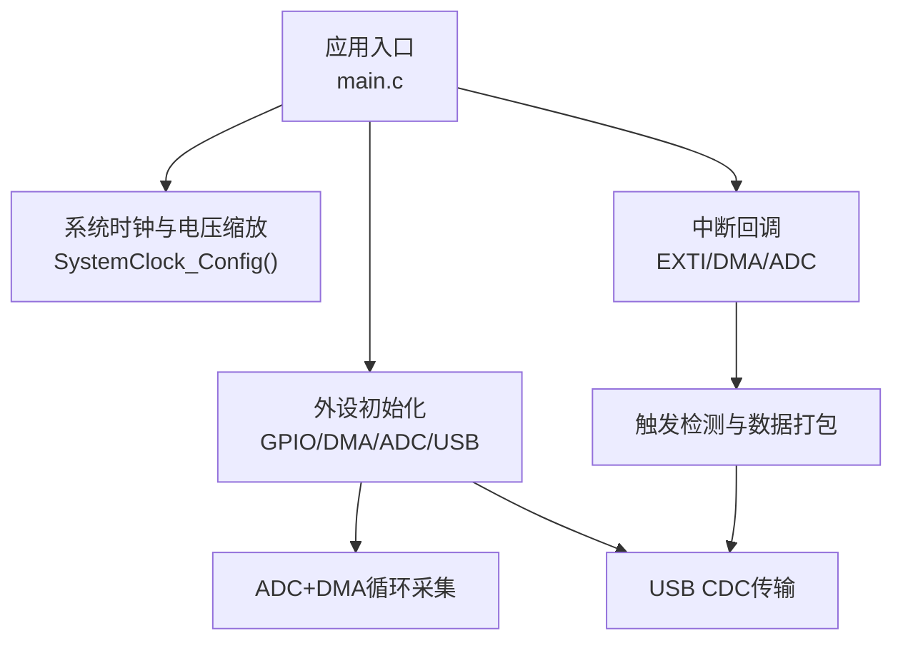
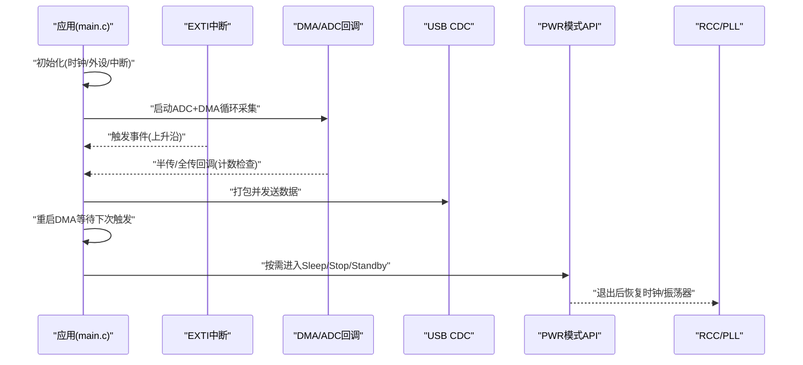
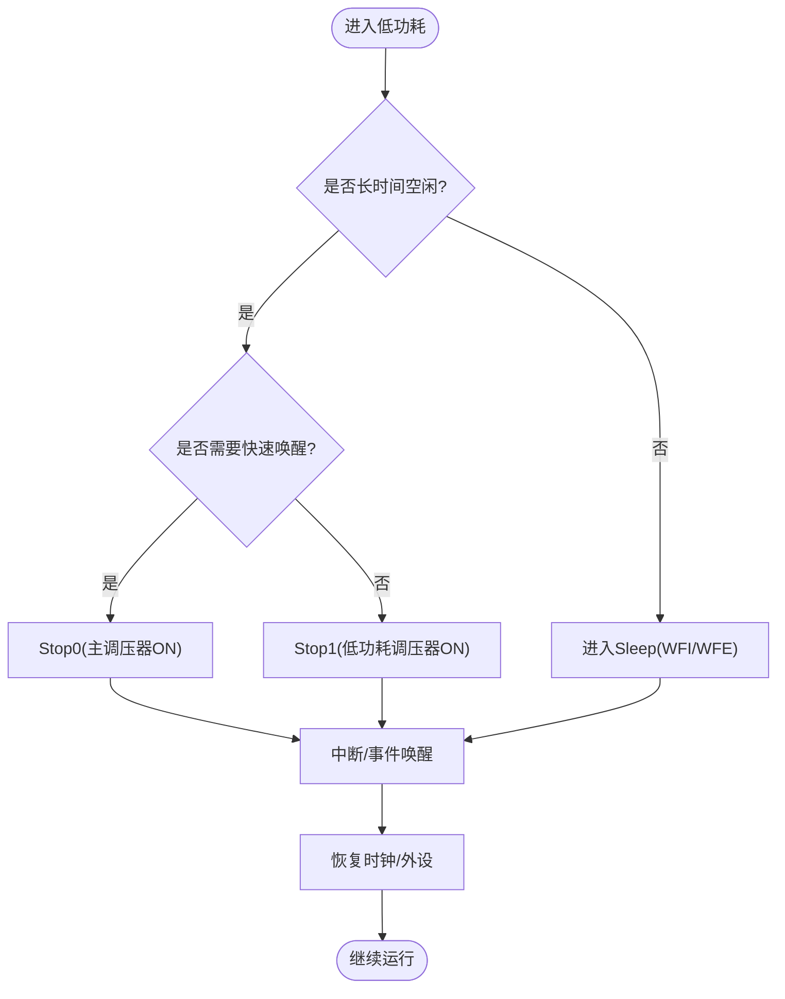
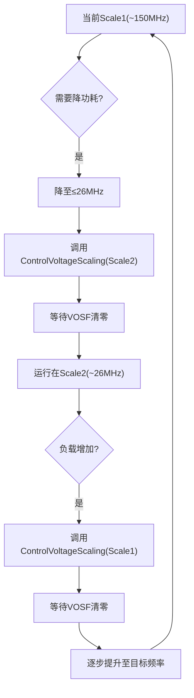
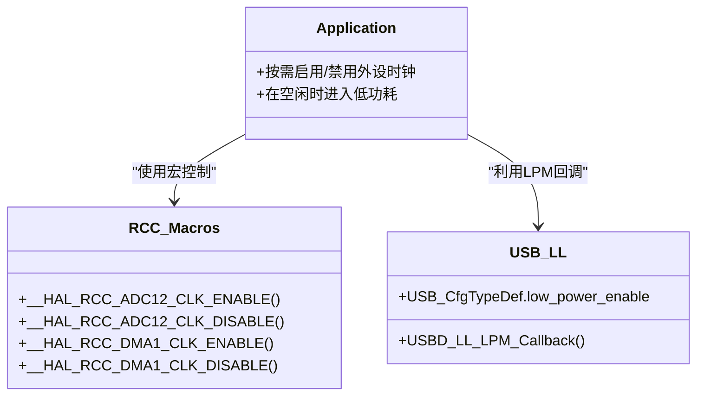
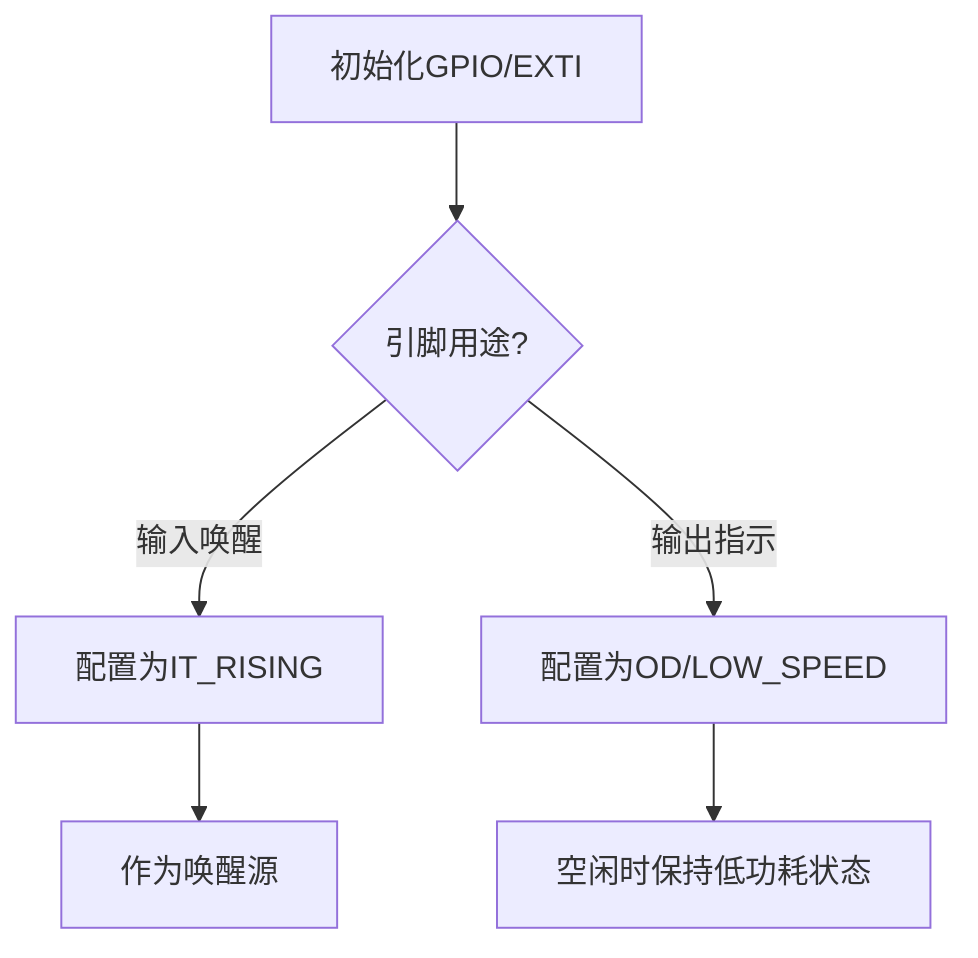
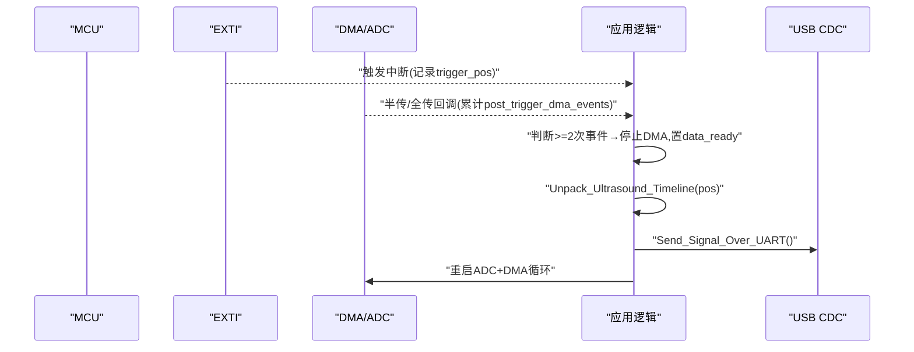
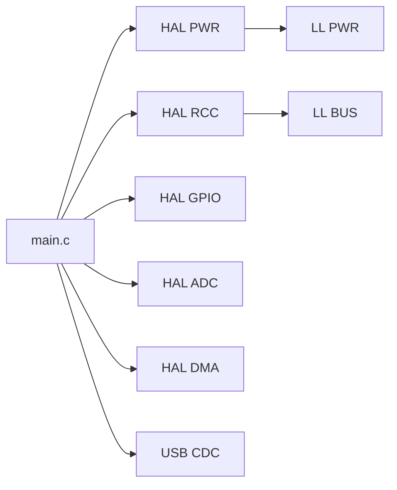

# 功耗优化策略

<cite>
**本文引用的文件**   
- [Core/Src/main.c](file://Core/Src/main.c)
- [Core/Inc/main.h](file://Core/Inc/main.h)
- [Drivers/STM32G4xx_HAL_Driver/Inc/stm32g4xx_hal_pwr.h](file://Drivers/STM32G4xx_HAL_Driver/Inc/stm32g4xx_hal_pwr.h)
- [Drivers/STM32G4xx_HAL_Driver/Inc/stm32g4xx_hal_pwr_ex.h](file://Drivers/STM32G4xx_HAL_Driver/Inc/stm32g4xx_hal_pwr_ex.h)
- [Drivers/STM32G4xx_HAL_Driver/Src/stm32g4xx_hal_pwr.c](file://Drivers/STM32G4xx_HAL_Driver/Src/stm32g4xx_hal_pwr.c)
- [Drivers/STM32G4xx_HAL_Driver/Src/stm32g4xx_hal_pwr_ex.c](file://Drivers/STM32G4xx_HAL_Driver/Src/stm32g4xx_hal_pwr_ex.c)
- [Drivers/STM32G4xx_HAL_Driver/Inc/stm32g4xx_ll_pwr.h](file://Drivers/STM32G4xx_HAL_Driver/Inc/stm32g4xx_ll_pwr.h)
- [Drivers/STM32G4xx_HAL_Driver/Inc/stm32g4xx_hal_rcc.h](file://Drivers/STM32G4xx_HAL_Driver/Inc/stm32g4xx_hal_rcc.h)
- [Drivers/STM32G4xx_HAL_Driver/Inc/stm32g4xx_ll_bus.h](file://Drivers/STM32G4xx_HAL_Driver/Inc/stm32g4xx_ll_bus.h)
- [Drivers/STM32G4xx_HAL_Driver/Inc/stm32g4xx_hal_gpio.h](file://Drivers/STM32G4xx_HAL_Driver/Inc/stm32g4xx_hal_gpio.h)
- [Drivers/STM32G4xx_HAL_Driver/Inc/stm32g4xx_ll_usb.h](file://Drivers/STM32G4xx_HAL_Driver/Inc/stm32g4xx_ll_usb.h)
- [USB_Device/Target/usbd_conf.c](file://USB_Device/Target/usbd_conf.c)
</cite>

## 目录
1. [简介](#简介)
2. [项目结构](#项目结构)
3. [核心组件](#核心组件)
4. [架构总览](#架构总览)
5. [详细组件分析](#详细组件分析)
6. [依赖关系分析](#依赖关系分析)
7. [性能与功耗考量](#性能与功耗考量)
8. [故障排查指南](#故障排查指南)
9. [结论](#结论)
10. [附录](#附录)

## 简介
本指导面向STM32G474的功耗优化，覆盖电源管理模式（睡眠、停止、待机）切换策略、PWR_REGULATOR_VOLTAGE_SCALE1电压调节器对功耗的影响、外设时钟门控（ADC/DMA/USB）、动态频率调节、低功耗GPIO与唤醒源设置、不同模式下的电流测量方法与基准测试，以及实际案例（空闲进入睡眠、数据采集时提升频率等）。文档同时为初学者提供基础概念，并为高级开发者给出深度电源管理与功耗分析技术。

## 项目结构
本项目基于STM32CubeMX生成的工程骨架，包含：
- 应用层：main.c实现系统初始化、ADC+DMA采集、USB CDC通信、中断处理等
- HAL驱动：PWR/RCC/GPIO/USB等模块接口
- USB设备库：CDC类与底层配置

图表来源
- [Core/Src/main.c:219-290](file://Core/Src/main.c#L219-L290)
- [Core/Src/main.c:296-337](file://Core/Src/main.c#L296-L337)
- [Core/Src/main.c:469-520](file://Core/Src/main.c#L469-L520)

章节来源
- [Core/Src/main.c:219-290](file://Core/Src/main.c#L219-L290)
- [Core/Src/main.c:296-337](file://Core/Src/main.c#L296-L337)
- [Core/Src/main.c:469-520](file://Core/Src/main.c#L469-L520)

## 核心组件
- 电源管理（PWR）：提供睡眠/停止/待机模式入口、唤醒引脚、PVD/PVM监控、电压缩放控制等
- 复位与时钟（RCC）：系统时钟树、PLL配置、AHB/APB外设时钟门控宏
- GPIO：中断引脚配置、输出速度/类型选择、低功耗状态保持
- ADC+DMA：双通道交错采样、环形缓冲、触发后数据重建
- USB CDC：设备枚举与数据传输，支持低功率模式回调

章节来源
- [Drivers/STM32G4xx_HAL_Driver/Inc/stm32g4xx_hal_pwr.h:376-384](file://Drivers/STM32G4xx_HAL_Driver/Inc/stm32g4xx_hal_pwr.h#L376-L384)
- [Drivers/STM32G4xx_HAL_Driver/Inc/stm32g4xx_hal_pwr_ex.h:635-660](file://Drivers/STM32G4xx_HAL_Driver/Inc/stm32g4xx_hal_pwr_ex.h#L635-L660)
- [Drivers/STM32G4xx_HAL_Driver/Inc/stm32g4xx_hal_rcc.h:516-584](file://Drivers/STM32G4xx_HAL_Driver/Inc/stm32g4xx_hal_rcc.h#L516-L584)
- [Drivers/STM32G4xx_HAL_Driver/Inc/stm32g4xx_ll_bus.h:451-458](file://Drivers/STM32G4xx_HAL_Driver/Inc/stm32g4xx_ll_bus.h#L451-L458)
- [Drivers/STM32G4xx_HAL_Driver/Inc/stm32g4xx_hal_gpio.h:47-63](file://Drivers/STM32G4xx_HAL_Driver/Inc/stm32g4xx_hal_gpio.h#L47-L63)
- [Core/Src/main.c:469-520](file://Core/Src/main.c#L469-L520)
- [USB_Device/Target/usbd_conf.c:716-723](file://USB_Device/Target/usbd_conf.c#L716-L723)

## 架构总览
下图展示从应用到硬件的关键路径：主循环等待数据就绪→中断捕获触发→DMA完成→USB发送；同时系统时钟与电压缩放由SystemClock_Config设定，PWR模式通过HAL API进入。

图表来源
- [Core/Src/main.c:86-149](file://Core/Src/main.c#L86-L149)
- [Core/Src/main.c:257-290](file://Core/Src/main.c#L257-L290)
- [Drivers/STM32G4xx_HAL_Driver/Src/stm32g4xx_hal_pwr.c:487-529](file://Drivers/STM32G4xx_HAL_Driver/Src/stm32g4xx_hal_pwr.c#L487-L529)
- [Drivers/STM32G4xx_HAL_Driver/Src/stm32g4xx_hal_pwr_ex.c:872-921](file://Drivers/STM32G4xx_HAL_Driver/Src/stm32g4xx_hal_pwr_ex.c#L872-L921)

## 详细组件分析

### 电源管理模式与切换策略
- 睡眠模式（Sleep）：CPU停止，外设仍运行，适合短空闲场景。可通过WFI/WFE进入。
- 停止模式（Stop0/Stop1）：VCORE域时钟停止，SRAM/寄存器保留，BOR可用。Stop0主调压器ON，Stop1低功耗调压器ON（唤醒延迟更大）。
- 待机模式（Standby）：调压器关闭（或低功耗），除备份域外内容丢失，唤醒功耗极低。

图表来源
- [Drivers/STM32G4xx_HAL_Driver/Inc/stm32g4xx_hal_pwr.h:376-384](file://Drivers/STM32G4xx_HAL_Driver/Inc/stm32g4xx_hal_pwr.h#L376-L384)
- [Drivers/STM32G4xx_HAL_Driver/Src/stm32g4xx_hal_pwr.c:487-529](file://Drivers/STM32G4xx_HAL_Driver/Src/stm32g4xx_hal_pwr.c#L487-L529)
- [Drivers/STM32G4xx_HAL_Driver/Src/stm32g4xx_hal_pwr_ex.c:872-921](file://Drivers/STM32G4xx_HAL_Driver/Src/stm32g4xx_hal_pwr_ex.c#L872-L921)

章节来源
- [Drivers/STM32G4xx_HAL_Driver/Inc/stm32g4xx_hal_pwr.h:376-384](file://Drivers/STM32G4xx_HAL_Driver/Inc/stm32g4xx_hal_pwr.h#L376-L384)
- [Drivers/STM32G4xx_HAL_Driver/Src/stm32g4xx_hal_pwr.c:487-529](file://Drivers/STM32G4xx_HAL_Driver/Src/stm32g4xx_hal_pwr.c#L487-L529)
- [Drivers/STM32G4xx_HAL_Driver/Src/stm32g4xx_hal_pwr_ex.c:872-921](file://Drivers/STM32G4xx_HAL_Driver/Src/stm32g4xx_hal_pwr_ex.c#L872-L921)

### 电压调节器与动态频率调节
- 电压缩放范围：
  - Scale1 Boost：典型1.28V，最高约170MHz
  - Scale1：典型1.2V，最高约150MHz
  - Scale2：典型1.0V，最高约26MHz
- 动态调整流程要点：
  - 从Scale1→Scale2前需先降频至≤26MHz
  - 从Scale2→Scale1后可逐步升频至150MHz
  - 使用HAL_PWREx_ControlVoltageScaling进行安全切换，注意VOSF标志位

图表来源
- [Drivers/STM32G4xx_HAL_Driver/Inc/stm32g4xx_hal_pwr_ex.h:635-660](file://Drivers/STM32G4xx_HAL_Driver/Inc/stm32g4xx_hal_pwr_ex.h#L635-L660)
- [Drivers/STM32G4xx_HAL_Driver/Src/stm32g4xx_hal_pwr_ex.c:128-197](file://Drivers/STM32G4xx_HAL_Driver/Src/stm32g4xx_hal_pwr_ex.c#L128-L197)
- [Core/Src/main.c:296-337](file://Core/Src/main.c#L296-L337)

章节来源
- [Drivers/STM32G4xx_HAL_Driver/Inc/stm32g4xx_hal_pwr_ex.h:635-660](file://Drivers/STM32G4xx_HAL_Driver/Inc/stm32g4xx_hal_pwr_ex.h#L635-L660)
- [Drivers/STM32G4xx_HAL_Driver/Src/stm32g4xx_hal_pwr_ex.c:128-197](file://Drivers/STM32G4xx_HAL_Driver/Src/stm32g4xx_hal_pwr_ex.c#L128-L197)
- [Core/Src/main.c:296-337](file://Core/Src/main.c#L296-L337)

### 外设时钟门控（ADC/DMA/USB）
- ADC/DMA：
  - 使用__HAL_RCC_ADC12_CLK_ENABLE/DISABLE与__HAL_RCC_DMA1_CLK_ENABLE/DISABLE宏进行按需开关
  - 空闲期关闭可显著降低功耗
- USB：
  - USB底层支持low_power_enable字段，配合USBD_LL_LPM_Callback可在挂起时进入低功耗
  - 唤醒后通过回调恢复系统时钟

图表来源
- [Drivers/STM32G4xx_HAL_Driver/Inc/stm32g4xx_hal_rcc.h:516-584](file://Drivers/STM32G4xx_HAL_Driver/Inc/stm32g4xx_hal_rcc.h#L516-L584)
- [Drivers/STM32G4xx_HAL_Driver/Inc/stm32g4xx_ll_bus.h:451-458](file://Drivers/STM32G4xx_HAL_Driver/Inc/stm32g4xx_ll_bus.h#L451-L458)
- [Drivers/STM32G4xx_HAL_Driver/Inc/stm32g4xx_ll_usb.h:54-76](file://Drivers/STM32G4xx_HAL_Driver/Inc/stm32g4xx_ll_usb.h#L54-L76)
- [USB_Device/Target/usbd_conf.c:716-723](file://USB_Device/Target/usbd_conf.c#L716-L723)

章节来源
- [Drivers/STM32G4xx_HAL_Driver/Inc/stm32g4xx_hal_rcc.h:516-584](file://Drivers/STM32G4xx_HAL_Driver/Inc/stm32g4xx_hal_rcc.h#L516-L584)
- [Drivers/STM32G4xx_HAL_Driver/Inc/stm32g4xx_ll_bus.h:451-458](file://Drivers/STM32G4xx_HAL_Driver/Inc/stm32g4xx_ll_bus.h#L451-L458)
- [Drivers/STM32G4xx_HAL_Driver/Inc/stm32g4xx_ll_usb.h:54-76](file://Drivers/STM32G4xx_HAL_Driver/Inc/stm32g4xx_ll_usb.h#L54-L76)
- [USB_Device/Target/usbd_conf.c:716-723](file://USB_Device/Target/usbd_conf.c#L716-L723)

### 低功耗GPIO与唤醒源设置
- GPIO配置要点：
  - 输入模式用于唤醒（如PA4设为上升沿中断）
  - 输出模式建议低速、开漏以降低翻转功耗
  - 未用引脚置为模拟或高阻态，避免悬空漏电
- 唤醒源：
  - EXTI外部中断（如PA4）
  - PWR唤醒引脚（WKUP1~WKUP5）
  - 内部唤醒线（可选）

图表来源
- [Core/Src/main.c:488-520](file://Core/Src/main.c#L488-L520)
- [Drivers/STM32G4xx_HAL_Driver/Inc/stm32g4xx_hal_gpio.h:116-131](file://Drivers/STM32G4xx_HAL_Driver/Inc/stm32g4xx_hal_gpio.h#L116-L131)
- [Drivers/STM32G4xx_HAL_Driver/Inc/stm32g4xx_hal_pwr_ex.h:76-93](file://Drivers/STM32G4xx_HAL_Driver/Inc/stm32g4xx_hal_pwr_ex.h#L76-L93)

章节来源
- [Core/Src/main.c:488-520](file://Core/Src/main.c#L488-L520)
- [Drivers/STM32G4xx_HAL_Driver/Inc/stm32g4xx_hal_gpio.h:116-131](file://Drivers/STM32G4xx_HAL_Driver/Inc/stm32g4xx_hal_gpio.h#L116-L131)
- [Drivers/STM32G4xx_HAL_Driver/Inc/stm32g4xx_hal_pwr_ex.h:76-93](file://Drivers/STM32G4xx_HAL_Driver/Inc/stm32g4xx_hal_pwr_ex.h#L76-L93)

### 数据采集与触发流程（结合功耗）
- 触发检测：EXTI上升沿记录DMA剩余计数，计算触发位置
- 数据重建：根据触发位置将环形缓冲解包为线性时间轴
- 传输：USB CDC批量发送，减少总线活动次数
- 功耗策略：传输完成后尽快回到低功耗；必要时在采集阶段提升频率

图表来源
- [Core/Src/main.c:86-149](file://Core/Src/main.c#L86-L149)
- [Core/Src/main.c:156-212](file://Core/Src/main.c#L156-L212)
- [Core/Src/main.c:257-290](file://Core/Src/main.c#L257-L290)

章节来源
- [Core/Src/main.c:86-149](file://Core/Src/main.c#L86-L149)
- [Core/Src/main.c:156-212](file://Core/Src/main.c#L156-L212)
- [Core/Src/main.c:257-290](file://Core/Src/main.c#L257-L290)

## 依赖关系分析
- main.c依赖：
  - HAL PWR/RCC/GPIO/ADC/DMA/USB
  - USB CDC上层接口
- HAL层依赖：
  - PWR HAL扩展提供Stop0/Stop1/Standby与电压缩放API
  - RCC宏提供外设时钟门控
  - LL层提供细粒度寄存器访问（如LL_PWR_GetPowerMode）

图表来源
- [Core/Src/main.c:219-290](file://Core/Src/main.c#L219-L290)
- [Drivers/STM32G4xx_HAL_Driver/Inc/stm32g4xx_ll_pwr.h:419-431](file://Drivers/STM32G4xx_HAL_Driver/Inc/stm32g4xx_ll_pwr.h#L419-L431)
- [Drivers/STM32G4xx_HAL_Driver/Inc/stm32g4xx_ll_bus.h:451-458](file://Drivers/STM32G4xx_HAL_Driver/Inc/stm32g4xx_ll_bus.h#L451-L458)

章节来源
- [Core/Src/main.c:219-290](file://Core/Src/main.c#L219-L290)
- [Drivers/STM32G4xx_HAL_Driver/Inc/stm32g4xx_ll_pwr.h:419-431](file://Drivers/STM32G4xx_HAL_Driver/Inc/stm32g4xx_ll_pwr.h#L419-L431)
- [Drivers/STM32G4xx_HAL_Driver/Inc/stm32g4xx_ll_bus.h:451-458](file://Drivers/STM32G4xx_HAL_Driver/Inc/stm32g4xx_ll_bus.h#L451-L458)

## 性能与功耗考量
- 动态频率调节：
  - 工作负载高时：确保处于Scale1，必要时开启Boost以达更高频率
  - 轻载或空闲：降至Scale2并进入Stop/Standby
- 外设时钟门控：
  - 仅在需要时开启ADC/DMA/USB时钟，传输结束后立即关闭
- USB LPM：
  - 启用low_power_enable并在挂起回调中进入低功耗，唤醒后恢复时钟
- GPIO与中断：
  - 仅启用必要唤醒源，避免误触发导致频繁唤醒
- 内存与缓存：
  - 减少不必要的RAM读写，尽量批处理数据以降低总线活动

[本节为通用指导，不直接分析具体文件]

## 故障排查指南
- 无法进入低功耗：
  - 检查是否有活跃中断/事件阻止进入
  - 确认SLEEPDEEP已设置（部分模式要求）
- 唤醒失败或异常：
  - 校验唤醒源极性（高/低电平）与EXTI配置
  - 检查PWR唤醒引脚与APC（Standby模式下上拉/下拉配置）
- 电压缩放失败：
  - 确认频率已在目标范围内
  - 轮询VOSF标志位直至清零
- USB唤醒问题：
  - 确认low_power_enable与LPM回调正确实现
  - 唤醒后调用系统时钟恢复函数

章节来源
- [Drivers/STM32G4xx_HAL_Driver/Src/stm32g4xx_hal_pwr_ex.c:128-197](file://Drivers/STM32G4xx_HAL_Driver/Src/stm32g4xx_hal_pwr_ex.c#L128-L197)
- [Drivers/STM32G4xx_HAL_Driver/Inc/stm32g4xx_hal_pwr_ex.h:76-93](file://Drivers/STM32G4xx_HAL_Driver/Inc/stm32g4xx_hal_pwr_ex.h#L76-L93)
- [USB_Device/Target/usbd_conf.c:716-723](file://USB_Device/Target/usbd_conf.c#L716-L723)

## 结论
通过对STM32G474的电源管理、电压缩放、时钟门控、GPIO与唤醒源的协同优化，可以在保证功能的前提下显著降低平均功耗。建议在应用中建立“负载感知”的调度机制：空闲即入低功耗、任务到来前预唤醒、高频短时执行、完成后迅速回到低功耗。USB LPM与外设时钟门控是进一步节能的关键点。

[本节为总结性内容，不直接分析具体文件]

## 附录

### 功耗基准测试方法
- 工具与方法：
  - 使用高精度电流表或电源监测模块串联供电轨
  - 采用示波器捕捉唤醒瞬态与峰值电流
  - 统计不同模式的平均电流与唤醒时间
- 测试步骤：
  - 基线：全速运行，记录电流
  - 空闲：进入Sleep/Stop/Standby，记录平均电流与唤醒延迟
  - 任务：高频短时执行，记录峰值与能量积分
  - 对比：开启/关闭外设时钟、USB LPM、电压缩放后的差异

[本节为通用指导，不直接分析具体文件]

### 实际优化案例
- 空闲时进入睡眠：
  - 无任务时调用SleepOnExit或WFI，缩短响应时间
- 数据采集时提升频率：
  - 在采集窗口内切换到Scale1，采集结束后回Scale2并进入Stop
- USB传输节能：
  - 启用low_power_enable，在挂起时进入低功耗，唤醒后恢复时钟

章节来源
- [Core/Src/main.c:296-337](file://Core/Src/main.c#L296-L337)
- [Drivers/STM32G4xx_HAL_Driver/Src/stm32g4xx_hal_pwr_ex.c:128-197](file://Drivers/STM32G4xx_HAL_Driver/Src/stm32g4xx_hal_pwr_ex.c#L128-L197)
- [USB_Device/Target/usbd_conf.c:716-723](file://USB_Device/Target/usbd_conf.c#L716-L723)